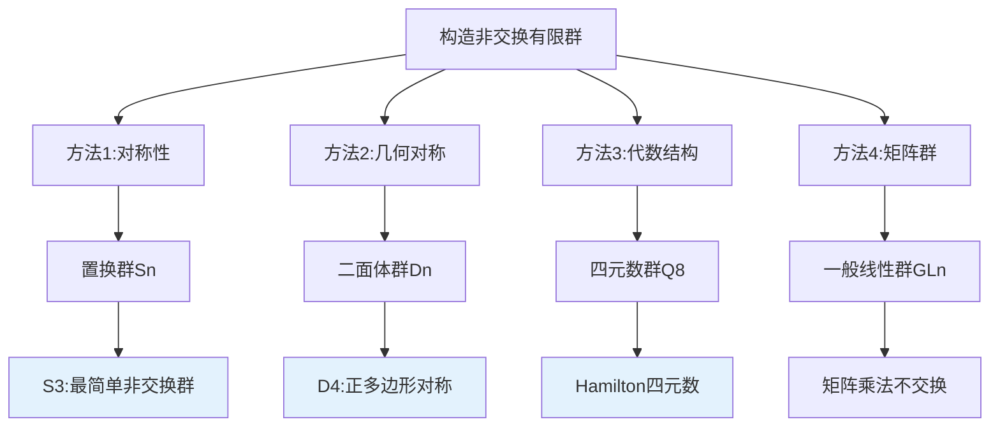
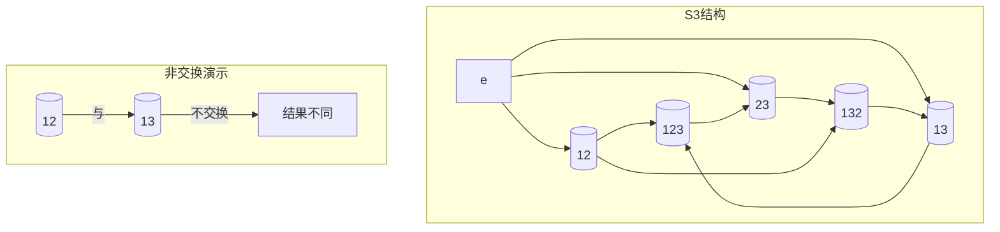
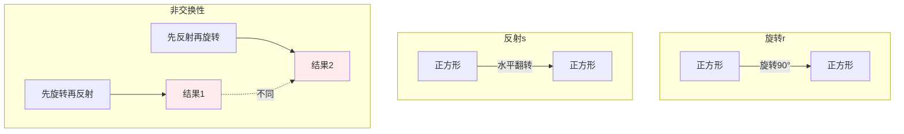
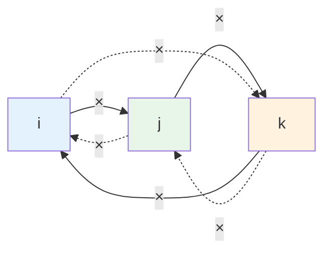
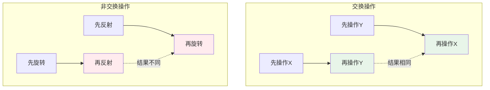
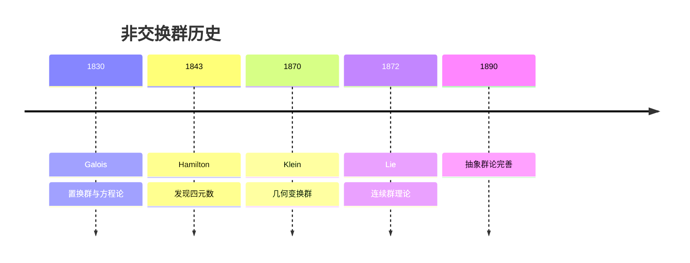
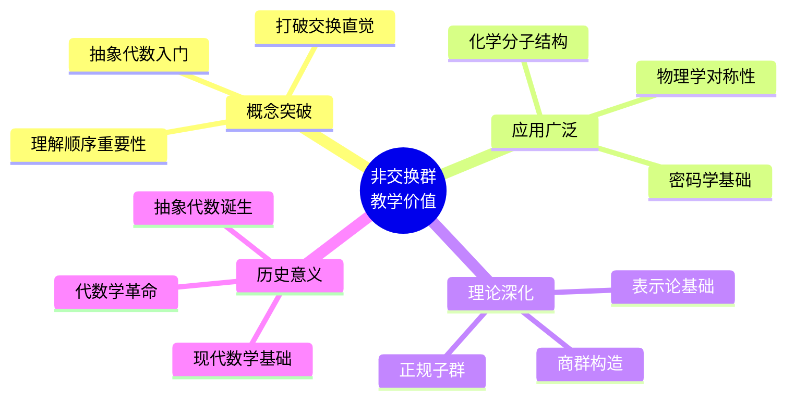

# 非交换有限群的典型例子

## 概述

群的交换性（Abel性质）并非必然。在数学和物理学中，大量重要的群都是**非交换**的。本文档详细介绍非交换有限群的典型例子，帮助理解非交换性的本质及其在数学各分支中的重要作用。

---

## 1. 构造方法详解

### 1.1 典型例子一览

| 群 | 阶数 | 描述 | 非交换性来源 |
|---|-----|------|------------|
| **$S_3$（3次对称群）** | 6 | $\{1,2,3\}$ 的置换 | 置换不可交换 |
| **$D_4$（4阶二面体群）** | 8 | 正方形的对称变换 | 旋转与反射不交换 |
| **$Q_8$（四元数群）** | 8 | 四元数单位群 | $ij = k \neq ji = -k$ |
| **$GL_2(\mathbb{F}_2)$** | 6 | 2×2可逆矩阵群 | 矩阵乘法不交换 |

### 1.2 构造思想



---

## 2. 验证过程详细推导

### 2.1 $S_3$（3次对称群）

#### 基本结构

$$S_3 = \{e, (12), (13), (23), (123), (132)\}$$

共 6 个元素，是**最小的非交换群**。

#### 非交换性验证

**验证**：$(12) \circ (13) \neq (13) \circ (12)$

**计算**：

**左式**：$(12) \circ (13)$

- $1 \xrightarrow{(13)} 3 \xrightarrow{(12)} 3$
- $3 \xrightarrow{(13)} 1 \xrightarrow{(12)} 2$
- $2 \xrightarrow{(13)} 2 \xrightarrow{(12)} 1$
- 结果：$(132)$

**右式**：$(13) \circ (12)$

- $1 \xrightarrow{(12)} 2 \xrightarrow{(13)} 2$
- $2 \xrightarrow{(12)} 1 \xrightarrow{(13)} 3$
- $3 \xrightarrow{(12)} 3 \xrightarrow{(13)} 1$
- 结果：$(123)$

**结论**：$(12)(13) = (132) \neq (123) = (13)(12)$

$S_3$ **非交换**。 $\blacksquare$

#### 群结构图



### 2.2 $D_4$（4阶二面体群）

#### 基本结构

正方形的对称群，包含：

- 4 个旋转：$e, r, r^2, r^3$（$r$ 为逆时针旋转 90°）
- 4 个反射：$s, sr, sr^2, sr^3$（$s$ 为水平轴反射）

$$D_4 = \{e, r, r^2, r^3, s, sr, sr^2, sr^3\}$$

#### 非交换性验证

**基本关系**：

- $r^4 = e$
- $s^2 = e$
- **关键关系**：$srs = r^{-1} = r^3$（即 $sr = r^3s$）

**验证**：$sr \neq rs$

**证明**：

假设 $sr = rs$，则：
$$sr = rs \Rightarrow srs = rss = r$$

但由基本关系 $srs = r^3$，得：
$$r = r^3 \Rightarrow r^2 = e$$

这与 $r$ 的阶为 4 矛盾！

**结论**：$sr \neq rs$，$D_4$ **非交换**。 $\blacksquare$

#### 几何直观



### 2.3 $Q_8$（四元数群）

#### 基本结构

$$Q_8 = \{1, -1, i, -i, j, -j, k, -k\}$$

乘法由以下关系定义：

- $i^2 = j^2 = k^2 = ijk = -1$
- $(-1)^2 = 1$
- $-1$ 与所有元素交换

#### 非交换性验证

**验证**：$ij \neq ji$

**证明**：

由 $i^2 = j^2 = -1$ 和 $ijk = -1$：

$$ij = ij \cdot \frac{k}{k} = \frac{ijk}{k} = \frac{-1}{k} = -k^{-1} = -(-k) = k$$

类似地：
$$ji = ji \cdot \frac{k}{k} = \frac{jik}{k}$$

由 $ijk = -1$，得 $k = (ij)^{-1}(-1) = ji(-1) = -ji$

因此：$ji = -k$

**结论**：$ij = k \neq -k = ji$，$Q_8$ **非交换**。 $\blacksquare$

#### Hamilton 关系



**记忆口诀**：$i \to j \to k \to i$（正向），每步得正；反向得负。

---

## 3. 直观解释

### 3.1 为什么"非交换"？



### 3.2 非交换性的本质

| 群 | 非交换性来源 | 直观理解 |
|---|------------|---------|
| $S_3$ | 置换顺序 | 先换A再换B ≠ 先换B再换A |
| $D_4$ | 旋转与反射 | 旋转后翻转 ≠ 翻转后旋转 |
| $Q_8$ | 三维旋转 | 绕x轴再y轴旋转 ≠ 绕y轴再x轴 |

**核心洞察**：非交换性反映了操作的**顺序依赖性**。

---

## 4. 历史背景

### 4.1 时间线



### 4.2 关键人物

**Évariste Galois (1811-1832)**

- 法国数学家，群论创始人
- 研究多项式方程根式解
- 引入置换群概念
- 发现 $S_n$（$n \geq 3$）的非交换性

**William Rowan Hamilton (1805-1865)**

- 爱尔兰数学家、物理学家
- 1843年发现四元数
- 在都柏林桥上刻下 $i^2 = j^2 = k^2 = ijk = -1$
- 开创非交换代数研究

---

## 5. 教学价值

### 5.1 为什么要学这个？



### 5.2 常见误解澄清

| 误解 | 正确理解 |
|-----|---------|
| "群的运算都交换" | 仅Abel群交换，一般群不交换 |
| "非交换群很复杂" | $S_3$ 仅6个元素，直观易懂 |
| "非交换性很少见" | 有限群中绝大多数是非交换的 |

### 5.3 学习路径

1. **基础理解**：掌握 $S_3$ 和 $D_4$ 的具体结构
2. **抽象化**：理解非交换性的代数本质
3. **应用联系**：了解在物理、化学中的应用
4. **理论拓展**：学习 Sylow 定理、表示论

---

## 6. 相关概念网络

```mermaid
flowchart TB
    subgraph 非交换群例子
        S3[S3]
        D4[D4]
        Q8[Q8]
        GL[GLn]
    end

    subgraph 相关概念
        C[中心Z(G)]
        D[换位子群]
        A[Abel化]
    end

    subgraph 结构理论
        N[正规子群]
        Q[商群]
        S[单群]
    end

    S3 --> C
    S3 --> N
    D4 --> C
    Q8 --> C

    C --> D
    D --> A
    N --> Q

    style S3 fill:#e3f2fd
    style D4 fill:#e8f5e9
    style Q8 fill:#fff3e0
```

---

## 7. 应用与拓展

### 7.1 物理学应用

**量子力学**：

- 角动量算符满足 $[L_i, L_j] = i\hbar \epsilon_{ijk} L_k$
- 非交换性导致不确定性原理

**粒子物理**：

- 规范群 $SU(3) \times SU(2) \times U(1)$ 是非交换的
- 强相互作用由非交换规范场描述

### 7.2 化学应用

**分子对称性**：

- 点群描述分子对称性
- 大多数点群是非交换的
- 决定分子光谱性质

---

## 8. 参考与延伸阅读

- Dummit, D.S. & Foote, R.M. *Abstract Algebra*, Chapter 1-2
- Artin, M. *Algebra*, Chapter 2
- 推荐阅读：《群论及其在物理学中的应用》

---

## 9. 练习与思考

1. **验证练习**：列出 $S_3$ 的完整乘法表，验证非交换性。

2. **构造练习**：证明 $D_3$（正三角形对称群）与 $S_3$ 同构。

3. **深入思考**：找出 $Q_8$ 的所有子群，判断哪些是正规的。

4. **拓展问题**：证明阶数最小的非交换群是6阶（即 $S_3$）。

---

*文档版本：v1.0 | 创建日期：2026-04-09 | 分类：代数学反例 | MSC: 20D99, 20B30*
