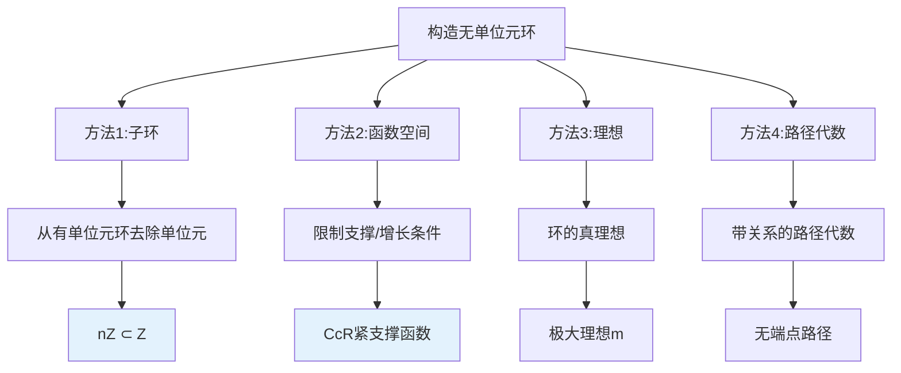
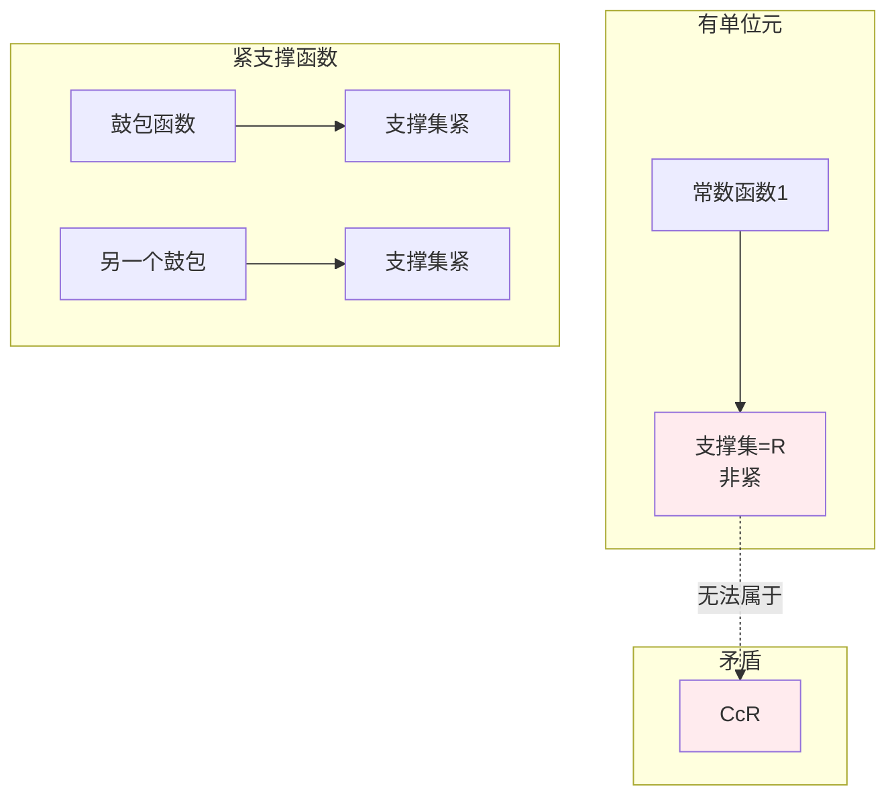
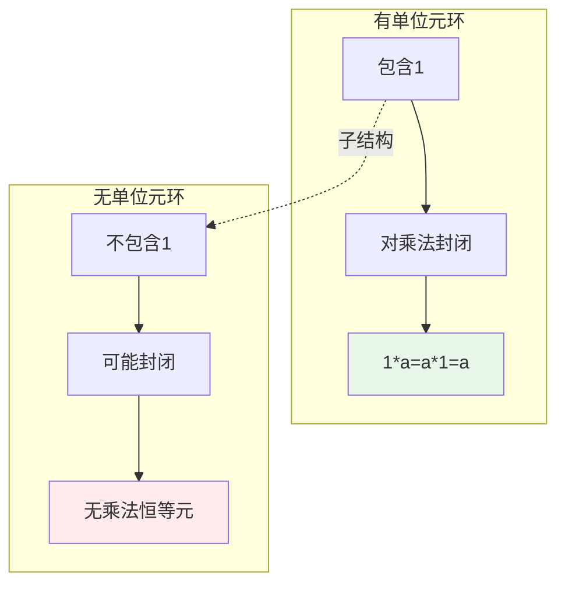
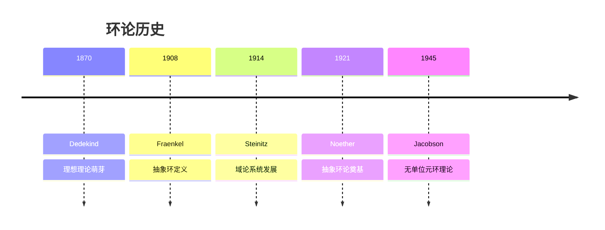
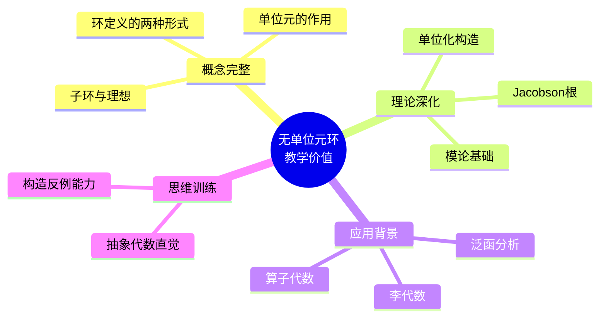
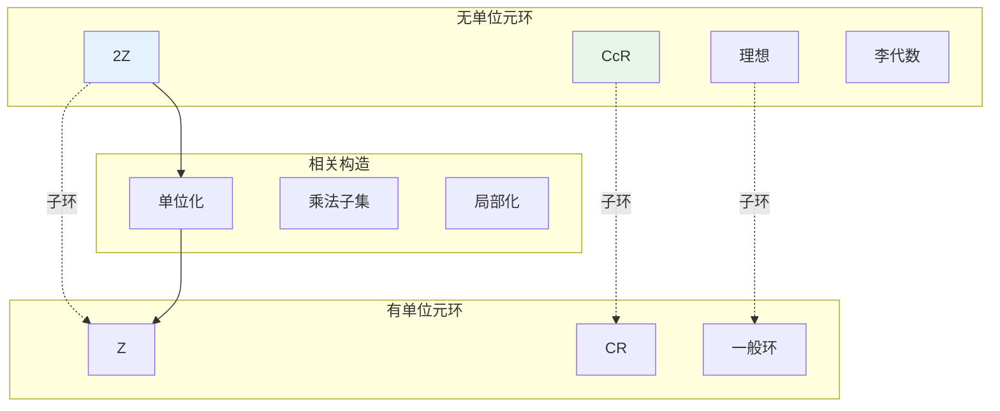

# 无单位元的环

## 概述

在抽象代数中，**环**是一个具有两种运算（加法和乘法）的代数结构。虽然许多重要的环（如整数环 $\mathbb{Z}$、域上的多项式环）都有乘法单位元（1），但存在大量**没有单位元**的环。这类环不仅是理论上的反例，在实际数学中也有重要应用。

---

## 1. 构造方法详解

### 1.1 典型例子一览

| 环 | 描述 | 无单位元原因 |
|---|------|------------|
| **$2\mathbb{Z}$（偶数环）** | 所有偶整数 | 1 是奇数，不在环中 |
| **$C_c(\mathbb{R})$** | 紧支撑连续函数 | 常数函数1无紧支撑 |
| **$\mathfrak{m}$（极大理想）** | 局部环的极大理想 | 幂等元不存在 |
| **李代数** | 换位运算 | 自然定义下无单位元 |

### 1.2 构造思想

---

## 2. 验证过程详细推导

### 2.1 偶数环 $2\mathbb{Z}$

#### 基本结构

$$2\mathbb{Z} = \{2n : n \in \mathbb{Z}\} = \{\ldots, -4, -2, 0, 2, 4, \ldots\}$$

运算：

- 加法：$2m + 2n = 2(m+n)$（封闭）
- 乘法：$(2m)(2n) = 4mn = 2(2mn)$（封闭）

#### 无单位元验证

**定理**：$2\mathbb{Z}$ 没有乘法单位元。

**证明**：

**第一步：假设存在单位元**

假设存在 $e \in 2\mathbb{Z}$ 使得对所有 $a \in 2\mathbb{Z}$，$ea = a$。

**第二步：利用环的结构**

由于 $e \in 2\mathbb{Z}$，存在 $k \in \mathbb{Z}$ 使得 $e = 2k$。

**第三步：导出矛盾**

取 $a = 2$（$2 \in 2\mathbb{Z}$）：
$$ea = 2k \cdot 2 = 4k = 2$$

因此 $4k = 2$，即 $k = 1/2$。

但 $k = 1/2 \notin \mathbb{Z}$，矛盾！

**结论**：$2\mathbb{Z}$ 没有乘法单位元。 $\blacksquare$

#### 直观解释

### 2.2 紧支撑连续函数环 $C_c(\mathbb{R})$

#### 基本结构

$$C_c(\mathbb{R}) = \{f: \mathbb{R} \to \mathbb{R} \mid f \text{ 连续}, \text{supp}(f) \text{ 紧}\}$$

其中支撑集 $\text{supp}(f) = \overline{\{x : f(x) \neq 0\}}$。

#### 无单位元验证

**定理**：$C_c(\mathbb{R})$ 没有乘法单位元。

**证明**：

**第一步：假设存在单位元**

假设存在 $e \in C_c(\mathbb{R})$ 使得对所有 $f \in C_c(\mathbb{R})$，$e \cdot f = f$。

**第二步：分析单位元的性质**

对任意 $x \in \mathbb{R}$，取 $f$ 为在 $x$ 的某邻域内恒为 1 的"鼓包函数"（bump function）。

则 $(e \cdot f)(x) = e(x) \cdot f(x) = e(x) = f(x) = 1$。

**第三步：导出矛盾**

由于 $x$ 是任意的，$e(x) = 1$ 对所有 $x \in \mathbb{R}$ 成立。

因此 $e$ 是常值函数 1，其支撑集为整个 $\mathbb{R}$。

但 $\mathbb{R}$ 不是紧集，故 $e \notin C_c(\mathbb{R})$，矛盾！

**结论**：$C_c(\mathbb{R})$ 没有乘法单位元。 $\blacksquare$

#### 几何直观

### 2.3 矩阵环的理想

#### 基本结构

考虑环 $R = M_{2\times 2}(\mathbb{Z})$（2×2整数矩阵环）。

定义理想：
$$I = \left\{\begin{pmatrix} a & b \\ c & d \end{pmatrix} : a, b, c, d \in 2\mathbb{Z}\right\}$$

即所有元素为偶数的 2×2 矩阵。

#### 无单位元验证

**定理**：$I$ 作为环没有乘法单位元。

**证明**：

**第一步：验证 $I$ 是理想**

- 加法封闭：两个偶数矩阵相加仍为偶数矩阵
- 乘法吸收：偶数矩阵乘以任何整数矩阵仍为偶数矩阵

**第二步：假设存在单位元**

假设存在 $E \in I$ 使得对所有 $A \in I$，$EA = A$。

**第三步：导出矛盾**

取 $A = \begin{pmatrix} 2 & 0 \\ 0 & 0 \end{pmatrix} \in I$

设 $E = \begin{pmatrix} 2a & 2b \\ 2c & 2d \end{pmatrix}$

则：
$$EA = \begin{pmatrix} 4a & 0 \\ 4c & 0 \end{pmatrix} = \begin{pmatrix} 2 & 0 \\ 0 & 0 \end{pmatrix}$$

这要求 $4a = 2$，即 $a = 1/2 \notin \mathbb{Z}$，矛盾！

**结论**：理想 $I$ 没有乘法单位元。 $\blacksquare$

---

## 3. 直观解释

### 3.1 为什么"无单位元"？

### 3.2 核心洞察

| 例子 | 有单位元环 | 无单位元子结构 | 原因 |
|-----|----------|--------------|------|
| $2\mathbb{Z}$ | $\mathbb{Z}$ | 偶数子环 | 单位元1是奇数 |
| $C_c(\mathbb{R})$ | $C(\mathbb{R})$ | 紧支撑子环 | 单位元1无紧支撑 |
| $I \subseteq R$ | $R$ | 理想 | 理想是真子集，不含1 |

**共同模式**：无单位元环通常是**从有单位元环中"挖去"单位元后形成的子结构**。

---

## 4. 历史背景

### 4.1 时间线

### 4.2 关键人物

**Emmy Noether (1882-1935)**

- 德国数学家，抽象代数创始人
- 系统发展环、理想理论
- 主要关注有单位元的环
- 她的工作为后来研究无单位元环奠定基础

**Nathan Jacobson (1910-1999)**

- 美国数学家
- 1945年出版《环论》
- 系统研究无单位元环
- Jacobson 根、Jacobson 环

---

## 5. 教学价值

### 5.1 为什么要学这个？

### 5.2 常见误解澄清

| 误解 | 正确理解 |
|-----|---------|
| "所有环都有单位元" | 环可以无单位元，有些作者区分 rng（无单位）和 ring（有单位） |
| "无单位元不重要" | 泛函分析、李代数中常见 |
| "子环继承单位元" | 子环可能不含原环的单位元 |

### 5.3 现代发展

**单位化（Unitization）**：

给定无单位元环 $R$，可构造有单位元环：
$$R^1 = R \times \mathbb{Z}$$

乘法定义为：$(r, n)(s, m) = (rs + ns + mr, nm)$

单位元为 $(0, 1)$。

---

## 6. 相关概念网络

---

## 7. 应用与拓展

### 7.1 泛函分析

**Banach 代数**：

- $L^1(\mathbb{R})$ 卷积代数无单位元
- 使用近似单位元（approximate identity）

**C*-代数**：

- 某些 C*-代数自然无单位元
- 紧算子代数 $\mathcal{K}(H)$ 无单位元

### 7.2 李代数

李代数 $(\mathfrak{g}, [,])$ 自然无单位元：

- 换位运算 $[x, y] = xy - yx$
- 不存在 $e$ 使得 $[e, x] = x$ 对所有 $x$ 成立

---

## 8. 参考与延伸阅读

- Jacobson, N. (1945). "Structure theory of simple rings without finiteness assumptions."
- Lam, T.Y. *A First Course in Noncommutative Rings*
- 推荐阅读：《近世代数》聂灵沼、丁石孙

---

## 9. 练习与思考

1. **验证练习**：证明 $3\mathbb{Z}$、$n\mathbb{Z}$（$n > 1$）都没有单位元。

2. **构造练习**：构造 $C_0(\mathbb{R})$（无穷远处趋于零的连续函数环）并证明其无单位元。

3. **深入思考**：若 $R$ 是无单位元环，$R^2 = R$ 是否成立？研究幂等环。

4. **拓展问题**：研究 Dorroh 单位化构造及其性质。

---

*文档版本：v1.0 | 创建日期：2026-04-09 | 分类：代数学反例 | MSC: 16B99, 16D25*
