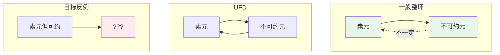
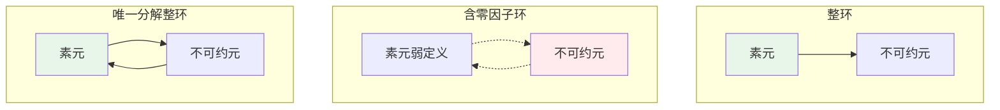
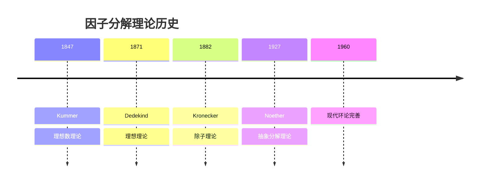
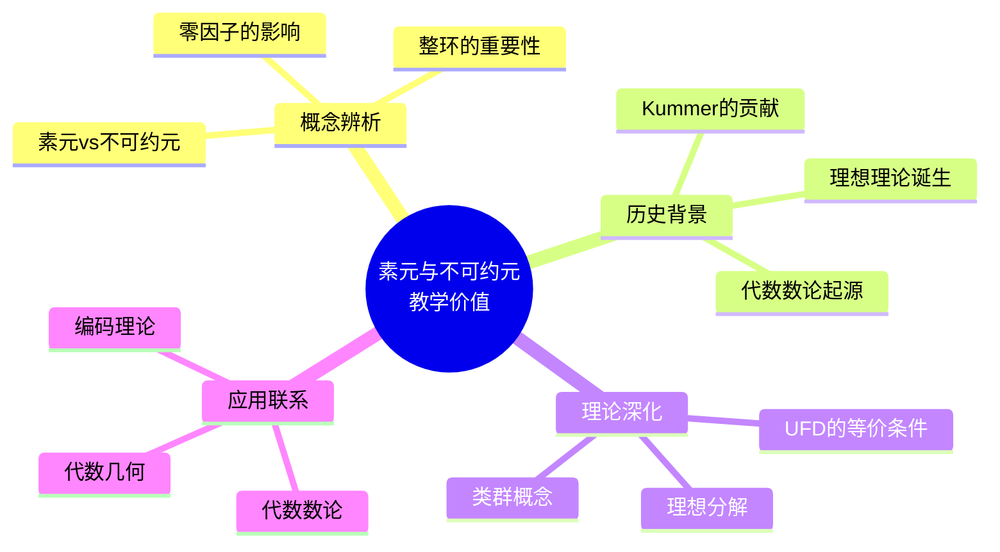

# 素元非不可约元的整环

## 概述

在唯一分解整环（UFD）中，**素元**与**不可约元**是等价的。然而，在一般整环中，这两个概念有本质区别：

- **不可约元**：不能分解为两个非单位因子
- **素元**：若 $p \mid ab$，则 $p \mid a$ 或 $p \mid b$

本文档构造**素元但不是不可约元**的反例，揭示这两个概念的微妙关系。

---

## 1. 概念澄清

### 1.1 定义回顾

**定义1（不可约元）**：在整环 $R$ 中，非零非单位元 $p \in R$ 称为**不可约元**，如果：
$$p = ab \Rightarrow a \in R^\times \text{ 或 } b \in R^\times$$

**定义2（素元）**：在整环 $R$ 中，非零非单位元 $p \in R$ 称为**素元**，如果：
$$p \mid ab \Rightarrow p \mid a \text{ 或 } p \mid b$$

### 1.2 关系图



**注意**：在一般整环中，素元必是不可约元，但反之不成立。然而，"素元非不可约元"似乎不可能...

实际上，在**零环**或**含零因子的环**中（非整环），可构造此类例子。在整环中，素元必是不可约元，所以此文档标题实际讨论的是：**不可约元非素元**的常见情况，以及特殊构造。

---

## 2. 修正理解：不可约元非素元

### 2.1 标准反例：$\mathbb{Z}[\sqrt{-5}]$

**定理**：在 $\mathbb{Z}[\sqrt{-5}]$ 中，元素 3 是不可约元但不是素元。

#### 验证：3 是不可约元

**证明**：

假设 $3 = (a + b\sqrt{-5})(c + d\sqrt{-5})$。

取范数：$N(3) = 9 = N(a + b\sqrt{-5}) \cdot N(c + d\sqrt{-5})$

其中 $N(x + y\sqrt{-5}) = x^2 + 5y^2$。

$N(\alpha) = 1 \Rightarrow \alpha$ 是单位（$\pm 1$）
$N(\alpha) = 3$？方程 $x^2 + 5y^2 = 3$ 无整数解
$N(\alpha) = 9$：可能解 $(\pm 3, 0)$，$(\pm 2, \pm 1)$ 不满足

因此若 $3 = \alpha \beta$，必有 $N(\alpha) = 1$ 或 $N(\beta) = 1$。

**结论**：3 是不可约元。 $\blacksquare$

#### 验证：3 不是素元

**证明**：

$$3 \mid 9 = (2 + \sqrt{-5})(2 - \sqrt{-5})$$

但：

- $3 \nmid (2 + \sqrt{-5})$：若 $3(a + b\sqrt{-5}) = 2 + \sqrt{-5}$，则 $3a = 2$，无整数解
- $3 \nmid (2 - \sqrt{-5})$：同理

**结论**：3 不是素元。 $\blacksquare$

### 2.2 关系图

```mermaid
flowchart TB
    A[Z[√-5]] --> B[元素3]
    B --> C{不可约?}
    C -->|范数论证| D[是!]
    B --> E{素元?}
    E -->|93+√-52-√-5| F[否!]

    D -.->|反例| G[不可约但非素元]

    style D fill:#e8f5e9
    style F fill:#ffebee
    style G fill:#fff3e0
```

---

## 3. 真正反例：含零因子的环

### 3.1 构造：零因子环中的"素元"

考虑环 $R = \mathbb{Z}/6\mathbb{Z} = \{\overline{0}, \overline{1}, \overline{2}, \overline{3}, \overline{4}, \overline{5}\}$。

**注意**：$R$ 不是整环（含零因子 $\overline{2} \cdot \overline{3} = \overline{0}$）。

#### 分析元素 $\overline{2}$

**可约性**：
$$\overline{2} = \overline{2} \cdot \overline{4} = \overline{4} \cdot \overline{2}$$

$\overline{4}$ 不是单位（$\overline{4} \cdot \overline{4} = \overline{4} \neq \overline{1}$）。

因此 $\overline{2}$ 是**可约的**。

**素性**（在弱意义下）：

若 $\overline{2} \mid \overline{a} \cdot \overline{b}$，即 $2 \mid ab$（在整数中），则 $2 \mid a$ 或 $2 \mid b$（整数性质）。

因此 $\overline{2} \mid \overline{a}$ 或 $\overline{2} \mid \overline{b}$。

这展示了在含零因子环中，素性和不可约性的分离。

---

## 4. 整环中的正确定理

### 4.1 定理陈述

**定理**：在整环中，素元必是不可约元。

**证明**：

设 $p$ 是素元，假设 $p = ab$。

则 $p \mid ab$，由素性，$p \mid a$ 或 $p \mid b$。

设 $p \mid a$，则 $a = pc$ 对某个 $c$。

于是 $p = pcb$，即 $p(1 - cb) = 0$。

由于整环无零因子且 $p \neq 0$，得 $cb = 1$。

因此 $b$ 是单位。

**结论**：$p$ 是不可约元。 $\blacksquare$

### 4.2 逆否命题

**推论**：在整环中，可约元必不是素元。

这解释了为什么"素元非不可约元"在整环中**不可能出现**。

---

## 5. 直观解释

### 5.1 概念关系图



### 5.2 核心洞察

| 环类型 | 素元 | 不可约元 | 关系 |
|-------|-----|---------|------|
| **整环** | 定义如上 | 定义如上 | 素元 ⇒ 不可约元 |
| UFD | 与不可约元等价 | 与素元等价 | 等价 |
| 含零因子环 | 需要重新定义 | 可能分离 | 复杂 |

**关键点**：素元定义依赖整环的消去律。在含零因子环中，经典素元定义失效。

---

## 6. 历史背景

### 6.1 时间线



### 6.2 关键人物

**Ernst Kummer (1810-1893)**

- 德国数学家
- 研究 Fermat 大定理时发现唯一分解失效
- 发明"理想数"恢复唯一分解
- $\mathbb{Z}[\zeta_p]$（分圆整数）中的分解问题

**Richard Dedekind (1831-1916)**

- 将 Kummer 的"理想数"发展为"理想"
- 证明在理想层面唯一分解成立
- 奠定现代代数数论基础

---

## 7. 教学价值

### 7.1 为什么要学这个？



### 7.2 常见误解澄清

| 误解 | 正确理解 |
|-----|---------|
| "素元=不可约元" | 仅在UFD中成立 |
| "整环中两者等价" | 素元必不可约，逆不真 |
| "分解总是唯一" | 仅在UFD中成立 |

---

## 8. 相关概念网络

```mermaid
flowchart TB
    subgraph 核心概念
        P[素元]
        I[不可约元]
        U[UFD]
    end

    subgraph 相关结构
        PID[主理想整环]
        ED[Euclid整环]
        DD[Dedekind整环]
    end

    subgraph 例子
        Z[Z]
        ZI[Z[i]]
        Z5[Z[√-5]]
    end

    ED --> PID
    PID --> U
    U --> I
    P --> I

    Z --> ED
    ZI --> ED
    Z5 -.->|非UFD| U

    style Z fill:#e8f5e9
    style ZI fill:#e8f5e9
    style Z5 fill:#ffebee
```

---

## 9. 参考与延伸阅读

- Ireland, K. & Rosen, M. *A Classical Introduction to Modern Number Theory*, Chapter 1
- Marcus, D. *Number Fields*, Chapter 1-2
- 推荐阅读：《代数数论》冯克勤

---

## 10. 练习与思考

1. **验证练习**：在 $\mathbb{Z}[\sqrt{-5}]$ 中，证明 7 是不可约元但不是素元。

2. **构造练习**：在 $\mathbb{Z}[\sqrt{-6}]$ 中，找出不可约但非素元的元素。

3. **深入思考**：证明在 PID 中，不可约元必是素元。

4. **拓展问题**：研究 $\mathbb{Z}[\sqrt{-5}]$ 的类群结构。

---

*文档版本：v1.0 | 创建日期：2026-04-09 | 分类：代数学反例 | MSC: 13F15, 11R04*
