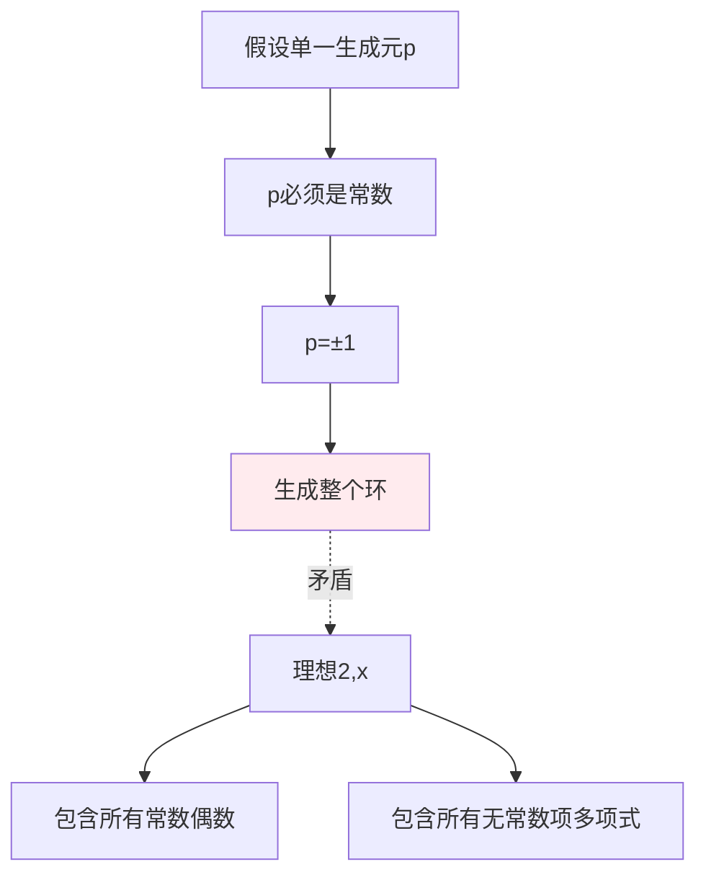
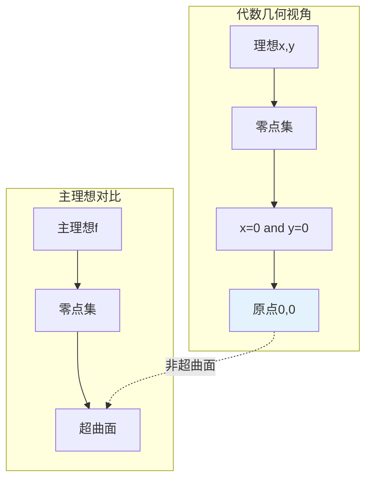
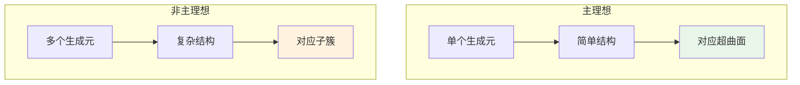
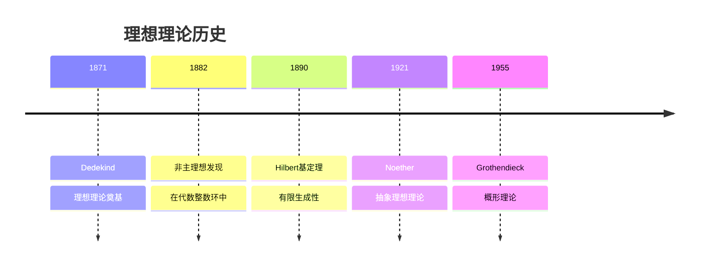
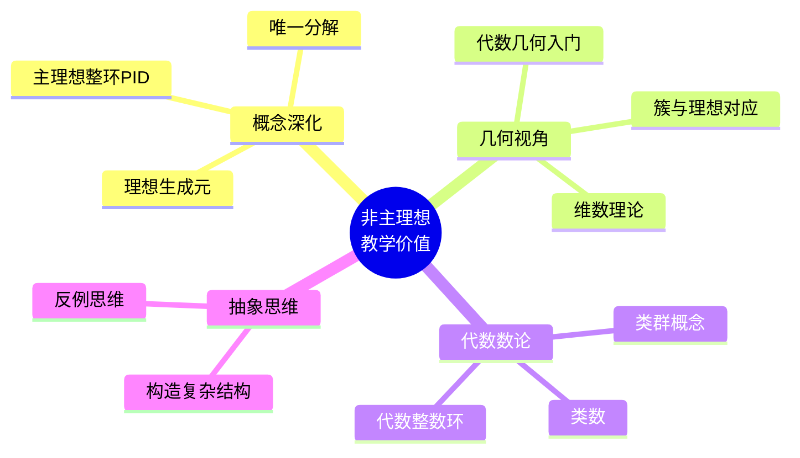

# 非主理想的理想

## 概述

在环论中，**主理想**是由单个元素生成的理想。虽然整数环 $\mathbb{Z}$ 和域上多项式环 $F[x]$ 中的每个理想都是主理想，但在更一般的环中，存在**不能由单个元素生成**的理想。本文档构造并分析非主理想的典型例子。

---

## 1. 构造方法详解

### 1.1 典型例子一览

| 环 | 理想 | 描述 | 非主原因 |
|---|-----|------|---------|
| **$\mathbb{Z}[x]$** | $(2, x)$ | 由2和x生成 | 无法单一生成 |
| **$\mathbb{Z}[\sqrt{-5}]$** | $(2, 1+\sqrt{-5})$ | 特定理想 | 非主理想整环 |
| **$k[x,y]$** | $(x, y)$ | 二元多项式 | 几何上对应原点 |
| **$\mathbb{Z}^2$** | 对角子模 | 直积环 | 结构复杂性 |

### 1.2 构造思想

```mermaid
flowchart TD
    A[构造非主理想] --> B[方法1:多元多项式]
    B --> C[kx1...xn, n≥2]
    C --> C1[x,y in kx,y]

    A --> D[方法2:代数整数环]
    D --> E[非UFD的整数环]
    E --> E1[Z[√-5]]

    A --> F[方法3:直积环]
    F --> G[R × R]
    G --> G1[对角理想]

    A --> H[方法4:形式幂级数]
    H --> I[多元幂级数环]
    I --> I1[k[[x,y]]]

    style C1 fill:#e3f2fd
    style E1 fill:#e3f2fd
```

---

## 2. 验证过程详细推导

### 2.1 $\mathbb{Z}[x]$ 中的理想 $(2, x)$

#### 基本结构

$$I = (2, x) = \{2f(x) + xg(x) : f, g \in \mathbb{Z}[x]\}$$

即所有常数项为偶数的多项式。

#### 非主理想验证

**定理**：$(2, x)$ 不是 $\mathbb{Z}[x]$ 的主理想。

**证明**：

**第一步：反设为主理想**

假设 $(2, x) = (p(x))$ 对某个 $p(x) \in \mathbb{Z}[x]$。

**第二步：分析生成元**

由于 $2 \in (p(x))$，存在 $f(x)$ 使得 $2 = p(x)f(x)$。

因此 $\deg(p) + \deg(f) = \deg(2) = 0$，得 $\deg(p) = 0$。

即 $p(x) = c$ 是常数。

**第三步：导出矛盾**

由于 $x \in (p(x)) = (c)$，存在 $g(x)$ 使得 $x = c \cdot g(x)$。

这要求 $c \mid 1$（$x$ 的系数），故 $c = \pm 1$。

但 $(\pm 1) = \mathbb{Z}[x]$，而 $(2, x) \neq \mathbb{Z}[x]$（因为 $1 \notin (2, x)$）。

**结论**：$(2, x)$ 不是主理想。 $\blacksquare$

#### 直观解释



### 2.2 $\mathbb{Z}[\sqrt{-5}]$ 中的理想 $(2, 1+\sqrt{-5})$

#### 基本结构

$$I = (2, 1+\sqrt{-5}) = \{2\alpha + (1+\sqrt{-5})\beta : \alpha, \beta \in \mathbb{Z}[\sqrt{-5}]\}$$

#### 非主理想验证

**定理**：$I = (2, 1+\sqrt{-5})$ 不是主理想。

**证明**：

**第一步：分析范数**

对 $\alpha = a + b\sqrt{-5} \in \mathbb{Z}[\sqrt{-5}]$，范数 $N(\alpha) = a^2 + 5b^2$。

**第二步：反设为主理想**

假设 $I = (\alpha)$。

由于 $2 \in (\alpha)$，有 $\alpha \mid 2$，故 $N(\alpha) \mid N(2) = 4$。

可能值：$N(\alpha) \in \{1, 2, 4\}$。

**第三步：排除可能性**

- $N(\alpha) = 1$：$\alpha$ 是单位，$I = \mathbb{Z}[\sqrt{-5}]$。但 $1 \notin I$（验证略），矛盾。

- $N(\alpha) = 2$：方程 $a^2 + 5b^2 = 2$ 无整数解。

- $N(\alpha) = 4$：则 $\alpha = \pm 2$ 或 $\alpha = \pm(2)$（单位倍）。

若 $(\alpha) = (2)$，则 $1+\sqrt{-5} \in (2)$，即 $1+\sqrt{-5} = 2\beta$。

设 $\beta = c + d\sqrt{-5}$，则：
$$1 + \sqrt{-5} = 2c + 2d\sqrt{-5}$$

这要求 $1 = 2c$，无整数解，矛盾。

**结论**：$I$ 不是主理想。 $\blacksquare$

### 2.3 $k[x,y]$ 中的理想 $(x, y)$

#### 基本结构

$$I = (x, y) = \{xf(x,y) + yg(x,y) : f, g \in k[x,y]\}$$

即所有常数项为零的多项式。

#### 非主理想验证

**定理**：$(x, y)$ 不是 $k[x,y]$ 的主理想。

**证明**：

**第一步：反设为主理想**

假设 $(x, y) = (p(x,y))$。

**第二步：分析生成元**

由于 $x \in (p)$，有 $p \mid x$。类似 $p \mid y$。

**第三步：导出矛盾**

若 $p \mid x$ 且 $p \mid y$，则 $p$ 是 $x$ 和 $y$ 的公因子。

但 $\gcd(x, y) = 1$（在 $k[x,y]$ 中互素）。

因此 $p$ 必须是单位，$(p) = k[x,y]$。

但 $1 \notin (x, y)$（$1$ 无常数项为零的表示），矛盾。

**结论**：$(x, y)$ 不是主理想。 $\blacksquare$

#### 几何解释



**几何意义**：$(x, y)$ 对应原点 $\{(0,0)\}$，这是一个点（余维2），不是超曲面（余维1），因此不能由单个方程定义。

---

## 3. 直观解释

### 3.1 为什么"非主"？



### 3.2 核心洞察

| 理想 | 生成元数量 | 几何意义 | 代数复杂度 |
|-----|----------|---------|----------|
| $(f)$ | 1 | 超曲面 | 低 |
| $(x, y)$ | 2 | 点（余维2） | 中 |
| $(2, x)$ | 2 | 特殊结构 | 高 |

**关键理解**：生成元的数量反映了理想的"复杂度"。多元多项式环中，大多数理想需要多个生成元。

---

## 4. 历史背景

### 4.1 时间线



### 4.2 关键人物

**Richard Dedekind (1831-1916)**

- 德国数学家
- 1871年引入"理想"概念
- 解决唯一分解失效问题
- 在代数数域的理想理论中发现非主理想

**David Hilbert (1862-1943)**

- 证明 Hilbert 基定理：多项式环中每个理想有限生成
- 1890年不变量理论工作
- 为交换代数奠定基础

---

## 5. 教学价值

### 5.1 为什么要学这个？



### 5.2 常见误解澄清

| 误解 | 正确理解 |
|-----|---------|
| "所有理想都是主的" | 仅在PID中成立 |
| "有限生成=主理想" | 有限生成可以有多个生成元 |
| "多项式环都是PID" | 一元是，多元不是 |

---

## 6. 相关概念网络

```mermaid
flowchart TB
    subgraph 理想类型
        P[主理想]
        F[有限生成理想]
        I[一般理想]
    end

    subgraph 特殊环
        PID[主理想整环]
        UFD[唯一分解整环]
        NOE[Noether环]
    end

    subgraph 例子
        Z[Z]
        ZX[Zx]
        Z5[Z[√-5]]
        KXY[kx,y]
    end

    P --> F
    F --> I

    PID --> P
    UFD --> F
    NOE --> F

    Z --> PID
    ZX -.->|非PID| PID
    Z5 -.->|非UFD| UFD
    KXY --> NOE

    style Z fill:#e8f5e9
    style ZX fill:#ffebee
    style Z5 fill:#ffebee
```

---

## 7. 应用与拓展

### 7.1 代数几何

**Hilbert 零点定理**：

- 代数闭域上，仿射簇与根式理想一一对应
- 非主理想对应"更复杂"的几何对象

**例子**：$(x, y) \subseteq \mathbb{C}[x,y]$ 对应原点 $\{(0,0)\} \subseteq \mathbb{A}^2$。

### 7.2 代数数论

**类群**：

- 数域 $K$ 的整数环 $\mathcal{O}_K$ 中，分式理想模主理想形成**类群** $Cl(K)$
- 类群衡量"非主理想的程度"
- 类数 $h_K = |Cl(K)|$

**例子**：$\mathbb{Z}[\sqrt{-5}]$ 的类数为 2，存在非主理想。

---

## 8. 参考与延伸阅读

- Atiyah, M.F. & Macdonald, I.G. *Introduction to Commutative Algebra*, Chapter 1-2
- Reid, M. *Undergraduate Commutative Algebra*
- 推荐阅读：《交换代数》冯克勤

---

## 9. 练习与思考

1. **验证练习**：证明在 $\mathbb{Z}[x]$ 中，$(3, x+1)$ 不是主理想。

2. **构造练习**：在 $\mathbb{Z}[\sqrt{-6}]$ 中构造一个非主理想。

3. **深入思考**：证明在 Noether 环中，每个理想都有限生成。

4. **拓展问题**：计算 $\mathbb{Z}[\sqrt{-5}]$ 的类群。

---

*文档版本：v1.0 | 创建日期：2026-04-09 | 分类：代数学反例 | MSC: 13A15, 13F10*
