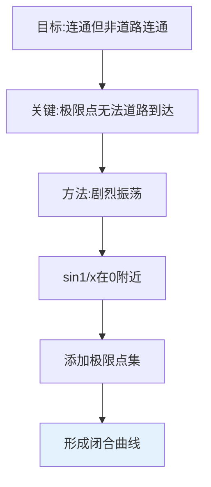
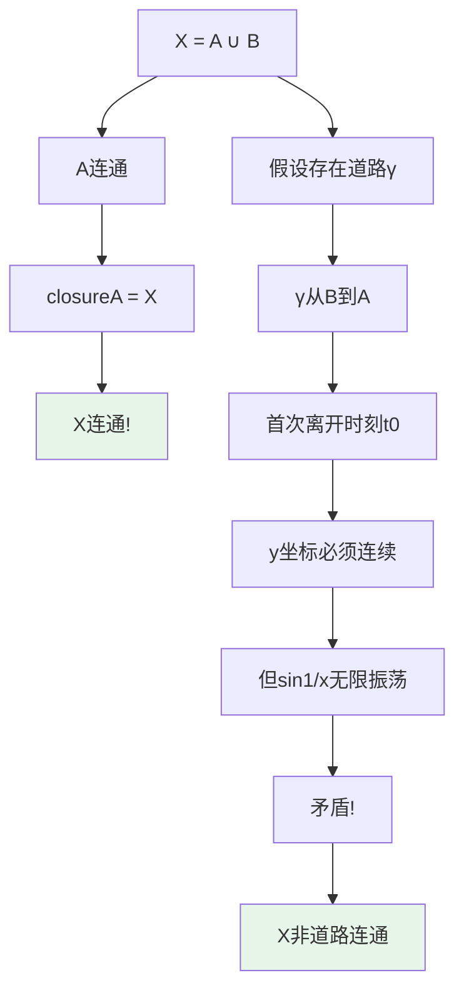
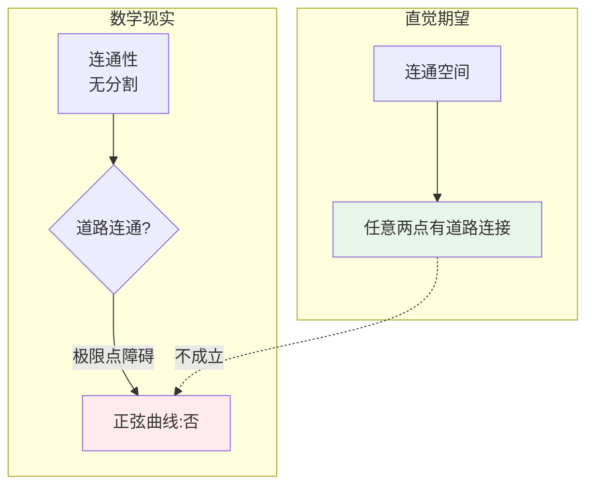
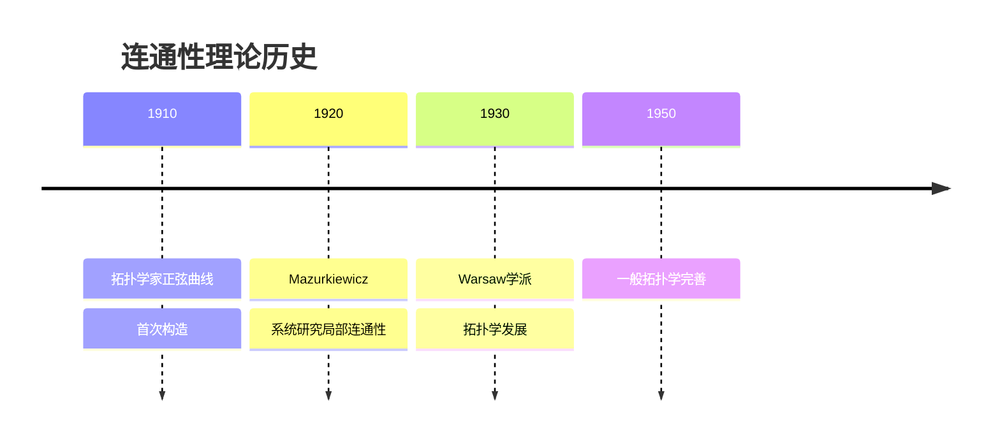
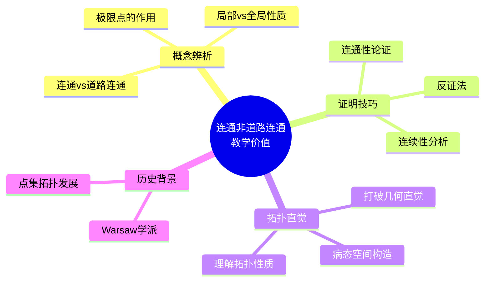
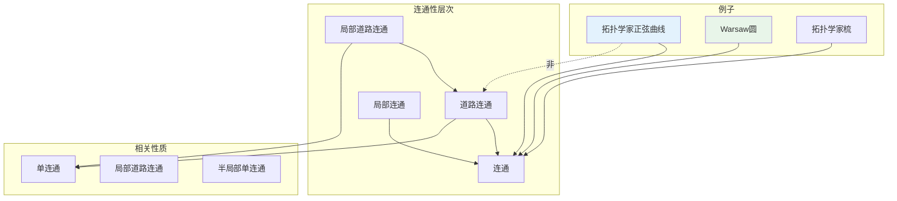

# 连通但非道路连通的空间

## 概述

在拓扑学中，**连通性**与**道路连通性**是两个密切相关但不等价的概念。道路连通必然连通，但存在**连通却不道路连通**的空间。本文档详细介绍这类反例中最经典的例子——拓扑学家的正弦曲线。

---

## 1. 构造方法详解

### 1.1 经典例子：拓扑学家的正弦曲线

**定义**：设 $A = \{(x, \sin(1/x)) : 0 < x \leq 1\}$，$B = \{(0, y) : -1 \leq y \leq 1\}$。

拓扑学家的正弦曲线：
$$X = A \cup B$$

```mermaid
graph TB
    subgraph 构造过程
        P1[开区间0,1上的sin1/x] --> P2[在x=0处剧烈振荡]
        P2 --> P3[添加垂直线段B]
        P3 --> P4[得到闭合曲线X]
    end

    subgraph 几何直观
        G1[x→0时<br>曲线无限振荡] --> G2[在原点处<br>形成"梳齿"]
    end
```

### 1.2 变体形式

| 变体 | 定义 | 特点 |
|-----|------|------|
| **闭合正弦曲线** | $X = A \cup B$ | 连通但非道路连通 |
| **开正弦曲线** | $A$ 本身 | 道路连通 |
| **拓扑学家的梳** | 添加更多"齿" | 更复杂结构 |
| **Warsaw 圆** | 特定变体 | 单连通研究 |

### 1.3 构造思想



---

## 2. 验证过程详细推导

### 2.1 连通性证明

**定理**：拓扑学家的正弦曲线 $X$ 是连通的。

**证明**：

**第一步：分析各部分连通性**

- $A = \{(x, \sin(1/x)) : 0 < x \leq 1\}$ 是 $(0,1]$ 在连续映射 $x \mapsto (x, \sin(1/x))$ 下的像
- $(0,1]$ 连通，连续像连通，故 $A$ 连通

**第二步：分析闭包**

$\overline{A} = A \cup B = X$

因为当 $x \to 0^+$ 时，$\sin(1/x)$ 在 $[-1, 1]$ 中稠密振荡。

**第三步：应用连通性定理**

**定理**：若 $A$ 连通，则 $\overline{A}$ 连通。

因此 $X = \overline{A}$ 连通。 $\blacksquare$

### 2.2 非道路连通性证明

**定理**：拓扑学家的正弦曲线 $X$ 不是道路连通的。

**证明**：

**第一步：反设存在道路**

假设存在连续映射 $\gamma: [0,1] \to X$ 使得：

- $\gamma(0) = (0, 0) \in B$
- $\gamma(1) = (1, \sin 1) \in A$

**第二步：分析道路结构**

设 $\gamma(t) = (x(t), y(t))$。

由于 $\gamma(0) = (0, 0)$，$x(0) = 0$。

由于 $\gamma(1) = (1, \sin 1)$，$x(1) = 1$。

**第三步：利用连续性导出矛盾**

设 $t_0 = \sup\{t : x(t) = 0\}$（首次离开 $B$ 的时刻）。

由连续性，$x(t_0) = 0$，即 $\gamma(t_0) \in B$。

对 $t > t_0$，$x(t) > 0$，故 $\gamma(t) \in A$。

**第四步：分析 $y$ 坐标的性质**

由于 $\gamma$ 连续，$y(t)$ 在 $t_0$ 处连续。

但对任意 $\varepsilon > 0$，当 $t \in (t_0, t_0 + \varepsilon)$：

- $\gamma(t) \in A$，故 $y(t) = \sin(1/x(t))$
- 当 $t \to t_0^+$，$x(t) \to 0^+$，$\sin(1/x(t))$ 在 $[-1, 1]$ 中无限振荡

这与 $y(t)$ 在 $t_0$ 处的连续性矛盾！

**结论**：不存在从 $B$ 到 $A$ 的连续道路，$X$ 非道路连通。 $\blacksquare$

### 2.3 证明流程图



---

## 3. 直观解释

### 3.1 为什么"病态"？



### 3.2 核心洞察：极限点的"不可达性"

| 概念 | 含义 | 正弦曲线中的表现 |
|-----|------|----------------|
| **连通** | 不能分割为两个非空开集 | $A$ 和 $B$ "粘连"在一起 |
| **道路连通** | 任意两点可用连续曲线连接 | $B$ 中的点无法从 $A$ 道路到达 |

**关键理解**：

- 虽然 $B$ 中的每一点都是 $A$ 的极限点（拓扑上"粘连"）
- 但要从 $A$ "走到" $B$，必须经过无限振荡区域
- 连续性要求不能"瞬移"，但无限振荡阻止了连续过渡

### 3.3 几何直观

想象一条在 $x = 0$ 附近无限密集的波浪线：

- 在原点左侧，你站在垂直线段 $B$ 上
- 在原点右侧，是无限振荡的曲线 $A$
- 你无法连续地从 $B$ "跨"到 $A$，因为一旦踏入 $A$，你将在无限短的时间内经历无限次振荡

---

## 4. 历史背景

### 4.1 时间线



### 4.2 关键人物

**Polish 拓扑学派**

- Warsaw 学派对拓扑学基础做出重大贡献
- Mazurkiewicz、Sierpiński、Kuratowski 等人
- 发展了点集拓扑学的严格理论

**Kazimierz Kuratowski (1896-1980)**

- Polish 数学家
- 《拓扑学》经典教材作者
- 系统阐述连通性与道路连通性的区别

---

## 5. 教学价值

### 5.1 为什么要学这个？



### 5.2 常见误解澄清

| 误解 | 正确理解 |
|-----|---------|
| "连通=道路连通" | 仅在局部道路连通空间中成立 |
| "闭包保持道路连通" | 闭包保持连通，不一定保持道路连通 |
| "极限点可用道路到达" | 拓扑粘连 ≠ 道路可达 |

---

## 6. 相关概念网络



---

## 7. 变体与拓展

### 7.1 Warsaw 圆

$$W = X \cup \{(x, -1) : 0 \leq x \leq 1\} \cup \{(1, y) : -1 \leq y \leq \sin 1\}$$

**性质**：

- 连通但不道路连通
- **单连通**（基本群平凡）
- 有趣的同伦性质

### 7.2 拓扑学家的梳

$$Y = \{(x, \sin(1/x)) : 0 < x \leq 1\} \cup \{(0, y) : -1 \leq y \leq 1\} \cup \{(x, 0) : 0 \leq x \leq 1\}$$

更复杂的结构，展示了多种病态性质。

---

## 8. 参考与延伸阅读

- Hocking, J.G. & Young, G.S. *Topology*, Chapter 3
- Munkres, J. *Topology*, Chapter 3 (第24-25节)
- Steen, L.A. & Seebach, J.A. *Counterexamples in Topology*

---

## 9. 练习与思考

1. **验证练习**：证明开正弦曲线 $A = \{(x, \sin(1/x)) : 0 < x \leq 1\}$ 是道路连通的。

2. **构造练习**：构造一个空间，它道路连通但不局部连通。

3. **深入思考**：证明拓扑学家的正弦曲线是紧致的。

4. **拓展问题**：研究 Warsaw 圆的基本群为什么平凡。

---

*文档版本：v1.0 | 创建日期：2026-04-09 | 分类：拓扑学反例 | MSC: 54D05, 54F15*
