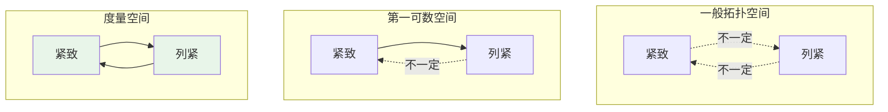
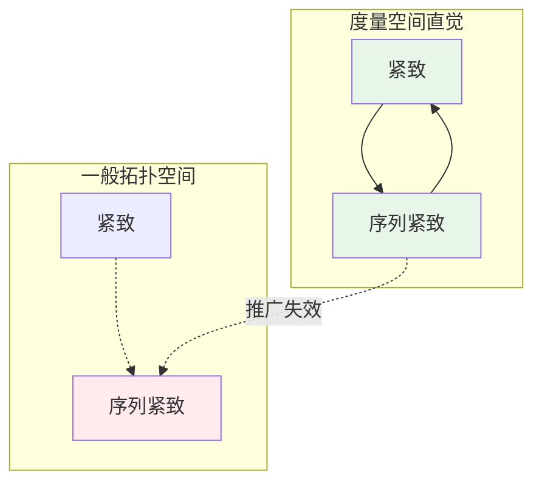
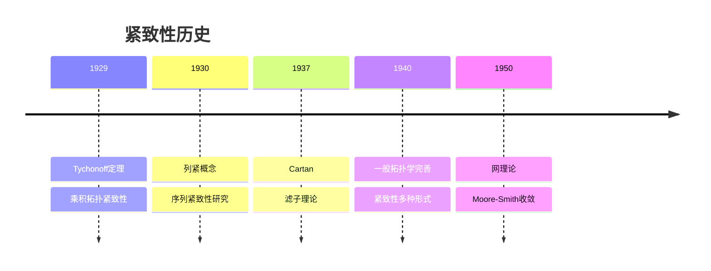
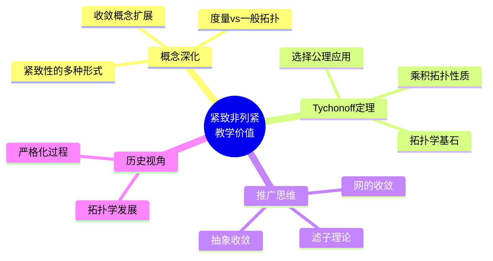
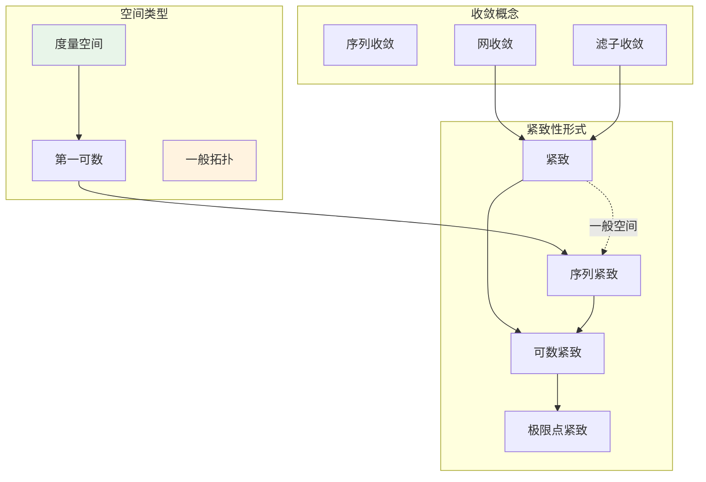

# 紧致但非列紧的空间

## 概述

在度量空间中，**紧致性**与**列紧性**（序列紧致性）是等价的。然而，在一般拓扑空间中，这两个概念分道扬镳。本文档构造紧致但非列紧的拓扑空间，揭示这两种紧致性概念的本质差异。

---

## 1. 概念背景

### 1.1 定义回顾

**定义1（紧致）**：拓扑空间 $X$ 称为**紧致**，如果每个开覆盖都有有限子覆盖。

**定义2（列紧）**：拓扑空间 $X$ 称为**列紧**（或序列紧致），如果每个序列都有收敛子序列。

### 1.2 度量空间中的等价性

**定理**：在度量空间中，紧致 $\Leftrightarrow$ 列紧。

**证明思路**：

- 度量空间是第一可数的
- 第一可数空间中，紧致 $\Rightarrow$ 列紧
- 度量空间中，列紧 $\Rightarrow$ 全有界且完备 $\Rightarrow$ 紧致

### 1.3 一般拓扑空间中的关系



---

## 2. 构造方法详解

### 2.1 经典反例：$[0,1]^{[0,1]}$ 带乘积拓扑

**构造**：考虑不可数无限乘积空间
$$X = [0,1]^{[0,1]} = \{f: [0,1] \to [0,1]\}$$

赋予**乘积拓扑**（Tychonoff 拓扑）。

### 2.2 构造思想

```mermaid
flowchart TD
    A[目标:紧致但非列紧] --> B[关键:不可数乘积]
    B --> C[方法:Tychonoff定理]
    C --> D[[0,1]^I, I不可数]
    D --> E[紧致由Tychonoff保证]
    E --> F[非列紧由序列性质保证]

    style F fill:#e3f2fd
```

### 2.3 其他构造方法

| 空间 | 拓扑 | 性质 |
|-----|------|------|
| **$\omega_1 + 1$** | 序拓扑 | 紧致但非列紧 |
| **$2^{2^{\aleph_0}}$** | 乘积拓扑 | Tychonoff立方体 |
| **Stone-Čech紧化** | 特定拓扑 | $\beta\mathbb{N}$ |

---

## 3. 验证过程详细推导

### 3.1 紧致性证明

**定理**：$X = [0,1]^{[0,1]}$ 是紧致的。

**证明**：

**第一步：应用 Tychonoff 定理**

**Tychonoff 定理**：紧致空间的任意乘积是紧致的（在乘积拓扑下）。

**第二步：验证因子空间紧致**

$[0,1]$ 是 $\mathbb{R}$ 的闭有界子集，由 Heine-Borel 定理，$[0,1]$ 紧致。

**第三步：得出结论**

$X = \prod_{i \in [0,1]} [0,1]$ 是紧致空间的乘积。

由 Tychonoff 定理，$X$ 紧致。 $\blacksquare$

### 3.2 非列紧性证明

**定理**：$X = [0,1]^{[0,1]}$ 不是列紧的。

**证明**：

**第一步：构造序列**

对每个 $n \in \mathbb{N}$，定义 $f_n: [0,1] \to [0,1]$ 为：
$$f_n(x) = \text{二进制展开第 } n \text{ 位}$$

更准确地说，若 $x = 0.x_1 x_2 x_3 \ldots$（二进制），则 $f_n(x) = x_n$。

**第二步：分析收敛性**

假设子序列 $\{f_{n_k}\}$ 收敛于 $f \in X$。

在乘积拓扑中，收敛等价于**逐点收敛**。

**第三步：导出矛盾**

对每个 $x \in [0,1]$，序列 $\{f_{n_k}(x)\}$ 必须收敛。

但 $\{f_n(x)\}$ 是 $x$ 的二进制展开位序列，由二进制展开的任意性，可以选择 $x$ 使得 $\{f_{n_k}(x)\}$ 在 0 和 1 之间振荡不收敛。

更具体地：

考虑对角线构造：对子序列 $\{n_k\}$，选择 $x$ 使得：
$$f_{n_k}(x) = \begin{cases} 0 & k \text{ 偶数} \\ 1 & k \text{ 奇数} \end{cases}$$

则 $\{f_{n_k}(x)\}$ 不收敛。

**结论**：不存在收敛子序列，$X$ 非列紧。 $\blacksquare$

### 3.3 证明流程图

```mermaid
flowchart TB
    subgraph 紧致性
        T1[Tychonoff定理] --> T2[0,1紧致]
        T2 --> T3[[0,1]^I紧致]
    end

    subgraph 非列紧性
        N1[构造序列fn] --> N2[逐点收敛分析]
        N2 --> N3[对角线论证]
        N3 --> N4[无收敛子列]
    end

    T3 --> R1[紧致!]
    N4 --> R2[非列紧!]

    style R1 fill:#e8f5e9
    style R2 fill:#e8f5e9
```

---

## 4. 直观解释

### 4.1 为什么"病态"？



### 4.2 核心差异

| 概念 | 依赖结构 | 关键特征 |
|-----|---------|---------|
| **紧致性** | 开覆盖 | 有限子覆盖存在性 |
| **列紧性** | 序列收敛 | 第一可数性依赖 |

**关键理解**：

- 乘积拓扑中，序列收敛要求**逐点收敛**
- 不可数乘积中，序列无法"控制"所有坐标
- 网（net）或滤子（filter）可以恢复紧致性与"收敛性"的等价

### 4.3 几何直观

想象一个无限维立方体：

- 每个维度都有限（$[0,1]$）
- 但维度数量不可数
- 序列只能在可数个坐标上"移动"
- 无法控制所有不可数个坐标

---

## 5. 历史背景

### 5.1 时间线



### 5.2 关键人物

**Andrey Tychonoff (1906-1993)**

- 苏联数学家
- 1930年证明 Tychonoff 定理
- 使用选择公理证明乘积紧致性
- 这一定理是点集拓扑学的基石

**Henri Cartan (1904-2008)**

- 法国数学家
- 引入滤子（filter）理论
- 统一处理各种收敛概念
- 滤子收敛恢复紧致性的优雅刻画

---

## 6. 教学价值

### 6.1 为什么要学这个？



### 6.2 常见误解澄清

| 误解 | 正确理解 |
|-----|---------|
| "紧致=序列紧致" | 仅在第一可数空间成立 |
| "序列足够描述拓扑" | 一般空间需要网或滤子 |
| "不可数乘积很""病态"" | 是标准且重要的构造 |

---

## 7. 相关概念网络



---

## 8. 拓展：网与滤子

### 8.1 网的收敛

**定义**：网是定义在有向集上的"广义序列"。

**定理**：拓扑空间 $X$ 紧致当且仅当每个网都有收敛子网。

这恢复了紧致性与"收敛性"的联系。

### 8.2 滤子收敛

**定理**：拓扑空间 $X$ 紧致当且仅当每个超滤子都收敛。

滤子理论提供了比网更优雅的框架。

---

## 9. 参考与延伸阅读

- Willard, S. *General Topology*, Chapter 17, 23
- Kelley, J.L. *General Topology*, Chapter 5
- Munkres, J. *Topology*, Chapter 3 (Tychonoff定理)

---

## 10. 练习与思考

1. **验证练习**：证明第一可数空间中的紧致性蕴含序列紧致性。

2. **构造练习**：构造一个序列紧致但不紧致的空间。

3. **深入思考**：证明 $\omega_1$（第一个不可数序数）在序拓扑下是序列紧致但不紧致的。

4. **拓展问题**：研究 Tychonoff 定理与选择公理的等价性。

---

*文档版本：v1.0 | 创建日期：2026-04-09 | 分类：拓扑学反例 | MSC: 54D30, 54A20*
