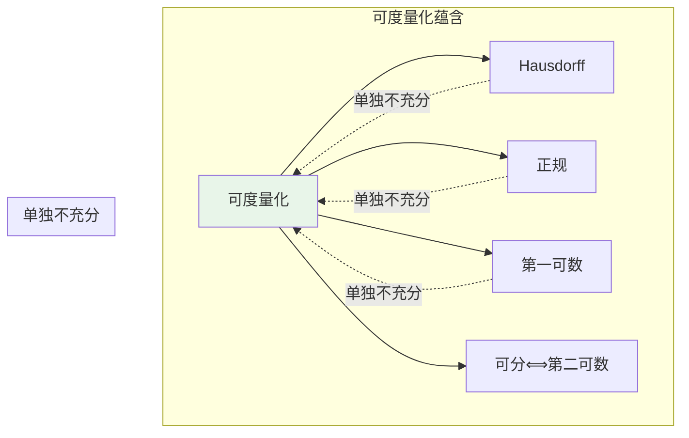
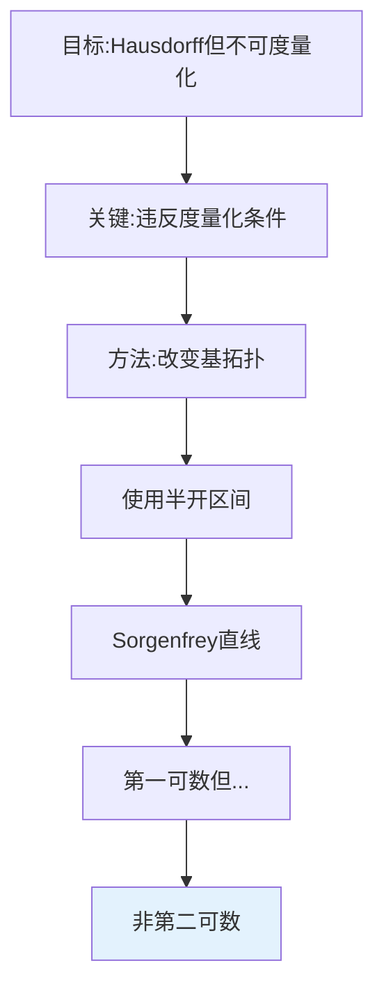
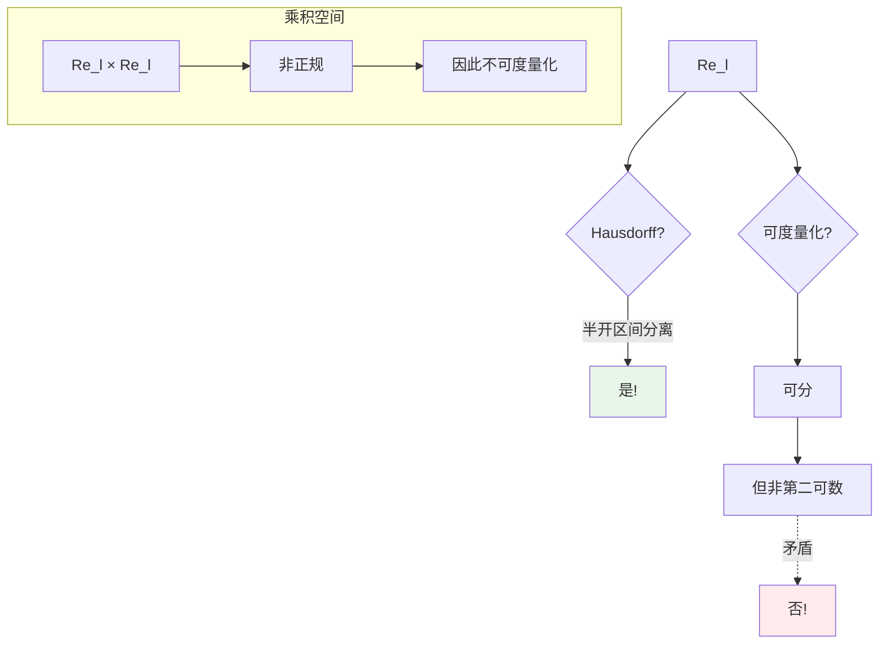
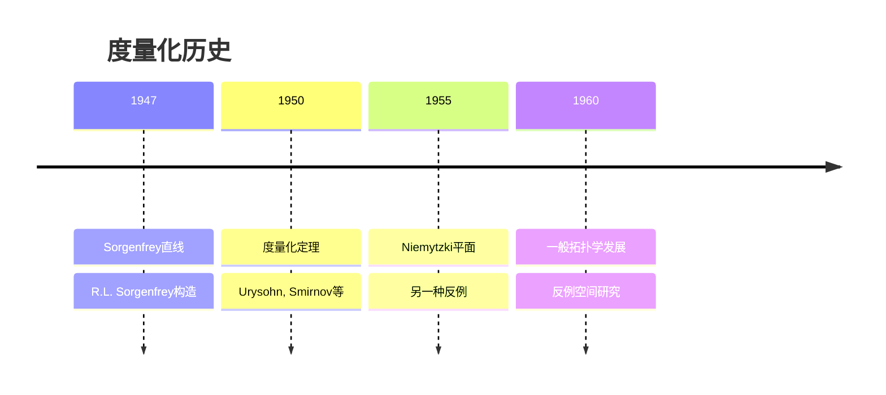
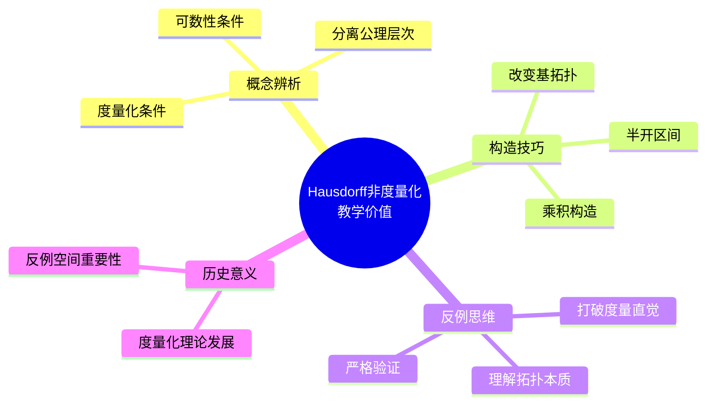
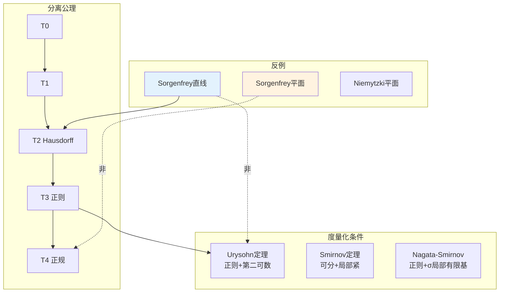

# Hausdorff但不可度量化的空间

## 概述

**Hausdorff 性质**（分离性）和**可度量化**是拓扑学中两个重要的概念。虽然每个可度量化空间都是 Hausdorff 的，但存在大量**Hausdorff 但不可度量化**的空间。本文档详细探讨这类空间的典型例子及其背后的拓扑性质。

---

## 1. 概念背景

### 1.1 定义回顾

**定义1（Hausdorff）**：拓扑空间 $X$ 称为 **Hausdorff**（或 $T_2$），如果对任意不同的 $x, y \in X$，存在不相交的开集 $U, V$ 使得 $x \in U$，$y \in V$。

**定义2（可度量化）**：拓扑空间 $X$ 称为 **可度量化**，如果存在度量 $d$ 使得 $d$ 诱导的拓扑与 $X$ 的拓扑相同。

### 1.2 可度量化的必要条件



**定理**：可度量化 $\Rightarrow$ Hausdorff、正规、第一可数。

---

## 2. 构造方法详解

### 2.1 经典反例：Sorgenfrey 直线

**定义**：在 $\mathbb{R}$ 上定义**下极限拓扑**（lower limit topology），基为：
$$\mathcal{B} = \{[a, b) : a < b, a, b \in \mathbb{R}\}$$

记此空间为 $\mathbb{R}_\ell$（Sorgenfrey 直线）。

### 2.2 构造思想



### 2.3 其他构造方法

| 空间 | 构造 | 不可度量化原因 |
|-----|------|--------------|
| **Sorgenfrey 平面** | $\mathbb{R}_\ell \times \mathbb{R}_\ell$ | 非正规 |
| **长直线** | 序拓扑扩展 | 非第二可数 |
| **Niemytzki 平面** | 上半平面特殊拓扑 | 非正规 |
| **序数空间 $[0, \omega_1]$** | 序拓扑 | 非第一可数（在 $\omega_1$） |

---

## 3. 验证过程详细推导

### 3.1 Hausdorff 性质证明

**定理**：Sorgenfrey 直线 $\mathbb{R}_\ell$ 是 Hausdorff 的。

**证明**：

设 $x, y \in \mathbb{R}_\ell$，$x < y$。

取 $\varepsilon = \frac{y-x}{2} > 0$。

令：

- $U = [x, x+\varepsilon)$
- $V = [y, y+\varepsilon) = [y, \frac{x+3y}{2})$

**验证**：

- $U$ 和 $V$ 都是基元素，故开
- $x \in U$，$y \in V$
- $U \cap V = \emptyset$（因为 $x + \varepsilon = \frac{x+y}{2} < y$）

**结论**：$\mathbb{R}_\ell$ 是 Hausdorff 的。 $\blacksquare$

### 3.2 不可度量化证明

**定理**：Sorgenfrey 直线 $\mathbb{R}_\ell$ 不可度量化。

**证明**：

**第一步：证明可分但不第二可数**

**可分性**：$\mathbb{Q} \subseteq \mathbb{R}_\ell$ 是可数稠密子集。

对任意 $[a, b)$ 和 $x \in [a, b)$，存在有理数 $q \in [x, b)$，故 $q \in [a, b) \cap \mathbb{Q}$。

**非第二可数**：

考虑不可数族 $\{[x, x+1) : x \in \mathbb{R}\}$。

对任意 $x_1 \neq x_2$，$[x_1, x_1+1) \neq [x_2, x_2+1)$。

**关键**：任何基必须包含每个 $[x, x+1)$ 的细化。

实际上，可以证明 $\{[x, x+1) : x \in \mathbb{R}\}$ 中每个集合需要不同的基元素来"生成"。

更直接的论证：

考虑反离散对角线 $D = \{(x, -x) : x \in \mathbb{R}\} \subseteq \mathbb{R}_\ell \times \mathbb{R}_\ell$。

在乘积拓扑中，$D$ 是闭集，但不可表示为可数个开集的交（即不是 $G_\delta$ 集）。

这与可度量化空间的性质矛盾。

**结论**：$\mathbb{R}_\ell$ 不可度量化。 $\blacksquare$

### 3.3 Sorgenfrey 平面的病态性质

**定理**：$\mathbb{R}_\ell \times \mathbb{R}_\ell$ 不是正规空间。

**证明概要**：

考虑反离散对角线 $L = \{(x, -x) : x \in \mathbb{R}\}$。

- $L$ 是闭集
- $L$ 在子空间拓扑中是离散的
- $L$ 是不可数的

利用 Jones 引理：可分正规空间的闭离散子集至多可数。

因此 $\mathbb{R}_\ell^2$ 非正规。

### 3.4 证明流程图



---

## 4. 直观解释

### 4.1 为什么"病态"？

```mermaid
graph TB
    subgraph 度量化空间
        M1[开球基] --> M2[对称性]
        M2 --> M3[d(x,y)=d(y,x)]
    end

    subgraph Sorgenfrey直线
        S1[半开区间基] --> S2[非对称]
        S2 --> S3[[a,b)包含a但不包含b]
    end

    M2 -.->|推广失效| S2

    style M2 fill:#e8f5e9
    style S2 fill:#ffebee
```

### 4.2 核心差异

| 性质 | 标准拓扑 $\mathbb{R}$ | Sorgenfrey 拓扑 $\mathbb{R}_\ell$ |
|-----|---------------------|--------------------------------|
| **基** | 开区间 $(a,b)$ | 半开区间 $[a,b)$ |
| **对称性** | $x \in (a,b) \Leftrightarrow a < x < b$ | $x$ 是左端点特殊 |
| **可分性** | 可分 | 可分 |
| **第二可数** | 是 | **否** |

**关键理解**：

- 半开区间基破坏了"对称性"
- 每个点 $x$ 的"右侧"和"左侧"拓扑性质不同
- 这种不对称性无法由任何度量诱导

---

## 5. 历史背景

### 5.1 时间线



### 5.2 关键人物

**Robert Sorgenfrey (1915-1995)**

- 美国数学家
- 1947年引入 Sorgenfrey 直线
- 展示可分但不第二可数的空间
- 成为拓扑学教材的标准反例

**度量化定理的贡献者**：

- **Urysohn 度量化定理**（1925）：正则、第二可数 $\Rightarrow$ 可度量化
- **Smirnov 度量化定理**（1951）：可分、局部紧等条件

---

## 6. 教学价值

### 6.1 为什么要学这个？



### 6.2 常见误解澄清

| 误解 | 正确理解 |
|-----|---------|
| "Hausdorff 足够好" | 度量化需要更多条件 |
| "可分=第二可数" | 仅对可度量化空间成立 |
| "第一可数足够" | 还需要正则、第二可数等 |

---

## 7. 相关概念网络



---

## 8. 拓展：度量化定理

### 8.1 Urysohn 度量化定理

**定理**：拓扑空间 $X$ 可度量化当且仅当：

1. $X$ 是正则的
2. $X$ 有可数基（第二可数）

### 8.2 Smirnov 度量化定理

**定理**：拓扑空间 $X$ 可度量化当且仅当 $X$ 是可分度量空间的逆极限。

---

## 9. 参考与延伸阅读

- Sorgenfrey, R.H. (1947). "On the topological product of paracompact spaces."
- Munkres, J. *Topology*, Chapter 4 (度量拓扑)
- Steen, L.A. & Seebach, J.A. *Counterexamples in Topology*, Example 84

---

## 10. 练习与思考

1. **验证练习**：证明 Sorgenfrey 直线是第一可数的。

2. **构造练习**：证明 $\mathbb{R}_\ell \times \mathbb{R}$ 是可度量化的。

3. **深入思考**：研究长直线（long line）的拓扑性质。

4. **拓展问题**：证明 Niemytzki 平面是 Hausdorff、可分但不第二可数的。

---

*文档版本：v1.0 | 创建日期：2026-04-09 | 分类：拓扑学反例 | MSC: 54E35, 54D10*
