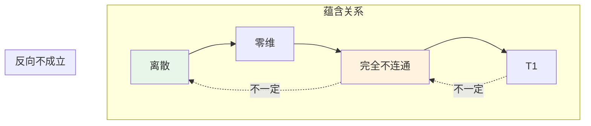
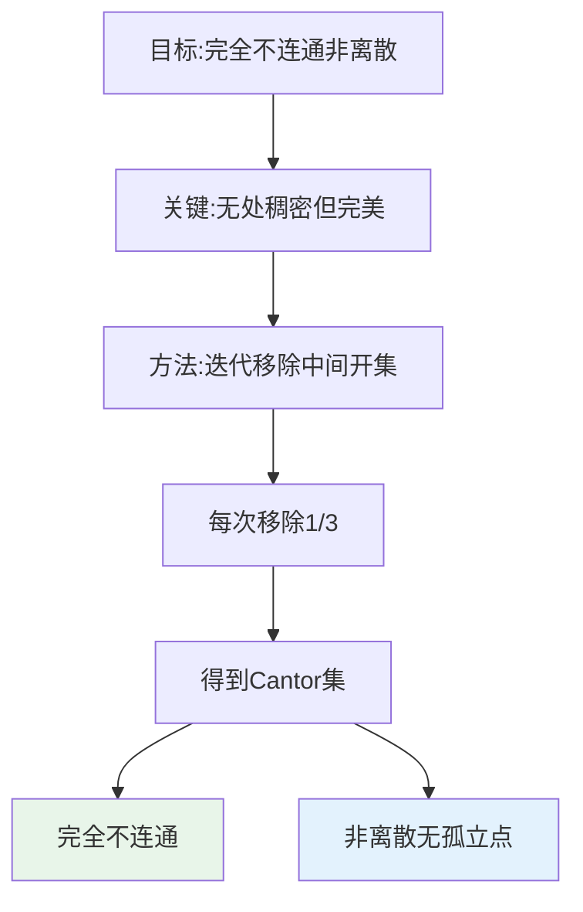
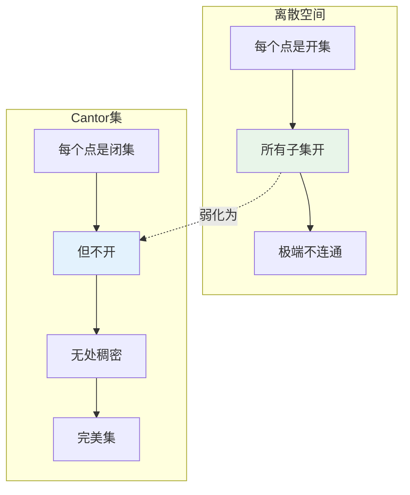
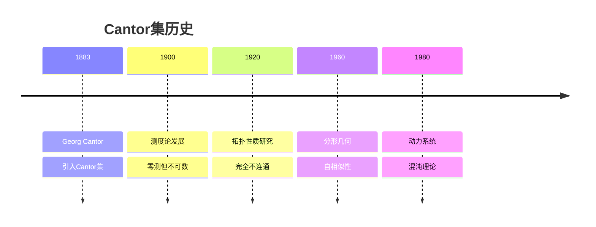
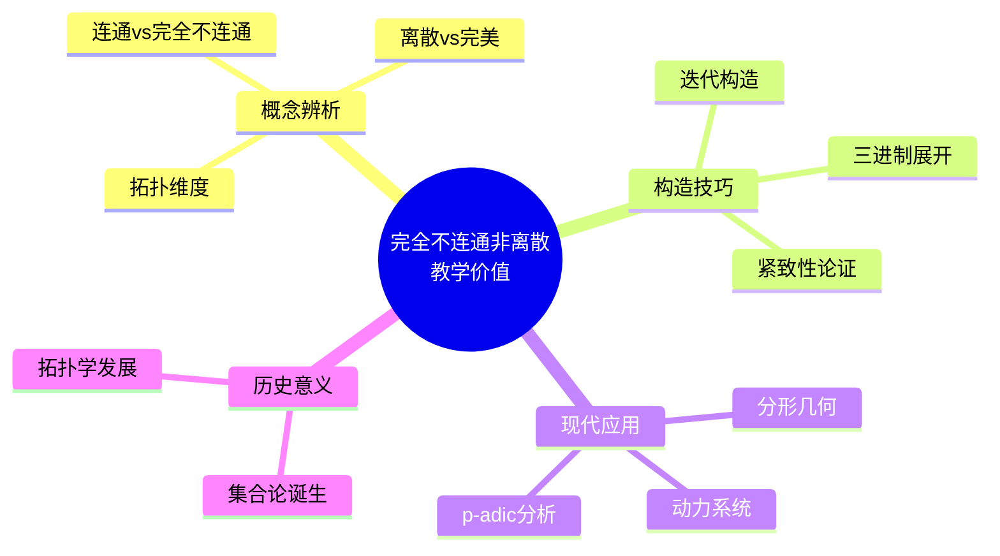
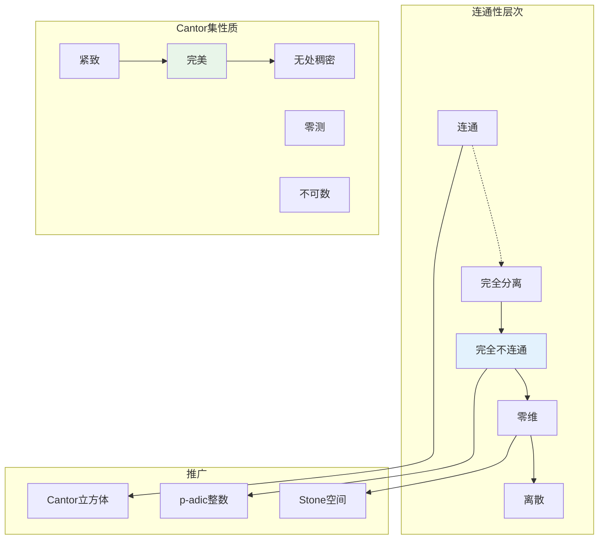

# 完全不连通但非离散的空间

## 概述

**完全不连通空间**是指连通分支都是单点集的空间。**离散空间**是指每个子集都是开集的空间。显然离散空间必完全不连通，但反之不成立。本文档构造完全不连通但非离散的典型空间——Cantor 集及其推广。

---

## 1. 概念背景

### 1.1 定义回顾

**定义1（完全不连通）**：拓扑空间 $X$ 称为 **完全不连通**（totally disconnected），如果对任意不同的 $x, y \in X$，存在既开又闭的（clopen）集合 $U$ 使得 $x \in U$，$y \notin U$。

等价地：$X$ 的连通分支都是单点。

**定义2（离散拓扑）**：拓扑空间 $X$ 称为 **离散**（discrete），如果每个子集都是开集。

### 1.2 关系图



---

## 2. 构造方法详解

### 2.1 经典反例：Cantor 集

**定义**：Cantor 集 $C \subseteq [0,1]$ 通过以下迭代构造：

$$\begin{aligned}
C_0 &= [0, 1] \\
C_1 &= [0, \frac{1}{3}] \cup [\frac{2}{3}, 1] \\
C_2 &= [0, \frac{1}{9}] \cup [\frac{2}{9}, \frac{1}{3}] \cup [\frac{2}{3}, \frac{7}{9}] \cup [\frac{8}{9}, 1] \\
&\vdots \\
C &= \bigcap_{n=0}^{\infty} C_n
\end{aligned}$$

等价描述：$C = \{x \in [0,1] : x \text{ 的三进制展开只含 } 0, 2\}$

### 2.2 构造思想



### 2.3 其他构造方法

| 空间 | 构造 | 特点 |
|-----|------|------|
| **p-adic 整数 $\mathbb{Z}_p$** | 逆极限 | 紧、完全不连通 |
| **Baire 空间** | 自然数无限序列 | 零维、非离散 |
| **Stone 空间** | Bool 代数的谱 | 紧、零维 |
| **有理数 $\mathbb{Q}$** | 子空间拓扑 | 非局部紧 |

---

## 3. 验证过程详细推导

### 3.1 完全不连通性证明

**定理**：Cantor 集 $C$ 是完全不连通的。

**证明**：

**第一步：三进制刻画**

$x \in C$ 当且仅当 $x = \sum_{n=1}^{\infty} \frac{a_n}{3^n}$，$a_n \in \{0, 2\}$。

**第二步：构造分离开集**

设 $x, y \in C$，$x \neq y$。

存在最小的 $N$ 使得 $a_N \neq b_N$（三进制展开）。

不妨设 $a_N = 0$，$b_N = 2$。

则：
$$x < \sum_{n=1}^{N-1} \frac{a_n}{3^n} + \frac{1}{3^N} < y$$

**第三步：定义 clopen 集合**

令 $c = \sum_{n=1}^{N-1} \frac{a_n}{3^n} + \frac{1}{3^N}$。

$U = C \cap [0, c]$ 是 $C$ 中的 clopen 集合：
- $U = C \cap (-\infty, c]$（相对闭）
- $U = C \cap (-\infty, c + \varepsilon)$ 对足够小的 $\varepsilon$（相对开）

**验证**：$x \in U$，$y \notin U$。

**结论**：$C$ 是完全不连通的。 $\blacksquare$

### 3.2 非离散性证明

**定理**：Cantor 集 $C$ 不是离散的。

**证明**：

**第一步：证明无孤立点**

设 $x \in C$，三进制展开 $x = 0.a_1 a_2 a_3 \ldots$（$a_i \in \{0, 2\}$）。

对任意 $\varepsilon > 0$，选择 $N$ 使得 $\frac{1}{3^N} < \varepsilon$。

构造：
$$y_N = 0.a_1 a_2 \ldots a_N b_{N+1} a_{N+2} \ldots$$

其中 $b_{N+1} \neq a_{N+1}$（在 $\{0, 2\}$ 中选择）。

则 $y_N \in C$，$y_N \neq x$，且 $|y_N - x| \leq \frac{2}{3^{N+1}} < \varepsilon$。

**第二步：导出非离散性**

由于 $x$ 的任意邻域都包含 $C$ 中其他点，$\{x\}$ 不是 $C$ 中的开集。

因此 $C$ 不是离散的。 $\blacksquare$

### 3.3 证明流程图

```mermaid
flowchart TB
    subgraph 完全不连通
        A[C中不同点] --> B[不同三进制位]
        B --> C[构造分离点]
        C --> D[定义clopen集]
        D --> E[分离两点]
    end

    subgraph 非离散
        F[任意点x] --> G[任意邻域]
        G --> H[构造其他点yN]
        H --> I[{x}不开]
    end

    E --> R1[完全不连通!]
    I --> R2[非离散!]

    style R1 fill:#e8f5e9
    style R2 fill:#e8f5e9
```

---

## 4. 直观解释

### 4.1 为什么"病态"？



### 4.2 核心洞察

| 性质 | 离散空间 | Cantor 集 |
|-----|---------|----------|
| **孤立点** | 所有点孤立 | 无孤立点 |
| **开集** | 所有子集 | 特殊的 clopen 集 |
| **连通分支** | 单点 | 单点 |
| **紧性** | 有限集紧致 | **紧致** |

**关键理解**：
- Cantor 集"充满"了区间，但被"挖空"得足够彻底
- 每一点都被其他点"任意逼近"
- 但任何两点都能被 clopen 集分离

---

## 5. 历史背景

### 5.1 时间线



### 5.2 关键人物

**Georg Cantor (1845-1918)**
- 德国数学家，集合论创始人
- 1883年构造 Cantor 集
- 用于研究三角级数的唯一性
- 发现不可数集与零测集的结合

### 5.3 现代应用

**分形几何**：
- Cantor 集是最简单的分形
- Hausdorff 维数 = $\frac{\ln 2}{\ln 3} \approx 0.631$

**动力系统**：
- 混沌的符号动力学模型
- 移位空间与 Cantor 集同胚

---

## 6. 教学价值

### 6.1 为什么要学这个？



### 6.2 常见误解澄清

| 误解 | 正确理解 |
|-----|---------|
| "完全不连通=离散" | Cantor 集是反例 |
| "Cantor集可数" | 不可数，基数连续统 |
| "Cantor集有正测度" | Lebesgue 测度为零 |

---

## 7. 相关概念网络



---

## 8. 推广与变体

### 8.1 广义 Cantor 集

对 $0 < \lambda < 1$，构造时移除中间长度为 $\lambda$ 的区间。

**性质**：
- 仍然完全不连通、完美、紧致
- Hausdorff 维数变化

### 8.2 Cantor 立方体

$$\{0, 1\}^{\kappa}$$

带乘积拓扑，是**泛型**的零维紧空间。

**定理**：每个零维紧空间都嵌入某个 Cantor 立方体。

---

## 9. 参考与延伸阅读

- Cantor, G. (1883). "Über unendliche, lineare Punktmannigfaltigkeiten."
- Hocking, J.G. & Young, G.S. *Topology*, Chapter 2
- Falconer, K. *Fractal Geometry*, Chapter 2

---

## 10. 练习与思考

1. **验证练习**：证明 Cantor 集的 Lebesgue 测度为零。

2. **构造练习**：构造 [0,1] 中测度为正数的完全不连通紧集。

3. **深入思考**：证明 Cantor 集与 $\{0,1\}^{\mathbb{N}}$ 同胚。

4. **拓展问题**：研究 Cantor 函数的构造及其性质（魔鬼楼梯）。

---

*文档版本：v1.0 | 创建日期：2026-04-09 | 分类：拓扑学反例 | MSC: 54D05, 54E45*
