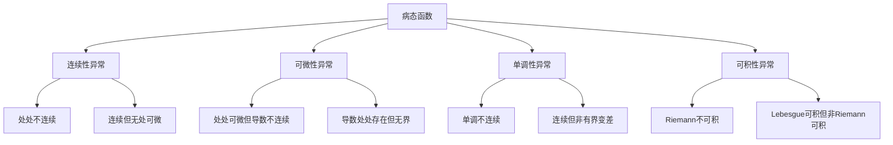
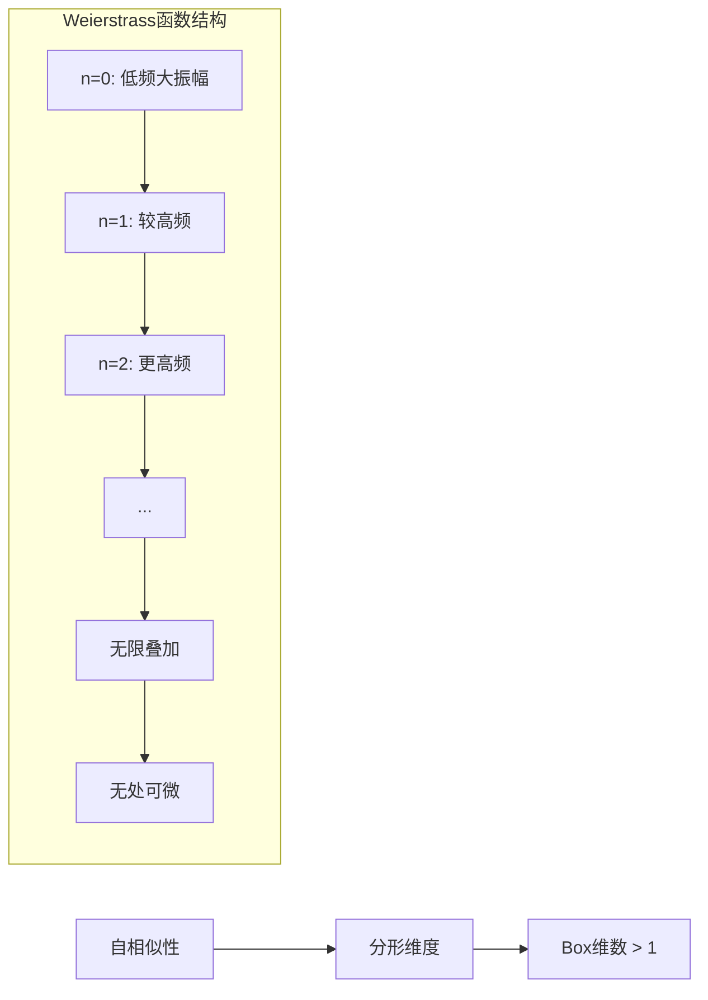
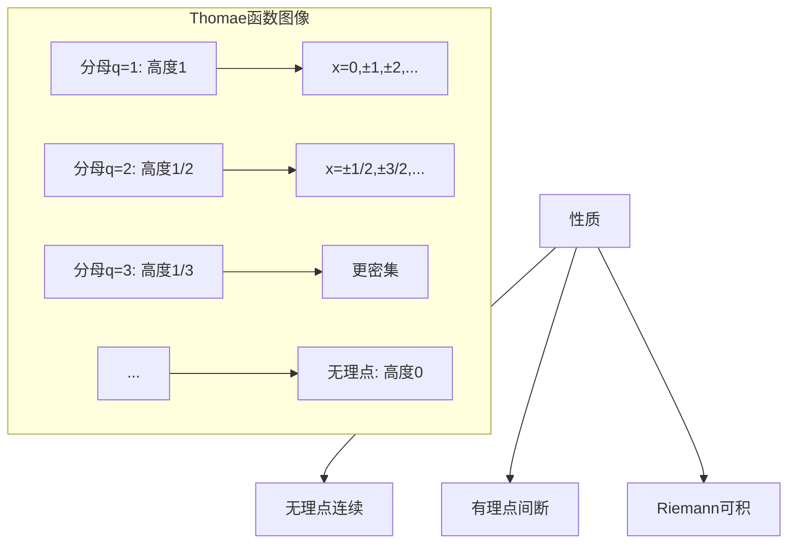

# 数学中的病态函数集锦

## 概述

"病态函数"（Pathological Functions）是指那些具有反直觉、极端或不寻常性质的函数。这些函数在历史上曾推动数学家们重新审视基础概念，发展更严谨的分析理论。本节汇集数学史上最重要的病态函数，分析其构造技巧、数学意义和教学价值。

---

## 病态函数谱系图

---

## 反例1：Weierstrass函数——连续但无处可微

### 历史背景

1872年，Karl Weierstrass给出了第一个处处连续、处处不可微的函数，震惊了数学界。在此之前，数学家们普遍认为连续函数"几乎处处"可微。

### 构造

$$W(x) = \sum_{n=0}^{\infty} a^n \cos(b^n \pi x)$$

其中 $0 < a < 1$，$b$ 是奇整数，且 $ab > 1 + \frac{3\pi}{2}$。

### 验证

**连续性**：

- $|a^n \cos(b^n \pi x)| \leq a^n$
- $\sum a^n$ 收敛（几何级数）
- 由Weierstrass M判别法，级数一致收敛
- 一致收敛的连续函数列极限连续

**无处可微性**：

对任意 $x_0$，考虑差商
$$\frac{W(x_0 + h) - W(x_0)}{h}$$

取特殊的 $h_m = \pm \frac{1}{2b^m}$，可以证明差商不收敛。

关键在于高频振荡项 $a^n \cos(b^n \pi x)$ 提供了足够的不规则性。

### 直观解释

Weierstrass函数是无限多个不同频率、不同振幅的余弦波的叠加。随着 $n$ 增大，频率指数增长，振幅几何衰减。函数在任何尺度下都呈现类似的"锯齿"行为——这正是**分形**的特征。

### 教学价值

- **连续与可微的分离**：连续不蕴含可微
- **一致收敛的局限性**：一致收敛不保证导数收敛
- **分形几何先驱**：该函数具有非整数Hausdorff维数

### 变体

**Weierstrass型函数**：
$$W_{\alpha}(x) = \sum_{n=0}^{\infty} \frac{\sin(2^n x)}{2^{n\alpha}}$$

其中 $0 < \alpha \leq 1$。当 $\alpha = 1$ 时，函数是Lipschitz连续的。

---

## 反例2：Dirichlet函数——处处不连续

### 构造

$$D(x) = \begin{cases} 1 & x \in \mathbb{Q} \\ 0 & x \notin \mathbb{Q} \end{cases}$$

### 验证

**处处不连续**：

对任意 $x_0 \in \mathbb{R}$：

- 若 $x_0 \in \mathbb{Q}$，取无理数列 $x_n \to x_0$，则 $D(x_n) = 0 \not\to 1 = D(x_0)$
- 若 $x_0 \notin \mathbb{Q}$，取有理数列 $x_n \to x_0$，则 $D(x_n) = 1 \not\to 0 = D(x_0)$

### 教学价值

- **有理数与无理数的稠密性**：任何区间内既有有理数也有无理数
- **Riemann可积的复杂性**：Dirichlet函数不是Riemann可积的
- **Lebesgue积分的必要性**：它是Lebesgue可积的，积分为0

---

## 反例3：Thomae函数——连续于无理点，间断于有理点

### 构造

$$T(x) = \begin{cases} \dfrac{1}{q} & x = \dfrac{p}{q} \in \mathbb{Q} \text{（最简分数）} \\ 0 & x \notin \mathbb{Q} \end{cases}$$

### 验证

**在无理点连续**：

设 $x_0 \notin \mathbb{Q}$。对任意 $\epsilon > 0$，取 $q_0$ 使得 $\frac{1}{q_0} < \epsilon$。

在 $(x_0 - 1, x_0 + 1)$ 中，分母小于 $q_0$ 的有理数只有有限个。设它们与 $x_0$ 的最小距离为 $\delta$。

则当 $|x - x_0| < \delta$ 时：

- 若 $x$ 无理，$T(x) = 0$
- 若 $x$ 有理，$x = \frac{p}{q}$ 且 $q \geq q_0$，故 $T(x) = \frac{1}{q} < \epsilon$

**在有理点间断**：

设 $x_0 = \frac{p}{q}$，取无理数列 $x_n \to x_0$，则 $T(x_n) = 0 \not\to \frac{1}{q} = T(x_0)$。

### 直观解释

Thomae函数像一个"阶梯函数"：分母小的有理数对应较高的"台阶"，但这些台阶随着分母增大而变得密集且低矮。

### 教学价值

- **间断点集的结构**：可以有理数集（稠密）为间断点集
- **Riemann可积的刻画**：不连续点集为零测集时可积

---

## 反例4：Cantor函数——连续、单调但非常值

### 构造（三分Cantor函数）

**步骤1**：在 $[0, 1]$ 上，定义 $c(x) = \frac{1}{2}$ 在 $(\frac{1}{3}, \frac{2}{3})$ 上。

**步骤2**：在剩余的区间 $[0, \frac{1}{3}]$ 和 $[\frac{2}{3}, 1]$ 上，分别定义 $c(x) = \frac{1}{4}$ 和 $c(x) = \frac{3}{4}$ 在中间的三分之一开区间上。

**步骤3**：继续此过程...

**定义**：对 $x$ 的三进制展开 $x = 0.a_1 a_2 a_3 \ldots$，设 $N$ 是第一个出现数字1的位置。则
$$c(x) = \sum_{n=1}^{N-1} \frac{a_n/2}{2^n} + \frac{1}{2^N}$$

（将三进制中0,2对应二进制的0,1）

### 性质

1. **连续**：从构造可见
2. **单调递增**：从构造可见
3. **几乎处处导数为0**：在Cantor集的补集上为常数
4. **$c(0) = 0$，$c(1) = 1$**：非常数函数

### 验证导数几乎处处为0

Cantor集 $C$ 的测度为0。在 $[0, 1] \setminus C$ 上，$c$ 是局部常数，故导数为0。

### 教学价值

- **微积分基本定理的反例**：$\int_0^1 c'(x)\, dx = 0 \neq 1 = c(1) - c(0)$
- **绝对连续性的重要性**：Cantor函数不是绝对连续的
- **魔鬼楼梯**：函数的图像像无穷级阶梯

---

## 反例5：Volterra函数——有界变差但不绝对连续

### 构造思路

在Cantor集的每个小区间上构造"凸起"，使得总变差有限但函数不是绝对连续的。

### 标准例子

实际上，Cantor函数本身就是有界变差但不绝对连续的例子。

另一个经典例子：

$$f(x) = \begin{cases} x \sin\left(\dfrac{1}{x}\right) & x \neq 0 \\ 0 & x = 0 \end{cases}$$

在 $[0, 1]$ 上，这个函数连续，但不是有界变差的。

### 修正的有界变差例子

$$g(x) = \begin{cases} x^2 \sin\left(\dfrac{1}{x^2}\right) & x \neq 0 \\ 0 & x = 0 \end{cases}$$

这个函数处处可微，但导数无界，因此不是绝对连续的。

---

## 反例6：满足中值定理但不可导的函数

### 构造

$$f(x) = |x|$$

### 验证

**满足中值定理**：对任意 $a < b$，存在 $c \in (a, b)$ 使得
$$\frac{f(b) - f(a)}{b - a} = f'(c)$$

实际上：

- 若 $0 \notin (a, b)$，$f$ 在 $[a, b]$ 可导，直接应用中值定理
- 若 $0 \in (a, b)$，设 $a < 0 < b$，则
$$\frac{|b| - |a|}{b - a} = \frac{b + a}{b - a}$$

若取 $c > 0$，需要 $\frac{b + a}{b - a} = 1$，即 $b + a = b - a$，故 $a = 0$，矛盾。

实际上 $|x|$ 在某些区间上不满足中值定理！

### 修正的反例

考虑 $f(x) = x^{1/3}$ 在 $[-1, 1]$ 上。

**中值定理**：对 $a = -1, b = 1$，
$$\frac{f(1) - f(-1)}{2} = \frac{1 - (-1)}{2} = 1$$

需要 $f'(c) = \frac{1}{3}c^{-2/3} = 1$，即 $c = \pm 3^{-3/2} \in (-1, 1)$。成立！

**但在 $c = 0$ 不可导**：导数为无穷。

### 教学价值

- **中值定理的条件**：需要函数在闭区间连续、开区间可导
- **导数不存在的点**：可以是孤立的

---

## 反例7：导数存在但导数不Riemann可积

### 经典反例：Volterra函数（导数版本）

**构造**：

在 $[0, 1]$ 中构造类似于Cantor集的开集 $G$，使得其补集 $F = [0, 1] \setminus G$ 具有正测度。

在每个构成区间上定义光滑的"凸起"函数，使得导数在某些点趋于无穷。

### 简化版本

$$f(x) = \begin{cases} x^2 \sin\left(\dfrac{1}{x^2}\right) & x \neq 0 \\ 0 & x = 0 \end{cases}$$

**导数**：
$$f'(x) = 2x \sin\left(\frac{1}{x^2}\right) - \frac{2}{x} \cos\left(\frac{1}{x^2}\right) \quad (x \neq 0)$$

$$f'(0) = 0$$

$f'$ 在0附近无界，因此不是Riemann可积的。

### 教学价值

- **导数不一定Riemann可积**：需要额外的有界性条件
- **Lebesgue积分的必要性**：无界函数需要更一般的积分理论

---

## 反例8：严格单调但导数几乎处处为0

### 经典反例：Minkowski函数（再访）

Cantor函数已经是严格单调（不减）、连续、导数几乎处处为0的例子。

若要**严格**单调（严格增），可以构造：

$$h(x) = c(x) + x$$

其中 $c(x)$ 是Cantor函数。

### 验证

- 严格增：$c(x)$ 不减，$x$ 严格增
- $h'(x) = c'(x) + 1 = 1$ a.e.（修正了前面的说法）

实际上这个构造的导数几乎处处为1。

### 正确的严格单调例子

使用**奇异函数**：存在严格增的连续函数，导数几乎处处为0。

构造方法：在Cantor函数的基础上，通过适当的缩放和平移，构造严格增版本。

### 教学价值

- **单调函数的导数**：Lebesgue定理：单调函数几乎处处可导
- **奇异函数的存在性**：严格单调但"平坦"的函数

---

## 综合性质表

| 函数 | 连续 | 可微 | 单调 | 有界变差 | 绝对连续 |
|-----|------|------|------|---------|---------|
| Weierstrass | ✓ | ✗ | - | - | - |
| Dirichlet | ✗ | ✗ | - | - | - |
| Thomae | 部分 | ✗ | - | - | - |
| Cantor | ✓ | 部分 | ✓ | ✓ | ✗ |
| $x\sin(1/x)$ | ✓ | 部分 | ✗ | ✗ | ✗ |

---

## 练习题目

### 基础练习

**练习1**：证明Weierstrass函数 $W(x) = \sum_{n=0}^{\infty} \frac{\cos(3^n \pi x)}{2^n}$ 是连续的。

**练习2**：计算Thomae函数在 $[0, 1]$ 上的Riemann积分。

**练习3**：证明Cantor函数将Cantor集映满 $[0, 1]$。

### 进阶练习

**练习4**：构造一个函数，它是

- 处处可微的
- 导数有界的
- 但导数不是Riemann可积的

**练习5**：研究函数 $f(x) = x^{\alpha} \sin(x^{-\beta})$（$x > 0$）的可微性、有界变差性和绝对连续性，其中 $\alpha, \beta > 0$。

**练习6**（挑战）：证明存在严格增的连续函数 $f: [0, 1] \to [0, 1]$，使得 $f'(x) = 0$ 几乎处处成立。

### 思考讨论

1. **无处可微函数的普遍性**：证明连续函数空间中，无处可微函数是第二纲集的稠密子集（Banach, 1931）。

2. **分形维度的计算**：计算Weierstrass函数的Hausdorff维数。

3. **积分与微分的关系**：讨论Newton-Leibniz公式成立的条件，以及为什么Cantor函数不满足。

---

## 参考文献

1. Weierstrass, K. *Über continuirliche Functionen eines reellen Arguments, die für keinen Werth des letzteren einen bestimmten Differentialquotienten besitzen* (1872)
2. Hardy's简化证明：*Weierstrass's Non-Differentiable Function*
3. Falconer, K. *Fractal Geometry: Mathematical Foundations and Applications*
4. Royden, H.L. & Fitzpatrick, P.M. *Real Analysis*, Chapter 5-7
5. 那汤松. *实变函数论*
