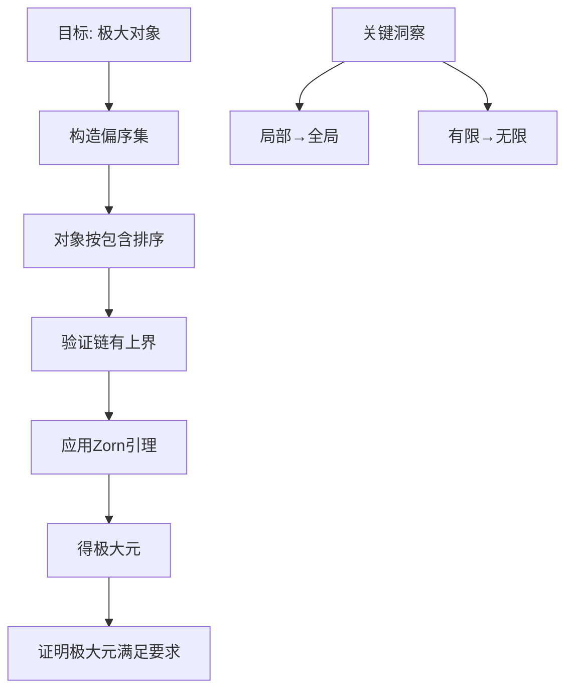
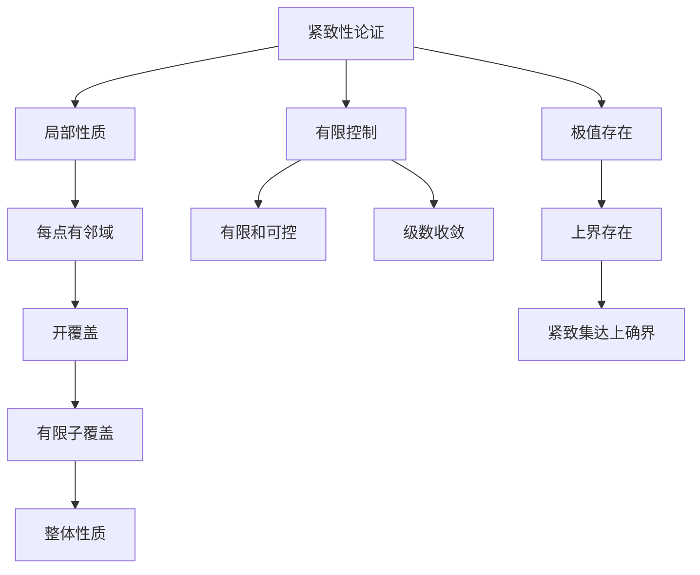
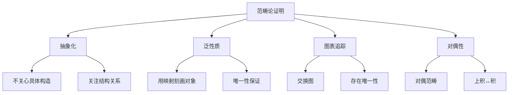
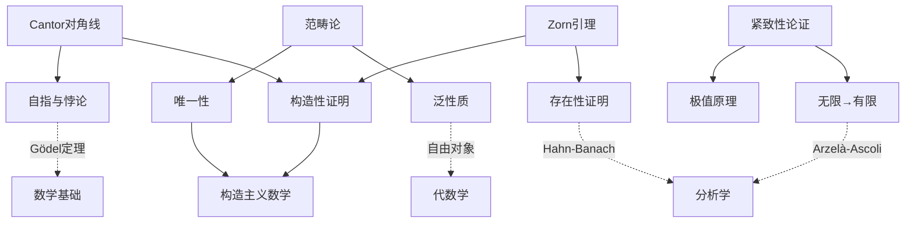

# 经典证明的技巧解析

## 概述

数学证明中存在着一些具有深远影响的通用技巧，它们横跨多个分支，体现了数学思维的深刻洞见。本节深入解析四大经典证明技巧：Cantor对角线法、Zorn引理的应用、紧致性论证和范畴论证明方法，揭示其本质思想、适用场景和相互联系。

---

## 技巧1：Cantor对角线法

### 历史与核心思想

1874年，Georg Cantor运用对角线论证证明了实数不可数，这一方法成为数学史上最具影响力的证明技巧之一。其核心思想是：**通过构造一个与序列中所有元素都不同的新元素，证明序列不能穷尽整个集合**。

### 经典应用1：实数不可数

**定理**：$[0, 1]$ 区间不可数。

**证明**：

假设 $[0, 1]$ 可数，枚举为 $x_1, x_2, x_3, \ldots$。

将每个数写成十进制展开：
$$\begin{align}
x_1 &= 0.a_{11} a_{12} a_{13} \ldots \\
x_2 &= 0.a_{21} a_{22} a_{23} \ldots \\
x_3 &= 0.a_{31} a_{32} a_{33} \ldots \\
&\vdots
\end{align}$$

构造新数 $y = 0.b_1 b_2 b_3 \ldots$，其中
$$b_n = \begin{cases} 5 & a_{nn} \neq 5 \\ 6 & a_{nn} = 5 \end{cases}$$

则 $y \neq x_n$ 对所有 $n$（在第 $n$ 位小数不同）。

矛盾！故 $[0, 1]$ 不可数。

### 经典应用2：停机问题不可判定

**定理**：不存在程序 $H(P, x)$ 能判定任意程序 $P$ 在输入 $x$ 时是否停机。

**证明**：

假设 $H$ 存在。构造程序 $D(P)$：
```
D(P):
  if H(P, P) = "停机" then 死循环
  else 停机
```

问：$D(D)$ 是否停机？
- 若停机，则 $H(D, D) = $"停机"，故 $D(D)$ 死循环，矛盾
- 若不停机，则 $H(D, D) \neq $"停机"，故 $D(D)$ 停机，矛盾

### 对角线法的本质

```mermaid
graph TB
    A[对角线法的结构] --> B[假设枚举完备]
    B --> C[构造对角元素]
    C --> D[与每个元素比较]
    D --> E[发现矛盾]
    E --> F[枚举不完备]

    G[关键技巧] --> H[自我指涉]
    G --> I[逐位/逐点否定]

    H --> J[D(D)问题]
    I --> K[十进制构造]
```

### 更多应用

| 领域 | 定理 | 对角线构造 |
|-----|------|-----------|
| 集合论 | 幂集基数更大 | $y = \{x : x \notin f(x)\}$ |
| 逻辑学 | Gödel不完备定理 | 自指命题 |
| 计算理论 | Rice定理 | 程序行为判定 |
| 分析学 | Baire纲定理 | 稠密开集交非空 |

### 教学价值

- **自指的力量**：通过自我指涉创造悖论
- **对角化的普遍性**：从集合论到计算机科学
- **构造性证明**：不仅证明存在，而且具体构造

---

## 技巧2：Zorn引理的应用

### 引理陈述

**Zorn引理**：若偏序集 $(P, \leq)$ 中每个链（全序子集）都有上界，则 $P$ 存在极大元。

等价于选择公理和良序定理。

### 经典应用1：基的存在性

**定理**：任何向量空间都有基（Hamel基）。

**证明**：

设 $V$ 是向量空间。考虑
$$P = \{S \subseteq V : S \text{ 线性无关}\}$$

按包含关系偏序。

**验证条件**：
- 设 $\{S_\alpha\}$ 是一个链，令 $S = \bigcup_\alpha S_\alpha$
- 若 $S$ 线性相关，则存在有限子集线性相关
- 该有限子集包含于某个 $S_\alpha$，矛盾

由Zorn引理，$P$ 有极大元 $B$。

**$B$ 是基**：
- $B$ 线性无关（由构造）
- 若 $v \notin \text{span}(B)$，则 $B \cup \{v\}$ 线性无关，与极大性矛盾

### 经典应用2：Hahn-Banach定理

**定理**：设 $X$ 是赋范空间，$Y \subseteq X$ 是子空间，$f: Y \to \mathbb{R}$ 是有界线性泛函。则存在 $F: X \to \mathbb{R}$ 是 $f$ 的保范扩张。

**证明概要**：

考虑扩张的集合，按"是前者的扩张"偏序。验证链有上界（取并），应用Zorn引理得极大扩张，证明极大扩张必定义在全空间上。

### 经典应用3：素理想存在性

**定理**：任何非零交换环（含1）都有极大理想。

**证明**：考虑真理想的集合，按包含偏序。

### Zorn引理的思维模式



### 教学价值

- **非构造性存在证明**：知道存在，但无法具体描述
- **与选择公理的联系**：深刻理解数学基础
- **跨学科应用**：从代数到分析到拓扑

---

## 技巧3：紧致性论证

### 紧致性的等价刻画

在度量空间中，紧致 = 序列紧致 = 完全有界 + 完备。

### 经典应用1：极值定理

**定理**：紧致空间上的连续实值函数达到最大、最小值。

**证明**：

设 $f: K \to \mathbb{R}$ 连续，$K$ 紧致。

- $f(K)$ 是 $\mathbb{R}$ 的紧致子集
- $\mathbb{R}$ 的紧致子集是有界闭集
- 有界闭集含上确界和下确界
- 故 $f$ 达到极值

### 经典应用2：Arzelà-Ascoli定理

**定理**：设 $K$ 紧致，$\mathcal{F} \subseteq C(K)$。则 $\mathcal{F}$ 在一致拓扑下紧致当且仅当 $\mathcal{F}$ 是
1. 一致有界
2. 等度连续

**证明概要**：

$(\Rightarrow)$ 紧致集在度量空间中有界、完全有界。

$(\Leftarrow)$ 利用对角线法构造收敛子列。

### 经典应用3：有限覆盖原理的应用

**定理**：$[0, 1]$ 不可数（紧致性证明）。

**证明**：

假设可数，$[0, 1] = \{x_1, x_2, \ldots\}$。

对每个 $n$，取开区间 $I_n$ 覆盖 $x_n$ 且长度 $\ell(I_n) < \epsilon/2^n$。

$\{I_n\}$ 覆盖 $[0, 1]$，由紧致性有有限子覆盖。

但有限子覆盖的总长度 $< \sum_{n=1}^{\infty} \epsilon/2^n = \epsilon < 1$，矛盾！

### 紧致性论证的范式



### 教学价值

- **从无限到有限**：紧致性将无限问题转化为有限问题
- **极限与紧致的联系**：序列紧致性保证收敛子列
- **拓扑学的核心概念**：连通性、紧致性是最基本的几何性质

---

## 技巧4：范畴论证明技巧

### 范畴论基本概念

- **对象**与**态射**
- **函子**：保持结构的映射
- **自然变换**：函子之间的映射
- **泛性质**：用映射刻画对象

### 经典应用1：积的泛性质

**定义**：对象 $A \times B$ 与投影 $\pi_1: A \times B \to A$，$\pi_2: A \times B \to B$ 满足：

对任意对象 $C$ 和态射 $f: C \to A$，$g: C \to B$，存在唯一的 $h: C \to A \times B$ 使得下图交换：

```
    C
   /|\
  / | \
 f  |h  g
  / | \
 v  v  v
 A<-A×B->B
  \pi_1  \pi_2
```

### 经典应用2：自由群的泛性质

**定理**：设 $S$ 是集合，存在群 $F(S)$（自由群）和映射 $i: S \to F(S)$ 满足：

对任意群 $G$ 和映射 $f: S \to G$，存在唯一的群同态 $\bar{f}: F(S) \to G$ 使得 $\bar{f} \circ i = f$。

**证明思想**：

自由群由 $S$ 中元素的形式字构成，乘法是字的连接约化。

### 经典应用3：Yoneda引理

**引理**：设 $\mathcal{C}$ 是局部小范畴，$F: \mathcal{C}^{op} \to \mathbf{Set}$ 是函子。则对任意 $A \in \mathcal{C}}$：

$$\text{Nat}(h_A, F) \cong F(A)$$

其中 $h_A = \text{Hom}(-, A)$ 是可表函子。

**意义**：对象由其表示的函子完全决定。

### 范畴论证明的特点



### 经典应用4：伴随函子

**定义**：函子 $F: \mathcal{C} \to \mathcal{D}$ 和 $G: \mathcal{D} \to \mathcal{C}$ 是伴随的，如果

$$\text{Hom}_{\mathcal{D}}(F(X), Y) \cong \text{Hom}_{\mathcal{C}}(X, G(Y))$$

自然地对 $X, Y$ 成立。

**例子**：
- 自由群函子 $F: \mathbf{Set} \to \mathbf{Grp}$ 与遗忘函子 $U: \mathbf{Grp} \to \mathbf{Set}$
- 积拓扑与余积拓扑的构造

### 教学价值

- **统一视角**：一个定理证明多个结论
- **对偶原理**：证明一个，免费得到另一个
- **抽象的力量**：揭示不同数学分支的深层联系

---

## 四大技巧的相互联系



---

## 综合案例分析

### 案例：Stone-Čech紧化的存在性

**定理**：任何完全正则空间 $X$ 存在Stone-Čech紧化 $\beta X$。

**证明中的技巧融合**：

1. **Zorn引理**：考虑所有紧化，按" finer than"偏序
2. **紧致性论证**：验证极大元存在且是Stone-Čech紧化
3. **泛性质**：$\beta X$ 是具有泛性质的极大紧化

---

## 练习题目

### 基础练习

**练习1**：用Cantor对角线法证明：若 $A$ 可数，则 $2^A$（幂集）不可数。

**练习2**：用Zorn引理证明：任何非零向量空间都有基。

**练习3**：证明：紧致Hausdorff空间上的连续双射是同胚。

**练习4**：验证集合范畴中，积的泛性质被笛卡尔积满足。

### 进阶练习

**练习5**（Baire纲定理）：用对角线法证明完备度量空间是第二纲的。

**练习6**：设 $X$ 是紧致空间，$\mathcal{A} \subseteq C(X)$ 是分离点且包含常数的子代数。证明 $\overline{\mathcal{A}} = C(X)$（Stone-Weierstrass定理）。

提示：用Zorn引理考虑极大子代数。

**练习7**：证明自由群 $F(S)$ 在同构意义下唯一。

提示：用泛性质。

**练习8**（挑战）：用Yoneda引理证明：若 $h_A \cong h_B$（自然同构），则 $A \cong B$。

### 思考讨论

1. **对角线法的局限**：为什么对角线法不能证明停机问题是NP完全的？

2. **Zorn引理与构造主义**：Zorn引理证明的存在性结果能否构造性地获得？研究Bishop的构造主义分析。

3. **紧致性的推广**：研究局部紧致空间、仿紧致空间的性质，理解为什么紧致性如此强大。

4. **范畴论与集合论**：范畴论能否作为数学的基础？与ZFC集合论的关系如何？

---

## 参考文献

1. Halmos, P.R. *Naive Set Theory*
2. Jech, T. *The Axiom of Choice*
3. Mac Lane, S. *Categories for the Working Mathematician*
4. Rudin, W. *Functional Analysis*
5. Awodey, S. *Category Theory*
6. Boolos, G., Burgess, J., & Jeffrey, R. *Computability and Logic*
