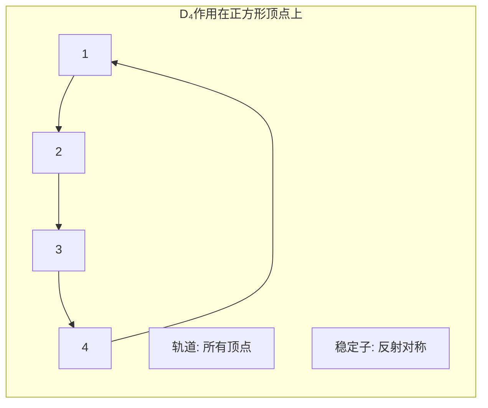

# 群作用经典实例集

## 概述

群作用是现代数学中最重要的概念之一，它将抽象群与具体几何结构联系起来。本文档收集群作用的经典实例，从基础的对称群作用到高深的伽罗瓦群作用。

---

## 一、对称群作用

### 1.1 对称群在集合上的自然作用

**定义**: 对称群 $S_n$ 在集合 $\{1, 2, \ldots, n\}$ 上的自然作用定义为：
$$\sigma \cdot i = \sigma(i), \quad \sigma \in S_n, i \in \{1, \ldots, n\}$$

**性质**:
- 这个作用是**传递的**（transitive）
- 稳定子群 $Stab(1) \cong S_{n-1}$
- 由轨道-稳定子定理：$|S_n| = n \cdot |S_{n-1}|$

### 1.2 共轭作用

**定义**: 群 $G$ 在自身上的共轭作用：
$$g \cdot x = gxg^{-1}, \quad g, x \in G$$

**实例分析**:

| 群 | 共轭类 | 中心 $Z(G)$ |
|---|---|---|
| $S_3$ | $\{e\}, \{(12),(13),(23)\}, \{(123),(132)\}$ | $\{e\}$ |
| $D_4$ | 5个共轭类 | $\{e, r^2\}$ |
| $A_4$ | 4个共轭类 | $\{e\}$ |

**Mermaid图示 - 共轭作用轨道**:
```mermaid
graph TB
    subgraph "群G的共轭作用"
        A[元素g] -->|共轭| B[xgx⁻¹]
        C[轨道Orb(g)] --> D[共轭类]
        E[稳定子Stab(g)] --> F[中心化子C_G(g)]
    end
```

### 1.3 对称群在多项式上的作用

**实例**: $S_n$ 作用在多项式环 $\mathbb{Z}[x_1, \ldots, x_n]$ 上

**初等对称多项式**:
$$\begin{aligned}
e_1 &= x_1 + x_2 + \cdots + x_n \\
e_2 &= \sum_{i<j} x_i x_j \\
&\vdots \\
e_n &= x_1 x_2 \cdots x_n
\end{aligned}$$

**定理**: 对称多项式基本定理——每个对称多项式都可唯一表示为初等对称多项式的多项式。

---

## 二、几何变换群

### 2.1 欧几里得群作用

**欧几里得群** $E(n)$ 由 $\mathbb{R}^n$ 上的所有等距变换组成。

**结构**: $E(n) = \mathbb{R}^n \rtimes O(n)$

**作用实例**:

| 子群 | 作用 | 轨道类型 |
|---|---|---|
| $O(2)$ | 平面旋转 | 同心圆 |
| $O(3)$ | 空间旋转 | 同心球面 |
| $T(n)$ (平移) | 平移作用 | 全空间（自由作用）|

### 2.2 正多边形对称群

**二面体群** $D_n$ ($|D_n| = 2n$) 作用在正 $n$ 边形上。

**生成元关系**:
$$D_n = \langle r, s \mid r^n = s^2 = e, srs = r^{-1} \rangle$$

**轨道分析**:



### 2.3 莫比乌斯变换群

**定义**: 莫比乌斯群 $PGL(2, \mathbb{C})$ 在黎曼球面 $\hat{\mathbb{C}}$ 上的作用：
$$\begin{pmatrix} a & b \\ c & d \end{pmatrix} \cdot z = \frac{az + b}{cz + d}$$

**分类**:
| 变换类型 | 迹的条件 | 不动点 |
|---|---|---|
| 抛物型 | $\text{tr}^2 = 4$ | 1个 |
| 椭圆型 | $0 \leq \text{tr}^2 < 4$ | 2个 |
| 双曲型 | $\text{tr}^2 > 4$ | 2个 |
| 斜驶型 | $\text{tr}^2 \notin [0, 4]$ | 2个 |

---

## 三、伽罗瓦群作用

### 3.1 多项式的伽罗瓦群

**经典实例: $x^3 - 2$ 的分裂域**

**分裂域**: $K = \mathbb{Q}(\sqrt[3]{2}, \omega)$，其中 $\omega = e^{2\pi i/3}$

**伽罗瓦群**: $Gal(K/\mathbb{Q}) \cong S_3$

**作用分析**:
| 自同构 | $\sqrt[3]{2}$ | $\omega$ | 阶 |
|---|---|---|---|
| $\sigma_1$ | $\omega\sqrt[3]{2}$ | $\omega$ | 3 |
| $\sigma_2$ | $\sqrt[3]{2}$ | $\omega^2$ | 2 |
| $\sigma_3$ | $\omega\sqrt[3]{2}$ | $\omega^2$ | 2 |

**Mermaid图示 - 域扩张塔**:
```mermaid
graph BT
    K[\mathbb{Q}(\sqrt[3]{2}, \omega)\\ Gal ≅ S₃]
    M1[\mathbb{Q}(\sqrt[3]{2})\\ 次数3]
    M2[\mathbb{Q}(\omega)\\ 次数2]
    Q[\mathbb{Q}]
    
    K --> M1
    K --> M2
    M1 --> Q
    M2 --> Q
```

### 3.2 分圆域的伽罗瓦群

**定理**: $Gal(\mathbb{Q}(\zeta_n)/\mathbb{Q}) \cong (\mathbb{Z}/n\mathbb{Z})^\times$

**实例: $n = 5$**
- $\zeta_5 = e^{2\pi i/5}$
- $Gal \cong (\mathbb{Z}/5\mathbb{Z})^\times = \{1, 2, 3, 4\} \cong C_4$
- 生成元 $\sigma: \zeta_5 \mapsto \zeta_5^2$

### 3.3 五次方程不可解性

**定理 (阿贝尔-鲁菲尼)**: 一般五次方程没有根式解。

**关键步骤**:
1. 存在五次多项式 $f \in \mathbb{Q}[x]$ 使得 $Gal(f) \cong S_5$
2. $S_5$ 不是可解群（因为 $A_5$ 是单群）
3. 因此该多项式没有根式解

---

## 四、轨道-稳定子定理应用

### 4.1 定理回顾

**轨道-稳定子定理**: 设群 $G$ 作用在集合 $X$ 上，$x \in X$，则：
$$|G| = |Orb(x)| \cdot |Stab(x)|$$

**类方程**: 若 $G$ 是有限群，则：
$$|G| = |Z(G)| + \sum_{i} [G : C_G(x_i)]$$

### 4.2 计数应用

**实例1: 正多面体的计数**

正十二面体有60个旋转对称（同构于 $A_5$）。

使用轨道-稳定子定理验证：
- 作用在12个面上：轨道大小 = 12，稳定子阶数 = 5（绕面中心旋转）
- $12 \times 5 = 60$ ✓

**实例2: 凯莱图的度公式**

```mermaid
graph TB
    subgraph "轨道-稳定子定理应用"
        A[群G作用在X上] --> B[轨道Orb(x)]
        A --> C[稳定子Stab(x)]
        B --> D[|Orb(x)| = [G:Stab(x)]]
        C --> D
        D --> E[计数公式]
    end
```

### 4.3 共轭类大小的应用

**命题**: $p$-群有非平凡中心。

**证明**: 由类方程，若 $|G| = p^n$，则共轭类大小整除 $p^n$。由于单位元自成一类，若中心平凡则 $|G| \equiv 1 \pmod{p}$，矛盾。

### 4.4 西罗定理证明

**西罗第一定理**: 若 $p^k \mid |G|$，则 $G$ 有阶为 $p^k$ 的子群。

**证明概要**:
1. 考虑 $G$ 作用在 $G$ 的 $p^k$-子集上
2. 使用轨道-稳定子定理分析稳定子
3. 证明存在一个轨道其稳定子阶数恰好为 $p^k$

---

## 五、进阶实例

### 5.1 庞加莱群作用

**庞加莱群** $\mathcal{P} = \mathbb{R}^4 \rtimes O(3,1)$ 是狭义相对论的对称群。

**洛伦兹变换**: 保持闵可夫斯基度规 $ds^2 = -dt^2 + dx^2 + dy^2 + dz^2$

### 5.2 规范群作用

在杨-米尔斯理论中，规范群 $\mathcal{G}$ 作用在联络空间上：
$$A \mapsto g^{-1}Ag + g^{-1}dg$$

**物理意义**: 规范等价类对应物理上不可区分的场构型。

### 5.3 代数群的群作用

**代数群** $GL(n, \mathbb{C})$ 作用在:
- 旗簇（flag variety）上
- 格拉斯曼簇（Grassmannian）上
- 射影空间 $\mathbb{P}^n$ 上

---

## 参考链接

- [群论基础](../../concept/代数学/群论基础.md)
- [伽罗瓦理论](../../concept/代数学/伽罗瓦理论.md)
- [群表示论](../../concept/代数学/群表示论.md)
- [对称空间](../../concept/几何与拓扑/对称空间.md)

---

## 参考文献

1. Dummit, D. S., & Foote, R. M. (2004). *Abstract Algebra* (3rd ed.). Wiley.
2. Artin, M. (2011). *Algebra* (2nd ed.). Pearson.
3. Fulton, W., & Harris, J. (1991). *Representation Theory*. Springer.
4. Serre, J.-P. (1977). *Linear Representations of Finite Groups*. Springer.
