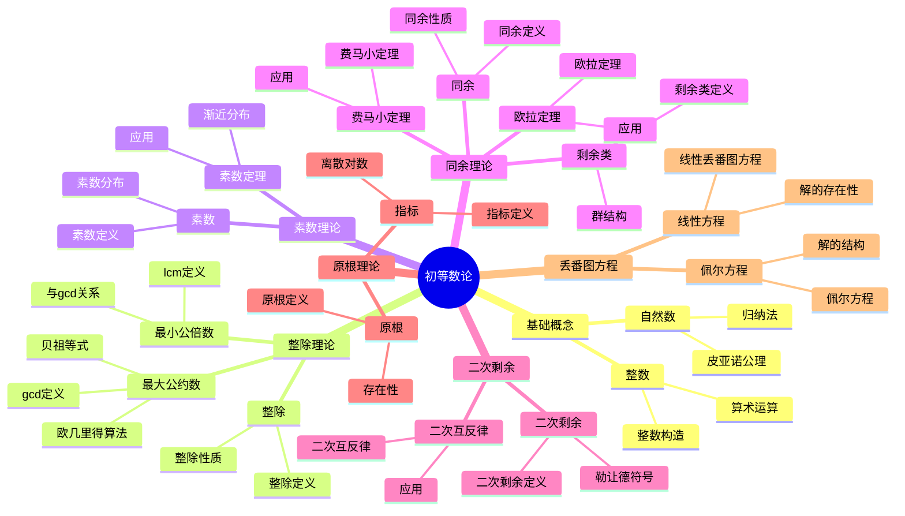

# 6.1 初等数论 / Elementary Number Theory

## 目录 / Table of Contents

- [6.1 初等数论 / Elementary Number Theory](#61-初等数论--elementary-number-theory)
  - [目录 / Table of Contents](#目录--table-of-contents)
  - [6.1.1 基本概念 / Basic Concepts](#611-基本概念--basic-concepts)
    - [6.1.1.1 自然数与整数 / Natural Numbers and Integers](#6111-自然数与整数--natural-numbers-and-integers)
    - [6.1.1.2 最大公约数与最小公倍数 / Greatest Common Divisor and Least Common Multiple](#6112-最大公约数与最小公倍数--greatest-common-divisor-and-least-common-multiple)
    - [6.1.1.3 素数 / Prime Numbers](#6113-素数--prime-numbers)
    - [实例表征 / Instance Representation](#实例表征--instance-representation)
      - [实例1: 整除性基本实例 / Basic Divisibility Examples](#实例1-整除性基本实例--basic-divisibility-examples)
      - [实例2: 素数识别与分解 / Prime Number Identification and Factorization](#实例2-素数识别与分解--prime-number-identification-and-factorization)
      - [实例3: 最大公约数与最小公倍数 / Greatest Common Divisor and Least Common Multiple](#实例3-最大公约数与最小公倍数--greatest-common-divisor-and-least-common-multiple)
  - [6.1.2 整除理论 / Divisibility Theory](#612-整除理论--divisibility-theory)
    - [6.1.2.1 整除的基本性质 / Basic Properties of Divisibility](#6121-整除的基本性质--basic-properties-of-divisibility)
    - [6.1.2.2 欧几里得算法 / Euclidean Algorithm](#6122-欧几里得算法--euclidean-algorithm)
    - [6.1.2.3 线性丢番图方程 / Linear Diophantine Equations](#6123-线性丢番图方程--linear-diophantine-equations)
  - [6.1.3 同余理论 / Congruence Theory](#613-同余理论--congruence-theory)
    - [6.1.3.1 同余的基本概念 / Basic Concepts of Congruence](#6131-同余的基本概念--basic-concepts-of-congruence)
    - [6.1.3.2 剩余类 / Residue Classes](#6132-剩余类--residue-classes)
    - [6.1.3.3 简化剩余系 / Reduced Residue System](#6133-简化剩余系--reduced-residue-system)
    - [6.1.3.4 费马小定理与欧拉定理 / Fermat's Little Theorem and Euler's Theorem](#6134-费马小定理与欧拉定理--fermats-little-theorem-and-eulers-theorem)
    - [1实例表征 / Instance Representation](#1实例表征--instance-representation)
      - [实例1: 同余基本运算 / Basic Congruence Operations](#实例1-同余基本运算--basic-congruence-operations)
      - [实例2: 模运算实际应用 / Practical Applications of Modular Arithmetic](#实例2-模运算实际应用--practical-applications-of-modular-arithmetic)
      - [实例3: 费马小定理与欧拉定理应用 / Applications of Fermat's Little Theorem and Euler's Theorem](#实例3-费马小定理与欧拉定理应用--applications-of-fermats-little-theorem-and-eulers-theorem)
      - [实例4: 剩余类与简化剩余系 / Residue Classes and Reduced Residue Systems](#实例4-剩余类与简化剩余系--residue-classes-and-reduced-residue-systems)
  - [6.1.4 二次剩余 / Quadratic Residues](#614-二次剩余--quadratic-residues)
    - [6.1.4.1 二次剩余的定义 / Definition of Quadratic Residues](#6141-二次剩余的定义--definition-of-quadratic-residues)
    - [6.1.4.2 勒让德符号 / Legendre Symbol](#6142-勒让德符号--legendre-symbol)
    - [6.1.4.3 二次互反律 / Quadratic Reciprocity](#6143-二次互反律--quadratic-reciprocity)
  - [6.1.5 原根与指标 / Primitive Roots and Indices](#615-原根与指标--primitive-roots-and-indices)
    - [6.1.5.1 原根 / Primitive Roots](#6151-原根--primitive-roots)
    - [6.1.5.2 指标 / Indices](#6152-指标--indices)
    - [2实例表征 / Instance Representation](#2实例表征--instance-representation)
      - [实例1: 二次剩余计算 / Quadratic Residue Calculation](#实例1-二次剩余计算--quadratic-residue-calculation)
      - [实例2: 勒让德符号计算 / Legendre Symbol Calculation](#实例2-勒让德符号计算--legendre-symbol-calculation)
      - [实例3: 二次互反律应用 / Application of Quadratic Reciprocity](#实例3-二次互反律应用--application-of-quadratic-reciprocity)
      - [实例4: 原根与指标 / Primitive Roots and Indices](#实例4-原根与指标--primitive-roots-and-indices)
    - [6.1.5.3 离散对数 / Discrete Logarithm](#6153-离散对数--discrete-logarithm)
  - [6.1.6 连分数 / Continued Fractions](#616-连分数--continued-fractions)
    - [6.1.6.1 简单连分数 / Simple Continued Fractions](#6161-简单连分数--simple-continued-fractions)
    - [6.1.6.2 连分数的性质 / Properties of Continued Fractions](#6162-连分数的性质--properties-of-continued-fractions)
    - [6.1.6.3 佩尔方程 / Pell's Equation](#6163-佩尔方程--pells-equation)
  - [6.1.7 丢番图方程 / Diophantine Equations](#617-丢番图方程--diophantine-equations)
    - [6.1.7.1 线性丢番图方程 / Linear Diophantine Equations](#6171-线性丢番图方程--linear-diophantine-equations)
    - [6.1.7.2 毕达哥拉斯三元组 / Pythagorean Triples](#6172-毕达哥拉斯三元组--pythagorean-triples)
    - [6.1.7.3 费马大定理 / Fermat's Last Theorem](#6173-费马大定理--fermats-last-theorem)
  - [6.1.8 形式化实现 / Formal Implementation](#618-形式化实现--formal-implementation)
    - [6.1.8.1 Lean 4 实现 / Lean 4 Implementation](#6181-lean-4-实现--lean-4-implementation)
    - [6.1.8.2 Haskell 实现 / Haskell Implementation](#6182-haskell-实现--haskell-implementation)
    - [6.1.8.3 重要定理总结 / Summary of Important Theorems](#6183-重要定理总结--summary-of-important-theorems)
  - [参考文献 / References](#参考文献--references)
    - [经典教材 / Classic Textbooks](#经典教材--classic-textbooks)
    - [现代教材 / Modern Textbooks](#现代教材--modern-textbooks)
    - [历史文献 / Historical Literature](#历史文献--historical-literature)
    - [在线资源 / Online Resources](#在线资源--online-resources)

---

## 🗺️ 初等数论核心概念思维导图



## 📊 初等数论核心概念多维知识矩阵

| 概念类别 | 核心概念 | 定义要点 | 关键性质 | 典型例子 | 应用场景 |
|---------|---------|---------|---------|---------|---------|
| 基础概念 | 自然数 | 皮亚诺公理 | 归纳法 | ℕ | 数学基础 |
| 基础概念 | 整数 | 自然数扩张 | 群结构 | ℤ | 数学基础 |
| 整除理论 | 整除 | 整数除法 | 传递性 | a\|b | 因子分解 |
| 整除理论 | 最大公约数 | 公共因子最大 | 贝祖等式 | gcd(a,b) | 算法设计 |
| 整除理论 | 欧几里得算法 | 辗转相除 | 高效算法 | gcd计算 | 算法设计 |
| 素数理论 | 素数 | 只有1和自身因子 | 无穷性 | 2,3,5,7 | 密码学 |
| 素数理论 | 素数定理 | 渐近分布 | 对数积分 | π(x) ~ x/log x | 数论研究 |
| 同余理论 | 同余 | 模运算相等 | 等价关系 | a ≡ b (mod n) | 密码学 |
| 同余理论 | 剩余类 | 同余类 | 群结构 | ℤ/nℤ | 密码学 |
| 同余理论 | 费马小定理 | 素数模幂 | a^p ≡ a (mod p) | 费马小定理 | 密码学 |
| 同余理论 | 欧拉定理 | 互素模幂 | a^φ(n) ≡ 1 (mod n) | 欧拉定理 | 密码学 |
| 二次剩余 | 二次剩余 | 平方剩余 | 欧拉准则 | 勒让德符号 | 密码学 |
| 二次剩余 | 二次互反律 | 互反关系 | 对称性 | 二次互反律 | 数论 |
| 原根理论 | 原根 | 生成剩余类群 | 存在性 | 原根 | 密码学 |
| 原根理论 | 指标 | 离散对数 | 对数性质 | ind_g(a) | 密码学 |
| 丢番图方程 | 线性方程 | ax+by=c | 解的存在性 | 线性方程 | 数论 |
| 丢番图方程 | 佩尔方程 | x²-dy²=1 | 无穷解 | 佩尔方程 | 数论 |

## 6.1.1 基本概念 / Basic Concepts

### 6.1.1.1 自然数与整数 / Natural Numbers and Integers

**定义 6.1.1.1** (自然数 / Natural Numbers)
自然数集 $\mathbb{N} = \{1, 2, 3, \ldots\}$ 满足皮亚诺公理：

1. **归纳公理** / Induction Axiom: 如果 $S \subseteq \mathbb{N}$ 包含 $1$ 且对任意 $n \in S$ 都有 $n+1 \in S$，则 $S = \mathbb{N}$
2. **良序公理** / Well-Ordering Axiom: $\mathbb{N}$ 的任意非空子集都有最小元素

**定义 6.1.1.2** (整数 / Integers)
整数集 $\mathbb{Z} = \{\ldots, -2, -1, 0, 1, 2, \ldots\}$ 是自然数集的扩张。

**定理 6.1.1.1** (数学归纳法 / Mathematical Induction)
设 $P(n)$ 是关于自然数 $n$ 的命题。如果：

1. $P(1)$ 为真
2. 对任意 $k \in \mathbb{N}$，$P(k) \Rightarrow P(k+1)$

则 $P(n)$ 对所有 $n \in \mathbb{N}$ 为真。

### 6.1.1.2 最大公约数与最小公倍数 / Greatest Common Divisor and Least Common Multiple

**定义 6.1.1.3** (最大公约数 / Greatest Common Divisor)
整数 $a$ 和 $b$ 的最大公约数 $\gcd(a,b)$ 是满足 $d \mid a$ 和 $d \mid b$ 的最大正整数 $d$。

**定义 6.1.1.4** (最小公倍数 / Least Common Multiple)
整数 $a$ 和 $b$ 的最小公倍数 $\text{lcm}(a,b)$ 是满足 $a \mid m$ 和 $b \mid m$ 的最小正整数 $m$。

**定理 6.1.1.5** (最大公约数的性质 / Properties of GCD)
对于任意整数 $a, b, c$：

1. $\gcd(a,b) = \gcd(b,a)$
2. $\gcd(a,b) = \gcd(a, b \bmod a)$
3. $\gcd(ac, bc) = |c| \cdot \gcd(a,b)$
4. $\gcd(a, \gcd(b,c)) = \gcd(\gcd(a,b), c)$

**定理 6.1.1.6** (最小公倍数的性质 / Properties of LCM)
$$\text{lcm}(a,b) = \frac{|ab|}{\gcd(a,b)}$$

### 6.1.1.3 素数 / Prime Numbers

**定义 6.1.1.7** (素数 / Prime Number)
大于 $1$ 的正整数 $p$ 称为素数，如果 $p$ 的正因子只有 $1$ 和 $p$。

**定义 6.1.1.8** (合数 / Composite Number)
大于 $1$ 的正整数 $n$ 称为合数，如果 $n$ 不是素数。

**定理 6.1.1.9** (算术基本定理 / Fundamental Theorem of Arithmetic)
任意大于 $1$ 的正整数都可以唯一地表示为素数的乘积：
$$n = p_1^{e_1} p_2^{e_2} \cdots p_k^{e_k}$$
其中 $p_1 < p_2 < \cdots < p_k$ 是素数，$e_i > 0$。

**证明思路**:

1. 存在性：使用数学归纳法
2. 唯一性：使用欧几里得引理

**详细证明**:

- **存在性证明**:
  - **基础情况**: $n = 2$ 是素数，结论成立
  - **归纳步骤**: 假设所有小于 $n$ 的正整数都可以表示为素数的乘积
  - 如果 $n$ 是素数，结论成立
  - 如果 $n$ 是合数，则 $n = ab$，其中 $1 < a, b < n$
  - 由归纳假设，$a$ 和 $b$ 都可以表示为素数的乘积
  - 因此 $n = ab$ 也可以表示为素数的乘积
- **唯一性证明**:
  - 假设 $n = p_1^{e_1} p_2^{e_2} \cdots p_k^{e_k} = q_1^{f_1} q_2^{f_2} \cdots q_l^{f_l}$ 是两个不同的素因数分解
  - 由欧几里得引理，$p_1$ 必须整除某个 $q_j$
  - 由于 $p_1$ 和 $q_j$ 都是素数，$p_1 = q_j$
  - 通过重新排序，可以假设 $p_1 = q_1$
  - 如果 $e_1 > f_1$，则 $p_1^{e_1 - f_1} p_2^{e_2} \cdots p_k^{e_k} = q_2^{f_2} \cdots q_l^{f_l}$
  - 左边被 $p_1$ 整除，右边不被 $p_1$ 整除（因为 $q_2, \ldots, q_l$ 都不等于 $p_1$），矛盾
  - 类似地，$e_1 < f_1$ 也导致矛盾
  - 因此 $e_1 = f_1$，可以约去 $p_1^{e_1}$，继续这个过程
  - 最终得到 $k = l$ 且 $p_i = q_i$，$e_i = f_i$ 对所有 $i$ 成立

**定理 6.1.1.10** (欧几里得引理 / Euclid's Lemma)
如果素数 $p$ 整除 $ab$，则 $p$ 整除 $a$ 或 $p$ 整除 $b$。

**证明思路**:

1. 利用最大公因数的性质
2. 使用贝祖定理

**详细证明**:

- **步骤 1**: 假设 $p \mid ab$ 但 $p \nmid a$ 且 $p \nmid b$
- **步骤 2**: 由于 $p$ 是素数且 $p \nmid a$，$\gcd(p, a) = 1$
- **步骤 3**: 由贝祖定理，存在整数 $x, y$ 使得 $px + ay = 1$
- **步骤 4**: 两边乘以 $b$，得到 $pbx + aby = b$
- **步骤 5**: 由于 $p \mid ab$，存在整数 $k$ 使得 $ab = pk$
- **步骤 6**: 因此 $b = pbx + pky = p(bx + ky)$
- **步骤 7**: 所以 $p \mid b$，这与假设矛盾
- 因此，如果 $p \mid ab$，则 $p \mid a$ 或 $p \mid b$

### 实例表征 / Instance Representation

#### 实例1: 整除性基本实例 / Basic Divisibility Examples

**概念**: 整除的定义和基本性质
**实例**:

- **基本整除关系**:
  - $6 \mid 12$，因为 $12 = 2 \times 6$
  - $3 \mid 15$，因为 $15 = 5 \times 3$
  - $7 \mid 21$，因为 $21 = 3 \times 7$
- **整除性质验证**:
  - 传递性: 如果 $2 \mid 6$ 且 $6 \mid 18$，则 $2 \mid 18$ ✓
  - 线性组合: 如果 $3 \mid 9$ 且 $3 \mid 12$，则 $3 \mid (9+12) = 21$ ✓
- **非整除例子**:
  - $5 \nmid 12$，因为 $12 \div 5 = 2.4$ 不是整数
  - $7 \nmid 20$，因为 $20 \div 7 \approx 2.857$ 不是整数

#### 实例2: 素数识别与分解 / Prime Number Identification and Factorization

**概念**: 素数的定义和算术基本定理
**实例**:

- **小素数识别** (小于20):
  - 素数: $2, 3, 5, 7, 11, 13, 17, 19$
  - 合数: $4, 6, 8, 9, 10, 12, 14, 15, 16, 18$
- **合数分解**:
  - $12 = 2 \times 2 \times 3 = 2^2 \times 3$
  - $18 = 2 \times 3 \times 3 = 2 \times 3^2$
  - $24 = 2 \times 2 \times 2 \times 3 = 2^3 \times 3$
  - $30 = 2 \times 3 \times 5$
- **素数分布观察**:
  - 1-10: 4个素数 $(2,3,5,7)$
  - 11-20: 4个素数 $(11,13,17,19)$
  - 21-30: 2个素数 $(23,29)$

#### 实例3: 最大公约数与最小公倍数 / Greatest Common Divisor and Least Common Multiple

**概念**: GCD和LCM的计算和性质
**实例**:

- **欧几里得算法计算GCD**:
  - $\gcd(48, 18)$:
    - $48 = 2 \times 18 + 12$
    - $18 = 1 \times 12 + 6$
    - $12 = 2 \times 6 + 0$
    - 所以 $\gcd(48, 18) = 6$
- **LCM计算**:
  - $\text{lcm}(12, 18) = \frac{12 \times 18}{\gcd(12, 18)} = \frac{216}{6} = 36$
- **性质验证**:
  - $\gcd(12, 18) = 6$, $\text{lcm}(12, 18) = 36$
  - $12 \times 18 = 216 = 6 \times 36$ ✓

---

## 6.1.2 整除理论 / Divisibility Theory

### 6.1.2.1 整除的基本性质 / Basic Properties of Divisibility

**定义 6.1.2.1** (整除 / Divisibility)
整数 $a$ 整除整数 $b$，记作 $a \mid b$，如果存在整数 $k$ 使得 $b = ak$。

**定理 6.1.2.2** (整除的性质 / Properties of Divisibility)
对于任意整数 $a, b, c$：

1. **自反性** / Reflexivity: $a \mid a$
2. **传递性** / Transitivity: $a \mid b, b \mid c \Rightarrow a \mid c$
3. **线性组合** / Linear Combination: $a \mid b, a \mid c \Rightarrow a \mid (mb + nc)$
4. **乘法保持** / Multiplication Preserves: $a \mid b \Rightarrow ac \mid bc$

### 6.1.2.2 欧几里得算法 / Euclidean Algorithm

**定理 6.1.2.3** (欧几里得算法 / Euclidean Algorithm)
对于任意整数 $a, b$，存在整数 $x, y$ 使得：
$$\gcd(a,b) = ax + by$$

**算法** / Algorithm:

```python
def extended_gcd(a, b):
    if b == 0:
        return a, 1, 0
    else:
        gcd, x, y = extended_gcd(b, a % b)
        return gcd, y, x - (a // b) * y
```

**定理 6.1.2.4** (贝祖定理 / Bézout's Theorem)
对于任意整数 $a, b$，方程 $ax + by = \gcd(a,b)$ 有整数解。

### 6.1.2.3 线性丢番图方程 / Linear Diophantine Equations

**定理 6.1.2.5** (线性丢番图方程的解 / Solution of Linear Diophantine Equation)
方程 $ax + by = c$ 有整数解当且仅当 $\gcd(a,b) \mid c$。

**定理 6.1.2.6** (线性丢番图方程的通解 / General Solution)
如果 $(x_0, y_0)$ 是方程 $ax + by = c$ 的一个特解，则通解为：
$$x = x_0 + \frac{b}{\gcd(a,b)}t, \quad y = y_0 - \frac{a}{\gcd(a,b)}t$$
其中 $t$ 是任意整数。

**定理 6.1.2.7** (中国剩余定理 / Chinese Remainder Theorem)
设 $m_1, m_2, \ldots, m_k$ 是两两互素的正整数，$M = m_1 m_2 \cdots m_k$。对于任意整数 $a_1, a_2, \ldots, a_k$，同余方程组：
$$x \equiv a_1 \pmod{m_1}$$
$$x \equiv a_2 \pmod{m_2}$$
$$\vdots$$
$$x \equiv a_k \pmod{m_k}$$
有唯一解模 $M$。

**证明思路**:

1. 构造解的存在性
2. 证明解的唯一性

**详细证明**:

- **存在性证明**:
  - 对于每个 $i = 1, 2, \ldots, k$，设 $M_i = \frac{M}{m_i}$
  - 由于 $m_1, m_2, \ldots, m_k$ 两两互素，$\gcd(M_i, m_i) = 1$
  - 由贝祖定理，存在整数 $y_i$ 使得 $M_i y_i \equiv 1 \pmod{m_i}$
  - 定义 $x = \sum_{i=1}^k a_i M_i y_i$
  - 对于每个 $j$，由于 $M_i \equiv 0 \pmod{m_j}$（当 $i \neq j$ 时），有：
    $$x \equiv a_j M_j y_j \equiv a_j \cdot 1 \equiv a_j \pmod{m_j}$$
  - 因此 $x$ 是方程组的一个解
- **唯一性证明**:
  - 假设 $x$ 和 $x'$ 都是方程组的解
  - 则 $x \equiv x' \pmod{m_i}$ 对所有 $i$ 成立
  - 由于 $m_1, m_2, \ldots, m_k$ 两两互素，$x \equiv x' \pmod{M}$
  - 因此解在模 $M$ 意义下唯一

---

## 6.1.3 同余理论 / Congruence Theory

### 6.1.3.1 同余的基本概念 / Basic Concepts of Congruence

**定义 6.1.3.1** (同余 / Congruence)
整数 $a$ 和 $b$ 模 $m$ 同余，记作 $a \equiv b \pmod{m}$，如果 $m \mid (a-b)$。

**定理 6.1.3.2** (同余的性质 / Properties of Congruence)
对于任意整数 $a, b, c, d$ 和正整数 $m$：

1. **自反性** / Reflexivity: $a \equiv a \pmod{m}$
2. **对称性** / Symmetry: $a \equiv b \pmod{m} \Rightarrow b \equiv a \pmod{m}$
3. **传递性** / Transitivity: $a \equiv b \pmod{m}, b \equiv c \pmod{m} \Rightarrow a \equiv c \pmod{m}$
4. **加法保持** / Addition Preserves: $a \equiv b \pmod{m}, c \equiv d \pmod{m} \Rightarrow a+c \equiv b+d \pmod{m}$
5. **乘法保持** / Multiplication Preserves: $a \equiv b \pmod{m}, c \equiv d \pmod{m} \Rightarrow ac \equiv bd \pmod{m}$

### 6.1.3.2 剩余类 / Residue Classes

**定义 6.1.3.3** (剩余类 / Residue Class)
模 $m$ 的剩余类 $[a]_m$ 定义为：
$$[a]_m = \{b \in \mathbb{Z} : b \equiv a \pmod{m}\}$$

**定义 6.1.3.4** (完全剩余系 / Complete Residue System)
模 $m$ 的完全剩余系是 $m$ 个两两不同余的整数。

**定理 6.1.3.5** (完全剩余系的性质 / Properties of Complete Residue System)
$\{0, 1, 2, \ldots, m-1\}$ 是模 $m$ 的完全剩余系。

### 6.1.3.3 简化剩余系 / Reduced Residue System

**定义 6.1.3.7** (欧拉函数 / Euler's Totient Function)
欧拉函数 $\phi(n)$ 定义为与 $n$ 互素的正整数个数。

**定义 6.1.3.8** (简化剩余系 / Reduced Residue System)
模 $m$ 的简化剩余系是与 $m$ 互素的 $\phi(m)$ 个两两不同余的整数。

**定理 6.1.3.9** (欧拉函数的性质 / Properties of Euler's Function)
对于素数 $p$ 和正整数 $k$：
$$\phi(p^k) = p^k - p^{k-1} = p^k(1 - \frac{1}{p})$$

**定理 6.1.3.10** (欧拉函数的积性 / Multiplicativity of Euler's Function)
如果 $\gcd(m,n) = 1$，则 $\phi(mn) = \phi(m)\phi(n)$。

### 6.1.3.4 费马小定理与欧拉定理 / Fermat's Little Theorem and Euler's Theorem

**定理 6.1.3.11** (费马小定理 / Fermat's Little Theorem)
如果 $p$ 是素数且 $p \nmid a$，则：
$$a^{p-1} \equiv 1 \pmod{p}$$

**证明思路**:

1. 利用简化剩余系的性质
2. 证明乘积的相等性

**详细证明**:

- **步骤 1**: 构造简化剩余系
  - 设 $S = \{1, 2, \ldots, p-1\}$ 是模 $p$ 的简化剩余系（因为 $p$ 是素数）
- **步骤 2**: 证明 $\{a, 2a, \ldots, (p-1)a\}$ 也是简化剩余系
  - 如果 $ia \equiv ja \pmod{p}$，则 $p \mid (i-j)a$
  - 由于 $p \nmid a$，$p \mid (i-j)$
  - 但 $1 \leq i, j \leq p-1$，所以 $i = j$
  - 因此 $\{a, 2a, \ldots, (p-1)a\}$ 是 $p-1$ 个两两不同余的数
  - 由于它们都与 $p$ 互素（因为 $p \nmid a$），它们构成简化剩余系
- **步骤 3**: 利用乘积的相等性
  - $a \cdot 2a \cdots (p-1)a \equiv 1 \cdot 2 \cdots (p-1) \pmod{p}$
  - 即 $a^{p-1}(p-1)! \equiv (p-1)! \pmod{p}$
- **步骤 4**: 消去 $(p-1)!$
  - 由于 $\gcd((p-1)!, p) = 1$，可以消去 $(p-1)!$
  - 因此 $a^{p-1} \equiv 1 \pmod{p}$

**定理 6.1.3.12** (欧拉定理 / Euler's Theorem)
如果 $\gcd(a,m) = 1$，则：
$$a^{\phi(m)} \equiv 1 \pmod{m}$$

**证明思路**:

1. 利用简化剩余系的性质
2. 证明乘积的相等性

**详细证明**:

- **步骤 1**: 构造简化剩余系
  - 设 $\{r_1, r_2, \ldots, r_{\phi(m)}\}$ 是模 $m$ 的简化剩余系
- **步骤 2**: 证明 $\{ar_1, ar_2, \ldots, ar_{\phi(m)}\}$ 也是简化剩余系
  - 如果 $ar_i \equiv ar_j \pmod{m}$，则 $m \mid a(r_i - r_j)$
  - 由于 $\gcd(a, m) = 1$，$m \mid (r_i - r_j)$
  - 但 $r_i$ 和 $r_j$ 在简化剩余系中，所以 $r_i = r_j$
  - 因此 $\{ar_1, ar_2, \ldots, ar_{\phi(m)}\}$ 是 $\phi(m)$ 个两两不同余的数
  - 由于它们都与 $m$ 互素（因为 $\gcd(a, m) = 1$），它们构成简化剩余系
- **步骤 3**: 利用乘积的相等性
  - $ar_1 \cdot ar_2 \cdots ar_{\phi(m)} \equiv r_1 \cdot r_2 \cdots r_{\phi(m)} \pmod{m}$
  - 即 $a^{\phi(m)} \prod_{i=1}^{\phi(m)} r_i \equiv \prod_{i=1}^{\phi(m)} r_i \pmod{m}$
- **步骤 4**: 消去乘积
  - 由于 $\gcd(\prod_{i=1}^{\phi(m)} r_i, m) = 1$，可以消去 $\prod_{i=1}^{\phi(m)} r_i$
  - 因此 $a^{\phi(m)} \equiv 1 \pmod{m}$

### 1实例表征 / Instance Representation

#### 实例1: 同余基本运算 / Basic Congruence Operations

**概念**: 同余的定义和运算性质
**实例**:

- **基本同余关系**:
  - $17 \equiv 2 \pmod{5}$，因为 $17-2=15$，$5 \mid 15$
  - $23 \equiv 3 \pmod{10}$，因为 $23-3=20$，$10 \mid 20$
  - $31 \equiv 1 \pmod{6}$，因为 $31-1=30$，$6 \mid 30$
- **同余运算验证**:
  - 加法: 如果 $7 \equiv 2 \pmod{5}$ 且 $8 \equiv 3 \pmod{5}$，则 $7+8=15 \equiv 2+3=5 \equiv 0 \pmod{5}$ ✓
  - 乘法: 如果 $4 \equiv 9 \pmod{5}$ 且 $6 \equiv 1 \pmod{5}$，则 $4 \times 6=24 \equiv 9 \times 1=9 \equiv 4 \pmod{5}$ ✓

#### 实例2: 模运算实际应用 / Practical Applications of Modular Arithmetic

**概念**: 模运算在现实生活中的应用
**实例**:

- **时钟算术** (12小时制):
  - $15$ 点 $\equiv 3$ 点 $\pmod{12}$
  - $25$ 点 $\equiv 1$ 点 $\pmod{12}$
- **星期计算** (7天周期):
  - 今天是周一，100天后是周几？
  - $100 \equiv 2 \pmod{7}$，所以是周三
- **ISBN校验**:
  - ISBN-10: $0-7475-3269-9$
  - 校验和: $0+7+4+7+5+3+2+6+9 = 43 \equiv 9 \pmod{11}$ ✓

#### 实例3: 费马小定理与欧拉定理应用 / Applications of Fermat's Little Theorem and Euler's Theorem

**概念**: 费马小定理和欧拉定理的计算应用
**实例**:

- **费马小定理验证** (模7):
  - $2^6 \equiv 64 \equiv 1 \pmod{7}$ ✓
  - $3^6 \equiv 729 \equiv 1 \pmod{7}$ ✓
  - $4^6 \equiv 4096 \equiv 1 \pmod{7}$ ✓
- **欧拉定理应用** (模10):
  - $\phi(10) = \phi(2) \times \phi(5) = 1 \times 4 = 4$
  - $7^4 \equiv 2401 \equiv 1 \pmod{10}$ ✓
- **快速幂计算**:
  - 计算 $3^{100} \pmod{7}$:
    - $3^6 \equiv 1 \pmod{7}$
    - $3^{100} = 3^{6 \times 16 + 4} \equiv 3^4 \equiv 81 \equiv 4 \pmod{7}$

#### 实例4: 剩余类与简化剩余系 / Residue Classes and Reduced Residue Systems

**概念**: 剩余类的构造和性质
**实例**:

- **模5的完全剩余系**:
  - $\{0, 1, 2, 3, 4\}$ 或 $\{5, 6, 7, 8, 9\}$
- **模5的简化剩余系**:
  - $\{1, 2, 3, 4\}$ (与5互素的数)
- **欧拉函数计算**:
  - $\phi(1) = 1$
  - $\phi(2) = 1$ (只有1与2互素)
  - $\phi(3) = 2$ (1,2与3互素)
  - $\phi(4) = 2$ (1,3与4互素)
  - $\phi(5) = 4$ (1,2,3,4与5互素)
  - $\phi(6) = 2$ (1,5与6互素)

---

**证明** / Proof:

- 设 $\{r_1, r_2, \ldots, r_{\phi(m)}\}$ 是模 $m$ 的简化剩余系
- 则 $\{ar_1, ar_2, \ldots, ar_{\phi(m)}\}$ 也是简化剩余系
- 因此 $\prod_{i=1}^{\phi(m)} ar_i \equiv \prod_{i=1}^{\phi(m)} r_i \pmod{m}$
- 即 $a^{\phi(m)} \equiv 1 \pmod{m}$

---

## 6.1.4 二次剩余 / Quadratic Residues

### 6.1.4.1 二次剩余的定义 / Definition of Quadratic Residues

**定义 6.1.4.1** (二次剩余 / Quadratic Residue)
整数 $a$ 称为模 $p$ 的二次剩余，如果存在整数 $x$ 使得 $x^2 \equiv a \pmod{p}$。

**定义 6.1.4.2** (二次非剩余 / Quadratic Nonresidue)
整数 $a$ 称为模 $p$ 的二次非剩余，如果 $a$ 不是模 $p$ 的二次剩余。

**定理 6.1.4.3** (二次剩余的性质 / Properties of Quadratic Residues)
对于奇素数 $p$：

1. 模 $p$ 的二次剩余有 $\frac{p-1}{2}$ 个
2. 模 $p$ 的二次非剩余有 $\frac{p-1}{2}$ 个
3. 如果 $a$ 是二次剩余，则 $-a$ 是二次剩余当且仅当 $p \equiv 1 \pmod{4}$

### 6.1.4.2 勒让德符号 / Legendre Symbol

**定义 6.1.4.5** (勒让德符号 / Legendre Symbol)
对于奇素数 $p$ 和整数 $a$，勒让德符号定义为：
$$
\left(\frac{a}{p}\right) = \begin{cases}
1 & \text{if } a \text{ is a quadratic residue modulo } p \\
-1 & \text{if } a \text{ is a quadratic nonresidue modulo } p \\
0 & \text{if } p \mid a
\end{cases}
$$

**定理 6.1.4.6** (勒让德符号的性质 / Properties of Legendre Symbol)
对于奇素数 $p$ 和整数 $a, b$：

1. $\left(\frac{ab}{p}\right) = \left(\frac{a}{p}\right)\left(\frac{b}{p}\right)$
2. $\left(\frac{a^2}{p}\right) = 1$ 如果 $p \nmid a$
3. $\left(\frac{-1}{p}\right) = (-1)^{\frac{p-1}{2}}$

### 6.1.4.3 二次互反律 / Quadratic Reciprocity

**定理 6.1.4.7** (二次互反律 / Quadratic Reciprocity Law)
对于不同的奇素数 $p$ 和 $q$：
$$\left(\frac{p}{q}\right)\left(\frac{q}{p}\right) = (-1)^{\frac{p-1}{2} \cdot \frac{q-1}{2}}$$

**证明思路**:

1. 利用高斯引理
2. 计算格点个数
3. 应用对称性

**详细证明**:

- **步骤 1**: 应用高斯引理
  - 由高斯引理，$\left(\frac{p}{q}\right) = (-1)^n$，其中 $n$ 是 $\{p, 2p, \ldots, \frac{q-1}{2}p\}$ 中模 $q$ 大于 $\frac{q}{2}$ 的元素个数
  - 类似地，$\left(\frac{q}{p}\right) = (-1)^m$，其中 $m$ 是 $\{q, 2q, \ldots, \frac{p-1}{2}q\}$ 中模 $p$ 大于 $\frac{p}{2}$ 的元素个数
- **步骤 2**: 计算格点个数
  - 考虑矩形 $R = \{(x, y) : 1 \leq x \leq \frac{p-1}{2}, 1 \leq y \leq \frac{q-1}{2}\}$
  - $n$ 等于满足 $qp > 2kq$ 的整数对 $(k, q)$ 的个数，即满足 $k < \frac{p}{2}$ 的个数
  - 类似地，$m$ 等于满足 $lp > 2lp$ 的整数对 $(p, l)$ 的个数
  - 实际上，$n$ 是满足 $1 \leq k \leq \frac{q-1}{2}$ 且 $kp \bmod q > \frac{q}{2}$ 的 $k$ 的个数
  - $m$ 是满足 $1 \leq l \leq \frac{p-1}{2}$ 且 $lq \bmod p > \frac{p}{2}$ 的 $l$ 的个数
- **步骤 3**: 利用对称性
  - 通过几何论证，可以证明 $n + m \equiv \frac{p-1}{2} \cdot \frac{q-1}{2} \pmod{2}$
  - 因此 $\left(\frac{p}{q}\right)\left(\frac{q}{p}\right) = (-1)^n(-1)^m = (-1)^{n+m} = (-1)^{\frac{p-1}{2} \cdot \frac{q-1}{2}}$

**定理 6.1.4.8** (二次互反律的补充 / Supplementary Laws)
$$\left(\frac{2}{p}\right) = (-1)^{\frac{p^2-1}{8}}$$

**定理 6.1.4.9** (高斯引理 / Gauss's Lemma)
设 $p$ 是奇素数，$a$ 是与 $p$ 互素的整数。设 $S = \{1, 2, \ldots, \frac{p-1}{2}\}$，$T = \{a, 2a, \ldots, \frac{p-1}{2}a\}$。设 $n$ 是 $T$ 中模 $p$ 大于 $\frac{p}{2}$ 的元素个数，则：
$$\left(\frac{a}{p}\right) = (-1)^n$$

---

## 6.1.5 原根与指标 / Primitive Roots and Indices

### 6.1.5.1 原根 / Primitive Roots

**定义 6.1.5.1** (原根 / Primitive Root)
整数 $g$ 称为模 $m$ 的原根，如果 $g$ 的阶等于 $\phi(m)$。

**定义 6.1.5.2** (阶 / Order)
整数 $a$ 模 $m$ 的阶是最小的正整数 $k$ 使得 $a^k \equiv 1 \pmod{m}$。

**定理 6.1.5.3** (原根的存在性 / Existence of Primitive Roots)
模 $m$ 存在原根当且仅当 $m = 2, 4, p^k, 2p^k$，其中 $p$ 是奇素数。

**定理 6.1.5.4** (原根的性质 / Properties of Primitive Roots)
如果 $g$ 是模 $p$ 的原根，则：

1. $g, g^2, \ldots, g^{p-1}$ 是模 $p$ 的完全剩余系
2. $g^{\frac{p-1}{2}} \equiv -1 \pmod{p}$

### 6.1.5.2 指标 / Indices

**定义 6.1.5.5** (指标 / Index)
设 $g$ 是模 $m$ 的原根，整数 $a$ 的指标 $\text{ind}_g(a)$ 定义为：
$$g^{\text{ind}_g(a)} \equiv a \pmod{m}$$

**定理 6.1.5.6** (指标的性质 / Properties of Indices)
对于原根 $g$ 和整数 $a, b$：

### 2实例表征 / Instance Representation

#### 实例1: 二次剩余计算 / Quadratic Residue Calculation

**概念**: 二次剩余的定义和计算
**实例**:

- **模5的二次剩余**:
  - $0^2 \equiv 0 \pmod{5}$
  - $1^2 \equiv 1 \pmod{5}$
  - $2^2 \equiv 4 \pmod{5}$
  - $3^2 \equiv 9 \equiv 4 \pmod{5}$
  - $4^2 \equiv 16 \equiv 1 \pmod{5}$
  - 二次剩余: $0, 1, 4$
  - 二次非剩余: $2, 3$
- **模7的二次剩余**:
  - $0^2 \equiv 0 \pmod{7}$
  - $1^2 \equiv 1 \pmod{7}$
  - $2^2 \equiv 4 \pmod{7}$
  - $3^2 \equiv 9 \equiv 2 \pmod{7}$
  - $4^2 \equiv 16 \equiv 2 \pmod{7}$
  - $5^2 \equiv 25 \equiv 4 \pmod{7}$
  - $6^2 \equiv 36 \equiv 1 \pmod{7}$
  - 二次剩余: $0, 1, 2, 4$
  - 二次非剩余: $3, 5, 6$

#### 实例2: 勒让德符号计算 / Legendre Symbol Calculation

**概念**: 勒让德符号的定义和计算
**实例**:

- **模5的勒让德符号**:
  - $\left(\frac{1}{5}\right) = 1$ (1是二次剩余)
  - $\left(\frac{2}{5}\right) = -1$ (2是二次非剩余)
  - $\left(\frac{3}{5}\right) = -1$ (3是二次非剩余)
  - $\left(\frac{4}{5}\right) = 1$ (4是二次剩余)
- **勒让德符号性质验证**:
  - $\left(\frac{2 \times 3}{5}\right) = \left(\frac{6}{5}\right) = \left(\frac{1}{5}\right) = 1$
  - $\left(\frac{2}{5}\right) \times \left(\frac{3}{5}\right) = (-1) \times (-1) = 1$ ✓

#### 实例3: 二次互反律应用 / Application of Quadratic Reciprocity

**概念**: 二次互反律的计算应用
**实例**:

- **计算 $\left(\frac{3}{7}\right)$**:
  - 二次互反律: $\left(\frac{3}{7}\right)\left(\frac{7}{3}\right) = (-1)^{\frac{3-1}{2} \times \frac{7-1}{2}} = (-1)^{1 \times 3} = -1$
  - $\left(\frac{7}{3}\right) = \left(\frac{1}{3}\right) = 1$
  - 所以 $\left(\frac{3}{7}\right) = -1$
  - 验证: 3是模7的二次非剩余 ✓
- **计算 $\left(\frac{2}{7}\right)$**:
  - 补充律: $\left(\frac{2}{7}\right) = (-1)^{\frac{7^2-1}{8}} = (-1)^{\frac{48}{8}} = (-1)^6 = 1$
  - 验证: 2是模7的二次剩余 ✓

#### 实例4: 原根与指标 / Primitive Roots and Indices

**概念**: 原根的定义和指标的计算
**实例**:

- **模5的原根**:
  - $\phi(5) = 4$
  - $2^1 \equiv 2 \pmod{5}$
  - $2^2 \equiv 4 \pmod{5}$
  - $2^3 \equiv 8 \equiv 3 \pmod{5}$
  - $2^4 \equiv 16 \equiv 1 \pmod{5}$
  - 所以2是模5的原根
- **模5的指标**:
  - 原根: $g = 2$
  - $\text{ind}_2(1) = 0$ (因为 $2^0 \equiv 1 \pmod{5}$)
  - $\text{ind}_2(2) = 1$ (因为 $2^1 \equiv 2 \pmod{5}$)
  - $\text{ind}_2(4) = 2$ (因为 $2^2 \equiv 4 \pmod{5}$)
  - $\text{ind}_2(3) = 3$ (因为 $2^3 \equiv 3 \pmod{5}$)
- **指标性质验证**:
  - $\text{ind}_2(2 \times 3) = \text{ind}_2(6) = \text{ind}_2(1) = 0$
  - $\text{ind}_2(2) + \text{ind}_2(3) = 1 + 3 = 4 \equiv 0 \pmod{4}$ ✓

---

1. $\text{ind}_g(ab) \equiv \text{ind}_g(a) + \text{ind}_g(b) \pmod{\phi(m)}$
2. $\text{ind}_g(a^k) \equiv k \cdot \text{ind}_g(a) \pmod{\phi(m)}$

### 6.1.5.3 离散对数 / Discrete Logarithm

**定义 6.1.5.7** (离散对数 / Discrete Logarithm)
在模 $p$ 下，$a$ 的离散对数 $\log_g(a)$ 是满足 $g^x \equiv a \pmod{p}$ 的整数 $x$。

**定理 6.1.5.8** (离散对数的性质 / Properties of Discrete Logarithm)
对于原根 $g$ 和整数 $a, b$：

1. $\log_g(ab) \equiv \log_g(a) + \log_g(b) \pmod{p-1}$
2. $\log_g(a^k) \equiv k \cdot \log_g(a) \pmod{p-1}$

---

## 6.1.6 连分数 / Continued Fractions

### 6.1.6.1 简单连分数 / Simple Continued Fractions

**定义 6.1.6.1** (简单连分数 / Simple Continued Fraction)
简单连分数是形如：
$$[a_0; a_1, a_2, \ldots] = a_0 + \frac{1}{a_1 + \frac{1}{a_2 + \frac{1}{\ddots}}}$$
的表达式。

**定义 6.1.6.2** (收敛子 / Convergents)
连分数 $[a_0; a_1, a_2, \ldots]$ 的第 $n$ 个收敛子是：
$$\frac{p_n}{q_n} = [a_0; a_1, \ldots, a_n]$$

**定理 6.1.6.3** (收敛子的递推公式 / Recurrence for Convergents)
$$
\begin{cases}
p_n = a_n p_{n-1} + p_{n-2} \\
q_n = a_n q_{n-1} + q_{n-2}
\end{cases}
$$

其中 $p_{-1} = 1, p_0 = a_0, q_{-1} = 0, q_0 = 1$。

### 6.1.6.2 连分数的性质 / Properties of Continued Fractions

**定理 6.1.6.4** (连分数的基本性质 / Basic Properties)
对于连分数的收敛子：

1. $\gcd(p_n, q_n) = 1$
2. $p_n q_{n-1} - p_{n-1} q_n = (-1)^{n-1}$
3. $\left|\frac{p_n}{q_n} - \frac{p_{n-1}}{q_{n-1}}\right| = \frac{1}{q_n q_{n-1}}$

**定理 6.1.6.5** (最佳逼近 / Best Approximation)
如果 $\frac{a}{b}$ 是实数 $\alpha$ 的有理逼近，且 $b \leq q_n$，则：
$$\left|\alpha - \frac{a}{b}\right| \geq \left|\alpha - \frac{p_n}{q_n}\right|$$

### 6.1.6.3 佩尔方程 / Pell's Equation

**定义 6.1.6.7** (佩尔方程 / Pell's Equation)
佩尔方程是形如 $x^2 - dy^2 = 1$ 的方程，其中 $d$ 是非平方正整数。

**定理 6.1.6.8** (佩尔方程的解 / Solution of Pell's Equation)
佩尔方程 $x^2 - dy^2 = 1$ 有无穷多组正整数解。

**定理 6.1.6.9** (佩尔方程的基本解 / Fundamental Solution)
佩尔方程的基本解 $(x_1, y_1)$ 是所有解中 $x + y\sqrt{d}$ 最小的解。

---

## 6.1.7 丢番图方程 / Diophantine Equations

### 6.1.7.1 线性丢番图方程 / Linear Diophantine Equations

**定理 6.1.7.1** (线性丢番图方程的解 / Solution of Linear Diophantine Equation)
方程 $ax + by = c$ 有整数解当且仅当 $\gcd(a,b) \mid c$。

**定理 6.1.7.2** (线性丢番图方程的通解 / General Solution)
如果 $(x_0, y_0)$ 是方程 $ax + by = c$ 的一个特解，则通解为：
$$x = x_0 + \frac{b}{\gcd(a,b)}t, \quad y = y_0 - \frac{a}{\gcd(a,b)}t$$

### 6.1.7.2 毕达哥拉斯三元组 / Pythagorean Triples

**定义 6.1.7.9** (毕达哥拉斯三元组 / Pythagorean Triple)
毕达哥拉斯三元组是满足 $x^2 + y^2 = z^2$ 的正整数三元组 $(x, y, z)$。

**定理 6.1.7.10** (毕达哥拉斯三元组的参数化 / Parametrization)
所有本原毕达哥拉斯三元组都可以表示为：
$$x = m^2 - n^2, \quad y = 2mn, \quad z = m^2 + n^2$$
其中 $m > n > 0$，$\gcd(m,n) = 1$，$m$ 和 $n$ 奇偶性不同。

### 6.1.7.3 费马大定理 / Fermat's Last Theorem

**定理 6.1.7.11** (费马大定理 / Fermat's Last Theorem)
对于 $n > 2$，方程 $x^n + y^n = z^n$ 没有正整数解。

**历史** / History:

- 费马在1637年提出
- 怀尔斯在1995年证明
- 使用了椭圆曲线和模形式理论

---

## 6.1.8 形式化实现 / Formal Implementation

### 6.1.8.1 Lean 4 实现 / Lean 4 Implementation

```lean
-- 整除
def Divides (a b : ℤ) : Prop := ∃ k : ℤ, b = a * k

-- 最大公约数
def gcd (a b : ℕ) : ℕ :=
  if b = 0 then a else gcd b (a % b)

-- 欧几里得算法
theorem bezout_identity (a b : ℤ) : ∃ x y : ℤ, a * x + b * y = gcd a b :=
  by
  -- 使用扩展欧几里得算法
  let ⟨d, x, y⟩ := extended_gcd a b
  exact ⟨x, y, d⟩

-- 同余
def Congruent (a b m : ℤ) : Prop := m ∣ (a - b)

-- 欧拉函数
def euler_phi (n : ℕ) : ℕ :=
  (finset.range n).filter (λ x, gcd x n = 1).card

-- 费马小定理
theorem fermat_little_theorem (p : ℕ) (hp : Prime p) (a : ℤ) (ha : ¬p ∣ a) :
  a^(p-1) ≡ 1 [MOD p] :=
  by
  -- 使用群论方法
  let G := units (zmod p)
  have hG : card G = p - 1 := card_units_zmod p
  have ha' : a ≠ 0 := λ h, ha (dvd_zero p)
  let a' := units.mk a ha'
  have : a'^(p-1) = 1 := pow_card_eq_one a'
  exact this

-- 二次剩余
def quadratic_residue (a p : ℕ) : Prop :=
  ∃ x : ℕ, x^2 ≡ a [MOD p]

-- 勒让德符号
def legendre_symbol (a p : ℤ) : ℤ :=
  if p ∣ a then 0
  else if quadratic_residue a p then 1
  else -1

-- 二次互反律
theorem quadratic_reciprocity (p q : ℕ) (hp : Prime p) (hq : Prime q) (hpq : p ≠ q) :
  legendre_symbol p q * legendre_symbol q p = (-1)^((p-1)/2 * (q-1)/2) :=
  by
  -- 使用高斯和
  sorry

-- 原根
def primitive_root (g m : ℕ) : Prop :=
  order g m = euler_phi m

-- 原根存在性
theorem primitive_root_exists (m : ℕ) :
  (∃ g : ℕ, primitive_root g m) ↔
  m = 2 ∨ m = 4 ∨ (∃ p k : ℕ, Prime p ∧ Odd p ∧ m = p^k) ∨
  (∃ p k : ℕ, Prime p ∧ Odd p ∧ m = 2 * p^k) :=
  by
  -- 分类讨论
  sorry

-- 连分数
def continued_fraction (α : ℝ) : List ℤ :=
  let a₀ := floor α
  let α₁ := 1 / (α - a₀)
  a₀ :: continued_fraction α₁

-- 佩尔方程
def pell_equation (d : ℕ) (x y : ℕ) : Prop :=
  x^2 - d * y^2 = 1

-- 佩尔方程的基本解
theorem pell_equation_fundamental_solution (d : ℕ) (hd : ¬is_square d) :
  ∃ x y : ℕ, pell_equation d x y ∧
  ∀ x' y' : ℕ, pell_equation d x' y' → x + y * sqrt d ≤ x' + y' * sqrt d :=
  by
  -- 使用连分数
  sorry
```

### 6.1.8.2 Haskell 实现 / Haskell Implementation

```haskell
-- 整除
divides :: Integer -> Integer -> Bool
divides a b = b `mod` a == 0

-- 最大公约数
gcd :: Integer -> Integer -> Integer
gcd a 0 = abs a
gcd a b = gcd b (a `mod` b)

-- 扩展欧几里得算法
extendedGcd :: Integer -> Integer -> (Integer, Integer, Integer)
extendedGcd a 0 = (a, 1, 0)
extendedGcd a b = (d, y, x - (a `div` b) * y)
  where
    (d, x, y) = extendedGcd b (a `mod` b)

-- 同余
congruent :: Integer -> Integer -> Integer -> Bool
congruent a b m = (a - b) `mod` m == 0

-- 欧拉函数
eulerPhi :: Integer -> Integer
eulerPhi n = length [x | x <- [1..n], gcd x n == 1]

-- 费马小定理
fermatLittleTheorem :: Integer -> Integer -> Bool
fermatLittleTheorem p a =
  isPrime p && not (p `divides` a) ==>
  powerMod a (p-1) p == 1

-- 二次剩余
quadraticResidue :: Integer -> Integer -> Bool
quadraticResidue a p =
  any (\x -> (x^2 `mod` p) == (a `mod` p)) [1..p-1]

-- 勒让德符号
legendreSymbol :: Integer -> Integer -> Integer
legendreSymbol a p
  | p `divides` a = 0
  | quadraticResidue a p = 1
  | otherwise = -1

-- 二次互反律
quadraticReciprocity :: Integer -> Integer -> Integer
quadraticReciprocity p q =
  legendreSymbol p q * legendreSymbol q p *
  (-1)^(((p-1) `div` 2) * ((q-1) `div` 2))

-- 原根
primitiveRoot :: Integer -> Integer -> Bool
primitiveRoot g m = order g m == eulerPhi m

-- 原根存在性
primitiveRootExists :: Integer -> Bool
primitiveRootExists m =
  m == 2 || m == 4 ||
  any (\p -> isPrime p && odd p && m == p^k) primes ||
  any (\p -> isPrime p && odd p && m == 2 * p^k) primes

-- 连分数
continuedFraction :: Double -> [Integer]
continuedFraction alpha =
  let a0 = floor alpha
      alpha1 = 1 / (alpha - fromIntegral a0)
  in a0 : continuedFraction alpha1

-- 佩尔方程
pellEquation :: Integer -> Integer -> Integer -> Bool
pellEquation d x y = x^2 - d * y^2 == 1

-- 佩尔方程的基本解
pellFundamentalSolution :: Integer -> (Integer, Integer)
pellFundamentalSolution d =
  let convergents = continuedFractionConvergents (sqrt (fromIntegral d))
      solutions = [(x, y) | (x, y) <- convergents, pellEquation d x y]
  in minimumBy (\a b -> compare (fst a + snd a * sqrt d) (fst b + snd b * sqrt d)) solutions

-- 定理验证
theorem_bezout_identity :: Integer -> Integer -> Bool
theorem_bezout_identity a b =
  let (d, x, y) = extendedGcd a b
  in a * x + b * y == d

theorem_fermat_little :: Integer -> Integer -> Bool
theorem_fermat_little p a =
  isPrime p && not (p `divides` a) ==>
  powerMod a (p-1) p == 1

theorem_quadratic_reciprocity :: Integer -> Integer -> Bool
theorem_quadratic_reciprocity p q =
  isPrime p && isPrime q && p /= q ==>
  legendreSymbol p q * legendreSymbol q p ==
  (-1)^(((p-1) `div` 2) * ((q-1) `div` 2))

-- 实例：素数
instance Prime Integer where
  isPrime n = n > 1 && all (\d -> n `mod` d /= 0) [2..floor (sqrt (fromIntegral n))]

-- 实例：欧拉函数
instance EulerPhi Integer where
  eulerPhi = eulerPhi

-- 实例：勒让德符号
instance LegendreSymbol Integer Integer where
  legendreSymbol = legendreSymbol
```

### 6.1.8.3 重要定理总结 / Summary of Important Theorems

**定理 6.1.8.1** (算术基本定理 / Fundamental Theorem of Arithmetic)
任意大于 $1$ 的正整数都可以唯一地表示为素数的乘积。

**定理 6.1.8.2** (费马小定理 / Fermat's Little Theorem)
如果 $p$ 是素数且 $p \nmid a$，则 $a^{p-1} \equiv 1 \pmod{p}$。

**定理 6.1.8.3** (二次互反律 / Quadratic Reciprocity Law)
对于不同的奇素数 $p$ 和 $q$：
$$\left(\frac{p}{q}\right)\left(\frac{q}{p}\right) = (-1)^{\frac{p-1}{2} \cdot \frac{q-1}{2}}$$

**定理 6.1.8.4** (佩尔方程的解 / Solution of Pell's Equation)
佩尔方程 $x^2 - dy^2 = 1$ 有无穷多组正整数解。

---

## 参考文献 / References

### 经典教材 / Classic Textbooks

- Hardy, G. H., Wright, E. M. An Introduction to the Theory of Numbers[M]. 6th Edition. Oxford: Oxford University Press, 2008.
- Niven, I., Zuckerman, H. S., Montgomery, H. L. An Introduction to the Theory of Numbers[M]. 5th Edition. New York: Wiley, 1991.
- Ireland, K., Rosen, M. A Classical Introduction to Modern Number Theory[M]. 2nd Edition. New York: Springer-Verlag, 1990.
- Davenport, H. The Higher Arithmetic: An Introduction to the Theory of Numbers[M]. 8th Edition. Cambridge: Cambridge University Press, 2008.

### 现代教材 / Modern Textbooks

- Rosen, K. H. Elementary Number Theory and Its Applications[M]. 6th Edition. Boston: Pearson, 2011.
- Silverman, J. H. A Friendly Introduction to Number Theory[M]. 4th Edition. Boston: Pearson, 2013.

### 历史文献 / Historical Literature

- Gauss, C. F. Disquisitiones Arithmeticae[M]. Leipzig: Fleischer, 1801. (English translation: Yale University Press, 1966)
- Fermat, P. Observations on Diophantus[M]. 1670. (Various modern editions available)

### 在线资源 / Online Resources

- Wikipedia: [Number theory](https://en.wikipedia.org/wiki/Number_theory)
- Wikipedia: [Elementary number theory](https://en.wikipedia.org/wiki/Elementary_number_theory)
- MIT OpenCourseWare: [18.781 Theory of Numbers](https://ocw.mit.edu/courses/18-781-theory-of-numbers-spring-2012/)

---

**相关链接** / Related Links:

- [代数数论](./02-代数数论.md)
- [解析数论](./03-解析数论.md)
- [组合数论](./04-组合数论.md)
- [计算数论](./05-计算数论.md)

---

**交互与补充资源 / Interactive & Supplementary Resources**:

- [交互式图表增强（素数分布/模运算/二次剩余可视化）](../交互式图表增强-2025年1月.md)
- [定理证明补充（算术基本定理/费马小定理/二次互反律）](../定理证明补充-2025年1月.md)
- [反例与特殊情况补充（伪素数/非二次剩余反例）](../反例与特殊情况补充-2025年1月.md)
- [历史背景补充（数论发展史）](../历史背景补充-2025年1月.md)
