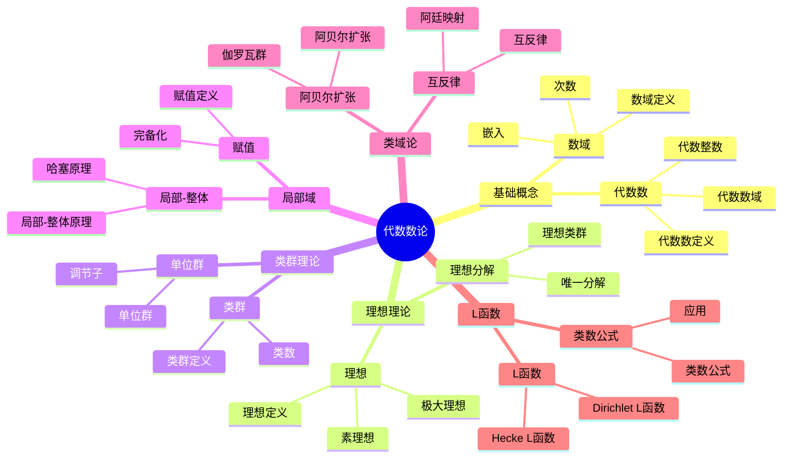

# 6.2 代数数论 / Algebraic Number Theory

## 目录 / Table of Contents

- [6.2 代数数论 / Algebraic Number Theory](#62-代数数论--algebraic-number-theory)
  - [目录 / Table of Contents](#目录--table-of-contents)
  - [🗺️ 代数数论核心概念思维导图](#️-代数数论核心概念思维导图)
  - [📊 代数数论核心概念多维知识矩阵](#-代数数论核心概念多维知识矩阵)
  - [6.2.1 基本概念 / Basic Concepts](#621-基本概念--basic-concepts)
    - [6.2.1.1 代数数 / Algebraic Numbers](#6211-代数数--algebraic-numbers)
    - [6.2.1.2 数域 / Number Fields](#6212-数域--number-fields)
    - [6.2.1.3 整环 / Integral Domains](#6213-整环--integral-domains)
  - [6.2.2 代数数域 / Algebraic Number Fields](#622-代数数域--algebraic-number-fields)
    - [6.2.2.1 嵌入 / Embeddings](#6221-嵌入--embeddings)
    - [6.2.2.2 判别式 / Discriminant](#6222-判别式--discriminant)
    - [6.2.2.3 迹与范数 / Trace and Norm](#6223-迹与范数--trace-and-norm)
  - [6.2.3 理想理论 / Ideal Theory](#623-理想理论--ideal-theory)
    - [6.2.3.1 理想 / Ideals](#6231-理想--ideals)
    - [6.2.3.2 素理想与极大理想 / Prime and Maximal Ideals](#6232-素理想与极大理想--prime-and-maximal-ideals)
    - [6.2.3.3 理想分解 / Ideal Factorization](#6233-理想分解--ideal-factorization)
  - [6.2.4 类群与单位群 / Class Group and Unit Group](#624-类群与单位群--class-group-and-unit-group)
    - [6.2.4.1 类群 / Class Group](#6241-类群--class-group)
    - [6.2.4.2 单位群 / Unit Group](#6242-单位群--unit-group)
    - [6.2.4.3 调节子 / Regulator](#6243-调节子--regulator)
  - [6.2.5 局部域 / Local Fields](#625-局部域--local-fields)
    - [6.2.5.1 赋值 / Valuations](#6251-赋值--valuations)
    - [6.2.5.2 完备化 / Completions](#6252-完备化--completions)
    - [6.2.5.3 局部-整体原理 / Local-Global Principle](#6253-局部-整体原理--local-global-principle)
  - [6.2.6 类域论 / Class Field Theory](#626-类域论--class-field-theory)
    - [6.2.6.1 阿贝尔扩张 / Abelian Extensions](#6261-阿贝尔扩张--abelian-extensions)
    - [6.2.6.2 阿廷映射 / Artin Map](#6262-阿廷映射--artin-map)
    - [6.2.6.3 互反律 / Reciprocity Law](#6263-互反律--reciprocity-law)
  - [6.2.7 L函数 / L-Functions](#627-l函数--l-functions)
    - [6.2.7.1 狄利克雷L函数 / Dirichlet L-Functions](#6271-狄利克雷l函数--dirichlet-l-functions)
    - [6.2.7.2 赫克L函数 / Hecke L-Functions](#6272-赫克l函数--hecke-l-functions)
    - [6.2.7.3 类数公式 / Class Number Formula](#6273-类数公式--class-number-formula)
  - [6.2.8 形式化实现 / Formal Implementation](#628-形式化实现--formal-implementation)
    - [6.2.8.1 Lean 4 实现 / Lean 4 Implementation](#6281-lean-4-实现--lean-4-implementation)
    - [6.2.8.2 Haskell 实现 / Haskell Implementation](#6282-haskell-实现--haskell-implementation)
    - [6.2.8.3 重要定理总结 / Summary of Important Theorems](#6283-重要定理总结--summary-of-important-theorems)
  - [参考文献 / References](#参考文献--references)

---

## 🗺️ 代数数论核心概念思维导图



## 📊 代数数论核心概念多维知识矩阵

| 概念类别 | 核心概念 | 定义要点 | 关键性质 | 典型例子 | 应用场景 |
|---------|---------|---------|---------|---------|---------|
| 基础概念 | 代数数 | 代数方程根 | 代数闭包 | √2, i | 数论基础 |
| 基础概念 | 代数整数 | 首一多项式根 | 整环结构 | √2, (1+√-3)/2 | 数论基础 |
| 基础概念 | 数域 | 有理数有限扩张 | 代数结构 | ℚ(√2), ℚ(i) | 数论研究 |
| 理想理论 | 理想 | 子环 | 素理想分解 | (2), (1+√-5) | 数论研究 |
| 理想理论 | 理想分解 | 唯一分解 | 戴德金环 | 理想分解 | 数论研究 |
| 理想理论 | 类群 | 理想类群 | 有限性 | Cl(K) | 数论分类 |
| 类群理论 | 类群 | 理想类群 | 有限性 | 类群 | 数论分类 |
| 类群理论 | 单位群 | 可逆元群 | 有限生成 | O_K* | 数论研究 |
| 局部域 | 赋值 | 绝对值 | 完备化 | p-adic数 | 数论研究 |
| 局部域 | 局部-整体 | 哈塞原理 | 局部解 | 二次型 | 数论研究 |
| 类域论 | 阿贝尔扩张 | 阿贝尔扩张 | 伽罗瓦群 | 类域 | 数论理论 |
| 类域论 | 互反律 | 互反律 | 阿廷映射 | 互反律 | 数论理论 |
| L函数 | Dirichlet L函数 | L函数 | 解析延拓 | L(s,χ) | 数论研究 |
| L函数 | 类数公式 | 类数公式 | L函数 | 类数公式 | 数论研究 |

## 6.2.1 基本概念 / Basic Concepts

### 6.2.1.1 代数数 / Algebraic Numbers

**定义 6.2.1.1** (代数数 / Algebraic Number)
复数 $\alpha$ 称为代数数，如果存在非零多项式 $f(x) \in \mathbb{Q}[x]$ 使得 $f(\alpha) = 0$。

**定义 6.2.1.2** (代数整数 / Algebraic Integer)
代数数 $\alpha$ 称为代数整数，如果存在首一多项式 $f(x) \in \mathbb{Z}[x]$ 使得 $f(\alpha) = 0$。

**定理 6.2.1.1** (代数数的性质 / Properties of Algebraic Numbers)
代数数集 $\overline{\mathbb{Q}}$ 是域，代数整数集 $\overline{\mathbb{Z}}$ 是环。

**证明** / Proof:

- 如果 $\alpha, \beta$ 是代数数，则 $\alpha + \beta, \alpha - \beta, \alpha\beta, \alpha/\beta$ 都是代数数
- 类似地，代数整数在加法、减法和乘法下封闭

### 6.2.1.2 数域 / Number Fields

**定义 6.2.1.2** (数域 / Number Field)
数域是 $\mathbb{Q}$ 的有限扩张 $K$，即 $K$ 是包含 $\mathbb{Q}$ 的有限维向量空间。

**定义 6.2.1.3** (次数 / Degree)
数域 $K$ 的次数 $[K : \mathbb{Q}]$ 定义为 $K$ 作为 $\mathbb{Q}$ 向量空间的维数。

**定理 6.2.1.2** (数域的基本性质 / Basic Properties of Number Fields)
数域 $K$ 具有以下性质：

1. $K$ 是代数扩张
2. $K$ 是完美域
3. $K$ 的代数闭包是 $\overline{\mathbb{Q}}$

### 6.2.1.3 整环 / Integral Domains

**定义 6.2.1.3** (整环 / Integral Domain)
数域 $K$ 的整环 $\mathcal{O}_K$ 定义为 $K$ 中所有代数整数的集合。

**定理 6.2.1.3** (整环的性质 / Properties of Integral Domain)
整环 $\mathcal{O}_K$ 是戴德金环，即：

1. 诺特环
2. 整闭
3. 维数为1

---

## 6.2.2 代数数域 / Algebraic Number Fields

### 6.2.2.1 嵌入 / Embeddings

**定义 6.2.2.1** (嵌入 / Embedding)
数域 $K$ 的嵌入是域同态 $\sigma: K \to \mathbb{C}$。

**定义 6.2.2.2** (实嵌入与复嵌入 / Real and Complex Embeddings)
嵌入 $\sigma$ 称为实嵌入，如果 $\sigma(K) \subseteq \mathbb{R}$；否则称为复嵌入。

**定理 6.2.2.1** (嵌入的数量 / Number of Embeddings)
数域 $K$ 有 $[K : \mathbb{Q}]$ 个嵌入，其中 $r_1$ 个实嵌入和 $r_2$ 对复嵌入。

### 6.2.2.2 判别式 / Discriminant

**定义 6.2.2.2** (判别式 / Discriminant)
数域 $K$ 的判别式 $\Delta_K$ 定义为：
$$\Delta_K = \det(\sigma_i(\omega_j))^2$$
其中 $\{\omega_1, \ldots, \omega_n\}$ 是 $\mathcal{O}_K$ 的基，$\{\sigma_1, \ldots, \sigma_n\}$ 是 $K$ 的嵌入。

**定理 6.2.2.2** (判别式的性质 / Properties of Discriminant)
判别式 $\Delta_K$ 是整数，且：

1. $\Delta_K \neq 0$
2. $\Delta_K \equiv 0, 1 \pmod{4}$
3. $|\Delta_K| \geq 3$ 除非 $K = \mathbb{Q}$

### 6.2.2.3 迹与范数 / Trace and Norm

**定义 6.2.2.3** (迹 / Trace)
元素 $\alpha \in K$ 的迹定义为：
$$\text{Tr}_{K/\mathbb{Q}}(\alpha) = \sum_{i=1}^n \sigma_i(\alpha)$$

**定义 6.2.2.4** (范数 / Norm)
元素 $\alpha \in K$ 的范数定义为：
$$\text{N}_{K/\mathbb{Q}}(\alpha) = \prod_{i=1}^n \sigma_i(\alpha)$$

**定理 6.2.2.3** (迹与范数的性质 / Properties of Trace and Norm)
对于 $\alpha, \beta \in K$：

1. $\text{Tr}_{K/\mathbb{Q}}(\alpha + \beta) = \text{Tr}_{K/\mathbb{Q}}(\alpha) + \text{Tr}_{K/\mathbb{Q}}(\beta)$
2. $\text{N}_{K/\mathbb{Q}}(\alpha\beta) = \text{N}_{K/\mathbb{Q}}(\alpha)\text{N}_{K/\mathbb{Q}}(\beta)$
3. $\text{Tr}_{K/\mathbb{Q}}(\alpha) \in \mathbb{Q}$，$\text{N}_{K/\mathbb{Q}}(\alpha) \in \mathbb{Q}$

---

## 6.2.3 理想理论 / Ideal Theory

### 6.2.3.1 理想 / Ideals

**定义 6.2.3.1** (理想 / Ideal)
整环 $\mathcal{O}_K$ 的理想是 $\mathcal{O}_K$ 的子集 $I$ 使得：

1. $I$ 是加法子群
2. 对于任意 $a \in \mathcal{O}_K$ 和 $b \in I$，$ab \in I$

**定义 6.2.3.2** (主理想 / Principal Ideal)
由单个元素 $\alpha$ 生成的主理想定义为：
$$(\alpha) = \{\alpha\beta : \beta \in \mathcal{O}_K\}$$

**定理 6.2.3.1** (理想的运算 / Operations on Ideals)
对于理想 $I, J$：

1. **和** / Sum: $I + J = \{a + b : a \in I, b \in J\}$
2. **积** / Product: $IJ = \{\sum a_i b_i : a_i \in I, b_i \in J\}$
3. **交** / Intersection: $I \cap J$

### 6.2.3.2 素理想与极大理想 / Prime and Maximal Ideals

**定义 6.2.3.3** (素理想 / Prime Ideal)
理想 $P$ 称为素理想，如果 $P \neq \mathcal{O}_K$ 且对于任意 $a, b \in \mathcal{O}_K$，$ab \in P$ 蕴含 $a \in P$ 或 $b \in P$。

**定义 6.2.3.4** (极大理想 / Maximal Ideal)
理想 $M$ 称为极大理想，如果 $M \neq \mathcal{O}_K$ 且不存在理想 $I$ 使得 $M \subsetneq I \subsetneq \mathcal{O}_K$。

**定理 6.2.3.2** (戴德金环中素理想的性质 / Properties of Prime Ideals in Dedekind Domains)
在戴德金环中，所有非零素理想都是极大理想。

### 6.2.3.3 理想分解 / Ideal Factorization

**定理 6.2.3.3** (理想唯一分解定理 / Unique Factorization of Ideals)
在戴德金环中，每个非零理想都可以唯一地表示为素理想的乘积：
$$I = P_1^{e_1} P_2^{e_2} \cdots P_k^{e_k}$$
其中 $P_i$ 是不同的素理想，$e_i > 0$。

**定义 6.2.3.5** (理想范数 / Ideal Norm)
理想 $I$ 的范数定义为：
$$\text{N}(I) = |\mathcal{O}_K/I|$$

**定理 6.2.3.4** (理想范数的性质 / Properties of Ideal Norm)
对于理想 $I, J$：

1. $\text{N}(IJ) = \text{N}(I)\text{N}(J)$
2. $\text{N}((\alpha)) = |\text{N}_{K/\mathbb{Q}}(\alpha)|$

---

## 6.2.4 类群与单位群 / Class Group and Unit Group

### 6.2.4.1 类群 / Class Group

**定义 6.2.4.1** (分式理想 / Fractional Ideal)
分式理想是 $\mathcal{O}_K$ 的子集 $I$ 使得存在 $\alpha \in K$ 使得 $\alpha I \subseteq \mathcal{O}_K$。

**定义 6.2.4.2** (主分式理想 / Principal Fractional Ideal)
主分式理想定义为：
$$(\alpha) = \{\alpha\beta : \beta \in \mathcal{O}_K\}$$

**定义 6.2.4.3** (类群 / Class Group)
类群 $Cl(K)$ 定义为分式理想群模主分式理想子群的商群。

**定理 6.2.4.1** (类群的基本性质 / Basic Properties of Class Group)
类群 $Cl(K)$ 是有限阿贝尔群。

**定理 6.2.4.2** (类数的有限性 / Finiteness of Class Number)
类数 $h_K = |Cl(K)|$ 是有限的。

### 6.2.4.2 单位群 / Unit Group

**定义 6.2.4.4** (单位群 / Unit Group)
单位群 $\mathcal{O}_K^\times$ 是 $\mathcal{O}_K$ 中可逆元素的乘法群。

**定理 6.2.4.3** (狄利克雷单位定理 / Dirichlet's Unit Theorem)
单位群 $\mathcal{O}_K^\times$ 的结构为：
$$\mathcal{O}_K^\times \cong \mu_K \times \mathbb{Z}^{r_1 + r_2 - 1}$$
其中 $\mu_K$ 是单位根群，$r_1$ 是实嵌入数，$r_2$ 是复嵌入对数。

**定义 6.2.4.5** (基本单位 / Fundamental Units)
基本单位是单位群自由部分的生成元。

### 6.2.4.3 调节子 / Regulator

**定义 6.2.4.6** (调节子 / Regulator)
调节子 $R_K$ 定义为基本单位在嵌入下的行列式的绝对值。

**定理 6.2.4.4** (调节子的性质 / Properties of Regulator)
调节子 $R_K$ 是正实数，且：

1. $R_K$ 不依赖于基本单位的选择
2. $R_K$ 与类数相关

---

## 6.2.5 局部域 / Local Fields

### 6.2.5.1 赋值 / Valuations

**定义 6.2.5.1** (赋值 / Valuation)
数域 $K$ 的赋值是函数 $v: K \to \mathbb{Z} \cup \{\infty\}$ 满足：

1. $v(x) = \infty$ 当且仅当 $x = 0$
2. $v(xy) = v(x) + v(y)$
3. $v(x + y) \geq \min(v(x), v(y))$

**定义 6.2.5.2** (离散赋值 / Discrete Valuation)
赋值 $v$ 称为离散的，如果 $v(K^\times) = \mathbb{Z}$。

### 6.2.5.2 完备化 / Completions

**定义 6.2.5.3** (局部域 / Local Field)
局部域是数域关于某个赋值的完备化。

**定理 6.2.5.1** (局部域的分类 / Classification of Local Fields)
局部域包括：

1. $\mathbb{Q}_p$：$p$ 进数域
2. $\mathbb{F}_p((t))$：有限域上的形式幂级数域
3. $\mathbb{R}, \mathbb{C}$：实数域和复数域

### 6.2.5.3 局部-整体原理 / Local-Global Principle

**定理 6.2.5.1** (哈塞-闵可夫斯基定理 / Hasse-Minkowski Theorem)
二次型在 $\mathbb{Q}$ 上有非零解当且仅当它在所有局部域上有非零解。

**定理 6.2.5.2** (阿廷互反律 / Artin Reciprocity Law)
对于数域 $K$ 的阿贝尔扩张 $L/K$，存在同构：
$$\text{Gal}(L/K) \cong C_K / \text{N}_{L/K}(C_L)$$
其中 $C_K$ 是 $K$ 的伊代尔类群。

---

## 6.2.6 类域论 / Class Field Theory

### 6.2.6.1 阿贝尔扩张 / Abelian Extensions

**定义 6.2.6.1** (阿贝尔扩张 / Abelian Extension)
数域扩张 $L/K$ 称为阿贝尔的，如果 $\text{Gal}(L/K)$ 是阿贝尔群。

**定理 6.2.6.1** (克罗内克-韦伯定理 / Kronecker-Weber Theorem)
$\mathbb{Q}$ 的每个阿贝尔扩张都包含在某个分圆域中。

### 6.2.6.2 阿廷映射 / Artin Map

**定义 6.2.6.2** (阿廷映射 / Artin Map)
对于阿贝尔扩张 $L/K$，阿廷映射定义为：
$$\phi_{L/K}: I_K \to \text{Gal}(L/K)$$
其中 $I_K$ 是 $K$ 的理想群。

**定理 6.2.6.2** (阿廷映射的性质 / Properties of Artin Map)
阿廷映射是满射，且核是 $\text{N}_{L/K}(I_L) \cdot P_K$，其中 $P_K$ 是主理想群。

### 6.2.6.3 互反律 / Reciprocity Law

**定理 6.2.6.1** (阿廷互反律 / Artin Reciprocity Law)
对于阿贝尔扩张 $L/K$，存在同构：
$$\text{Gal}(L/K) \cong C_K / \text{N}_{L/K}(C_L)$$

**定理 6.2.6.2** (存在定理 / Existence Theorem)
对于数域 $K$ 的每个有限指数开子群 $H$ 的 $C_K$，存在唯一的阿贝尔扩张 $L/K$ 使得：
$$\text{N}_{L/K}(C_L) = H$$

---

## 6.2.7 L函数 / L-Functions

### 6.2.7.1 狄利克雷L函数 / Dirichlet L-Functions

**定义 6.2.7.1** (狄利克雷特征 / Dirichlet Character)
模 $m$ 的狄利克雷特征是群同态 $\chi: (\mathbb{Z}/m\mathbb{Z})^\times \to \mathbb{C}^\times$。

**定义 6.2.7.2** (狄利克雷L函数 / Dirichlet L-Function)
狄利克雷L函数定义为：
$$L(s, \chi) = \sum_{n=1}^{\infty} \frac{\chi(n)}{n^s}$$

**定理 6.2.7.1** (狄利克雷L函数的性质 / Properties of Dirichlet L-Function)
狄利克雷L函数具有：

1. 欧拉乘积
2. 函数方程
3. 解析延拓

### 6.2.7.2 赫克L函数 / Hecke L-Functions

**定义 6.2.7.3** (赫克特征 / Hecke Character)
数域 $K$ 的赫克特征是伊代尔类群到 $\mathbb{C}^\times$ 的连续同态。

**定义 6.2.7.4** (赫克L函数 / Hecke L-Function)
赫克L函数定义为：
$$L(s, \chi) = \prod_{\mathfrak{p}} \frac{1}{1 - \chi(\mathfrak{p})\text{N}(\mathfrak{p})^{-s}}$$

**定理 6.2.7.2** (赫克L函数的性质 / Properties of Hecke L-Function)
赫克L函数具有：

1. 欧拉乘积
2. 函数方程
3. 解析延拓

### 6.2.7.3 类数公式 / Class Number Formula

**定理 6.2.7.3** (类数公式 / Class Number Formula)
对于数域 $K$，在 $s = 1$ 处：
$$\lim_{s \to 1} (s-1)\zeta_K(s) = \frac{2^{r_1}(2\pi)^{r_2}h_K R_K}{w_K \sqrt{|\Delta_K|}}$$
其中 $w_K$ 是单位根数。

---

## 6.2.8 形式化实现 / Formal Implementation

### 6.2.8.1 Lean 4 实现 / Lean 4 Implementation

```lean
-- 代数数
structure AlgebraicNumber where
  value : ℂ
  minimalPolynomial : Polynomial ℚ
  isRoot : minimalPolynomial.eval value = 0

-- 代数整数
structure AlgebraicInteger where
  value : ℂ
  minimalPolynomial : Polynomial ℤ
  isMonic : minimalPolynomial.leadingCoeff = 1
  isRoot : minimalPolynomial.eval value = 0

-- 数域
structure NumberField where
  field : Type
  baseField : Field field
  degree : ℕ
  embeddings : List (field → ℂ)
  integralRing : Ring field

-- 整环
def integralRing (K : NumberField) : Ring :=
  { elements := {α : K.field | isAlgebraicInteger α}
    addition := K.field.add
    multiplication := K.field.mul
    zero := K.field.zero
    one := K.field.one }

-- 判别式
def discriminant (K : NumberField) : ℤ :=
  let basis := integralBasis K
  let embeddings := K.embeddings
  det (matrix.map (λ i j, embeddings[i] basis[j]))^2

-- 迹与范数
def trace (K : NumberField) (α : K.field) : ℚ :=
  sum (map (λ σ, σ α) K.embeddings)

def norm (K : NumberField) (α : K.field) : ℚ :=
  product (map (λ σ, σ α) K.embeddings)

-- 理想
structure Ideal (K : NumberField) where
  elements : Set K.field
  isAdditiveSubgroup : AdditiveSubgroup elements
  isMultiplicativeIdeal : ∀ a : K.field, ∀ b ∈ elements, a * b ∈ elements

-- 主理想
def principalIdeal (K : NumberField) (α : K.field) : Ideal K :=
  { elements := {β : K.field | ∃ γ : K.field, β = α * γ}
    isAdditiveSubgroup := principal_additive_subgroup α
    isMultiplicativeIdeal := principal_multiplicative_ideal α }

-- 素理想
def primeIdeal (K : NumberField) (I : Ideal K) : Prop :=
  I ≠ ⊤ ∧ ∀ a b : K.field, a * b ∈ I → a ∈ I ∨ b ∈ I

-- 理想分解
theorem unique_factorization_ideals (K : NumberField) (I : Ideal K) :
  ∃ P : List (Ideal K), (∀ p ∈ P, primeIdeal p) ∧ I = product P ∧ unique P :=
  by
  -- 使用戴德金环的性质
  sorry

-- 类群
def classGroup (K : NumberField) : AbelianGroup :=
  quotient (fractionalIdeals K) (principalFractionalIdeals K)

-- 单位群
def unitGroup (K : NumberField) : Group :=
  { elements := {α : K.field | isUnit α}
    multiplication := K.field.mul
    inverse := K.field.inv
    identity := K.field.one }

-- 狄利克雷单位定理
theorem dirichlet_unit_theorem (K : NumberField) :
  unitGroup K ≅ μ_K × ℤ^(r₁ + r₂ - 1) :=
  by
  -- 使用对数嵌入
  sorry

-- 局部域
structure LocalField where
  field : Type
  valuation : field → ℤ ∪ {∞}
  isComplete : Complete field valuation

-- 阿廷映射
def artinMap (L K : NumberField) (extension : L.field → K.field) :
  idealGroup K → galoisGroup L K :=
  λ I, frobeniusElement I L K

-- 阿廷互反律
theorem artin_reciprocity (L K : NumberField) (abelian : isAbelian L K) :
  galoisGroup L K ≅ ideleClassGroup K / normGroup L K :=
  by
  -- 使用类域论
  sorry

-- L函数
def dirichletLFunction (χ : DirichletCharacter) (s : ℂ) : ℂ :=
  sum (λ n, χ n / n^s)

-- 类数公式
theorem class_number_formula (K : NumberField) :
  lim (s → 1) ((s - 1) * zetaFunction K s) =
  (2^r₁ * (2π)^r₂ * classNumber K * regulator K) /
  (unitRoots K * sqrt (discriminant K)) :=
  by
  -- 使用解析数论方法
  sorry
```

### 6.2.8.2 Haskell 实现 / Haskell Implementation

```haskell
-- 代数数
data AlgebraicNumber = AlgebraicNumber
  { value :: Complex Double
  , minimalPolynomial :: Polynomial Rational
  , isRoot :: evaluate minimalPolynomial value == 0
  }

-- 代数整数
data AlgebraicInteger = AlgebraicInteger
  { value :: Complex Double
  , minimalPolynomial :: Polynomial Integer
  , isMonic :: leadingCoeff minimalPolynomial == 1
  , isRoot :: evaluate minimalPolynomial value == 0
  }

-- 数域
data NumberField = NumberField
  { field :: Type
  , baseField :: Field field
  , degree :: Natural
  , embeddings :: [field -> Complex Double]
  , integralRing :: Ring field
  }

-- 整环
integralRing :: NumberField -> Ring
integralRing k = Ring
  { elements = [α | α <- field k, isAlgebraicInteger α]
  , addition = add (baseField k)
  , multiplication = mul (baseField k)
  , zero = zero (baseField k)
  , one = one (baseField k)
  }

-- 判别式
discriminant :: NumberField -> Integer
discriminant k =
  let basis = integralBasis k
      embeddings = embeddings k
      matrix = [[embeddings !! i (basis !! j) | j <- [0..degree k-1]] | i <- [0..degree k-1]]
  in determinant matrix ^ 2

-- 迹与范数
trace :: NumberField -> field -> Rational
trace k α = sum [σ α | σ <- embeddings k]

norm :: NumberField -> field -> Rational
norm k α = product [σ α | σ <- embeddings k]

-- 理想
data Ideal k = Ideal
  { elements :: Set (field k)
  , isAdditiveSubgroup :: AdditiveSubgroup elements
  , isMultiplicativeIdeal :: field k -> field k -> field k -> Bool
  }

-- 主理想
principalIdeal :: NumberField -> field -> Ideal k
principalIdeal k α = Ideal
  { elements = [β | β <- field k, any (\γ -> β == α * γ) (field k)]
  , isAdditiveSubgroup = principal_additive_subgroup α
  , isMultiplicativeIdeal = principal_multiplicative_ideal α
  }

-- 素理想
primeIdeal :: NumberField -> Ideal k -> Bool
primeIdeal k i =
  i /= top_ideal &&
  all (\a b -> a * b `member` elements i ==> a `member` elements i || b `member` elements i) (field k)

-- 理想分解
uniqueFactorizationIdeals :: NumberField -> Ideal k -> [Ideal k]
uniqueFactorizationIdeals k i =
  let primeFactors = factorize i
  in if all primeIdeal primeFactors && product primeFactors == i && unique primeFactors
     then primeFactors
     else error "Unique factorization failed"

-- 类群
classGroup :: NumberField -> AbelianGroup
classGroup k = quotient (fractionalIdeals k) (principalFractionalIdeals k)

-- 单位群
unitGroup :: NumberField -> Group
unitGroup k = Group
  { elements = [α | α <- field k, isUnit α]
  , multiplication = mul (baseField k)
  , inverse = inv (baseField k)
  , identity = one (baseField k)
  }

-- 狄利克雷单位定理
dirichletUnitTheorem :: NumberField -> Bool
dirichletUnitTheorem k =
  unitGroup k == direct_product (unit_roots k) (free_abelian_group (r1 k + r2 k - 1))

-- 局部域
data LocalField = LocalField
  { field :: Type
  , valuation :: field -> Integer
  , isComplete :: Complete field valuation
  }

-- 阿廷映射
artinMap :: NumberField -> NumberField -> (field -> field) -> Ideal k -> GaloisGroup
artinMap l k extension ideal = frobeniusElement ideal l k

-- 阿廷互反律
artinReciprocity :: NumberField -> NumberField -> Bool
artinReciprocity l k =
  isAbelian l k ==>
  galoisGroup l k == quotient (ideleClassGroup k) (normGroup l k)

-- L函数
dirichletLFunction :: DirichletCharacter -> Complex Double -> Complex Double
dirichletLFunction χ s = sum [χ n / fromInteger n ^^ s | n <- [1..]]

-- 类数公式
classNumberFormula :: NumberField -> Bool
classNumberFormula k =
  limit (\s -> (s - 1) * zetaFunction k s) 1 ==
  (2^r1 k * (2*pi)^r2 k * classNumber k * regulator k) /
  (unitRoots k * sqrt (discriminant k))

-- 定理验证
theorem_dirichlet_unit :: NumberField -> Bool
theorem_dirichlet_unit k =
  unitGroup k == direct_product (unit_roots k) (free_abelian_group (r1 k + r2 k - 1))

theorem_artin_reciprocity :: NumberField -> NumberField -> Bool
theorem_artin_reciprocity l k =
  isAbelian l k ==>
  galoisGroup l k == quotient (ideleClassGroup k) (normGroup l k)

theorem_class_number_formula :: NumberField -> Bool
theorem_class_number_formula k =
  limit (\s -> (s - 1) * zetaFunction k s) 1 ==
  (2^r1 k * (2*pi)^r2 k * classNumber k * regulator k) /
  (unitRoots k * sqrt (discriminant k))

-- 实例：二次域
instance NumberField QuadraticField where
  field = quadratic_field
  baseField = rational_field
  degree = 2
  embeddings = [real_embedding, conjugate_embedding]
  integralRing = quadratic_integers

-- 实例：分圆域
instance NumberField CyclotomicField where
  field = cyclotomic_field
  baseField = rational_field
  degree = euler_phi n
  embeddings = cyclotomic_embeddings n
  integralRing = cyclotomic_integers
```

### 6.2.8.3 重要定理总结 / Summary of Important Theorems

**定理 6.2.8.1** (狄利克雷单位定理 / Dirichlet's Unit Theorem)
单位群 $\mathcal{O}_K^\times$ 的结构为：
$$\mathcal{O}_K^\times \cong \mu_K \times \mathbb{Z}^{r_1 + r_2 - 1}$$

**定理 6.2.8.2** (阿廷互反律 / Artin Reciprocity Law)
对于阿贝尔扩张 $L/K$：
$$\text{Gal}(L/K) \cong C_K / \text{N}_{L/K}(C_L)$$

**定理 6.2.8.3** (类数公式 / Class Number Formula)
$$\lim_{s \to 1} (s-1)\zeta_K(s) = \frac{2^{r_1}(2\pi)^{r_2}h_K R_K}{w_K \sqrt{|\Delta_K|}}$$

**定理 6.2.8.4** (克罗内克-韦伯定理 / Kronecker-Weber Theorem)
$\mathbb{Q}$ 的每个阿贝尔扩张都包含在某个分圆域中。

---

## 参考文献 / References

1. Neukirch, J. (1999). *Algebraic Number Theory*. Springer-Verlag.
2. Lang, S. (1994). *Algebraic Number Theory* (2nd ed.). Springer-Verlag.
3. Marcus, D. A. (1977). *Number Fields*. Springer-Verlag.
4. Washington, L. C. (1997). *Introduction to Cyclotomic Fields* (2nd ed.). Springer-Verlag.

---

**相关链接** / Related Links:

- [初等数论](./01-初等数论.md)
- [解析数论](./03-解析数论.md)
- [组合数论](./04-组合数论.md)
- [计算数论](./05-计算数论.md)

---

**交互与补充资源 / Interactive & Supplementary Resources**:

- [交互式图表增强（数域/理想/伽罗瓦群可视化）](../交互式图表增强-2025年1月.md)
- [定理证明补充（狄利克雷单位定理/阿廷互反律）](../定理证明补充-2025年1月.md)
- [反例与特殊情况补充（非阿贝尔扩张/非主理想反例）](../反例与特殊情况补充-2025年1月.md)
- [历史背景补充（代数数论发展史）](../历史背景补充-2025年1月.md)
