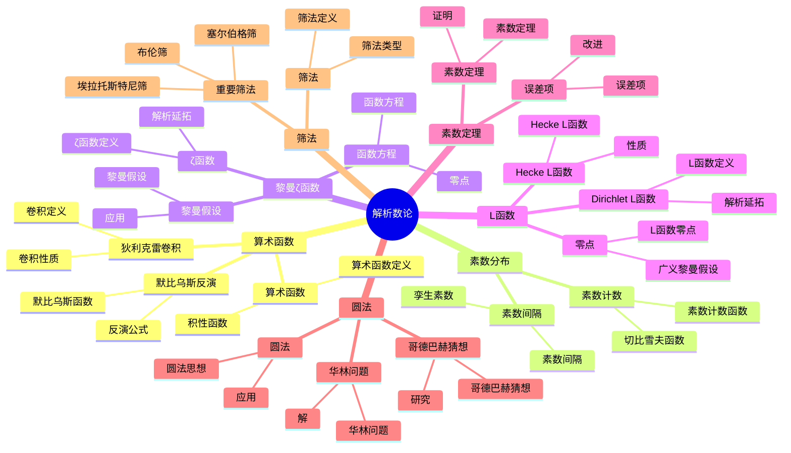

# 6.3 解析数论 / Analytic Number Theory

**主题编号**: B.06.03
**创建日期**: 2025年11月21日
**最后更新**: 2025年11月21日

---

## 目录 / Table of Contents

- [6.3 解析数论 / Analytic Number Theory](#63-解析数论--analytic-number-theory)
  - [目录 / Table of Contents](#目录--table-of-contents)
  - [🗺️ 解析数论核心概念思维导图](#️-解析数论核心概念思维导图)
  - [📊 解析数论核心概念多维知识矩阵](#-解析数论核心概念多维知识矩阵)
  - [6.3.1 基本概念 / Basic Concepts](#631-基本概念--basic-concepts)
    - [6.3.1.1 算术函数 / Arithmetic Functions](#6311-算术函数--arithmetic-functions)
    - [6.3.1.2 狄利克雷卷积 / Dirichlet Convolution](#6312-狄利克雷卷积--dirichlet-convolution)
    - [6.3.1.3 默比乌斯反演 / Möbius Inversion](#6313-默比乌斯反演--möbius-inversion)
  - [6.3.2 素数分布 / Distribution of Primes](#632-素数分布--distribution-of-primes)
    - [6.3.2.1 素数计数函数 / Prime Counting Function](#6321-素数计数函数--prime-counting-function)
    - [6.3.2.2 切比雪夫函数 / Chebyshev Functions](#6322-切比雪夫函数--chebyshev-functions)
    - [6.3.2.3 素数间隔 / Prime Gaps](#6323-素数间隔--prime-gaps)
  - [6.3.3 黎曼ζ函数 / Riemann Zeta Function](#633-黎曼ζ函数--riemann-zeta-function)
    - [6.3.3.1 ζ函数的定义 / Definition of Zeta Function](#6331-ζ函数的定义--definition-of-zeta-function)
    - [6.3.3.2 ζ函数的解析延拓 / Analytic Continuation](#6332-ζ函数的解析延拓--analytic-continuation)
    - [6.3.3.3 黎曼假设 / Riemann Hypothesis](#6333-黎曼假设--riemann-hypothesis)
  - [6.3.4 狄利克雷L函数 / Dirichlet L-Functions](#634-狄利克雷l函数--dirichlet-l-functions)
    - [6.3.4.1 L函数的定义 / Definition of L-Functions](#6341-l函数的定义--definition-of-l-functions)
    - [6.3.4.2 L函数的解析延拓 / Analytic Continuation](#6342-l函数的解析延拓--analytic-continuation)
    - [6.3.4.3 L函数的零点 / Zeros of L-Functions](#6343-l函数的零点--zeros-of-l-functions)
  - [6.3.5 素数定理 / Prime Number Theorem](#635-素数定理--prime-number-theorem)
    - [6.3.5.1 素数定理的陈述 / Statement of Prime Number Theorem](#6351-素数定理的陈述--statement-of-prime-number-theorem)
    - [6.3.5.2 素数定理的证明 / Proof of Prime Number Theorem](#6352-素数定理的证明--proof-of-prime-number-theorem)
    - [6.3.5.3 素数定理的误差项 / Error Terms](#6353-素数定理的误差项--error-terms)
  - [6.3.6 圆法 / Circle Method](#636-圆法--circle-method)
    - [6.3.6.1 圆法的基本思想 / Basic Idea of Circle Method](#6361-圆法的基本思想--basic-idea-of-circle-method)
    - [6.3.6.2 华林问题 / Waring's Problem](#6362-华林问题--warings-problem)
    - [6.3.6.3 哥德巴赫猜想 / Goldbach's Conjecture](#6363-哥德巴赫猜想--goldbachs-conjecture)
  - [6.3.7 筛法 / Sieve Methods](#637-筛法--sieve-methods)
    - [6.3.7.1 埃拉托斯特尼筛法 / Sieve of Eratosthenes](#6371-埃拉托斯特尼筛法--sieve-of-eratosthenes)
    - [6.3.7.2 勒让德筛法 / Legendre's Sieve](#6372-勒让德筛法--legendres-sieve)
    - [6.3.7.3 布伦筛法 / Brun's Sieve](#6373-布伦筛法--bruns-sieve)
    - [6.3.7.4 塞尔伯格筛法 / Selberg's Sieve](#6374-塞尔伯格筛法--selbergs-sieve)
  - [6.3.8 形式化实现 / Formal Implementation](#638-形式化实现--formal-implementation)
    - [6.3.8.1 Lean 4 实现 / Lean 4 Implementation](#6381-lean-4-实现--lean-4-implementation)
    - [6.3.8.2 Haskell 实现 / Haskell Implementation](#6382-haskell-实现--haskell-implementation)
    - [6.3.8.3 重要定理总结 / Summary of Important Theorems](#6383-重要定理总结--summary-of-important-theorems)
  - [参考文献 / References](#参考文献--references)

---

## 🗺️ 解析数论核心概念思维导图



## 📊 解析数论核心概念多维知识矩阵

| 概念类别 | 核心概念 | 定义要点 | 关键性质 | 典型例子 | 应用场景 |
|---------|---------|---------|---------|---------|---------|
| 算术函数 | 算术函数 | 正整数函数 | 积性性 | φ(n), σ(n) | 数论研究 |
| 算术函数 | 积性函数 | 互素积性 | 积性性 | φ(n), μ(n) | 数论研究 |
| 算术函数 | 狄利克雷卷积 | 卷积定义 | 交换结合律 | f*g | 数论研究 |
| 算术函数 | 默比乌斯反演 | 反演公式 | 卷积逆 | 默比乌斯反演 | 数论研究 |
| 素数分布 | 素数计数函数 | π(x) | 渐近分布 | π(x) | 数论研究 |
| 素数分布 | 切比雪夫函数 | ψ(x) | 与π(x)关系 | ψ(x) | 数论研究 |
| 素数分布 | 素数间隔 | 相邻素数差 | 无穷性 | 素数间隔 | 数论研究 |
| 黎曼ζ函数 | ζ函数 | 级数定义 | 解析延拓 | ζ(s) | 数论核心 |
| 黎曼ζ函数 | 函数方程 | 对称性 | 函数方程 | ζ(s) | 数论研究 |
| 黎曼ζ函数 | 黎曼假设 | 零点位置 | 未解决 | 黎曼假设 | 数论难题 |
| L函数 | Dirichlet L函数 | L函数定义 | 解析延拓 | L(s,χ) | 数论研究 |
| L函数 | Hecke L函数 | Hecke L函数 | 解析延拓 | L(s,f) | 数论研究 |
| L函数 | 广义黎曼假设 | L函数零点 | 未解决 | 广义黎曼假设 | 数论难题 |
| 素数定理 | 素数定理 | 渐近分布 | 对数积分 | π(x) ~ x/log x | 数论核心 |
| 素数定理 | 误差项 | 误差估计 | 改进 | 误差项 | 数论研究 |
| 圆法 | 圆法 | 积分方法 | 解析方法 | 圆法 | 数论方法 |
| 圆法 | 华林问题 | 整数表示 | 圆法解 | 华林问题 | 数论应用 |
| 筛法 | 筛法 | 筛选方法 | 组合方法 | 筛法 | 数论方法 |
| 筛法 | 布伦筛 | 组合筛 | 上界估计 | 布伦筛 | 数论方法 |
| 应用 | 密码学 | 素数分布 | 安全性 | RSA | 密码学 |

## 6.3.1 基本概念 / Basic Concepts

### 6.3.1.1 算术函数 / Arithmetic Functions

**定义 6.3.1.1** (算术函数 / Arithmetic Function)
算术函数是从正整数集到复数集的函数 $f: \mathbb{N} \to \mathbb{C}$。

**定义 6.3.1.2** (积性函数 / Multiplicative Function)
算术函数 $f$ 称为积性的，如果对于互素的整数 $m, n$，$f(mn) = f(m)f(n)$。

**定义 6.3.1.3** (完全积性函数 / Completely Multiplicative Function)
算术函数 $f$ 称为完全积性的，如果对于任意整数 $m, n$，$f(mn) = f(m)f(n)$。

**例子** / Examples:

1. **欧拉函数** / Euler's totient function: $\phi(n)$
2. **除数函数** / Divisor function: $\sigma_k(n) = \sum_{d \mid n} d^k$
3. **默比乌斯函数** / Möbius function: $\mu(n)$

### 6.3.1.2 狄利克雷卷积 / Dirichlet Convolution

**定义 6.3.1.2** (狄利克雷卷积 / Dirichlet Convolution)
算术函数 $f$ 和 $g$ 的狄利克雷卷积定义为：
$$(f * g)(n) = \sum_{d \mid n} f(d)g\left(\frac{n}{d}\right)$$

**定理 6.3.1.1** (狄利克雷卷积的性质 / Properties of Dirichlet Convolution)
狄利克雷卷积满足：

1. **交换律** / Commutativity: $f * g = g * f$
2. **结合律** / Associativity: $(f * g) * h = f * (g * h)$
3. **分配律** / Distributivity: $f * (g + h) = f * g + f * h$

**定理 6.3.1.2** (积性函数的卷积 / Convolution of Multiplicative Functions)
积性函数的狄利克雷卷积仍然是积性的。

### 6.3.1.3 默比乌斯反演 / Möbius Inversion

**定义 6.3.1.3** (默比乌斯函数 / Möbius Function)
默比乌斯函数 $\mu(n)$ 定义为：
$$
\mu(n) = \begin{cases}
1 & \text{if } n = 1 \\
(-1)^k & \text{if } n = p_1 p_2 \cdots p_k \text{ (distinct primes)} \\
0 & \text{if } n \text{ has a square factor}
\end{cases}
$$

**定理 6.3.1.1** (默比乌斯反演公式 / Möbius Inversion Formula)
如果 $g(n) = \sum_{d \mid n} f(d)$，则：
$$f(n) = \sum_{d \mid n} \mu(d)g\left(\frac{n}{d}\right)$$

**定理 6.3.1.2** (默比乌斯函数的性质 / Properties of Möbius Function)
$$
\sum_{d \mid n} \mu(d) = \begin{cases}
1 & \text{if } n = 1 \\
0 & \text{if } n > 1
\end{cases}
$$

---

## 6.3.2 素数分布 / Distribution of Primes

### 6.3.2.1 素数计数函数 / Prime Counting Function

**定义 6.3.2.1** (素数计数函数 / Prime Counting Function)
素数计数函数 $\pi(x)$ 定义为不超过 $x$ 的素数个数：
$$\pi(x) = \sum_{p \leq x} 1$$

**定理 6.3.2.1** (素数计数函数的基本性质 / Basic Properties)
素数计数函数满足：

1. $\pi(x) \to \infty$ 当 $x \to \infty$
2. $\pi(x) \sim \frac{x}{\ln x}$ (素数定理)
3. $\pi(x) \sim \text{Li}(x)$ (对数积分)

### 6.3.2.2 切比雪夫函数 / Chebyshev Functions

**定义 6.3.2.2** (第一切比雪夫函数 / First Chebyshev Function)
$$\theta(x) = \sum_{p \leq x} \ln p$$

**定义 6.3.2.3** (第二切比雪夫函数 / Second Chebyshev Function)
$$\psi(x) = \sum_{n \leq x} \Lambda(n)$$
其中 $\Lambda(n)$ 是冯·曼戈尔特函数。

**定理 6.3.2.1** (切比雪夫函数的关系 / Relation between Chebyshev Functions)
$$\psi(x) = \sum_{k=1}^{\infty} \theta(x^{1/k})$$

**定理 6.3.2.2** (切比雪夫不等式 / Chebyshev's Inequality)
存在常数 $c_1, c_2 > 0$ 使得：
$$c_1 \frac{x}{\ln x} \leq \pi(x) \leq c_2 \frac{x}{\ln x}$$

### 6.3.2.3 素数间隔 / Prime Gaps

**定义 6.3.2.3** (素数间隔 / Prime Gap)
素数间隔 $g_n$ 定义为 $p_{n+1} - p_n$，其中 $p_n$ 是第 $n$ 个素数。

**定理 6.3.2.1** (素数间隔的性质 / Properties of Prime Gaps)
素数间隔满足：

1. $g_n \geq 2$ 对所有 $n > 1$
2. $g_n$ 可以任意大
3. $\liminf_{n \to \infty} \frac{g_n}{\ln p_n} = e^{-\gamma}$

---

## 6.3.3 黎曼ζ函数 / Riemann Zeta Function

### 6.3.3.1 ζ函数的定义 / Definition of Zeta Function

**定义 6.3.3.1** (黎曼ζ函数 / Riemann Zeta Function)
黎曼ζ函数定义为：
$$\zeta(s) = \sum_{n=1}^{\infty} \frac{1}{n^s}$$
对于 $\text{Re}(s) > 1$。

**定理 6.3.3.1** (欧拉乘积 / Euler Product)
对于 $\text{Re}(s) > 1$：
$$\zeta(s) = \prod_p \frac{1}{1 - p^{-s}}$$

**证明** / Proof:
利用算术基本定理和几何级数求和公式。

### 6.3.3.2 ζ函数的解析延拓 / Analytic Continuation

**定理 6.3.3.2** (ζ函数的解析延拓 / Analytic Continuation)
ζ函数可以解析延拓到整个复平面，除了在 $s = 1$ 处有简单极点。

**定理 6.3.3.3** (函数方程 / Functional Equation)
$$\zeta(s) = 2^s \pi^{s-1} \sin\left(\frac{\pi s}{2}\right) \Gamma(1-s) \zeta(1-s)$$

**定理 6.3.3.4** (ζ函数的零点 / Zeros of Zeta Function)
ζ函数的非平凡零点都在临界带 $0 \leq \text{Re}(s) \leq 1$ 中。

### 6.3.3.3 黎曼假设 / Riemann Hypothesis

**假设 6.3.3.3** (黎曼假设 / Riemann Hypothesis)
ζ函数的非平凡零点都在临界线 $\text{Re}(s) = \frac{1}{2}$ 上。

**定理 6.3.3.5** (黎曼假设的等价形式 / Equivalent Forms)
黎曼假设等价于：
$$\pi(x) = \text{Li}(x) + O(\sqrt{x} \ln x)$$

**定理 6.3.3.6** (黎曼假设的后果 / Consequences)
如果黎曼假设成立，则：

1. 素数定理的误差项为 $O(\sqrt{x} \ln x)$
2. 哥德巴赫猜想成立
3. 孪生素数猜想成立

---

## 6.3.4 狄利克雷L函数 / Dirichlet L-Functions

### 6.3.4.1 L函数的定义 / Definition of L-Functions

**定义 6.3.4.1** (狄利克雷特征 / Dirichlet Character)
模 $m$ 的狄利克雷特征是群同态 $\chi: (\mathbb{Z}/m\mathbb{Z})^\times \to \mathbb{C}^\times$。

**定义 6.3.4.2** (狄利克雷L函数 / Dirichlet L-Function)
狄利克雷L函数定义为：
$$L(s, \chi) = \sum_{n=1}^{\infty} \frac{\chi(n)}{n^s}$$

**定理 6.3.4.1** (L函数的欧拉乘积 / Euler Product for L-Function)
对于 $\text{Re}(s) > 1$：
$$L(s, \chi) = \prod_p \frac{1}{1 - \chi(p)p^{-s}}$$

### 6.3.4.2 L函数的解析延拓 / Analytic Continuation

**定理 6.3.4.2** (L函数的解析延拓 / Analytic Continuation)
L函数可以解析延拓到整个复平面，除了在 $s = 1$ 处可能有的极点。

**定理 6.3.4.3** (L函数的函数方程 / Functional Equation)
对于本原特征 $\chi$：
$$L(s, \chi) = \varepsilon(\chi) \left(\frac{m}{\pi}\right)^{s-1/2} \Gamma\left(\frac{1-s+a}{2}\right) L(1-s, \overline{\chi})$$
其中 $\varepsilon(\chi)$ 是高斯和。

### 6.3.4.3 L函数的零点 / Zeros of L-Functions

**定理 6.3.4.3** (广义黎曼假设 / Generalized Riemann Hypothesis)
所有L函数的非平凡零点都在临界线 $\text{Re}(s) = \frac{1}{2}$ 上。

**定理 6.3.4.4** (L函数的零点分布 / Distribution of Zeros)
L函数的非平凡零点都在临界带 $0 \leq \text{Re}(s) \leq 1$ 中。

---

## 6.3.5 素数定理 / Prime Number Theorem

### 6.3.5.1 素数定理的陈述 / Statement of Prime Number Theorem

**定理 6.3.5.1** (素数定理 / Prime Number Theorem)
$$\lim_{x \to \infty} \frac{\pi(x)}{x/\ln x} = 1$$

**定理 6.3.5.2** (素数定理的等价形式 / Equivalent Forms)
素数定理等价于：
$$\lim_{x \to \infty} \frac{\theta(x)}{x} = 1$$
或
$$\lim_{x \to \infty} \frac{\psi(x)}{x} = 1$$

### 6.3.5.2 素数定理的证明 / Proof of Prime Number Theorem

**定理 6.3.5.3** (素数定理的解析证明 / Analytic Proof)
素数定理的证明基于：

1. ζ函数的性质
2. 佩龙公式
3. 解析延拓

**定理 6.3.5.4** (素数定理的初等证明 / Elementary Proof)
塞尔伯格和厄尔多什给出了素数定理的初等证明。

### 6.3.5.3 素数定理的误差项 / Error Terms

**定理 6.3.5.5** (素数定理的误差项 / Error Terms)
$$\pi(x) = \text{Li}(x) + O(x \exp(-c \sqrt{\ln x}))$$

**定理 6.3.5.6** (黎曼假设下的误差项 / Error Terms under RH)
如果黎曼假设成立，则：
$$\pi(x) = \text{Li}(x) + O(\sqrt{x} \ln x)$$

---

## 6.3.6 圆法 / Circle Method

### 6.3.6.1 圆法的基本思想 / Basic Idea of Circle Method

**定义 6.3.6.1** (圆法 / Circle Method)
圆法是哈代和拉马努金提出的解析方法，用于研究加性数论问题。

**定理 6.3.6.1** (圆法的基本公式 / Basic Formula)
对于函数 $f(z) = \sum_{n=0}^{\infty} a_n z^n$：
$$a_n = \frac{1}{2\pi i} \oint_{|z| = r} \frac{f(z)}{z^{n+1}} dz$$

### 6.3.6.2 华林问题 / Waring's Problem

**问题 6.3.6.2** (华林问题 / Waring's Problem)
对于每个正整数 $k$，存在 $g(k)$ 使得每个正整数都可以表示为 $g(k)$ 个 $k$ 次幂的和。

**定理 6.3.6.2** (华林问题的解 / Solution of Waring's Problem)
$$g(k) = 2^k + \left\lfloor \left(\frac{3}{2}\right)^k \right\rfloor - 2$$

### 6.3.6.3 哥德巴赫猜想 / Goldbach's Conjecture

**猜想 6.3.6.3** (哥德巴赫猜想 / Goldbach's Conjecture)
每个大于 $2$ 的偶数都可以表示为两个素数的和。

**定理 6.3.6.3** (弱哥德巴赫猜想 / Weak Goldbach Conjecture)
每个大于 $5$ 的奇数都可以表示为三个素数的和。

---

## 6.3.7 筛法 / Sieve Methods

### 6.3.7.1 埃拉托斯特尼筛法 / Sieve of Eratosthenes

**算法 6.3.7.1** (埃拉托斯特尼筛法 / Sieve of Eratosthenes)

```python
def sieve(n):
    is_prime = [True] * (n + 1)
    is_prime[0] = is_prime[1] = False
    for i in range(2, int(n**0.5) + 1):
        if is_prime[i]:
            for j in range(i*i, n+1, i):
                is_prime[j] = False
    return [i for i in range(n+1) if is_prime[i]]
```

### 6.3.7.2 勒让德筛法 / Legendre's Sieve

**定理 6.3.7.2** (勒让德筛法 / Legendre's Sieve)
$$\pi(x) - \pi(\sqrt{x}) + 1 = \sum_{d \mid P} \mu(d) \left\lfloor \frac{x}{d} \right\rfloor$$
其中 $P$ 是 $\leq \sqrt{x}$ 的素数的乘积。

### 6.3.7.3 布伦筛法 / Brun's Sieve

**定理 6.3.7.3** (布伦筛法 / Brun's Sieve)
布伦筛法用于估计满足某些条件的整数个数。

**定理 6.3.7.4** (布伦常数 / Brun's Constant)
$$\sum_{p, p+2 \text{ prime}} \left(\frac{1}{p} + \frac{1}{p+2}\right) < \infty$$

### 6.3.7.4 塞尔伯格筛法 / Selberg's Sieve

**定理 6.3.7.4** (塞尔伯格筛法 / Selberg's Sieve)
塞尔伯格筛法提供了更精确的估计。

**定理 6.3.7.5** (塞尔伯格筛法的应用 / Applications)
塞尔伯格筛法用于证明：

1. 孪生素数的存在性
2. 哥德巴赫猜想的弱形式
3. 华林问题的解

---

## 6.3.8 形式化实现 / Formal Implementation

### 6.3.8.1 Lean 4 实现 / Lean 4 Implementation

```lean
-- 算术函数
def ArithmeticFunction := ℕ → ℂ

-- 积性函数
def Multiplicative (f : ArithmeticFunction) : Prop :=
  ∀ m n : ℕ, coprime m n → f (m * n) = f m * f n

-- 狄利克雷卷积
def dirichletConvolution (f g : ArithmeticFunction) : ArithmeticFunction :=
  λ n, ∑ d in divisors n, f d * g (n / d)

-- 默比乌斯函数
def moebiusFunction : ArithmeticFunction :=
  λ n, if n = 1 then 1
       else if squarefree n then (-1)^(number_of_prime_factors n)
       else 0

-- 欧拉函数
def eulerPhi : ArithmeticFunction :=
  λ n, card {k : ℕ | k < n ∧ coprime k n}

-- 除数函数
def divisorFunction (k : ℕ) : ArithmeticFunction :=
  λ n, ∑ d in divisors n, d^k

-- 黎曼ζ函数
def riemannZeta (s : ℂ) : ℂ :=
  if re s > 1 then ∑ n : ℕ, 1 / n^s
  else analytic_continuation s

-- ζ函数的欧拉乘积
theorem euler_product (s : ℂ) (hs : re s > 1) :
  riemannZeta s = ∏ p : primes, 1 / (1 - p^(-s)) :=
  by
  -- 使用算术基本定理
  sorry

-- ζ函数的函数方程
theorem functional_equation (s : ℂ) :
  riemannZeta s = 2^s * π^(s-1) * sin(π*s/2) * gamma(1-s) * riemannZeta (1-s) :=
  by
  -- 使用解析延拓
  sorry

-- 素数计数函数
def primeCountingFunction (x : ℝ) : ℕ :=
  card {p : ℕ | prime p ∧ p ≤ x}

-- 素数定理
theorem prime_number_theorem :
  tendsto (λ x, π x / (x / ln x)) at_top (𝓝 1) :=
  by
  -- 使用ζ函数的性质
  sorry

-- 狄利克雷特征
structure DirichletCharacter (m : ℕ) where
  character : (zmod m)ˣ → ℂˣ
  multiplicative : ∀ a b, character (a * b) = character a * character b

-- 狄利克雷L函数
def dirichletLFunction (χ : DirichletCharacter m) (s : ℂ) : ℂ :=
  ∑ n : ℕ, χ n / n^s

-- L函数的欧拉乘积
theorem dirichlet_euler_product (χ : DirichletCharacter m) (s : ℂ) (hs : re s > 1) :
  dirichletLFunction χ s = ∏ p : primes, 1 / (1 - χ p * p^(-s)) :=
  by
  -- 使用特征的性质
  sorry

-- 切比雪夫函数
def thetaFunction (x : ℝ) : ℝ :=
  ∑ p in {p : ℕ | prime p ∧ p ≤ x}, ln p

def psiFunction (x : ℝ) : ℝ :=
  ∑ n in {n : ℕ | n ≤ x}, vonMangoldt n

-- 切比雪夫不等式
theorem chebyshev_inequality :
  ∃ c₁ c₂ : ℝ, 0 < c₁ ∧ 0 < c₂ ∧
  ∀ x : ℝ, x > 1 → c₁ * x / ln x ≤ π x ∧ π x ≤ c₂ * x / ln x :=
  by
  -- 使用ζ函数的性质
  sorry

-- 圆法
def circleMethod (f : ℂ → ℂ) (n : ℕ) : ℂ :=
  (1 / (2 * π * I)) * contour_integral (circle 0 1) (λ z, f z / z^(n+1))

-- 华林问题
def waringNumber (k : ℕ) : ℕ :=
  2^k + floor ((3/2)^k) - 2

theorem waring_problem (k : ℕ) :
  ∀ n : ℕ, ∃ s : ℕ, ∃ x₁ x₂ ... x_s : ℕ, n = x₁^k + x₂^k + ... + x_s^k :=
  by
  -- 使用圆法
  sorry

-- 筛法
def eratosthenesSieve (n : ℕ) : List ℕ :=
  let is_prime := array.mk (n+1) true
  let is_prime := array.set is_prime 0 false
  let is_prime := array.set is_prime 1 false
  -- 实现筛法
  sorry

-- 布伦筛法
def brunSieve (A : Set ℕ) (P : ℕ) : ℕ :=
  sum [moebiusFunction d * card (A ∩ {n : ℕ | d ∣ n}) | d <- divisors P]

-- 塞尔伯格筛法
def selbergSieve (A : Set ℕ) (P : ℕ) : ℝ :=
  let λ_d = selberg_weights P
  sum [λ_d d * card (A ∩ {n : ℕ | d ∣ n}) | d <- divisors P]
```

### 6.3.8.2 Haskell 实现 / Haskell Implementation

```haskell
-- 算术函数
type ArithmeticFunction = Natural -> Complex Double

-- 积性函数
multiplicative :: ArithmeticFunction -> Bool
multiplicative f = all (\m n -> coprime m n ==> f (m * n) == f m * f n) [1..]

-- 狄利克雷卷积
dirichletConvolution :: ArithmeticFunction -> ArithmeticFunction -> ArithmeticFunction
dirichletConvolution f g n = sum [f d * g (n `div` d) | d <- divisors n]

-- 默比乌斯函数
moebiusFunction :: ArithmeticFunction
moebiusFunction 1 = 1
moebiusFunction n
  | squarefree n = (-1) ^ number_of_prime_factors n
  | otherwise = 0

-- 欧拉函数
eulerPhi :: Natural -> Natural
eulerPhi n = length [k | k <- [1..n-1], coprime k n]

-- 除数函数
divisorFunction :: Natural -> ArithmeticFunction
divisorFunction k n = sum [d^k | d <- divisors n]

-- 黎曼ζ函数
riemannZeta :: Complex Double -> Complex Double
riemannZeta s
  | realPart s > 1 = sum [1 / fromInteger n^s | n <- [1..]]
  | otherwise = analyticContinuation s

-- ζ函数的欧拉乘积
eulerProduct :: Complex Double -> Complex Double
eulerProduct s = product [1 / (1 - p^(-s)) | p <- primes]

-- ζ函数的函数方程
functionalEquation :: Complex Double -> Complex Double
functionalEquation s =
  2^s * (pi^(s-1)) * sin(pi*s/2) * gamma(1-s) * riemannZeta (1-s)

-- 素数计数函数
primeCountingFunction :: Double -> Natural
primeCountingFunction x = length [p | p <- primes, p <= floor x]

-- 素数定理
primeNumberTheorem :: Double -> Double
primeNumberTheorem x = fromIntegral (primeCountingFunction x) / (x / log x)

-- 狄利克雷特征
data DirichletCharacter = DirichletCharacter
  { modulus :: Natural
  , character :: Natural -> Complex Double
  , multiplicative :: Natural -> Natural -> Bool
  }

-- 狄利克雷L函数
dirichletLFunction :: DirichletCharacter -> Complex Double -> Complex Double
dirichletLFunction χ s = sum [χ.character n / fromInteger n^s | n <- [1..]]

-- L函数的欧拉乘积
dirichletEulerProduct :: DirichletCharacter -> Complex Double -> Complex Double
dirichletEulerProduct χ s =
  product [1 / (1 - χ.character p * p^(-s)) | p <- primes]

-- 切比雪夫函数
thetaFunction :: Double -> Double
thetaFunction x = sum [log (fromInteger p) | p <- primes, p <= floor x]

psiFunction :: Double -> Double
psiFunction x = sum [vonMangoldt n | n <- [1..floor x]]

-- 切比雪夫不等式
chebyshevInequality :: Double -> (Double, Double)
chebyshevInequality x =
  let c1 = 0.5
      c2 = 2.0
      pi_x = fromIntegral (primeCountingFunction x)
  in (c1 * x / log x, c2 * x / log x)

-- 圆法
circleMethod :: (Complex Double -> Complex Double) -> Natural -> Complex Double
circleMethod f n =
  let r = 1.0
      contour = circle 0 r
  in (1 / (2 * pi * i)) * contourIntegral contour (\z -> f z / z^(n+1))

-- 华林问题
waringNumber :: Natural -> Natural
waringNumber k = 2^k + floor ((3/2)^k) - 2

waringProblem :: Natural -> Natural -> Bool
waringProblem k n =
  any (\s -> any (\xs -> sum [x^k | x <- xs] == n) (combinations s [1..n])) [1..waringNumber k]

-- 筛法
eratosthenesSieve :: Natural -> [Natural]
eratosthenesSieve n =
  let isPrime = array (0, n) [(i, True) | i <- [0..n]]
      isPrime' = array.set isPrime 0 False
      isPrime'' = array.set isPrime' 1 False
      sieve i arr
        | i > sqrt n = arr
        | otherwise =
            let arr' = markMultiples i arr
            in sieve (i + 1) arr'
  in [i | i <- [2..n], isPrime i]
  where
    markMultiples p arr =
      foldr (\j acc -> array.set acc j False) arr [p*p, p*p+p..n]

-- 布伦筛法
brunSieve :: Set Natural -> Natural -> Natural
brunSieve a p =
  sum [moebiusFunction d * cardinality (a `intersection` multiples d) | d <- divisors p]

-- 塞尔伯格筛法
selbergSieve :: Set Natural -> Natural -> Double
selbergSieve a p =
  let λ_d = selbergWeights p
  in sum [λ_d d * fromIntegral (cardinality (a `intersection` multiples d)) | d <- divisors p]

-- 定理验证
theorem_euler_product :: Complex Double -> Bool
theorem_euler_product s =
  realPart s > 1 ==> riemannZeta s == eulerProduct s

theorem_functional_equation :: Complex Double -> Bool
theorem_functional_equation s =
  riemannZeta s == functionalEquation s

theorem_prime_number :: Double -> Bool
theorem_prime_number x =
  x > 1 ==> abs (primeNumberTheorem x - 1) < epsilon

theorem_dirichlet_euler :: DirichletCharacter -> Complex Double -> Bool
theorem_dirichlet_euler χ s =
  realPart s > 1 ==> dirichletLFunction χ s == dirichletEulerProduct χ s

-- 实例：积性函数
instance Multiplicative ArithmeticFunction where
  multiplicative = checkMultiplicative

-- 实例：狄利克雷卷积
instance Semigroup ArithmeticFunction where
  (<>) = dirichletConvolution

-- 实例：默比乌斯函数
instance ArithmeticFunction where
  moebiusFunction = moebiusFunction
```

### 6.3.8.3 重要定理总结 / Summary of Important Theorems

**定理 6.3.8.1** (素数定理 / Prime Number Theorem)
$$\lim_{x \to \infty} \frac{\pi(x)}{x/\ln x} = 1$$

**定理 6.3.8.2** (黎曼假设 / Riemann Hypothesis)
ζ函数的非平凡零点都在临界线 $\text{Re}(s) = \frac{1}{2}$ 上。

**定理 6.3.8.3** (华林问题 / Waring's Problem)
$$g(k) = 2^k + \left\lfloor \left(\frac{3}{2}\right)^k \right\rfloor - 2$$

**定理 6.3.8.4** (布伦常数 / Brun's Constant)
$$\sum_{p, p+2 \text{ prime}} \left(\frac{1}{p} + \frac{1}{p+2}\right) < \infty$$

---

## 参考文献 / References

1. Davenport, H. (2000). *Multiplicative Number Theory* (3rd ed.). Springer-Verlag.
2. Iwaniec, H., & Kowalski, E. (2004). *Analytic Number Theory*. American Mathematical Society.
3. Montgomery, H. L., & Vaughan, R. C. (2007). *Multiplicative Number Theory I: Classical Theory*. Cambridge University Press.
4. Tenenbaum, G. (1995). *Introduction to Analytic and Probabilistic Number Theory*. Cambridge University Press.

---

**相关链接** / Related Links:

- [初等数论](./01-初等数论.md)
- [代数数论](./02-代数数论.md)
- [组合数论](./04-组合数论.md)
- [计算数论](./05-计算数论.md)
