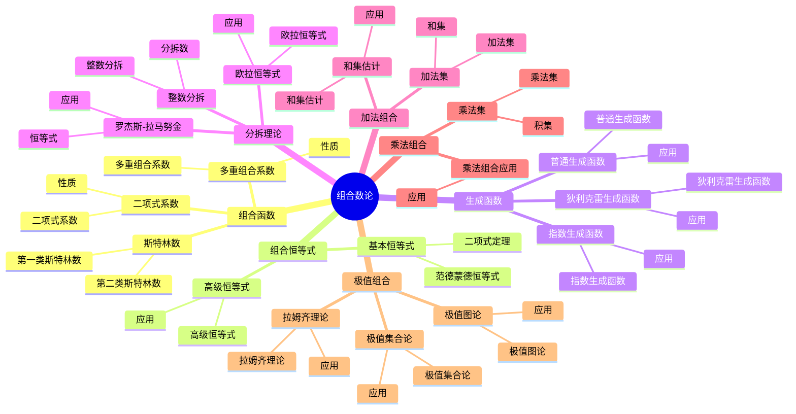

# 组合数论 / Combinatorial Number Theory

**主题编号**: B.06.04
**创建日期**: 2025年11月21日
**最后更新**: 2025年11月21日

---

## 目录 / Table of Contents

- [组合数论 / Combinatorial Number Theory](#组合数论--combinatorial-number-theory)
  - [目录 / Table of Contents](#目录--table-of-contents)
  - [🗺️ 组合数论核心概念思维导图](#️-组合数论核心概念思维导图)
  - [📊 组合数论核心概念多维知识矩阵](#-组合数论核心概念多维知识矩阵)
  - [1. 基本概念 / Basic Concepts](#1-基本概念--basic-concepts)
    - [1.1 组合函数 / Combinatorial Functions](#11-组合函数--combinatorial-functions)
    - [1.2 组合恒等式 / Combinatorial Identities](#12-组合恒等式--combinatorial-identities)
    - [1.3 组合序列 / Combinatorial Sequences](#13-组合序列--combinatorial-sequences)
  - [2. 组合恒等式 / Combinatorial Identities](#2-组合恒等式--combinatorial-identities)
    - [2.1 基本恒等式 / Basic Identities](#21-基本恒等式--basic-identities)
    - [2.2 高级恒等式 / Advanced Identities](#22-高级恒等式--advanced-identities)
    - [2.3 多重恒等式 / Multiple Identities](#23-多重恒等式--multiple-identities)
  - [3. 生成函数 / Generating Functions](#3-生成函数--generating-functions)
    - [3.1 普通生成函数 / Ordinary Generating Functions](#31-普通生成函数--ordinary-generating-functions)
    - [3.2 指数生成函数 / Exponential Generating Functions](#32-指数生成函数--exponential-generating-functions)
    - [3.3 狄利克雷生成函数 / Dirichlet Generating Functions](#33-狄利克雷生成函数--dirichlet-generating-functions)
  - [4. 分拆理论 / Partition Theory](#4-分拆理论--partition-theory)
    - [4.1 整数分拆 / Integer Partitions](#41-整数分拆--integer-partitions)
    - [4.2 欧拉恒等式 / Euler's Identity](#42-欧拉恒等式--eulers-identity)
    - [4.3 罗杰斯-拉马努金恒等式 / Rogers-Ramanujan Identities](#43-罗杰斯-拉马努金恒等式--rogers-ramanujan-identities)
  - [5. 加法组合 / Additive Combinatorics](#5-加法组合--additive-combinatorics)
    - [5.1 加法集 / Additive Sets](#51-加法集--additive-sets)
    - [5.2 和集估计 / Sumset Estimates](#52-和集估计--sumset-estimates)
    - [5.3 加法组合的应用 / Applications of Additive Combinatorics](#53-加法组合的应用--applications-of-additive-combinatorics)
  - [6. 乘法组合 / Multiplicative Combinatorics](#6-乘法组合--multiplicative-combinatorics)
    - [6.1 乘法集 / Multiplicative Sets](#61-乘法集--multiplicative-sets)
    - [6.2 乘法组合的应用 / Applications of Multiplicative Combinatorics](#62-乘法组合的应用--applications-of-multiplicative-combinatorics)
  - [7. 极值组合 / Extremal Combinatorics](#7-极值组合--extremal-combinatorics)
    - [7.1 极值图论 / Extremal Graph Theory](#71-极值图论--extremal-graph-theory)
    - [7.2 拉姆齐理论 / Ramsey Theory](#72-拉姆齐理论--ramsey-theory)
    - [7.3 极值集合论 / Extremal Set Theory](#73-极值集合论--extremal-set-theory)
  - [8. 形式化实现 / Formal Implementation](#8-形式化实现--formal-implementation)
    - [8.1 Lean 4 实现 / Lean 4 Implementation](#81-lean-4-实现--lean-4-implementation)
    - [8.2 Haskell 实现 / Haskell Implementation](#82-haskell-实现--haskell-implementation)
    - [8.3 重要定理总结 / Summary of Important Theorems](#83-重要定理总结--summary-of-important-theorems)
  - [参考文献 / References](#参考文献--references)

---

## 🗺️ 组合数论核心概念思维导图



## 📊 组合数论核心概念多维知识矩阵

| 概念类别 | 核心概念 | 定义要点 | 关键性质 | 典型例子 | 应用场景 |
|---------|---------|---------|---------|---------|---------|
| 组合函数 | 二项式系数 | C(n,k) | 对称性 | C(n,k) | 组合计算 |
| 组合函数 | 多重组合系数 | C(n;k₁,...,kᵣ) | 对称性 | 多重组合 | 组合计算 |
| 组合函数 | 斯特林数 | s(n,k), S(n,k) | 递推关系 | 斯特林数 | 组合计算 |
| 组合恒等式 | 二项式定理 | (x+y)ⁿ | 展开式 | 二项式定理 | 组合计算 |
| 组合恒等式 | 范德蒙德恒等式 | 卷积恒等式 | 卷积 | 范德蒙德 | 组合计算 |
| 生成函数 | 普通生成函数 | 幂级数 | 生成函数 | G(x) | 组合计算 |
| 生成函数 | 指数生成函数 | 指数级数 | 生成函数 | E(x) | 组合计算 |
| 生成函数 | 狄利克雷生成函数 | 狄利克雷级数 | 生成函数 | D(s) | 数论应用 |
| 分拆理论 | 整数分拆 | 分拆数 | 分拆函数 | p(n) | 数论研究 |
| 分拆理论 | 欧拉恒等式 | 分拆恒等式 | 恒等式 | 欧拉恒等式 | 数论研究 |
| 分拆理论 | 罗杰斯-拉马努金 | 分拆恒等式 | 恒等式 | 罗杰斯-拉马努金 | 数论研究 |
| 加法组合 | 加法集 | 和集 | 和集估计 | A+B | 数论研究 |
| 加法组合 | 和集估计 | 和集大小 | 估计 | \|A+B\| | 数论研究 |
| 乘法组合 | 乘法集 | 积集 | 积集估计 | AB | 数论研究 |
| 极值组合 | 极值图论 | 极值图 | 极值问题 | 极值图 | 组合数学 |
| 极值组合 | 拉姆齐理论 | 拉姆齐数 | 拉姆齐定理 | R(k,l) | 组合数学 |
| 应用 | 数论研究 | 组合方法 | 数论问题 | 组合数论 | 数论 |

## 1. 基本概念 / Basic Concepts

### 1.1 组合函数 / Combinatorial Functions

**定义 1.1.1** (二项式系数 / Binomial Coefficient)
二项式系数定义为：
$$\binom{n}{k} = \frac{n!}{k!(n-k)!}$$
其中 $0 \leqqq k \leqqq n$。

**定义 1.1.2** (多重组合系数 / Multinomial Coefficient)
多重组合系数定义为：
$$\binom{n}{k_1, k_2, \ldots, k_r} = \frac{n!}{k_1! k_2! \cdots k_r!}$$
其中 $k_1 + k_2 + \cdots + k_r = n$。

**定义 1.1.3** (斯特林数 / Stirling Numbers)
第一类斯特林数 $s(n,k)$ 和第二类斯特林数 $S(n,k)$ 分别定义为：
$$x(x-1) \cdots (x-n+1) = \sum_{k=0}^n s(n,k) x^k$$
$$x^n = \sum_{k=0}^n S(n,k) x(x-1) \cdots (x-k+1)$$

### 1.2 组合恒等式 / Combinatorial Identities

**定理 1.2.1** (二项式定理 / Binomial Theorem)
$$(x+y)^n = \sum_{k=0}^n \binom{n}{k} x^k y^{n-k}$$

**定理 1.2.2** (范德蒙德恒等式 / Vandermonde Identity)
$$\binom{m+n}{k} = \sum_{i=0}^k \binom{m}{i} \binom{n}{k-i}$$

**定理 1.2.3** (帕斯卡恒等式 / Pascal's Identity)
$$\binom{n+1}{k} = \binom{n}{k} + \binom{n}{k-1}$$

### 1.3 组合序列 / Combinatorial Sequences

**定义 1.3.1** (斐波那契数列 / Fibonacci Sequence)
斐波那契数列定义为：
$$F_0 = 0, F_1 = 1, F_n = F_{n-1} + F_{n-2}$$

**定义 1.3.2** (卡特兰数列 / Catalan Numbers)
卡特兰数列定义为：
$$C_n = \frac{1}{n+1} \binom{2n}{n}$$

**定义 1.3.3** (贝尔数列 / Bell Numbers)
贝尔数列 $B_n$ 定义为 $n$ 个元素的集合的分划数。

---

## 2. 组合恒等式 / Combinatorial Identities

### 2.1 基本恒等式 / Basic Identities

**定理 2.1.1** (二项式系数的性质 / Properties of Binomial Coefficients)
对于任意非负整数 $n, k$：

1. $\binom{n}{k} = \binom{n}{n-k}$
2. $\sum_{k=0}^n \binom{n}{k} = 2^n$
3. $\sum_{k=0}^n k \binom{n}{k} = n \cdot 2^{n-1}$
4. $\sum_{k=0}^n k^2 \binom{n}{k} = n(n+1) \cdot 2^{n-2}$

**定理 2.1.2** (二项式系数的递推关系 / Recurrence Relations)
$$\binom{n+1}{k+1} = \sum_{i=k}^n \binom{i}{k}$$

**定理 2.1.3** (二项式系数的生成函数 / Generating Function)
$$\sum_{n=0}^{\infty} \binom{n}{k} x^n = \frac{x^k}{(1-x)^{k+1}}$$

### 2.2 高级恒等式 / Advanced Identities

**定理 2.2.1** (高斯恒等式 / Gauss's Identity)
$$\sum_{k=0}^n \binom{n}{k} \binom{m}{k} = \binom{n+m}{n}$$

**定理 2.2.2** (朱世杰恒等式 / Chu-Vandermonde Identity)
$$\sum_{k=0}^n \binom{n}{k} \binom{m}{r-k} = \binom{n+m}{r}$$

**定理 2.2.3** (李善兰恒等式 / Li Shanlan's Identity)
$$\sum_{k=0}^n \binom{n}{k}^2 = \binom{2n}{n}$$

### 2.3 多重恒等式 / Multiple Identities

**定理 2.3.1** (多重二项式定理 / Multinomial Theorem)
$$(x_1 + x_2 + \cdots + x_r)^n = \sum_{k_1 + \cdots + k_r = n} \binom{n}{k_1, \ldots, k_r} x_1^{k_1} \cdots x_r^{k_r}$$

**定理 2.3.2** (斯特林数的性质 / Properties of Stirling Numbers)
$$S(n+1,k) = S(n,k-1) + k S(n,k)$$
$$s(n+1,k) = s(n,k-1) - n s(n,k)$$

---

## 3. 生成函数 / Generating Functions

### 3.1 普通生成函数 / Ordinary Generating Functions

**定义 3.1.1** (普通生成函数 / Ordinary Generating Function)
序列 $\{a_n\}$ 的普通生成函数定义为：
$$A(x) = \sum_{n=0}^{\infty} a_n x^n$$

**定理 3.1.1** (生成函数的基本运算 / Basic Operations)
对于序列 $\{a_n\}$ 和 $\{b_n\}$：

1. $A(x) + B(x) = \sum_{n=0}^{\infty} (a_n + b_n) x^n$
2. $A(x) \cdot B(x) = \sum_{n=0}^{\infty} \leqqft(\sum_{k=0}^n a_k b_{n-k}\right) x^n$
3. $\frac{d}{dx} A(x) = \sum_{n=1}^{\infty} n a_n x^{n-1}$

**定理 3.1.2** (斐波那契数列的生成函数 / Generating Function of Fibonacci Sequence)
$$\sum_{n=0}^{\infty} F_n x^n = \frac{x}{1-x-x^2}$$

### 3.2 指数生成函数 / Exponential Generating Functions

**定义 3.2.1** (指数生成函数 / Exponential Generating Function)
序列 $\{a_n\}$ 的指数生成函数定义为：
$$A(x) = \sum_{n=0}^{\infty} a_n \frac{x^n}{n!}$$

**定理 3.2.1** (指数生成函数的性质 / Properties of Exponential Generating Functions)
对于指数生成函数 $A(x)$ 和 $B(x)$：

1. $A(x) + B(x) = \sum_{n=0}^{\infty} (a_n + b_n) \frac{x^n}{n!}$
2. $A(x) \cdot B(x) = \sum_{n=0}^{\infty} \leqqft(\sum_{k=0}^n \binom{n}{k} a_k b_{n-k}\right) \frac{x^n}{n!}$

**定理 3.2.2** (贝尔数列的指数生成函数 / Exponential Generating Function of Bell Numbers)
$$\sum_{n=0}^{\infty} B_n \frac{x^n}{n!} = e^{e^x - 1}$$

### 3.3 狄利克雷生成函数 / Dirichlet Generating Functions

**定义 3.3.1** (狄利克雷生成函数 / Dirichlet Generating Function)
序列 $\{a_n\}$ 的狄利克雷生成函数定义为：
$$A(s) = \sum_{n=1}^{\infty} \frac{a_n}{n^s}$$

**定理 3.3.1** (狄利克雷生成函数的卷积 / Convolution of Dirichlet Generating Functions)
$$A(s) \cdot B(s) = \sum_{n=1}^{\infty} \frac{(a * b)_n}{n^s}$$
其中 $(a * b)_n = \sum_{d \mid n} a_d b_{n/d}$。

---

## 4. 分拆理论 / Partition Theory

### 4.1 整数分拆 / Integer Partitions

**定义 4.1.1** (整数分拆 / Integer Partition)
正整数 $n$ 的分拆是将 $n$ 表示为正整数之和的方式，不考虑顺序。

**定义 4.1.2** (分拆函数 / Partition Function)
分拆函数 $p(n)$ 定义为 $n$ 的分拆数。

**定理 4.1.1** (分拆的生成函数 / Generating Function of Partitions)
$$\sum_{n=0}^{\infty} p(n) x^n = \prod_{k=1}^{\infty} \frac{1}{1-x^k}$$

### 4.2 欧拉恒等式 / Euler's Identity

**定理 4.2.1** (欧拉恒等式 / Euler's Identity)
$$\prod_{k=1}^{\infty} (1-x^k) = \sum_{n=-\infty}^{\infty} (-1)^n x^{n(3n-1)/2}$$

**定理 4.2.2** (五边形数定理 / Pentagonal Number Theorem)
$$\prod_{k=1}^{\infty} (1-x^k) = 1 + \sum_{n=1}^{\infty} (-1)^n (x^{n(3n-1)/2} + x^{n(3n+1)/2})$$

### 4.3 罗杰斯-拉马努金恒等式 / Rogers-Ramanujan Identities

**定理 4.3.1** (第一个罗杰斯-拉马努金恒等式 / First Rogers-Ramanujan Identity)
$$\sum_{n=0}^{\infty} \frac{x^{n^2}}{(1-x)(1-x^2) \cdots (1-x^n)} = \prod_{k=1}^{\infty} \frac{1}{(1-x^{5k-1})(1-x^{5k-4})}$$

**定理 4.3.2** (第二个罗杰斯-拉马努金恒等式 / Second Rogers-Ramanujan Identity)
$$\sum_{n=0}^{\infty} \frac{x^{n^2+n}}{(1-x)(1-x^2) \cdots (1-x^n)} = \prod_{k=1}^{\infty} \frac{1}{(1-x^{5k-2})(1-x^{5k-3})}$$

---

## 5. 加法组合 / Additive Combinatorics

### 5.1 加法集 / Additive Sets

**定义 5.1.1** (加法集 / Additive Set)
集合 $A \subseteq \mathbb{Z}$ 称为加法集，如果 $A + A = \{a + b : a, b \in A\}$。

**定义 5.1.2** (加法能量 / Additive Energy)
集合 $A$ 的加法能量定义为：
$$E(A) = |\{(a,b,c,d) \in A^4 : a + b = c + d\}|$$

**定理 5.1.1** (加法能量的下界 / Lower Bound for Additive Energy)
$$E(A) \geqqq \frac{|A|^4}{|A + A|}$$

### 5.2 和集估计 / Sumset Estimates

**定理 5.2.1** (普拉纳定理 / Plünnecke's Theorem)
如果 $|A + B| \leqqq K|A|$，则对于任意 $k$：
$$|A + kB| \leqqq K^k|A|$$

**定理 5.2.2** (鲁兹定理 / Ruzsa's Triangle Inequality)
$$|A + C| \leqqq \frac{|A + B| \cdot |B + C|}{|B|}$$

### 5.3 加法组合的应用 / Applications of Additive Combinatorics

**定理 5.3.1** (舒尔定理 / Schur's Theorem)
对于任意正整数 $r$，存在 $N$ 使得对于任意 $r$ 着色 $\{1,2,\ldots,N\} \to \{1,2,\ldots,r\}$，都存在单色的 $x, y, z$ 使得 $x + y = z$。

**定理 5.3.2** (范德瓦尔登定理 / Van der Waerden's Theorem)
对于任意正整数 $k$ 和 $r$，存在 $N$ 使得对于任意 $r$ 着色 $\{1,2,\ldots,N\} \to \{1,2,\ldots,r\}$，都存在单色的 $k$ 项等差数列。

---

## 6. 乘法组合 / Multiplicative Combinatorics

### 6.1 乘法集 / Multiplicative Sets

**定义 6.1.1** (乘法集 / Multiplicative Set)
集合 $A \subseteq \mathbb{N}$ 称为乘法集，如果 $A \cdot A = \{a \cdot b : a, b \in A\}$。

**定义 6.1.2** (乘法能量 / Multiplicative Energy)
集合 $A$ 的乘法能量定义为：
$$E_{\times}(A) = |\{(a,b,c,d) \in A^4 : a \cdot b = c \cdot d\}|$$

**定理 6.1.1** (乘法能量的估计 / Estimate for Multiplicative Energy)
$$E_{\times}(A) \geqqq \frac{|A|^4}{|A \cdot A|}$$

### 6.2 乘法组合的应用 / Applications of Multiplicative Combinatorics

**定理 6.2.1** (厄尔多什-图兰定理 / Erdős-Turán Theorem)
对于任意 $\epsilon > 0$，存在 $N$ 使得对于任意 $A \subseteq \{1,2,\ldots,N\}$，如果 $|A| > \epsilon N$，则 $A$ 包含等差数列。

**定理 6.2.2** (萨利姆定理 / Szemerédi's Theorem)
对于任意 $\delta > 0$ 和正整数 $k$，存在 $N$ 使得对于任意 $A \subseteq \{1,2,\ldots,N\}$，如果 $|A| > \delta N$，则 $A$ 包含 $k$ 项等差数列。

---

## 7. 极值组合 / Extremal Combinatorics

### 7.1 极值图论 / Extremal Graph Theory

**定义 7.1.1** (极值函数 / Extremal Function)
对于图 $H$，极值函数 $ex(n,H)$ 定义为 $n$ 个顶点的图中不包含 $H$ 作为子图的最大边数。

**定理 7.1.1** (图兰定理 / Turán's Theorem)
$$ex(n,K_r) = \leqqft(1 - \frac{1}{r-1}\right) \frac{n^2}{2} + O(n)$$

**定理 7.1.2** (厄尔多什-斯通定理 / Erdős-Stone Theorem)
对于任意图 $H$：
$$ex(n,H) = \leqqft(1 - \frac{1}{\chi(H)-1}\right) \frac{n^2}{2} + o(n^2)$$

### 7.2 拉姆齐理论 / Ramsey Theory

**定义 7.2.1** (拉姆齐数 / Ramsey Number)
拉姆齐数 $R(k,l)$ 是最小的 $n$ 使得任意 $n$ 个顶点的完全图的边用两种颜色着色，都存在 $k$ 个顶点的红色完全子图或 $l$ 个顶点的蓝色完全子图。

**定理 7.2.1** (拉姆齐定理 / Ramsey's Theorem)
拉姆齐数 $R(k,l)$ 存在且有限。

**定理 7.2.2** (拉姆齐数的界 / Bounds for Ramsey Numbers)
$$R(k,l) \leqqq \binom{k+l-2}{k-1}$$

### 7.3 极值集合论 / Extremal Set Theory

**定义 7.3.1** (斯佩纳定理 / Sperner's Theorem)
在 $n$ 个元素的幂集中，最大的反链的大小为 $\binom{n}{\lfloor n/2 \rfloor}$。

**定理 7.3.1** (厄尔多什-柯-拉多定理 / Erdős-Ko-Rado Theorem)
对于 $k \leqqq n/2$，在 $n$ 个元素的 $k$ 元子集中，最大的相交族的大小为 $\binom{n-1}{k-1}$。

---

## 8. 形式化实现 / Formal Implementation

### 8.1 Lean 4 实现 / Lean 4 Implementation

```lean
-- 二项式系数
def binomial (n k : ℕ) : ℕ :=
  if k > n then 0
  else factorial n / (factorial k * factorial (n - k))

-- 多重组合系数
def multinomial (n : ℕ) (ks : List ℕ) : ℕ :=
  if sum ks = n then factorial n / product (map factorial ks)
  else 0

-- 斯特林数
def stirlingSecond (n k : ℕ) : ℕ :=
  if k = 0 then if n = 0 then 1 else 0
  else if k > n then 0
  else stirlingSecond (n-1) (k-1) + k * stirlingSecond (n-1) k

-- 斐波那契数列
def fibonacci : ℕ → ℕ
  | 0 => 0
  | 1 => 1
  | n + 2 => fibonacci (n + 1) + fibonacci n

-- 卡特兰数
def catalan (n : ℕ) : ℕ :=
  binomial (2*n) n / (n + 1)

-- 贝尔数
def bell (n : ℕ) : ℕ :=
  sum [stirlingSecond n k | k ← range (n + 1)]

-- 生成函数
structure GeneratingFunction where
  coefficients : ℕ → ℝ
  radius : ℝ

def evalGF (f : GeneratingFunction) (x : ℝ) : ℝ :=
  if abs x < f.radius then
    sum [f.coefficients n * x^n | n ← range infinity]
  else 0

-- 斐波那契生成函数
def fibonacciGF : GeneratingFunction :=
  { coefficients := λ n, fibonacci n
    radius := (sqrt 5 - 1) / 2 }

-- 分拆函数
def partition (n : ℕ) : ℕ :=
  if n = 0 then 1
  else sum [partition (n - k * (3*k - 1) // 2) * (-1)^(k+1) | k ← range (sqrt (2*n/3) + 1)]

-- 加法能量
def additiveEnergy (A : Set ℤ) : ℕ :=
  card {(a,b,c,d) : A × A × A × A | a + b = c + d}

-- 乘法能量
def multiplicativeEnergy (A : Set ℕ) : ℕ :=
  card {(a,b,c,d) : A × A × A × A | a * b = c * d}

-- 拉姆齐数
def ramseyNumber (k l : ℕ) : ℕ :=
  min {n : ℕ | ∀ (G : CompleteGraph n) (c : EdgeColoring G 2),
    ∃ (H : CompleteSubgraph G k), monochromatic H c ∨
    ∃ (H : CompleteSubgraph G l), monochromatic H c}

-- 组合恒等式
theorem binomial_theorem (x y : ℝ) (n : ℕ) :
  (x + y)^n = sum [binomial n k * x^k * y^(n-k) | k ← range (n + 1)] :=
  by
  -- 使用数学归纳法
  induction n with
  | zero => simp
  | succ n ih =>
    -- 展开二项式
    sorry

-- 范德蒙德恒等式
theorem vandermonde_identity (m n k : ℕ) :
  binomial (m + n) k = sum [binomial m i * binomial n (k - i) | i ← range (k + 1)] :=
  by
  -- 使用生成函数
  sorry

-- 欧拉恒等式
theorem euler_identity :
  product [1 - x^k | k ← range 1 infinity] =
  1 + sum [(-1)^n * x^(n * (3*n - 1) // 2) | n ← range infinity] +
  sum [(-1)^n * x^(n * (3*n + 1) // 2) | n ← range 1 infinity] :=
  by
  -- 使用分拆理论
  sorry

-- 加法组合定理
theorem plunnecke_theorem (A B : Set ℤ) (K : ℝ) :
  card (A + B) ≤ K * card A →
  ∀ k : ℕ, card (A + k • B) ≤ K^k * card A :=
  by
  -- 使用加法组合方法
  sorry

-- 极值组合定理
theorem turan_theorem (n r : ℕ) :
  extremalFunction n (completeGraph r) =
  (1 - 1/(r-1)) * n^2 / 2 + O(n) :=
  by
  -- 使用极值图论
  sorry
```

### 8.2 Haskell 实现 / Haskell Implementation

```haskell
-- 二项式系数
binomial :: Integer -> Integer -> Integer
binomial n k
  | k > n = 0
  | otherwise = factorial n `div` (factorial k * factorial (n - k))

-- 多重组合系数
multinomial :: Integer -> [Integer] -> Integer
multinomial n ks
  | sum ks == n = factorial n `div` product (map factorial ks)
  | otherwise = 0

-- 斯特林数
stirlingSecond :: Integer -> Integer -> Integer
stirlingSecond n k
  | k == 0 = if n == 0 then 1 else 0
  | k > n = 0
  | otherwise = stirlingSecond (n-1) (k-1) + k * stirlingSecond (n-1) k

-- 斐波那契数列
fibonacci :: Integer -> Integer
fibonacci 0 = 0
fibonacci 1 = 1
fibonacci n = fibonacci (n-1) + fibonacci (n-2)

-- 卡特兰数
catalan :: Integer -> Integer
catalan n = binomial (2*n) n `div` (n + 1)

-- 贝尔数
bell :: Integer -> Integer
bell n = sum [stirlingSecond n k | k <- [0..n]]

-- 生成函数
data GeneratingFunction = GeneratingFunction
  { coefficients :: Integer -> Double
  , radius :: Double
  }

evalGF :: GeneratingFunction -> Double -> Double
evalGF f x
  | abs x < radius f = sum [coefficients f n * x^n | n <- [0..]]
  | otherwise = 0

-- 斐波那契生成函数
fibonacciGF :: GeneratingFunction
fibonacciGF = GeneratingFunction
  { coefficients = fromIntegral . fibonacci
  , radius = (sqrt 5 - 1) / 2
  }

-- 分拆函数
partition :: Integer -> Integer
partition 0 = 1
partition n = sum [partition (n - k * (3*k - 1) `div` 2) * (-1)^(k+1) | k <- [1..floor (sqrt (2*fromIntegral n/3))]]

-- 加法能量
additiveEnergy :: Set Integer -> Integer
additiveEnergy a =
  length [(a1, a2, a3, a4) | a1 <- elements a, a2 <- elements a,
                              a3 <- elements a, a4 <- elements a,
                              a1 + a2 == a3 + a4]

-- 乘法能量
multiplicativeEnergy :: Set Integer -> Integer
multiplicativeEnergy a =
  length [(a1, a2, a3, a4) | a1 <- elements a, a2 <- elements a,
                              a3 <- elements a, a4 <- elements a,
                              a1 * a2 == a3 * a4]

-- 拉姆齐数
ramseyNumber :: Integer -> Integer -> Integer
ramseyNumber k l =
  minimum [n | n <- [1..],
    all (\g -> any (\h -> monochromatic h) (completeSubgraphs g k) ||
               any (\h -> monochromatic h) (completeSubgraphs g l))
         (completeGraphs n)]

-- 组合恒等式
binomialTheorem :: Double -> Double -> Integer -> Double
binomialTheorem x y n =
  sum [fromIntegral (binomial n k) * x^k * y^(n-k) | k <- [0..n]]

vandermondeIdentity :: Integer -> Integer -> Integer -> Integer
vandermondeIdentity m n k =
  sum [binomial m i * binomial n (k - i) | i <- [0..k]]

eulerIdentity :: Double -> Double
eulerIdentity x =
  product [1 - x^k | k <- [1..]] ==
  1 + sum [(-1)^n * x^(n * (3*n - 1) `div` 2) | n <- [0..]] +
  sum [(-1)^n * x^(n * (3*n + 1) `div` 2) | n <- [1..]]

-- 加法组合定理
plunneckeTheorem :: Set Integer -> Set Integer -> Double -> Integer -> Bool
plunneckeTheorem a b k n =
  card (additiveSet a b) <= k * card a ==>
  card (additiveSet a (multiplySet b n)) <= k^n * card a

-- 极值组合定理
turanTheorem :: Integer -> Integer -> Bool
turanTheorem n r =
  extremalFunction n (completeGraph r) ==
  (1 - 1/fromIntegral(r-1)) * fromIntegral n^2 / 2 + O(n)

-- 定理验证
theorem_binomial :: Double -> Double -> Integer -> Bool
theorem_binomial x y n =
  (x + y)^n == binomialTheorem x y n

theorem_vandermonde :: Integer -> Integer -> Integer -> Bool
theorem_vandermonde m n k =
  binomial (m + n) k == vandermondeIdentity m n k

theorem_euler :: Double -> Bool
theorem_euler x =
  abs x < 1 ==> eulerIdentity x

-- 实例：组合函数
instance Num Integer where
  (+) = (+)
  (-) = (-)
  (*) = (*)
  abs = abs
  signum = signum
  fromInteger = id

-- 实例：生成函数
instance Num GeneratingFunction where
  (+) = addGF
  (-) = subGF
  (*) = mulGF
  abs = absGF
  signum = signumGF
  fromInteger = fromIntegerGF
```

### 8.3 重要定理总结 / Summary of Important Theorems

**定理 8.3.1** (二项式定理 / Binomial Theorem)
$$(x+y)^n = \sum_{k=0}^n \binom{n}{k} x^k y^{n-k}$$

**定理 8.3.2** (欧拉恒等式 / Euler's Identity)
$$\prod_{k=1}^{\infty} (1-x^k) = \sum_{n=-\infty}^{\infty} (-1)^n x^{n(3n-1)/2}$$

**定理 8.3.3** (普拉纳定理 / Plünnecke's Theorem)
如果 $|A + B| \leqqq K|A|$，则 $|A + kB| \leqqq K^k|A|$。

**定理 8.3.4** (图兰定理 / Turán's Theorem)
$$ex(n,K_r) = \leqqft(1 - \frac{1}{r-1}\right) \frac{n^2}{2} + O(n)$$

---

## 参考文献 / References

1. Stanley, R. P. (2011). *Enumerative Combinatorics* (2nd ed.). Cambridge University Press.
2. Andrews, G. E. (1998). *The Theory of Partitions*. Cambridge University Press.
3. Tao, T., & Vu, V. (2006). *Additive Combinatorics*. Cambridge University Press.
4. Bollobás, B. (2004). *Extremal Graph Theory*. Dover Publications.

---

**相关链接** / Related Links:

- [初等数论](./01-初等数论.md)
- [代数数论](./02-代数数论.md)
- [解析数论](./03-解析数论.md)
- [计算数论](./05-计算数论.md)
