# 组合数论 / Combinatorial Number Theory

## 目录 / Table of Contents

- [组合数论 / Combinatorial Number Theory](#组合数论--combinatorial-number-theory)
  - [目录 / Table of Contents](#目录--table-of-contents)
  - [1. 基本概念 / Basic Concepts](#1-基本概念--basic-concepts)
    - [1.1 组合函数 / Combinatorial Functions](#11-组合函数--combinatorial-functions)
    - [1.2 组合恒等式 / Combinatorial Identities](#12-组合恒等式--combinatorial-identities)
    - [1.3 组合序列 / Combinatorial Sequences](#13-组合序列--combinatorial-sequences)
  - [2. 组合恒等式 / Combinatorial Identities](#2-组合恒等式--combinatorial-identities)
    - [2.1 基本恒等式 / Basic Identities](#21-基本恒等式--basic-identities)
    - [2.2 高级恒等式 / Advanced Identities](#22-高级恒等式--advanced-identities)
    - [2.3 多重恒等式 / Multiple Identities](#23-多重恒等式--multiple-identities)
  - [3. 生成函数 / Generating Functions](#3-生成函数--generating-functions)
    - [3.1 普通生成函数 / Ordinary Generating Functions](#31-普通生成函数--ordinary-generating-functions)
    - [3.2 指数生成函数 / Exponential Generating Functions](#32-指数生成函数--exponential-generating-functions)
    - [3.3 狄利克雷生成函数 / Dirichlet Generating Functions](#33-狄利克雷生成函数--dirichlet-generating-functions)
  - [4. 分拆理论 / Partition Theory](#4-分拆理论--partition-theory)
    - [4.1 整数分拆 / Integer Partitions](#41-整数分拆--integer-partitions)
    - [4.2 欧拉恒等式 / Euler's Identity](#42-欧拉恒等式--eulers-identity)
    - [4.3 罗杰斯-拉马努金恒等式 / Rogers-Ramanujan Identities](#43-罗杰斯-拉马努金恒等式--rogers-ramanujan-identities)
  - [5. 加法组合 / Additive Combinatorics](#5-加法组合--additive-combinatorics)
    - [5.1 加法集 / Additive Sets](#51-加法集--additive-sets)
    - [5.2 和集估计 / Sumset Estimates](#52-和集估计--sumset-estimates)
    - [5.3 加法组合的应用 / Applications of Additive Combinatorics](#53-加法组合的应用--applications-of-additive-combinatorics)
  - [6. 乘法组合 / Multiplicative Combinatorics](#6-乘法组合--multiplicative-combinatorics)
    - [6.1 乘法集 / Multiplicative Sets](#61-乘法集--multiplicative-sets)
    - [6.2 乘法组合的应用 / Applications of Multiplicative Combinatorics](#62-乘法组合的应用--applications-of-multiplicative-combinatorics)
  - [7. 极值组合 / Extremal Combinatorics](#7-极值组合--extremal-combinatorics)
    - [7.1 极值图论 / Extremal Graph Theory](#71-极值图论--extremal-graph-theory)
    - [7.2 拉姆齐理论 / Ramsey Theory](#72-拉姆齐理论--ramsey-theory)
    - [7.3 极值集合论 / Extremal Set Theory](#73-极值集合论--extremal-set-theory)
  - [8. 形式化实现 / Formal Implementation](#8-形式化实现--formal-implementation)
    - [8.1 Lean 4 实现 / Lean 4 Implementation](#81-lean-4-实现--lean-4-implementation)
    - [8.2 Haskell 实现 / Haskell Implementation](#82-haskell-实现--haskell-implementation)
    - [8.3 重要定理总结 / Summary of Important Theorems](#83-重要定理总结--summary-of-important-theorems)
  - [参考文献 / References](#参考文献--references)

---

## 🗺️ 组合数论核心概念思维导图

```mermaid
mindmap
  root((组合数论))
    组合函数
      二项式系数
        二项式系数
        性质
      多重组合系数
        多重组合系数
        性质
      斯特林数
        第一类斯特林数
        第二类斯特林数
    组合恒等式
      基本恒等式
        二项式定理
        范德蒙德恒等式
      高级恒等式
        高级恒等式
        应用
    生成函数
      普通生成函数
        普通生成函数
        应用
      指数生成函数
        指数生成函数
        应用
      狄利克雷生成函数
        狄利克雷生成函数
        应用
    分拆理论
      整数分拆
        整数分拆
        分拆数
      欧拉恒等式
        欧拉恒等式
        应用
      罗杰斯-拉马努金
        恒等式
        应用
    加法组合
      加法集
        加法集
        和集
      和集估计
        和集估计
        应用
    乘法组合
      乘法集
        乘法集
        积集
      乘法组合应用
        应用
    极值组合
      极值图论
        极值图论
        应用
      拉姆齐理论
        拉姆齐理论
        应用
      极值集合论
        极值集合论
        应用
```



## 📊 组合数论核心概念多维知识矩阵

| 概念类别 | 核心概念 | 定义要点 | 关键性质 | 典型例子 | 应用场景 |
|---------|---------|---------|---------|---------|---------|
| 组合函数 | 二项式系数 | C(n,k) | 对称性 | C(n,k) | 组合计算 |
| 组合函数 | 多重组合系数 | C(n;k₁,...,kᵣ) | 对称性 | 多重组合 | 组合计算 |
| 组合函数 | 斯特林数 | s(n,k), S(n,k) | 递推关系 | 斯特林数 | 组合计算 |
| 组合恒等式 | 二项式定理 | (x+y)ⁿ | 展开式 | 二项式定理 | 组合计算 |
| 组合恒等式 | 范德蒙德恒等式 | 卷积恒等式 | 卷积 | 范德蒙德 | 组合计算 |
| 生成函数 | 普通生成函数 | 幂级数 | 生成函数 | G(x) | 组合计算 |
| 生成函数 | 指数生成函数 | 指数级数 | 生成函数 | E(x) | 组合计算 |
| 生成函数 | 狄利克雷生成函数 | 狄利克雷级数 | 生成函数 | D(s) | 数论应用 |
| 分拆理论 | 整数分拆 | 分拆数 | 分拆函数 | p(n) | 数论研究 |
| 分拆理论 | 欧拉恒等式 | 分拆恒等式 | 恒等式 | 欧拉恒等式 | 数论研究 |
| 分拆理论 | 罗杰斯-拉马努金 | 分拆恒等式 | 恒等式 | 罗杰斯-拉马努金 | 数论研究 |
| 加法组合 | 加法集 | 和集 | 和集估计 | A+B | 数论研究 |
| 加法组合 | 和集估计 | 和集大小 | 估计 | |A+B| | 数论研究 |
| 乘法组合 | 乘法集 | 积集 | 积集估计 | AB | 数论研究 |
| 极值组合 | 极值图论 | 极值图 | 极值问题 | 极值图 | 组合数学 |
| 极值组合 | 拉姆齐理论 | 拉姆齐数 | 拉姆齐定理 | R(k,l) | 组合数学 |
| 应用 | 数论研究 | 组合方法 | 数论问题 | 组合数论 | 数论 |

## 1. 基本概念 / Basic Concepts

### 1.1 组合函数 / Combinatorial Functions

**定义 1.1.1** (二项式系数 / Binomial Coefficient)
二项式系数定义为：
$$\binom{n}{k} = \frac{n!}{k!(n-k)!}$$
其中 $0 \leq k \leq n$。

**定义 1.1.2** (多重组合系数 / Multinomial Coefficient)
多重组合系数定义为：
$$\binom{n}{k_1, k_2, \ldots, k_r} = \frac{n!}{k_1! k_2! \cdots k_r!}$$
其中 $k_1 + k_2 + \cdots + k_r = n$。

**定义 1.1.3** (斯特林数 / Stirling Numbers)
第一类斯特林数 $s(n,k)$ 和第二类斯特林数 $S(n,k)$ 分别定义为：
$$x(x-1) \cdots (x-n+1) = \sum_{k=0}^n s(n,k) x^k$$
$$x^n = \sum_{k=0}^n S(n,k) x(x-1) \cdots (x-k+1)$$

### 1.2 组合恒等式 / Combinatorial Identities

**定理 1.2.1** (二项式定理 / Binomial Theorem)
$$(x+y)^n = \sum_{k=0}^n \binom{n}{k} x^k y^{n-k}$$

**定理 1.2.2** (范德蒙德恒等式 / Vandermonde Identity)
$$\binom{m+n}{k} = \sum_{i=0}^k \binom{m}{i} \binom{n}{k-i}$$

**定理 1.2.3** (帕斯卡恒等式 / Pascal's Identity)
$$\binom{n+1}{k} = \binom{n}{k} + \binom{n}{k-1}$$

### 1.3 组合序列 / Combinatorial Sequences

**定义 1.3.1** (斐波那契数列 / Fibonacci Sequence)
斐波那契数列定义为：
$$F_0 = 0, F_1 = 1, F_n = F_{n-1} + F_{n-2}$$

**定义 1.3.2** (卡特兰数列 / Catalan Numbers)
卡特兰数列定义为：
$$C_n = \frac{1}{n+1} \binom{2n}{n}$$

**定义 1.3.3** (贝尔数列 / Bell Numbers)
贝尔数列 $B_n$ 定义为 $n$ 个元素的集合的分划数。

---

## 2. 组合恒等式 / Combinatorial Identities

### 2.1 基本恒等式 / Basic Identities

**定理 2.1.1** (二项式系数的性质 / Properties of Binomial Coefficients)
对于任意非负整数 $n, k$：

1. $\binom{n}{k} = \binom{n}{n-k}$
2. $\sum_{k=0}^n \binom{n}{k} = 2^n$
3. $\sum_{k=0}^n k \binom{n}{k} = n \cdot 2^{n-1}$
4. $\sum_{k=0}^n k^2 \binom{n}{k} = n(n+1) \cdot 2^{n-2}$

**定理 2.1.2** (二项式系数的递推关系 / Recurrence Relations)
$$\binom{n+1}{k+1} = \sum_{i=k}^n \binom{i}{k}$$

**定理 2.1.3** (二项式系数的生成函数 / Generating Function)
$$\sum_{n=0}^{\infty} \binom{n}{k} x^n = \frac{x^k}{(1-x)^{k+1}}$$

### 2.2 高级恒等式 / Advanced Identities

**定理 2.2.1** (高斯恒等式 / Gauss's Identity)
$$\sum_{k=0}^n \binom{n}{k} \binom{m}{k} = \binom{n+m}{n}$$

**定理 2.2.2** (朱世杰恒等式 / Chu-Vandermonde Identity)
$$\sum_{k=0}^n \binom{n}{k} \binom{m}{r-k} = \binom{n+m}{r}$$

**定理 2.2.3** (李善兰恒等式 / Li Shanlan's Identity)
$$\sum_{k=0}^n \binom{n}{k}^2 = \binom{2n}{n}$$

### 2.3 多重恒等式 / Multiple Identities

**定理 2.3.1** (多重二项式定理 / Multinomial Theorem)
$$(x_1 + x_2 + \cdots + x_r)^n = \sum_{k_1 + \cdots + k_r = n} \binom{n}{k_1, \ldots, k_r} x_1^{k_1} \cdots x_r^{k_r}$$

**定理 2.3.2** (斯特林数的性质 / Properties of Stirling Numbers)
$$S(n+1,k) = S(n,k-1) + k S(n,k)$$
$$s(n+1,k) = s(n,k-1) - n s(n,k)$$

---

## 3. 生成函数 / Generating Functions

### 3.1 普通生成函数 / Ordinary Generating Functions

**定义 3.1.1** (普通生成函数 / Ordinary Generating Function)
序列 $\{a_n\}$ 的普通生成函数定义为：
$$A(x) = \sum_{n=0}^{\infty} a_n x^n$$

**定理 3.1.1** (生成函数的基本运算 / Basic Operations)
对于序列 $\{a_n\}$ 和 $\{b_n\}$：

1. $A(x) + B(x) = \sum_{n=0}^{\infty} (a_n + b_n) x^n$
2. $A(x) \cdot B(x) = \sum_{n=0}^{\infty} \left(\sum_{k=0}^n a_k b_{n-k}\right) x^n$
3. $\frac{d}{dx} A(x) = \sum_{n=1}^{\infty} n a_n x^{n-1}$

**定理 3.1.2** (斐波那契数列的生成函数 / Generating Function of Fibonacci Sequence)
$$\sum_{n=0}^{\infty} F_n x^n = \frac{x}{1-x-x^2}$$

### 3.2 指数生成函数 / Exponential Generating Functions

**定义 3.2.1** (指数生成函数 / Exponential Generating Function)
序列 $\{a_n\}$ 的指数生成函数定义为：
$$A(x) = \sum_{n=0}^{\infty} a_n \frac{x^n}{n!}$$

**定理 3.2.1** (指数生成函数的性质 / Properties of Exponential Generating Functions)
对于指数生成函数 $A(x)$ 和 $B(x)$：

1. $A(x) + B(x) = \sum_{n=0}^{\infty} (a_n + b_n) \frac{x^n}{n!}$
2. $A(x) \cdot B(x) = \sum_{n=0}^{\infty} \left(\sum_{k=0}^n \binom{n}{k} a_k b_{n-k}\right) \frac{x^n}{n!}$

**定理 3.2.2** (贝尔数列的指数生成函数 / Exponential Generating Function of Bell Numbers)
$$\sum_{n=0}^{\infty} B_n \frac{x^n}{n!} = e^{e^x - 1}$$

### 3.3 狄利克雷生成函数 / Dirichlet Generating Functions

**定义 3.3.1** (狄利克雷生成函数 / Dirichlet Generating Function)
序列 $\{a_n\}$ 的狄利克雷生成函数定义为：
$$A(s) = \sum_{n=1}^{\infty} \frac{a_n}{n^s}$$

**定理 3.3.1** (狄利克雷生成函数的卷积 / Convolution of Dirichlet Generating Functions)
$$A(s) \cdot B(s) = \sum_{n=1}^{\infty} \frac{(a * b)_n}{n^s}$$
其中 $(a * b)_n = \sum_{d \mid n} a_d b_{n/d}$。

---

## 4. 分拆理论 / Partition Theory

### 4.1 整数分拆 / Integer Partitions

**定义 4.1.1** (整数分拆 / Integer Partition)
正整数 $n$ 的分拆是将 $n$ 表示为正整数之和的方式，不考虑顺序。

**定义 4.1.2** (分拆函数 / Partition Function)
分拆函数 $p(n)$ 定义为 $n$ 的分拆数。

**定理 4.1.1** (分拆的生成函数 / Generating Function of Partitions)
$$\sum_{n=0}^{\infty} p(n) x^n = \prod_{k=1}^{\infty} \frac{1}{1-x^k}$$

### 4.2 欧拉恒等式 / Euler's Identity

**定理 4.2.1** (欧拉恒等式 / Euler's Identity)
$$\prod_{k=1}^{\infty} (1-x^k) = \sum_{n=-\infty}^{\infty} (-1)^n x^{n(3n-1)/2}$$

**定理 4.2.2** (五边形数定理 / Pentagonal Number Theorem)
$$\prod_{k=1}^{\infty} (1-x^k) = 1 + \sum_{n=1}^{\infty} (-1)^n (x^{n(3n-1)/2} + x^{n(3n+1)/2})$$

### 4.3 罗杰斯-拉马努金恒等式 / Rogers-Ramanujan Identities

**定理 4.3.1** (第一个罗杰斯-拉马努金恒等式 / First Rogers-Ramanujan Identity)
$$\sum_{n=0}^{\infty} \frac{x^{n^2}}{(1-x)(1-x^2) \cdots (1-x^n)} = \prod_{k=1}^{\infty} \frac{1}{(1-x^{5k-1})(1-x^{5k-4})}$$

**定理 4.3.2** (第二个罗杰斯-拉马努金恒等式 / Second Rogers-Ramanujan Identity)
$$\sum_{n=0}^{\infty} \frac{x^{n^2+n}}{(1-x)(1-x^2) \cdots (1-x^n)} = \prod_{k=1}^{\infty} \frac{1}{(1-x^{5k-2})(1-x^{5k-3})}$$

---

## 5. 加法组合 / Additive Combinatorics

### 5.1 加法集 / Additive Sets

**定义 5.1.1** (加法集 / Additive Set)
集合 $A \subseteq \mathbb{Z}$ 称为加法集，如果 $A + A = \{a + b : a, b \in A\}$。

**定义 5.1.2** (加法能量 / Additive Energy)
集合 $A$ 的加法能量定义为：
$$E(A) = |\{(a,b,c,d) \in A^4 : a + b = c + d\}|$$

**定理 5.1.1** (加法能量的下界 / Lower Bound for Additive Energy)
$$E(A) \geq \frac{|A|^4}{|A + A|}$$

### 5.2 和集估计 / Sumset Estimates

**定理 5.2.1** (普拉纳定理 / Plünnecke's Theorem)
如果 $|A + B| \leq K|A|$，则对于任意 $k$：
$$|A + kB| \leq K^k|A|$$

**定理 5.2.2** (鲁兹定理 / Ruzsa's Triangle Inequality)
$$|A + C| \leq \frac{|A + B| \cdot |B + C|}{|B|}$$

### 5.3 加法组合的应用 / Applications of Additive Combinatorics

**定理 5.3.1** (舒尔定理 / Schur's Theorem)
对于任意正整数 $r$，存在 $N$ 使得对于任意 $r$ 着色 $\{1,2,\ldots,N\} \to \{1,2,\ldots,r\}$，都存在单色的 $x, y, z$ 使得 $x + y = z$。

**定理 5.3.2** (范德瓦尔登定理 / Van der Waerden's Theorem)
对于任意正整数 $k$ 和 $r$，存在 $N$ 使得对于任意 $r$ 着色 $\{1,2,\ldots,N\} \to \{1,2,\ldots,r\}$，都存在单色的 $k$ 项等差数列。

---

## 6. 乘法组合 / Multiplicative Combinatorics

### 6.1 乘法集 / Multiplicative Sets

**定义 6.1.1** (乘法集 / Multiplicative Set)
集合 $A \subseteq \mathbb{N}$ 称为乘法集，如果 $A \cdot A = \{a \cdot b : a, b \in A\}$。

**定义 6.1.2** (乘法能量 / Multiplicative Energy)
集合 $A$ 的乘法能量定义为：
$$E_{\times}(A) = |\{(a,b,c,d) \in A^4 : a \cdot b = c \cdot d\}|$$

**定理 6.1.1** (乘法能量的估计 / Estimate for Multiplicative Energy)
$$E_{\times}(A) \geq \frac{|A|^4}{|A \cdot A|}$$

### 6.2 乘法组合的应用 / Applications of Multiplicative Combinatorics

**定理 6.2.1** (厄尔多什-图兰定理 / Erdős-Turán Theorem)
对于任意 $\epsilon > 0$，存在 $N$ 使得对于任意 $A \subseteq \{1,2,\ldots,N\}$，如果 $|A| > \epsilon N$，则 $A$ 包含等差数列。

**定理 6.2.2** (萨利姆定理 / Szemerédi's Theorem)
对于任意 $\delta > 0$ 和正整数 $k$，存在 $N$ 使得对于任意 $A \subseteq \{1,2,\ldots,N\}$，如果 $|A| > \delta N$，则 $A$ 包含 $k$ 项等差数列。

---

## 7. 极值组合 / Extremal Combinatorics

### 7.1 极值图论 / Extremal Graph Theory

**定义 7.1.1** (极值函数 / Extremal Function)
对于图 $H$，极值函数 $ex(n,H)$ 定义为 $n$ 个顶点的图中不包含 $H$ 作为子图的最大边数。

**定理 7.1.1** (图兰定理 / Turán's Theorem)
$$ex(n,K_r) = \left(1 - \frac{1}{r-1}\right) \frac{n^2}{2} + O(n)$$

**定理 7.1.2** (厄尔多什-斯通定理 / Erdős-Stone Theorem)
对于任意图 $H$：
$$ex(n,H) = \left(1 - \frac{1}{\chi(H)-1}\right) \frac{n^2}{2} + o(n^2)$$

### 7.2 拉姆齐理论 / Ramsey Theory

**定义 7.2.1** (拉姆齐数 / Ramsey Number)
拉姆齐数 $R(k,l)$ 是最小的 $n$ 使得任意 $n$ 个顶点的完全图的边用两种颜色着色，都存在 $k$ 个顶点的红色完全子图或 $l$ 个顶点的蓝色完全子图。

**定理 7.2.1** (拉姆齐定理 / Ramsey's Theorem)
拉姆齐数 $R(k,l)$ 存在且有限。

**定理 7.2.2** (拉姆齐数的界 / Bounds for Ramsey Numbers)
$$R(k,l) \leq \binom{k+l-2}{k-1}$$

### 7.3 极值集合论 / Extremal Set Theory

**定义 7.3.1** (斯佩纳定理 / Sperner's Theorem)
在 $n$ 个元素的幂集中，最大的反链的大小为 $\binom{n}{\lfloor n/2 \rfloor}$。

**定理 7.3.1** (厄尔多什-柯-拉多定理 / Erdős-Ko-Rado Theorem)
对于 $k \leq n/2$，在 $n$ 个元素的 $k$ 元子集中，最大的相交族的大小为 $\binom{n-1}{k-1}$。

---

## 8. 形式化实现 / Formal Implementation

### 8.1 Lean 4 实现 / Lean 4 Implementation

```lean
-- 二项式系数
def binomial (n k : ℕ) : ℕ :=
  if k > n then 0
  else factorial n / (factorial k * factorial (n - k))

-- 多重组合系数
def multinomial (n : ℕ) (ks : List ℕ) : ℕ :=
  if sum ks = n then factorial n / product (map factorial ks)
  else 0

-- 斯特林数
def stirlingSecond (n k : ℕ) : ℕ :=
  if k = 0 then if n = 0 then 1 else 0
  else if k > n then 0
  else stirlingSecond (n-1) (k-1) + k * stirlingSecond (n-1) k

-- 斐波那契数列
def fibonacci : ℕ → ℕ
  | 0 => 0
  | 1 => 1
  | n + 2 => fibonacci (n + 1) + fibonacci n

-- 卡特兰数
def catalan (n : ℕ) : ℕ :=
  binomial (2*n) n / (n + 1)

-- 贝尔数
def bell (n : ℕ) : ℕ :=
  sum [stirlingSecond n k | k ← range (n + 1)]

-- 生成函数
structure GeneratingFunction where
  coefficients : ℕ → ℝ
  radius : ℝ

def evalGF (f : GeneratingFunction) (x : ℝ) : ℝ :=
  if abs x < f.radius then
    sum [f.coefficients n * x^n | n ← range infinity]
  else 0

-- 斐波那契生成函数
def fibonacciGF : GeneratingFunction :=
  { coefficients := λ n, fibonacci n
    radius := (sqrt 5 - 1) / 2 }

-- 分拆函数
def partition (n : ℕ) : ℕ :=
  if n = 0 then 1
  else sum [partition (n - k * (3*k - 1) // 2) * (-1)^(k+1) | k ← range (sqrt (2*n/3) + 1)]

-- 加法能量
def additiveEnergy (A : Set ℤ) : ℕ :=
  card {(a,b,c,d) : A × A × A × A | a + b = c + d}

-- 乘法能量
def multiplicativeEnergy (A : Set ℕ) : ℕ :=
  card {(a,b,c,d) : A × A × A × A | a * b = c * d}

-- 拉姆齐数
def ramseyNumber (k l : ℕ) : ℕ :=
  min {n : ℕ | ∀ (G : CompleteGraph n) (c : EdgeColoring G 2),
    ∃ (H : CompleteSubgraph G k), monochromatic H c ∨
    ∃ (H : CompleteSubgraph G l), monochromatic H c}

-- 组合恒等式
theorem binomial_theorem (x y : ℝ) (n : ℕ) :
  (x + y)^n = sum [binomial n k * x^k * y^(n-k) | k ← range (n + 1)] :=
  by
  -- 使用数学归纳法
  induction n with
  | zero => simp
  | succ n ih =>
    -- 展开二项式
    sorry

-- 范德蒙德恒等式
theorem vandermonde_identity (m n k : ℕ) :
  binomial (m + n) k = sum [binomial m i * binomial n (k - i) | i ← range (k + 1)] :=
  by
  -- 使用生成函数
  sorry

-- 欧拉恒等式
theorem euler_identity :
  product [1 - x^k | k ← range 1 infinity] =
  1 + sum [(-1)^n * x^(n * (3*n - 1) // 2) | n ← range infinity] +
  sum [(-1)^n * x^(n * (3*n + 1) // 2) | n ← range 1 infinity] :=
  by
  -- 使用分拆理论
  sorry

-- 加法组合定理
theorem plunnecke_theorem (A B : Set ℤ) (K : ℝ) :
  card (A + B) ≤ K * card A →
  ∀ k : ℕ, card (A + k • B) ≤ K^k * card A :=
  by
  -- 使用加法组合方法
  sorry

-- 极值组合定理
theorem turan_theorem (n r : ℕ) :
  extremalFunction n (completeGraph r) =
  (1 - 1/(r-1)) * n^2 / 2 + O(n) :=
  by
  -- 使用极值图论
  sorry
```

### 8.2 Haskell 实现 / Haskell Implementation

```haskell
-- 二项式系数
binomial :: Integer -> Integer -> Integer
binomial n k
  | k > n = 0
  | otherwise = factorial n `div` (factorial k * factorial (n - k))

-- 多重组合系数
multinomial :: Integer -> [Integer] -> Integer
multinomial n ks
  | sum ks == n = factorial n `div` product (map factorial ks)
  | otherwise = 0

-- 斯特林数
stirlingSecond :: Integer -> Integer -> Integer
stirlingSecond n k
  | k == 0 = if n == 0 then 1 else 0
  | k > n = 0
  | otherwise = stirlingSecond (n-1) (k-1) + k * stirlingSecond (n-1) k

-- 斐波那契数列
fibonacci :: Integer -> Integer
fibonacci 0 = 0
fibonacci 1 = 1
fibonacci n = fibonacci (n-1) + fibonacci (n-2)

-- 卡特兰数
catalan :: Integer -> Integer
catalan n = binomial (2*n) n `div` (n + 1)

-- 贝尔数
bell :: Integer -> Integer
bell n = sum [stirlingSecond n k | k <- [0..n]]

-- 生成函数
data GeneratingFunction = GeneratingFunction
  { coefficients :: Integer -> Double
  , radius :: Double
  }

evalGF :: GeneratingFunction -> Double -> Double
evalGF f x
  | abs x < radius f = sum [coefficients f n * x^n | n <- [0..]]
  | otherwise = 0

-- 斐波那契生成函数
fibonacciGF :: GeneratingFunction
fibonacciGF = GeneratingFunction
  { coefficients = fromIntegral . fibonacci
  , radius = (sqrt 5 - 1) / 2
  }

-- 分拆函数
partition :: Integer -> Integer
partition 0 = 1
partition n = sum [partition (n - k * (3*k - 1) `div` 2) * (-1)^(k+1) | k <- [1..floor (sqrt (2*fromIntegral n/3))]]

-- 加法能量
additiveEnergy :: Set Integer -> Integer
additiveEnergy a =
  length [(a1, a2, a3, a4) | a1 <- elements a, a2 <- elements a,
                              a3 <- elements a, a4 <- elements a,
                              a1 + a2 == a3 + a4]

-- 乘法能量
multiplicativeEnergy :: Set Integer -> Integer
multiplicativeEnergy a =
  length [(a1, a2, a3, a4) | a1 <- elements a, a2 <- elements a,
                              a3 <- elements a, a4 <- elements a,
                              a1 * a2 == a3 * a4]

-- 拉姆齐数
ramseyNumber :: Integer -> Integer -> Integer
ramseyNumber k l =
  minimum [n | n <- [1..],
    all (\g -> any (\h -> monochromatic h) (completeSubgraphs g k) ||
               any (\h -> monochromatic h) (completeSubgraphs g l))
         (completeGraphs n)]

-- 组合恒等式
binomialTheorem :: Double -> Double -> Integer -> Double
binomialTheorem x y n =
  sum [fromIntegral (binomial n k) * x^k * y^(n-k) | k <- [0..n]]

vandermondeIdentity :: Integer -> Integer -> Integer -> Integer
vandermondeIdentity m n k =
  sum [binomial m i * binomial n (k - i) | i <- [0..k]]

eulerIdentity :: Double -> Double
eulerIdentity x =
  product [1 - x^k | k <- [1..]] ==
  1 + sum [(-1)^n * x^(n * (3*n - 1) `div` 2) | n <- [0..]] +
  sum [(-1)^n * x^(n * (3*n + 1) `div` 2) | n <- [1..]]

-- 加法组合定理
plunneckeTheorem :: Set Integer -> Set Integer -> Double -> Integer -> Bool
plunneckeTheorem a b k n =
  card (additiveSet a b) <= k * card a ==>
  card (additiveSet a (multiplySet b n)) <= k^n * card a

-- 极值组合定理
turanTheorem :: Integer -> Integer -> Bool
turanTheorem n r =
  extremalFunction n (completeGraph r) ==
  (1 - 1/fromIntegral(r-1)) * fromIntegral n^2 / 2 + O(n)

-- 定理验证
theorem_binomial :: Double -> Double -> Integer -> Bool
theorem_binomial x y n =
  (x + y)^n == binomialTheorem x y n

theorem_vandermonde :: Integer -> Integer -> Integer -> Bool
theorem_vandermonde m n k =
  binomial (m + n) k == vandermondeIdentity m n k

theorem_euler :: Double -> Bool
theorem_euler x =
  abs x < 1 ==> eulerIdentity x

-- 实例：组合函数
instance Num Integer where
  (+) = (+)
  (-) = (-)
  (*) = (*)
  abs = abs
  signum = signum
  fromInteger = id

-- 实例：生成函数
instance Num GeneratingFunction where
  (+) = addGF
  (-) = subGF
  (*) = mulGF
  abs = absGF
  signum = signumGF
  fromInteger = fromIntegerGF
```

### 8.3 重要定理总结 / Summary of Important Theorems

**定理 8.3.1** (二项式定理 / Binomial Theorem)
$$(x+y)^n = \sum_{k=0}^n \binom{n}{k} x^k y^{n-k}$$

**定理 8.3.2** (欧拉恒等式 / Euler's Identity)
$$\prod_{k=1}^{\infty} (1-x^k) = \sum_{n=-\infty}^{\infty} (-1)^n x^{n(3n-1)/2}$$

**定理 8.3.3** (普拉纳定理 / Plünnecke's Theorem)
如果 $|A + B| \leq K|A|$，则 $|A + kB| \leq K^k|A|$。

**定理 8.3.4** (图兰定理 / Turán's Theorem)
$$ex(n,K_r) = \left(1 - \frac{1}{r-1}\right) \frac{n^2}{2} + O(n)$$

---

## 参考文献 / References

1. Stanley, R. P. (2011). *Enumerative Combinatorics* (2nd ed.). Cambridge University Press.
2. Andrews, G. E. (1998). *The Theory of Partitions*. Cambridge University Press.
3. Tao, T., & Vu, V. (2006). *Additive Combinatorics*. Cambridge University Press.
4. Bollobás, B. (2004). *Extremal Graph Theory*. Dover Publications.

---

**相关链接** / Related Links:

- [初等数论](./01-初等数论.md)
- [代数数论](./02-代数数论.md)
- [解析数论](./03-解析数论.md)
- [计算数论](./05-计算数论.md)
