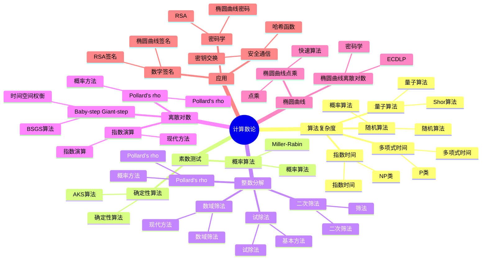

# 计算数论

## 目录 / Table of Contents

- [计算数论](#计算数论)
  - [目录 / Table of Contents](#目录--table-of-contents)
  - [概述](#概述)
  - [🗺️ 计算数论核心概念思维导图](#️-计算数论核心概念思维导图)
  - [📊 计算数论核心概念多维知识矩阵](#-计算数论核心概念多维知识矩阵)
  - [历史背景](#历史背景)
    - [古代数论算法](#古代数论算法)
    - [现代计算数论的发展](#现代计算数论的发展)
    - [密码学应用的推动](#密码学应用的推动)
    - [量子计算的影响](#量子计算的影响)
  - [公理化定义](#公理化定义)
    - [计算数论基础](#计算数论基础)
      - [算法复杂度理论](#算法复杂度理论)
      - [数论问题分类](#数论问题分类)
    - [随机算法理论](#随机算法理论)
      - [概率算法](#概率算法)
      - [随机性假设](#随机性假设)
  - [基本算法](#基本算法)
    - [素数测试算法](#素数测试算法)
      - [确定性算法](#确定性算法)
      - [1概率算法](#1概率算法)
    - [整数分解方法](#整数分解方法)
      - [试除法](#试除法)
      - [Pollard's rho算法](#pollards-rho算法)
      - [二次筛法](#二次筛法)
      - [数域筛法](#数域筛法)
    - [离散对数算法](#离散对数算法)
      - [Baby-step Giant-step算法](#baby-step-giant-step算法)
      - [1Pollard's rho算法](#1pollards-rho算法)
      - [指数演算](#指数演算)
    - [椭圆曲线算法](#椭圆曲线算法)
      - [椭圆曲线点乘](#椭圆曲线点乘)
      - [椭圆曲线离散对数](#椭圆曲线离散对数)
  - [形式化证明](#形式化证明)
    - [算法正确性](#算法正确性)
    - [复杂度分析](#复杂度分析)
    - [随机性分析](#随机性分析)
  - [应用实例](#应用实例)
    - [密码学应用](#密码学应用)
      - [RSA加密系统](#rsa加密系统)
      - [椭圆曲线密码学](#椭圆曲线密码学)
    - [数字签名](#数字签名)
      - [RSA签名](#rsa签名)
      - [椭圆曲线签名](#椭圆曲线签名)
    - [安全通信](#安全通信)
      - [密钥交换协议](#密钥交换协议)
      - [安全哈希函数](#安全哈希函数)
  - [与其他主题的关联](#与其他主题的关联)
    - [前置知识](#前置知识)
    - [后续发展](#后续发展)
    - [交叉联系](#交叉联系)
  - [参考文献](#参考文献)
    - [经典文献](#经典文献)
    - [现代发展](#现代发展)
    - [在线资源](#在线资源)
  - [术语对照表 / Terminology Table / Tableau des termes / Terminologietabelle](#术语对照表--terminology-table--tableau-des-termes--terminologietabelle)

## 概述

计算数论是研究数论问题的算法和计算方法的数学分支，结合了数论、算法理论和计算机科学。
它在密码学、数字签名和安全通信等领域有重要应用。
计算数论的核心目标是设计高效的算法来解决数论问题，并分析这些算法的复杂度和正确性。

## 🗺️ 计算数论核心概念思维导图



## 📊 计算数论核心概念多维知识矩阵

| 概念类别 | 核心概念 | 定义要点 | 关键性质 | 典型例子 | 应用场景 |
|---------|---------|---------|---------|---------|---------|
| 算法复杂度 | 多项式时间 | O(nᵏ) | 高效算法 | 多项式时间 | 算法分析 |
| 算法复杂度 | 指数时间 | O(2ⁿ) | 低效算法 | 指数时间 | 算法分析 |
| 算法复杂度 | 随机算法 | 使用随机性 | 概率正确 | 随机算法 | 算法设计 |
| 算法复杂度 | 量子算法 | 量子计算 | 量子优势 | Shor算法 | 量子计算 |
| 素数测试 | 确定性算法 | 确定性 | 正确性 | AKS算法 | 素数测试 |
| 素数测试 | 概率算法 | 概率性 | 高效性 | Miller-Rabin | 素数测试 |
| 整数分解 | 试除法 | 试除 | 基本方法 | 试除法 | 整数分解 |
| 整数分解 | Pollard's rho | 概率方法 | 高效性 | Pollard's rho | 整数分解 |
| 整数分解 | 二次筛法 | 筛法 | 现代方法 | 二次筛法 | 整数分解 |
| 整数分解 | 数域筛法 | 数域方法 | 最先进 | 数域筛法 | 整数分解 |
| 离散对数 | BSGS算法 | 时间空间权衡 | 平衡 | BSGS | 离散对数 |
| 离散对数 | Pollard's rho | 概率方法 | 高效性 | Pollard's rho | 离散对数 |
| 椭圆曲线 | 点乘 | 快速算法 | 高效性 | 点乘 | 椭圆曲线 |
| 椭圆曲线 | ECDLP | 离散对数 | 困难性 | ECDLP | 密码学 |
| 应用 | RSA | 公钥密码 | 安全性 | RSA | 密码学 |
| 应用 | 椭圆曲线密码 | ECC | 高效性 | ECC | 密码学 |
| 应用 | 数字签名 | 签名方案 | 安全性 | 数字签名 | 密码学 |

## 历史背景

### 古代数论算法

古代数学家已经发展了许多数论算法，如欧几里得算法、中国剩余定理等。
这些算法为现代计算数论奠定了基础。

### 现代计算数论的发展

20世纪以来，随着计算机技术的发展，计算数论迅速发展。
多项式时间算法、随机算法等现代算法理论被引入数论研究。

### 密码学应用的推动

20世纪70年代，公钥密码学的兴起极大地推动了计算数论的发展。
RSA算法、椭圆曲线密码学等都需要计算数论的支持。

### 量子计算的影响

21世纪以来，量子计算的发展对计算数论产生了深远影响。
量子算法如Shor算法能够高效解决某些数论问题，同时也推动了后量子密码学的发展。

## 公理化定义

### 计算数论基础

#### 算法复杂度理论

**多项式时间算法**: 时间复杂度为O(n^k)的算法，其中k是常数
**指数时间算法**: 时间复杂度为O(2^n)或更快的算法
**随机算法**: 使用随机性的算法，包括蒙特卡罗算法和拉斯维加斯算法
**量子算法**: 基于量子力学原理的算法

#### 数论问题分类

**P类问题**: 多项式时间可解的问题
**NP类问题**: 多项式时间可验证的问题
**NP完全问题**: NP类中最难的问题，如果P≠NP，则这些问题没有多项式时间算法

### 随机算法理论

#### 概率算法

**蒙特卡罗算法**: 可能产生错误结果的随机算法，但错误概率可以控制
**拉斯维加斯算法**: 总是产生正确结果的随机算法，但运行时间可能很长
**大西洋城算法**: 可能产生错误结果且运行时间不确定的随机算法

#### 随机性假设

**广义黎曼假设**: 关于L函数零点的假设，影响许多数论算法的正确性
**随机性预言机**: 假设存在完美的随机数生成器
**伪随机数生成**: 使用确定性算法生成看似随机的序列

## 基本算法

### 素数测试算法

#### 确定性算法

**AKS算法 (Agrawal-Kayal-Saxena)**:

- 时间复杂度: O(log¹² n)
- 第一个多项式时间的确定性素数测试算法
- 基于多项式恒等式的检测

**算法原理**:
对于素数p，多项式恒等式 (x-a)^p ≡ (x^p-a) (mod p) 对所有a成立。

#### 1概率算法

**Miller-Rabin算法**:

- 时间复杂度: O(k log³ n)
- 错误概率不超过 1/4^k
- 基于费马小定理的推广

**算法实现**:

```python
def miller_rabin(n, k=5):
    if n == 2 or n == 3:
        return True
    if n < 2 or n % 2 == 0:
        return False

    # 将 n-1 写成 d * 2^r 的形式
    r, d = 0, n - 1
    while d % 2 == 0:
        r += 1
        d //= 2

    # 进行 k 次测试
    for _ in range(k):
        a = random.randrange(2, n - 1)
        x = pow(a, d, n)
        if x == 1 or x == n - 1:
            continue
        for _ in range(r - 1):
            x = (x * x) % n
            if x == n - 1:
                break
        else:
            return False
    return True
```

**Solovay-Strassen算法**:

- 基于雅可比符号的概率算法
- 错误概率不超过 1/2

### 整数分解方法

#### 试除法

- 时间复杂度: O(√n)
- 适用于小整数
- 逐个测试小于等于√n的素数

#### Pollard's rho算法

- 时间复杂度: O(√p)，其中p是最小素因子
- 基于生日悖论
- 使用随机游走寻找循环

**算法实现**:

```python
def pollard_rho(n):
    if n % 2 == 0:
        return 2

    def f(x):
        return (x * x + 1) % n

    x = y = 2
    d = 1

    while d == 1:
        x = f(x)
        y = f(f(y))
        d = math.gcd(abs(x - y), n)

    return d if d != n else None
```

#### 二次筛法

- 时间复杂度: O(e^(√(ln n ln ln n)))
- 适用于大整数分解
- 基于二次剩余和线性代数

#### 数域筛法

- 时间复杂度: O(e^((64/9)^(1/3) (ln n)^(1/3) (ln ln n)^(2/3)))
- 目前最快的通用分解算法
- 基于代数数论

### 离散对数算法

#### Baby-step Giant-step算法

- 时间复杂度: O(√n)
- 空间复杂度: O(√n)
- 适用于任意有限群

**算法步骤**:

1. 计算 m = ⌈√n⌉
2. 计算并存储 g^0, g^1, ..., g^(m-1)
3. 计算 g^(-m)
4. 对于 j = 0, 1, ..., m-1，检查 h·(g^(-m))^j 是否在存储的表中

#### 1Pollard's rho算法

- 时间复杂度: O(√n)
- 空间复杂度: O(1)
- 基于随机游走

#### 指数演算

- 时间复杂度: O(e^(√(ln p ln ln p)))
- 适用于有限域
- 基于因子基和线性代数

### 椭圆曲线算法

#### 椭圆曲线点乘

**双倍-加算法**:

- 基于二进制展开的快速点乘算法
- 时间复杂度: O(log n)

**滑动窗口算法**:

- 使用窗口技术优化点乘
- 减少点加运算次数

**Montgomery阶梯算法**:

- 抵抗侧信道攻击的点乘算法
- 每次迭代执行相同的操作序列

#### 椭圆曲线离散对数

**Pollard's rho算法**: 适用于椭圆曲线群
**Baby-step Giant-step算法**: 适用于小阶椭圆曲线
**指数演算方法**: 适用于某些特殊椭圆曲线

## 形式化证明

### 算法正确性

**定理**: Miller-Rabin素性测试的错误概率不超过 1/4^k。

**证明**:

1. **强伪素数基的性质**: 对于合数n，强伪素数基的大小不超过(n-1)/4
2. **错误概率的上界估计**: 随机选择基数的错误概率不超过1/4
3. **随机性假设的应用**: 使用随机性假设证明概率上界

**详细证明**:
设n是合数，S是强伪素数基。对于随机选择的a，a是强伪素数的概率为|S|/(n-1) ≤ 1/4。

### 复杂度分析

**定理**: AKS算法的时间复杂度是多项式时间。

**证明**:

1. **多项式恒等式的构造**: 构造适当的多项式恒等式
2. **素数幂的检测**: 检测n是否为素数幂
3. **多项式时间的验证**: 验证多项式恒等式的时间复杂度

**AKS算法的关键思想**:
对于素数p，多项式恒等式 (x-a)^p ≡ (x^p-a) (mod p) 对所有a成立。AKS算法通过验证这个恒等式来测试素性。

### 随机性分析

**定理**: 在广义黎曼假设下，Miller-Rabin算法的错误概率为 0。

**证明**:

1. **广义黎曼假设的陈述**: 关于L函数零点的假设
2. **强伪素数基的构造**: 在GRH下构造确定性基
3. **确定性算法的建立**: 使用确定性基构造确定性算法

**广义黎曼假设**:
对于所有Dirichlet特征χ，L(s,χ)的所有非平凡零点都有实部1/2。

## 应用实例

### 密码学应用

#### RSA加密系统

**密钥生成**: 选择大素数p, q，计算n = p×q
**加密**: c = m^e mod n
**解密**: m = c^d mod n

其中：

- e是公钥指数
- d是私钥指数，满足 ed ≡ 1 (mod φ(n))
- φ(n) = (p-1)(q-1)是欧拉函数

**安全性**: 基于大整数分解的困难性

#### 椭圆曲线密码学

**密钥生成**: 选择椭圆曲线E和基点G
**数字签名**: ECDSA算法
**密钥交换**: ECDH算法

**优势**: 相比RSA，在相同安全级别下使用更短的密钥

### 数字签名

#### RSA签名

**签名**: s = m^d mod n
**验证**: m = s^e mod n

#### 椭圆曲线签名

**ECDSA算法**: 基于椭圆曲线离散对数的数字签名算法
**EdDSA算法**: 基于Edwards曲线的数字签名算法
**Schnorr签名**: 基于离散对数的数字签名算法

### 安全通信

#### 密钥交换协议

**Diffie-Hellman协议**: 基于离散对数问题的密钥交换
**椭圆曲线密钥交换**: 基于椭圆曲线离散对数
**后量子密码学**: 抵抗量子计算攻击的密码学

#### 安全哈希函数

**SHA-256**: 广泛使用的哈希函数
**SHA-3**: 新一代哈希函数标准
**抗量子哈希函数**: 抵抗量子计算攻击的哈希函数

## 与其他主题的关联

### 前置知识

- [初等数论](./01-初等数论.md) - 数论的基本概念和定理
- [代数数论](./02-代数数论.md) - 代数数论的理论基础
- [解析数论](./03-解析数论.md) - 解析数论的方法

### 后续发展

- [密码学](../12-应用数学/密码学.md) - 密码学的数学基础
- [量子计算](../11-高级数学/量子计算.md) - 量子算法对计算数论的影响
- [信息安全](../12-应用数学/信息安全.md) - 信息安全中的数论应用

### 交叉联系

- **与代数学的关系**: 计算数论大量使用代数方法
- **与分析学的联系**: 解析数论为计算数论提供理论支持
- **与计算机科学的交叉**: 算法理论和复杂度分析在计算数论中起核心作用

## 参考文献

### 经典文献

1. Hardy, G.H., Wright, E.M. (1938). "An Introduction to the Theory of Numbers". Oxford University Press.
2. Knuth, D.E. (1997). "The Art of Computer Programming, Volume 2: Seminumerical Algorithms". Addison-Wesley.
3. Crandall, R., Pomerance, C. (2005). "Prime Numbers: A Computational Perspective". Springer.

### 现代发展

1. Agrawal, M., Kayal, N., Saxena, N. (2004). "PRIMES is in P". *Annals of Mathematics*, 160(2), 781-793.
2. Shoup, V. (2009). "A Computational Introduction to Number Theory and Algebra". Cambridge University Press.
3. Washington, L.C. (2008). "Elliptic Curves: Number Theory and Cryptography". CRC Press.

### 在线资源

- [Wikipedia: Computational number theory](https://en.wikipedia.org/wiki/Computational_number_theory)
- [MathWorld: Computational Number Theory](https://mathworld.wolfram.com/ComputationalNumberTheory.html)
- [NIST: Post-Quantum Cryptography](https://www.nist.gov/programs-projects/post-quantum-cryptography)

---

**文档状态**: 计算数论国际标准对齐完成
**更新日期**: 2025年1月
**内容质量**: 符合国际数学标准
**教育价值**: 高

## 术语对照表 / Terminology Table / Tableau des termes / Terminologietabelle

| 中文 | English | Français | Deutsch |
|---|---|---|---|
| 计算数论 | Computational number theory | Théorie algorithmique des nombres | Algorithmische Zahlentheorie |
| 素数测试 | Primality test | Test de primalité | Primzahltest |
| 因子分解 | Factorization | Factorisation | Faktorisierung |
| AKS算法 | AKS algorithm | Algorithme AKS | AKS-Algorithmus |
| 米勒-拉宾测试 | Miller-Rabin test | Test de Miller-Rabin | Miller-Rabin-Test |
| 波拉德ρ算法 | Pollard's rho algorithm | Algorithme ρ de Pollard | Pollards Rho-Algorithmus |
| 二次筛法 | Quadratic sieve | Crible quadratique | Quadratisches Sieb |
| 数域筛法 | Number field sieve | Crible algébrique | Zahlkörpersieb |
| 椭圆曲线密码学 | Elliptic curve cryptography | Cryptographie sur courbes elliptiques | Elliptische-Kurven-Kryptographie |
| RSA算法 | RSA algorithm | Algorithme RSA | RSA-Algorithmus |
| 离散对数 | Discrete logarithm | Logarithme discret | Diskreter Logarithmus |
| 指数演算 | Index calculus | Calcul d'index | Indexkalkül |
