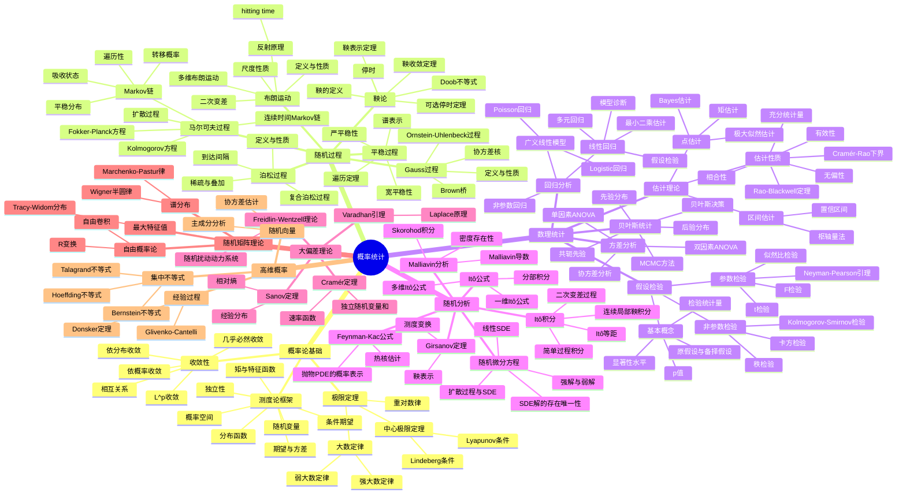
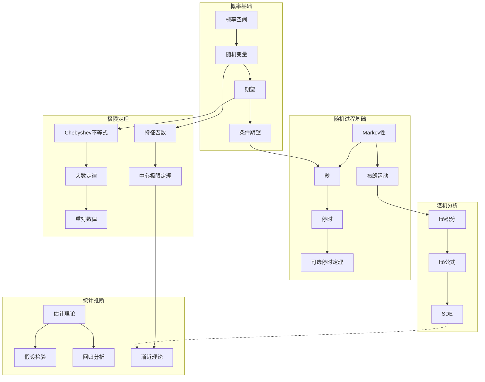
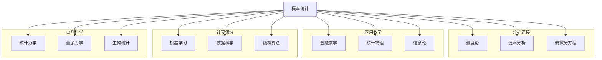
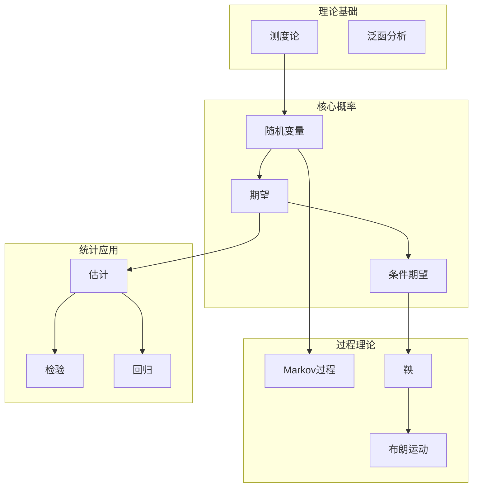

# 概率统计思维导图

> 概率论研究随机现象的数学规律，统计学研究数据的收集、分析与推断。从基础概率到随机分析，构成了理解不确定性的数学框架。

---

## 🧠 核心概念层级关系



---

## 🔗 定理依赖关系图



---

## 📍 重要示例分布

### 概率分布示例

| 分布 | 类型 | 重要性 | 应用 |
|-----|------|-------|------|
| 正态分布 | 连续 | ⭐⭐⭐⭐⭐ | CLT、统计 |
| Poisson分布 | 离散 | ⭐⭐⭐⭐⭐ | 稀有事件 |
| 指数分布 | 连续 | ⭐⭐⭐⭐ | 可靠性 |
| 二项分布 | 离散 | ⭐⭐⭐⭐ | 计数 |
| Gamma分布 | 连续 | ⭐⭐⭐⭐ | 等待时间 |
| Beta分布 | 连续 | ⭐⭐⭐⭐ | Bayes |

### 随机过程示例

| 过程 | 特征 | 重要性 | 应用 |
|-----|------|-------|------|
| 布朗运动 | 连续鞅 | ⭐⭐⭐⭐⭐ | 金融、物理 |
| Poisson过程 | 跳跃 | ⭐⭐⭐⭐⭐ | 排队、保险 |
| Markov链 | 无记忆性 | ⭐⭐⭐⭐⭐ | MCMC、AI |
| Ornstein-Uhlenbeck | 均值回复 | ⭐⭐⭐⭐ | 利率模型 |
| 几何布朗运动 | 乘法噪声 | ⭐⭐⭐⭐⭐ | 股票价格 |

### 统计方法示例

| 方法 | 用途 | 重要性 | 场景 |
|-----|------|-------|------|
| t检验 | 均值比较 | ⭐⭐⭐⭐⭐ | A/B测试 |
| 卡方检验 | 独立性 | ⭐⭐⭐⭐ | 分类变量 |
| 回归分析 | 预测建模 | ⭐⭐⭐⭐⭐ | 数据科学 |
| Bootstrap | 方差估计 | ⭐⭐⭐⭐ | 重采样 |
| MCMC | Bayes计算 | ⭐⭐⭐⭐⭐ | 复杂模型 |

---

## 🔄 与其他分支的连接点



**具体连接说明：**

| 分支 | 连接概念 | 连接深度 |
|-----|---------|---------|
| 测度论 | 概率的数学基础 | ⭐⭐⭐⭐⭐ |
| 泛函分析 | 随机过程分析 | ⭐⭐⭐⭐ |
| 偏微分方程 | Kolmogorov方程、Fokker-Planck | ⭐⭐⭐⭐⭐ |
| 金融数学 | 期权定价、风险管理 | ⭐⭐⭐⭐⭐ |
| 统计物理 | 统计力学基础 | ⭐⭐⭐⭐⭐ |
| 信息论 | 熵、互信息 | ⭐⭐⭐⭐⭐ |
| 机器学习 | 统计学习理论 | ⭐⭐⭐⭐⭐ |
| 组合数学 | 随机图、概率方法 | ⭐⭐⭐⭐ |

---

## 📊 学习难度梯度标记

```mermaid
graph LR
    subgraph 概率基础 ⭐⭐⭐
        A1[概率空间]
        A2[随机变量]
        A3[极限定理]
    end

    subgraph 随机过程 ⭐⭐⭐⭐
        B1[Markov链]
        B2[鞅论]
        B3[布朗运动]
    end

    subgraph 随机分析 ⭐⭐⭐⭐⭐
        C1[Itô积分]
        C2[SDE]
        C3[Malliavin分析]
    end

    subgraph 高等概率 ⭐⭐⭐⭐⭐⭐
        D1[大偏差]
        D2[随机矩阵]
        D3[自由概率]
    end
```

### 详细难度分级

| 主题 | 入门 | 基础 | 进阶 | 高级 | 专家 |
|-----|------|------|------|------|------|
| 概率论 | 古典概率 | 测度论框架 | 极限定理 | 随机过程 | 随机分析 |
| 统计 | 描述统计 | 推断统计 | 线性模型 | 非参数 | Bayes高阶 |
| 随机过程 | Markov链 | 鞅论 | 扩散过程 | 随机分析 | 无穷维 |
| 应用 | 基础应用 | 金融模型 | 统计学习 | 高维统计 | 前沿研究 |

---

## 🎯 学习路径推荐

### 经典概率路径

```
测度论 → 概率基础 → 极限定理 → 随机过程 → 随机分析
```

### 金融数学路径

```
概率基础 → 布朗运动 → 随机分析 → 期权定价 → 利率模型
```

### 数据科学路径

```
概率统计基础 → 回归分析 → 统计学习 → 高维统计 → 深度学习理论
```

### 统计物理路径

```
概率论 → 随机过程 → 大偏差 → 统计力学 → 随机界面
```

---

## 📚 核心定理清单

### 概率论核心定理

1. **大数定律**：样本均值收敛于期望
2. **中心极限定理**：标准化和收敛于正态分布
3. **重对数律**：收敛速度的精确描述
4. **0-1律**：尾事件的确定性

### 随机过程核心定理

1. **Doob鞅收敛定理**：上鞅的收敛性
2. **可选停时定理**：鞅在停时的性质
3. **Kolmogorov连续性准则**：随机过程的连续修正
4. **Lévy刻画**：布朗运动的鞅刻画

### 随机分析核心定理

1. **Itô公式**：随机微积分的链式法则
2. **Girsanov定理**：测度变换与鞅
3. **鞅表示定理**：Brown鞅的表示
4. **Feynman-Kac公式**：PDE的概率表示

### 统计核心定理

1. **Cramér-Rao下界**：无偏估计的方差下界
2. **Rao-Blackwell定理**：充分统计量的改进
3. **Neyman-Pearson引理**：最优检验
4. **Glivenko-Cantelli**：经验分布的一致性

---

## 🔍 概念关系图谱



---

> 💡 **学习建议**：概率统计是连接纯数学与应用的桥梁。建议学习者既要掌握测度论的严格基础，也要培养概率直觉。随机过程的学习需要结合具体例子，而统计学习则应重视实际数据分析。现代概率论与PDE、几何、物理的交叉日益深入，保持开放的学习态度很重要。
