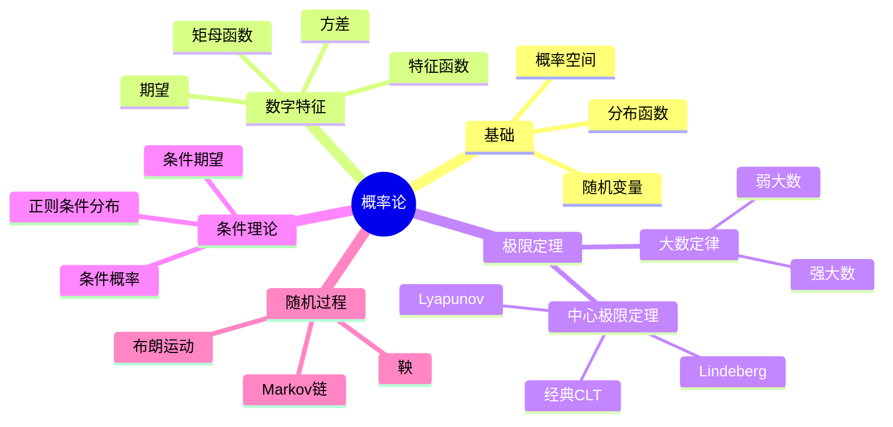

# 概率论习题精解

---

## 1. 概率空间基础

### 习题1：σ-代数的性质

**题目**：设 $\mathcal{F}$ 是 $\Omega$ 上的σ-代数，证明：

1. $\emptyset \in \mathcal{F}$
2. 对可列交封闭
3. 对差集封闭

**解答**：

**1. $\emptyset \in \mathcal{F}$**

由定义 $\Omega \in \mathcal{F}$，且对补集封闭，故 $\emptyset = \Omega^c \in \mathcal{F}$。

**2. 可列交封闭**

设 $\{A_n\} \subseteq \mathcal{F}$。由De Morgan：
$$\bigcap_{n=1}^\infty A_n = \left(\bigcup_{n=1}^\infty A_n^c\right)^c$$

$A_n^c \in \mathcal{F}$，可列并 $\in \mathcal{F}$，故补集 $\in \mathcal{F}$。

**3. 差集封闭**

$A, B \in \mathcal{F}$，则 $A \setminus B = A \cap B^c \in \mathcal{F}$。∎

---

### 习题2：概率的连续性

**题目**：证明概率测度的上连续性和下连续性。

**解答**：

**下连续性**：设 $A_n \uparrow A$（$A_1 \subseteq A_2 \subseteq \cdots$，$A = \bigcup A_n$）

令 $B_1 = A_1$，$B_n = A_n \setminus A_{n-1}$（$n \geq 2$）

则 $\{B_n\}$ 不交且 $\bigcup_{k=1}^n B_k = A_n$，$\bigcup_{n=1}^\infty B_n = A$

$$P(A) = P(\bigcup_n B_n) = \sum_n P(B_n) = \lim_{n \to \infty} \sum_{k=1}^n P(B_k) = \lim_{n} P(A_n)$$

**上连续性**：设 $A_n \downarrow A$（$A_1 \supseteq A_2 \supseteq \cdots$，$A = \bigcap A_n$）

令 $B_n = A_1 \setminus A_n$，则 $B_n \uparrow A_1 \setminus A$

由连续性：$P(A_1) - P(A) = \lim (P(A_1) - P(A_n)) = P(A_1) - \lim P(A_n)$

故 $P(A_n) \downarrow P(A)$。∎

---

## 2. 随机变量与分布

### 习题3：分布函数的性质

**题目**：设 $F$ 是分布函数，证明：

1. $F$ 单调不减
2. $F$ 右连续
3. $\lim_{x \to -\infty} F(x) = 0$，$\lim_{x \to +\infty} F(x) = 1$

**解答**：

设 $F(x) = P(X \leq x)$

**1. 单调性**：若 $x < y$，则 $\{X \leq x\} \subseteq \{X \leq y\}$，故 $F(x) \leq F(y)$。

**2. 右连续**：设 $x_n \downarrow x$，则 $\{X \leq x_n\} \downarrow \{X \leq x\}$

由概率上连续性，$F(x_n) \downarrow F(x)$。

**3. 极限**：

- $\{X \leq n\} \uparrow \Omega$，故 $F(n) \to 1$
- $\{X \leq -n\} \downarrow \emptyset$，故 $F(-n) \to 0$ ∎

---

### 习题4：特征函数

**题目**：设 $\varphi(t) = E[e^{itX}]$ 是 $X$ 的特征函数，证明：

1. $\varphi(0) = 1$
2. $|\varphi(t)| \leq 1$
3. $\varphi(-t) = \overline{\varphi(t)}$
4. $\varphi$ 一致连续

**解答**：

**1.** $\varphi(0) = E[e^{i \cdot 0 \cdot X}] = E[1] = 1$

**2.** $|\varphi(t)| = |E[e^{itX}]| \leq E[|e^{itX}|] = E[1] = 1$

**3.** $\varphi(-t) = E[e^{-itX}] = E[\overline{e^{itX}}] = \overline{E[e^{itX}]} = \overline{\varphi(t)}$

**4.** 一致连续：
$$|\varphi(t+h) - \varphi(t)| = |E[e^{i(t+h)X} - e^{itX}]| = |E[e^{itX}(e^{ihX} - 1)]|$$
$$\leq E[|e^{ihX} - 1|]$$

由控制收敛，当 $h \to 0$ 时上式趋于0，且界与 $t$ 无关。∎

---

## 3. 期望与方差

### 习题5：Jensen不等式

**题目**：设 $\varphi$ 是凸函数，$E|X| < \infty$，$E|\varphi(X)| < \infty$。证明 $\varphi(E[X]) \leq E[\varphi(X)]$。

**解答**：

由凸函数性质，对任意 $x_0$，存在 $a$ 使：
$$\varphi(x) \geq \varphi(x_0) + a(x - x_0)$$
对所有 $x$ 成立。

取 $x_0 = E[X]$，$x = X$：
$$\varphi(X) \geq \varphi(E[X]) + a(X - E[X])$$

两边取期望：
$$E[\varphi(X)] \geq \varphi(E[X]) + a(E[X] - E[X]) = \varphi(E[X])$$

∎

---

### 习题6：切比雪夫不等式

**题目**：设 $X$ 有方差，证明 $P(|X - E[X]| \geq \varepsilon) \leq \frac{\text{Var}(X)}{\varepsilon^2}$。

**解答**：

令 $\mu = E[X]$，$\sigma^2 = \text{Var}(X)$

$$P(|X - \mu| \geq \varepsilon) = P((X - \mu)^2 \geq \varepsilon^2) \leq \frac{E[(X - \mu)^2]}{\varepsilon^2} = \frac{\sigma^2}{\varepsilon^2}$$

（Markov不等式应用于 $(X-\mu)^2$）∎

---

## 4. 极限定理

### 习题7：Borel-Cantelli引理

**题目**：设 $\{A_n\}$ 是事件列

1. 若 $\sum P(A_n) < \infty$，则 $P(A_n \text{ i.o.}) = 0$
2. 若 $\sum P(A_n) = \infty$ 且 $A_n$ 独立，则 $P(A_n \text{ i.o.}) = 1$

**解答**：

**第一部分**：
$$P(A_n \text{ i.o.}) = P(\bigcap_{n=1}^\infty \bigcup_{k=n}^\infty A_k) = \lim_{n \to \infty} P(\bigcup_{k=n}^\infty A_k)$$
$$\leq \lim_{n \to \infty} \sum_{k=n}^\infty P(A_k) = 0$$

**第二部分**：
$$P(A_n \text{ i.o.}) = 1 - P(\bigcup_{n=1}^\infty \bigcap_{k=n}^\infty A_k^c)$$

计算：
$$P(\bigcap_{k=n}^N A_k^c) = \prod_{k=n}^N (1 - P(A_k)) \leq \exp\left(-\sum_{k=n}^N P(A_k)\right) \to 0$$

当 $N \to \infty$。故 $P(\bigcap_{k=n}^\infty A_k^c) = 0$，从而：
$$P(\bigcup_{n=1}^\infty \bigcap_{k=n}^\infty A_k^c) = 0$$

因此 $P(A_n \text{ i.o.}) = 1$。∎

---

### 习题8：Lévy连续性定理应用

**题目**：设 $X_n \sim \text{Bin}(n, p_n)$，$np_n \to \lambda > 0$。证明 $X_n \xrightarrow{d} \text{Poisson}(\lambda)$。

**解答**：

**特征函数法**：

$X_n$ 的特征函数：
$$\varphi_{X_n}(t) = (1 - p_n + p_n e^{it})^n = \left(1 + p_n(e^{it} - 1)\right)^n$$

$$= \left(1 + \frac{np_n(e^{it}-1)}{n}\right)^n \to e^{\lambda(e^{it}-1)}$$

这正是 $\text{Poisson}(\lambda)$ 的特征函数。

由Lévy连续性定理，$X_n \xrightarrow{d} \text{Poisson}(\lambda)$。∎

---

## 5. 条件概率与条件期望

### 习题9：全概率公式

**题目**：设 $\{B_n\}$ 是 $\Omega$ 的分割（不交且并为 $\Omega$），$P(B_n) > 0$。证明：
$$P(A) = \sum_{n=1}^\infty P(A|B_n) P(B_n)$$

**解答**：

$$P(A) = P(A \cap \Omega) = P(A \cap \bigcup_n B_n) = P(\bigcup_n (A \cap B_n))$$
$$= \sum_n P(A \cap B_n) = \sum_n P(A|B_n) P(B_n)$$

∎

---

### 习题10：条件期望的塔性质

**题目**：设 $\mathcal{G}_1 \subseteq \mathcal{G}_2 \subseteq \mathcal{F}$，证明 $E[E[X|\mathcal{G}_2]|\mathcal{G}_1] = E[X|\mathcal{G}_1]$。

**解答**：

记 $Y = E[X|\mathcal{G}_2]$，需证 $E[Y|\mathcal{G}_1] = E[X|\mathcal{G}_1]$。

对任意 $A \in \mathcal{G}_1$（因 $\mathcal{G}_1 \subseteq \mathcal{G}_2$，故 $A \in \mathcal{G}_2$）：
$$\int_A E[Y|\mathcal{G}_1] dP = \int_A Y dP = \int_A E[X|\mathcal{G}_2] dP = \int_A X dP$$

故 $E[Y|\mathcal{G}_1] = E[X|\mathcal{G}_1]$ a.s. ∎

---

## 6. 思维导图：概率论知识体系

---

## 参考文献

1. Durrett, R. *Probability: Theory and Examples*.
2. Billingsley, P. *Probability and Measure*.
3. 钟开莱. *概率论教程*.
4. 李贤平. *概率论基础*.

---

*本文档为概率论核心习题精解*
*质量等级：A（系统性+严谨性）*
