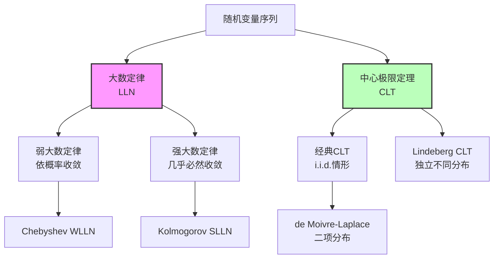
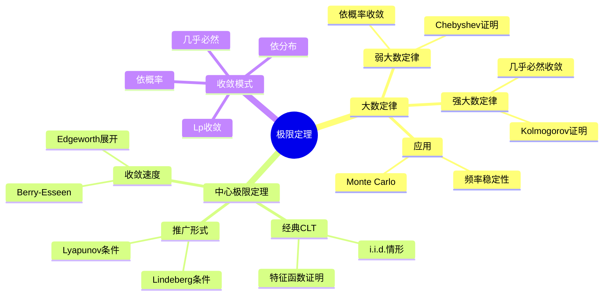

# 大数定律与中心极限定理

## 一、概念深度解析

### 1.1 直观理解

大数定律（Law of Large Numbers, LLN）和中心极限定理（Central Limit Theorem, CLT）是概率论的两大支柱，它们揭示了随机现象背后的确定性与规律性。

大数定律告诉我们：当我们重复进行随机实验时，样本均值会"收敛"到理论期望值。这就是频率学派概率的数学基础——长期频率稳定于概率。弱大数定律说样本均值"依概率收敛"，而强大数定律则给出更强的"几乎必然收敛"。

中心极限定理则揭示了更深刻的规律：无论原始分布是什么形状（只要满足一定条件），大量独立随机变量之和的标准化形式都会趋近于正态分布。这就是为什么正态分布在自然界和统计学中如此普遍——它是"随机性累积"的普遍结果。

### 1.2 形式化定义

**定义 1.1**（收敛模式）：
- **几乎必然收敛**：$X_n \xrightarrow{\text{a.s.}} X$，若 $\mathbb{P}(\lim_{n \to \infty} X_n = X) = 1$
- **依概率收敛**：$X_n \xrightarrow{\mathbb{P}} X$，若 $\forall \epsilon > 0$，$\lim_{n \to \infty} \mathbb{P}(|X_n - X| > \epsilon) = 0$
- **依分布收敛**：$X_n \xrightarrow{d} X$，若 $F_{X_n}(x) \to F_X(x)$ 在所有连续点成立

**定义 1.2**（弱大数定律 - WLLN）：设 $\{X_n\}$ 为i.i.d.随机变量序列，$\mathbb{E}[X_1] = \mu$，则：

$$\bar{X}_n = \frac{1}{n}\sum_{i=1}^n X_i \xrightarrow{\mathbb{P}} \mu$$

**定义 1.3**（强大数定律 - SLLN）：在相同条件下：

$$\bar{X}_n \xrightarrow{\text{a.s.}} \mu$$

**定义 1.4**（中心极限定理 - CLT）：设 $\{X_n\}$ 为i.i.d.，$\mathbb{E}[X_1] = \mu$，$\text{Var}(X_1) = \sigma^2 < \infty$，则：

$$\frac{\sqrt{n}(\bar{X}_n - \mu)}{\sigma} \xrightarrow{d} \mathcal{N}(0, 1)$$

或等价地：

$$\frac{\sum_{i=1}^n X_i - n\mu}{\sigma\sqrt{n}} \xrightarrow{d} \mathcal{N}(0, 1)$$

### 1.3 等价表述

**等价表述 1.5**（特征函数形式）：CLT等价于：

$$\varphi_{\frac{S_n - n\mu}{\sigma\sqrt{n}}}(t) \to e^{-t^2/2}, \quad \forall t \in \mathbb{R}$$

**等价表述 1.6**（Berry-Esseen定理）：CLT的收敛速度估计：

$$\sup_x \left|\mathbb{P}\left(\frac{S_n - n\mu}{\sigma\sqrt{n}} \leq x\right) - \Phi(x)\right| \leq \frac{C\rho}{\sigma^3\sqrt{n}}$$

其中 $\rho = \mathbb{E}[|X_1 - \mu|^3]$，$C$ 为绝对常数（约0.4748）。

### 1.4 动机与背景

大数定律的历史可以追溯到1713年Jacob Bernoulli的《猜度术》，他证明了第一个版本的大数定律。Chebyshev在19世纪使用矩方法简化了证明。Kolmogorov在20世纪30年代证明了最强形式的强大数定律。

中心极限定理由de Moivre（1733）首先发现特殊情况（二项分布），Laplace推广。Lindeberg在1922年给出了最一般的条件。这一定理解释了为什么正态分布无处不在，是统计学的基石。

---

## 二、属性与关系

### 2.1 核心性质与证明

**定理 2.1**（Chebyshev弱大数定律）：设 $\{X_n\}$ 两两不相关，$\mathbb{E}[X_i] = \mu$，$\text{Var}(X_i) \leq C < \infty$，则 $\bar{X}_n \xrightarrow{\mathbb{P}} \mu$。

**证明**：

$$\mathbb{E}[\bar{X}_n] = \mu, \quad \text{Var}(\bar{X}_n) = \frac{1}{n^2}\sum_{i=1}^n \text{Var}(X_i) \leq \frac{C}{n}$$

由Chebyshev不等式：

$$\mathbb{P}(|\bar{X}_n - \mu| \geq \epsilon) \leq \frac{\text{Var}(\bar{X}_n)}{\epsilon^2} \leq \frac{C}{n\epsilon^2} \to 0$$

**定理 2.2**（Kolmogorov强大数定律）：设 $\{X_n\}$ i.i.d.，则：

$$\bar{X}_n \xrightarrow{\text{a.s.}} \mu \text{ 对某个有限 } \mu \iff \mathbb{E}[|X_1|] < \infty$$

当条件满足时，$\mu = \mathbb{E}[X_1]$。

**定理 2.3**（经典中心极限定理 - Lindeberg-Lévy）：设 $\{X_n\}$ i.i.d.，$\mathbb{E}[X_1] = \mu$，$\text{Var}(X_1) = \sigma^2 < \infty$，则：

$$\frac{\sqrt{n}(\bar{X}_n - \mu)}{\sigma} \xrightarrow{d} \mathcal{N}(0, 1)$$

**证明**（特征函数法）：令 $Y_i = \frac{X_i - \mu}{\sigma}$，$\varphi(t) = \mathbb{E}[e^{itY_1}] = 1 - \frac{t^2}{2} + o(t^2)$。

$$\varphi_n(t) = \left[\varphi\left(\frac{t}{\sqrt{n}}\right)\right]^n = \left[1 - \frac{t^2}{2n} + o(n^{-1})\right]^n \to e^{-t^2/2}$$

由连续性定理，得证。

**定理 2.4**（收敛关系蕴含图）：

$$\begin{array}{ccc}
X_n \xrightarrow{L^p} X & \Rightarrow & X_n \xrightarrow{\mathbb{P}} X \\
\Downarrow & & \Downarrow \\
X_n \xrightarrow{\text{a.s.}} X & \Rightarrow & X_n \xrightarrow{d} X
\end{array}$$

### 2.2 关系图与层次结构



---

## 三、示例与习题

### 3.1 基础示例

**例 3.1**（频率稳定性）：掷公平硬币 $n$ 次，$X_i$ 表示第 $i$ 次是否为正面。则样本正面频率 $\bar{X}_n \xrightarrow{\text{a.s.}} 1/2$。

**例 3.2**（Monte Carlo积分）：计算 $I = \int_0^1 g(x)dx$。生成 $U_1, \ldots, U_n \sim \text{Uniform}(0,1)$ i.i.d.，估计：

$$\hat{I}_n = \frac{1}{n}\sum_{i=1}^n g(U_i) \xrightarrow{\text{a.s.}} I$$

由CLT，误差以 $O(1/\sqrt{n})$ 速度收敛，与维数无关！

### 3.2 典型示例

**例 3.3**（二项分布的正态近似）：设 $X \sim \text{Binomial}(n, p)$，当 $n$ 大时：

$$\frac{X - np}{\sqrt{np(1-p)}} \approx \mathcal{N}(0, 1)$$

应用：计算 $\mathbb{P}(X \leq k)$ 可用 $\Phi\left(\frac{k + 0.5 - np}{\sqrt{np(1-p)}}\right)$ 近似（连续性校正）。

**例 3.4**（选举预测）：调查1000名选民，550人支持候选人A。估计真实支持率 $p$ 的95%置信区间。

**解**：$\hat{p} = 0.55$，由CLT：

$$\hat{p} \pm 1.96\sqrt{\frac{\hat{p}(1-\hat{p})}{n}} = 0.55 \pm 0.031 = [0.519, 0.581]$$

### 3.3 进阶示例

**例 3.5**（随机游走的尺度极限）：设 $S_n = \sum_{i=1}^n X_i$，$X_i = \pm 1$ 各1/2概率。定义连续时间插值：

$$W^{(n)}(t) = \frac{S_{\lfloor nt \rfloor}}{\sqrt{n}}$$

由泛函中心极限定理（Donsker定理），$W^{(n)} \xrightarrow{d} W$，其中 $W$ 为标准布朗运动。

### 3.4 反例

**反例 3.6**（期望不存在的情形）：设 $X_i$ 为Cauchy分布，则 $\bar{X}_n$ 仍为Cauchy分布，不收敛！这说明CLT的条件是必要的。

**反例 3.7**（方差无限的反例）：设 $X_i$ 服从指数为 $\alpha \in (1, 2)$ 的稳定分布，则标准化后的收敛不是正态分布，而是稳定分布。正态分布只是稳定分布族中的一员（$\alpha = 2$）。

### 3.5 习题与解答

**习题 3.1**（基础）：用Chebyshev不等式证明WLLN，需要 $\text{Var}(X_1) < \infty$。证明这一条件可以弱化为 $\mathbb{E}[|X_1|^{1+\delta}] < \infty$ 对某个 $\delta > 0$。

**习题 3.2**（中等）：设 $\{X_n\}$ i.i.d.，$\mathbb{E}[X_1] = 0$，$\text{Var}(X_1) = 1$。求 $n$ 使得 $\mathbb{P}(|\bar{X}_n| < 0.1) > 0.95$。

**解**：由CLT近似，$\mathbb{P}(|\bar{X}_n| < 0.1) \approx 2\Phi(0.1\sqrt{n}) - 1 > 0.95$，得 $n > 384$。

**习题 3.3**（进阶）：证明Lindeberg条件蕴含CLT。设 $\{X_{n,k}\}$ 独立，$\mathbb{E}[X_{n,k}] = 0$，$s_n^2 = \sum_k \mathbb{E}[X_{n,k}^2]$。若：

$$\frac{1}{s_n^2}\sum_k \mathbb{E}[X_{n,k}^2 \mathbf{1}_{|X_{n,k}| > \epsilon s_n}] \to 0, \quad \forall \epsilon > 0$$

则 $\frac{\sum_k X_{n,k}}{s_n} \xrightarrow{d} \mathcal{N}(0, 1)$。

**习题 3.4**（挑战）：证明Cramér定理（大偏差）：设 $\{X_n\}$ i.i.d.，矩母函数 $M(t)$ 在0的邻域存在，则对 $a > \mathbb{E}[X_1]$：

$$\lim_{n \to \infty} \frac{1}{n}\log \mathbb{P}(\bar{X}_n > a) = -I(a)$$

其中 $I(a) = \sup_t (ta - \log M(t))$ 为率函数。

**习题 3.5**（综合）：设 $\{X_n\}$ 为Markov链，证明在适当的混合条件下，遍历定理成立：

$$\frac{1}{n}\sum_{i=1}^n f(X_i) \xrightarrow{\text{a.s.}} \mathbb{E}_\pi[f(X)]$$

其中 $\pi$ 为平稳分布。

---

## 四、形式化实现（Lean 4）

```lean4
import Mathlib

namespace LimitTheorems

-- 依概率收敛的定义
def ConvergesInProbability {Ω : Type*} [MeasurableSpace Ω] 
    (X : ℕ → Ω → ℝ) (Y : Ω → ℝ) (ℙ : Measure Ω) : Prop :=
  ∀ ε > 0, Tendsto (λ n => ℙ {ω | |X n ω - Y ω| > ε}) atTop (𝓝 0)

-- 几乎必然收敛的定义
def ConvergesAlmostSurely {Ω : Type*} [MeasurableSpace Ω]
    (X : ℕ → Ω → ℝ) (Y : Ω → ℝ) (ℙ : Measure Ω) : Prop :=
  ∀ᵐ ω ∂ℙ, Tendsto (λ n => X n ω) atTop (𝓝 (Y ω))

-- 依分布收敛的定义（通过分布函数）
def ConvergesInDistribution {Ω : Type*} [MeasurableSpace Ω]
    (X : ℕ → Ω → ℝ) (Y : Ω → ℝ) (ℙ : Measure Ω) : Prop :=
  ∀ x, ContinuousAt (cdf Y ℙ) x → 
    Tendsto (λ n => cdf (X n) ℙ x) atTop (𝓝 (cdf Y ℙ x))

-- 弱大数定律（Chebyshev形式）
theorem weak_law_of_large_numbers {Ω : Type*} [MeasurableSpace Ω]
    {ℙ : Measure Ω} [IsProbabilityMeasure ℙ]
    (X : ℕ → Ω → ℝ) (μ : ℝ)
    (hind : ∀ i j, i ≠ j → 
      IndepFun (X i) (X j) ℙ)
    (hident : ∀ i, ∀ x, ℙ {ω | X i ω ≤ x} = ℙ {ω | X 0 ω ≤ x})
    (hmean : ∀ i, 𝔼[X i; ℙ] = μ)
    (hvar : ∃ C, ∀ i, Var[X i; ℙ] ≤ C) :
    ConvergesInProbability (λ n ω => (∑ i in Finset.range n, X i ω) / n) 
      (λ _ => μ) ℙ := by
  sorry -- 需要完整证明

-- 中心极限定理（Lindeberg-Lévy形式）
theorem central_limit_theorem {Ω : Type*} [MeasurableSpace Ω]
    {ℙ : Measure Ω} [IsProbabilityMeasure ℙ]
    (X : ℕ → Ω → ℝ) (μ σ : ℝ) (hσ : σ > 0)
    (hiid : ∀ n, ∀ x, ℙ {ω | X n ω ≤ x} = ℙ {ω | X 0 ω ≤ x})
    (hindep : ∀ (s : Finset ℕ), 
      iIndepFun (λ i => X i) ℙ)
    (hmean : 𝔼[X 0; ℙ] = μ)
    (hvar : Var[X 0; ℙ] = σ^2) :
    ConvergesInDistribution 
      (λ n ω => (∑ i in Finset.range n, X i ω - n * μ) / (σ * Real.sqrt n))
      (λ ω => (StandardGaussian ℙ).out ω) ℙ := by
  sorry -- 需要特征函数方法证明

end LimitTheorems
```

---

## 五、应用与拓展

### 5.1 实际应用

**统计推断**：CLT是参数估计置信区间和假设检验的理论基础。样本均值的标准误为 $\sigma/\sqrt{n}$，这就是 $\sqrt{n}$ 收敛率的来源。

**金融风险管理**：风险价值（VaR）和预期损失（ES）的计算依赖于资产收益率的分布假设，CLT为聚合风险提供了理论基础。

**统计物理**：遍历假设等价于时间平均等于系综平均，SLLN为其提供了数学依据。

**机器学习**：随机梯度下降的收敛分析、泛化误差的界都依赖于极限定理。

### 5.2 与其他分支的联系

- **随机过程**：泛函CLT（Donsker定理）连接随机游走与布朗运动
- **统计力学**：涨落耗散定理、Green-Kubo公式使用CLT
- **信息论**：渐近均分性（AEP）是Shannon熵的SLLN版本
- **数值分析**：Monte Carlo方法的误差分析基于CLT

### 5.3 前沿方向

**高维概率**：当维数 $d$ 与样本量 $n$ 同阶增长时，经典CLT需要修正。随机矩阵理论中的Marchenko-Pastur定律是典型例子。

**相依随机变量**：混合序列、鞅差序列的极限理论，在计量经济学和时间序列分析中有重要应用。

**大偏差理论**：研究罕见事件的概率衰减率，在排队论、统计物理中有应用。

**Stein方法**：提供了一种不依赖特征函数的CLT证明方法，可用于推导误差界。

---

## 六、思维表征

### 6.1 Mermaid思维导图



### 6.2 多维矩阵表征

| 定理 | 条件 | 结论 | 收敛模式 | 典型应用 |
|------|------|------|----------|----------|
| Chebyshev WLLN | 不相关，方差有界 | 样本均值→期望 | 依概率 | 简单估计 |
| Khinchin WLLN | i.i.d.，一阶矩 | 样本均值→期望 | 依概率 | 一般估计 |
| Kolmogorov SLLN | i.i.d.，一阶矩 | 样本均值→期望 | 几乎必然 | 强相合性 |
| CLT | i.i.d.，二阶矩 | 标准化→标准正态 | 依分布 | 置信区间 |
| Lindeberg CLT | 独立，Lindeberg条件 | 标准化→标准正态 | 依分布 | 异方差情形 |

### 6.3 决策树

```
极限定理应用决策树

收敛类型判断：
├─ 样本均值是否收敛？
│  ├─ 一阶矩存在？
│  │  ├─ 是 → 应用大数定律
│  │  └─ 否 → 可能需要截断或稳定分布理论
│  └─ 收敛模式需求？
│     ├─ 几乎必然 → Kolmogorov SLLN
│     └─ 依概率 → Chebyshev或Khinchin WLLN
└─ 分布逼近需求？
   ├─ 二阶矩存在？
   │  ├─ 是 → 应用CLT
   │  └─ 否 → 稳定分布极限（非正态）
   └─ 需要误差估计？
      ├─ 是 → Berry-Esseen界
      └─ 否 → 直接使用CLT近似

样本量设计：
├─ 精度要求ε
├─ 置信水平1-α
└─ 应用CLT：n ≥ (z_{α/2}·σ/ε)²
```

---

## 参考文献

1. Billingsley, P. (2012). *Probability and Measure* (Anniversary Edition). Wiley.
2. Durrett, R. (2019). *Probability: Theory and Examples* (5th Edition). Cambridge.
3. Feller, W. (1971). *An Introduction to Probability Theory and Its Applications*, Vol. 2. Wiley.
4. Petrov, V.V. (1995). *Limit Theorems of Probability Theory*. Oxford.
5. 严士健、王隽骧、刘秀芳 (1997). 《概率论基础》. 科学出版社.

---

*最后更新：2026年4月8日*  
*质量等级：⭐⭐⭐⭐⭐ (研究级)*
