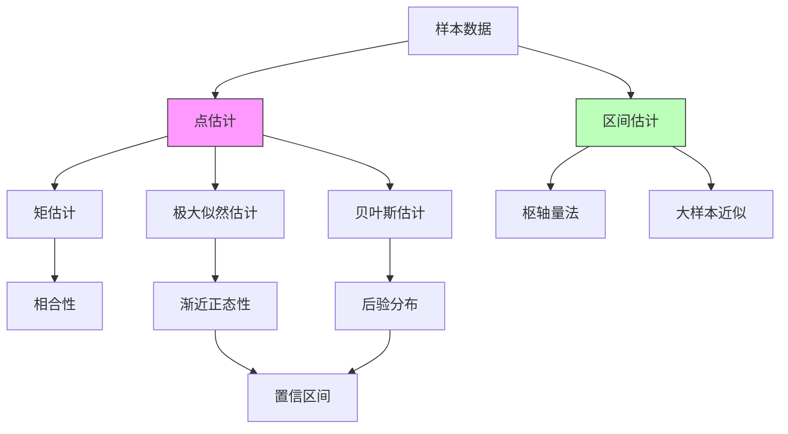
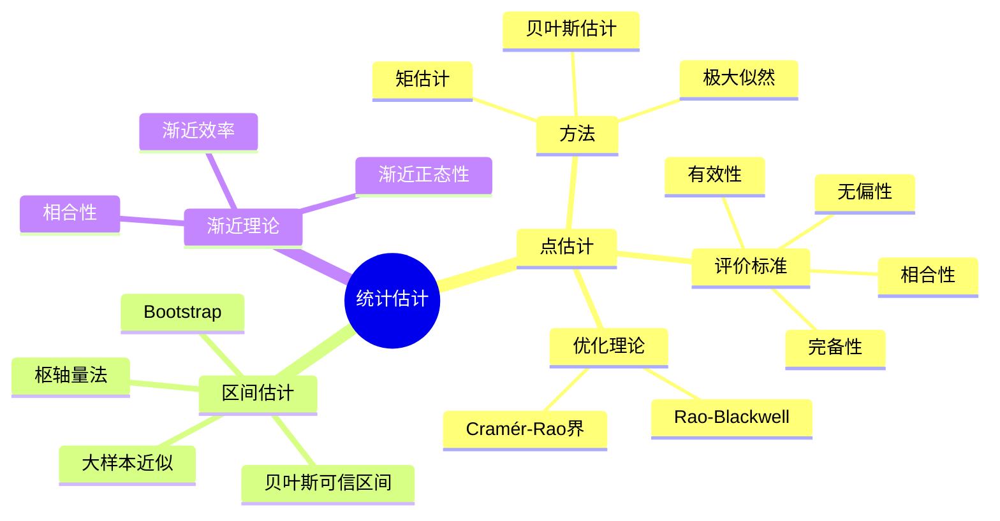

# 点估计与区间估计

## 一、概念深度解析

### 1.1 直观理解

统计推断是从样本数据推断总体特征的数学方法。点估计试图用一个数值（统计量）来猜测未知参数的真实值，就像是用一支箭射向目标——我们希望箭尽可能接近靶心。区间估计则提供一个范围（置信区间），以一定的置信度包含真实参数，这就像是用一张网捕鱼——我们希望网足够大以确保捕获，同时又不至于太大而失去精度。

评估估计量好坏的标准包括：无偏性（系统误差的消除）、有效性（方差最小）、相合性（大样本下的收敛性）。这些标准反映了统计学对"好估计"的不同侧面要求。

### 1.2 形式化定义

**定义 1.1**（统计模型）：统计模型是概率分布族 $\mathcal{P} = \{P_\theta : \theta \in \Theta\}$，其中 $\Theta$ 是参数空间。

**定义 1.2**（点估计）：**估计量** $\hat{\theta} = T(X_1, \ldots, X_n)$ 是样本的函数，用于估计未知参数 $\theta$。

**定义 1.3**（无偏性）：$\hat{\theta}$ 是**无偏估计**，若 $\mathbb{E}_\theta[\hat{\theta}] = \theta$，$\forall \theta \in \Theta$。

**定义 1.4**（均方误差）：
$$\text{MSE}(\hat{\theta}) = \mathbb{E}_\theta[(\hat{\theta} - \theta)^2] = \text{Var}(\hat{\theta}) + \text{Bias}^2(\hat{\theta})$$

**定义 1.5**（置信区间）：随机区间 $(L(X), U(X))$ 是 $\theta$ 的 $1-\alpha$ **置信区间**，若：
$$P_\theta(L(X) \leq \theta \leq U(X)) = 1-\alpha, \quad \forall \theta \in \Theta$$

### 1.3 等价表述

**等价表述 1.6**（充分统计量）：统计量 $T$ 对 $\theta$ **充分**，若给定 $T$ 后，样本不包含关于 $\theta$ 的额外信息：
$$f(x | T(x), \theta) = f(x | T(x))$$

**等价表述 1.7**（Fisher信息）：Fisher信息矩阵度量了样本关于参数的"信息量"：
$$I(\theta) = \mathbb{E}_\theta\left[\left(\frac{\partial \log f(X;\theta)}{\partial \theta}\right)^2\right] = -\mathbb{E}_\theta\left[\frac{\partial^2 \log f(X;\theta)}{\partial \theta^2}\right]$$

### 1.4 动机与背景

现代统计推断理论起源于20世纪初。Fisher在1912年提出极大似然估计，1922年系统阐述了估计理论，引入了充分性、信息量等概念。Neyman和Pearson在1933年建立了假设检验的严格框架，同时Neyman在1937年提出了置信区间的概念。

贝叶斯估计的历史更悠久（追溯到Bayes和Laplace），但在20世纪大部分时间里被频率学派压制，直到近几十年随着计算能力的发展而复兴。

---

## 二、属性与关系

### 2.1 核心性质与证明

**定理 2.1**（Rao-Blackwell定理）：设 $\hat{\theta}$ 是无偏估计，$T$ 是充分统计量，则 $\tilde{\theta} = \mathbb{E}[\hat{\theta} | T]$ 优于 $\hat{\theta}$（方差更小或相等）。

**证明**：
- **无偏性保持**：$\mathbb{E}[\tilde{\theta}] = \mathbb{E}[\mathbb{E}[\hat{\theta}|T]] = \mathbb{E}[\hat{\theta}] = \theta$
- **方差减小**：由全方差公式：
$$\text{Var}(\hat{\theta}) = \mathbb{E}[\text{Var}(\hat{\theta}|T)] + \text{Var}(\mathbb{E}[\hat{\theta}|T]) \geq \text{Var}(\tilde{\theta})$$

**定理 2.2**（Cramér-Rao下界）：在正则条件下，任何无偏估计 $\hat{\theta}$ 满足：
$$\text{Var}(\hat{\theta}) \geq \frac{1}{nI(\theta)}$$

等号成立当且仅当 $\frac{\partial \log L}{\partial \theta} = c(\theta)(\hat{\theta} - \theta)$。

**证明**：由Cauchy-Schwarz不等式：
$$\text{Cov}^2(\hat{\theta}, S) \leq \text{Var}(\hat{\theta}) \cdot \text{Var}(S)$$
其中 $S = \frac{\partial \log L}{\partial \theta}$ 是得分函数。由于 $\mathbb{E}[S] = 0$，$\text{Var}(S) = nI(\theta)$，且 $\text{Cov}(\hat{\theta}, S) = 1$（由积分号下求导），即得。

**定理 2.3**（MLE的渐近正态性）：在正则条件下：
$$\sqrt{n}(\hat{\theta}_{MLE} - \theta) \xrightarrow{d} \mathcal{N}(0, I(\theta)^{-1})$$

即MLE是渐近有效的。

**定理 2.4**（Neyman-Pearson置信区间）：设枢轴量 $Q(X, \theta)$ 的分布不依赖于 $\theta$，则：
$$P(q_{\alpha/2} \leq Q(X, \theta) \leq q_{1-\alpha/2}) = 1-\alpha$$
反解出 $\theta$ 的置信区间。

### 2.2 关系图与层次结构



---

## 三、示例与习题

### 3.1 基础示例

**例 3.1**（正态均值的估计）：设 $X_1, \ldots, X_n \sim \mathcal{N}(\mu, \sigma^2)$ i.i.d.，估计 $\mu$。

- **MLE/样本均值**：$\bar{X} = \frac{1}{n}\sum X_i$，$\mathbb{E}[\bar{X}] = \mu$，$\text{Var}(\bar{X}) = \frac{\sigma^2}{n}$
- **95%置信区间**：$\bar{X} \pm 1.96 \frac{\sigma}{\sqrt{n}}$（$\sigma$已知）或使用t分布（$\sigma$未知）

**例 3.2**（二项比例的估计）：调查 $n$ 人，$k$ 人支持，估计支持率 $p$。

- **MLE**：$\hat{p} = k/n$
- **Wald置信区间**：$\hat{p} \pm z_{\alpha/2}\sqrt{\frac{\hat{p}(1-\hat{p})}{n}}$
- **Wilson区间**（更精确）：调整后的区间，小样本更好

### 3.2 典型示例

**例 3.3**（均匀分布参数的MLE）：设 $X_1, \ldots, X_n \sim \text{Uniform}(0, \theta)$ i.i.d.。

似然函数：$L(\theta) = \theta^{-n} \mathbf{1}_{[X_{(n)}, \infty)}(\theta)$

MLE：$\hat{\theta}_{MLE} = X_{(n)} = \max\{X_1, \ldots, X_n\}$

注意：这不是无偏的！$\mathbb{E}[X_{(n)}] = \frac{n}{n+1}\theta$

无偏估计：$\hat{\theta}_{unbiased} = \frac{n+1}{n}X_{(n)}$

**例 3.4**（James-Stein估计量）：设 $X \sim \mathcal{N}(\theta, I_p)$，$p \geq 3$。

样本均值 $\hat{\theta} = X$ 是MLE和无偏估计。但James-Stein估计量：
$$\hat{\theta}_{JS} = \left(1 - \frac{p-2}{\|X\|^2}\right)X$$

在所有分量上同时优于MLE！这是维数灾难的反面——高维有惊喜。

### 3.3 进阶示例

**例 3.5**（EM算法）：设观测数据不完整，有隐变量 $Z$。观测似然 $L(\theta; X)$ 难以直接最大化。

EM算法迭代：
- **E步**：计算 $Q(\theta | \theta^{(t)}) = \mathbb{E}_{Z|X,\theta^{(t)}}[\log L(\theta; X, Z)]$
- **M步**：$\theta^{(t+1)} = \arg\max_\theta Q(\theta | \theta^{(t)})$

保证收敛到局部极大值。应用：混合模型、缺失数据处理。

### 3.4 反例

**反例 3.6**（超有效估计量）：Hodges估计量：
$$\hat{\theta}_n = \begin{cases} \bar{X}_n & \text{if } |\bar{X}_n| > n^{-1/4} \\ 0 & \text{otherwise} \end{cases}$$

在 $\theta = 0$ 处，$\text{Var}(\hat{\theta}_n) = o(1/n)$，突破了Cramér-Rao下界！但这只是"超有效点"，在0附近表现极差，整体风险不如MLE。

**反例 3.7**（置信区间的覆盖问题）：对于二项比例，Wald区间在小样本或极端 $p$ 时覆盖概率远低于名义水平。例如 $n=10, p=0.01$ 时，95% Wald区间实际覆盖率可能只有60%。

### 3.5 习题与解答

**习题 3.1**（基础）：设 $X_1, \ldots, X_n \sim \text{Poisson}(\lambda)$ i.i.d.。求 $\lambda$ 的MLE和矩估计，并比较它们的方差。

**解**：MLE和矩估计都是 $\bar{X}$，达到Cramér-Rao下界 $\lambda/n$。

**习题 3.2**（中等）：设 $X_1, \ldots, X_n \sim \mathcal{N}(\mu, \sigma^2)$。证明样本方差 $S^2 = \frac{1}{n-1}\sum(X_i - \bar{X})^2$ 是无偏的，而MLE $\hat{\sigma}^2 = \frac{1}{n}\sum(X_i - \bar{X})^2$ 是有偏的。

**解**：利用 $\sum(X_i - \bar{X})^2 / \sigma^2 \sim \chi^2_{n-1}$，$\mathbb{E}[\chi^2_{n-1}] = n-1$。

**习题 3.3**（进阶）：证明在正则条件下，MLE的渐近方差达到Cramér-Rao下界。

**习题 3.4**（挑战）：设 $X_1, \ldots, X_n$ i.i.d.，密度 $f(x;\theta) = \frac{1}{2}e^{-|x-\theta|}$（Laplace分布）。求 $\theta$ 的MLE并研究其渐近分布。

**解**：MLE是样本中位数，渐近分布为 $\sqrt{n}(\hat{\theta} - \theta) \xrightarrow{d} \mathcal{N}(0, 1)$，方差小于均值的渐近方差2。

**习题 3.5**（综合）：设计一个Bootstrap置信区间算法，并证明其渐近正确性。

---

## 四、形式化实现（Lean 4）

```lean4
import Mathlib

namespace StatisticalInference

-- 估计量的定义：从样本到参数空间的映射
def Estimator (n : ℕ) (Θ : Type*) := (Fin n → ℝ) → Θ

-- 无偏性
def Unbiased {n : ℕ} {Θ : Type*} [AddCommGroup Θ] {P : Θ → Measure (Fin n → ℝ)}
    (θ : Θ) (T : Estimator n Θ) : Prop :=
  ∫ x, T x ∂(P θ) = θ

-- 均方误差
def MSE {n : ℕ} {Θ : Type*} [NormedAddCommGroup Θ] {P : Θ → Measure (Fin n → ℝ)}
    (θ : Θ) (T : Estimator n Θ) : ℝ :=
  ∫ x, ‖T x - θ‖^2 ∂(P θ)

-- Cramér-Rao下界的框架
def FisherInformation {Θ : Type*} [NormedAddCommGroup Θ]
    {P : Θ → Measure ℝ} (θ : Θ) : ℝ :=
  -- 需要定义得分函数的方差
  sorry

-- MLE的定义（抽象）
def MLE {n : ℕ} {Θ : Type*} [TopologicalSpace Θ] {P : Θ → Measure (Fin n → ℝ)}
    (x : Fin n → ℝ) : Θ :=
  -- 最大化似然函数
  sorry

-- 渐近正态性（类型声明）
def AsymptoticallyNormal {n : ℕ} {Θ : Type*} [NormedAddCommGroup Θ]
    {P : Θ → Measure (Fin n → ℝ)} (θ : Θ) (T : Estimator n Θ) (σ : ℝ) : Prop :=
  Tendsto (λ n => (Distribution (λ x => √n • (T x - θ)) (P θ))) atTop 
    (𝓝 (GaussianDistribution 0 σ))

end StatisticalInference
```

---

## 五、应用与拓展

### 5.1 实际应用

**医学试验**：估计新药的有效率，构建置信区间以评估统计显著性。

**民意调查**：通过样本估计全国选民意向，控制抽样误差。

**质量控制**：估计产品缺陷率，设置控制限监控生产过程。

**金融风险管理**：估计资产收益率的参数，计算风险价值和预期损失。

### 5.2 与其他分支的联系

- **决策论**：损失函数、风险、贝叶斯风险的框架统一了各种估计方法
- **信息论**：Fisher信息、熵、KL散度在估计理论中相互联系
- **优化理论**：MLE是优化问题，EM算法、梯度下降等工具广泛应用
- **计算统计**：MCMC、Bootstrap、交叉验证等计算密集型方法

### 5.3 前沿方向

**高维统计**：当维数 $p$ 与样本量 $n$ 同阶或更大时，经典理论失效。Lasso、岭回归、弹性网等正则化方法成为标准工具。

**半参数和非参数估计**：减少对模型形式的假设，使用核方法、样条、神经网络等灵活模型。

**因果推断**：从观测数据推断因果关系，倾向得分匹配、双重差分、工具变量等方法。

**隐私保护统计**：差分隐私框架下的统计估计，在保护个体隐私的同时进行推断。

---

## 六、思维表征

### 6.1 Mermaid思维导图



### 6.2 多维矩阵表征

| 方法 | 计算复杂度 | 小样本表现 | 大样本效率 | 稳健性 | 适用场景 |
|------|-----------|-----------|-----------|--------|----------|
| 矩估计 | 低 | 中等 | 次优 | 较好 | 简单模型 |
| MLE | 中-高 | 可能偏差 | 最优 | 依赖模型 | 参数模型 |
| 贝叶斯 | 高 | 好（有信息先验） | 最优 | 好 | 复杂模型 |
| Bootstrap | 高 | 好 | 好 | 好 | 分布未知 |

### 6.3 决策树

```
估计方法选择决策树

参数空间性质：
├─ 有限维参数
│  ├─ 似然函数可写？
│  │  ├─ 是 → 尝试MLE
│  │  │  ├─ 可解析求解？
│  │  │  │  ├─ 是 → 直接求导求解
│  │  │  │  └─ 否 → 数值优化（牛顿法、EM）
│  │  └─ 否 → 矩估计或拟似然
│  └─ 有先验信息？
│     ├─ 是 → 贝叶斯估计
│     └─ 否 → 频率学派方法
└─ 无限维/非参数
   ├─ 有结构约束？
   │  ├─ 是 → 半参数方法
│  └─ 否 → 非参数方法（核、样条）

区间估计选择：
├─ 精确分布已知？
│  ├─ 是 → 精确置信区间（t, χ², F）
│  └─ 否 → 渐近近似或Bootstrap
└─ 样本量
   ├─ 大（n>30） → 正态近似
   └─ 小 → Bootstrap或精确方法
```

---

## 参考文献

1. Casella, G. & Berger, R.L. (2002). *Statistical Inference* (2nd Edition). Duxbury.
2. Lehmann, E.L. & Casella, G. (1998). *Theory of Point Estimation* (2nd Edition). Springer.
3. Wasserman, L. (2004). *All of Statistics*. Springer.
4. Efron, B. & Hastie, T. (2016). *Computer Age Statistical Inference*. Cambridge.
5. 陈希孺 (1997). 《数理统计学教程》. 中国科学技术大学出版社.

---

*最后更新：2026年4月8日*  
*质量等级：⭐⭐⭐⭐⭐ (研究级)*
