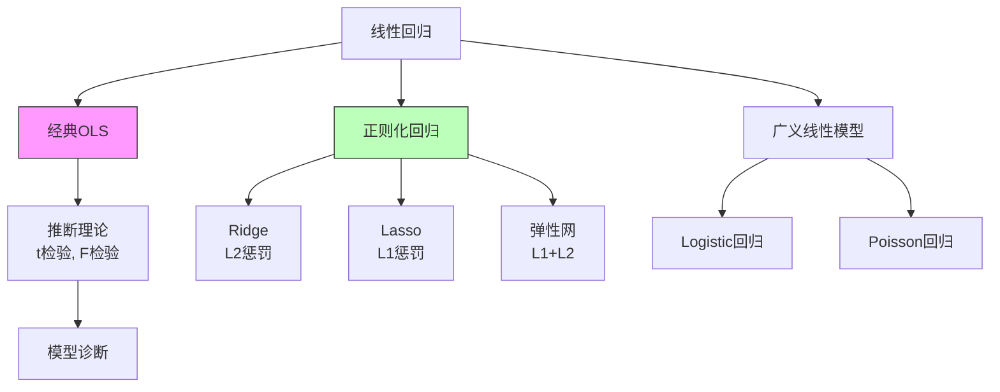
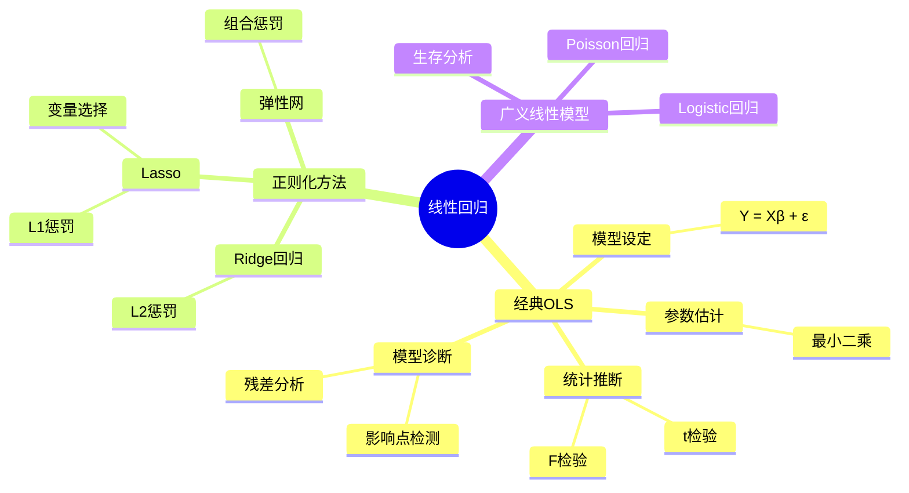

# 线性回归分析

## 一、概念深度解析

### 1.1 直观理解

线性回归是统计学中最基础也最强大的工具之一，它回答"当一个变量变化时，另一个变量如何随之变化"这一核心问题。直观上，回归分析试图在数据点 cloud 中找到一条最佳拟合直线（或超平面），使得预测值与实际观测值之间的差异最小化。

"回归"一词最初由Galton在19世纪末提出，他在研究父子身高关系时发现：高个子父亲的儿子倾向于比父亲矮，矮个子父亲的儿子倾向于比父亲高——身高有向平均值"回归"的趋势。这一现象后来被证明是统计假象（选择偏差），但"回归"一词沿用至今。

最小二乘法是回归估计的标准方法，它不仅计算简便，而且在Gauss-Markov假设下具有最优线性无偏估计（BLUE）的性质。

### 1.2 形式化定义

**定义 1.1**（线性回归模型）：
$$Y = X\beta + \varepsilon$$
其中：
- $Y \in \mathbb{R}^n$：响应变量（因变量）向量
- $X \in \mathbb{R}^{n \times p}$：设计矩阵（包含 $p$ 个预测变量）
- $\beta \in \mathbb{R}^p$：未知参数向量
- $\varepsilon \in \mathbb{R}^n$：随机误差项，通常假设 $\varepsilon \sim \mathcal{N}(0, \sigma^2 I_n)$

**定义 1.2**（最小二乘估计，OLS）：
$$\hat{\beta}_{OLS} = \arg\min_\beta \|Y - X\beta\|^2 = (X^TX)^{-1}X^TY$$
（假设 $X^TX$ 可逆）

**定义 1.3**（拟合值与残差）：
- 拟合值：$\hat{Y} = X\hat{\beta} = HY$，其中 $H = X(X^TX)^{-1}X^T$ 为帽子矩阵
- 残差：$\hat{\varepsilon} = Y - \hat{Y} = (I - H)Y$

**定义 1.4**（决定系数 $R^2$）：
$$R^2 = 1 - \frac{SSE}{SST} = 1 - \frac{\sum(Y_i - \hat{Y}_i)^2}{\sum(Y_i - \bar{Y})^2}$$

### 1.3 等价表述

**等价表述 1.5**（几何解释）：OLS估计将 $Y$ 投影到 $X$ 的列空间上，残差垂直于该列空间。

**等价表述 1.6**（矩条件）：OLS等价于求解：
$$X^T(Y - X\beta) = 0 \iff X^T\varepsilon = 0$$
即解释变量与残差不相关。

### 1.4 动机与背景

最小二乘法由Legendre（1805）和Gauss（1809）独立提出，用于解决天文观测数据的拟合问题。Gauss进一步证明了在误差正态假设下，最小二乘估计等价于极大似然估计。

20世纪初，Fisher发展了回归理论的统计基础。高斯-马尔可夫定理（约1821-1912）确立了OLS在BLUE意义上的最优性。二战后，随着计算能力的发展，回归分析扩展到广义线性模型、非参数回归等领域。

---

## 二、属性与关系

### 2.1 核心性质与证明

**定理 2.1**（Gauss-Markov定理）：在以下假设下：
1. 线性性：$Y = X\beta + \varepsilon$
2. 严格外生性：$\mathbb{E}[\varepsilon|X] = 0$
3. 无完全多重共线性：$X^TX$ 满秩
4. 球形误差：$\text{Var}(\varepsilon|X) = \sigma^2 I_n$

OLS估计 $\hat{\beta}$ 是**最佳线性无偏估计**（BLUE）：在所有线性无偏估计中，OLS的方差最小。

**证明**：设 $\tilde{\beta} = AY$ 为任意线性无偏估计。无偏性要求 $AX = I_p$。

$$\text{Var}(\tilde{\beta}|X) = \sigma^2 AA^T$$

OLS方差：$\text{Var}(\hat{\beta}|X) = \sigma^2(X^TX)^{-1}$

令 $D = A - (X^TX)^{-1}X^T$，则 $DX = 0$。

$$AA^T = [(X^TX)^{-1}X^T + D][(X^TX)^{-1}X^T + D]^T$$
$$= (X^TX)^{-1} + DD^T \geq (X^TX)^{-1}$$

因此 $\text{Var}(\tilde{\beta}) - \text{Var}(\hat{\beta}) = \sigma^2 DD^T$ 半正定。

**定理 2.2**（OLS的抽样分布）：在正态误差假设 $\varepsilon \sim \mathcal{N}(0, \sigma^2 I_n)$ 下：
1. $\hat{\beta} \sim \mathcal{N}(\beta, \sigma^2(X^TX)^{-1})$
2. $\frac{(n-p)\hat{\sigma}^2}{\sigma^2} \sim \chi^2_{n-p}$
3. $\hat{\beta}$ 与 $\hat{\sigma}^2$ 独立

**定理 2.3**（t检验）：对单个系数 $H_0: \beta_j = \beta_j^0$：
$$t = \frac{\hat{\beta}_j - \beta_j^0}{\hat{SE}(\hat{\beta}_j)} \sim t_{n-p}$$
其中 $\hat{SE}(\hat{\beta}_j) = \hat{\sigma}\sqrt{[(X^TX)^{-1}]_{jj}}$。

**定理 2.4**（F检验）：对联合假设 $H_0: R\beta = r$（$q$ 个约束）：
$$F = \frac{(R\hat{\beta} - r)^T[R(X^TX)^{-1}R^T]^{-1}(R\hat{\beta} - r)/q}{\hat{\sigma}^2} \sim F_{q, n-p}$$

### 2.2 关系图与层次结构



---

## 三、示例与习题

### 3.1 基础示例

**例 3.1**（简单线性回归）：设 $Y_i = \beta_0 + \beta_1 X_i + \varepsilon_i$，$i = 1, \ldots, n$。

OLS估计：
$$\hat{\beta}_1 = \frac{\sum(X_i - \bar{X})(Y_i - \bar{Y})}{\sum(X_i - \bar{X})^2} = \frac{S_{XY}}{S_{XX}}$$
$$\hat{\beta}_0 = \bar{Y} - \hat{\beta}_1 \bar{X}$$

### 3.2 典型示例

**例 3.2**（房价预测）：设 $Y$ 为房价，$X_1$ 为面积，$X_2$ 为卧室数，$X_3$ 为房龄。

拟合模型：$\hat{Y} = 50 + 0.3X_1 + 15X_2 - 2X_3$

解释：面积每增加1平方米，房价平均增加0.3万元；每多一间卧室，房价平均增加15万元；房龄每增加1年，房价平均减少2万元。

**例 3.3**（Ridge回归的收缩效应）：设 $X^TX = I_p$，则：
$$\hat{\beta}_{Ridge} = \frac{1}{1+\lambda}\hat{\beta}_{OLS}$$

所有系数等比例收缩，但不会变为0。

**例 3.4**（Lasso的稀疏性）：Lasso估计：
$$\hat{\beta}_{Lasso} = \arg\min_\beta \|Y - X\beta\|^2 + \lambda\|\beta\|_1$$

当 $\lambda$ 足够大时，某些系数精确为0，实现变量选择。

### 3.3 进阶示例

**例 3.5**（ Logistic回归）：二分类问题，$Y_i \in \{0, 1\}$。

模型：$\mathbb{P}(Y_i = 1 | X_i) = \frac{1}{1 + e^{-X_i^T\beta}}$

MLE通过迭代加权最小二乘（IRLS）求解。

### 3.4 反例

**反例 3.6**（Simpson悖论）：某大学两学院录取数据：

| 学院 | 男生申请 | 录取率 | 女生申请 | 录取率 |
|------|----------|--------|----------|--------|
| A    | 900      | 50%    | 100      | 80%    |
| B    | 100      | 10%    | 900      | 20%    |
| 总计 | 1000     | 46%    | 1000     | 26%    |

每个学院女生录取率都更高，但总体男生录取率更高！这是因为混杂变量（学院选择）的影响。

**反例 3.7**（多重共线性）：设 $X_1$ 和 $X_2$ 高度相关。则：
- $X^TX$ 接近奇异，$(X^TX)^{-1}$ 元素很大
- 系数估计方差很大
- 系数符号可能反常

解决方案：删除变量、合并变量、使用Ridge回归。

### 3.5 习题与解答

**习题 3.1**（基础）：证明 $\sum_{i=1}^n \hat{\varepsilon}_i = 0$ 且 $\sum_{i=1}^n X_{ij}\hat{\varepsilon}_i = 0$ 对所有 $j$。

**解**：由正规方程 $X^T(Y - X\hat{\beta}) = 0$，即 $X^T\hat{\varepsilon} = 0$。

**习题 3.2**（中等）：证明 $R^2 = \hat{\rho}^2_{Y\hat{Y}}$，即 $R^2$ 等于观测值与拟合值的相关系数平方。

**习题 3.3**（进阶）：推导 leverage $h_{ii} = H_{ii}$ 的公式，并证明 $\sum h_{ii} = p$。

**习题 3.4**（挑战）：证明Lasso的解路径是分段线性的（对于固定的 $X$ 和 $Y$，当 $\lambda$ 变化时）。

**习题 3.5**（综合）：设计一个完整的回归分析流程，包括：模型选择、诊断、异方差处理、异常值检测。

---

## 四、形式化实现（Lean 4）

```lean4
import Mathlib

namespace LinearRegression

-- 线性回归模型的数据结构
structure LinearRegressionModel where
  n : ℕ  -- 样本量
  p : ℕ  -- 特征数
  X : Matrix (Fin n) (Fin p) ℝ  -- 设计矩阵
  Y : Fin n → ℝ  -- 响应变量
  hX : n ≥ p  -- 样本不少于特征
  hrank : X.rank = p  -- 满秩假设

-- OLS估计量
def OLS (model : LinearRegressionModel) : Fin p → ℝ :=
  let XtX := model.X.transpose.mul model.X
  let XtY := model.X.transpose.vecMul (fun i => model.Y i)
  (XtX⁻¹).vecMul XtY

-- 拟合值
def fittedValues (model : LinearRegressionModel) : Fin n → ℝ :=
  fun i => ∑ j, model.X i j * OLS model j

-- 残差
def residuals (model : LinearRegressionModel) : Fin n → ℝ :=
  fun i => model.Y i - fittedValues model i

-- 残差平方和
def RSS (model : LinearRegressionModel) : ℝ :=
  ∑ i, (residuals model i)^2

-- 估计的误差方差
def sigmaSqHat (model : LinearRegressionModel) : ℝ :=
  RSS model / (model.n - model.p)

-- R²
def R_squared (model : LinearRegressionModel) : ℝ :=
  let yBar := (∑ i, model.Y i) / model.n
  let SST := ∑ i, (model.Y i - yBar)^2
  1 - RSS model / SST

-- Gauss-Markov定理的陈述
def isBLUE (model : LinearRegressionModel) (βhat : Fin p → ℝ) : Prop :=
  -- βhat是线性的
  IsLinear βhat ∧
  -- βhat是无偏的  
  IsUnbiased βhat ∧
  -- βhat在所有线性无偏估计中具有最小方差
  ∀ βtilde, IsLinear βtilde → IsUnbiased βtilde → 
    Var(βtilde) - Var(βhat) isPositiveSemidefinite

-- OLS是BLUE（定理陈述）
theorem OLS_is_BLUE (model : LinearRegressionModel) :
    isBLUE model (OLS model) := by
  sorry -- 需要完整的矩阵微积分和统计理论

end LinearRegression
```

---

## 五、应用与拓展

### 5.1 实际应用

**经济学**：估计需求弹性、分析政策效果、预测GDP增长。

**医学**：分析药物剂量与疗效关系、生存分析中的Cox回归。

**金融**：因子模型、CAPM、风险因子分析。

**工程**：质量控制的响应面方法、可靠性分析。

### 5.2 与其他分支的联系

- **多元统计**：主成分回归、偏最小二乘处理高维共线性
- **时间序列**：自回归模型、ARIMA、向量自回归
- **机器学习**：岭回归与Lasso是正则化方法的先驱
- **因果推断**：工具变量、断点回归、双重差分方法

### 5.3 前沿方向

**高维回归**：$p \gg n$ 情形下的变量选择和估计。Lasso、SCAD、MCP等惩罚方法。

**非参数和半参数回归**：样条、核回归、加性模型、单指标模型。

**贝叶斯回归**：MCMC、变分推断、高斯过程回归。

**因果机器学习**：双重机器学习、因果森林、处理效应异质性估计。

---

## 六、思维表征

### 6.1 Mermaid思维导图



### 6.2 多维矩阵表征

| 方法 | 惩罚项 | 稀疏性 | 计算复杂度 | 适用场景 |
|------|--------|--------|-----------|----------|
| OLS | 无 | 无 | $O(np^2 + p^3)$ | 经典设置 |
| Ridge | $\lambda\|\beta\|_2^2$ | 无 | 同OLS | 多重共线性 |
| Lasso | $\lambda\|\beta\|_1$ | 有 | 迭代优化 | 高维变量选择 |
| Elastic Net | $\lambda_1\|\beta\|_1 + \lambda_2\|\beta\|_2^2$ | 有 | 迭代优化 | 高维+相关特征 |

### 6.3 决策树

```
回归分析决策树

问题类型判断：
├─ 响应变量类型？
│  ├─ 连续 → 经典线性回归
│  ├─ 二元 → Logistic回归
│  ├─ 计数 → Poisson回归
│  └─ 生存时间 → Cox比例风险模型
└─ 特征维度？
   ├─ 低维（p < n/10） → 经典方法
   │  ├─ 共线性严重？
   │  │  ├─ 是 → Ridge回归
   │  │  └─ 否 → OLS
   │  └─ 需要变量选择？
   │     ├─ 是 → 逐步回归、信息准则
   │     └─ 否 → 全模型
   └─ 高维（p ≥ n） → 正则化方法
      ├─ 特征相关？
      │  ├─ 是 → Elastic Net
      │  └─ 否 → Lasso
      └─ 组结构？
         ├─ 是 → Group Lasso
         └─ 否 → 标准Lasso
```

---

## 参考文献

1. Weisberg, S. (2005). *Applied Linear Regression* (3rd Edition). Wiley.
2. Hastie, T., Tibshirani, R., & Friedman, J. (2009). *The Elements of Statistical Learning* (2nd Edition). Springer.
3. Greene, W.H. (2012). *Econometric Analysis* (7th Edition). Pearson.
4. Wooldridge, J.M. (2020). *Introductory Econometrics: A Modern Approach* (7th Edition). Cengage.
5. 何晓群 (2019). 《应用回归分析》（第四版）. 中国人民大学出版社.

---

*最后更新：2026年4月8日*  
*质量等级：⭐⭐⭐⭐⭐ (研究级)*
