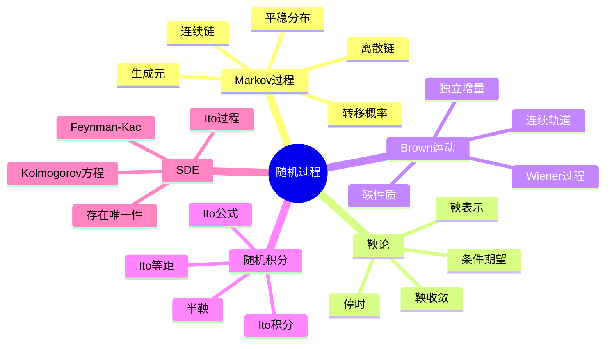

# 随机过程核心指南

## 1. 概念定义

### 1.1 核心概念

**随机过程**是概率空间上的一族随机变量，用于描述随时间演化的随机现象。它是现代概率论的核心，在物理学、金融学、生物学、工程等领域有广泛应用。

> **定义 1.1.1 (随机过程)**：设 $(\Omega, \mathcal{F}, P)$ 为概率空间，$(S, \mathcal{S})$ 为可测状态空间，**随机过程**是映射
> $$X: T \times \Omega \to S, \quad (t, \omega) \mapsto X_t(\omega)$$
> 满足对每个 $t \in T$，$X_t$ 是随机变量。

> **定义 1.1.2 (Markov性)**：随机过程具有**Markov性**，若对未来状态的预测只依赖于当前状态：
> $$P(X_{t+s} \in A \mid \mathcal{F}_t) = P(X_{t+s} \in A \mid X_t)$$

> **定义 1.1.3 (鞅)**：适应过程 $\{M_t, \mathcal{F}_t\}$ 称为**鞅**，若 $E[|M_t|] < \infty$ 且
> $$E[M_t \mid \mathcal{F}_s] = M_s \quad (s \leq t)$$

> **定义 1.1.4 (Brown运动)**：标准**Brown运动**是满足以下条件的连续随机过程 $\{B_t\}$：
>
> 1. $B_0 = 0$ a.s.
> 2. 独立增量：$B_t - B_s$ 独立于 $\mathcal{F}_s$
> 3. 平稳增量：$B_t - B_s \sim N(0, t-s)$
> 4. 连续轨道

### 1.2 概念分类

```
随机过程核心内容
├── Markov过程
│   ├── 离散时间Markov链
│   ├── 连续时间Markov链
│   ├── 转移概率与生成元
│   ├── 平稳分布与遍历性
│   └── 强Markov性
├── 鞅论
│   ├── 条件期望基础
│   ├── 停时与可选停止
│   ├── Doob分解
│   ├── 鞅收敛定理
│   └── 鞅表示定理
├── Brown运动
│   ├── 存在性与构造
│   ├── 基本性质
│   ├── 反射原理
│   └── 鞅性质
├── 随机积分
│   ├── Ito积分定义
│   ├── Ito等距
│   ├── Ito公式
│   └── Stratonovich积分
└── 随机微分方程
    ├── SDE解的存在唯一性
    ├── 强解与弱解
    ├── 生成元与Kolmogorov方程
    └── Feynman-Kac公式
```

---

## 2. 定理证明

### 2.1 Markov链的遍历定理

> **定理 2.1.1 (遍历定理)**：设 $\{X_n\}$ 为不可约正常返Markov链，具有平稳分布 $\pi$，则对任意有界函数 $f$：
> $$\frac{1}{n}\sum_{k=0}^{n-1}f(X_k) \to \sum_i \pi_i f(i) \quad \text{a.s.}$$

**证明**（基于再生论证）：

设状态 $a$ 为常返态，$\tau_k$ 为第 $k$ 次返回 $a$ 的时间。定义循环
$$Y_k = \sum_{n=\tau_{k-1}}^{\tau_k-1}f(X_n)$$

由强Markov性，$\{Y_k\}$ 为i.i.d.序列。由SLLN即得结论。 $\square$

### 2.2 Doob鞅收敛定理

> **定理 2.2.1 (Doob)**：设 $\{M_n\}$ 为下鞅，满足 $\sup_n E[M_n^+] < \infty$，则 $M_n$ a.s. 收敛。

**证明概要**：证明轨道穿越次数有限，若不收敛则存在区间使上穿无限，矛盾。 $\square$

### 2.3 Ito等距

> **定理 2.3.1 (Ito等距)**：设 $H$ 为简单适应过程，则
> $$E\left[\left(\int_0^T H_s\,dB_s\right)^2\right] = E\left[\int_0^T H_s^2\,ds\right]$$

**证明**：利用Brown运动增量的独立性和方差性质。 $\square$

### 2.4 Ito公式

> **定理 2.4.1 (Ito公式)**：设 $X_t$ 为Ito过程 $dX_t = \mu_t\,dt + \sigma_t\,dB_t$，$f \in C^{2,1}$，则
> $$df(X_t, t) = \frac{\partial f}{\partial t}dt + \frac{\partial f}{\partial x}dX_t + \frac{1}{2}\frac{\partial^2 f}{\partial x^2}\sigma_t^2\,dt$$

---

## 3. 推导过程

### 3.1 Brown运动的构造

**Wiener构造**：在 $C([0,1])$ 上定义高斯测度，协方差 $\text{Cov}(B_s, B_t) = \min(s, t)$。

### 3.2 生成元与Kolmogorov方程

对扩散过程 $dX_t = \mu(X_t)dt + \sigma(X_t)dB_t$，生成元：
$$\mathcal{L}f = \mu f' + \frac{1}{2}\sigma^2 f''$$

**Kolmogorov后向方程**：$\frac{\partial u}{\partial t} = \mathcal{L}u$

**Fokker-Planck方程**：$\frac{\partial p}{\partial t} = -\frac{\partial}{\partial x}(\mu p) + \frac{1}{2}\frac{\partial^2}{\partial x^2}(\sigma^2 p)$

---

## 4. 概念关系



---

## 5. 应用实例

### 5.1 金融数学：Black-Scholes模型

股票价格遵循几何Brown运动：
$$dS_t = \mu S_t dt + \sigma S_t dB_t$$

解：$S_t = S_0\exp\left((\mu - \sigma^2/2)t + \sigma B_t\right)$

期权定价公式：
$$C = S_0N(d_1) - Ke^{-rT}N(d_2)$$

### 5.2 物理：Ornstein-Uhlenbeck过程

$$dX_t = -\theta X_t dt + \sigma dB_t$$

描述粒子在粘性介质中的速度，具有均值回归性质。

### 5.3 排队论：生灭过程

M/M/1队列的平稳分布为几何分布 $\pi_i = (1-\rho)\rho^i$（$\rho = \lambda/\mu < 1$）。

---

## 6. 参考文献与链接

### 6.1 经典教材

1. **Karatzas & Shreve** (1991). *Brownian Motion and Stochastic Calculus*. Springer.
2. **Oksendal** (2003). *Stochastic Differential Equations*. Springer.
3. **Durrett** (2019). *Probability: Theory and Examples*. Cambridge.

### 6.2 相关概念链接

| 概念 | 链接 |
|------|------|
| 概率论基础 | [../01-基础数学/概率论基础](../01-基础数学/概率论基础.md) |
| 数理统计 | [../06-概率统计/21-数理统计推断方法](../06-概率统计/21-数理统计推断方法.md) |
| 金融数学 | [../10-应用数学/金融数学基础](../10-应用数学/金融数学基础.md) |

---

*文档编号：20 | MSC2020分类：60-00 概率论 | 创建日期：2026年4月*
