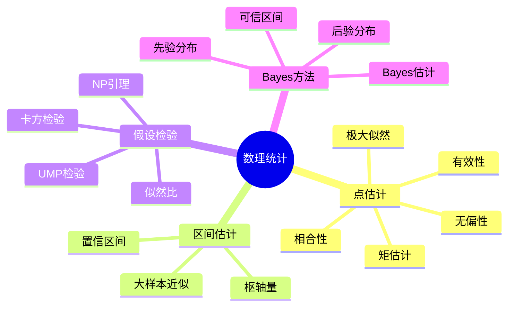

# 数理统计推断方法

## 1. 概念定义

### 1.1 核心概念

**数理统计**是基于概率论，研究如何从样本数据中提取总体信息并进行科学推断的学科。核心问题包括参数估计、假设检验、置信区间构造等。

> **定义 1.1.1 (统计模型)**：**统计模型**是可测空间 $(\mathcal{X}, \mathcal{B})$ 上的一族概率分布 $\mathcal{P} = \{P_\theta : \theta \in \Theta\}$，其中 $\Theta$ 为参数空间。观测数据 $X$ 视为来自某个 $P_\theta$ 的样本。

> **定义 1.1.2 (点估计)**：**点估计**是统计量（样本的函数）$\hat{\theta}: \mathcal{X} \to \Theta$，用于估计未知参数 $\theta$。

> **定义 1.1.3 (无偏性)**：估计量 $\hat{\theta}$ 称为**无偏的**，若
> $$E_\theta[\hat{\theta}] = \theta, \quad \forall \theta \in \Theta$$

> **定义 1.1.4 (相合性)**：估计量 $\hat{\theta}_n$ 称为**相合的**，若
> $$\hat{\theta}_n \xrightarrow{P} \theta \quad (n \to \infty)$$

> **定义 1.1.5 (假设检验)**：设原假设 $H_0: \theta \in \Theta_0$，备择假设 $H_1: \theta \in \Theta_1$，**检验**是决策规则 $\phi: \mathcal{X} \to \{0, 1\}$（$\phi(x) = 1$ 表示拒绝 $H_0$）。

### 1.2 概念分类

```
数理统计核心内容
├── 点估计
│   ├── 矩估计法
│   ├── 极大似然估计(MLE)
│   ├── 估计量的评价标准
│   │   ├── 无偏性
│   │   ├── 有效性(Rao-Cramer下界)
│   │   └── 相合性
│   └── Bayes估计
├── 区间估计
│   ├── 置信区间构造
│   ├── 枢轴量方法
│   ├── 大样本近似
│   └── Bayes可信区间
├── 假设检验
│   ├── Neyman-Pearson引理
│   ├── 似然比检验
│   ├── 一致最优势检验(UMP)
│   ├── 卡方检验
│   └── 非参数检验
└── Bayes推断
    ├── 先验分布选择
    ├── 后验分布计算
    ├── Bayes估计
    └── 层次Bayes模型
```

---

## 2. 定理证明

### 2.1 Rao-Blackwell定理

> **定理 2.1.1 (Rao-Blackwell)**：设 $\hat{\theta}$ 为 $\theta$ 的无偏估计，$T$ 为充分统计量，则条件期望 $\tilde{\theta} = E[\hat{\theta} \mid T]$ 满足
>
> 1. $E[\tilde{\theta}] = \theta$（无偏性保持）
> 2. $\text{Var}(\tilde{\theta}) \leq \text{Var}(\hat{\theta})$（方差不增）

**证明**：

**步骤1**：由迭代期望法则
$$E[\tilde{\theta}] = E[E[\hat{\theta} \mid T]] = E[\hat{\theta}] = \theta$$

**步骤2**：计算方差
$$\text{Var}(\hat{\theta}) = E[\text{Var}(\hat{\theta} \mid T)] + \text{Var}(E[\hat{\theta} \mid T]) = E[\text{Var}(\hat{\theta} \mid T)] + \text{Var}(\tilde{\theta})$$

因此 $\text{Var}(\hat{\theta}) \geq \text{Var}(\tilde{\theta})$。 $\square$

### 2.2 Cramer-Rao下界

> **定理 2.2.1 (Cramer-Rao)**：设 $\hat{\theta}$ 为 $g(\theta)$ 的无偏估计，在正则条件下
> $$\text{Var}(\hat{\theta}) \geq \frac{[g'(\theta)]^2}{I(\theta)}$$
> 其中 $I(\theta) = E\left[\left(\frac{\partial \ln f(X;\theta)}{\partial \theta}\right)^2\right]$ 为Fisher信息。

**证明概要**：

由无偏性 $E[\hat{\theta}] = g(\theta)$，对 $\theta$ 求导：
$$\int \hat{\theta}(x)\frac{\partial f(x;\theta)}{\partial \theta}dx = g'(\theta)$$

即 $\text{Cov}(\hat{\theta}, S) = g'(\theta)$，其中 $S = \frac{\partial \ln f}{\partial \theta}$ 为得分函数。

由Cauchy-Schwarz不等式：
$$[g'(\theta)]^2 = \text{Cov}^2(\hat{\theta}, S) \leq \text{Var}(\hat{\theta})\text{Var}(S) = \text{Var}(\hat{\theta})I(\theta)$$

### 2.3 Neyman-Pearson引理

> **定理 2.3.1 (Neyman-Pearson)**：对简单假设 $H_0: \theta = \theta_0$ vs $H_1: \theta = \theta_1$，似然比检验
> $$\phi^*(x) = \begin{cases} 1 & \text{if } \frac{f(x;\theta_1)}{f(x;\theta_0)} > k \\ 0 & \text{if } \frac{f(x;\theta_1)}{f(x;\theta_0)} < k \end{cases}$$
> 在显著性水平 $\alpha$ 下具有最大功效。

### 2.4 MLE的渐近正态性

> **定理 2.4.1**：在正则条件下，MLE $\hat{\theta}_n$ 满足
> $$\sqrt{n}(\hat{\theta}_n - \theta) \xrightarrow{d} N(0, I(\theta)^{-1})$$

---

## 3. 推导过程

### 3.1 极大似然估计推导

对独立样本 $X_1, \ldots, X_n \sim f(x;\theta)$，似然函数
$$L(\theta) = \prod_{i=1}^n f(X_i;\theta)$$

对数似然：$\ell(\theta) = \sum_{i=1}^n \ln f(X_i;\theta)$

**MLE方程**：$\frac{\partial \ell}{\partial \theta} = 0$

**正态分布MLE**：$X_i \sim N(\mu, \sigma^2)$
$$\hat{\mu} = \bar{X}, \quad \hat{\sigma}^2 = \frac{1}{n}\sum_{i=1}^n(X_i - \bar{X})^2$$

### 3.2 置信区间构造

**枢轴量方法**：寻找 $Q(X, \theta)$，其分布不依赖于 $\theta$。

**正态均值**：$Q = \frac{\bar{X} - \mu}{S/\sqrt{n}} \sim t_{n-1}$

置信区间：$\bar{X} \pm t_{\alpha/2, n-1}\frac{S}{\sqrt{n}}$

### 3.3 Bayes推断框架

**Bayes定理**：
$$\pi(\theta \mid x) = \frac{f(x \mid \theta)\pi(\theta)}{\int f(x \mid \theta)\pi(\theta)d\theta}$$

**共轭先验**：

| 似然 | 共轭先验 | 后验 |
|------|----------|------|
| Bernoulli | Beta | Beta |
| 正态(已知方差) | 正态 | 正态 |
| 正态(已知均值) | 逆Gamma | 逆Gamma |
| Poisson | Gamma | Gamma |

---

## 4. 概念关系



### 4.1 核心概念网络

```
                    样本数据
                        │
        +---------------+---------------+
        │               │               │
    参数估计        假设检验         预测推断
        │               │               │
    +---+---+           │               │
    │       │           │               │
 点估计   区间估计    显著性检验      Bayes预测
    │       │           │               │
    MLE     置信区间   功效分析        后验预测
    矩估计   枢轴量    样本量计算       分布
    Bayes
```

---

## 5. 应用实例

### 5.1 正态分布参数推断

样本：$X_1, \ldots, X_n \overset{iid}{\sim} N(\mu, \sigma^2)$

**点估计**：

- MLE：$\hat{\mu} = \bar{X}$，$\hat{\sigma}^2 = \frac{1}{n}\sum(X_i - \bar{X})^2$
- 无偏估计：$S^2 = \frac{1}{n-1}\sum(X_i - \bar{X})^2$

**置信区间**（$\sigma^2$ 未知）：
$$\bar{X} \pm t_{\alpha/2, n-1}\frac{S}{\sqrt{n}}$$

**假设检验**（$H_0: \mu = \mu_0$）：
$$T = \frac{\bar{X} - \mu_0}{S/\sqrt{n}} \sim t_{n-1}$$

### 5.2 线性回归分析

模型：$Y = X\beta + \varepsilon$，$\varepsilon \sim N(0, \sigma^2 I)$

**MLE/LS估计**：$\hat{\beta} = (X^TX)^{-1}X^TY$

**分布**：$\hat{\beta} \sim N(\beta, \sigma^2(X^TX)^{-1})$

**检验**：$F = \frac{(RSS_0 - RSS_1)/q}{RSS_1/(n-p)} \sim F_{q,n-p}$

### 5.3 假设检验：两样本t检验

比较两组均值：$H_0: \mu_1 = \mu_2$

检验统计量：
$$t = \frac{\bar{X}_1 - \bar{X}_2}{S_p\sqrt{\frac{1}{n_1} + \frac{1}{n_2}}}$$
其中 $S_p^2 = \frac{(n_1-1)S_1^2 + (n_2-1)S_2^2}{n_1+n_2-2}$

### 5.4 Bayes分析：Beta-Binomial模型

观测：$X \sim \text{Binomial}(n, \theta)$

先验：$\theta \sim \text{Beta}(\alpha, \beta)$

后验：$\theta \mid X \sim \text{Beta}(\alpha + X, \beta + n - X)$

**Bayes估计**：

- 后验均值：$\hat{\theta}_{PM} = \frac{\alpha + X}{\alpha + \beta + n}$
- MAP：$\hat{\theta}_{MAP} = \frac{\alpha + X - 1}{\alpha + \beta + n - 2}$

---

## 6. 参考文献与链接

### 6.1 经典教材

1. **Casella, G., & Berger, R. L.** (2002). *Statistical Inference* (2nd ed.). Duxbury.
2. **Lehmann, E. L., & Casella, G.** (1998). *Theory of Point Estimation* (2nd ed.). Springer.
3. **Lehmann, E. L., & Romano, J. P.** (2005). *Testing Statistical Hypotheses* (3rd ed.). Springer.
4. **Wasserman, L.** (2004). *All of Statistics*. Springer.
5. **Gelman, A., et al.** (2013). *Bayesian Data Analysis* (3rd ed.). CRC Press.

### 6.2 相关概念链接

| 概念 | 链接 |
|------|------|
| 概率论基础 | [../01-基础数学/概率论基础](../01-基础数学/概率论基础.md) |
| 随机过程 | [../06-概率统计/20-随机过程核心指南](../06-概率统计/20-随机过程核心指南.md) |
| 回归分析 | [../06-概率统计/回归分析](../06-概率统计/回归分析.md) |
| 多元统计 | [../06-概率统计/多元统计分析](../06-概率统计/多元统计分析.md) |
| 实验设计 | [../06-概率统计/实验设计](../06-概率统计/实验设计.md) |
| 统计计算 | [../08-计算数学/统计计算方法](../08-计算数学/统计计算方法.md) |

### 6.3 进阶主题

```
数理统计
    │
    ├──→ 渐近理论
    │       ├── 相合性与渐近正态性
    │       ├── Delta方法
    │       └── Edgeworth展开
    │
    ├──→ 非参数统计
    │       ├── 核密度估计
    │       ├── 样条方法
    │       └──  bootstrap
    │
    ├──→ 高维统计
    │       ├── Lasso与稀疏性
    │       ├── 随机矩阵
    │       └── 高维检验
    │
    └──→ 因果推断
            ├── 潜在结果框架
            ├── 工具变量
            └── 双重差分
```

---

## 附录：常用统计分布表

### 正态分布相关

| 统计量 | 分布 | 条件 |
|--------|------|------|
| $\frac{\bar{X}-\mu}{\sigma/\sqrt{n}}$ | $N(0,1)$ | $\sigma$ 已知 |
| $\frac{\bar{X}-\mu}{S/\sqrt{n}}$ | $t_{n-1}$ | $\sigma$ 未知 |
| $\frac{(n-1)S^2}{\sigma^2}$ | $\chi^2_{n-1}$ | 正态样本 |

### 两样本问题

| 问题 | 检验统计量 | 分布 |
|------|-----------|------|
| 均值相等(方差已知) | $Z = \frac{\bar{X}_1-\bar{X}_2}{\sqrt{\frac{\sigma_1^2}{n_1}+\frac{\sigma_2^2}{n_2}}}$ | $N(0,1)$ |
| 均值相等(方差未知相等) | $t$ (见5.3) | $t_{n_1+n_2-2}$ |
| 方差相等 | $F = \frac{S_1^2}{S_2^2}$ | $F_{n_1-1,n_2-1}$ |

### 大样本近似

| 参数 | 估计量 | 渐近分布 |
|------|--------|----------|
| 均值 | $\bar{X}$ | $N(\mu, \sigma^2/n)$ |
| 比例 | $\hat{p}$ | $N(p, p(1-p)/n)$ |
| MLE | $\hat{\theta}$ | $N(\theta, I(\theta)^{-1}/n)$ |

---

*文档编号：21 | MSC2020分类：62-00 统计学 | 创建日期：2026年4月*
