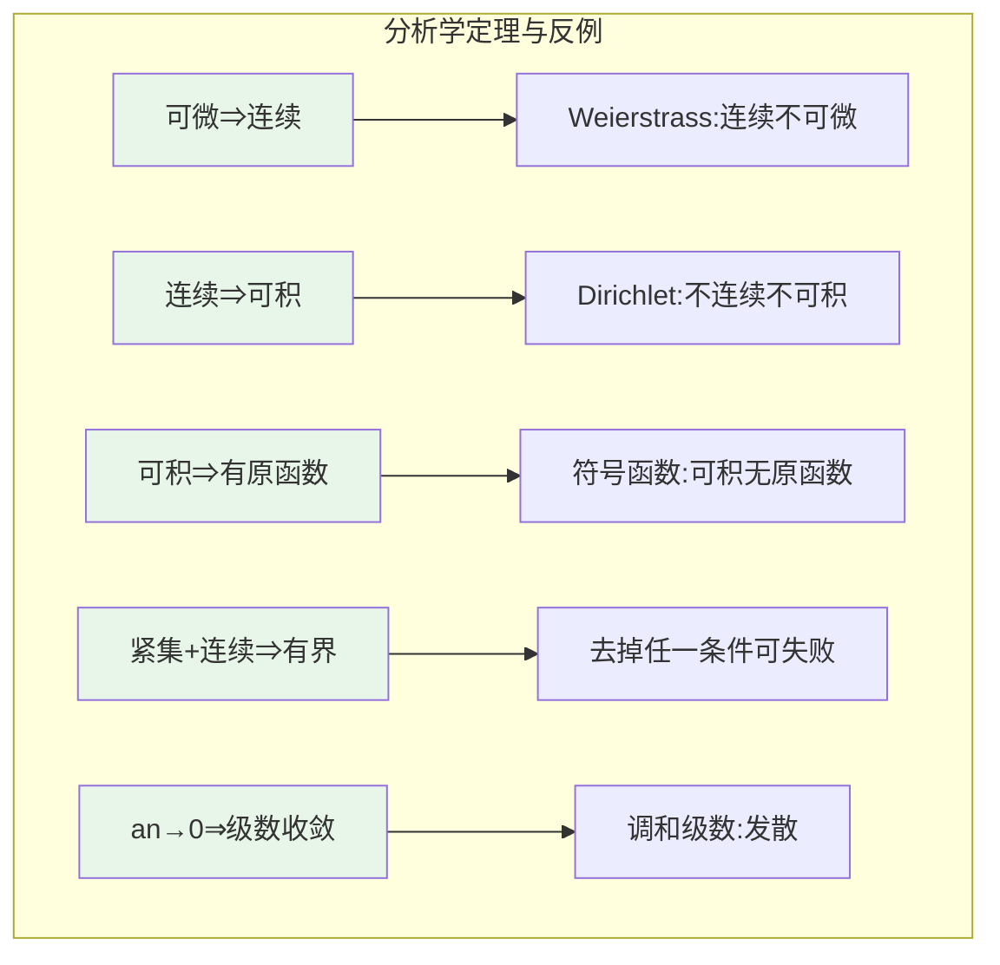
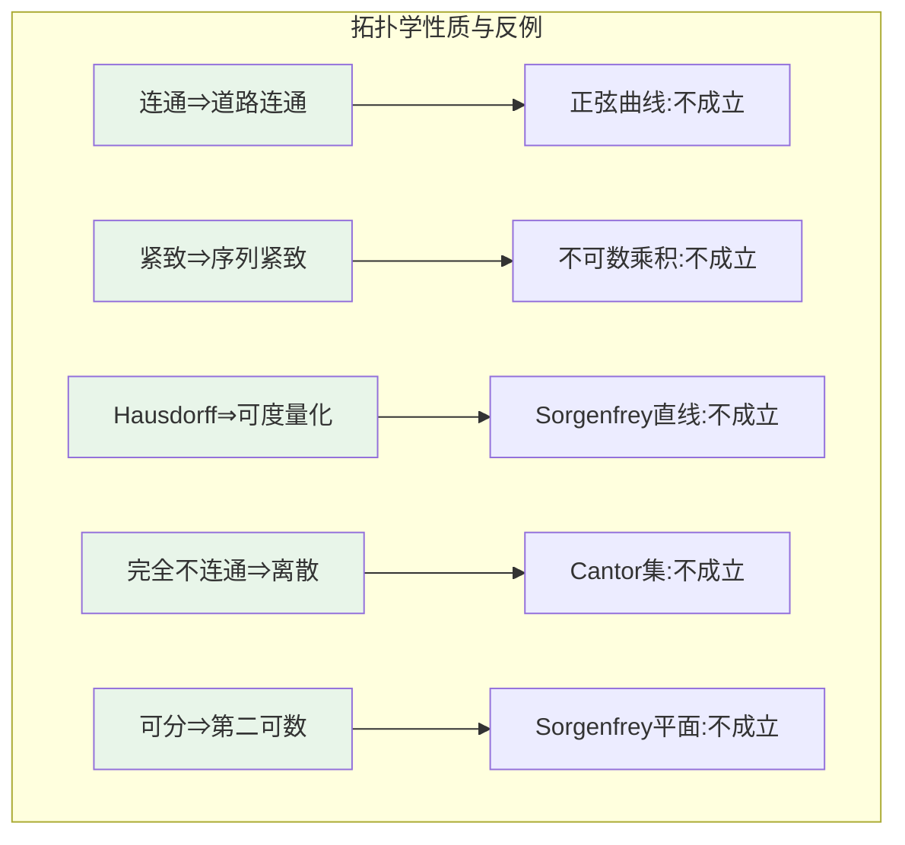
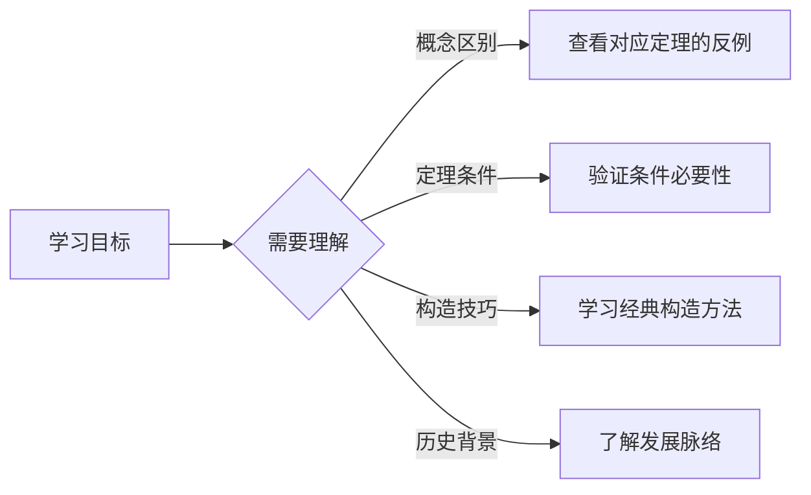

# 经典反例索引

## 概述

本索引汇集数学各分支中最重要的经典反例，按学科分类整理，便于快速查找和学习。

---

## 分析学反例

| 序号 | 反例名称 | 核心性质 | 文档路径 |
|-----|---------|---------|---------|
| 1 | **Weierstrass 函数** | 连续但无处可微 | [08-连续但无处可微函数详解](../06-实例与案例分析/08-连续但无处可微函数详解.md) |
| 2 | **调和级数** | 通项趋于零但级数发散 | [09-发散但通项趋于零的级数](../06-实例与案例分析/09-发散但通项趋于零的级数.md) |
| 3 | **符号函数/Thomae 函数** | 可积但无原函数 | [10-可积但无原函数的函数](../06-实例与案例分析/10-可积但无原函数的函数.md) |
| 4 | **紧集有界性定理条件** | 紧集+连续 ⇒ 有界 | [11-紧集上无界连续函数的反例](../06-实例与案例分析/11-紧集上无界连续函数的反例.md) |
| 5 | **Dirichlet 函数** | 处处不连续 | 分析学基础 |
| 6 | **Cantor 函数** | 连续但非绝对连续（魔鬼楼梯） | 实变函数论 |
| 7 | **Faber 函数** | 连续但无处可微的变体 | 函数逼近论 |
| 8 | **Volterra 函数** | 导数存在但不可积 | 微积分反例 |

### 关键定理对照



---

## 代数学反例

| 序号 | 反例名称 | 核心性质 | 文档路径 |
|-----|---------|---------|---------|
| 1 | **$S_3$、$D_4$、$Q_8$** | 非交换有限群 | [12-非交换有限群的典型例子](../06-实例与案例分析/12-非交换有限群的典型例子.md) |
| 2 | **$2\mathbb{Z}$、$C_c(\mathbb{R})$** | 无单位元的环 | [13-无单位元的环](../06-实例与案例分析/13-无单位元的环.md) |
| 3 | **$\mathbb{Z}[\sqrt{-5}]$ 中的 3** | 不可约但非素元 | [14-素元非不可约元的整环](../06-实例与案例分析/14-素元非不可约元的整环.md) |
| 4 | **$(2, x) \subseteq \mathbb{Z}[x]$** | 非主理想 | [15-非主理想的理想](../06-实例与案例分析/15-非主理想的理想.md) |
| 5 | **Hamilton 四元数** | 非交换除环 | 代数学基础 |
| 6 | **幂零元环** | 零因子存在但无幂零元 | 环论基础 |
| 7 | **分次代数** | 非交换但满足特定关系 | 同调代数 |

### 关键概念对照

```mermaid
flowchart TB
    subgraph 代数学概念与反例
        C1[群可交换] --> R1[S3,D4,Q8:非交换]
        C2[环有单位元] --> R2[2Z:无单位元]
        C3[素元=不可约元] --> R3[Z[√-5]:不等价]
        C4[理想是主的] --> R4[(2,x):非主理想]
        C5[交换⇒整环] --> R5[矩阵环:非交换]
    end

    style C1 fill:#e8f5e9
    style C2 fill:#e8f5e9
    style C3 fill:#e8f5e9
    style C4 fill:#e8f5e9
    style C5 fill:#e8f5e9
```

---

## 拓扑学反例

| 序号 | 反例名称 | 核心性质 | 文档路径 |
|-----|---------|---------|---------|
| 1 | **拓扑学家的正弦曲线** | 连通但非道路连通 | [16-连通但非道路连通的空间](../06-实例与案例分析/16-连通但非道路连通的空间.md) |
| 2 | **$[0,1]^{[0,1]}$ 乘积拓扑** | 紧致但非列紧 | [17-紧致但非列紧的空间](../06-实例与案例分析/17-紧致但非列紧的空间.md) |
| 3 | **Sorgenfrey 直线** | Hausdorff 但不可度量化 | [18-Hausdorff但不可度量化](../06-实例与案例分析/18-Hausdorff但不可度量化.md) |
| 4 | **Cantor 集** | 完全不连通但非离散 | [19-完全不连通但非离散的空间](../06-实例与案例分析/19-完全不连通但非离散的空间.md) |
| 5 | **长直线** | 序列紧致但不紧致 | 一般拓扑学 |
| 6 | **Niemytzki 平面** | 可分但非第二可数 | 拓扑学经典 |
| 7 | **Warsaw 圆** | 单连通但非道路连通 | 代数拓扑 |
| 8 | **Alexandroff 双圆** | 紧、连通但非道路连通 | 拓扑学反例 |

### 关键性质对照



---

## 集合论与数理逻辑反例

| 序号 | 反例名称 | 核心性质 | 相关概念 |
|-----|---------|---------|---------|
| 1 | **Russell 悖论** | 朴素集合论的矛盾 | 集合论公理化 |
| 2 | **Banach-Tarski 悖论** | 选择公理的惊人推论 | 测度论基础 |
| 3 | **Gödel 不完备定理** | 形式系统的局限性 | 数理逻辑 |
| 4 | **连续统假设独立性** | ZFC 无法判定 CH | 集合论 |
| 5 | **Suslin 假设反例** | 与 ZFC 独立 | 序数理论 |

---

## 概率论反例

| 序号 | 反例名称 | 核心性质 | 相关概念 |
|-----|---------|---------|---------|
| 1 | **Saint Petersburg 悖论** | 期望无穷但理性拒绝 | 期望理论 |
| 2 | **Bertrand 悖论** | 几何概率的不确定性 | 概率空间构造 |
| 3 | **非可测集** | Vitali 集的存在性 | 测度论 |
| 4 | **大数定律失效** | 重尾分布 | 收敛性条件 |

---

## 微分方程反例

| 序号 | 反例名称 | 核心性质 | 相关概念 |
|-----|---------|---------|---------|
| 1 | **Peano 存在性反例** | 唯一性不保证 | 常微分方程 |
| 2 | **Lewy 不可解方程** | 光滑系数但无解 | 偏微分方程 |
| 3 | **Tychonoff 反例** | 热方程解不唯一 | 抛物方程 |

---

## 使用指南

### 按学习目标查找



### 推荐阅读顺序

1. **初学者**：从分析学反例开始，概念最直观
2. **进阶学习**：代数学反例，培养抽象思维
3. **高级专题**：拓扑学反例，理解拓扑本质

---

## 相关资源

- [反例分类思维导图](./01-反例分类思维导图.md)
- [反例与定理关系矩阵](./02-反例与定理关系矩阵.md)

---

*文档版本：v1.0 | 创建日期：2026-04-09 | 最后更新：2026-04-09*
