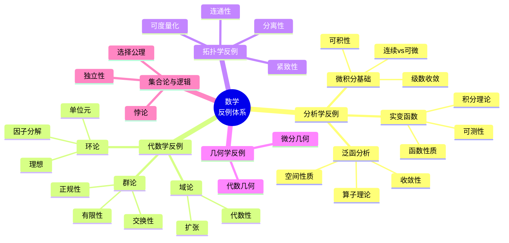
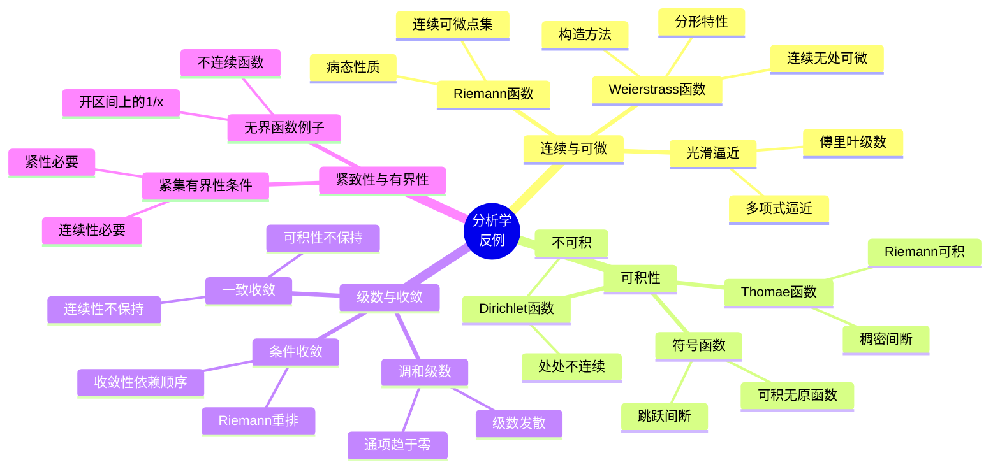
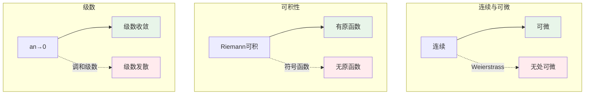
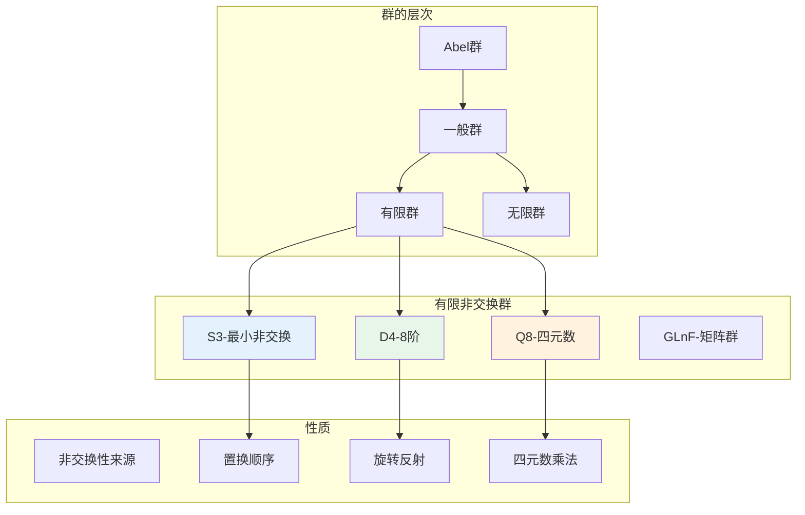
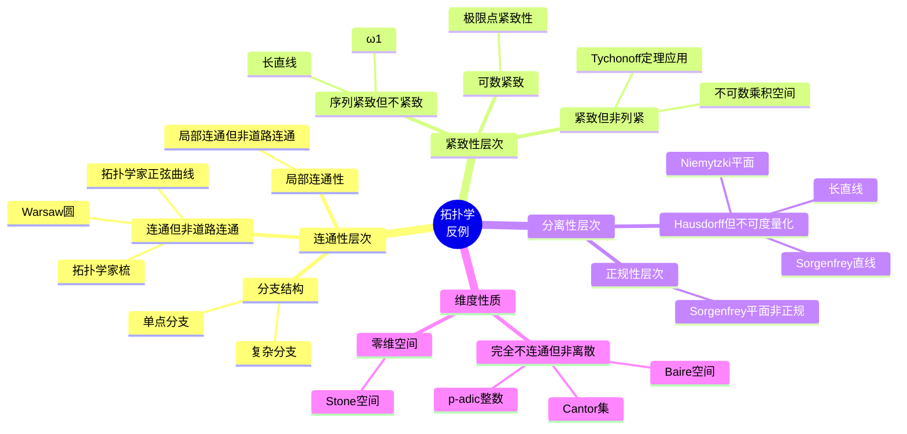
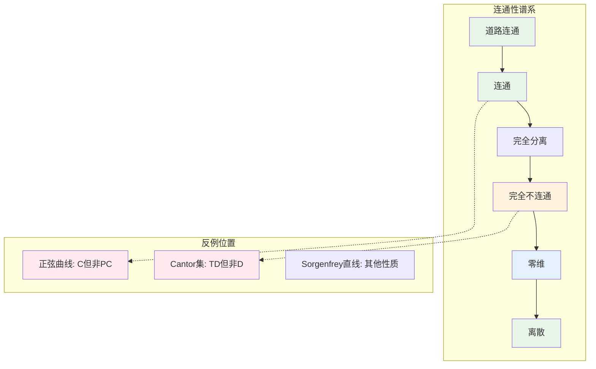
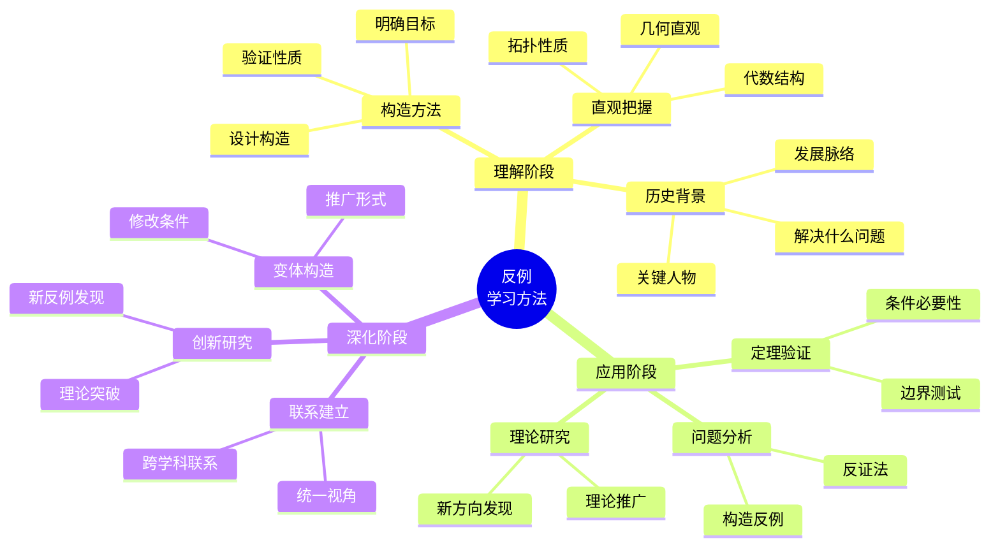
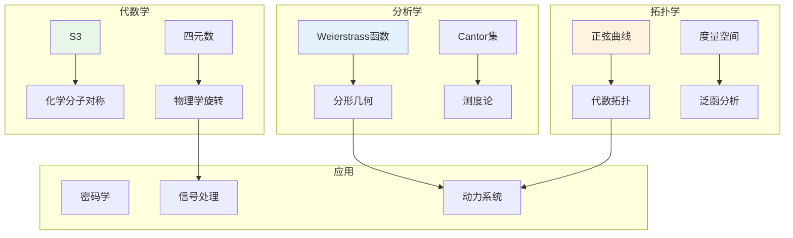
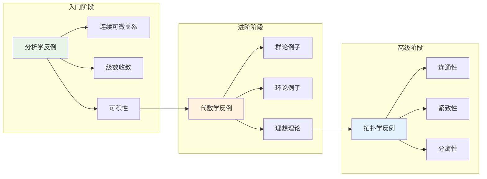

# 反例分类思维导图

本文档以思维导图形式展示数学反例的层次结构和分类体系，帮助学习者建立系统的反例知识框架。

---

## 一、全局概览



---

## 二、分析学反例详细分类



### 关键关系



---

## 三、代数学反例详细分类

```mermaid
mindmap
  root((代数学<br>反例))
    群论反例
      非交换群
        S3-3次对称群
        D4-二面体群
        Q8-四元数群
        GLn-一般线性群
      非正规子群
        非交换群的子群
      非单群
        合成列概念
    环论反例
      无单位元
        2Z-偶数环
        CcR-紧支撑函数
        理想
      非主理想
        Zx中2,x
        Z[√-5]中2,1+√-5
        kx,y中x,y
      唯一分解失效
        Z[√-5]
        素元≠不可约元
    模论反例
      非自由模
        挠模
        投射模
      非平坦模
        Tor函子
```

### 群论反例结构



---

## 四、拓扑学反例详细分类



### 连通性层次结构



---

## 五、反例学习方法思维导图



---

## 六、学科交叉关系图



---

## 七、推荐学习路径



---

## 八、常见误区警示

```mermaid
mindmap
  root((常见<br>误区))
    分析学
      连续等于可微
        Weierstrass反例
      可积等于有原函数
        符号函数反例
      通项趋于零等于收敛
        调和级数反例
    代数学
      群都交换
        S3最小反例
      环都有单位元
        2Z反例
      素元等于不可约元
        Z[√-5]反例
    拓扑学
      连通等于道路连通
        正弦曲线反例
      紧致等于序列紧致
        不可数乘积反例
      Hausdorff等于可度量化
        Sorgenfrey直线反例
      完全不连通等于离散
        Cantor集反例
```

---

*文档版本：v1.0 | 创建日期：2026-04-09*
