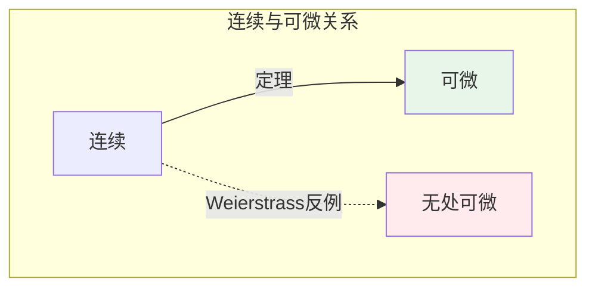
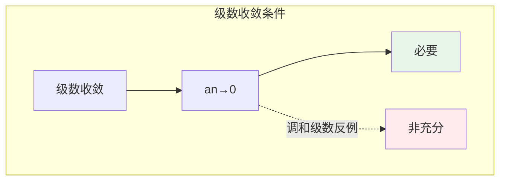
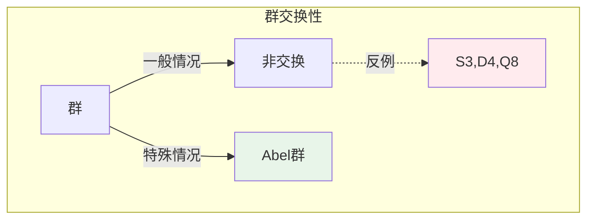
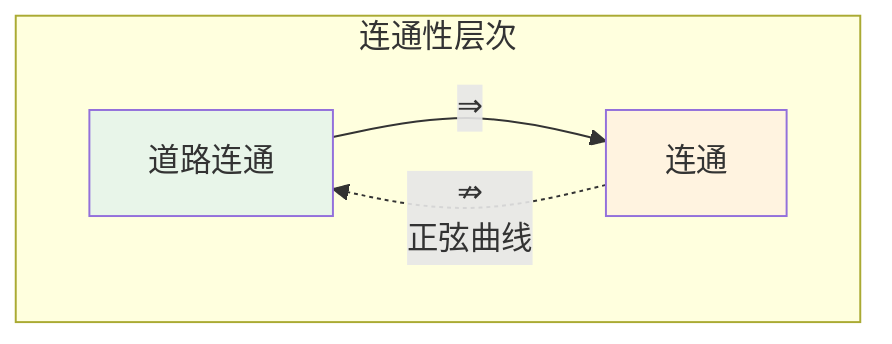
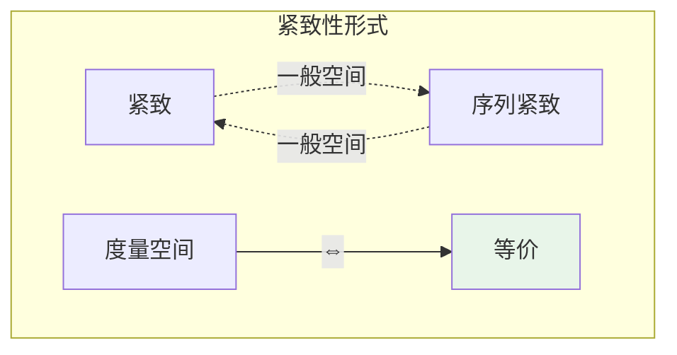
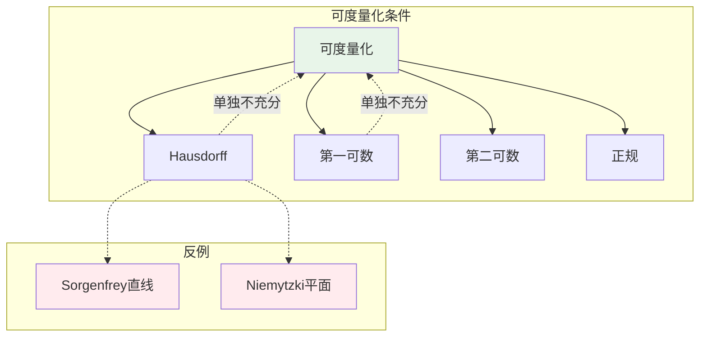
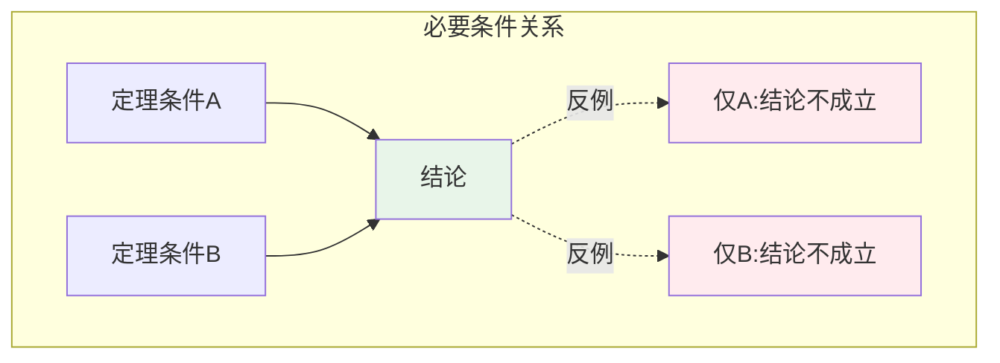

# 反例与定理关系矩阵

本文档以矩阵形式系统展示数学定理与其相关反例之间的对应关系，便于快速查阅和理解定理条件的必要性。

---

## 一、分析学定理-反例矩阵

### 1.1 微积分基础

| 定理 | 正向表述 | 反例 | 说明 |
|-----|---------|-----|------|
| **可微⇒连续** | $f$ 可微则 $f$ 连续 | — | 无条件反例 |
| **连续⇒可微** | $f$ 连续则 $f$ 可微 | Weierstrass 函数 | 连续但无处可微 |
| **光滑逼近** | 连续函数可用多项式逼近 | 无处可微函数 | 光滑逼近极限不光滑 |
| **原函数存在** | 连续函数有原函数 | 符号函数 | 可积但无原函数 |
| **Newton-Leibniz** | $f$ 连续则积分可微 | 一般可积函数 | 连续条件是充分的 |



### 1.2 可积性理论

| 定理 | 正向表述 | 反例 | 说明 |
|-----|---------|-----|------|
| **连续⇒可积** | $f$ 连续则 Riemann 可积 | — | 无条件成立 |
| **可积⇒连续** | $f$ 可积则 $f$ 连续 | Thomae 函数 | 可积但处处不连续 |
| **可积⇒有原函数** | $f$ 可积则存在 $F'=f$ | 符号函数 | 跳跃间断阻止原函数 |
| **有界+间断点有限⇒可积** | 有限个间断点可积 | Dirichlet 函数 | 处处间断不可积 |

### 1.3 级数理论

| 定理 | 正向表述 | 反例 | 说明 |
|-----|---------|-----|------|
| **级数收敛⇒通项→0** | $\sum a_n$ 收敛则 $a_n \to 0$ | — | 无条件成立 |
| **通项→0⇒级数收敛** | $a_n \to 0$ 则 $\sum a_n$ 收敛 | **调和级数** | 最经典反例 |
| **绝对收敛⇒收敛** | $\sum |a_n|$ 收敛则 $\sum a_n$ 收敛 | — | 无条件成立 |
| **收敛⇒绝对收敛** | $\sum a_n$ 收敛则绝对收敛 | **交错调和级数** | 条件收敛非绝对收敛 |



### 1.4 紧致性与连续性

| 定理 | 正向表述 | 反例（违反条件） | 说明 |
|-----|---------|----------------|------|
| **紧集+连续⇒有界** | $K$ 紧、$f$ 连续则 $f$ 有界 | $f(x)=1/x$ on $(0,1]$ | 非紧集可无界 |
| | | $f$ 不连续 on $[0,1]$ | 不连续可无界 |
| **紧集+连续⇒极值** | $f$ 在紧集上取最大最小 | 同上 | 条件同时必要 |
| **一致连续性** | 紧集上连续⇒一致连续 | $(0,1]$ 上 $1/x$ | 非紧集不一致连续 |

---

## 二、代数学定理-反例矩阵

### 2.1 群论

| 定理/性质 | 正向表述 | 反例 | 说明 |
|----------|---------|-----|------|
| **Lagrange 定理** | $H \leq G$ 则 $|H| \mid |G|$ | — | 无条件成立 |
| **交换群性质** | Abel 群满足交换律 | **$S_3$** | 最小非交换群 |
| | | **$D_4$** | 几何对称群 |
| | | **$Q_8$** | 四元数群 |
| **Cauchy 定理** | $p \mid |G|$ 则存在 $p$ 阶元 | — | 无条件成立 |
| **Sylow 定理** | Sylow $p$-子群存在且共轭 | — | 无条件成立 |



### 2.2 环论与理想

| 定理/性质 | 正向表述 | 反例 | 说明 |
|----------|---------|-----|------|
| **PID 性质** | 主理想整环中理想皆主 | **$\mathbb{Z}[x]$** | $(2,x)$ 非主理想 |
| | | **$\mathbb{Z}[\sqrt{-5}]$** | 非 UFD，非 PID |
| **UFD 性质** | UFD 中分解唯一 | **$\mathbb{Z}[\sqrt{-5}]$** | $6=2·3=(1+√-5)(1-√-5)$ |
| **素元=不可约元** | UFD 中等价 | **$\mathbb{Z}[\sqrt{-5}]$ 中的 3** | 不可约但非素元 |
| **环有单位元** | 标准定义包含 1 | **$2\mathbb{Z}$** | 无单位元 |
| | | **$C_c(\mathbb{R})$** | 无单位元 |

```mermaid
flowchart TB
    subgraph 理想理论
        R[环] --> I[理想]
        I -->|PID中| P[主理想]
        I -.->|反例| NP[非主理想]
    end

    subgraph 例子
        Zx[Zx中2,x]
        Z5[Z[√-5]中2,1+√-5]
    end

    NP --> Zx
    NP --> Z5

    style P fill:#e8f5e9
    style NP fill:#ffebee
```

### 2.3 域论与扩张

| 定理/性质 | 正向表述 | 反例 | 说明 |
|----------|---------|-----|------|
| **代数闭包存在** | 每个域有代数闭包 | — | 无条件成立 |
| **有限扩张=代数** | 有限次扩张是代数扩张 | — | 无条件成立 |
| **代数扩张⇒有限** | 代数扩张是有限扩张 | $\overline{\mathbb{Q}}/\mathbb{Q}$ | 无限代数扩张 |

---

## 三、拓扑学定理-反例矩阵

### 3.1 连通性

| 定理/性质 | 正向表述 | 反例 | 说明 |
|----------|---------|-----|------|
| **道路连通⇒连通** | 道路连通空间是连通的 | — | 无条件成立 |
| **连通⇒道路连通** | 连通空间道路连通 | **拓扑学家正弦曲线** | 连通但非道路连通 |
| **局部道路连通** | 每点有道路连通邻域基 | **正弦曲线** | 不局部道路连通 |
| **开连通⇒道路连通** | 开集连通则道路连通 | — | 对开集成立 |



### 3.2 紧致性

| 定理/性质 | 正向表述 | 反例 | 说明 |
|----------|---------|-----|------|
| **紧致⇒序列紧致** | 紧致空间序列紧致 | **$[0,1]^{[0,1]}$** | 不可数乘积 |
| **序列紧致⇒紧致** | 序列紧致空间紧致 | **长直线** | 序列紧致但不紧致 |
| **度量空间中等价** | 度量空间中紧致=序列紧致 | — | 在度量空间中成立 |
| **可数紧致** | 每个可数开覆盖有有限子覆盖 | 特殊构造空间 | 紧致性变体 |



### 3.3 分离性与可度量化

| 定理/性质 | 正向表述 | 反例 | 说明 |
|----------|---------|-----|------|
| **可度量化⇒Hausdorff** | 可度量化空间是 Hausdorff | — | 无条件成立 |
| **Hausdorff⇒可度量化** | Hausdorff 空间可度量化 | **Sorgenfrey 直线** | 可分但不第二可数 |
| | | **Niemytzki 平面** | 可分但非第二可数 |
| **Urysohn 度量化** | 正则+第二可数⇒可度量化 | — | 充分必要条件 |



### 3.4 完全不连通与离散

| 定理/性质 | 正向表述 | 反例 | 说明 |
|----------|---------|-----|------|
| **离散⇒完全不连通** | 离散空间完全不连通 | — | 无条件成立 |
| **完全不连通⇒离散** | 完全不连通空间离散 | **Cantor 集** | 完美集非离散 |
| | | **$\mathbb{Z}_p$** | p-adic 整数 |

---

## 四、逻辑关系汇总

### 4.1 条件必要性矩阵



### 4.2 反例构造方法矩阵

| 反例类型 | 构造方法 | 典型例子 |
|---------|---------|---------|
| **违反连续性** | 振荡、间断 | Weierstrass 函数、符号函数 |
| **违反紧性** | 开集、无界 | $(0,1]$ 上的函数 |
| **违反可微性** | 无限振荡 | Weierstrass 函数 |
| **违反交换性** | 置换、矩阵 | $S_3$、$M_n$ |
| **违反唯一分解** | 扩环构造 | $\mathbb{Z}[\sqrt{-5}]$ |
| **违反连通性** | 极限点添加 | 拓扑学家正弦曲线 |
| **违反紧致性** | 不可数乘积 | $[0,1]^{[0,1]}$ |

---

## 五、交叉学科应用矩阵

| 数学分支 | 反例概念 | 应用领域 | 应用说明 |
|---------|---------|---------|---------|
| 分析学 | Weierstrass 函数 | **分形几何** | 分形维数计算 |
| | 无处可微 | **信号处理** | 光滑性分析 |
| 代数学 | 非交换群 | **量子物理** | 角动量对易 |
| | 四元数 | **计算机图形** | 三维旋转 |
| 拓扑学 | Cantor 集 | **动力系统** | 混沌理论 |
| | p-adic 数 | **数论** | 局部-整体原理 |

---

## 六、学习建议

### 6.1 按难度分级

| 级别 | 反例类型 | 推荐学习 |
|-----|---------|---------|
| **初级** | 分析学基础反例 | 调和级数、符号函数 |
| **中级** | 代数学反例 | $S_3$、$\mathbb{Z}[\sqrt{-5}]$ |
| **高级** | 拓扑学反例 | 正弦曲线、Sorgenfrey 直线 |
| **研究级** | 复杂构造 | Warsaw 圆、长直线 |

### 6.2 学习路径建议


---

*文档版本：v1.0 | 创建日期：2026-04-09*
