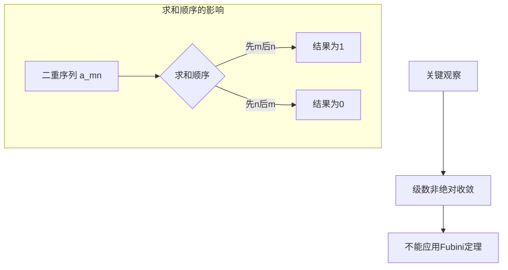
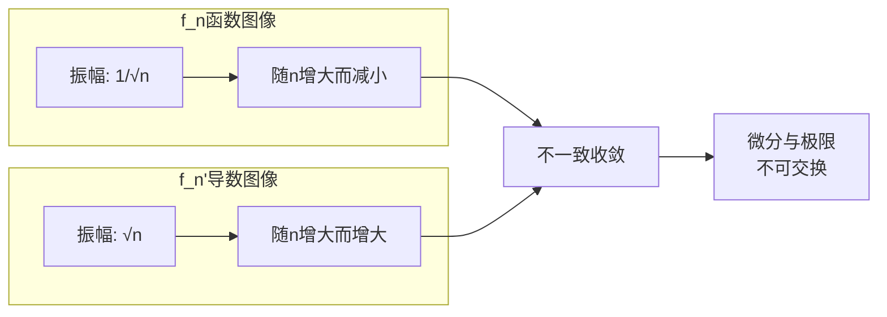
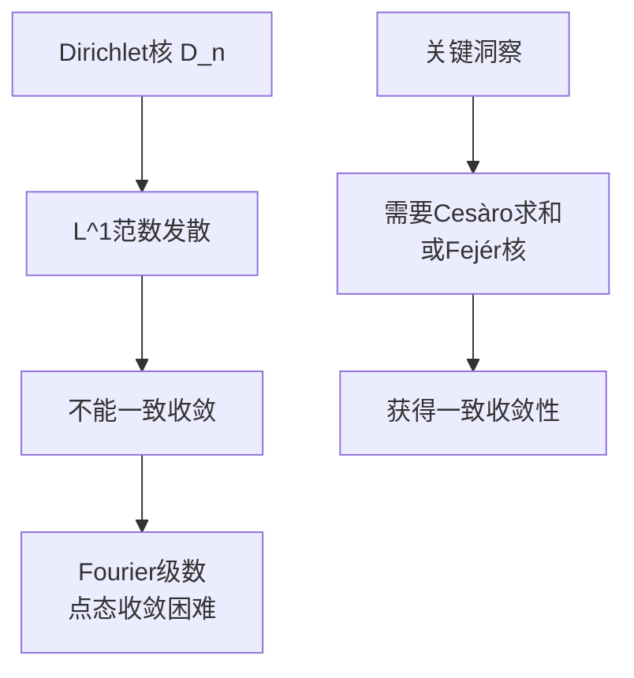
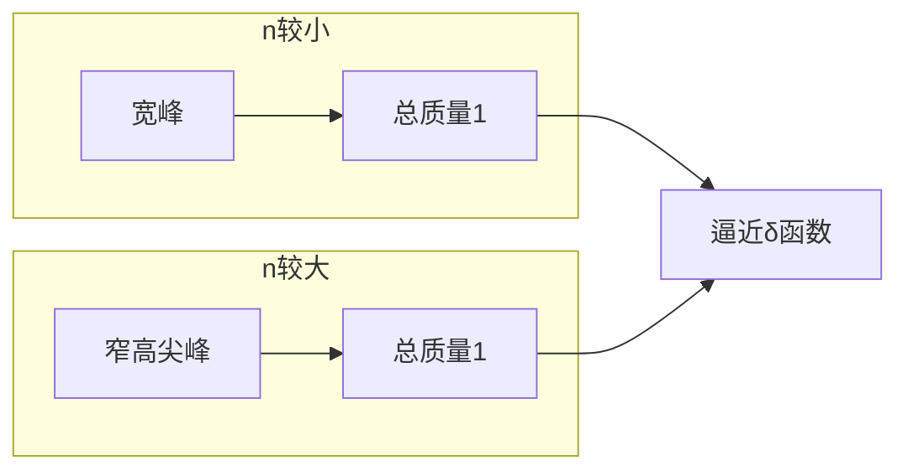
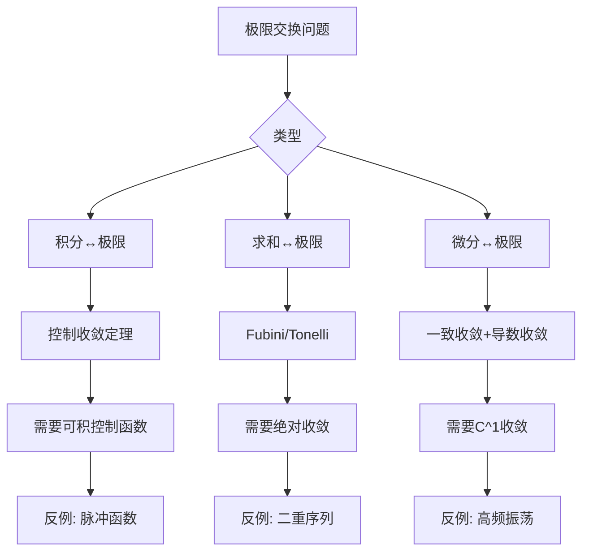

# 极限交换的反例集

## 概述

在分析学中，极限运算的交换性是一个核心问题。许多经典定理（如控制收敛定理、单调收敛定理）给出了极限交换的充分条件。本节通过一系列精心构造的反例，揭示**无条件交换极限的危险性**，帮助读者深入理解各种收敛条件的必要性。

---

## 反例1：积分与极限不可交换

### 经典反例：移动的"脉冲"

**构造**：定义函数序列 $f_n: [0,1] \to \mathbb{R}$

$$f_n(x) = \begin{cases} n & x \in [0, \frac{1}{n}] \\ 0 & x \in (\frac{1}{n}, 1] \end{cases}$$

### 验证

**逐点收敛**：对任意固定的 $x \in (0, 1]$，当 $n > \frac{1}{x}$ 时，$f_n(x) = 0$。

因此 $\displaystyle \lim_{n \to \infty} f_n(x) = 0$ 对所有 $x \in [0,1]$ 成立。

**积分行为**：

- 对每个 $n$：$\displaystyle \int_0^1 f_n(x)\, dx = n \cdot \frac{1}{n} = 1$
- 极限函数：$\displaystyle \int_0^1 \lim_{n \to \infty} f_n(x)\, dx = \int_0^1 0\, dx = 0$

**结论**：
$$\lim_{n \to \infty} \int_0^1 f_n(x)\, dx = 1 \neq 0 = \int_0^1 \lim_{n \to \infty} f_n(x)\, dx$$

### 直观解释

想象一个高度不断增加、宽度不断减小的矩形脉冲。虽然脉冲最终"消失"（逐点趋于0），但其"面积"始终保持为1。这类似于物理中的Dirac δ函数概念。

```mermaid
graph LR
    subgraph n=2
    A1[高度: 2] --> B1[宽度: 0.5]
    B1 --> C1[面积: 1]
    end

    subgraph n=5
    A2[高度: 5] --> B2[宽度: 0.2]
    B2 --> C2[面积: 1]
    end

    subgraph n=10
    A3[高度: 10] --> B3[宽度: 0.1]
    B3 --> C3[面积: 1]
    end

    C1 --> D["极限: 高度→∞<br/>宽度→0<br/>面积保持1"]
    C2 --> D
    C3 --> D
```

### 教学价值

- **说明控制收敛定理中控制函数的必要性**：此例中不存在可积的控制函数
- **与L^p收敛的关系**：$f_n \not\to 0$ 在 $L^1$ 中，尽管逐点收敛

---

## 反例2：求和与极限不可交换

### 经典反例：二重序列的陷阱

**构造**：定义二重序列

$$a_{mn} = \frac{m}{m+n} - \frac{m-1}{m+n-1}, \quad m, n \geq 1$$

### 验证

**先对m求和**：
$$\sum_{m=1}^{M} a_{mn} = \frac{M}{M+n} \xrightarrow{M \to \infty} 1$$

因此 $\displaystyle \sum_{m=1}^{\infty} a_{mn} = 1$ 对所有 $n$ 成立。

**先对n求和**：
$$\sum_{n=1}^{N} a_{mn} = \frac{m}{m+1} - \frac{m}{m+N} \xrightarrow{N \to \infty} \frac{m}{m+1}$$

因此 $\displaystyle \sum_{n=1}^{\infty} a_{mn} = \frac{m}{m+1} \to 0$ 当 $m \to \infty$。

**结论**：
$$\sum_{n=1}^{\infty} \sum_{m=1}^{\infty} a_{mn} = 1 \neq 0 = \sum_{m=1}^{\infty} \sum_{n=1}^{\infty} a_{mn}$$

### 直观解释

这个构造展示了"望远镜求和"在不同顺序下的非对称性。固定 $n$ 时，$m$ 方向的求和累积了所有"质量"；而固定 $m$ 时，$n$ 方向的求和使质量"泄漏"到无穷远。



### 教学价值

- **Fubini定理条件的重要性**：需要绝对收敛或正项级数条件
- **条件收敛级数的敏感性**：重排和求和顺序的影响

---

## 反例3：微分与极限不可交换

### 经典反例：振荡逼近

**构造**：定义函数序列 $f_n: \mathbb{R} \to \mathbb{R}$

$$f_n(x) = \frac{\sin(nx)}{\sqrt{n}}$$

### 验证

**一致收敛**：
$$|f_n(x)| \leq \frac{1}{\sqrt{n}} \to 0 \quad \text{一致地}$$

所以 $f_n \rightrightarrows 0$（一致收敛到0）。

**导数行为**：
$$f_n'(x) = \sqrt{n} \cos(nx)$$

在 $x = 0$ 处：$f_n'(0) = \sqrt{n} \to \infty$

**结论**：
$$\left(\lim_{n \to \infty} f_n\right)'(0) = 0 \neq \infty = \lim_{n \to \infty} f_n'(0)$$

### 直观解释

函数序列以高度递减的方式振荡，看似趋于平坦。但导数衡量的是变化率，高频振荡即使振幅减小，其变化率反而增大。



### 教学价值

- **一致收敛的不足**：函数的一致收敛不保证导数收敛
- **需要更高阶的收敛条件**：如 $C^1$ 收敛（函数与导数都一致收敛）

---

## 反例4：一致收敛的必要性——Dirichlet核

### 经典反例：Fourier级数的部分和

**构造**：Dirichlet核

$$D_n(x) = \sum_{k=-n}^{n} e^{ikx} = \frac{\sin\left((n+\frac{1}{2})x\right)}{\sin(x/2)}$$

### 验证

**积分性质**：
$$\frac{1}{2\pi} \int_{-\pi}^{\pi} D_n(x)\, dx = 1$$

**L^1范数发散**：
$$\|D_n\|_{L^1} = \frac{1}{2\pi} \int_{-\pi}^{\pi} |D_n(x)|\, dx \sim \frac{4}{\pi^2} \log n \to \infty$$

**与一致收敛的关系**：
若三角多项式序列 $P_n \rightrightarrows f$，则必须有 $\|P_n\|_{L^1}$ 有界。Dirichlet核不满足此条件。

### 直观解释

Dirichlet核展示了"吉布斯现象"的数学本质。高频振荡在局部积累，导致积分控制失效。



### 教学价值

- **Fourier分析的深层困难**：解释了为什么需要各种求和法
- **泛函分析视角**：一致有界原理的应用

---

## 反例5：广义积分与极限交换

### 经典反例：Gauss核的退化

**构造**：定义

$$f_n(x) = \frac{n}{\sqrt{\pi}} e^{-n^2 x^2}$$

### 验证

**逐点收敛**：

- 当 $x \neq 0$：$f_n(x) \to 0$
- 当 $x = 0$：$f_n(0) = \frac{n}{\sqrt{\pi}} \to \infty$

**广义积分**：
$$\int_{-\infty}^{\infty} f_n(x)\, dx = 1 \quad \text{对所有 } n$$

**与极限交换**：
$$\lim_{n \to \infty} \int_{-\infty}^{\infty} f_n(x)\, dx = 1$$
$$\int_{-\infty}^{\infty} \lim_{n \to \infty} f_n(x)\, dx = 0$$

### 直观解释

这是一个逼近Dirac δ函数的序列。"质量"越来越集中于原点，形成无穷高的尖峰。



### 教学价值

- **分布理论的动机**：经典函数框架的局限性
- **物理应用**：点源、脉冲响应的数学描述

---

## 反例6：Moore-Osgood定理的条件

### 背景

Moore-Osgood定理指出：若 $f_n \rightrightarrows f$（一致收敛）且对每个 $n$，$\displaystyle \lim_{x \to a} f_n(x)$ 存在，则

$$\lim_{x \to a} \lim_{n \to \infty} f_n(x) = \lim_{n \to \infty} \lim_{x \to a} f_n(x)$$

### 反例构造：去掉一致收敛

**构造**：$f_n(x) = x^n$ 在 $[0, 1]$ 上

### 验证

**逐点极限**：
$$f(x) = \lim_{n \to \infty} f_n(x) = \begin{cases} 0 & x \in [0, 1) \\ 1 & x = 1 \end{cases}$$

**极限顺序**：

- 先 $n$ 后 $x$：$\displaystyle \lim_{x \to 1^-} \lim_{n \to \infty} x^n = \lim_{x \to 1^-} 0 = 0$
- 先 $x$ 后 $n$：$\displaystyle \lim_{n \to \infty} \lim_{x \to 1^-} x^n = \lim_{n \to \infty} 1 = 1$

**结论**：$0 \neq 1$

### 教学价值

- **一致收敛是最优条件**：展示了为什么一致收敛不可或缺
- **与连续性定理的联系**：一致收敛保连续性

---

## 反例7：弱收敛 vs 强收敛的积分交换

### 构造：Rademacher函数

**定义**：$r_n(x) = \text{sgn}(\sin(2^n \pi x))$ 在 $[0, 1]$ 上

### 验证

**弱收敛**：对任意 $g \in L^2[0,1]$，
$$\int_0^1 r_n(x) g(x)\, dx \to 0$$

即 $r_n \rightharpoonup 0$（弱收敛到0）。

**积分与极限**：
$$\lim_{n \to \infty} \int_0^1 r_n(x) \cdot 1\, dx = 0 = \int_0^1 0 \cdot 1\, dx$$

此处恰好相等，但对于乘积：
$$\int_0^1 r_n(x)^2\, dx = 1 \not\to 0$$

### 教学价值

- **弱收敛的微妙性**：$r_n \rightharpoonup 0$ 但 $\|r_n\| = 1$
- **积分交换的脆弱性**：需要强收敛保证一般情况下的交换性

---

## 综合图示：极限交换的条件体系



---

## 练习题目

### 基础练习

**练习1**：构造一个函数序列 $f_n$ 使得

- $f_n \to 0$ 在 $L^1[0,1]$ 中
- 但 $f_n(x) \not\to 0$ 对任意 $x \in [0,1]$（处处不收敛）

<details>
<summary>提示</summary>
考虑移动的"游荡脉冲"，让每个点被无限次覆盖。
</details>

**练习2**：证明若 $f_n \rightrightarrows f$ 且每个 $f_n$ 连续，则
$$\lim_{n \to \infty} \int_a^b f_n(x)\, dx = \int_a^b f(x)\, dx$$

### 进阶练习

**练习3**：构造反例说明：即使 $f_n \to f$ 在 $L^\infty$ 中（本质上确界范数），也可能有
$$\int_{-\infty}^{\infty} f_n(x)\, dx \not\to \int_{-\infty}^{\infty} f(x)\, dx$$

**练习4**（挑战）：证明存在多项式序列 $P_n$ 使得

- $P_n(x) \to 0$ 对所有 $x \in \mathbb{R}$
- 但 $P_n'(0) \to \infty$

### 思考讨论

1. **控制收敛定理中"控制函数可积"条件的必要性**：如果去掉这一条件，你能构造出反例吗？

2. **单调收敛定理 vs 控制收敛定理**：在什么情况下前者更适用？能否用后者证明前者？

3. **分布理论视角**：如何从广义函数的角度理解Dirac δ型序列的极限行为？

---

## 参考文献

1. Rudin, W. *Principles of Mathematical Analysis*, Chapter 7
2. Royden, H.L. & Fitzpatrick, P.M. *Real Analysis*, Chapter 4-5
3. Folland, G.B. *Real Analysis: Modern Techniques and Their Applications*, Chapter 2
4. 夏道行, 吴卓人, 严绍宗, 舒五昌. *实变函数论与泛函分析*
