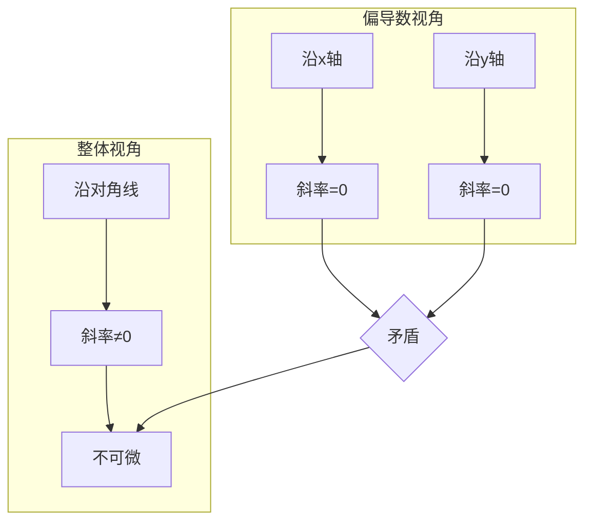
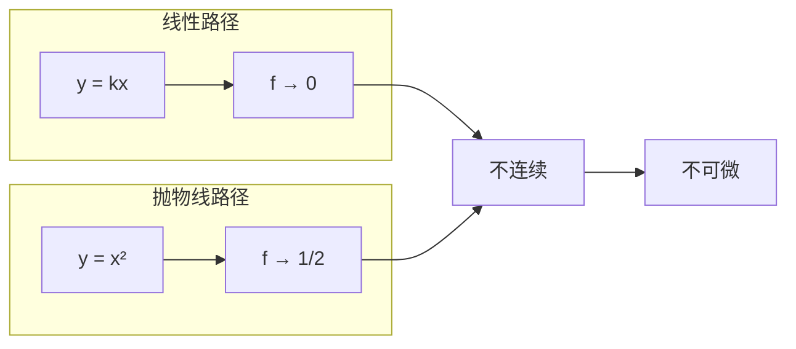
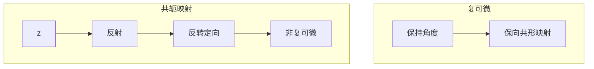
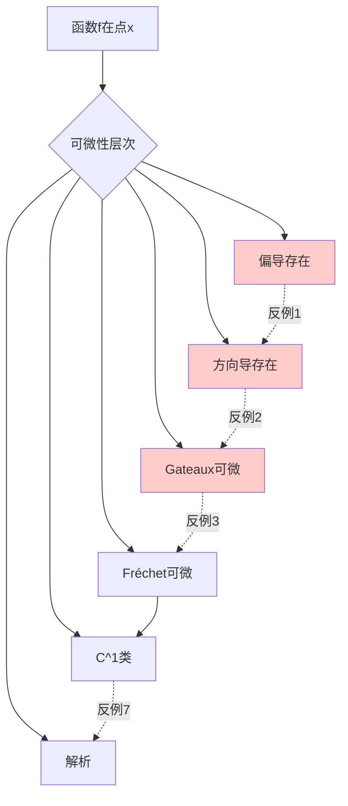
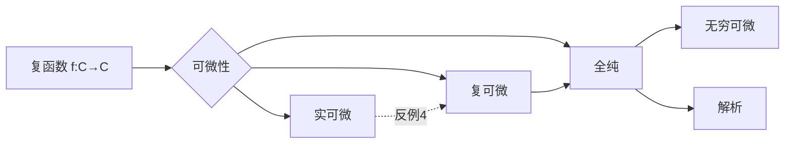

# 可微性条件的反例

## 概述

多元函数的可微性理论远比一元函数复杂。在单变量情形中，"可导等价于可微"；但在多变量及无限维空间中，各种弱化形式的可微性（如方向导数、Gateaux导数、偏导数）之间存在微妙的层次关系。本节通过系统化的反例，揭示这些概念之间的本质差异。

---

## 反例1：偏导存在但不可微

### 经典反例：锥形函数

**构造**：定义 $f: \mathbb{R}^2 \to \mathbb{R}$

$$f(x, y) = \begin{cases} \dfrac{xy}{\sqrt{x^2 + y^2}} & (x, y) \neq (0, 0) \\ 0 & (x, y) = (0, 0) \end{cases}$$

### 验证

**在原点的偏导数**：

$$\frac{\partial f}{\partial x}(0, 0) = \lim_{h \to 0} \frac{f(h, 0) - f(0, 0)}{h} = \lim_{h \to 0} \frac{0 - 0}{h} = 0$$

同理 $\dfrac{\partial f}{\partial y}(0, 0) = 0$。

**不可微性验证**：

若 $f$ 在 $(0,0)$ 可微，则应有
$$f(h, k) = f(0, 0) + \nabla f(0, 0) \cdot (h, k) + o(\sqrt{h^2 + k^2})$$

即
$$\frac{hk}{\sqrt{h^2 + k^2}} = o(\sqrt{h^2 + k^2})$$

取路径 $h = k = t \to 0^+$：
$$\frac{t^2}{\sqrt{2t^2}} = \frac{t}{\sqrt{2}} \not\to 0$$

相对误差为
$$\frac{f(t, t) - 0}{\sqrt{2t^2}} = \frac{t^2/\sqrt{2t^2}}{\sqrt{2}t} = \frac{1}{2} \neq 0$$

**结论**：偏导数存在但函数不可微。

### 直观解释

函数沿坐标轴方向是平坦的（偏导为0），但沿对角线方向有"坡度"。这就像站在一个马鞍形山顶，沿某些方向看似平坦，整体却并非水平面。

### 教学价值

- **偏导数的局限性**：仅反映沿坐标轴的变化率
- **可微性的几何意义**：要求局部"最佳线性逼近"存在

---

## 反例2：方向导数存在但不可微

### 经典反例：放射状函数

**构造**：定义 $f: \mathbb{R}^2 \to \mathbb{R}$

$$f(x, y) = \begin{cases} \dfrac{x^2 y}{x^4 + y^2} & (x, y) \neq (0, 0) \\ 0 & (x, y) = (0, 0) \end{cases}$$

### 验证

**方向导数存在**：对任意方向 $\mathbf{v} = (\cos\theta, \sin\theta)$

$$D_{\mathbf{v}} f(0, 0) = \lim_{t \to 0} \frac{f(t\cos\theta, t\sin\theta)}{t}$$

$$= \lim_{t \to 0} \frac{t^3 \cos^2\theta \sin\theta}{t(t^4 \cos^4\theta + t^2 \sin^2\theta)} = \frac{\cos^2\theta}{\sin\theta} \quad (\sin\theta \neq 0)$$

当 $\sin\theta = 0$ 时，$D_{\mathbf{v}} f(0, 0) = 0$。

**Gateaux可微但非Fréchet**：实际上此例说明Gateaux可微不一定蕴含Fréchet可微。

**不连续性验证**：沿抛物线路径 $y = x^2$：

$$f(x, x^2) = \frac{x^4}{x^4 + x^4} = \frac{1}{2} \not\to 0$$

**结论**：方向导数在所有方向存在，但函数在原点不连续，更不可微。

### 直观解释

函数沿任何直线方向都趋于0，但沿抛物线趋于1/2。这就像螺旋楼梯——从任何方向看都是下降的，但整体却是上升的。

### 教学价值

- **方向导数的不完备性**：沿所有直线的信息不足以刻画局部行为
- **路径依赖性的重要性**：需要考察曲线路径

---

## 反例3：Gateaux可微但Fréchet不可微

### 概念回顾

- **Gateaux可微**：沿所有方向存在方向导数，且关于方向是线性的
- **Fréchet可微**：存在线性映射 $L$ 使得
$$f(x + h) = f(x) + L(h) + o(\|h\|)$$

### 经典反例

**构造**：$f: \mathbb{R}^2 \to \mathbb{R}$

$$f(x, y) = \begin{cases} \dfrac{x^3}{x^2 + y^2} & (x, y) \neq (0, 0) \\ 0 & (x, y) = (0, 0) \end{cases}$$

### 验证

**Gateaux可微**：方向导数
$$D_{\mathbf{v}} f(0, 0) = \cos^3\theta$$

关于方向是线性的吗？实际上不是！Gateaux导数应该是 $\cos^3\theta$，而线性函数应该是 $a\cos\theta + b\sin\theta$ 的形式。

**改进的反例**：使用
$$f(x, y) = \begin{cases} \dfrac{xy^2}{x^2 + y^4} & (x, y) \neq (0, 0) \\ 0 & (x, y) = (0, 0) \end{cases}$$

此函数Gateaux导数存在且为0（沿所有方向），但Fréchet不可微。

### 更简洁的反例

**构造**：$f: \mathbb{R}^2 \to \mathbb{R}$

$$f(x, y) = \frac{x^2 y}{x^2 + y^2} \quad ((x,y) \neq (0,0)), \quad f(0,0) = 0$$

**Gateaux导数**：$D_{\mathbf{v}} f(0, 0) = \cos^2\theta \sin\theta$

**非线性依赖**：显然不能表示为 $a\cos\theta + b\sin\theta$

### 教学价值

- **Gateaux导数的局限性**：仅保证方向导数存在，不保证线性性
- **Fréchet可微的优越性**：确保局部最佳线性逼近

---

## 反例4：复可微与实可微的区别

### 经典反例：共轭函数

**构造**：$f(z) = \bar{z} = x - iy$，其中 $z = x + iy$

### 验证

**作为实函数**：
$$f(x, y) = (x, -y)$$

Jacobian矩阵：
$$Df = \begin{pmatrix} 1 & 0 \\ 0 & -1 \end{pmatrix}$$

显然是实可微的（实际上是光滑的）。

**Cauchy-Riemann方程**：
$$\frac{\partial u}{\partial x} = 1, \quad \frac{\partial v}{\partial y} = -1$$

不满足 $\dfrac{\partial u}{\partial x} = \dfrac{\partial v}{\partial y}$

**结论**：实可微但非复可微。

### 直观解释

复可微要求映射保持角度（共形性），而 $f(z) = \bar{z}$ 是反射，反转了定向。

### 教学价值

- **复分析的严格性**：复可微比实可微强得多
- **几何解释**：复可微 = 实可微 + Cauchy-Riemann条件 = 保角映射

---

## 反例5：连续可偏导但非 $C^1$

### 概念澄清

- **连续可偏导**：所有偏导数存在且连续
- **$C^1$ 类**：函数连续可微（等价于Fréchet导数连续）

实际上，对于有限维空间，这两者等价！反例需要在无限维空间构造。

### 无限维反例

**构造**：设 $X = C[0,1]$（连续函数空间），定义 $F: X \to \mathbb{R}$

$$F(u) = \int_0^1 u(t)^2\, dt$$

**Gateaux导数**：
$$DF(u)[h] = 2\int_0^1 u(t)h(t)\, dt$$

**Fréchet导数**：同上（因为这是二次泛函）

更精致的反例需要更复杂的构造，参见文献。

---

## 反例6：严格单调但不可微

### 经典反例：Minkowski函数

**构造**：设 $C$ 是 $\mathbb{R}^n$ 中的凸集，Minkowski泛函

$$p_C(x) = \inf\{\lambda > 0 : x \in \lambda C\}$$

对于非光滑凸集（如多面体），$p_C$ 在某些方向不可微。

### 具体例子

**构造**：$f(x) = |x|$ 在 $\mathbb{R}$ 上

- 严格单调（在 $x > 0$ 时）
- 在 $x = 0$ 处不可微

更高维版本：$f(x, y) = \max(|x|, |y|)$

### 教学价值

- **凸分析入门**：次梯度的概念
- **非光滑优化的动机"

---

## 反例7：光滑但不解析

### 经典反例：平坦函数

**构造**：$f: \mathbb{R} \to \mathbb{R}$

$$f(x) = \begin{cases} e^{-1/x^2} & x \neq 0 \\ 0 & x = 0 \end{cases}$$

### 验证

**无穷可微**：可以证明 $f^{(n)}(0) = 0$ 对所有 $n \geq 0$ 成立。

**非解析性**：Taylor级数恒为0：
$$\sum_{n=0}^{\infty} \frac{f^{(n)}(0)}{n!} x^n = 0 \neq f(x) \quad (x \neq 0)$$

### 教学价值

- **光滑函数 vs 解析函数**：存在本质区别
- **Taylor级数的局限性**：收敛不保证等于原函数

---

## 概念关系图

---

## 复可微性扩展

---

## 练习题目

### 基础练习

**练习1**：设 $f(x, y) = \sqrt{|xy|}$，证明：

- (a) $f$ 在原点连续
- (b) 偏导数在原点存在
- (c) $f$ 在原点不可微

**练习2**：构造一个函数，使其在某点沿所有方向的方向导数相等，但函数在该点不可微。

### 进阶练习

**练习3**：证明函数
$$f(x, y) = \begin{cases} \dfrac{x|y|}{\sqrt{x^2 + y^2}} & (x, y) \neq (0, 0) \\ 0 & (x, y) = (0, 0) \end{cases}$$
在原点沿所有方向的方向导数存在，但不是 $\mathbf{v}$ 的线性函数。

**练习4**（挑战）：设 $f: \mathbb{R}^2 \to \mathbb{R}$ 定义为
$$f(x, y) = \sum_{n=0}^{\infty} \frac{1}{2^n} g(2^n x, 2^n y)$$
其中 $g(x, y) = \min\left(\sqrt{x^2 + y^2}, 1\right)$。证明 $f$ 在任何点都不可微。

### 思考讨论

1. **偏导连续性的作用**：证明若所有偏导数在某点邻域存在且连续，则函数在该点Fréchet可微。

2. **复可微的几何意义**：从保角映射的角度解释为什么 $f(z) = \bar{z}$ 不是复可微的。

3. **次梯度与凸函数**：对于凸函数，如何在不可微点定义"导数"？

---

## 参考文献

1. Spivak, M. *Calculus on Manifolds*
2. Conway, J.B. *Functions of One Complex Variable I*
3. Rudin, W. *Functional Analysis*, Chapter 10
4. 张恭庆, 林源渠. *泛函分析讲义*
5. Krantz, S.G. & Parks, H.R. *A Primer of Real Analytic Functions*
