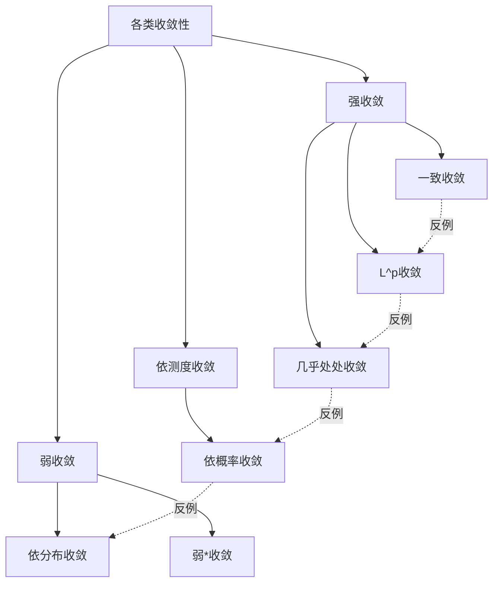
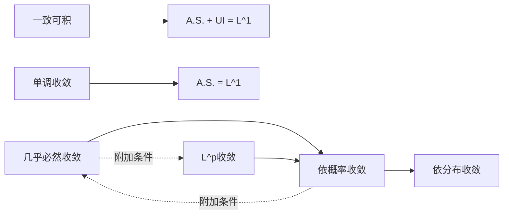

# 收敛性反例大全

## 概述

在分析学、概率论和泛函分析中，存在多种意义下的"收敛"概念。这些收敛性之间存在严格的层次关系，但并非总是等价。本节系统整理各类收敛性之间的反例关系，构建完整的"收敛性格"，帮助读者理解不同收敛条件的微妙差异。

---

## 预备知识：收敛性关系图



---

## 反例1：处处收敛但非一致收敛

### 经典反例：滑动脉冲

**构造**：$f_n(x) = x^n$ 在 $[0, 1]$ 上

### 验证

**逐点极限**：
$$f(x) = \begin{cases} 0 & x \in [0, 1) \\ 1 & x = 1 \end{cases}$$

**非一致收敛**：
$$\sup_{x \in [0,1]} |f_n(x) - f(x)| = 1 \not\to 0$$

实际上，$\sup_{x \in [0,1)} x^n = 1$ 对所有 $n$ 成立。

### 教学价值

- **Dini定理的条件**：紧集 + 连续 + 单调，三者缺一不可
- **极限函数的连续性**：一致收敛保连续性，逐点收敛不保

---

## 反例2：几乎处处收敛但非 $L^1$ 收敛

### 经典反例：消失的脉冲（重访）

**构造**：$f_n(x) = n \cdot \chi_{[0, 1/n]}(x)$ 在 $[0, 1]$ 上

### 验证

**几乎处处收敛**：

- 对 $x \in (0, 1]$，当 $n > 1/x$ 时 $f_n(x) = 0$
- 故 $f_n \to 0$ a.e.

**非 $L^1$ 收敛**：
$$\|f_n - 0\|_{L^1} = \int_0^1 f_n(x)\, dx = 1 \not\to 0$$

### 变体：无界支撑

**构造**：$f_n(x) = \chi_{[n, n+1]}(x)$

- $f_n \to 0$ 处处
- $\|f_n\|_{L^1} = 1 \not\to 0$
- $\|f_n\|_{L^p} = 1$ 对所有 $p \geq 1$

### 教学价值

- **控制收敛定理的必要性**：解释了为什么需要可积控制函数
- **Fatou引理**：$\int \liminf f_n \leq \liminf \int f_n$，严格不等式可能成立

---

## 反例3：$L^p$ 收敛但不几乎处处收敛

### 经典反例：游荡脉冲

**构造**：在 $[0, 1]$ 上，将区间划分为 $2^k$ 等份，定义

$$f_n(x) = \chi_{[\frac{n-2^k}{2^k}, \frac{n-2^k+1}{2^k}]}$$

其中 $2^k \leq n < 2^{k+1}$。

### 验证

**$L^p$ 收敛**：
$$\|f_n\|_{L^p} = \left(\frac{1}{2^k}\right)^{1/p} \to 0$$

**非几乎处处收敛**：
对任意 $x \in [0, 1]$，存在无穷多个 $n$ 使得 $f_n(x) = 1$，也有无穷多个 $n$ 使得 $f_n(x) = 0$。

故 $\lim_{n \to \infty} f_n(x)$ 不存在。

### 教学价值

- **$L^p$ 收敛的本质**：依测度收敛 + 一致可积性
- **子列原理**：$L^p$ 收敛蕴含存在几乎处处收敛的子列

---

## 反例4：弱收敛但不强收敛

### 经典反例：Rademacher函数（再探）

**构造**：$r_n(x) = \text{sgn}(\sin(2^n \pi x))$

### 验证

**在 $L^2[0,1]$ 中的弱收敛**：

对任意 $g \in L^2[0,1]$，
$$\int_0^1 r_n(x) g(x)\, dx \to 0$$

这是因为 $\{r_n\}$ 构成正交系，且 $\|r_n\|_{L^2} = 1$。

**非强收敛**：
$$\|r_n - 0\|_{L^2} = 1 \not\to 0$$

### Hilbert空间版本

**构造**：标准正交基 $\{e_n\}$ 在 $\ell^2$ 中

- $e_n \rightharpoonup 0$（弱收敛到0）
- $\|e_n\| = 1 \not\to 0$

### 教学价值

- **弱紧性的重要性**：有界序列必有弱收敛子列（自反空间）
- **强收敛的刻画**：弱收敛 + 范数收敛 = 强收敛

---

## 反例5：依概率收敛但不几乎必然收敛

### 经典反例：独立指示变量

**构造**：设 $\{X_n\}$ 是独立随机变量，

$$P(X_n = 1) = \frac{1}{n}, \quad P(X_n = 0) = 1 - \frac{1}{n}$$

### 验证

**依概率收敛到0**：
$$P(|X_n - 0| > \epsilon) = P(X_n = 1) = \frac{1}{n} \to 0$$

**非几乎必然收敛**：

由Borel-Cantelli引理，因为 $\sum \frac{1}{n} = \infty$ 且变量独立，

$$P(X_n = 1 \text{ i.o.}) = 1$$

故 $X_n \not\to 0$ a.s.

### 教学价值

- **Borel-Cantelli引理的应用**：区分收敛的强弱
- **概率论中的收敛层次**：
  $$X_n \xrightarrow{a.s.} X \Rightarrow X_n \xrightarrow{P} X \Rightarrow X_n \xrightarrow{d} X$$

---

## 反例6：依分布收敛但不依概率收敛

### 经典反例：对称随机变量

**构造**：设 $X$ 是对称随机变量（如 $X \sim N(0,1)$），令 $X_n = (-1)^n X$。

### 验证

**依分布收敛**：
所有 $X_n$ 都与 $X$ 同分布，故 $X_n \xrightarrow{d} X$。

**不依概率收敛**：
若 $n$ 为偶数，$X_n = X$；若 $n$ 为奇数，$X_n = -X$。

$$P(|X_n - X| > \epsilon) = P(|(-1)^n X - X| > \epsilon)$$

当 $n$ 为奇数时，这等于 $P(|2X| > \epsilon) \not\to 0$。

### 教学价值

- **依分布收敛的弱点**：不关心随机变量的相关性
- **Slutsky定理的条件**：需要额外条件才能进行运算

---

## 反例7：几乎必然收敛但非 $L^p$ 收敛

### 经典反例：爆炸性增长

**构造**：$X_n = n \cdot \chi_{[0, 1/n]}$ 在 $[0, 1]$ 上（带Lebesgue测度）

### 验证

**几乎必然收敛**：
$X_n \to 0$ a.s.（同反例2）

**非 $L^p$ 收敛**：
$$E[|X_n|^p] = n^p \cdot \frac{1}{n} = n^{p-1} \to \infty \quad (p > 1)$$

$$E[|X_n|] = 1 \not\to 0$$

### 教学价值

- **一致可积性的重要性**：几乎必然收敛 + 一致可积 = $L^1$ 收敛
- **Vitali收敛定理**：给出了几乎必然收敛到 $L^p$ 收敛的条件

---

## 反例8：$L^p$ 收敛但非 $L^q$ 收敛（$p < q$）

### 经典反例：积分奇性

**构造**：在 $(0, 1]$ 上，$f_n(x) = x^{-1/2} \chi_{[1/n, 1]}(x)$

### 验证

**$L^1$ 收敛**：
$$f_n \to x^{-1/2} \text{ in } L^1$$

实际上，设 $f(x) = x^{-1/2}$：
$$\|f_n - f\|_{L^1} = \int_0^{1/n} x^{-1/2}\, dx = 2n^{-1/2} \to 0$$

**非 $L^2$ 收敛**：
$$\|f\|_{L^2}^2 = \int_0^1 x^{-1}\, dx = \infty$$

### 教学价值

- **$L^p$ 空间的包含关系**：有限测度空间中有 $L^q \subset L^p$（$p < q$）
- **无限测度空间**：包含关系反转

---

## 收敛性关系完备图

```mermaid
flowchart TB
    subgraph 最强
    A[一致收敛 a.s.] --> B[一致收敛]
    end

    B --> C[几乎处处收敛]
    B --> D[L^∞收敛]

    C -.->|反例1,2| E[依测度收敛]
    D --> F[L^p收敛 p<∞]

    F -.->|反例3| G[依测度收敛]
    F -.->|反例4| H[弱收敛]

    E --> I[依概率收敛]

    I -.->|反例5| C
    I --> J[依分布收敛]

    J -.->|反例6| I

    H -.->|反例4| F

    C -.->|反例7| F

    K[L^q] -.->|反例8| L[L^p] q>p

    style A fill:#90EE90
    style J fill:#FFB6C1
```

---

## 概率论收敛关系



---

## 练习题目

### 基础练习

**练习1**：构造序列 $\{f_n\}$ 使得

- $f_n \to 0$ 在 $L^p[0,1]$ 中（$1 \leq p < \infty$）
- 但 $f_n \not\to 0$ 在 $L^\infty[0,1]$ 中

**练习2**：设 $\{X_n\}$ 是i.i.d.随机变量，$E[X_1] = \mu$，$\text{Var}(X_1) = \sigma^2 < \infty$。证明：
$$\frac{1}{n} \sum_{k=1}^n X_k \xrightarrow{L^2} \mu$$

### 进阶练习

**练习3**：构造 $f_n: [0,1] \to \mathbb{R}$ 使得

- $f_n \rightharpoonup 0$ 在 $L^2[0,1]$ 中
- $\|f_n\|_{L^2} = 1$ 对所有 $n$
- 但 $f_n$ 不弱*收敛于 $L^\infty$ 中的任何函数

**练习4**（Skorokhod表示定理）：设 $X_n \xrightarrow{d} X$，证明存在概率空间 $(\tilde{\Omega}, \tilde{\mathcal{F}}, \tilde{P})$ 和随机变量 $\tilde{X}_n, \tilde{X}$ 使得

- $\tilde{X}_n \stackrel{d}{=} X_n$，$\tilde{X} \stackrel{d}{=} X$
- $\tilde{X}_n \to \tilde{X}$ a.s.

### 思考讨论

1. **一致可积性的等价条件**：证明对于 $L^1$ 有界序列，以下等价：
   - 一致可积
   - 对任意 $\epsilon > 0$，存在 $M$ 使得 $\sup_n E[|X_n| \cdot \chi_{|X_n| > M}] < \epsilon$
   - $\lim_{M \to \infty} \sup_n E[|X_n| \cdot \chi_{|X_n| > M}] = 0$

2. **Prohorov定理**：紧的测度族与一致胎紧性的关系是什么？

3. **弱收敛的度量**：如何在度量空间中刻画弱收敛？

---

## 总结表

| 收敛类型 | 强于 | 弱于 | 关键反例 |
|---------|------|------|---------|
| 一致收敛 a.s. | - | 一致收敛 | - |
| 一致收敛 | 一致 a.s., $L^\infty$ | 逐点收敛 | $x^n$ on $[0,1]$ |
| 几乎处处 | $L^p$ (有限测度) | 依测度 | 游荡脉冲 |
| $L^p$ | $L^q$ ($q > p$, 有限测度) | 弱收敛 | Rademacher |
| 依测度 | 依概率 | 依分布 | - |
| 弱收敛 | 强收敛 | - | Hilbert基 |

---

## 参考文献

1. Billingsley, P. *Probability and Measure*
2. Brezis, H. *Functional Analysis, Sobolev Spaces and Partial Differential Equations*
3. Durrett, R. *Probability: Theory and Examples*
4. Folland, G.B. *Real Analysis*
5. 严士健, 王隽骧, 刘秀芳. *概率论基础*
