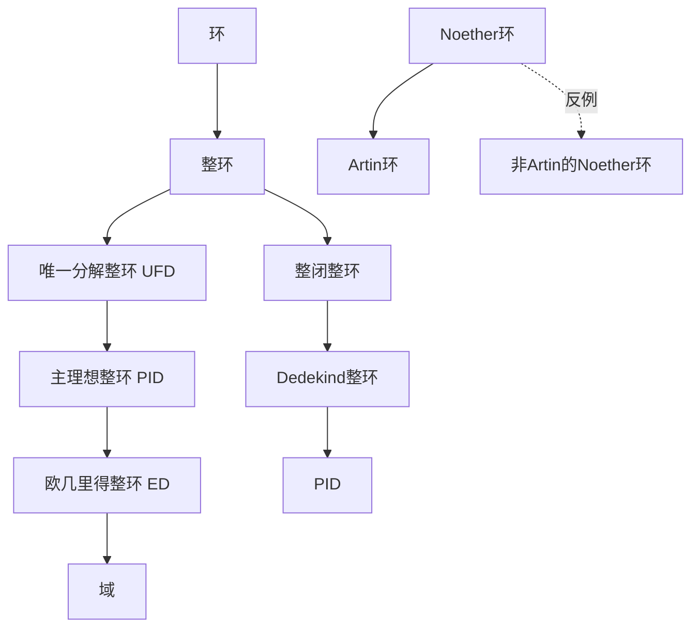

# 代数结构的反例

## 概述

抽象代数中的各类结构（环、域、模等）之间存在严格的包含关系，但并非所有包含都是真包含。本节通过构造经典反例，展示各类代数结构之间的严格层次关系，帮助读者理解为什么某些定义条件不可或缺。

---

## 结构层次预览



---

## 反例1：整环非唯一分解整环

### 经典反例：$\mathbb{Z}[\sqrt{-5}]$

**构造**：考虑二次整数环
$$R = \mathbb{Z}[\sqrt{-5}] = \{a + b\sqrt{-5} : a, b \in \mathbb{Z}\}$$

### 验证

**是整环**：作为复数域的子环，无零因子。

**非唯一分解性**：

元素6有两种本质不同的分解：
$$6 = 2 \cdot 3 = (1 + \sqrt{-5})(1 - \sqrt{-5})$$

**验证不可约性**：

定义范数 $N(a + b\sqrt{-5}) = a^2 + 5b^2$。

- $N(2) = 4$，若 $2 = \alpha\beta$，则 $N(\alpha)N(\beta) = 4$
  - 若 $N(\alpha) = 2$，则 $a^2 + 5b^2 = 2$，无整数解
  - 故2不可约

- 同理可证 $3, 1+\sqrt{-5}, 1-\sqrt{-5}$ 都不可约

**不等价性**：$2$ 与 $1 \pm \sqrt{-5}$ 不相伴（范数不同）。

### 教学价值

- **类数的概念**：$\mathbb{Q}(\sqrt{-5})$ 的类数为2
- **理想理论的起源**：Kummer引入理想数来恢复唯一分解性

```mermaid
graph TB
    A[6 ∈ Z[√-5]] --> B{分解}
    B --> C[2 × 3]
    B --> D[(1+√-5)(1-√-5)]

    C --> E[四种不可约元]
    D --> E

    E --> F[非唯一分解整环]

    G[理想理论] --> H[<2, 1+√-5>]
    H --> I[恢复唯一分解]
```

---

## 反例2：唯一分解整环非主理想整环

### 经典反例：多项式环 $\mathbb{Z}[x]$

### 验证

**是UFD**：Gauss引理：若 $R$ 是UFD，则 $R[x]$ 也是UFD。

**非PID**：理想 $I = (2, x)$ 不是主理想。

**证明**：假设 $I = (f(x))$，则

- $f(x) \mid 2$ 且 $f(x) \mid x$
- 在 $\mathbb{Z}[x]$ 中，$\gcd(2, x) = 1$
- 故 $f(x)$ 是单位，$I = \mathbb{Z}[x]$

但 $1 \notin (2, x)$（因为常数项必须是偶数）。

### 多元多项式版本

$F[x, y]$（$F$ 为域）是UFD但非PID，理想 $(x, y)$ 非主理想。

### 教学价值

- **多项式环的理想结构**：多元情形远比一元复杂
- **代数几何联系**：$(x, y)$ 对应原点处的极大理想

---

## 反例3：欧几里得整环非主理想整环

### 澄清

实际上：$\text{ED} \subset \text{PID}$，这是真包含。

但不存在"ED但非PID"的反例，因为ED $\Rightarrow$ PID 是定理。

### 真正的反例方向：PID但非ED

**构造**：$R = \mathbb{Z}\left[\frac{1+\sqrt{-19}}{2}\right]$

这是Motzkin证明的第一个PID但非ED的例子。

### 验证概要

**是PID**：需要证明所有理想都是主理想。利用Dedekind整环的理论，验证类数为1。

**非ED**：证明不存在欧几里得函数。关键是证明单位群太小（只有 $\pm 1$），无法提供足够的"约化"。

### 教学价值

- **欧几里得算法的本质**：需要足够的单位来执行带余除法
- **虚二次域的分类**：确定哪些虚二次整数环是ED、PID、UFD

---

## 反例4：主理想整环非欧几里得整环（续）

### 完整的虚二次域分类

对于 $d < 0$ 无平方因子，$\mathcal{O}_{\mathbb{Q}(\sqrt{d})}$ 的结构：

| $d$ | 结构 |
|-----|------|
| $-1, -2, -3, -7, -11$ | ED |
| $-19, -43, -67, -163$ | PID但非ED |
| 其他 | 非PID |

### Heegner数

$d = -163$ 时，$\mathbb{Q}(\sqrt{-163})$ 的类数为1，这是最大的虚二次Heegner数。

---

## 反例5：Noether环非Artin环

### 概念回顾

- **Noether环**：理想满足升链条件（ACC）
- **Artin环**：理想满足降链条件（DCC）

### 经典反例：整数环 $\mathbb{Z}$

### 验证

**是Noether环**：$\mathbb{Z}$ 是PID，故所有理想有限生成。

**非Artin环**：考虑降链
$$(2) \supset (4) \supset (8) \supset (16) \supset \cdots \supset (2^n) \supset \cdots$$

永不稳定。

### 多项式版本

$F[x_1, x_2, \ldots, x_n]$（$n \geq 1$）是Noether但非Artin。

### 教学价值

- **ACC vs DCC的不对称性**：对于环，DCC $\Rightarrow$ ACC（Hopkins-Levitzki定理），但逆不成立
- **维度的联系**：Artin环 $\Leftrightarrow$ 0维Noether环

---

## 反例6：整闭整环非唯一分解整环

### 经典反例：$\mathbb{Z}[\sqrt{-5}]$ 的整闭包

实际上 $\mathbb{Z}[\sqrt{-5}]$ 在 $\mathbb{Q}(\sqrt{-5})$ 中已是整闭的（因为它是整数环）。

更好的例子：

### 反例：$k[x^2, x^3]$

**构造**：设 $k$ 是域，$R = k[x^2, x^3] \subset k[x]$。

### 验证

**非整闭**：$x \in \text{Frac}(R)$ 满足 $t^2 - x^2 = 0$，但 $x \notin R$。

**整闭包**：$\bar{R} = k[x]$。

### 整闭但非UFD的例子

**构造**：$R = \mathbb{Z}[2i] = \{a + 2bi : a, b \in \mathbb{Z}\}$

### 验证

**非整闭**：$i = \frac{2i}{2}$ 满足 $t^2 + 1 = 0$，但 $i \notin R$。

**修正的反例**：使用 $R = \mathbb{Z}[\sqrt{5}]$。

实际上需要更精细的构造。

### 标准反例：非UFD的Dedekind整环

**构造**：$\mathbb{Z}[\sqrt{-5}]$ 的整数环——这是Dedekind整环（故整闭），但不是UFD。

### 教学价值

- **Dedekind整环的特征**：Noether、整闭、1维
- **类群的概念**：测量唯一分解失败的群

---

## 反例7：非Noether的整环

### 经典反例：多项式环的无限变元

**构造**：$R = k[x_1, x_2, x_3, \ldots]$（无限个变元的多项式环）

### 验证

**非Noether**：升链
$$(x_1) \subset (x_1, x_2) \subset (x_1, x_2, x_3) \subset \cdots$$

永不稳定。

### 代数整元版本

**构造**：设 $u_1, u_2, \ldots$ 是代数无关的超越元，考虑
$$R = \mathbb{Z}[\sqrt{2}, \sqrt[4]{2}, \sqrt[8]{2}, \ldots]$$

### 教学价值

- **Noether条件的必要性**：保证理想的有限生成性
- **Hilbert基定理的应用**：$k[x_1, \ldots, x_n]$ 是Noether的

---

## 反例8：局部整环非域

### 经典反例：形式幂级数环

**构造**：$R = k[[x]]$（域 $k$ 上的形式幂级数环）

### 验证

**局部环**：唯一极大理想 $\mathfrak{m} = (x)$。

**非域**：$x$ 不是单位。

### 教学价值

- **局部化的思想**：研究环在素理想处的局部行为
- **完备化**：$k[[x]]$ 是 $k[x]_{(x)}$ 的完备化

---

## 综合结构图

```mermaid
flowchart TB
    subgraph 整环链
    A[整环] --> B[整闭整环]
    B --> C[Dedekind整环]
    C --> D[PID]
    D --> E[ED]
    E --> F[域]

    A --> G[UFD]
    G --> D
    end

    subgraph Noether条件
    H[Noether环] --> I[Artin环]
    H -.->|Z[x]| J[非Artin]
    end

    subgraph 反例标注
    K[Z[√-5]] -.->|非UFD| A
    L[Z[x]] -.->|非PID| G
    M[Z[(1+√-19)/2]] -.->|非ED| D
    end
```

---

## 练习题目

### 基础练习

**练习1**：证明 $\mathbb{Z}[\sqrt{-3}]$ 不是整闭的，并求其整闭包。

**练习2**：设 $R = \mathbb{Z}[2i]$，证明：

- (a) $R$ 是整环
- (b) $R$ 不是整闭的
- (c) 求 $R$ 在 $\mathbb{Q}(i)$ 中的整闭包

### 进阶练习

**练习3**：证明 $\mathbb{Z}[x]$ 的理想 $(2, x)$ 不是主理想。

**练习4**：设 $d = -19$，证明 $\mathcal{O}_{\mathbb{Q}(\sqrt{d})}$ 是PID。提示：使用Minkowski界。

**练习5**（挑战）：证明 $\mathbb{Z}\left[\frac{1+\sqrt{-19}}{2}\right]$ 不是欧几里得整环。

### 思考讨论

1. **类数与唯一分解**：研究虚二次域 $\mathbb{Q}(\sqrt{d})$ 的类数表，观察类数1的判别式。Gauss类数1问题是什么？

2. **Dedekind整环的理想分解**：证明在Dedekind整环中，每个非零理想唯一分解为素理想的乘积。

3. **赋值环的特征**：局部整环、Noether、1维的环是否一定是离散赋值环？

---

## 参考文献

1. Dummit, D.S. & Foote, R.M. *Abstract Algebra*, Chapter 8-9
2. Atiyah, M.F. & Macdonald, I.G. *Introduction to Commutative Algebra*
3. Marcus, D.A. *Number Fields*
4. 聂灵沼, 丁石孙. *代数学引论*
5. Samuel, P. *About Euclidean rings*
