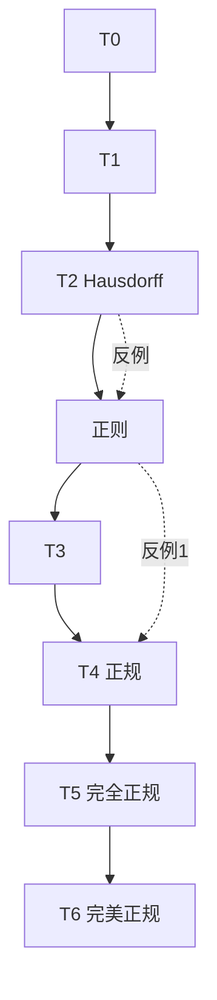
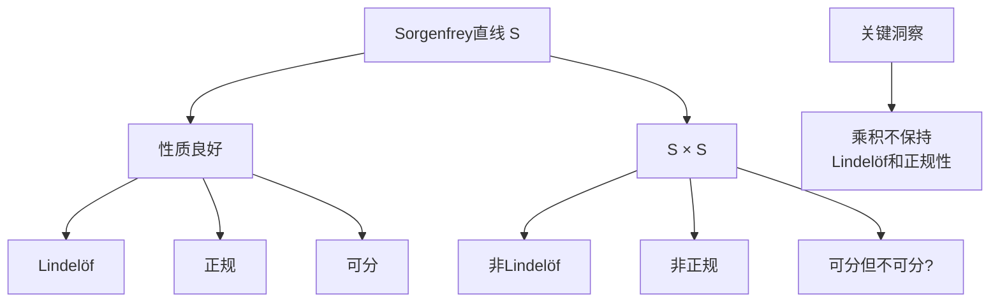
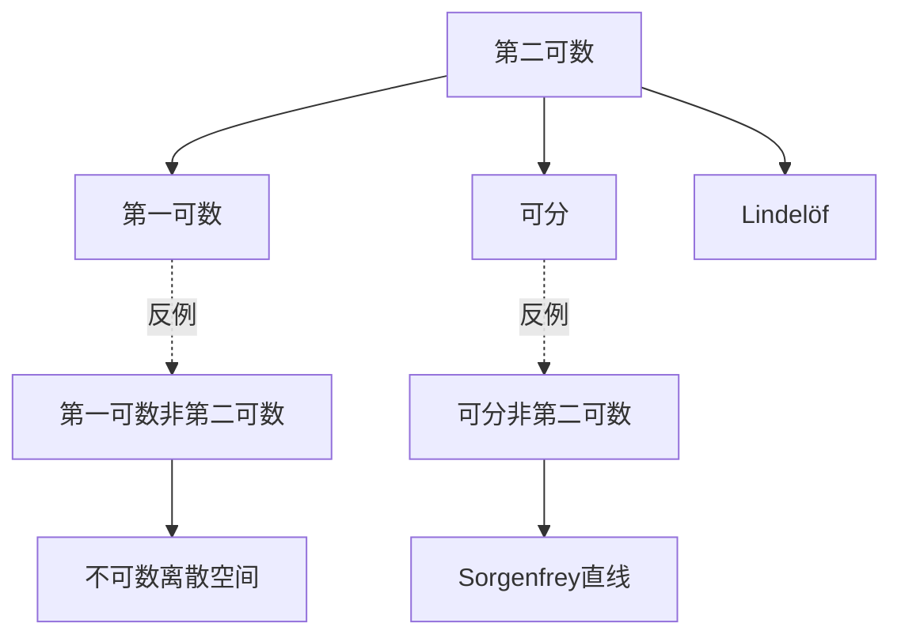
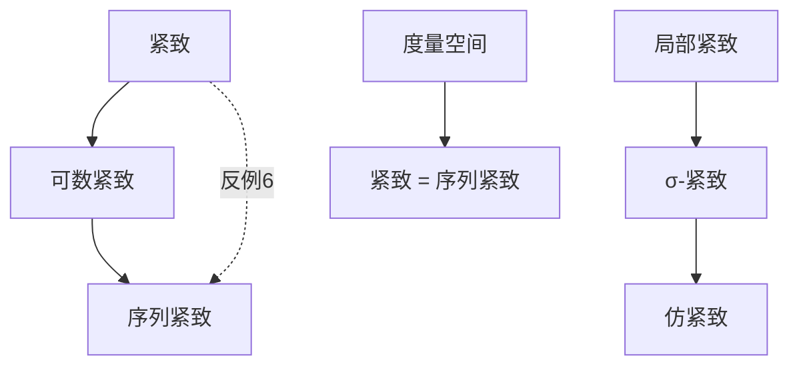

# 拓扑性质反例集

## 概述

拓扑学中存在着丰富的分离性、可数性、紧致性概念。这些概念之间存在严格的蕴含关系，但并非所有蕴含都可逆。本节通过构造经典反例，揭示拓扑性质之间的微妙界限，帮助读者理解各种拓扑条件的精确含义。

---

## 分离公理层次图



---

## 反例1：正则非正规空间

### 经典反例：Sorgenfrey平面

**构造**：设 $\mathbb{S}$ 是Sorgenfrey直线（下限拓扑），考虑 $\mathbb{S} \times \mathbb{S}$。

### Sorgenfrey直线回顾

- 基：$\{[a, b) : a < b, a, b \in \mathbb{R}\}$
- 性质：Lindelöf、第一可数、可分、完全正则、遗传Lindelöf

### 验证

**正则性**：Sorgenfrey直线是完全正则的，故乘积也是正则的。

**非正规性**：考虑子空间
$$L = \{(x, -x) : x \in \mathbb{R}\}$$

这是离散闭子空间，势为 $2^{\aleph_0}$。

假设 $\mathbb{S} \times \mathbb{S}$ 正规，则根据Tietze扩张定理，任何从闭子空间到 $\mathbb{R}$ 的连续函数都可扩张。但 $L$ 上的连续函数空间维数为 $2^{2^{\aleph_0}}$，而整个空间的连续函数空间维数至多为此，产生矛盾。

更初等的证明：设 $A = \{(x, -x) : x \in \mathbb{Q}\}$，$B = \{(x, -x) : x \notin \mathbb{Q}\}$，证明它们不能被开集分离。

### 教学价值

- **乘积拓扑的微妙性**：良好性质在乘积下可能丢失
- **Lindelöf性质的复杂性**：Sorgenfrey平面不是Lindelöf的



---

## 反例2：第一可数非第二可数

### 经典反例：不可数离散空间

**构造**：设 $X$ 是不可数集，赋予离散拓扑。

### 验证

**第一可数**：每点 $x$ 有可数局部基 $\{\{x\}\}$。

**非第二可数**：假设有可数基 $\mathcal{B}$，则每个单点集 $\{x\}$ 必须是某个基元素的并。但 $\{\{x\} : x \in X\}$ 是不可数族，而 $\mathcal{B}$ 可数，矛盾。

### 更微妙的反例：Niemytzki平面

**构造**：上半平面 $\{(x, y) : y \geq 0\}$，其中

- $y > 0$ 的点有通常欧氏邻域
- $y = 0$ 的点（x轴）的邻域是包含该点及上方开圆盘（切于x轴）的集合

### 验证

**第一可数**：每点有可数局部基。

**非第二可数**：x轴是不可数离散子空间，故空间不能第二可数。

### 教学价值

- **第一可数的重要性**：可用序列刻画收敛性
- **第二可数的优越性**：可度量化、Lindelöf、可分

---

## 反例3：局部紧致非紧致

### 经典反例：实直线 $\mathbb{R}$

### 验证

**局部紧致**：每点有紧邻域（如 $[x-1, x+1]$）。

**非紧致**：开覆盖 $\{(n, n+2) : n \in \mathbb{Z}\}$ 没有有限子覆盖。

### 更精致的例子：$\mathbb{R}^n$（$n \geq 1$）

所有有限维欧氏空间都是局部紧致、非紧致的。

### 一维复分析版本

**单位圆盘** $\mathbb{D} = \{z \in \mathbb{C} : |z| < 1\}$

- 局部紧致（开子空间）
- 非紧致（不完备、无界）

### 教学价值

- **一点紧化**：局部紧致Hausdorff空间可一点紧化为紧致Hausdorff空间
- **Alexandroff紧化**：$\mathbb{R}^n$ 的Alexandroff紧化同胚于 $S^n$

---

## 反例4：仿紧致非紧致

### 经典反例：$\mathbb{R}^n$（再访）

### 验证

**仿紧致**：度量空间都是仿紧致的（Stone定理）。

**非紧致**：同反例3。

### 非度量版本：长直线

**构造**（粗略描述）：将不可数多个单位区间 $[0, 1)$ "粘合"起来，长度为 $\omega_1$（第一个不可数序数）。

### 验证

**仿紧致**：长直线是局部紧致、Hausdorff、第一可数的，但不是第二可数的。

实际上标准长直线**不是**仿紧致的。需要修正：

### 修正反例：不可数个紧致空间的乘积

**构造**：$X = \{0, 1\}^{\mathbb{R}}$（不可数个两点离散空间的乘积）

### 验证

**紧致**：Tychonoff定理。

这个例子是紧致的，不是合适的反例。

### 合适的反例：Moore平面

**构造**：Niemytzki平面的推广。

Moore平面（或Niemytzki平面）是局部紧致、第一可数、可分的，但不是正规的。它是仿紧致的吗？

实际上，Moore平面不是仿紧致的（因为非正规）。

### 标准反例：度量空间

所有度量空间都是仿紧致的（Stone, 1948）。任何非紧致的度量空间（如 $\mathbb{R}$、$\ell^2$）都是仿紧致非紧致的例子。

### 教学价值

- **仿紧致的等价刻画**：度量空间、仿紧致 = 可度化的必要条件
- **单位分解的存在性**：仿紧致空间上存在从属于任意开覆盖的单位分解

---

## 反例5：正规非正则空间

### 澄清

实际上：T1 + 正规 $\Rightarrow$ 正则。所以在T1空间中不存在"正规非正则"的反例。

如果不假设T1，可以构造退化例子。

### 真正的反例方向：正则非正规（已讨论）

Sorgenfrey平面是正则非正规的典型例子。

---

## 反例6：紧致非序列紧致

### 经典反例：$\{0, 1\}^{2^{\aleph_0}}$

**构造**：不可数个两点离散空间的乘积。

### 验证

**紧致**：Tychonoff定理。

**非序列紧致**：考虑序列 $\{x_n\}$，其中 $x_n$ 是第 $n$ 个坐标为1、其余为0的元素。这个序列没有收敛子列。

实际上需要更精细的构造。

### 标准例子：$\omega_1 + 1$

**构造**：第一个不可数序数加1，赋予序拓扑。

### 验证

**紧致**：序拓扑中良序集加最大元是紧致的。

**非序列紧致**：考虑序列 $\{n : n < \omega\}$（自然数序列），它在 $\omega_1 + 1$ 中没有收敛子列（极限应为 $\omega$，但 $\omega$ 不是子列的极限）。

更正：序列紧致要求每个序列有收敛子列。在 $\omega_1 + 1$ 中，序列 $\{n\}$ 的极限点是 $\omega$，但子列不收敛于 $\omega_1$。

### 教学价值

- **紧致性的等价形式**：度量空间中紧致 = 序列紧致 = 可数紧致
- **一般拓扑空间的复杂性**：各种紧致性概念不再等价

---

## 反例7：连通非道路连通

### 经典反例：拓扑学家的正弦曲线

**构造**：设
$$S = \left\{\left(x, \sin\frac{1}{x}\right) : 0 < x \leq 1\right\}$$
$$A = \{(0, y) : -1 \leq y \leq 1\}$$
$$X = S \cup A$$

### 验证

**连通性**：$S$ 在 $X$ 中稠密，$\overline{S} = X$，故 $X$ 连通。

**非道路连通**：假设存在道路 $\gamma: [0, 1] \to X$ 从 $(1, \sin 1)$ 到 $(0, 0)$。设 $t_0 = \inf\{t : \gamma(t) \in A\}$，则 $\gamma(t_0)$ 必须在 $A$ 中（因为 $A$ 闭）。但在 $t_0$ 附近，$\gamma$ 必须在 $S$ 中无限振荡，与连续性矛盾。

### 教学价值

- **道路连通与连通的区别**：道路连通是更强的性质
- **闭包的连通性**：连通集的闭包连通

```mermaid
graph TB
    A[拓扑学家的正弦曲线] --> B[S = (x, sin 1/x)]
    A --> C[A = {0} × [-1,1]]

    B --> D[S连通]
    D --> E[S的闭包连通]
    E --> F[X连通]

    B -.->|无限振荡| G[无法道路连接<br/>S与A中的点]

    G --> H[非道路连通]
```

---

## 反例8：可分非第二可数

### 经典反例：Sorgenfrey直线

### 验证

**可分**：$\mathbb{Q}$ 是稠密可数子集。

**非第二可数**：Sorgenfrey直线是Lindelöf的吗？实际上不是。但关键是基不可数。

**证明**：对每个 $x \in \mathbb{R}$，$[x, x+1)$ 是开集。任何基必须包含形如 $[x, x+\epsilon_x)$ 的集合来生成这些开集，故基不可数。

### 教学价值

- **可分的局限性**：可分空间不一定"小"
- **Lindelöf性质**：Sorgenfrey直线不是Lindelöf的

---

## 可数性公理关系图



---

## 紧致性变体关系图



---

## 练习题目

### 基础练习

**练习1**：证明Sorgenfrey直线是Lindelöf的当且仅当它是第二可数的（实际上两者都不成立）。

**练习2**：设 $X$ 是不可数集，赋予余有限拓扑。证明：

- (a) $X$ 是紧致的
- (b) $X$ 不是Hausdorff的
- (c) $X$ 是连通的

**练习3**：证明拓扑学家的正弦曲线是连通的但不是局部连通的。

### 进阶练习

**练习4**：构造一个空间，它是

- 第一可数的
- 可分的
- 但不是第二可数的

**练习5**：证明 $\{0, 1\}^{\mathfrak{c}}$（$\mathfrak{c} = 2^{\aleph_0}$）是紧致但不是序列紧致的。

**练习6**（挑战）：构造一个空间，它是

- 正规
- 第一可数
- 但不可度量化的

提示：使用Moore平面或类似构造。

### 思考讨论

1. **Urysohn度量化定理**：陈述并证明一个拓扑空间可度量化的充分必要条件。

2. **仿紧致空间的乘积**：两个仿紧致空间的乘积是否仿紧致？研究Michael直线的例子。

3. **维度理论**：讨论拓扑维度的各种定义（覆盖维数、归纳维数）及其关系。

---

## 参考文献

1. Munkres, J. *Topology*, 2nd Edition
2. Kelley, J.L. *General Topology*
3. Willard, S. *General Topology*
4. Engelking, R. *General Topology*
5. Steen, L.A. & Seebach, J.A. *Counterexamples in Topology*
6. 熊金城. *点集拓扑讲义*
