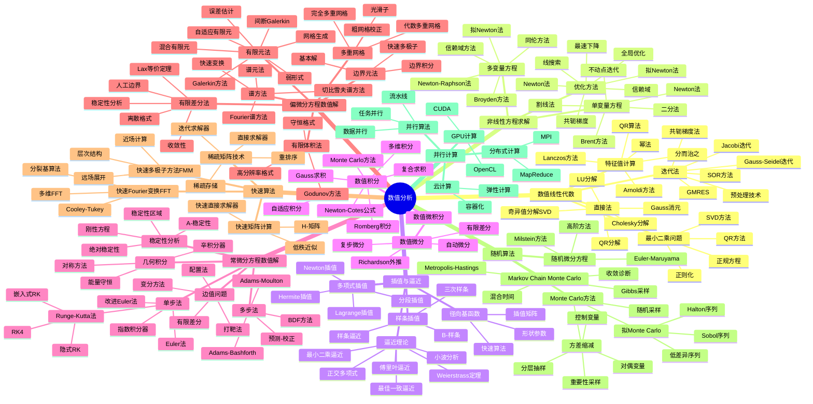
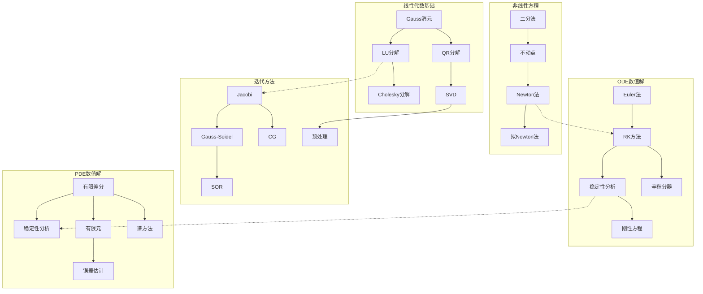
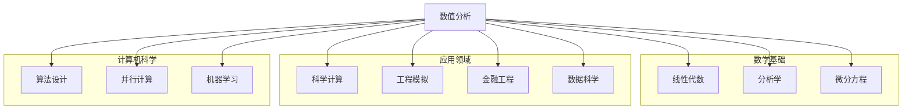
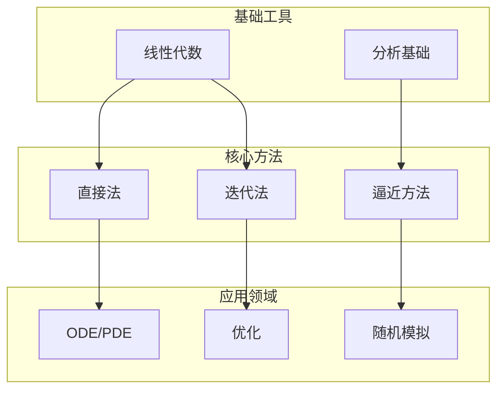

# 数值分析思维导图

> 数值分析研究数学问题的数值求解方法，从线性代数到微分方程，提供了科学计算的算法基础。

---

## 🧠 核心概念层级关系



---

## 🔗 定理依赖关系图



---

## 📍 重要示例分布

### 矩阵计算示例

| 示例 | 概念 | 重要性 | 应用 |
|-----|------|-------|------|
| Hilbert矩阵 | 病态矩阵 | ⭐⭐⭐⭐⭐ | 稳定性测试 |
| Poisson矩阵 | 稀疏结构 | ⭐⭐⭐⭐⭐ | PDE离散 |
| 随机矩阵 | 统计性质 | ⭐⭐⭐⭐ | 随机算法 |

### 迭代方法示例

| 示例 | 概念 | 重要性 | 应用 |
|-----|------|-------|------|
| 热方程离散 | 稀疏系统 | ⭐⭐⭐⭐⭐ | CG方法 |
| 对流扩散 | 非对称 | ⭐⭐⭐⭐⭐ | GMRES |
| 结构问题 | 正定 | ⭐⭐⭐⭐⭐ | 多重网格 |

### ODE示例

| 示例 | 概念 | 重要性 | 应用 |
|-----|------|-------|------|
| 刚性ODE | 稳定性 | ⭐⭐⭐⭐⭐ | 化学反应 |
| 天体力学 | 能量守恒 | ⭐⭐⭐⭐⭐ | 辛积分器 |
| 电路模拟 | DAE | ⭐⭐⭐⭐ | 电子工程 |

### PDE示例

| 示例 | 概念 | 重要性 | 应用 |
|-----|------|-------|------|
| 热方程 | 抛物型 | ⭐⭐⭐⭐⭐ | 扩散问题 |
| 波动方程 | 双曲型 | ⭐⭐⭐⭐⭐ | 振动分析 |
| Poisson方程 | 椭圆型 | ⭐⭐⭐⭐⭐ | 势场计算 |
| Navier-Stokes | 非线性 | ⭐⭐⭐⭐⭐ | 流体力学 |

---

## 🔄 与其他分支的连接点



**具体连接说明：**

| 分支 | 连接概念 | 连接深度 |
|-----|---------|---------|
| 线性代数 | 矩阵算法、特征值 | ⭐⭐⭐⭐⭐ |
| 微分方程 | 数值解法 | ⭐⭐⭐⭐⭐ |
| 逼近论 | 插值、最佳逼近 | ⭐⭐⭐⭐⭐ |
| 优化 | 优化算法 | ⭐⭐⭐⭐⭐ |
| 概率论 | 随机算法、MCMC | ⭐⭐⭐⭐ |
| 计算机科学 | 算法、并行计算 | ⭐⭐⭐⭐⭐ |
| 物理学 | 科学计算 | ⭐⭐⭐⭐⭐ |
| 工程学 | 仿真模拟 | ⭐⭐⭐⭐⭐ |

---

## 📊 学习难度梯度标记

```mermaid
graph LR
    subgraph 基础数值 ⭐⭐⭐
        A1[插值]
        A2[数值积分]
        A3[线性方程组]
    end

    subgraph 进阶方法 ⭐⭐⭐⭐
        B1[特征值问题]
        B2[非线性方程]
        B3[ODE数值解]
    end

    subgraph 高级方法 ⭐⭐⭐⭐⭐
        C1[PDE数值解]
        C2[有限元]
        C3[谱方法]
    end

    subgraph 专家级 ⭐⭐⭐⭐⭐⭐
        D1[快速算法]
        D2[并行计算]
        D3[随机算法]
    end
```

### 详细难度分级

| 主题 | 入门 | 基础 | 进阶 | 高级 | 专家 |
|-----|------|------|------|------|------|
| 线性代数 | 直接法 | 迭代法 | 预处理 | 快速算法 | 随机化算法 |
| 逼近论 | 多项式插值 | 样条 | 最佳逼近 | 小波 | 学习理论 |
| 微分方程 | Euler法 | RK方法 | 有限元 | 谱方法 | 自适应方法 |
| 优化 | 梯度下降 | Newton法 | 内点法 | 全局优化 | 随机优化 |

---

## 🎯 学习路径推荐

### 标准数值分析路径

```
数值线性代数 → 插值逼近 → 数值微积分 → ODE数值解 → PDE数值解
```

### 科学计算路径

```
数值线性代数 → 迭代方法 → 快速算法 → 并行计算 → 大规模仿真
```

### 机器学习数值路径

```
优化算法 → 随机算法 → 矩阵分解 → 深度学习优化 → 强化学习
```

### 金融数值路径

```
随机模拟 → SDE数值解 → 蒙特卡洛 → 方差缩减 → 期权定价
```

---

## 📚 核心定理清单

### 线性代数数值

1. **LU分解存在性**：可逆矩阵的LU分解
2. **谱定理**：正规矩阵的对角化
3. **Gershgorin圆盘定理**：特征值定位
4. **共轭梯度收敛性**：Krylov子空间最优性

### 逼近论核心

1. **Weierstrass逼近定理**：连续函数可用多项式逼近
2. **Chebyshev交错定理**：最佳一致逼近特征
3. **Jackson定理**：光滑性与逼近阶
4. **Bernstein定理**：解析性与多项式逼近

### 数值微积分

1. **Newton-Cotes公式**：等距节点积分
2. **Gauss求积精确度**：2n-1次精确
3. **Euler-Maclaurin公式**：求和与积分关系
4. **Richardson外推**：收敛加速

### 微分方程数值

1. **Lax等价定理**：相容+稳定↔收敛
2. **CFL条件**：双曲方程稳定性
3. **Lax-Milgram定理**：变分问题适定性
4. **Céa引理**：有限元误差估计

---

## 🔍 概念关系图谱



---

> 💡 **学习建议**：数值分析强调理论与计算实践的结合。建议学习者在理解算法原理的同时，通过编程实现来加深理解。现代数值分析越来越依赖于高性能计算，了解并行计算和GPU编程是很有价值的。此外，数值分析在数据科学和机器学习中的应用日益广泛，保持对这些领域的关注也很重要。
