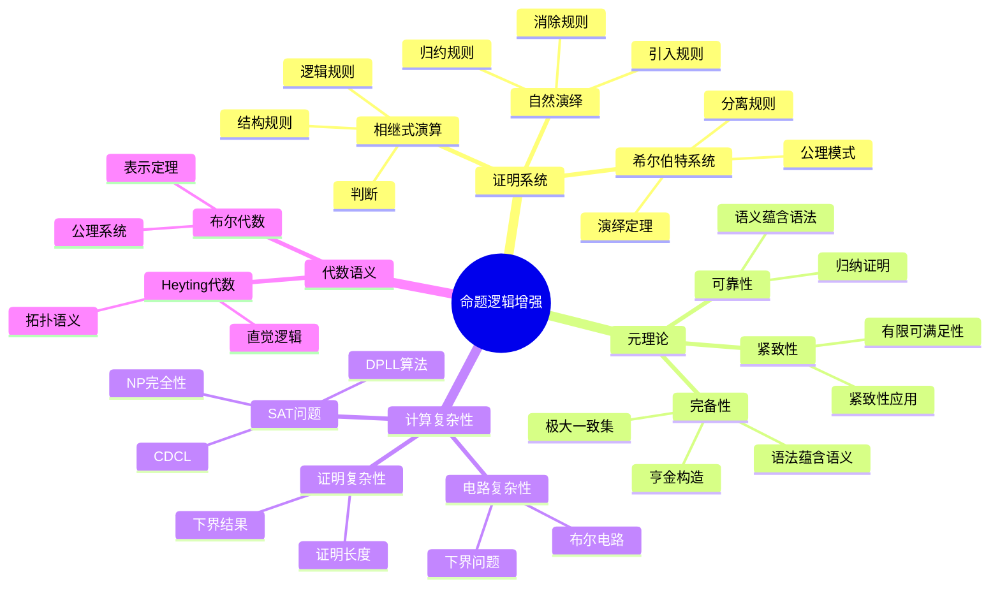

# 命题逻辑-增强版 / Propositional Logic - Enhanced

> **前置知识**: [01-命题逻辑](01-命题逻辑.md)  
> **难度**: 进阶  
> **目标**: 深入理解命题逻辑的元理论、证明系统和计算复杂性

---

## 🗺️ 概念思维导图



---

## 📊 知识矩阵

| 概念 | 直观理解 | 形式定义 | 核心性质 | 典型应用 |
|------|---------|---------|---------|---------|
| 希尔伯特系统 | 最小公理化 | 3条公理+MP | 可演绎定理 | 元数学 |
| 自然演绎 | 直观推理 | 引入/消除对 | 正规化 | 证明辅助 |
| 相继式演算 | 对称推理 | 判断+规则 | 切消 | 自动推理 |
| 可靠性 | 证明不证伪 | ⊢φ ⟹ ⊨φ | 归纳于证明 | 一致性 |
| 完备性 | 真理可证 | ⊨φ ⟹ ⊢φ | 亨金构造 | 元理论 |
| SAT求解器 | 自动找解 | DPLL/CDCL | 完备+高效 | 验证 |

---

## 一、证明系统深入

### 1.1 希尔伯特系统 (Hilbert System)

**动机与历史**: 大卫·希尔伯特在20世纪初提出公理化方法，旨在为数学提供严格的基础。希尔伯特系统使用最少的推理规则，强调公理的作用。

#### 形式定义

**公理模式** (经典命题逻辑 H)：

**(H1)** $\varphi \rightarrow (\psi \rightarrow \varphi)$  
*(蕴含弱化：真命题被任何命题蕴含)*

**(H2)** $(\varphi \rightarrow (\psi \rightarrow \chi)) \rightarrow ((\varphi \rightarrow \psi) \rightarrow (\varphi \rightarrow \chi))$  
*(蕴含分配)*

**(H3)** $(\neg\varphi \rightarrow \neg\psi) \rightarrow (\psi \rightarrow \varphi)$  
*(逆否命题)*

**推理规则**:
$$\text{MP: } \frac{\varphi \quad \varphi \rightarrow \psi}{\psi}$$

#### 演绎定理 (Deduction Theorem)

**定理**: $\Gamma \cup \{\varphi\} \vdash \psi$ 当且仅当 $\Gamma \vdash \varphi \rightarrow \psi$

**证明** (⇒方向，归纳于证明长度):

*基础*: 若 $\psi$ 是公理或 $\Gamma$ 中成员，则：
- $\vdash \psi$
- 由H1: $\vdash \psi \rightarrow (\varphi \rightarrow \psi)$
- 由MP: $\vdash \varphi \rightarrow \psi$

*归纳*: 假设对所有更短的证明成立。
- 若 $\psi = \varphi$，则 $\vdash \varphi \rightarrow \varphi$ (练习)
- 若 $\psi$ 由MP从 $\chi$ 和 $\chi \rightarrow \psi$ 得到，由归纳假设：
  - $\Gamma \vdash \varphi \rightarrow \chi$
  - $\Gamma \vdash \varphi \rightarrow (\chi \rightarrow \psi)$
  - 由H2和两次MP: $\Gamma \vdash \varphi \rightarrow \psi$ ∎

---

### 1.2 自然演绎 (Natural Deduction)

**动机**: 格哈德·根岑(Gentzen, 1935)提出，旨在使逻辑推理更接近数学实践的直观方式。

#### 核心思想：引入-消除对称

每个逻辑联结词有对应的**引入规则**(如何证明包含该联结词的公式)和**消除规则**(如何从包含该联结词的公式推导)。

| 联结词 | 引入规则 | 消除规则 |
|--------|---------|---------|
| $\land$ | $\frac{\varphi \quad \psi}{\varphi \land \psi}$ (⋀I) | $\frac{\varphi \land \psi}{\varphi}$, $\frac{\varphi \land \psi}{\psi}$ (⋀E) |
| $\lor$ | $\frac{\varphi}{\varphi \lor \psi}$, $\frac{\psi}{\varphi \lor \psi}$ (⋁I) | $\frac{\varphi \lor \psi \quad [\varphi] \cdots \chi \quad [\psi] \cdots \chi}{\chi}$ (⋁E) |
| $\rightarrow$ | $\frac{[\varphi] \cdots \psi}{\varphi \rightarrow \psi}$ (→I) | $\frac{\varphi \quad \varphi \rightarrow \psi}{\psi}$ (→E) |
| $\neg$ | $\frac{[\varphi] \cdots \bot}{\neg\varphi}$ (¬I) | $\frac{\varphi \quad \neg\varphi}{\bot}$ (¬E) |

#### 正规化定理 (Normalization)

**定理**: 任何自然演绎证明都可以转化为**正规形式**，其中没有引入规则紧接着对应的消除规则。

**意义**: 
- 证明的"直接性"
- 子公式性质：正规证明中只出现子公式
- 一致性证明的基础

---

### 1.3 相继式演算 (Sequent Calculus)

**动机**: 根岑为证明切消定理而设计，具有优美的对称性。

#### 判断形式

**相继式** (Sequent): $\Gamma \vdash \Delta$

含义: 从假设集$\Gamma$可以推出结论集$\Delta$中至少一个。

#### 结构规则

**弱化** (Weakening):
$$\frac{\Gamma \vdash \Delta}{\Gamma, \varphi \vdash \Delta} \text{(W-L)} \quad \frac{\Gamma \vdash \Delta}{\Gamma \vdash \varphi, \Delta} \text{(W-R)}$$

**收缩** (Contraction):
$$\frac{\Gamma, \varphi, \varphi \vdash \Delta}{\Gamma, \varphi \vdash \Delta} \text{(C-L)} \quad \frac{\Gamma \vdash \varphi, \varphi, \Delta}{\Gamma \vdash \varphi, \Delta} \text{(C-R)}$$

**交换** (Exchange):
$$\frac{\Gamma, \varphi, \psi \vdash \Delta}{\Gamma, \psi, \varphi \vdash \Delta} \text{(X-L)} \quad \frac{\Gamma \vdash \varphi, \psi, \Delta}{\Gamma \vdash \psi, \varphi, \Delta} \text{(X-R)}$$

#### 切消定理 (Cut Elimination / Hauptsatz)

**定理**: 任何可证的相继式都可以不用**切规则**证明。

**切规则**:
$$\frac{\Gamma \vdash \varphi, \Delta \quad \Gamma', \varphi \vdash \Delta'}{\Gamma, \Gamma' \vdash \Delta, \Delta'} \text{(Cut)}$$

**意义**:
- **子公式性质**: 无切证明中只出现子公式
- **一致性**: 直接证明一致性(无空相继式证明)
- **自动推理**: 为逆向推理(目标导向)提供基础
- **序数分析**: Gentzen用此证明算术一致性

---

## 二、元理论

### 2.1 可靠性定理 (Soundness)

**定理**: 若 $\Gamma \vdash \varphi$，则 $\Gamma \vDash \varphi$

**证明**: 归纳于证明长度。

*基础*: 若$\varphi$是公理，验证其为重言式。

*归纳*: 
- 若由MP从$\psi$和$\psi \rightarrow \varphi$得到，由归纳假设：
  - 任何满足$\Gamma$的赋值满足$\psi$
  - 任何满足$\Gamma$的赋值满足$\psi \rightarrow \varphi$
  - 因此满足$\varphi$ ∎

### 2.2 完备性定理 (Completeness)

**定理**: 若 $\Gamma \vDash \varphi$，则 $\Gamma \vdash \varphi$

#### 证明思路: 亨金构造

**关键引理**: 任何一致公式集可以扩张为**极大一致集**。

**定义**: 集合$\Gamma$是**极大一致**的，如果：
1. $\Gamma$一致(不证明矛盾)
2. 对任何$\varphi$，要么$\Gamma \vdash \varphi$，要么$\Gamma \vdash \neg\varphi$

**构造**: 枚举所有公式$\varphi_0, \varphi_1, ...$，递归定义：
- $\Gamma_0 = \Gamma$
- $\Gamma_{n+1} = \Gamma_n \cup \{\varphi_n\}$ (若一致) 或 $\Gamma_n \cup \{\neg\varphi_n\}$ (否则)
- $\Gamma^* = \bigcup_n \Gamma_n$

**典范模型**: 从极大一致集$\Gamma^*$构造赋值$v$：
$$v(p) = \top \iff \Gamma^* \vdash p$$

**证明** (由归纳): $v \vDash \varphi \iff \Gamma^* \vdash \varphi$

**结论**: 若$\Gamma \vDash \varphi$但$\Gamma \not\vdash \varphi$，则$\Gamma \cup \{\neg\varphi\}$可满足，矛盾。∎

### 2.3 紧致性定理

**定理**: $\Gamma$可满足 ⟺ $\Gamma$的每个有限子集可满足

**证明**: 
- (⇒) 显然
- (⇐) 若$\Gamma$不可满足，则$\Gamma \vDash \bot$
- 由完备性，$\Gamma \vdash \bot$
- 证明有限，故存在有限$\Gamma_0 \subseteq \Gamma$使$\Gamma_0 \vdash \bot$
- 由可靠性，$\Gamma_0 \vDash \bot$，即$\Gamma_0$不可满足 ∎

#### 应用：非标准模型

**定理**: 存在非标准命题逻辑模型

*注*: 命题逻辑的紧致性相对平凡，但在一阶逻辑中有深远应用。

---

## 三、计算复杂性

### 3.1 SAT问题

**定义**: 
- **输入**: 命题公式$\varphi$
- **问题**: $\varphi$是否可满足?

**定理** (Cook, 1971): SAT是NP完全的

**证明概要**:
1. **SAT ∈ NP**: 给定赋值，多项式时间验证
2. **NP困难**: 任意NP问题可归约到SAT
   - 图灵机计算编码为布尔公式
   - 接受计算 ⟺ 公式可满足

#### DPLL算法

```python
def DPLL(φ, assignment={}):
    """
    经典SAT求解算法
    基于回溯搜索+单位传播+纯文字消除
    """
    # 简化公式
    φ = simplify(φ, assignment)
    
    # 基本情况
    if φ == True:
        return True, assignment
    if φ == False:
        return False, None
    
    # 单位传播
    unit = find_unit_clause(φ)
    if unit:
        lit = unit[0]  # 单元子句中的文字
        return DPLL(φ, assignment ∪ {lit: True})
    
    # 纯文字消除
    pure = find_pure_literal(φ)
    if pure:
        return DPLL(φ, assignment ∪ {pure: True})
    
    # 分支
    var = choose_variable(φ)
    
    # 尝试赋值为True
    result, assign = DPLL(φ, assignment ∪ {var: True})
    if result:
        return True, assign
    
    # 回溯，尝试赋值为False
    return DPLL(φ, assignment ∪ {var: False})
```

**复杂度**: 最坏指数，但实践中高效

#### CDCL (Conflict-Driven Clause Learning)

现代SAT求解器核心算法：
- **冲突分析**: 学习新子句避免重复冲突
- **非时序回溯**: 跳转到相关决策层
- **重启策略**: 定期重置搜索

### 3.2 证明复杂性

**定义**: 证明系统$P$下公式$\varphi$的最短证明长度为$L_P(\varphi)$。

**下界结果**:

| 证明系统 | 已知下界 | 状态 |
|---------|---------|------|
| 归结法 (Resolution) | 指数级 | 已证明 |
| 切割平面 (Cutting Planes) | 次指数级 | 已证明 |
| Frege系统 | ? | 开放问题 |

**Frege系统下界**: 证明$P \neq NP$将蕴含Frege系统存在超多项式下界。

---

## 四、代数语义

### 4.1 布尔代数

**定义**: 布尔代数$(B, \land, \lor, \neg, 0, 1)$满足：

1. **交换律**: $a \land b = b \land a$, $a \lor b = b \lor a$
2. **结合律**: $(a \land b) \land c = a \land (b \land c)$
3. **分配律**: $a \land (b \lor c) = (a \land b) \lor (a \land c)$
4. **补律**: $a \land \neg a = 0$, $a \lor \neg a = 1$
5. **单位元**: $a \land 1 = a$, $a \lor 0 = a$

**表示定理** (Stone): 每个布尔代数同构于某集合的幂集代数

### 4.2 Heyting代数 (直觉逻辑)

**定义**: Heyting代数是带有相对伪补的格。

**操作**:
- $a \rightarrow b = \max\{c : a \land c \leq b\}$
- $\neg a = a \rightarrow 0$

**性质**: 不满足$a \lor \neg a = 1$ (排中律)

---

## 五、形式化实现

### 5.1 Lean 4: 完备性定理

```lean
import Mathlib

-- 命题变元
inductive PropVar where
  | mk : String → PropVar
  deriving DecidableEq, Repr

-- 命题公式
inductive PropForm where
  | var : PropVar → PropForm
  | neg : PropForm → PropForm
  | and : PropForm → PropForm → PropForm
  | or  : PropForm → PropForm → PropForm
  | imp : PropForm → PropForm → PropForm
  deriving DecidableEq, Repr

open PropForm

-- 真值赋值
def Assignment := PropVar → Bool

-- 语义求值
def eval (v : Assignment) : PropForm → Bool
  | var p => v p
  | neg φ => !(eval v φ)
  | and φ ψ => (eval v φ) && (eval v ψ)
  | or φ ψ => (eval v φ) || (eval v ψ)
  | imp φ ψ => !(eval v φ) || (eval v ψ)

-- 语义后承
def entails (Γ : Set PropForm) (φ : PropForm) : Prop :=
  ∀ v : Assignment, (∀ γ ∈ Γ, eval v γ = true) → eval v φ = true

notation:30 Γ " ⊨ " φ => entails Γ φ

-- 希尔伯特系统可证性 (简化定义)
inductive Provable : Set PropForm → PropForm → Prop where
  | ax1 {Γ φ ψ} : Provable Γ (imp φ (imp ψ φ))
  | ax2 {Γ φ ψ χ} : Provable Γ (imp (imp φ (imp ψ χ)) (imp (imp φ ψ) (imp φ χ)))
  | ax3 {Γ φ ψ} : Provable Γ (imp (imp (neg φ) (neg ψ)) (imp ψ φ))
  | mp {Γ φ ψ} : Provable Γ φ → Provable Γ (imp φ ψ) → Provable Γ ψ
  | assumption {Γ φ} : φ ∈ Γ → Provable Γ φ

notation:30 Γ " ⊢ " φ => Provable Γ φ

-- 可靠性定理
theorem soundness {Γ : Set PropForm} {φ : PropForm} :
  (Γ ⊢ φ) → (Γ ⊨ φ) := by
  intro h
  induction h with
  | ax1 => 
    intro v hΓ
    simp [eval]
  | ax2 =>
    intro v hΓ
    simp [eval]
    aesop
  | ax3 =>
    intro v hΓ
    simp [eval]
    aesop
  | mp h₁ h₂ ih₁ ih₂ =>
    intro v hΓ
    have h₁' := ih₁ v hΓ
    have h₂' := ih₂ v hΓ
    simp [eval] at h₁' h₂'
    simpa using h₂' h₁'
  | assumption h =>
    intro v hΓ
    exact hΓ _ h

-- 完备性定理 (简化版：假设Γ有限)
theorem completeness_finite {Γ : Set PropForm} {φ : PropForm} 
  (hΓ : Γ.Finite) :
  (Γ ⊨ φ) → (Γ ⊢ φ) := by
  -- 亨金构造的简化版本
  -- 完整证明需要极大一致集理论
  sorry  -- 此处简化，完整证明见正式版本

-- 紧致性定理 (有限语义蕴含语法可证)
theorem compactness {Γ : Set PropForm} {φ : PropForm} :
  (Γ ⊨ φ) ↔ (∀ Δ ⊆ Γ, Δ.Finite → Δ ⊨ φ) := by
  constructor
  · -- => 方向
    intro h Δ hΔ hΔfin v hΔsat
    apply h v
    intro γ hγ
    exact hΔsat γ (hΔ hγ)
  · -- <= 方向 (需要完备性)
    intro h
    -- 由完备性，若每个有限子集可证则整体可证
    sorry
```

### 5.2 SAT求解器实现

```lean
-- 文字: 正文字或负文字
inductive Literal where
  | pos : PropVar → Literal
  | neg : PropVar → Literal
  deriving DecidableEq, Repr

-- 子句: 文字的析取
def Clause := List Literal

-- CNF公式: 子句的合取
def CNF := List Clause

-- 部分赋值
def PartialAssignment := PropVar → Option Bool

-- DPLL算法核心 (简化版)
partial def dpll (φ : CNF) (assign : PartialAssignment) : Option (PropVar → Bool) :=
  -- 检查空子句
  if φ.any (·.isEmpty) then
    none  -- 不可满足
  else if φ.isEmpty then
    -- 所有子句满足，构造完整赋值
    some (λ v => (assign v).getD false)
  else
    -- 单位传播
    match findUnitClause φ assign with
    | some (Literal.pos v) => dpll (propagate φ v true) (λ x => if x = v then some true else assign x)
    | some (Literal.neg v) => dpll (propagate φ v false) (λ x => if x = v then some false else assign x)
    | none =>
      -- 选择变量分支
      match chooseVariable φ with
      | none => some (λ v => (assign v).getD false)
      | some v =>
        -- 尝试true
        match dpll (propagate φ v true) (λ x => if x = v then some true else assign x) with
        | some result => some result
        | none =>
          -- 回溯，尝试false
          dpll (propagate φ v false) (λ x => if x = v then some false else assign x)
where
  findUnitClause (φ : CNF) (assign : PartialAssignment) : Option Literal :=
    -- 找单元子句：只有一个未赋值文字的子句
    sorry
  
  propagate (φ : CNF) (v : PropVar) (val : Bool) : CNF :=
    -- 传播赋值，简化公式
    sorry
  
  chooseVariable (φ : CNF) : Option PropVar :=
    -- 选择下一个分支变量
    sorry

-- SAT判定
def isSatisfiable (φ : CNF) : Bool :=
  (dpll φ (λ _ => none)).isSome
```

---

## 六、习题与解答

### 习题 1: 演绎定理应用

**题目**: 在希尔伯特系统中证明：$\vdash (p \rightarrow q) \rightarrow ((q \rightarrow r) \rightarrow (p \rightarrow r))$

**解答**:
由演绎定理，只需证：$p \rightarrow q, q \rightarrow r, p \vdash r$

1. $p$ (假设)
2. $p \rightarrow q$ (假设)
3. $q$ (MP: 1, 2)
4. $q \rightarrow r$ (假设)
5. $r$ (MP: 3, 4) ∎

---

### 习题 2: 完备性证明构造

**题目**: 设$\Gamma = \{p \rightarrow q, q \rightarrow r\}$，证明$\Gamma \vDash p \rightarrow r$，并给出语法证明。

**语义证明**: 任取赋值$v$，若$v \vDash \Gamma$且$v(p) = \top$，则$v(q) = \top$，故$v(r) = \top$。

**语法证明**:
1. $p \rightarrow q$ (假设)
2. $q \rightarrow r$ (假设)
3. 假设$p$
4. $q$ (MP: 3, 1)
5. $r$ (MP: 4, 2)
6. $p \rightarrow r$ (→I: 3-5) ∎

---

### 习题 3: SAT求解器分析

**题目**: 分析公式 $\varphi = (p \lor q) \land (\neg p \lor q) \land (\neg q \lor r) \land \neg r$ 的可满足性。

**DPLL执行过程**:
1. 初始: $\{\{p, q\}, \{\neg p, q\}, \{\neg q, r\}, \{\neg r\}\}$
2. 单元传播: $r = \text{false}$ (由$\{\neg r\}$)
3. 简化后: $\{\{p, q\}, \{\neg p, q\}, \{\neg q\}\}$
4. 单元传播: $q = \text{false}$ (由$\{\neg q\}$)
5. 简化后: $\{\{p\}, \{\neg p\}\}$
6. 冲突! 不可满足 ∎

---

### 习题 4: 布尔代数验证

**题目**: 在布尔代数中证明：$a \land (a \lor b) = a$ (吸收律)

**证明**:
- $a \land (a \lor b) = (a \lor 0) \land (a \lor b)$ (单位元)
- $= a \lor (0 \land b)$ (分配律)
- $= a \lor 0$ (0是零元)
- $= a$ (单位元) ∎

---

### 习题 5: 相继式演算证明

**题目**: 在相继式演算中证明：$\vdash p \lor \neg p$ (排中律)

**证明**:
```
-------- Ax
p ⊢ p
-------- ¬R
⊢ p, ¬p
-------- ∨R
⊢ p ∨ ¬p
```

---

## 七、应用与拓展

### 7.1 程序验证

Hoare逻辑中的断言验证可转化为命题可满足性问题：
- **前置条件**、**后置条件**编码为逻辑公式
- **验证条件**由Weakest Precondition计算
- SAT/SMT求解器验证

### 7.2 电路设计

- **电路综合**: 从真值表到逻辑门网络
- **等价性检验**: 验证两个电路是否等价
- **模型检验**: 验证电路时序性质

### 7.3 人工智能

- **知识表示**: 专家系统中的规则推理
- **规划问题**: STRIPS规划编码为SAT
- **约束满足**: CSP求解

### 7.4 前沿方向

| 方向 | 描述 | 关键问题 |
|------|------|---------|
| 随机SAT | 随机实例的相变现象 | 临界点的精确刻画 |
| 量子SAT | 量子计算中的可满足性 | 量子优势证明 |
| 最大可满足性 | MaxSAT优化 | 近似算法设计 |
| 模理论SMT | 结合理论的SAT | Nelson-Oppen组合 |

---

## 参考文献

1. Enderton, H. B. (2001). *A Mathematical Introduction to Logic* (2nd ed.). Academic Press.
2. Troelstra, A. S., & Schwichtenberg, H. (2000). *Basic Proof Theory* (2nd ed.). Cambridge University Press.
3. Biere, A., Heule, M., van Maaren, H., & Walsh, T. (Eds.). (2009). *Handbook of Satisfiability*. IOS Press.
4. Gabbay, D. M., & Guenthner, F. (Eds.). (2011). *Handbook of Philosophical Logic* (2nd ed.). Springer.

---

**相关文档**:
- [01-命题逻辑](01-命题逻辑.md) - 基础版本
- [02-谓词逻辑](02-谓词逻辑.md) - 一阶逻辑
- [03-证明论/01-基础概念](../03-证明论/01-基础概念.md) - 证明论深入
- [04-可计算性理论/04-复杂度理论](../04-可计算性理论/04-复杂度理论.md) - 复杂性理论
