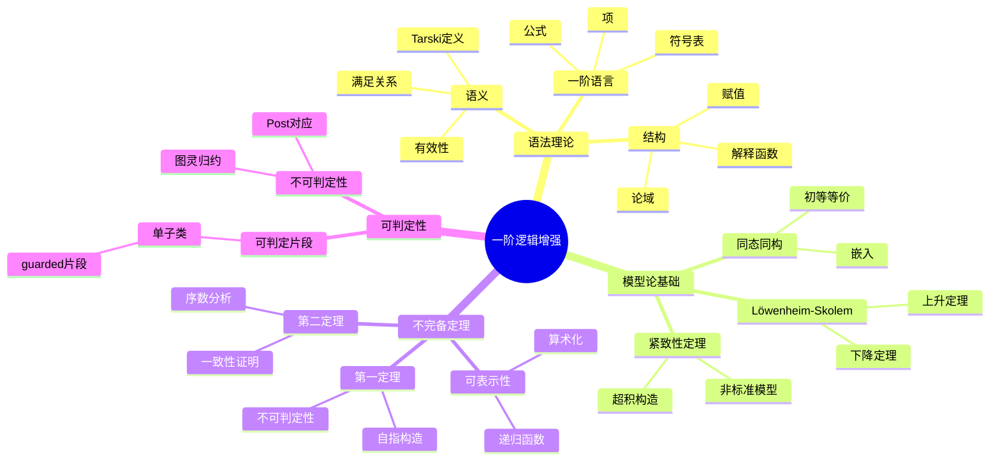

# 一阶逻辑-增强版 / First-Order Logic - Enhanced

> **前置知识**: [02-谓词逻辑](02-谓词逻辑.md)、[01-命题逻辑-增强版](01-命题逻辑-增强版.md)  
> **难度**: 进阶  
> **目标**: 深入理解一阶逻辑的模型论、不完备定理和元数学性质

---

## 🗺️ 概念思维导图



---

## 📊 知识矩阵

| 概念 | 直观理解 | 形式定义 | 核心性质 | 典型应用 |
|------|---------|---------|---------|---------|
| Tarski语义 | 公式在结构中的意义 | 递归定义⊨ | 组合性 | 模型论 |
| 初等等价 | 无法一阶区分 | M≡N | 同构⇒初等等价 | 分类理论 |
| 紧致性 | 有限⇒无限 | 拓扑紧致 | 非标准模型 | 存在性证明 |
| 可表示性 | 语法编码 | 递归定义 | 自指可能 | 不完备性 |
| 不可判定性 | 无算法可解 | 停机问题归约 | Rice定理 | 可计算性边界 |

---

## 一、语法与语义深入

### 1.1 一阶语言的形式定义

**签名** (Signature) $\Sigma = (\mathcal{C}, \mathcal{F}, \mathcal{R}, \text{ar})$：
- $\mathcal{C}$: 常数符号集
- $\mathcal{F}$: 函数符号集
- $\mathcal{R}$: 关系符号集
- $\text{ar}: \mathcal{F} \cup \mathcal{R} \to \mathbb{N}$: 元数函数

**项** ($\Sigma$-项) 递归定义：
1. 变元是项
2. 常数是项
3. 若$t_1, ..., t_n$是项，$f \in \mathcal{F}$，$\text{ar}(f) = n$，则$f(t_1, ..., t_n)$是项

**公式** 递归定义：
1. $R(t_1, ..., t_n)$是原子公式，其中$R \in \mathcal{R}$
2. $t_1 = t_2$是原子公式
3. 若$\varphi, \psi$是公式，则$\neg\varphi$, $\varphi \land \psi$, $\varphi \lor \psi$, $\varphi \rightarrow \psi$是公式
4. 若$\varphi$是公式，$x$是变元，则$\forall x \varphi$, $\exists x \varphi$是公式

### 1.2 Tarski语义

**结构** (Structure) $\mathcal{M} = (M, \{c^\mathcal{M}\}, \{f^\mathcal{M}\}, \{R^\mathcal{M}\})$：
- $M$: 非空论域
- $c^\mathcal{M} \in M$: 常数解释
- $f^\mathcal{M}: M^n \to M$: 函数解释
- $R^\mathcal{M} \subseteq M^n$: 关系解释

**赋值** (Assignment) $s: \text{Var} \to M$

**项的解释** $t^\mathcal{M}[s]$:
- $x^\mathcal{M}[s] = s(x)$
- $c^\mathcal{M}[s] = c^\mathcal{M}$
- $f(t_1, ..., t_n)^\mathcal{M}[s] = f^\mathcal{M}(t_1^\mathcal{M}[s], ..., t_n^\mathcal{M}[s])$

**满足关系** $\mathcal{M} \vDash \varphi[s]$ 递归定义：

| 公式 | 满足条件 |
|------|---------|
| $R(t_1, ..., t_n)$ | $(t_1^\mathcal{M}[s], ..., t_n^\mathcal{M}[s]) \in R^\mathcal{M}$ |
| $t_1 = t_2$ | $t_1^\mathcal{M}[s] = t_2^\mathcal{M}[s]$ |
| $\neg\varphi$ | $\mathcal{M} \not\vDash \varphi[s]$ |
| $\varphi \land \psi$ | $\mathcal{M} \vDash \varphi[s]$且$\mathcal{M} \vDash \psi[s]$ |
| $\varphi \lor \psi$ | $\mathcal{M} \vDash \varphi[s]$或$\mathcal{M} \vDash \psi[s]$ |
| $\varphi \rightarrow \psi$ | $\mathcal{M} \not\vDash \varphi[s]$或$\mathcal{M} \vDash \psi[s]$ |
| $\forall x \varphi$ | 对所有$a \in M$: $\mathcal{M} \vDash \varphi[s[x/a]]$ |
| $\exists x \varphi$ | 存在$a \in M$: $\mathcal{M} \vDash \varphi[s[x/a]]$ |

其中$s[x/a]$表示将$x$映射为$a$的修改赋值。

---

## 二、模型论基础

### 2.1 同态与同构

**同态** $h: \mathcal{M} \to \mathcal{N}$：
- $h(c^\mathcal{M}) = c^\mathcal{N}$
- $h(f^\mathcal{M}(a_1, ..., a_n)) = f^\mathcal{N}(h(a_1), ..., h(a_n))$
- $(a_1, ..., a_n) \in R^\mathcal{M} \Rightarrow (h(a_1), ..., h(a_n)) \in R^\mathcal{N}$

**嵌入** (Embedding): 单射同态且保持关系双向

**同构** (Isomorphism): 双射嵌入，记作$\mathcal{M} \cong \mathcal{N}$

**定理**: 同构结构是初等等价的：$\mathcal{M} \cong \mathcal{N} \Rightarrow \mathcal{M} \equiv \mathcal{N}$

### 2.2 初等等价

**定义**: $\mathcal{M} \equiv \mathcal{N}$如果对所有句子$\varphi$：
$$\mathcal{M} \vDash \varphi \iff \mathcal{N} \vDash \varphi$$

**定理**: 有限结构初等等价 ⟺ 同构

**反例**: $(\mathbb{Q}, <) \equiv (\mathbb{R}, <)$但不 ≅

### 2.3 紧致性定理

**定理**: 公式集$\Gamma$有模型 ⟺ 每个有限子集有模型

**应用 1: 非标准模型**

**定理**: 存在$^*\mathbb{N} \vDash \text{Th}(\mathbb{N})$但$^*\mathbb{N} \not\cong \mathbb{N}$

**证明**: 令$\Gamma = \text{Th}(\mathbb{N}) \cup \{c > \underline{n} : n \in \mathbb{N}\}$
- 每个有限子集可满足(解释$c$为足够大的数)
- 由紧致性，$\Gamma$可满足
- 模型中存在无限大元素$c$

**应用 2: 四色定理的推广**

**定理**: 若每个有限平面图是4-可染色的，则无限平面图也是。

### 2.4 Löwenheim-Skolem 定理

**下降定理**: 若$\mathcal{M} \vDash \Gamma$且$|L| \leq \kappa \leq |M|$，则存在$\mathcal{N} \preceq \mathcal{M}$使$|N| = \kappa$

**上升定理**: 若$\mathcal{M} \vDash \Gamma$且$|M| \leq \kappa$，则存在$\mathcal{N} \vDash \Gamma$使$|N| = \kappa$且$\mathcal{M} \preceq \mathcal{N}$

**哲学意义 (Skolem悖论)**: 若ZFC有模型，则有可数模型，但ZFC证明存在不可数集！

---

## 三、Gödel不完备定理

### 3.1 算术化 (Gödel编码)

**基本思想**: 将语法对象(公式、证明)编码为自然数。

**编码方案**:
- 符号编码: $\ulcorner 0 \urcorner = 1$, $\ulcorner S \urcorner = 2$, $\ulcorner + \urcorner = 3$, $\ulcorner \times \urcorner = 4$, $\ulcorner = \urcorner = 5$, $\ulcorner ( \urcorner = 6$, $\ulcorner ) \urcorner = 7$, $\ulcorner x_i \urcorner = 8 + 2i$, ...
- 序列编码: $\langle a_1, ..., a_n \rangle = p_1^{a_1} \cdot ... \cdot p_n^{a_n}$

**可表示性**: 关系$R \subseteq \mathbb{N}^k$在PA中可表示，如果存在公式$\varphi_R$使：
- 若$R(n_1, ..., n_k)$则$\text{PA} \vdash \varphi_R(\underline{n_1}, ..., \underline{n_k})$
- 若$\neg R(n_1, ..., n_k)$则$\text{PA} \vdash \neg\varphi_R(\underline{n_1}, ..., \underline{n_k})$

**定理**: 所有递归关系在PA中可表示

### 3.2 对角线引理 (Diagonal Lemma)

**定理**: 对任意含自由变元$x$的公式$\psi(x)$，存在句子$\varphi$使：
$$\text{PA} \vdash \varphi \leftrightarrow \psi(\ulcorner \varphi \urcorner)$$

**证明概要**:
1. 定义对角化函数$d: \mathbb{N} \to \mathbb{N}$，$d(\ulcorner \theta(x) \urcorner) = \ulcorner \theta(\ulcorner \theta(x) \urcorner) \urcorner$
2. 令$\delta(x, y)$表示$d(x) = y$
3. 构造$\chi(x) = \exists y (\delta(x, y) \land \psi(y))$
4. 令$\varphi = \chi(\ulcorner \chi \urcorner)$
5. 验证$\text{PA} \vdash \varphi \leftrightarrow \psi(\ulcorner \varphi \urcorner)$ ∎

### 3.3 Gödel第一不完备定理

**定理**: 若PA一致，则存在句子$G$使$\text{PA} \not\vdash G$且$\text{PA} \not\vdash \neg G$

**证明**:
1. 令$\text{Prov}(x)$表示"$x$是某定理的编码"
2. 由对角线引理，存在$G$使：$\text{PA} \vdash G \leftrightarrow \neg\text{Prov}(\ulcorner G \urcorner)$
3. **不可证性**: 若$\text{PA} \vdash G$，则$\text{PA} \vdash \text{Prov}(\ulcorner G \urcorner)$，故$\text{PA} \vdash \neg G$，矛盾
4. **不可否证性**: (需要更强的一致性条件) ∎

**意义**: 任何足够强的形式系统都无法证明所有算术真理。

### 3.4 Gödel第二不完备定理

**定理**: 若PA一致，则$\text{PA} \not\vdash \text{Con}(\text{PA})$

其中$\text{Con}(\text{PA}) = \neg\text{Prov}(\ulcorner 0 = 1 \urcorner)$

**证明概要**:
1. 第一定理证明中可得：$\text{PA} \vdash \text{Con}(\text{PA}) \rightarrow G$
2. 若$\text{PA} \vdash \text{Con}(\text{PA})$，则$\text{PA} \vdash G$，矛盾 ∎

**意义**: 系统无法证明自身的一致性(在系统内)。

---

## 四、可判定性与不可判定性

### 4.1 可判定片段

**单子类** (Monadic Class): 只有一元谓词的公式

**定理**: 单子类是可判定的

**guarded片段**:
- 原子公式是guarded
- 布尔组合保持guarded
- $\exists \vec{x} (G(\vec{x}, \vec{y}) \land \varphi(\vec{x}, \vec{y}))$是guarded，其中$G$是guard原子

**定理**: guarded片段是可判定的

### 4.2 不可判定性结果

**定理** (Church, 1936; Turing, 1936): 一阶逻辑有效性问题是不可判定的

**证明**: 停机问题可归约到一阶逻辑可满足性

**推论**:
- 若$\Gamma$可判定且足够强(可表示部分递归函数)，则$\{\varphi : \Gamma \vdash \varphi\}$不可判定
- 特别地，PA、ZFC的定理集都不可判定

---

## 五、形式化实现

### 5.1 Lean 4: 一阶逻辑基础

```lean
import Mathlib

-- 一阶语言的符号
structure Signature where
  constantSymbols : Type
  functionSymbols : Type
  relationSymbols : Type
  functionArity : functionSymbols → Nat
  relationArity : relationSymbols → Nat

-- 项
inductive Term (σ : Signature) (V : Type) where
  | var : V → Term σ V
  | const : σ.constantSymbols → Term σ V
  | app (f : σ.functionSymbols) : (Fin (σ.functionArity f) → Term σ V) → Term σ V

-- 公式
inductive Formula (σ : Signature) (V : Type) where
  | rel (R : σ.relationSymbols) : (Fin (σ.relationArity R) → Term σ V) → Formula σ V
  | eq : Term σ V → Term σ V → Formula σ V
  | neg : Formula σ V → Formula σ V
  | and : Formula σ V → Formula σ V → Formula σ V
  | or : Formula σ V → Formula σ V → Formula σ V
  | imp : Formula σ V → Formula σ V → Formula σ V
  | all : V → Formula σ V → Formula σ V
  | ex : V → Formula σ V → Formula σ V

-- 结构
structure Structure (σ : Signature) where
  domain : Type
  constInterp : σ.constantSymbols → domain
  funcInterp (f : σ.functionSymbols) : (Fin (σ.functionArity f) → domain) → domain
  relInterp (R : σ.relationSymbols) : (Fin (σ.relationArity R) → domain) → Prop

-- 赋值
def Assignment (σ : Signature) (V : Type) := V → σ.domain

-- 项的解释
def denote {σ : Signature} {V : Type} (M : Structure σ) (s : Assignment σ V) : 
  Term σ V → M.domain
  | Term.var x => s x
  | Term.const c => M.constInterp c
  | Term.app f args => M.funcInterp f (λ i => denote M s (args i))

-- 满足关系
inductive Satisfies {σ : Signature} {V : Type} (M : Structure σ) (s : Assignment σ V) : 
  Formula σ V → Prop where
  | rel {R args} : M.relInterp R (λ i => denote M s (args i)) → Satisfies M s (.rel R args)
  | eq {t₁ t₂} : denote M s t₁ = denote M s t₂ → Satisfies M s (.eq t₁ t₂)
  | neg {φ} : ¬(Satisfies M s φ) → Satisfies M s (.neg φ)
  | and {φ ψ} : Satisfies M s φ → Satisfies M s ψ → Satisfies M s (.and φ ψ)
  | or {φ ψ} : (Satisfies M s φ) ∨ (Satisfies M s ψ) → Satisfies M s (.or φ ψ)
  | imp {φ ψ} : (Satisfies M s φ) → (Satisfies M s ψ) → Satisfies M s (.imp φ ψ)
  | all {x φ} : (∀ a : M.domain, Satisfies M (λ y => if x = y then a else s y) φ) → 
                Satisfies M s (.all x φ)
  | ex {x φ} : (∃ a : M.domain, Satisfies M (λ y => if x = y then a else s y) φ) → 
               Satisfies M s (.ex x φ)

notation:60 M " ⊨ " φ "[" s "]" => Satisfies M s φ
```

### 5.2 不完备定理框架

```lean
-- 可表示性概念 (简化版)
def Representable {σ : Signature} (T : Set (Formula σ Nat)) (R : Nat → Nat → Prop) : Prop :=
  ∃ φ : Formula σ Nat, 
    ∀ m n, R m n → T ⊢ φ.subst (λ x => if x = 0 then Term.const m else Term.var x)

-- Gödel句子构造 (概念性)
def GödelSentence (T : Set (Formula σ Nat)) : Formula σ Nat :=
  -- 对角线引理应用
  sorry

-- 第一不完备定理
theorem firstIncompleteness {σ : Signature} (T : Set (Formula σ Nat)) 
  (h_consistent : Consistent T) (h_repr : RepresentableProvability T) :
  ∃ φ : Formula σ Nat, Sentence φ ∧ ¬(T ⊢ φ) ∧ ¬(T ⊢ .neg φ) := by
  -- 构造Gödel句子
  let G := GödelSentence T
  use G
  constructor
  · -- 证明是句子
    sorry
  constructor
  · -- 证明不可证
    sorry
  · -- 证明不可否证
    sorry

-- 一致性陈述
def Consistent {σ : Signature} (T : Set (Formula σ Nat)) : Prop :=
  ¬(T ⊢ .eq (Term.const 0) (Term.const 1))

-- 第二不完备定理 (概念性)
theorem secondIncompleteness {σ : Signature} (T : Set (Formula σ Nat))
  (h_consistent : Consistent T) (h_repr : RepresentableProvability T) :
  ¬(T ⊢ (.consistencyStatement T)) := by
  -- 由第一定理导出
  sorry
```

---

## 六、习题与解答

### 习题 1: Tarski语义验证

**题目**: 设$\mathcal{M} = (\mathbb{N}, 0, S, +, \times, =)$，验证$\mathcal{M} \vDash \forall x \exists y (x < y)$

**解答**:
对任意$n \in \mathbb{N}$，取赋值$s(x) = n$。
需证：$\mathcal{M} \vDash \exists y (x < y)[s]$
即：存在$m \in \mathbb{N}$使$\mathcal{M} \vDash x < y[s[y/m]]$
取$m = n + 1$，则$n < n + 1$成立。∎

---

### 习题 2: 紧致性应用

**题目**: 证明：若每个有限子图是$k$-可染色的，则无限图也是$k$-可染色的。

**解答**:
设$G = (V, E)$是无限图，每有限子图$k$-可染色。

构造一阶语言：常数$c_v$对每个$v \in V$，谓词$E(x, y)$，一元谓词$C_1, ..., C_k$

公式集$\Gamma$:
1. $\bigvee_{i=1}^k C_i(c_v)$ 对每个$v \in V$ (每个顶点有颜色)
2. $\neg(C_i(c_v) \land C_i(c_w))$ 对每个$(v, w) \in E$, $i = 1, ..., k$ (相邻顶点不同色)

任取有限$\Gamma_0 \subseteq \Gamma$，涉及的顶点集有限，故可染色，$\Gamma_0$可满足。
由紧致性，$\Gamma$可满足，即$G$是$k$-可染色的。∎

---

### 习题 3: 不完备定理理解

**题目**: 解释为什么Gödel句子$G$在自然数标准模型中为真。

**解答**:
$G$满足：$\text{PA} \vdash G \leftrightarrow \neg\text{Prov}(\ulcorner G \urcorner)$

- 若$\mathbb{N} \vDash \neg G$，则$\mathbb{N} \vDash \text{Prov}(\ulcorner G \urcorner)$
- 即存在$G$在PA中的证明的编码
- 故$\text{PA} \vdash G$，但PA只证明真语句，故$\mathbb{N} \vDash G$，矛盾

因此$\mathbb{N} \vDash G$，即$G$是真实的不可证语句。∎

---

### 习题 4: 初等等价判定

**题目**: 证明$(\mathbb{Q}, <)$和$(\mathbb{R}, <)$初等等价。

**解答**:
稠密无端点线性序(DLO)理论$\Gamma$：
1. 线性序公理
2. 无端点: $\forall x \exists y (x < y)$, $\forall x \exists y (y < x)$
3. 稠密性: $\forall x \forall y (x < y \rightarrow \exists z (x < z \land z < y))$

**定理**: DLO是$\aleph_0$-范畴的(可数模型同构)

**证明初等等价**:
- DLO具有量词消去
- DLO是完备的
- $(\mathbb{Q}, <) \vDash \Gamma$, $(\mathbb{R}, <) \vDash \Gamma$
- 故两者初等等价 ∎

---

### 习题 5: Löwenheim-Skolem应用

**题目**: 证明：若$\Gamma$有任意大的有限模型，则$\Gamma$有无限模型。

**解答**:
对每个$n \in \mathbb{N}$，令$\varphi_n = \exists x_1 ... \exists x_n \bigwedge_{i<j} x_i \neq x_j$

$\varphi_n$表示"至少有$n$个元素"。

令$\Gamma' = \Gamma \cup \{\varphi_n : n \in \mathbb{N}\}$

对任意有限$\Gamma_0 \subseteq \Gamma'$，设其中最大的$\varphi_n$为$\varphi_N$，则$\Gamma_0$的模型至少有$N$个元素(由假设存在)。

由紧致性，$\Gamma'$有模型，该模型满足所有$\varphi_n$，故无限。∎

---

## 七、应用与拓展

### 7.1 数据库理论

- **关系代数**: 一阶逻辑的可判定片段
- **查询优化**: 利用量词消去
- **完整性约束**: 一阶公式表达

### 7.2 程序验证

- **Hoare逻辑**: 程序正确性的一阶表达
- **分离逻辑**: 堆内存推理的扩展
- **最弱前置条件**: 程序逻辑的语义基础

### 7.3 知识表示

- **描述逻辑**: 可判定的一阶片段
- **本体工程**: OWL基于描述逻辑
- **语义网络**: 图结构与逻辑对应

### 7.4 前沿方向

| 方向 | 描述 | 关键挑战 |
|------|------|---------|
| 有限模型论 | 有限结构上的逻辑 | 0-1律、描述复杂性 |
| 连续逻辑 | 度量空间上的逻辑 | 稳定性理论推广 |
| 同伦类型论 | 空间结构上的逻辑 | Univalence公理 |
| 模态一阶逻辑 | 模态量词组合 | 可判定性边界 |

---

## 参考文献

1. Enderton, H. B. (2001). *A Mathematical Introduction to Logic* (2nd ed.). Academic Press.
2. Marker, D. (2002). *Model Theory: An Introduction*. Springer.
3. Gödel, K. (1931). Über formal unentscheidbare Sätze der Principia Mathematica und verwandter Systeme I.
4. Turing, A. (1936). On Computable Numbers, with an Application to the Entscheidungsproblem.
5. Chang, C. C., & Keisler, H. J. (1990). *Model Theory* (3rd ed.). North-Holland.

---

**相关文档**:
- [02-谓词逻辑](02-谓词逻辑.md) - 基础版本
- [02-模型论/01-基础概念](../02-模型论/01-基础概念.md) - 模型论深入
- [04-可计算性理论/02-核心定理](../04-可计算性理论/02-核心定理.md) - 可计算性理论
