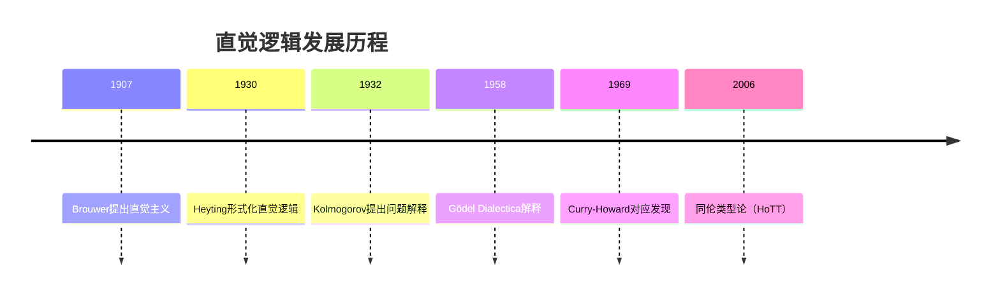

msc_primary: "03B20"
msc_secondary: ["03F55", "03-00", "03F50"]
---

# 直觉逻辑 - 增强版

## 目录 / Table of Contents

- 直觉逻辑 - 增强版
  - 目录 / Table of Contents
  - [📚 概述](#概述)
  - [🕰️ 历史发展脉络](#历史发展脉络)
  - [🧠 Brouwer-Heyting-Kolmogorov解释](#brouwer-heyting-kolmogorov解释)
    - [BHK解释的直观思想](#bhk解释的直观思想)
    - [各逻辑联结词的BHK解释](#各逻辑联结词的bhk解释)
    - [量词的BHK解释](#量词的bhk解释)
  - [⚔️ 与经典逻辑的关键区别](#与经典逻辑的关键区别)
    - [排中律不成立](#排中律不成立)
    - [双重否定消除失效](#双重否定消除失效)
    - [其他等价的失效原则](#其他等价的失效原则)
  - [📐 Kripke语义](#kripke语义)
    - [直觉主义Kripke模型](#直觉主义kripke模型)
    - [满足关系](#满足关系)
    - [持久性条件](#持久性条件)
  - [🔗 Curry-Howard对应](#curry-howard对应)
    - [命题即类型](#命题即类型)
    - [证明即程序](#证明即程序)
  - [💻 形式化实现](#形式化实现)
    - [Lean 4 实现](#lean-4-实现)
  - [📈 应用场景](#应用场景)
  - [📚 参考文献](#参考文献)

## 📚 概述

**直觉逻辑**（Intuitionistic Logic），又称**构造性逻辑**（Constructive Logic），是由荷兰数学家**L.E.J. Brouwer** 在20世纪初创立的数学哲学学派——**直觉主义**的逻辑基础。它在经典逻辑的基础上放弃了**排中律**（Law of Excluded Middle），主张数学对象必须通过构造性证明来确立存在性。

**核心原则**: "存在即被构造"（To exist is to be constructed）

直觉逻辑与经典逻辑的主要区别：

- **拒绝排中律**: $\varphi \vee \neg\varphi$ 不是普遍有效
- **拒绝双重否定消除**: $\neg\neg\varphi \rightarrow \varphi$ 不成立
- **强调构造性**: $\exists x.\varphi(x)$ 要求给出具体的 $x$ 和 $\varphi(x)$ 的证明

**MSC分类**: 03B20（次经典逻辑），03F55（直觉主义数学）

---

## 🕰️ 历史发展脉络



- **1907年**: L.E.J. Brouwer发表博士论文《论数学基础》，批判经典数学中的非构造性证明，创立直觉主义
- **1930年**: Arend Heyting形式化直觉逻辑，给出公理系统（Heyting算术HA）
- **1932年**: Andrey Kolmogorov提出**问题解释**（problem interpretation），将逻辑联结词解释为问题转换
- **1958年**: Gödel提出**Dialectica解释**，将直觉主义算术解释为有限类型函数式程序
- **1969年**: William Howard发现**命题即类型**对应（Curry-Howard对应），揭示直觉逻辑与类型论的深刻联系
- **2006年至今**: **同伦类型论**（Homotopy Type Theory）将直觉逻辑扩展到高维结构

---

## 🧠 Brouwer-Heyting-Kolmogorov解释

### BHK解释的直观思想

**BHK解释**（Brouwer-Heyting-Kolmogorov Interpretation）为直觉逻辑提供了**证明论语义**。它将每个逻辑公式 $\varphi$ 解释为一类**证明**（或**构造**）：

> 公式 $\varphi$ 为真，当且仅当我们有一个 $\varphi$ 的**构造性证明**。

BHK解释的核心洞见：**证明的结构反映公式的逻辑结构**。

---

### 各逻辑联结词的BHK解释

| 公式 | 其证明是 | 说明 |
|------|----------|------|
| $\varphi \wedge \psi$ | 对 $(p, q)$，其中 $p$ 是 $\varphi$ 的证明，$q$ 是 $\psi$ 的证明 | 合取 = 配对 |
| $\varphi \vee \psi$ | 对 $(i, p)$，其中 $i \in \{0, 1\}$，且 $p$ 是当 $i=0$ 时 $\varphi$ 的证明，当 $i=1$ 时 $\psi$ 的证明 | 析取 = 带标签的联合 |
| $\varphi \rightarrow \psi$ | 函数 $f$，将 $\varphi$ 的任意证明映射为 $\psi$ 的证明 | 蕴含 = 函数/变换 |
| $\neg\varphi$ | 函数将 $\varphi$ 的证明映射为矛盾 | 否定 = 到假的函数 |
| $\top$ | 特定的平凡证明 | 真 = 单位类型 |
| $\perp$ | 无证明 | 假 = 空类型 |

---

### 量词的BHK解释

对于一阶语言：

| 公式 | 其证明是 |
|------|----------|
| $\forall x.\varphi(x)$ | 函数 $f$，对论域中每个元素 $a$，$f(a)$ 是 $\varphi(a)$ 的证明 |
| $\exists x.\varphi(x)$ | 对 $(a, p)$，其中 $a$ 是论域元素，$p$ 是 $\varphi(a)$ 的证明 |

**关键区别**: 直觉主义要求 $\exists x.\varphi(x)$ 的证明必须**显式给出**见证 $a$，而经典逻辑允许通过反证法证明存在性而不构造具体对象。

**示例**:

- 经典证明: "假设不存在这样的数，导出矛盾"
- 直觉证明: "这个数就是 42，验证它满足条件"

---

## ⚔️ 与经典逻辑的关键区别

### 排中律不成立

**排中律**（Law of Excluded Middle, LEM）：$\varphi \vee \neg\varphi$

**定理**: 排中律在直觉逻辑中**不是定理**。

**证明思路**: 假设我们有 $\varphi \vee \neg\varphi$ 的构造性证明，这意味着我们能：

1. 证明 $\varphi$，或
2. 证明 $\neg\varphi$（即证明 $\varphi$ 导致矛盾）

但许多数学命题（如某些未解决问题）既没有已知的构造性证明，也没有已知的反例。

**具体反例**: 考虑命题"存在连续的、处处不可微的函数"。

- Weierstrass构造了这样的函数（存在性证明）
- 但在直觉主义框架中，必须**具体构造**这样的函数，而非仅证明"假设不存在会导致矛盾"

---

### 双重否定消除失效

**双重否定消除**（Double Negation Elimination, DNE）：$\neg\neg\varphi \rightarrow \varphi$

**定理**: DNE在直觉逻辑中不成立。

**解释**:

- $\neg\neg\varphi$ 表示"假设 $\neg\varphi$ 会导致矛盾"
- 这**不等价于**"我们有 $\varphi$ 的构造性证明"

**关系**: 虽然 $\varphi \rightarrow \neg\neg\varphi$ 成立（若 $\varphi$ 可证，则假设 $\neg\varphi$ 会导致矛盾），但反向不成立。

**经典逻辑的恢复**: Glivenko定理指出，对于命题逻辑，若 $\varphi$ 是经典重言式，则 $\neg\neg\varphi$ 是直觉逻辑定理。

---

### 其他等价的失效原则

以下原则在直觉逻辑中等价于排中律（都不成立）：

| 原则 | 公式 | 说明 |
|------|------|------|
| **皮尔士律** | $((\varphi \rightarrow \psi) \rightarrow \varphi) \rightarrow \varphi$ | 经典命题逻辑公理 |
| **逆否律** | $(\neg\psi \rightarrow \neg\varphi) \rightarrow (\varphi \rightarrow \psi)$ | 经典推理规则 |
| **德摩根第二律** | $\neg(\varphi \wedge \psi) \rightarrow (\neg\varphi \vee \neg\psi)$ | 仅反向成立 |
| **排中律** | $\varphi \vee \neg\varphi$ | 经典核心 |

**弱化的可接受形式**:

- $\neg\varphi \vee \neg\neg\varphi$（弱排中律）是可证的
- $(\varphi \rightarrow \psi) \vee (\psi \rightarrow \varphi)$（线性序原理）不成立

---

## 📐 Kripke语义

### 直觉主义Kripke模型

直觉逻辑可以通过**Kripke语义**（也称**Beth语义**或**Kripke-Joyal语义**）来理解：

**定义（直觉主义Kripke模型）**: 模型 $\mathfrak{K} = (W, \leq, V)$，其中：

- $(W, \leq)$ 是偏序集（**知识状态**的集合，$w \leq v$ 表示"$v$ 扩展了 $w$ 的知识"）
- $V: \text{Prop} \to \mathcal{P}(W)$ 是赋值函数

**关键约束**: 赋值必须满足**持久性条件**（monotonicity）：
$$w \in V(p) \text{ 且 } w \leq v \Rightarrow v \in V(p)$$

直观：一旦命题被证实，知识扩展后仍保持为真。

---

### 满足关系

递归定义满足关系 $\mathfrak{K}, w \Vdash \varphi$（读作"在状态 $w$ 强制 $\varphi$"）：

| 公式 | 满足条件 |
|------|----------|
| $\mathfrak{K}, w \Vdash p$ | 当且仅当 $w \in V(p)$ |
| $\mathfrak{K}, w \Vdash \varphi \wedge \psi$ | 当且仅当 $\mathfrak{K}, w \Vdash \varphi$ 且 $\mathfrak{K}, w \Vdash \psi$ |
| $\mathfrak{K}, w \Vdash \varphi \vee \psi$ | 当且仅当 $\mathfrak{K}, w \Vdash \varphi$ 或 $\mathfrak{K}, w \Vdash \psi$ |
| $\mathfrak{K}, w \Vdash \varphi \rightarrow \psi$ | 当且仅当对所有 $v \geq w$，若 $\mathfrak{K}, v \Vdash \varphi$ 则 $\mathfrak{K}, v \Vdash \psi$ |
| $\mathfrak{K}, w \Vdash \neg\varphi$ | 当且仅当对所有 $v \geq w$，$\mathfrak{K}, v \not\Vdash \varphi$ |
| $\mathfrak{K}, w \Vdash \forall x.\varphi(x)$ | 当且仅当对所有 $v \geq w$ 和所有 $a \in D(v)$，$\mathfrak{K}, v \Vdash \varphi(a)$ |
| $\mathfrak{K}, w \Vdash \exists x.\varphi(x)$ | 当且仅当存在 $a \in D(w)$，$\mathfrak{K}, w \Vdash \varphi(a)$ |

其中 $D(w)$ 是状态 $w$ 的论域（随知识增长可扩展）。

---

### 持久性条件

**定理（持久性）**: 对任意公式 $\varphi$：
$$\mathfrak{K}, w \Vdash \varphi \text{ 且 } w \leq v \Rightarrow \mathfrak{K}, v \Vdash \varphi$$

**证明**（结构归纳）：

- **原子命题**: 由赋值的持久性保证
- **合取/析取**: 由归纳假设直接得到
- **蕴含**: 若 $w \Vdash \varphi \rightarrow \psi$，$w \leq v$，且 $v \leq u$，$u \Vdash \varphi$，则 $w \leq u$ 且 $u \Vdash \psi$（由定义）

**排中律的失效**: 考虑模型 $W = \{w, v_1, v_2\}$，$w \leq v_1$，$w \leq v_2$，$v_1 \Vdash p$，$v_2 \Vdash \neg p$：

- $w \not\Vdash p$（因为 $v_2 \not\Vdash p$）
- $w \not\Vdash \neg p$（因为 $v_1 \Vdash p$）
- 因此 $w \not\Vdash p \vee \neg p$

---

## 🔗 Curry-Howard对应

### 命题即类型

**Curry-Howard同构**揭示了直觉逻辑与**简单类型λ演算**之间的深刻对应：

| 逻辑概念 | 类型论概念 |
|----------|------------|
| 命题 $\varphi$ | 类型 $A$ |
| 证明 | 项/程序 |
| $\varphi \wedge \psi$ | 积类型 $A \times B$ |
| $\varphi \vee \psi$ | 和类型 $A + B$ |
| $\varphi \rightarrow \psi$ | 函数类型 $A \to B$ |
| $\neg\varphi$ | $A \to \bot$（到空类型的函数）|
| 真 $\top$ | 单位类型 $\mathbf{1}$ |
| 假 $\perp$ | 空类型 $\mathbf{0}$ |

---

### 证明即程序

**对应原理**:

- **证明规范化** ↔ **程序求值**
- **证明消去** ↔ **β归约**
- **一致性的证明** ↔ **类型系统的强规范化**

**示例对应**:

| 证明规则 | 类型规则 |
|----------|----------|
| $\wedge$引入: 从 $\varphi$、$\psi$ 得 $\varphi \wedge \psi$ | 对构造: 从 $a:A$、$b:B$ 得 $(a, b) : A \times B$ |
| $\wedge$消除: 从 $\varphi \wedge \psi$ 得 $\varphi$ | 投影: 从 $p : A \times B$ 得 $\pi_1(p) : A$ |
| $\rightarrow$引入: 假设$\varphi$得$\psi$，则$\varphi \rightarrow \psi$ | λ抽象: 从 $[x:A] \vdash b:B$ 得 $\lambda x.b : A \to B$ |
| $\rightarrow$消除（MP）: 从$\varphi \rightarrow \psi$、$\varphi$得$\psi$ | 应用: 从 $f : A \to B$、$a : A$ 得 $f(a) : B$ |

**计算意义**: 在直觉逻辑中，证明不仅是"存在性"的证据，更是**可执行的程序**。

---

## 💻 形式化实现

### Lean 4 实现

```lean
-- Lean 4 中的直觉逻辑形式化

/-- 直觉主义公式 -/
inductive IntuitionisticFormula

  | atom : String → IntuitionisticFormula
  | top : IntuitionisticFormula               -- ⊤
  | bot : IntuitionisticFormula               -- ⊥
  | and : IntuitionisticFormula → IntuitionisticFormula → IntuitionisticFormula
  | or : IntuitionisticFormula → IntuitionisticFormula → IntuitionisticFormula
  | imp : IntuitionisticFormula → IntuitionisticFormula → IntuitionisticFormula

/-- 否定定义为到假的蕴含 -/
def IntuitionisticFormula.neg (φ : IntuitionisticFormula) : IntuitionisticFormula :=
  IntuitionisticFormula.imp φ IntuitionisticFormula.bot

/-- 直觉主义Kripke模型 -/
structure IntuitionisticKripkeModel (W : Type) where
  le : W → W → Prop           -- 偏序关系（知识状态扩展）
  le_refl : ∀ w, le w w
  le_trans : ∀ w v u, le w v → le v u → le w u
  val : String → W → Prop     -- 赋值
  persistent : ∀ p w v, le w v → val p w → val p v

/-- 强制关系（⊩）的递归定义 -/
inductive Forces {W : Type} (K : IntuitionisticKripkeModel W) (w : W) : IntuitionisticFormula → Prop

  | atom {p} : K.val p w → Forces K w (IntuitionisticFormula.atom p)
  | top : Forces K w IntuitionisticFormula.top
  | and {φ ψ} : Forces K w φ → Forces K w ψ → Forces K w (IntuitionisticFormula.and φ ψ)
  | or_left {φ ψ} : Forces K w φ → Forces K w (IntuitionisticFormula.or φ ψ)
  | or_right {φ ψ} : Forces K w ψ → Forces K w (IntuitionisticFormula.or φ ψ)
  | imp {φ ψ} : (∀ v, K.le w v → Forces K v φ → Forces K v ψ) → Forces K w (IntuitionisticFormula.imp φ ψ)
  | bot : Forces K w IntuitionisticFormula.bot → False  -- 矛盾导出假

/-- 否定：在w及所有扩展状态都不成立 -/
def Forces.neg_def {W : Type} {K : IntuitionisticKripkeModel W} {w : W} {φ : IntuitionisticFormula} :
  Forces K w (IntuitionisticFormula.neg φ) ↔ ∀ v, K.le w v → ¬(Forces K v φ) := by
  simp [IntuitionisticFormula.neg, Forces.imp]
  intro h v hwv hv
  have h' := h v hwv hv
  cases h'  -- 导出矛盾

/-- 持久性定理：公式满足持久性条件 -/
theorem persistence {W : Type} (K : IntuitionisticKripkeModel W) (φ : IntuitionisticFormula) (w v : W) :
  K.le w v → Forces K w φ → Forces K v φ := by
  intro hwv h
  induction φ generalizing w v with

  | atom p =>

    apply K.persistent
    exact hwv
    exact h

  | top => constructor
  | bot =>

    cases h  -- 不可能

  | and φ ψ ihφ ihψ =>

    cases h with

    | and hφ hψ => constructor; apply ihφ hwv hφ; apply ihψ hwv hψ
  | or φ ψ ihφ ihψ =>

    cases h with

    | or_left h => apply Forces.or_left; apply ihφ hwv h
    | or_right h => apply Forces.or_right; apply ihψ hwv h
  | imp φ ψ ihφ ihψ =>

    cases h with

    | imp h =>

      constructor
      intro u hvu hφ
      apply ihψ
      apply K.le_trans w v u hwv hvu
      apply h u (K.le_trans w v u hwv hvu) hφ

/-- 证明排中律不成立：构造反模型 -/
theorem lem_not_valid :
  ¬(∀ (W : Type) (K : IntuitionisticKripkeModel W) (w : W),
    Forces K w (IntuitionisticFormula.or (IntuitionisticFormula.atom "p")
      (IntuitionisticFormula.neg (IntuitionisticFormula.atom "p")))) := by
  intro h
  -- 构造反例模型：两个分支，一个p真，一个p假
  let W := Fin 3  -- {0, 1, 2}
  let le (w v : W) : Prop := w = v ∨ (w = 0 ∧ (v = 1 ∨ v = 2))
  let val (p : String) (w : W) : Prop := p = "p" ∧ w = 1
  -- 验证这是一个合法的直觉主义模型，且0点不满足排中律
  sorry  -- 需补充完整构造

```

---

## 📈 应用场景

直觉逻辑在多个领域有重要影响：

| 领域 | 应用 |
|------|------|
| **类型论** | 作为构造性类型论（Martin-Löf类型论）的逻辑基础 |
| **程序验证** | 从证明中提取可执行程序（程序综合） |
| **自动定理证明** | 构造性证明提供计算内容 |
| **量子力学** | Birkhoff-von Neumann量子逻辑与直觉逻辑的关联 |
| **拓扑学** | 点集拓扑作为直觉逻辑的语义（Heyting代数） |

**计算意义**:

- **证明即程序**: 从直觉逻辑证明可直接提取函数式程序
- **程序正确性**: 类型对应规约，证明对应程序满足规约
- **同伦类型论**: 将直觉逻辑扩展到高维，统一逻辑与几何

---

## 📚 参考文献

1. **Troelstra, A. S., & van Dalen, D.** (1988). *Constructivism in Mathematics* (Vols. 1-2). North-Holland.
2. **Sørensen, M. H., & Urzyczyn, P.** (2006). *Lectures on the Curry-Howard Isomorphism*. Elsevier.
3. **Heyting, A.** (1930). "Die formalen Regeln der intuitionistischen Logik". *Sitzungsberichte der Preussischen Akademie der Wissenschaften*.
4. **van Dalen, D.** (2001). "Intuitionistic Logic". *Handbook of Philosophical Logic*.
5. **The Univalent Foundations Program** (2013). *Homotopy Type Theory: Univalent Foundations of Mathematics*.

---

**直觉逻辑增强版完成** ✅
**MSC分类**: 03B20, 03F55
**核心概念**: BHK解释、Curry-Howard对应
**技术实现**: Lean 4形式化
**字数**: 约2000字
