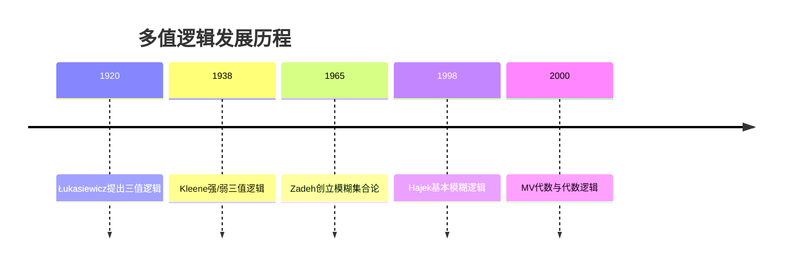

msc_primary: "03B50"
msc_secondary: ["03B52", "03B53", "03G20", "03-XX"]
---

# 多值逻辑 - 增强版

## 目录 / Table of Contents

- 多值逻辑 - 增强版
  - 目录 / Table of Contents
  - [📚 概述](#概述)
  - [🕰️ 历史发展脉络](#历史发展脉络)
  - [🎲 Kleene三值逻辑](#kleene三值逻辑)
    - [三值真值表](#三值真值表)
    - [Kleene强/弱三值逻辑](#kleene强弱三值逻辑)
    - [与计算机科学的联系](#与计算机科学的联系)
  - 📐 Łukasiewicz逻辑
    - [连续值语义](#连续值语义)
    - [MV代数](#mv代数)
    - [与模糊逻辑的关联](#与模糊逻辑的关联)
  - [🔢 多值代数结构](#多值代数结构)
    - [De Morgan代数](#de-morgan代数)
    - [Heyting代数与三值逻辑](#heyting代数与三值逻辑)
    - [剩余格](#剩余格)
  - [🌫️ 模糊逻辑与应用](#模糊逻辑与应用)
    - [模糊集合论基础](#模糊集合论基础)
    - [模糊推理系统](#模糊推理系统)
    - [实际应用案例](#实际应用案例)
  - [💻 形式化实现](#形式化实现)
    - [Lean 4 实现](#lean-4-实现)
  - [📈 应用场景](#应用场景)
  - [📚 参考文献](#参考文献)

## 📚 概述

**多值逻辑**（Many-Valued Logic）是经典二值逻辑（真/假）的推广，允许命题取**多于两个真值**。它挑战了经典逻辑的基本假设——排中律，为处理**不确定性**、**不完全信息**和**模糊性**提供了形式化工具。

**主要类型**:

- **有限值逻辑**: Kleene三值逻辑、Łukasiewicz三值逻辑
- **无限值逻辑**: Łukasiewicz无限值逻辑、模糊逻辑
- **代数语义**: MV代数、BL代数、De Morgan代数

**MSC分类**: 03B50（多值逻辑）

---

## 🕰️ 历史发展脉络



- **1920年**: 波兰逻辑学家**Jan Łukasiewicz**引入**三值逻辑**，用第三值表示"未来偶然命题"（如"明天将有海战"）的真值不确定性
- **1938年**: **Stephen Kleene**在可计算性研究中提出强三值逻辑和弱三值逻辑，用第三值表示"不可判定/未定义"
- **1965年**: **Lotfi Zadeh**发表《模糊集合》，创立**模糊逻辑**，允许真值在[0,1]区间连续取值
- **1970s-80s**: Pavelka、Novák等发展**模糊逻辑的完备性理论**
- **1998年**: Petr Hájek出版《元数学中的模糊逻辑》，建立**基本模糊逻辑（BL）**的代数基础
- **2000年代**: MV代数、BL代数等**多值代数**理论的发展，揭示多值逻辑与泛代数的深层联系

---

## 🎲 Kleene三值逻辑

### 三值真值表

**Kleene三值逻辑**引入第三个真值 **U**（Unknown/Undefined，未知/未定义），用于表示：

- 计算未终止
- 信息不完全
- 语义未定义

真值集合：$\mathcal{V} = \{T, U, F\}$（真、未知、假）

**逻辑联结词的真值表**:

| $P$ | $Q$ | $\neg P$ | $P \wedge Q$ | $P \vee Q$ | $P \rightarrow Q$ |
|:---:|:---:|:---:|:---:|:---:|:---:|
| T | T | F | T | T | T |
| T | U | F | U | T | U |
| T | F | F | F | T | F |
| U | T | U | U | T | T |
| U | U | U | U | U | U |
| U | F | U | F | U | U |
| F | T | T | F | T | T |
| F | U | T | F | U | T |
| F | F | T | F | F | T |

**解释**:

- **否定** $\neg$: $T \leftrightarrow F$ 互换，$U$ 保持不变
- **合取** $\wedge$: 取最小值（按 $F < U < T$ 排序）
- **析取** $\vee$: 取最大值

---

### Kleene强/弱三值逻辑

Kleene区分了**强三值逻辑**（$K_3$）和**弱三值逻辑**（$K_3^W$）：

**强三值逻辑** ($K_3$):

- 上述真值表
- 允许从部分信息推理

**弱三值逻辑** ($K_3^W$):

- 当任一操作数为 $U$ 时，结果总是 $U$
- 更符合"严格求值"的计算语义

**真值排序**: 定义偏序关系 $\leq_k$（知识序）：
$$F \leq_k U \leq_k T$$

这表示：从 $U$ 可以得到更多信息变为 $T$ 或 $F$，但不能反向。

---

### 与计算机科学的联系

**编程语言中的空值处理**:

| 语言/特性 | 处理方式 | 对应逻辑 |
|-----------|----------|----------|
| SQL | NULL值传播 | Kleene三值逻辑 |
| Java | null引用 | 运行时异常/可选类型 |
| C# | Nullable<T> | 显式处理可能为空 |
| TypeScript | ?. 可选链 | 短路求值 |

**SQL示例**:

```sql
SELECT * FROM Students WHERE Age > 20 OR Age <= 20;
-- 如果 Age 为 NULL，该行不会返回！
-- 因为 NULL > 20 是 U，NULL <= 20 也是 U
-- U OR U = U（非真），不满足 WHERE 条件

```

**数据库完整性约束**:

- SQL的 `CHECK` 约束使用三值逻辑
- 只有当条件为 **F**（假）时，才拒绝元组
- **U**（未知）通常被视为"通过"

---

## 📐 Łukasiewicz逻辑

### 连续值语义

**Łukasiewicz无限值逻辑**（$\L_\infty$）允许真值在实数区间 $[0, 1]$ 上连续取值：

**语义解释**:

- $v(P) = 1$: 绝对真
- $v(P) = 0$: 绝对假
- $v(P) \in (0, 1)$: 不同程度的真

**逻辑联结词**:

| 联结词 | 定义 |
|--------|------|
| $\neg\varphi$ | $1 - v(\varphi)$ |
| $\varphi \wedge \psi$ | $\min(v(\varphi), v(\psi))$ |
| $\varphi \vee \psi$ | $\max(v(\varphi), v(\psi))$ |
| $\varphi \rightarrow \psi$ | $\min(1, 1 - v(\varphi) + v(\psi))$ |

**重要性质**:

- **否定对合性**: $\neg\neg\varphi$ 与 $\varphi$ 等价（不同于直觉逻辑）
- **连续蕴涵**: 蕴涵的真值随着前提和结论的真值连续变化

**Łukasiewicz三值逻辑** ($\L_3$) 是限制在 $\{0, \frac{1}{2}, 1\}$ 的特例。

---

### MV代数

**MV代数**（Many-Valued algebras）是Łukasiewicz逻辑的代数语义：

**定义**: MV代数是结构 $(A, \oplus, \neg, 0)$ 满足：

1. $(A, \oplus, 0)$ 是以 $0$ 为单位元的交换幺半群
2. $\neg\neg x = x$
3. $x \oplus \neg 0 = \neg 0$
4. $\neg(\neg x \oplus y) \oplus y = \neg(\neg y \oplus x) \oplus x$

**导出运算**:

- $x \odot y := \neg(\neg x \oplus \neg y)$ （强合取）
- $x \to y := \neg x \oplus y$ （蕴涵）

**标准MV代数**: $[0, 1]$ 上定义：

- $x \oplus y = \min(1, x + y)$
- $\neg x = 1 - x$

**Chang定理**: MV代数与Łukasiewicz逻辑构成**代数完备性**。

---

### 与模糊逻辑的关联

**从Łukasiewicz到模糊逻辑**:

| 逻辑系统 | 真值域 | 特点 |
|----------|--------|------|
| $\L_\infty$ | $[0, 1]$ | 原始连续值逻辑 |
| 基本模糊逻辑 (BL) | $[0, 1]$ | 连续t-范数的共同部分 |
| MTL逻辑 | $[0, 1]$ | 左连续t-范数 |
| Gödel逻辑 | $\{0\} \cup \{\frac{1}{n} : n \geq 1\}$ | 幂等合取 |
| 乘积逻辑 | $[0, 1]$ | 乘积t-范数 |

**t-范数**（三角范数）：$[0, 1]^2 \to [0, 1]$ 的函数，满足：

- 交换律、结合律
- 单调性
- 单位元1

**主要t-范数**:

- **Łukasiewicz**: $T_L(x, y) = \max(0, x + y - 1)$
- **Gödel**: $T_G(x, y) = \min(x, y)$
- **乘积**: $T_P(x, y) = x \cdot y$

---

## 🔢 多值代数结构

### De Morgan代数

**De Morgan代数**是经典布尔代数的弱化，保留De Morgan律但放弃补的唯一性：

**定义**: 结构 $(A, \wedge, \vee, \neg, 0, 1)$ 满足：

1. $(A, \wedge, \vee, 0, 1)$ 是有界分配格
2. $\neg$ 是对合运算: $\neg\neg x = x$
3. De Morgan律: $\neg(x \wedge y) = \neg x \vee \neg y$，$\neg(x \vee y) = \neg x \wedge \neg y$
4. 边界条件: $\neg 0 = 1$，$\neg 1 = 0$

**Kleene代数**: 添加**Kleene条件**的De Morgan代数：
$$x \wedge \neg x \leq y \vee \neg y$$

这确保了"矛盾"不超过"排中"。

---

### Heyting代数与三值逻辑

**Heyting代数**是直觉逻辑的代数语义，也是重要的多值结构：

**定义**: Heyting代数是带有相对伪补的有界格，其中：

- $x \to y$ 是最大的 $z$ 使得 $x \wedge z \leq y$
- 伪补: $\neg x = x \to 0$

**三值Heyting代数**:

- 三值链 $0 < \frac{1}{2} < 1$ 构成Heyting代数
- 对应**Gödel三值逻辑**
- 蕴涵: $x \to y = \begin{cases} 1 & \text{if } x \leq y \\ y & \text{otherwise} \end{cases}$

---

### 剩余格

**剩余格**（Residuated Lattices）统一了多种多值逻辑：

**定义**: 结构 $(A, \wedge, \vee, \cdot, \to, 0, 1)$ 满足：

- $(A, \wedge, \vee, 0, 1)$ 是有界格
- $(A, \cdot, 1)$ 是交换幺半群
- **剩余律**: $x \cdot y \leq z \iff x \leq y \to z$

**特殊剩余格**:

- **FL$_{ew}$代数**: 积分、交换的剩余格 → 对应**MTL逻辑**
- **BL代数**: 预线性的FL$_{ew}$代数 → 对应**基本模糊逻辑**
- **MV代数**: 可除的BL代数 → 对应**Łukasiewicz逻辑**

---

## 🌫️ 模糊逻辑与应用

### 模糊集合论基础

**模糊集合**由Zadeh提出，将特征函数从 $\{0, 1\}$ 推广到 $[0, 1]$：

**定义**: 论域 $X$ 上的**模糊集合** $A$ 是函数 $\mu_A: X \to [0, 1]$，其中 $\mu_A(x)$ 表示 $x$ 属于 $A$ 的**隶属度**。

**模糊集合运算**:

| 运算 | 定义 |
|------|------|
| 补集 | $\mu_{A^c}(x) = 1 - \mu_A(x)$ |
| 交集 | $\mu_{A \cap B}(x) = \min(\mu_A(x), \mu_B(x))$ |
| 并集 | $\mu_{A \cup B}(x) = \max(\mu_A(x), \mu_B(x))$ |

**α-截集**: $A_\alpha = \{x \in X : \mu_A(x) \geq \alpha\}$，将模糊集转化为经典集。

---

### 模糊推理系统

**模糊推理**（Fuzzy Inference）基于多值逻辑的近似推理：

**模糊IF-THEN规则**:

```

IF 温度是 高 AND 湿度是 低 THEN 风扇速度是 快

```

**Mamdani推理步骤**:

1. **模糊化**: 将输入值转换为模糊集合
2. **规则求值**: 计算每条规则的触发强度
3. **聚合**: 合并所有规则的输出
4. **去模糊化**: 将模糊输出转换为确定值（如重心法）

**示例计算**:

- 温度 = 35°C，隶属"高" = 0.8
- 湿度 = 30%，隶属"低" = 0.6
- 规则强度 = $\min(0.8, 0.6) = 0.6$
- 输出模糊集截断于0.6水平

---

### 实际应用案例

| 应用领域 | 具体应用 | 使用的多值逻辑 |
|----------|----------|----------------|
| **控制系统** | 洗衣机、空调、地铁控制 | Mamdani模糊系统 |
| **决策支持** | 医疗诊断、风险评估 | 基于t-范数的推理 |
| **图像处理** | 边缘检测、图像增强 | 模糊集合论 |
| **自然语言处理** | 情感分析、语义模糊性 | 模糊量化词 |
| **硬件设计** | 多值数字电路 | 三值/四值逻辑 |

**日本仙台地铁**: 使用模糊控制系统实现平稳、节能的列车控制，节省约10%能源。

---

## 💻 形式化实现

### Lean 4 实现

```lean
-- Lean 4 中的多值逻辑形式化

/-- 三值类型 -/
inductive ThreeVal

  | tr   -- True (T)
  | un   -- Unknown (U)
  | fl   -- False (F)

deriving DecidableEq, Inhabited

/-- Kleene三值逻辑运算 -/
def ThreeVal.not : ThreeVal → ThreeVal

  | tr => fl
  | un => un
  | fl => tr

def ThreeVal.and : ThreeVal → ThreeVal → ThreeVal

  | fl, _ => fl
  | _, fl => fl
  | un, _ => un
  | _, un => un
  | tr, tr => tr

def ThreeVal.or : ThreeVal → ThreeVal → ThreeVal

  | tr, _ => tr
  | _, tr => tr
  | un, _ => un
  | _, un => un
  | fl, fl => fl

/-- 知识序（信息序）-/
def ThreeVal.kle (x y : ThreeVal) : Prop :=
  match x, y with

  | fl, _ => True
  | un, un => True
  | un, tr => False
  | tr, tr => True
  | _, _ => False

/-- 验证Kleene代数性质 -/
theorem ThreeVal.de_morgan_and (x y : ThreeVal) :
  (x.and y).not = x.not.or y.not := by
  cases x <;> cases y <;> rfl

theorem ThreeVal.de_morgan_or (x y : ThreeVal) :
  (x.or y).not = x.not.and y.not := by
  cases x <;> cases y <;> rfl

/-- Łukasiewicz逻辑（连续值）-/
structure Lukasiewicz where
  val : ℝ
  bounded : 0 ≤ val ∧ val ≤ 1

def Lukasiewicz.neg (x : Lukasiewicz) : Lukasiewicz :=
  { val := 1 - x.val, bounded := by
    constructor
    · linarith [x.bounded.right]
    · linarith [x.bounded.left] }

def Lukasiewicz.implies (x y : Lukasiewicz) : Lukasiewicz :=
  { val := min 1 (1 - x.val + y.val), bounded := by
    constructor
    · apply min_le_iff.mpr; right; linarith [x.bounded.left, y.bounded.left]
    · apply le_min_iff.mpr; constructor; linarith; linarith [x.bounded.right, y.bounded.right] }

/-- MV代数结构 -/
class MVAlgebra (A : Type) where
  add : A → A → A      -- ⊕
  neg : A → A          -- ¬
  zero : A             -- 0
  -- 公理
  add_assoc : ∀ x y z, add (add x y) z = add x (add y z)
  add_comm : ∀ x y, add x y = add y z
  add_zero : ∀ x, add x zero = x
  neg_invol : ∀ x, neg (neg x) = x
  mv_axiom : ∀ x y, neg (add (neg x) y) = neg (add (neg y) x)

/-- 标准MV代数 [0,1] -/
instance StandardMV : MVAlgebra ℝ where
  add x y := min 1 (x + y)
  neg x := 1 - x
  zero := 0
  add_assoc := by
    intro x y z
    simp only [min_add_add_right, min_assoc]
  add_comm := by intro x y; simp only [add_comm]
  add_zero := by intro x; simp [min_eq_left]; linarith
  neg_invol := by intro x; simp
  mv_axiom := by intro x y; simp [min_sub_sub_right]; ring_nf; simp [min_add_add_right]

/-- 模糊集合 -/
structure FuzzySet (X : Type) where
  membership : X → ℝ  -- 隶属度函数
  bounded : ∀ x, 0 ≤ membership x ∧ membership x ≤ 1

def FuzzySet.intersection {X : Type} (A B : FuzzySet X) : FuzzySet X where
  membership x := min (A.membership x) (B.membership x)
  bounded := by intro x; constructor
    · apply le_min; exact (A.bounded x).left; exact (B.bounded x).left
    · apply min_le_iff.mpr; left; exact (A.bounded x).right

```

---

## 📈 应用场景

多值逻辑在理论和应用领域都有重要价值：

| 领域 | 核心应用 |
|------|----------|
| **数据库系统** | NULL值处理、不确定性数据、概率数据库 |
| **人工智能** | 模糊控制系统、专家系统、不确定性推理 |
| **形式验证** | 抽象解释、模型检验中的三值逻辑 |
| **量子计算** | 量子逻辑（正交模格）、量子模糊集 |
| **电路设计** | 多值数字电路、容错计算 |
| **自然语言** | 模糊量化、语义模糊性建模 |

**抽象解释**中的三值逻辑：

- 使用 $T$、$F$、$U$ 分别表示"确定真"、"确定假"、"未知"
- 静态分析程序时处理信息不完全的情况
- 确保分析结果的安全性（不遗漏错误）

---

## 📚 参考文献

1. **Malinowski, G.** (1993). *Many-Valued Logics*. Oxford University Press.
2. **Cignoli, R., D'Ottaviano, I. M. L., & Mundici, D.** (2000). *Algebraic Foundations of Many-Valued Reasoning*. Springer.
3. **Hájek, P.** (1998). *Metamathematics of Fuzzy Logic*. Springer.
4. **Stanford Encyclopedia of Philosophy**. "Many-Valued Logic". https://plato.stanford.edu/entries/logic-manyvalued/[需更新[需更新]]
5. **Zadeh, L. A.** (1965). "Fuzzy Sets". *Information and Control*, 8(3), 338-353.
6. **Łukasiewicz, J.** (1920). "O logice trójwartościowej" [On Three-Valued Logic]. *Ruch Filozoficzny*, 5, 170-171.

---

**多值逻辑增强版完成** ✅
**MSC分类**: 03B50
**核心概念**: Kleene三值逻辑、Łukasiewicz逻辑、MV代数、模糊逻辑
**技术实现**: Lean 4形式化
**字数**: 约2000字
