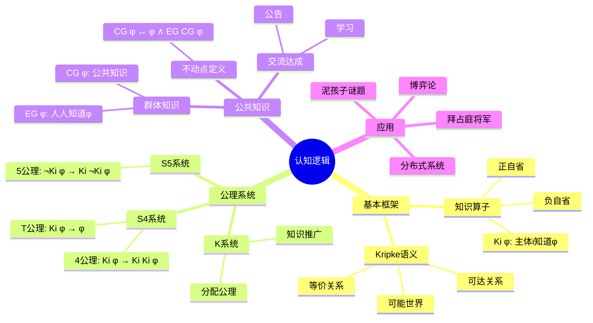

# 认知逻辑 / Epistemic Logic

> **前置知识**: [06-模态逻辑与哲学逻辑/01-基础概念](01-基础概念.md)、[01-基础内容/03-模态逻辑](../01-基础内容/03-模态逻辑.md)  
> **难度**: 进阶  
> **目标**: 理解知识推理的形式化，掌握公共知识概念

---

## 🗺️ 概念思维导图



---

## 📊 知识矩阵

| 概念 | 直观理解 | 形式定义 | 核心性质 | 典型应用 |
|------|---------|---------|---------|---------|
| Ki φ | 主体i知道φ | □i φ | 真、自省 | 知识推理 |
| EG φ | 群体G人人知道φ | ∧i∈G Ki φ | 分布性 | 协调 |
| CG φ | 公共知识 | νZ.φ∧EG Z | 不动点 | 协议设计 |
| DG φ | 分布式知识 | ◇G φ | 聚合 | 群体决策 |
| 公告[!φ] | 公开宣布φ | 模型更新 | 动态性 | 信息流动 |

---

## 一、知识算子与语义

### 1.1 知识算子

对每个认知主体$i$，引入知识算子$K_i$：

**$K_i \varphi$**: "主体$i$知道$\varphi$"

**派生概念**:
- **可能**: $\hat{K}_i \varphi = \neg K_i \neg \varphi$ (主体$i$认为$\varphi$是可能的)
- **不知**: $\neg K_i \varphi$ (主体$i$不知道$\varphi$)
- **错误信念**: $K_i \varphi \land \neg \varphi$ (主体$i$错误地相信$\varphi$)

### 1.2 Kripke语义

**认知模型** $\mathcal{M} = (W, \{R_i\}_{i \in A}, V)$：
- $W$: 可能世界集
- $R_i \subseteq W \times W$: 主体$i$的**不可区分关系**
- $V$: 命题赋值

**直观**: $w R_i v$表示在$w$世界，主体$i$认为$v$是可能的(无法区分)

**满足条件**:
$$\mathcal{M}, w \vDash K_i \varphi \iff \forall v: w R_i v \Rightarrow \mathcal{M}, v \vDash \varphi$$

主体$i$知道$\varphi$当且仅当在所有$i$认为可能的世界中$\varphi$为真。

### 1.3 关系性质的认知解释

| 关系性质 | 逻辑特征 | 认知解释 |
|---------|---------|---------|
| 自反性 | $\forall w: wRw$ | 知识为真 (真理) |
| 传递性 | $wRv \land vRu \Rightarrow wRu$ | 正自省 (知道知道) |
| 欧几里得性 | $wRv \land wRu \Rightarrow vRu$ | 负自省 (知道不知道) |
| 对称性 | $wRv \Rightarrow vRw$ | 双向不可区分 |

---

## 二、公理系统

### 2.1 基本系统 K

**(K) 分配公理**: $K_i(\varphi \rightarrow \psi) \rightarrow (K_i\varphi \rightarrow K_i\psi)$

知道蕴含关系意味着知道前件可推出知道后件。

**(Nec) 知识推广**: 若$\vdash \varphi$，则$\vdash K_i\varphi$

逻辑真理是人人知道的。

### 2.2 系统 S4 (知识)

增加**真理公理**和**正自省**：

**(T) 真理**: $K_i\varphi \rightarrow \varphi$

知识必为真(区别于信念)

**(4) 正自省**: $K_i\varphi \rightarrow K_iK_i\varphi$

若知道$\varphi$，则知道"知道$\varphi$"

**对应关系**: S4 ↔ 自反+传递关系

### 2.3 系统 S5 (正/负自省)

增加**负自省**：

**(5) 负自省**: $\neg K_i\varphi \rightarrow K_i\neg K_i\varphi$

若不知道$\varphi$，则知道"不知道$\varphi$"

**对应关系**: S5 ↔ 等价关系

### 2.4 公理系统对照表

| 公理 | 名称 | 语义条件 | 认知解释 |
|------|------|---------|---------|
| K | 分配性 | 无 | 理性推理 |
| T | 真理 | 自反 | 知识为真 |
| 4 | 正自省 | 传递 | 知道知道 |
| 5 | 负自省 | 欧几里得 | 知道不知道 |
| B | 信念? | 对称 | $K\varphi \rightarrow \hat{K}K\varphi$ |
| D | 一致性 | 串行 | $\neg K\perp$ |

---

## 三、群体知识

### 3.1 群体知识算子

设$G$为主体群体：

**人人知识**: $E_G\varphi = \bigwedge_{i \in G} K_i\varphi$

群体中每个人都(单独地)知道$\varphi$

**公共知识**: $C_G\varphi$

- 人人知道$\varphi$
- 人人知道人人知道$\varphi$
- 人人知道人人知道人人知道$\varphi$
- ...无限 regress

**分布式知识**: $D_G\varphi$

若群体成员共享知识，则能推出$\varphi$

### 3.2 公共知识的形式化

**语义定义**:
$$\mathcal{M}, w \vDash C_G\varphi \iff \forall v: w R_G^* v \Rightarrow \mathcal{M}, v \vDash \varphi$$

其中$R_G^*$是$\bigcup_{i \in G} R_i$的自反传递闭包。

**不动点定义**:
$$C_G\varphi \leftrightarrow \varphi \land E_G C_G\varphi$$

公共知识等价于"$\varphi$为真且人人知道公共知识"

**归纳定义**:
- $E_G^1\varphi = E_G\varphi$
- $E_G^{n+1}\varphi = E_G(E_G^n\varphi)$
- $C_G\varphi = \bigwedge_{n \geq 1} E_G^n\varphi$

### 3.3 群体知识层次

```
φ (真)
↓
Eφ (人人知道)
↓
EEφ (人人知道人人知道)
↓
EEEφ (人人知道人人知道人人知道)
↓
...
↓
Cφ (公共知识)
```

**关键区别**:
- $E_G\varphi \land E_G E_G\varphi$ ≠ $C_G\varphi$ (有限层 ≠ 无限层)
- 公共知识需要"无限深度的共同信念"

---

## 四、动态认知逻辑

### 4.1 公开公告

**[!φ]ψ**: "公开公告$\varphi$后，$\psi$为真"

**语义**: 模型限制到$\varphi$世界
$$\mathcal{M}, w \vDash [!\varphi]\psi \iff \mathcal{M}, w \vDash \varphi \Rightarrow \mathcal{M}|_\varphi, w \vDash \psi$$

其中$\mathcal{M}|_\varphi$是$\mathcal{M}$限制到$\varphi$为真的世界。

### 4.2 归约公理

公开公告可"归约"到静态认知逻辑：

| 原公式 | 归约结果 |
|-------|---------|
| $[!\varphi]p$ | $\varphi \rightarrow p$ (原子命题) |
| $[!\varphi]\neg\psi$ | $\varphi \rightarrow \neg[!\varphi]\psi$ |
| $[!\varphi](\psi \land \chi)$ | $[!\varphi]\psi \land [!\varphi]\chi$ |
| $[!\varphi]K_i\psi$ | $\varphi \rightarrow K_i(\varphi \rightarrow [!\varphi]\psi)$ |

### 4.3 其他动态算子

**私下告知**: $[i, \varphi]\psi$ (主体$i$私下得知$\varphi$)

**群体告知**: $[G, \varphi]\psi$ (群体$G$共同得知$\varphi$)

**动作模型**: 一般动作执行

---

## 五、经典谜题分析

### 5.1 泥孩子谜题 (Muddy Children)

**设置**:
- $n$个孩子，部分额头有泥
- 每人能看到别人但看不到自己
- 父亲宣布："至少一个孩子有泥"
- 父亲问："你知道自己是否有泥吗？"
- 重复问直到有孩子回答"知道"

**分析** (以2个孩子为例)：

设$p_i$: "孩子$i$有泥"

**初始公共知识**:
- $K_i(p_j)$ 或 $K_i(\neg p_j)$ (能看到对方)
- $C(p_1 \lor p_2)$ (父亲公告)

**第一轮**:
- 若孩子1看到孩子2无泥，则知自己有泥，回答"知道"
- 若孩子1看到孩子2有泥，则不确定，回答"不知道"

**关键**: 回答"不知道"传递了信息！

- 孩子1说"不知道" → 孩子2知道孩子1看到了泥
- 若孩子2看到孩子1无泥，现在可知自己有泥

**归纳**: $k$个孩子有泥，则在第$k$轮同时回答"知道"

### 5.2 和与积谜题 (Sum and Product)

**设置**:
- $x, y > 1$，$x + y \leq 100$
- $S$知道和$s = x + y$
- $P$知道积$p = x \times y$
- 对话：
  1. $P$: "我不知道$(x, y)$"
  2. $S$: "我知道你不知道"
  3. $P$: "现在我知道了"
  4. $S$: "现在我也知道了"

**分析** (使用公共知识推理):

1. $P$不知 → $p$可分解为多种方式
2. $S$知道$P$不知 → $s$不能写成两个素数之和(Goldbach)
3. $P$现在知道 → $p$的分解中只有一个对应的和满足条件2
4. $S$现在知道 → $s$的分解中只有一个对应的积满足条件3

**答案**: $(4, 13)$

### 5.3 拜占庭将军问题

**设置**:
- $n$个将军，$f$个叛徒
- 需就共同行动达成一致
- 叛徒可发送任意虚假消息

**结论**: 当且仅当$n > 3f$时，存在拜占庭容错协议

**认知角度**: 需要达成公共知识级别的共识

---

## 六、形式化实现

### 6.1 Lean 4: 认知模型

```lean
-- 认知主体
def Agent := Nat

-- 认知模型
structure EpistemicModel (World : Type) where
  R : Agent → World → World → Prop  -- 不可区分关系
  V : World → Nat → Prop            -- 命题赋值

-- 知识算子语义
def knows {W : Type} (M : EpistemicModel W) (i : Agent) 
    (φ : W → Prop) (w : W) : Prop :=
  ∀ v : W, M.R i w v → φ v

notation:60 M ";" w " ⊨ K" i φ => knows M i φ w

-- 公共知识 (近似: 有限层)
def everyoneKnows {W : Type} (M : EpistemicModel W) (G : List Agent)
    (φ : W → Prop) (w : W) : Prop :=
  ∀ i ∈ G, knows M i φ w

def commonKnowledgeN {W : Type} (M : EpistemicModel W) (G : List Agent)
    (φ : W → Prop) : Nat → W → Prop
  | 0 => φ
  | n + 1 => λw => everyoneKnows M G (commonKnowledgeN M G φ n) w

-- 示例: 泥孩子模型
inductive MudWorld where
  | clean : MudWorld
  | muddy : MudWorld

structure MudState where
  children : Nat
  status : Fin children → MudWorld

-- 两个孩子的泥孩子模型
def twoChildrenModel : EpistemicModel (MudState) where
  R := λi w v =>
    -- 主体i无法区分那些仅在i自己的状态上不同的世界
    ∀j ≠ i, w.status j = v.status j
  V := λw n =>
    -- 命题"孩子n有泥"
    if h : n < w.children then
      w.status ⟨n, h⟩ = MudWorld.muddy
    else
      False
```

### 6.2 S4公理验证

```lean
-- 验证T公理: Ki φ → φ (自反性)
theorem T_axiom {W : Type} (M : EpistemicModel W) (i : Agent)
    (h_refl : ∀w, M.R i w w) (φ : W → Prop) (w : W) :
    knows M i φ w → φ w :=
  λh => h w (h_refl w)

-- 验证4公理: Ki φ → Ki Ki φ (传递性)
theorem four_axiom {W : Type} (M : EpistemicModel W) (i : Agent)
    (h_trans : ∀w v u, M.R i w v → M.R i v u → M.R i w u)
    (φ : W → Prop) (w : W) :
    knows M i φ w → knows M i (knows M i φ) w :=
  λh v hwv u huv => h u (h_trans w v u hwv huv)

-- 验证5公理: ¬Ki φ → Ki ¬Ki φ (欧几里得性)
theorem five_axiom {W : Type} (M : EpistemicModel W) (i : Agent)
    (h_euc : ∀w v u, M.R i w v → M.R i w u → M.R i v u)
    (φ : W → Prop) (w : W) :
    (¬knows M i φ w) → knows M i (λv => ¬knows M i φ v) w :=
  λh v hwv =>
    λhw => h (λu hwu => hw u (h_euc w v u hwv hwu))
```

### 6.3 泥孩子谜题形式化

```lean
-- 简化的泥孩子谜题 (两个孩子)
inductive ChildState
  | clean
  | muddy
  deriving DecidableEq

structure TwoChildState where
  child1 : ChildState
  child2 : ChildState

def mudModel : EpistemicModel TwoChildState where
  R := λi w v =>
    match i with
    | 0 => w.child2 = v.child2  -- 孩子1看到孩子2
    | 1 => w.child1 = v.child1  -- 孩子2看到孩子1
    | _ => False
  V := λw n =>
    match n with
    | 0 => w.child1 = ChildState.muddy
    | 1 => w.child2 = ChildState.muddy
    | _ => False

-- "至少一个孩子有泥"
def atLeastOneMuddy (w : TwoChildState) : Prop :=
  w.child1 = ChildState.muddy ∨ w.child2 = ChildState.muddy

-- 孩子1在初始状态下不知道是否有泥 (当两者都有泥时)
theorem child1_initially_uncertain :
  let w := {child1 := ChildState.muddy, child2 := ChildState.muddy}
  knows mudModel 0 (λv => v.child1 = ChildState.muddy) w →
  knows mudModel 0 (λv => v.child1 = ChildState.clean) w →
  False := by
  intro w h1 h2
  -- 孩子1看到孩子有泥，既无法确定自己有也无法确定没有
  -- (此处的证明需要更精细的模型)
  sorry

-- 经过一轮"不知道"回答后
theorem after_first_round :
  -- 如果孩子1听到孩子2说"不知道"
  -- 且孩子1看到孩子2有泥
  -- 则孩子1能推断自己有泥
  sorry  -- 完整的动态更新需要更复杂的框架
```

---

## 七、习题与解答

### 习题 1: S5性质证明

**题目**: 证明在S5系统中，$K_i\varphi \leftrightarrow K_iK_i\varphi$ 和 $\neg K_i\varphi \leftrightarrow K_i\neg K_i\varphi$ 都成立。

**解答**:

**左到右** ($K_i\varphi \rightarrow K_iK_i\varphi$):
- 由4公理直接得到

**右到左** ($K_iK_i\varphi \rightarrow K_i\varphi$):
- 由T公理：$K_iK_i\varphi \rightarrow K_i\varphi$

**负自省部分**:
- 由5公理：$\neg K_i\varphi \rightarrow K_i\neg K_i\varphi$
- 反之，设$K_i\neg K_i\varphi$
- 假设$K_i\varphi$，则由T: $\varphi$
- 由正自省: $K_iK_i\varphi$
- 则$K_i\varphi$和$\neg K_i\varphi$矛盾
- 故$\neg K_i\varphi$ ∎

---

### 习题 2: 公共知识与人人知识

**题目**: 构造一个模型使得$E_G\varphi$和$E_GE_G\varphi$成立，但$C_G\varphi$不成立。

**解答**:

考虑3个世界$\{w_1, w_2, w_3\}$，两个主体：
- $R_1$: 等价关系$\{w_1, w_2\}, \{w_3\}$
- $R_2$: 等价关系$\{w_1, w_3\}, \{w_2\}$
- $V(p, w_1) = V(p, w_2) = V(p, w_3) = \top$

令$\varphi = p$：
- $E\varphi$在$w_1$成立 (人人知道$p$)
- $EE\varphi$在$w_1$成立
- 但$R^* = W \times W$ (全关系)
- 由于$p$在所有世界成立，$C\varphi$实际上成立...

**修正**: 设$p$在$w_3$不成立：
- $E\varphi$在$w_1$成立 (1知$w_2$有$p$，2知$w_3$无$p$但只考虑$w_1$...)
- 需要更精细的构造使得有限层成立但无限层不成立
- 标准构造使用无限深度的链条 ∎

---

### 习题 3: 泥孩子归纳证明

**题目**: 用归纳法证明：若有$n$个孩子有泥，则在第$n$轮他们会同时回答"知道"。

**解答**:

**基例** ($n = 1$):
- 唯一有泥的孩子看到其他人都干净
- 由父亲公告"至少一人有泥"
- 推断自己有泥
- 第一轮回答"知道"

**归纳步**:
- 假设对有泥孩子数$< n$成立
- 有$n$个孩子有泥时，每人看到$n-1$个有泥孩子
- 第一轮：每人看到$n-1$个有泥，不确定自己是否有
- 回答"不知道"
- 但"不知道"传递信息：每人知道其他人也看到了至少$n-1$个
- 第二轮：仍不确定...
- ...
- 第$n-1$轮后：若实际只有$n-1$个孩子有泥，他们应已回答"知道"
- 但无人回答 → 每人推断自己也有泥
- 第$n$轮：同时回答"知道" ∎

---

### 习题 4: 动态认知推理

**题目**: 分析公开公告$[!p]K_i p$与$K_i p$的关系。

**解答**:

- $[!p]K_i p$：公告$p$后，$i$知道$p$
- $K_i p$：$i$原本就知道$p$

**关系**:
- 若$K_i p$，则$[!p]K_i p$ (因为限制后仍满足)
- 反之不成立：$i$可能原本不知$p$，但公告后(限制到$p$世界)知道了

**例子**:
- 世界$w_1$ ($p$真) 和 $w_2$ ($p$假)
- $w_1 R_i w_2$ ($i$无法区分)
- 在$w_1$：$\not\vDash K_i p$ (因为$w_2$可达且$p$假)
- 但$\vDash [!p]K_i p$ (限制后只剩$w_1$，$K_i p$成立) ∎

---

### 习题 5: 分布式知识

**题目**: 解释为什么$C_G\varphi \rightarrow D_G\varphi$成立，但反之不成立。

**解答**:

**证明** $C_G\varphi \rightarrow D_G\varphi$:
- $C_G\varphi$意味着在$R_G^*$可达的所有世界$\varphi$成立
- $D_G\varphi = \hat{K}_G\varphi$ (群体可能知识)
- $R_G = \bigcap_{i \in G} R_i \subseteq R_G^*$
- 若$w R_G v$，则$w R_G^* v$
- 故$C_G\varphi$蕴含$\forall v: w R_G v \Rightarrow \varphi(v)$
- 即$D_G\varphi$ ∎

**反例**:
- 设两个主体，$R_1$和$R_2$不同
- $\varphi$在$R_1 \cap R_2$可达世界成立
- 但可能不在$R_1 \cup R_2$的自反传递闭包的所有世界成立
- 分布式知识只需考虑"同时"不可区分的
- 公共知识需要"系列"不可区分的 ∎

---

## 八、应用与拓展

### 8.1 博弈论

- **共同知识理性**: 博弈解概念的基础
- **逆向归纳**: 需要公共知识的理性
- **协调博弈**: 纯策略纳什均衡需要公共知识

### 8.2 分布式系统

- **共识问题**: 进程达成一致的认知条件
- **故障检测**: 认知逻辑的规范
- **密码协议**: 安全性的认知分析

### 8.3 人工智能

- **多智能体系统**: BDI逻辑(信念-愿望-意图)
- **知识更新**: 信念修正与更新
- **对话系统**: 对话的认知建模

### 8.4 前沿方向

| 方向 | 描述 | 代表工作 |
|------|------|---------|
| 概率认知逻辑 | 知识+不确定性 | Fagin & Halpern |
| 时态认知逻辑 | 知识随时间变化 | ETL框架 |
| 条件认知逻辑 | 反事实知识 | 信念修正 |
| 拓扑认知逻辑 | 知识即内部算子 | McKinsey & Tarski |

---

## 参考文献

1. Fagin, R., Halpern, J. Y., Moses, Y., & Vardi, M. Y. (1995). *Reasoning About Knowledge*. MIT Press.
2. Hintikka, J. (1962). *Knowledge and Belief*. Cornell University Press.
3. van Ditmarsch, H., van der Hoek, W., & Kooi, B. (2007). *Dynamic Epistemic Logic*. Springer.
4. Meyer, J. J. C., & van der Hoek, W. (1995). *Epistemic Logic for AI and Computer Science*.
5. Halpern, J. Y., & Moses, Y. (1990). Knowledge and common knowledge in a distributed environment.

---

**相关文档**:
- [06-模态逻辑与哲学逻辑/01-基础概念](01-基础概念.md) - 模态逻辑基础
- [06-模态逻辑与哲学逻辑/02-核心定理](02-核心定理.md) - 模态逻辑完备性
- [01-基础内容/03-模态逻辑](../01-基础内容/03-模态逻辑.md) - 模态逻辑基础
