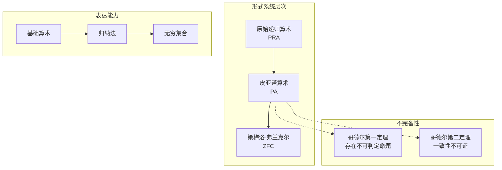
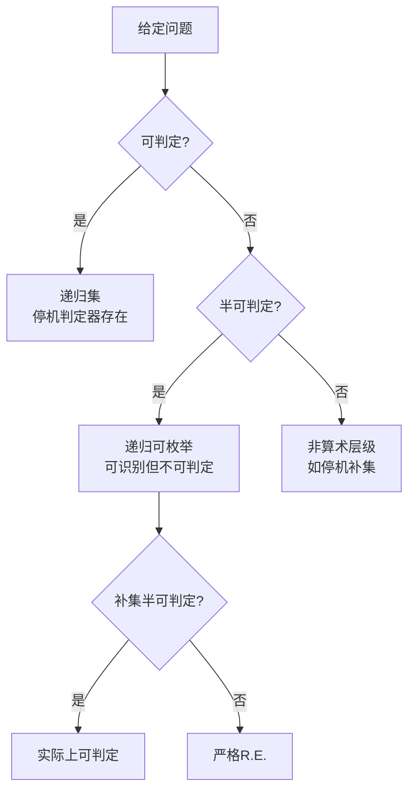
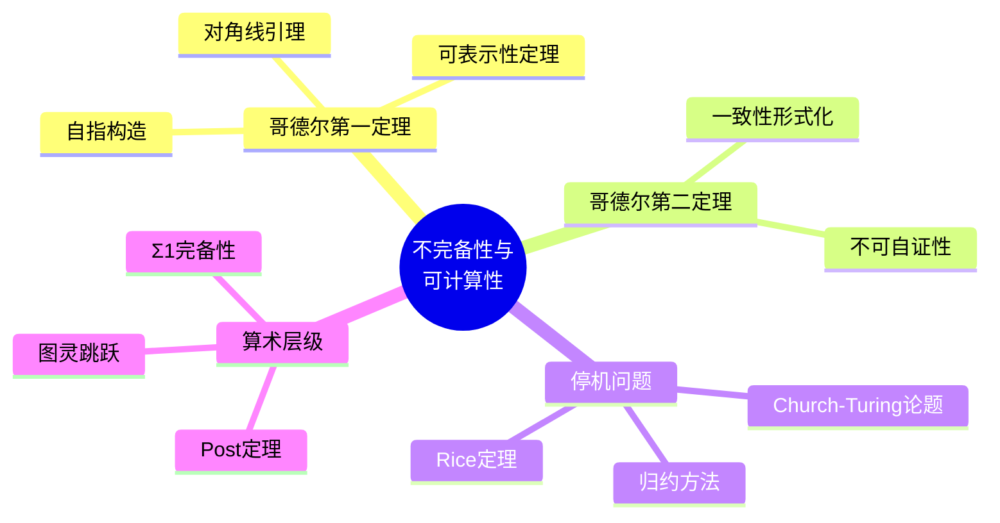

---
references:
  textbooks:
    - id: enderton_logic
      type: textbook
      title: A Mathematical Introduction to Logic
msc_primary: 03A99
      authors:
      - Herbert B. Enderton
      publisher: Academic Press
      edition: 2nd
      year: 2001
      isbn: 978-0122384523
      msc: 03-01
      chapters: 
      url: ~
    - id: mendelson_logic
      type: textbook
      title: Introduction to Mathematical Logic
      authors:
      - Elliott Mendelson
      publisher: Chapman and Hall/CRC
      edition: 6th
      year: 2015
      isbn: 978-1482237725
      msc: 03-01
      chapters: 
      url: ~
  databases:
    - id: nlab
      type: database
      name: nLab
      entry_url: "https://ncatlab.org/nlab/show/{entry}"
      consulted_at: 2026-04-17
    - id: stacks_project
      type: database
      name: Stacks Project
      entry_url: "https://stacks.math.columbia.edu/tag/{tag}"
      consulted_at: 2026-04-17
    - id: zbmath
      type: database
      name: zbMATH Open
      entry_url: "https://zbmath.org/?q=an:{zb_id}"
      consulted_at: 2026-04-17
---
# 哥德尔不完备定理与可计算性理论基础

---

## 1. 概念深度分析

### 1.1 形式系统的层次结构



### 1.2 可计算性层次（算术层级）

| 层级 | 定义 | 典型问题 | 可判定性 |
|-----|------|---------|---------|
| **Δ₀** | 有界量词 | 基础算术 | ✅ 可判定 |
| **Σ₁** | ∃有界... | 丢番图方程解存在 | 🟡 半可判定 |
| **Π₁** | ∀有界... | 全称命题 | 🟡 余半可判定 |
| **Σ₂** | ∃∀... | - | ❌ 不可判定 |
| **算术层级** | 有限交替 | - | ❌ 一般不可判定 |

---

## 2. 属性与关系（含说明）

### 2.1 哥德尔第一不完备定理

**定理**：若形式系统 $T$ 满足：

1. $T$ 是协调的（无矛盾）
2. $T$ 包含皮亚诺算术（PA）
3. $T$ 的公理集是递归可枚举的

则存在命题 $G_T$（哥德尔句）使得 $T \not\vdash G_T$ 且 $T \not\vdash \neg G_T$。

**证明思路**（对角线法）：

**步骤1**：哥德尔编码

- 将公式、证明编码为自然数（哥德尔数）
- 元数学概念（"是公式"、"是证明"）变为算术谓词

**步骤2**：构造自指命题
定义谓词 $Proof_T(x, y)$：$x$ 是 $y$ 在 $T$ 中的证明的编码。

构造公式：
$$G_T : \equiv \forall x \neg Proof_T(x, \ulcorner G_T \urcorner)$$

即 "$G_T$ 在 $T$ 中不可证"。

**步骤3**：证明不可判定性

- 若 $T \vdash G_T$，则 $T \vdash \exists x Proof_T(x, \ulcorner G_T \urcorner)$，与 $G_T$ 矛盾
- 若 $T \vdash \neg G_T$，则 $T \vdash \exists x Proof_T(x, \ulcorner G_T \urcorner)$，但 $T$ 协调且 $Proof_T$ 可表示，矛盾

### 2.2 哥德尔第二不完备定理

**定理**：在同样条件下，$T$ 不能证明自身的一致性：
$$T \not\vdash Con(T)$$

其中 $Con(T) :\equiv \neg \exists x Proof_T(x, \ulcorner 0=1 \urcorner)$

**意义**：

- 任何足够强的形式系统都不能自证清白
- Hilbert计划的核心目标（用有穷方法证明经典数学一致性）不可行

### 2.3 停机问题不可判定性

**定理**：不存在通用算法能判定任意程序是否停机。

**证明**（对角线法）：

假设存在停机判定器 $H(P, x)$：

- 若程序 $P$ 在输入 $x$ 上停机，返回"是"
- 否则返回"否"

构造悖论程序 $D$：

```
D(P):
  if H(P, P) == "是":
    无限循环
  else:
    停机
```

问：$D(D)$ 是否停机？

- 若 $D(D)$ 停机 → $H(D,D) = "是"$ → $D$ 无限循环 → 矛盾
- 若 $D(D)$ 不停机 → $H(D,D) = "否"$ → $D$ 停机 → 矛盾

∴ $H$ 不存在。

### 2.4 Church-Turing论题

**论题**：所有"直观可计算"的函数都是图灵可计算的。

**证据**：

- 图灵机、λ演算、递归函数、Post系统定义的计算类相同
- 未发现反例
- 被普遍接受为计算理论的公理

---

## 3. 习题与完整解答

### 习题 1：哥德尔句构造

**题目**：设 $T$ 是包含PA的形式系统，$Bew_T(x)$ 表示"$x$ 是 $T$ 中可证命题的编码"。构造哥德尔句 $G_T$ 并解释其含义。

**解答**：

**构造**：
$$G_T \equiv \neg Bew_T(\ulcorner G_T \urcorner)$$

或更精确地，使用对角线引理：

对任意公式 $A(x)$，存在命题 $G$ 使得：
$$T \vdash G \leftrightarrow A(\ulcorner G \urcorner)$$

取 $A(x) = \neg Bew_T(x)$，则：
$$T \vdash G_T \leftrightarrow \neg Bew_T(\ulcorner G_T \urcorner)$$

**含义**：$G_T$ 宣称"我在 $T$ 中不可证"，类似于说谎者悖论，但在形式系统内合法构造。

---

### 习题 2：停机问题归约

**题目**：证明"判定程序是否输出特定值"的问题不可解。

**解答**：

**归约法**：将停机问题归约到本问题。

假设存在判定器 $V(P, x, y)$："$P(x)$ 是否输出 $y$"

构造停机判定器 $H(P, x)$：

1. 构造新程序 $P'(z) := P(x); return\ 0$
2. 返回 $V(P', \_, 0)$

$P$ 在 $x$ 上停机 ⟺ $P'$ 输出 0

若 $V$ 可计算，则 $H$ 可计算，与停机问题不可解矛盾。

∴ $V$ 不存在。

---

### 习题 3：Rice定理应用

**题目**：证明"判定程序是否计算常函数"不可判定。

**解答**：

**Rice定理**：任何非平凡的程序语义性质不可判定。

形式化：设 $P$ 是部分递归函数的集合，$S \subseteq P$ 非空且非全集，则"$\phi_x \in S$"不可判定。

**应用**：

- 常函数集合 $S = \{f : \exists c, \forall x, f(x) = c\}$
- $S$ 非空（如 $f(x)=0$）且非全集（如恒等函数 $\notin S$）
- 由Rice定理，判定 $\phi_x \in S$ 不可判定

---

## 4. 形式化说明（Lean4框架）

```lean
/-
# 哥德尔不完备定理的形式化框架

由于不完备定理涉及元数学，完整的Lean4形式化需要：
1. 形式语言定义
2. 哥德尔编码实现
3. 可表示性定理证明
4. 对角线引理

以下是核心定义框架。
-/

import Mathlib.Logic.Basic
import Mathlib.Computability.TuringMachine
import Mathlib.Computability.Partrec

namespace GodelIncompleteness

-- 形式语言的语法树
def Formula := ℕ  -- 简化为自然数编码

-- 哥德尔编码
def godelNumber : Formula → ℕ := id  -- 简化表示

-- 可证明性谓词（原始递归）
def isProof (T : Set Formula) (p f : Formula) : Prop :=
  -- p 是 f 在 T 中的证明
  sorry  -- 需要原始递归定义

-- 哥德尔句（自指构造）
def GodelSentence (T : Set Formula) : Formula :=
  -- G_T 宣称自己在 T 中不可证
  sorry  -- 需要对角线引理

-- 哥德尔第一定理
theorem first_incompleteness_theorem (T : Set Formula)
    (h_consistent : Consistent T)
    (h_contains_PA : PA ⊆ T)
    (h_r_e : RecursivelyEnumerable T) :
    ∃ G : Formula,
      G = GodelSentence T ∧
      T ⊬ G ∧
      T ⊬ ¬G := by
  sorry

-- 哥德尔第二定理
theorem second_incompleteness_theorem (T : Set Formula)
    (h_consistent : Consistent T)
    (h_contains_PA : PA ⊆ T)
    (h_r_e : RecursivelyEnumerable T) :
    T ⊬ Con T := by
  sorry

end GodelIncompleteness

namespace ComputabilityTheory

-- 停机问题
def HaltingProblem (M : TuringMachine) (input : Tape) : Prop :=
  ∃ output, M.eval input = some output

-- 停机问题不可判定
theorem halting_problem_undecidable :
    ¬∃ (D : TuringMachine),
      ∀ M input,
        D.eval (encode M, input) =
          if HaltingProblem M input then 1 else 0 := by
  -- 对角线论证
  sorry

-- Rice定理
theorem rice_theorem (S : Set PartialRecursiveFunction)
    (h_nonempty : S.Nonempty)
    (h_not_univ : S ≠ Set.univ) :
    ¬Decidable (fun i => eval i ∈ S) := by
  sorry

end ComputabilityTheory
```

---

## 5. 应用与扩展

### 5.1 数学基础的影响

| 领域 | 影响 |
|-----|------|
| **集合论** | 大基数公理作为新"自明真理" |
| **证明论** | 序数分析、一致性证明的相对化 |
| **模型论** | 非标准模型研究 |
| **可计算性** | 计算复杂性理论基础 |

### 5.2 与计算机科学的关系

```mermaid
flowchart TB
    subgraph 理论基础
    A[哥德尔不完备定理] --> B[可计算性理论]
    B --> C[计算复杂性]
    end

    subgraph 实际应用
    C --> D[密码学<br/>困难问题]
    C --> E[程序验证<br/>自动证明]
    B --> F[类型系统<br/>停机检测]
    end

    subgraph 限制
    G[自动证明的不完备性]
    H[程序验证的不可判定性]
    end

    A -.-> G
    B -.-> H
```



### 5.3 常见误解澄清

| 误解 | 澄清 |
|-----|------|
| "数学有不可证的真命题" | 只在特定形式系统内，系统可加强 |
| "人类直觉超越机器" | 不完备定理适用于任何足够强的系统，包括人脑模型 |
| "一切真理都可确定" | 真理 ≠ 可证性；真但不可证的命题存在 |

---

## 6. 思维表征

### 6.1 不完备性证明结构图

```mermaid
flowchart TB
    subgraph 构造阶段
    A[哥德尔编码<br/>语法→算术] --> B[可表示性定理]
    B --> C[对角线引理]
    end

    subgraph 核心证明
    C --> D[构造G_T<br/>G_T ↔ ¬Bew_T(⌜G_T⌝)]
    D --> E[假设可证<br/>导出矛盾]
    D --> F[假设可驳<br/>导出矛盾]
    end

    subgraph 结论
    E --> G[G_T不可判定]
    F --> G
    end
```

### 6.2 可计算性层次决策树



### 6.3 重要定理关系网络



---

## 参考文献

1. Gödel, K. (1931). "Über formal unentscheidbare Sätze der Principia Mathematica und verwandter Systeme I"
2. Turing, A.M. (1936). "On Computable Numbers, with an Application to the Entscheidungsproblem"
3. Boolos, G., Burgess, J.P., & Jeffrey, R.C. (2002). *Computability and Logic* (4th ed.). Cambridge.
4. Sipser, M. (2012). *Introduction to the Theory of Computation* (3rd ed.). Cengage.
5. Stanford Encyclopedia of Philosophy. "Gödel's Incompleteness Theorems"

---

*本文档对齐 MIT 18.510 Fundamentals of Mathematical Logic 和 Stanford CS154 Computability Theory 课程*
*难度级别：研究生初级*
*质量等级：A（理论框架+思维表征）*
