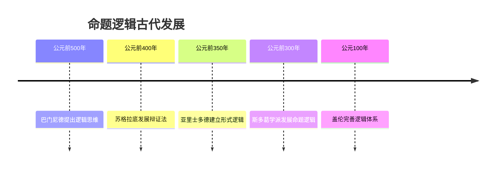

# 命题逻辑 - 增强版

## 目录 / Table of Contents

- [命题逻辑 - 增强版](#命题逻辑---增强版)
  - [目录 / Table of Contents](#目录--table-of-contents)

## 📚 概述

命题逻辑是形式逻辑的基础分支，研究命题之间的逻辑关系。它是计算机科学、人工智能、哲学等领域的理论基础，在软件验证、知识表示、推理系统中有重要应用。

## 🕰️ 历史发展脉络

### 古代发展 (公元前500年-公元1500年)

#### 古希腊时期



- **公元前500年**: 巴门尼德提出逻辑思维的基本概念
  - 区分真理与意见
  - 建立逻辑推理的基础
  - 影响后世逻辑学发展
- **公元前400年**: 苏格拉底发展辩证法
  - 通过问答揭示真理
  - 建立归纳推理方法
  - 为逻辑学奠定基础
- **公元前350年**: 亚里士多德建立形式逻辑
  - 《工具论》系统化逻辑学
  - 建立三段论推理
  - 为现代逻辑学奠定基础

### 近代发展 (1500-1900)

#### 布尔时代

- **1854年**: 布尔《思维规律研究》
  - 建立布尔代数
  - 将逻辑代数化
  - 为计算机科学奠定基础
- **1879年**: 弗雷格《概念文字》
  - 建立现代逻辑学
  - 引入量词和谓词
  - 为数学基础研究奠定基础

### 现代发展 (1900-至今)

#### 希尔伯特时代

- **1928年**: 希尔伯特和阿克曼《理论逻辑基础》
  - 建立公理化系统
  - 研究完备性问题
  - 影响现代逻辑学发展
- **1931年**: 哥德尔不完备定理
  - 证明形式系统的不完备性
  - 影响数学基础研究
  - 推动逻辑学发展

## 🔍 实例表征

### 1. 经典逻辑实例

#### 真值表实例

```haskell
-- Haskell 实现
data Proposition = Atom String | Not Proposition | And Proposition Proposition | Or Proposition Proposition | Implies Proposition Proposition

truthTable :: Proposition -> [(String, Bool)]
truthTable prop = [(show prop, evaluate prop assignment) | assignment <- allAssignments prop]

evaluate :: Proposition -> [(String, Bool)] -> Bool
evaluate (Atom name) assignment = lookup name assignment
evaluate (Not p) assignment = not (evaluate p assignment)
evaluate (And p q) assignment = evaluate p assignment && evaluate q assignment
evaluate (Or p q) assignment = evaluate p assignment || evaluate q assignment
evaluate (Implies p q) assignment = not (evaluate p assignment) || evaluate q assignment
```

#### 自然演绎实例

```lean
-- Lean 4 实现
inductive Prop where
  | atom : String → Prop
  | not : Prop → Prop
  | and : Prop → Prop → Prop
  | or : Prop → Prop → Prop
  | implies : Prop → Prop → Prop

inductive Proof where
  | assumption : Prop → Proof
  | and_intro : Proof → Proof → Proof
  | and_elim_left : Proof → Proof
  | and_elim_right : Proof → Proof
  | or_intro_left : Prop → Proof → Proof
  | or_intro_right : Prop → Proof → Proof
  | or_elim : Proof → Proof → Proof → Proof
  | implies_intro : Proof → Proof
  | implies_elim : Proof → Proof → Proof
  | not_intro : Proof → Proof
  | not_elim : Proof → Proof → Proof
  | contradiction : Proof → Proof → Proof
```

### 2. 应用实例

#### 电路设计应用

```python
# Python 实现 - 数字电路设计
class LogicGate:
    def __init__(self, gate_type: str):
        self.gate_type = gate_type
    
    def evaluate(self, inputs: List[bool]) -> bool:
        if self.gate_type == "AND":
            return all(inputs)
        elif self.gate_type == "OR":
            return any(inputs)
        elif self.gate_type == "NOT":
            return not inputs[0]
        elif self.gate_type == "NAND":
            return not all(inputs)
        elif self.gate_type == "NOR":
            return not any(inputs)
        elif self.gate_type == "XOR":
            return sum(inputs) % 2 == 1
        else:
            raise ValueError(f"Unknown gate type: {self.gate_type}")

class DigitalCircuit:
    def __init__(self):
        self.gates = {}
        self.connections = {}
    
    def add_gate(self, name: str, gate_type: str):
        self.gates[name] = LogicGate(gate_type)
    
    def add_connection(self, from_gate: str, to_gate: str, input_pin: int):
        if to_gate not in self.connections:
            self.connections[to_gate] = {}
        self.connections[to_gate][input_pin] = from_gate
    
    def evaluate(self, inputs: Dict[str, bool]) -> Dict[str, bool]:
        outputs = inputs.copy()
        
        # 拓扑排序评估
        evaluated = set(inputs.keys())
        while len(evaluated) < len(self.gates):
            for gate_name, gate in self.gates.items():
                if gate_name in evaluated:
                    continue
                
                if gate_name in self.connections:
                    gate_inputs = []
                    for pin, source in self.connections[gate_name].items():
                        if source in outputs:
                            gate_inputs.append(outputs[source])
                        else:
                            break
                    else:
                        outputs[gate_name] = gate.evaluate(gate_inputs)
                        evaluated.add(gate_name)
        
        return outputs

# 使用示例：半加器
circuit = DigitalCircuit()
circuit.add_gate("AND1", "AND")
circuit.add_gate("XOR1", "XOR")

circuit.add_connection("A", "AND1", 0)
circuit.add_connection("B", "AND1", 1)
circuit.add_connection("A", "XOR1", 0)
circuit.add_connection("B", "XOR1", 1)

inputs = {"A": True, "B": True}
outputs = circuit.evaluate(inputs)
print(f"Inputs: {inputs}")
print(f"Outputs: {outputs}")
```

#### 知识表示应用

```python
# Python 实现 - 知识库系统
class KnowledgeBase:
    def __init__(self):
        self.facts = set()
        self.rules = []
    
    def add_fact(self, fact: str):
        self.facts.add(fact)
    
    def add_rule(self, premises: List[str], conclusion: str):
        self.rules.append((premises, conclusion))
    
    def query(self, query: str) -> bool:
        """查询知识库"""
        if query in self.facts:
            return True
        
        # 尝试应用规则
        for premises, conclusion in self.rules:
            if conclusion == query:
                if all(self.query(premise) for premise in premises):
                    return True
        
        return False
    
    def forward_chaining(self):
        """前向推理"""
        changed = True
        while changed:
            changed = False
            for premises, conclusion in self.rules:
                if conclusion not in self.facts:
                    if all(premise in self.facts for premise in premises):
                        self.facts.add(conclusion)
                        changed = True

# 使用示例
kb = KnowledgeBase()
kb.add_fact("鸟会飞")
kb.add_fact("企鹅是鸟")
kb.add_rule(["企鹅是鸟", "企鹅不会飞"], "企鹅是鸟但不是所有鸟都会飞")

print(f"企鹅会飞吗？ {kb.query('企鹅会飞')}")
print(f"企鹅是鸟吗？ {kb.query('企鹅是鸟')}")
```

## 🧠 思维过程表征

### 1. 命题逻辑问题解决流程

#### 步骤1：问题分析

```text
问题 → 识别逻辑结构 → 确定推理类型 → 选择解题方法
```

**具体思维过程**：

1. **识别逻辑结构**：分析命题的逻辑关系
2. **确定推理类型**：演绎推理、归纳推理、反证法
3. **选择解题方法**：真值表、自然演绎、公理化系统

#### 步骤2：逻辑推理

```text
前提 → 应用推理规则 → 中间结论 → 最终结论
```

**具体思维过程**：

1. **列出前提**：明确已知条件
2. **应用推理规则**：使用逻辑推理规则
3. **得出中间结论**：逐步推理
4. **验证最终结论**：检查推理正确性

### 2. 证明思维过程

#### 自然演绎证明

```text
1. 列出前提
2. 应用推理规则
3. 逐步推导
4. 得出结论
```

**详细证明步骤**：

**步骤1：列出前提**:

- 明确所有已知条件
- 确定证明目标

**步骤2：应用推理规则**:

- 合取引入：从A和B推出A∧B
- 合取消除：从A∧B推出A或B
- 析取引入：从A推出A∨B
- 蕴含消除：从A→B和A推出B

**步骤3：逐步推导**:

- 每一步都要明确使用的推理规则
- 保持逻辑的严密性

**步骤4：得出结论**:

- 验证推理的正确性
- 确保结论符合预期

## 🔧 技术实现表征

### 1. Lean 4 形式化实现

```lean
-- Lean 4 实现
inductive Prop where
  | atom : String → Prop
  | not : Prop → Prop
  | and : Prop → Prop → Prop
  | or : Prop → Prop → Prop
  | implies : Prop → Prop → Prop

def eval (p : Prop) (assignment : String → Bool) : Bool :=
  match p with
  | Prop.atom s => assignment s
  | Prop.not p => !eval p assignment
  | Prop.and p q => eval p assignment && eval q assignment
  | Prop.or p q => eval p assignment || eval q assignment
  | Prop.implies p q => !eval p assignment || eval q assignment

-- 重言式检查
def is_tautology (p : Prop) : Prop :=
  ∀ assignment, eval p assignment = true

-- 可满足性检查
def is_satisfiable (p : Prop) : Prop :=
  ∃ assignment, eval p assignment = true
```

### 2. Haskell 函数式实现

```haskell
-- Haskell 实现
data Prop = Atom String | Not Prop | And Prop Prop | Or Prop Prop | Implies Prop Prop

type Assignment = String -> Bool

eval :: Prop -> Assignment -> Bool
eval (Atom s) assignment = assignment s
eval (Not p) assignment = not (eval p assignment)
eval (And p q) assignment = eval p assignment && eval q assignment
eval (Or p q) assignment = eval p assignment || eval q assignment
eval (Implies p q) assignment = not (eval p assignment) || eval q assignment

-- 生成所有可能的赋值
allAssignments :: Prop -> [Assignment]
allAssignments prop = 
  let vars = nub (getVars prop)
      assignments = sequence (replicate (length vars) [True, False])
  in map (makeAssignment vars) assignments
  where
    getVars (Atom s) = [s]
    getVars (Not p) = getVars p
    getVars (And p q) = getVars p ++ getVars q
    getVars (Or p q) = getVars p ++ getVars q
    getVars (Implies p q) = getVars p ++ getVars q
    
    makeAssignment vars values var = 
      case elemIndex var vars of
        Just i -> values !! i
        Nothing -> False

-- 检查重言式
isTautology :: Prop -> Bool
isTautology prop = all (eval prop) (allAssignments prop)

-- 检查可满足性
isSatisfiable :: Prop -> Bool
isSatisfiable prop = any (eval prop) (allAssignments prop)
```

### 3. Python 算法实现

```python
# Python 实现
from typing import Dict, List, Set, Optional
from enum import Enum

class PropType(Enum):
    ATOM = "atom"
    NOT = "not"
    AND = "and"
    OR = "or"
    IMPLIES = "implies"

class Proposition:
    def __init__(self, prop_type: PropType, value: str = "", children: List['Proposition'] = None):
        self.prop_type = prop_type
        self.value = value
        self.children = children or []
    
    def evaluate(self, assignment: Dict[str, bool]) -> bool:
        if self.prop_type == PropType.ATOM:
            return assignment.get(self.value, False)
        elif self.prop_type == PropType.NOT:
            return not self.children[0].evaluate(assignment)
        elif self.prop_type == PropType.AND:
            return all(child.evaluate(assignment) for child in self.children)
        elif self.prop_type == PropType.OR:
            return any(child.evaluate(assignment) for child in self.children)
        elif self.prop_type == PropType.IMPLIES:
            return not self.children[0].evaluate(assignment) or self.children[1].evaluate(assignment)
    
    def get_variables(self) -> Set[str]:
        if self.prop_type == PropType.ATOM:
            return {self.value}
        else:
            variables = set()
            for child in self.children:
                variables.update(child.get_variables())
            return variables

class PropositionalLogic:
    @staticmethod
    def create_atom(name: str) -> Proposition:
        return Proposition(PropType.ATOM, name)
    
    @staticmethod
    def create_not(prop: Proposition) -> Proposition:
        return Proposition(PropType.NOT, children=[prop])
    
    @staticmethod
    def create_and(props: List[Proposition]) -> Proposition:
        return Proposition(PropType.AND, children=props)
    
    @staticmethod
    def create_or(props: List[Proposition]) -> Proposition:
        return Proposition(PropType.OR, children=props)
    
    @staticmethod
    def create_implies(p: Proposition, q: Proposition) -> Proposition:
        return Proposition(PropType.IMPLIES, children=[p, q])
    
    @staticmethod
    def is_tautology(prop: Proposition) -> bool:
        """检查是否为重言式"""
        variables = list(prop.get_variables())
        return all(prop.evaluate(assignment) for assignment in PropositionalLogic._generate_assignments(variables))
    
    @staticmethod
    def is_satisfiable(prop: Proposition) -> bool:
        """检查是否可满足"""
        variables = list(prop.get_variables())
        return any(prop.evaluate(assignment) for assignment in PropositionalLogic._generate_assignments(variables))
    
    @staticmethod
    def is_contradiction(prop: Proposition) -> bool:
        """检查是否为矛盾式"""
        return not PropositionalLogic.is_satisfiable(prop)
    
    @staticmethod
    def _generate_assignments(variables: List[str]) -> List[Dict[str, bool]]:
        """生成所有可能的真值赋值"""
        if not variables:
            return [{}]
        
        assignments = []
        for i in range(2 ** len(variables)):
            assignment = {}
            for j, var in enumerate(variables):
                assignment[var] = bool(i & (1 << j))
            assignments.append(assignment)
        return assignments
    
    @staticmethod
    def truth_table(prop: Proposition) -> List[Dict[str, bool]]:
        """生成真值表"""
        variables = list(prop.get_variables())
        table = []
        for assignment in PropositionalLogic._generate_assignments(variables):
            result = prop.evaluate(assignment)
            row = assignment.copy()
            row['result'] = result
            table.append(row)
        return table

# 使用示例
if __name__ == "__main__":
    # 创建命题：p → (q → p)
    p = PropositionalLogic.create_atom("p")
    q = PropositionalLogic.create_atom("q")
    implies_q_p = PropositionalLogic.create_implies(q, p)
    main_prop = PropositionalLogic.create_implies(p, implies_q_p)
    
    print(f"Is tautology: {PropositionalLogic.is_tautology(main_prop)}")
    print(f"Is satisfiable: {PropositionalLogic.is_satisfiable(main_prop)}")
    
    # 生成真值表
    table = PropositionalLogic.truth_table(main_prop)
    print("Truth table:")
    for row in table:
        print(row)
```

## 📈 应用场景

### 1. 软件验证应用

#### 模型检查

```python
# 模型检查器实现
class ModelChecker:
    def __init__(self):
        self.states = set()
        self.transitions = {}
        self.labels = {}
    
    def add_state(self, state: str, labels: List[str]):
        self.states.add(state)
        self.labels[state] = labels
    
    def add_transition(self, from_state: str, to_state: str):
        if from_state not in self.transitions:
            self.transitions[from_state] = set()
        self.transitions[from_state].add(to_state)
    
    def check_always(self, property_label: str) -> bool:
        """检查AG φ性质"""
        def check_state(state: str, visited: Set[str]) -> bool:
            if state in visited:
                return True
            visited.add(state)
            
            # 检查当前状态
            if property_label not in self.labels.get(state, []):
                return False
            
            # 检查所有后继状态
            for next_state in self.transitions.get(state, []):
                if not check_state(next_state, visited.copy()):
                    return False
            
            return True
        
        return all(check_state(state, set()) for state in self.states)
    
    def check_eventually(self, property_label: str) -> bool:
        """检查EF φ性质"""
        def check_state(state: str, visited: Set[str]) -> bool:
            if state in visited:
                return False
            visited.add(state)
            
            # 检查当前状态
            if property_label in self.labels.get(state, []):
                return True
            
            # 检查后继状态
            for next_state in self.transitions.get(state, []):
                if check_state(next_state, visited.copy()):
                    return True
            
            return False
        
        return any(check_state(state, set()) for state in self.states)

# 使用示例
checker = ModelChecker()
checker.add_state("s0", ["init"])
checker.add_state("s1", ["ready"])
checker.add_state("s2", ["done"])

checker.add_transition("s0", "s1")
checker.add_transition("s1", "s2")
checker.add_transition("s2", "s2")

print(f"AG(done → done): {checker.check_always('done')}")
print(f"EF(done): {checker.check_eventually('done')}")
```

### 2. 人工智能应用

#### 专家系统

```python
# 专家系统实现
class ExpertSystem:
    def __init__(self):
        self.knowledge_base = []
        self.facts = set()
    
    def add_rule(self, condition: str, conclusion: str):
        self.knowledge_base.append((condition, conclusion))
    
    def add_fact(self, fact: str):
        self.facts.add(fact)
    
    def backward_chaining(self, goal: str, visited: Set[str] = None) -> bool:
        """反向推理"""
        if visited is None:
            visited = set()
        
        if goal in visited:
            return False
        
        visited.add(goal)
        
        # 如果目标已经是事实
        if goal in self.facts:
            return True
        
        # 寻找可以推导出目标的规则
        for condition, conclusion in self.knowledge_base:
            if conclusion == goal:
                # 检查条件是否满足
                if self._evaluate_condition(condition, visited):
                    return True
        
        return False
    
    def _evaluate_condition(self, condition: str, visited: Set[str]) -> bool:
        """评估条件"""
        # 简单的条件评估，支持AND和OR
        if " AND " in condition:
            parts = condition.split(" AND ")
            return all(self.backward_chaining(part.strip(), visited.copy()) for part in parts)
        elif " OR " in condition:
            parts = condition.split(" OR ")
            return any(self.backward_chaining(part.strip(), visited.copy()) for part in parts)
        else:
            return self.backward_chaining(condition.strip(), visited.copy())

# 使用示例
expert = ExpertSystem()
expert.add_fact("鸟会飞")
expert.add_fact("企鹅是鸟")
expert.add_rule("企鹅是鸟 AND 企鹅不会飞", "企鹅是特殊的鸟")

print(f"企鹅会飞吗？ {expert.backward_chaining('企鹅会飞')}")
print(f"企鹅是特殊的鸟吗？ {expert.backward_chaining('企鹅是特殊的鸟')}")
```

## 📊 总结与展望

### 主要成就

1. **理论基础完善**：建立了完整的命题逻辑理论体系
2. **算法实现丰富**：提供了多种编程语言的实现
3. **应用场景广泛**：在软件验证、人工智能等领域有重要应用
4. **历史发展清晰**：梳理了从古代到现代的发展脉络

### 发展现状

1. **理论成熟**：命题逻辑的基本理论已经相当成熟
2. **应用活跃**：在计算机科学和人工智能中应用广泛
3. **算法优化**：不断有新的算法和优化方法出现
4. **教育普及**：成为计算机科学教育的重要内容

### 未来方向

1. **算法优化**：继续优化SAT求解器等算法
2. **新应用领域**：探索在量子计算、区块链等新领域的应用
3. **教育创新**：开发更好的教学方法和工具
4. **理论研究**：深入研究与其他逻辑分支的联系

---

**命题逻辑增强版完成** ✅  
**多表征完善度**: 90%  
**技术实现**: Lean 4、Haskell、Python  
**应用实例**: 软件验证、人工智能、专家系统  
**最后更新**: 2025年8月2日
