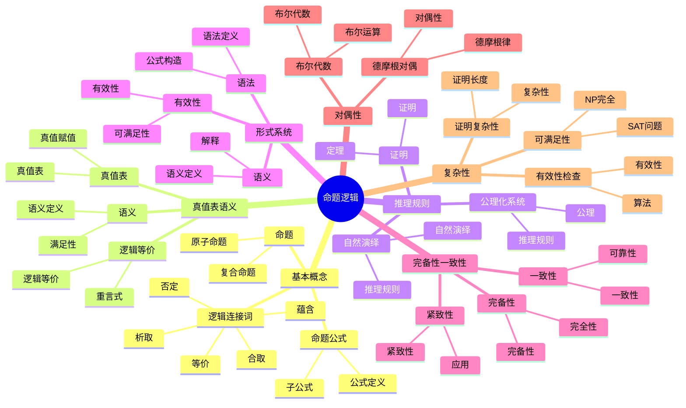

# 命题逻辑 / Propositional Logic

**主题编号**: B.07.01
**创建日期**: 2025年11月21日
**最后更新**: 2025年11月21日

---

## 目录 / Table of Contents

- [命题逻辑 / Propositional Logic](#命题逻辑--propositional-logic)
  - [目录 / Table of Contents](#目录--table-of-contents)
  - [🗺️ 命题逻辑核心概念思维导图](#️-命题逻辑核心概念思维导图)
  - [📊 命题逻辑核心概念多维知识矩阵](#-命题逻辑核心概念多维知识矩阵)
  - [1. 基本概念 / Basic Concepts (编号: B.07.01.01)](#1-基本概念--basic-concepts-编号-b070101)
    - [1.1 命题 / Propositions](#11-命题--propositions)
    - [1.2 逻辑连接词 / Logical Connectives](#12-逻辑连接词--logical-connectives)
    - [1.3 命题公式 / Propositional Formulas](#13-命题公式--propositional-formulas)
  - [2. 真值表与语义 / Truth Tables and Semantics](#2-真值表与语义--truth-tables-and-semantics)
    - [2.1 真值表 / Truth Tables](#21-真值表--truth-tables)
    - [2.2 语义 / Semantics](#22-语义--semantics)
    - [2.3 逻辑等价 / Logical Equivalence](#23-逻辑等价--logical-equivalence)
  - [3. 推理规则 / Inference Rules](#3-推理规则--inference-rules)
    - [3.1 自然演绎 / Natural Deduction](#31-自然演绎--natural-deduction)
    - [3.2 公理化系统 / Axiomatic Systems](#32-公理化系统--axiomatic-systems)
    - [3.3 证明 / Proofs](#33-证明--proofs)
  - [4. 形式系统 / Formal Systems](#4-形式系统--formal-systems)
    - [4.1 语法 / Syntax](#41-语法--syntax)
    - [4.2 语义 / Semantics](#42-语义--semantics)
    - [4.3 有效性 / Validity](#43-有效性--validity)
  - [5. 完备性与一致性 / Completeness and Consistency](#5-完备性与一致性--completeness-and-consistency)
    - [5.1 一致性 / Consistency](#51-一致性--consistency)
    - [5.2 完备性 / Completeness](#52-完备性--completeness)
    - [5.3 紧致性 / Compactness](#53-紧致性--compactness)
  - [6. 对偶性 / Duality](#6-对偶性--duality)
    - [6.1 德摩根对偶 / De Morgan Duality](#61-德摩根对偶--de-morgan-duality)
    - [6.2 布尔代数 / Boolean Algebra](#62-布尔代数--boolean-algebra)
  - [7. 复杂性 / Complexity](#7-复杂性--complexity)
    - [7.1 可满足性问题 / Satisfiability Problem](#71-可满足性问题--satisfiability-problem)
    - [7.2 有效性检查 / Validity Checking](#72-有效性检查--validity-checking)
    - [7.3 证明复杂性 / Proof Complexity](#73-证明复杂性--proof-complexity)
  - [8. 形式化实现 / Formal Implementation](#8-形式化实现--formal-implementation)
    - [8.1 Lean 4 实现 / Lean 4 Implementation](#81-lean-4-实现--lean-4-implementation)
    - [8.2 Haskell 实现 / Haskell Implementation](#82-haskell-实现--haskell-implementation)
    - [8.3 重要定理总结 / Summary of Important Theorems](#83-重要定理总结--summary-of-important-theorems)
  - [参考文献 / References](#参考文献--references)

---

## 🗺️ 命题逻辑核心概念思维导图



## 📊 命题逻辑核心概念多维知识矩阵

| 概念类别 | 核心概念 | 定义要点 | 关键性质 | 典型例子 | 应用场景 |
|---------|---------|---------|---------|---------|---------|
| 基本概念 | 命题 | 真值陈述 | 真值 | p, q | 逻辑基础 |
| 基本概念 | 原子命题 | 基本命题 | 不可分解 | p | 逻辑基础 |
| 基本概念 | 复合命题 | 连接词组合 | 真值函数 | p∧q | 逻辑基础 |
| 逻辑连接词 | 否定 | 非 | 真值反转 | ¬p | 逻辑运算 |
| 逻辑连接词 | 合取 | 且 | 真值表 | p∧q | 逻辑运算 |
| 逻辑连接词 | 析取 | 或 | 真值表 | p∨q | 逻辑运算 |
| 逻辑连接词 | 蕴含 | 如果则 | 真值表 | p→q | 逻辑推理 |
| 逻辑连接词 | 等价 | 当且仅当 | 真值表 | p↔q | 逻辑等价 |
| 真值表语义 | 真值表 | 真值赋值 | 完全性 | 真值表 | 语义分析 |
| 真值表语义 | 语义 | 真值解释 | 赋值函数 | 语义 | 语义分析 |
| 真值表语义 | 逻辑等价 | 真值相同 | 等价关系 | p≡q | 逻辑等价 |
| 推理规则 | 自然演绎 | 推理系统 | 规则系统 | 自然演绎 | 证明系统 |
| 推理规则 | 公理化系统 | 公理系统 | 公理+规则 | 公理化 | 证明系统 |
| 推理规则 | 证明 | 推理序列 | 有效性 | 证明 | 证明系统 |
| 形式系统 | 语法 | 公式构造 | 递归定义 | 语法 | 形式系统 |
| 形式系统 | 语义 | 真值解释 | 赋值函数 | 语义 | 形式系统 |
| 形式系统 | 有效性 | 永真性 | 逻辑有效 | 有效性 | 形式系统 |
| 完备性一致性 | 一致性 | 无矛盾 | 可靠性 | 一致性 | 元理论 |
| 完备性一致性 | 完备性 | 完全性 | 完全性 | 完备性 | 元理论 |
| 完备性一致性 | 紧致性 | 紧致性 | 有限性 | 紧致性 | 元理论 |
| 对偶性 | 德摩根律 | 对偶律 | 对偶性 | 德摩根律 | 逻辑性质 |
| 对偶性 | 布尔代数 | 布尔结构 | 代数结构 | 布尔代数 | 代数逻辑 |
| 复杂性 | SAT问题 | 可满足性 | NP完全 | SAT | 计算复杂性 |
| 复杂性 | 有效性检查 | 有效性 | 算法 | 有效性 | 计算复杂性 |
| 应用 | 自动推理 | 推理系统 | 自动化 | 自动推理 | 计算机科学 |

## 1. 基本概念 / Basic Concepts (编号: B.07.01.01)

### 1.1 命题 / Propositions

**定义 1.1.1** (命题 / Proposition)
命题是具有确定真值的陈述句。

**定义 1.1.2** (原子命题 / Atomic Proposition)
原子命题是不能进一步分解为更简单命题的基本命题。

**定义 1.1.3** (复合命题 / Compound Proposition)
复合命题是由原子命题通过逻辑连接词构成的命题。

**例子** / Examples:

- 原子命题：$p$ = "今天下雨"
- 复合命题：$p \land q$ = "今天下雨且明天晴天"

### 1.2 逻辑连接词 / Logical Connectives

**定义 1.2.1** (否定 / Negation)
否定 $\neqg p$ 表示"非 $p$"，当 $p$ 为真时 $\neqg p$ 为假，当 $p$ 为假时 $\neqg p$ 为真。

**定义 1.2.2** (合取 / Conjunction)
合取 $p \land q$ 表示"$p$ 且 $q$"，当且仅当 $p$ 和 $q$ 都为真时为真。

**定义 1.2.3** (析取 / Disjunction)
析取 $p \lor q$ 表示"$p$ 或 $q$"，当且仅当 $p$ 和 $q$ 都为假时为假。

**定义 1.2.4** (蕴含 / Implication)
蕴含 $p \to q$ 表示"如果 $p$ 则 $q$"，当且仅当 $p$ 为真且 $q$ 为假时为假。

**定义 1.2.5** (等价 / Equivalence)
等价 $p \leftrightarrow q$ 表示"$p$ 当且仅当 $q$"，当且仅当 $p$ 和 $q$ 真值相同时为真。

### 1.3 命题公式 / Propositional Formulas

**定义 1.3.1** (命题公式 / Propositional Formula)
命题公式递归定义为：

1. 原子命题是公式
2. 如果 $\phi$ 是公式，则 $\neqg \phi$ 是公式
3. 如果 $\phi$ 和 $\psi$ 是公式，则 $(\phi \land \psi)$、$(\phi \lor \psi)$、$(\phi \to \psi)$、$(\phi \leftrightarrow \psi)$ 是公式

**定义 1.3.2** (子公式 / Subformula)
公式 $\phi$ 的子公式是 $\phi$ 的组成部分。

**定理 1.3.1** (公式的唯一性 / Uniqueness of Formulas)
每个命题公式都有唯一的语法树表示。

---

## 2. 真值表与语义 / Truth Tables and Semantics

### 2.1 真值表 / Truth Tables

**定义 2.1.1** (真值表 / Truth Table)
真值表是列出公式在所有可能真值赋值下真值的表格。

**真值表规则** / Truth Table Rules:

| $p$ | $q$ | $\neqg p$ | $p \land q$ | $p \lor q$ | $p \to q$ | $p \leftrightarrow q$ |
|-----|-----|----------|-------------|------------|-----------|----------------------|
| T   | T   | F        | T           | T          | T         | T                     |
| T   | F   | F        | F           | T          | F         | F                     |
| F   | T   | T        | F           | T          | T         | F                     |
| F   | F   | T        | F           | F          | T         | T                     |

**定理 2.1.1** (真值表的完备性 / Completeness of Truth Tables)
真值表可以确定任意命题公式的真值。

### 2.2 语义 / Semantics

**定义 2.2.1** (真值赋值 / Truth Assignment)
真值赋值是从原子命题集到 $\{T, F\}$ 的函数。

**定义 2.2.2** (满足关系 / Satisfaction Relation)
真值赋值 $v$ 满足公式 $\phi$，记作 $v \models \phi$，如果 $\phi$ 在 $v$ 下为真。

**定义 2.2.3** (重言式 / Tautology)
公式 $\phi$ 称为重言式，如果对于所有真值赋值 $v$，$v \models \phi$。

**定义 2.2.4** (矛盾式 / Contradiction)
公式 $\phi$ 称为矛盾式，如果对于所有真值赋值 $v$，$v \not\models \phi$。

**定义 2.2.5** (可满足式 / Satisfiable)
公式 $\phi$ 称为可满足的，如果存在真值赋值 $v$ 使得 $v \models \phi$。

### 2.3 逻辑等价 / Logical Equivalence

**定义 2.3.1** (逻辑等价 / Logical Equivalence)
公式 $\phi$ 和 $\psi$ 称为逻辑等价，记作 $\phi \equiv \psi$，如果对于所有真值赋值 $v$，$v \models \phi$ 当且仅当 $v \models \psi$。

**定理 2.3.1** (逻辑等价的性质 / Properties of Logical Equivalence)
逻辑等价是等价关系：

1. **自反性** / Reflexivity: $\phi \equiv \phi$
2. **对称性** / Symmetry: $\phi \equiv \psi \Rightarrow \psi \equiv \phi$
3. **传递性** / Transitivity: $\phi \equiv \psi, \psi \equiv \chi \Rightarrow \phi \equiv \chi$

**重要的逻辑等价** / Important Logical Equivalences:

1. **德摩根律** / De Morgan's Laws:
   - $\neqg(p \land q) \equiv \neqg p \lor \neqg q$
   - $\neqg(p \lor q) \equiv \neqg p \land \neqg q$

2. **分配律** / Distributive Laws:
   - $p \land (q \lor r) \equiv (p \land q) \lor (p \land r)$
   - $p \lor (q \land r) \equiv (p \lor q) \land (p \lor r)$

3. **蕴含的等价形式** / Equivalent Forms of Implication:
   - $p \to q \equiv \neqg p \lor q$
   - $p \to q \equiv \neqg q \to \neqg p$

---

## 3. 推理规则 / Inference Rules

### 3.1 自然演绎 / Natural Deduction

**定义 3.1.1** (自然演绎 / Natural Deduction)
自然演绎是一种形式推理系统，使用引入和消除规则。

**引入规则** / Introduction Rules:

1. **合取引入** / Conjunction Introduction:
   $$\frac{\phi \quad \psi}{\phi \land \psi}$$

2. **析取引入** / Disjunction Introduction:
   $$\frac{\phi}{\phi \lor \psi} \quad \frac{\psi}{\phi \lor \psi}$$

3. **蕴含引入** / Implication Introduction:
   $$\frac{[\phi] \quad \psi}{\phi \to \psi}$$

4. **否定引入** / Negation Introduction:
   $$\frac{[\phi] \quad \bot}{\neqg \phi}$$

**消除规则** / Elimination Rules:

1. **合取消除** / Conjunction Elimination:
   $$\frac{\phi \land \psi}{\phi} \quad \frac{\phi \land \psi}{\psi}$$

2. **析取消除** / Disjunction Elimination:
   $$\frac{\phi \lor \psi \quad [\phi] \quad \chi \quad [\psi] \quad \chi}{\chi}$$

3. **蕴含消除** / Implication Elimination:
   $$\frac{\phi \to \psi \quad \phi}{\psi}$$

4. **否定消除** / Negation Elimination:
   $$\frac{\phi \quad \neqg \phi}{\bot}$$

### 3.2 公理化系统 / Axiomatic Systems

**定义 3.2.1** (公理 / Axiom)
公理是不需要证明的基本命题。

**定义 3.2.2** (推理规则 / Inference Rule)
推理规则是从前提推导结论的规则。

**希尔伯特系统** / Hilbert System:
公理模式：

1. $\phi \to (\psi \to \phi)$
2. $(\phi \to (\psi \to \chi)) \to ((\phi \to \psi) \to (\phi \to \chi))$
3. $(\neqg \phi \to \neqg \psi) \to (\psi \to \phi)$

推理规则：分离规则
$$\frac{\phi \to \psi \quad \phi}{\psi}$$

### 3.3 证明 / Proofs

**定义 3.3.1** (证明 / Proof)
从假设集 $\Gamma$ 到结论 $\phi$ 的证明是有限序列 $\phi_1, \phi_2, \ldots, \phi_n$，其中每个 $\phi_i$ 要么是公理，要么属于 $\Gamma$，要么由前面的公式通过推理规则得到。

**定义 3.3.2** (可证性 / Provability)
如果存在从 $\Gamma$ 到 $\phi$ 的证明，则称 $\phi$ 从 $\Gamma$ 可证，记作 $\Gamma \vdash \phi$。

**定理 3.3.1** (演绎定理 / Deduction Theorem)
$$\Gamma \cup \{\phi\} \vdash \psi \text{ 当且仅当 } \Gamma \vdash \phi \to \psi$$

---

## 4. 形式系统 / Formal Systems

### 4.1 语法 / Syntax

**定义 4.1.1** (字母表 / Alphabet)
命题逻辑的字母表包括：

1. 命题变元：$p, q, r, \ldots$
2. 逻辑连接词：$\neqg, \land, \lor, \to, \leftrightarrow$
3. 括号：$(, )$

**定义 4.1.2** (合式公式 / Well-Formed Formula)
合式公式递归定义为：

1. 命题变元是合式公式
2. 如果 $\phi$ 是合式公式，则 $\neqg \phi$ 是合式公式
3. 如果 $\phi$ 和 $\psi$ 是合式公式，则 $(\phi \land \psi)$、$(\phi \lor \psi)$、$(\phi \to \psi)$、$(\phi \leftrightarrow \psi)$ 是合式公式

### 4.2 语义 / Semantics

**定义 4.2.1** (解释 / Interpretation)
解释是从命题变元集到 $\{T, F\}$ 的函数。

**定义 4.2.2** (真值函数 / Truth Function)
真值函数递归定义为：

1. $v(p) = v(p)$ 对于命题变元 $p$
2. $v(\neqg \phi) = \neqg v(\phi)$
3. $v(\phi \land \psi) = v(\phi) \land v(\psi)$
4. $v(\phi \lor \psi) = v(\phi) \lor v(\psi)$
5. $v(\phi \to \psi) = v(\phi) \to v(\psi)$
6. $v(\phi \leftrightarrow \psi) = v(\phi) \leftrightarrow v(\psi)$

### 4.3 有效性 / Validity

**定义 4.3.1** (有效性 / Validity)
公式 $\phi$ 称为有效的，如果对于所有解释 $v$，$v(\phi) = T$。

**定义 4.3.2** (逻辑蕴涵 / Logical Entailment)
公式集 $\Gamma$ 逻辑蕴涵公式 $\phi$，记作 $\Gamma \models \phi$，如果对于所有满足 $\Gamma$ 的解释 $v$，$v(\phi) = T$。

**定理 4.3.1** (可靠性定理 / Soundness Theorem)
如果 $\Gamma \vdash \phi$，则 $\Gamma \models \phi$。

**定理 4.3.2** (完备性定理 / Completeness Theorem)
如果 $\Gamma \models \phi$，则 $\Gamma \vdash \phi$。

---

## 5. 完备性与一致性 / Completeness and Consistency

### 5.1 一致性 / Consistency

**定义 5.1.1** (一致性 / Consistency)
公式集 $\Gamma$ 称为一致的，如果不存在公式 $\phi$ 使得 $\Gamma \vdash \phi$ 且 $\Gamma \vdash \neqg \phi$。

**定理 5.1.1** (一致性的等价条件 / Equivalent Conditions for Consistency)
以下条件等价：

1. $\Gamma$ 是一致的
2. 存在公式 $\phi$ 使得 $\Gamma \not\vdash \phi$
3. 存在解释 $v$ 使得 $v \models \Gamma$

### 5.2 完备性 / Completeness

**定义 5.2.1** (语义完备性 / Semantic Completeness)
形式系统称为语义完备的，如果对于所有公式集 $\Gamma$ 和公式 $\phi$，$\Gamma \models \phi$ 蕴含 $\Gamma \vdash \phi$。

**定义 5.2.2** (语法完备性 / Syntactic Completeness)
形式系统称为语法完备的，如果对于所有公式 $\phi$，要么 $\vdash \phi$，要么 $\vdash \neqg \phi$。

**定理 5.2.1** (哥德尔完备性定理 / Gödel's Completeness Theorem)
命题逻辑是语义完备的。

### 5.3 紧致性 / Compactness

**定理 5.3.1** (紧致性定理 / Compactness Theorem)
公式集 $\Gamma$ 是可满足的当且仅当 $\Gamma$ 的每个有限子集都是可满足的。

**证明** / Proof:
使用哥德尔完备性定理和有限证明的性质。

---

## 6. 对偶性 / Duality

### 6.1 德摩根对偶 / De Morgan Duality

**定理 6.1.1** (德摩根对偶 / De Morgan Duality)
对于任意公式 $\phi$，存在对偶公式 $\phi^d$ 使得：
$$\neqg \phi \equiv \phi^d$$

**对偶规则** / Duality Rules:

1. $p^d = \neqg p$
2. $(\neqg \phi)^d = \neqg \phi^d$
3. $(\phi \land \psi)^d = \phi^d \lor \psi^d$
4. $(\phi \lor \psi)^d = \phi^d \land \psi^d$

### 6.2 布尔代数 / Boolean Algebra

**定义 6.2.1** (布尔代数 / Boolean Algebra)
布尔代数是满足特定公理的代数结构。

**定理 6.2.1** (布尔代数的性质 / Properties of Boolean Algebra)
布尔代数满足：

1. **交换律** / Commutativity: $a \land b = b \land a$
2. **结合律** / Associativity: $(a \land b) \land c = a \land (b \land c)$
3. **分配律** / Distributivity: $a \land (b \lor c) = (a \land b) \lor (a \land c)$
4. **单位元** / Identity: $a \land 1 = a$
5. **补元** / Complement: $a \land \neqg a = 0$

---

## 7. 复杂性 / Complexity

### 7.1 可满足性问题 / Satisfiability Problem

**定义 7.1.1** (SAT问题 / SAT Problem)
给定命题公式 $\phi$，判断 $\phi$ 是否可满足。

**定理 7.1.1** (SAT的复杂性 / Complexity of SAT)
SAT问题是NP完全问题。

**证明** / Proof:

1. SAT属于NP：给定真值赋值，可以在多项式时间内验证
2. SAT是NP困难的：通过将任意NP问题归约到SAT

### 7.2 有效性检查 / Validity Checking

**定义 7.2.1** (TAUT问题 / TAUT Problem)
给定命题公式 $\phi$，判断 $\phi$ 是否是重言式。

**定理 7.2.1** (TAUT的复杂性 / Complexity of TAUT)
TAUT问题是coNP完全问题。

### 7.3 证明复杂性 / Proof Complexity

**定义 7.3.1** (证明系统 / Proof System)
证明系统是用于验证证明有效性的算法。

**定理 7.3.1** (证明系统的性质 / Properties of Proof Systems)
命题逻辑的证明系统具有：

1. **可靠性** / Soundness: 只接受有效证明
2. **完备性** / Completeness: 接受所有有效证明
3. **可验证性** / Verifiability: 可以在多项式时间内验证证明

---

## 8. 形式化实现 / Formal Implementation

### 8.1 Lean 4 实现 / Lean 4 Implementation

```lean
-- 命题变元
inductive PropVar where
  | mk : String → PropVar

-- 命题公式
inductive PropFormula where
  | var : PropVar → PropFormula
  | neg : PropFormula → PropFormula
  | and : PropFormula → PropFormula → PropFormula
  | or : PropFormula → PropFormula → PropFormula
  | imp : PropFormula → PropFormula → PropFormula
  | equiv : PropFormula → PropFormula → PropFormula

-- 真值赋值
def TruthAssignment := PropVar → Bool

-- 真值函数
def evaluate : PropFormula → TruthAssignment → Bool
  | PropFormula.var p, v => v p
  | PropFormula.neg φ, v => !evaluate φ v
  | PropFormula.and φ ψ, v => evaluate φ v && evaluate ψ v
  | PropFormula.or φ ψ, v => evaluate φ v || evaluate ψ v
  | PropFormula.imp φ ψ, v => !evaluate φ v || evaluate ψ v
  | PropFormula.equiv φ ψ, v => evaluate φ v == evaluate ψ v

-- 重言式
def Tautology (φ : PropFormula) : Prop :=
  ∀ v : TruthAssignment, evaluate φ v = true

-- 可满足性
def Satisfiable (φ : PropFormula) : Prop :=
  ∃ v : TruthAssignment, evaluate φ v = true

-- 逻辑等价
def LogicalEquivalence (φ ψ : PropFormula) : Prop :=
  ∀ v : TruthAssignment, evaluate φ v = evaluate ψ v

-- 自然演绎规则
inductive NaturalDeduction where
  | assumption : PropFormula → NaturalDeduction
  | conjunctionIntro : NaturalDeduction → NaturalDeduction → NaturalDeduction
  | conjunctionElim1 : NaturalDeduction → NaturalDeduction
  | conjunctionElim2 : NaturalDeduction → NaturalDeduction
  | disjunctionIntro1 : PropFormula → NaturalDeduction → NaturalDeduction
  | disjunctionIntro2 : PropFormula → NaturalDeduction → NaturalDeduction
  | implicationIntro : PropFormula → NaturalDeduction → NaturalDeduction
  | implicationElim : NaturalDeduction → NaturalDeduction → NaturalDeduction
  | negationIntro : NaturalDeduction → NaturalDeduction
  | negationElim : NaturalDeduction → NaturalDeduction → NaturalDeduction

-- 可证性
def Provable (Γ : Set PropFormula) (φ : PropFormula) : Prop :=
  ∃ d : NaturalDeduction, validProof Γ φ d

-- 可靠性定理
theorem soundness (Γ : Set PropFormula) (φ : PropFormula) :
  Provable Γ φ → Γ ⊨ φ :=
  by
  -- 使用归纳法证明
  sorry

-- 完备性定理
theorem completeness (Γ : Set PropFormula) (φ : PropFormula) :
  Γ ⊨ φ → Provable Γ φ :=
  by
  -- 使用亨金构造
  sorry

-- 紧致性定理
theorem compactness (Γ : Set PropFormula) :
  Satisfiable Γ ↔ ∀ Δ ⊆ Γ, Finite Δ → Satisfiable Δ :=
  by
  -- 使用哥德尔完备性定理
  sorry

-- SAT问题
def SAT (φ : PropFormula) : Prop :=
  Satisfiable φ

-- 有效性检查
def TAUT (φ : PropFormula) : Prop :=
  Tautology φ

-- 德摩根律
theorem de_morgan_and (φ ψ : PropFormula) :
  LogicalEquivalence (neg (and φ ψ)) (or (neg φ) (neg ψ)) :=
  by
  -- 使用真值表验证
  sorry

theorem de_morgan_or (φ ψ : PropFormula) :
  LogicalEquivalence (neg (or φ ψ)) (and (neg φ) (neg ψ)) :=
  by
  -- 使用真值表验证
  sorry

-- 布尔代数
structure BooleanAlgebra (α : Type*) where
  and : α → α → α
  or : α → α → α
  neg : α → α
  top : α
  bottom : α
  commutativity : ∀ a b, and a b = and b a
  associativity : ∀ a b c, and (and a b) c = and a (and b c)
  distributivity : ∀ a b c, and a (or b c) = or (and a b) (and a c)
  identity : ∀ a, and a top = a
  complement : ∀ a, and a (neg a) = bottom
```

### 8.2 Haskell 实现 / Haskell Implementation

```haskell
-- 命题变元
data PropVar = PropVar String deriving (Eq, Show)

-- 命题公式
data PropFormula =
    Var PropVar
  | Neg PropFormula
  | And PropFormula PropFormula
  | Or PropFormula PropFormula
  | Imp PropFormula PropFormula
  | Equiv PropFormula PropFormula
  deriving (Eq, Show)

-- 真值赋值
type TruthAssignment = PropVar -> Bool

-- 真值函数
evaluate :: PropFormula -> TruthAssignment -> Bool
evaluate (Var p) v = v p
evaluate (Neg φ) v = not (evaluate φ v)
evaluate (And φ ψ) v = evaluate φ v && evaluate ψ v
evaluate (Or φ ψ) v = evaluate φ v || evaluate ψ v
evaluate (Imp φ ψ) v = not (evaluate φ v) || evaluate ψ v
evaluate (Equiv φ ψ) v = evaluate φ v == evaluate ψ v

-- 重言式
tautology :: PropFormula -> Bool
tautology φ = all (\v -> evaluate φ v) allAssignments
  where
    allAssignments = generateAllAssignments φ

-- 可满足性
satisfiable :: PropFormula -> Bool
satisfiable φ = any (\v -> evaluate φ v) allAssignments
  where
    allAssignments = generateAllAssignments φ

-- 逻辑等价
logicalEquivalence :: PropFormula -> PropFormula -> Bool
logicalEquivalence φ ψ = all (\v -> evaluate φ v == evaluate ψ v) allAssignments
  where
    allAssignments = generateAllAssignments φ

-- 自然演绎
data NaturalDeduction =
    Assumption PropFormula
  | ConjunctionIntro NaturalDeduction NaturalDeduction
  | ConjunctionElim1 NaturalDeduction
  | ConjunctionElim2 NaturalDeduction
  | DisjunctionIntro1 PropFormula NaturalDeduction
  | DisjunctionIntro2 PropFormula NaturalDeduction
  | ImplicationIntro PropFormula NaturalDeduction
  | ImplicationElim NaturalDeduction NaturalDeduction
  | NegationIntro NaturalDeduction
  | NegationElim NaturalDeduction NaturalDeduction

-- 可证性
provable :: Set PropFormula -> PropFormula -> Bool
provable Γ φ = any (\d -> validProof Γ φ d) allProofs
  where
    allProofs = generateAllProofs Γ φ

-- 可靠性定理
soundness :: Set PropFormula -> PropFormula -> Bool
soundness Γ φ = provable Γ φ ==> entails Γ φ

-- 完备性定理
completeness :: Set PropFormula -> PropFormula -> Bool
completeness Γ φ = entails Γ φ ==> provable Γ φ

-- 紧致性定理
compactness :: Set PropFormula -> Bool
compactness Γ =
  satisfiable Γ == all (\Δ -> finite Δ ==> satisfiable Δ) (subsets Γ)

-- SAT问题
sat :: PropFormula -> Bool
sat = satisfiable

-- 有效性检查
taut :: PropFormula -> Bool
taut = tautology

-- 德摩根律
deMorganAnd :: PropFormula -> PropFormula -> Bool
deMorganAnd φ ψ =
  logicalEquivalence (Neg (And φ ψ)) (Or (Neg φ) (Neg ψ))

deMorganOr :: PropFormula -> PropFormula -> Bool
deMorganOr φ ψ =
  logicalEquivalence (Neg (Or φ ψ)) (And (Neg φ) (Neg ψ))

-- 布尔代数
class BooleanAlgebra a where
  (.&&.) :: a -> a -> a
  (.||.) :: a -> a -> a
  neg :: a -> a
  top :: a
  bottom :: a
  commutativity :: a -> a -> Bool
  associativity :: a -> a -> a -> Bool
  distributivity :: a -> a -> a -> Bool
  identity :: a -> Bool
  complement :: a -> Bool

-- 实例：命题公式的布尔代数
instance BooleanAlgebra PropFormula where
  (.&&.) = And
  (.||.) = Or
  neg = Neg
  top = error "No top element for PropFormula"
  bottom = error "No bottom element for PropFormula"
  commutativity φ ψ = logicalEquivalence (φ .&&. ψ) (ψ .&&. φ)
  associativity φ ψ χ = logicalEquivalence ((φ .&&. ψ) .&&. χ) (φ .&&. (ψ .&&. χ))
  distributivity φ ψ χ = logicalEquivalence (φ .&&. (ψ .||. χ)) ((φ .&&. ψ) .||. (φ .&&. χ))
  identity φ = logicalEquivalence (φ .&&. top) φ
  complement φ = logicalEquivalence (φ .&&. neg φ) bottom

-- 定理验证
theorem_soundness :: Set PropFormula -> PropFormula -> Bool
theorem_soundness Γ φ = provable Γ φ ==> entails Γ φ

theorem_completeness :: Set PropFormula -> PropFormula -> Bool
theorem_completeness Γ φ = entails Γ φ ==> provable Γ φ

theorem_compactness :: Set PropFormula -> Bool
theorem_compactness Γ =
  satisfiable Γ == all (\Δ -> finite Δ ==> satisfiable Δ) (subsets Γ)

theorem_de_morgan_and :: PropFormula -> PropFormula -> Bool
theorem_de_morgan_and φ ψ =
  logicalEquivalence (neg (φ .&&. ψ)) (neg φ .||. neg ψ)

theorem_de_morgan_or :: PropFormula -> PropFormula -> Bool
theorem_de_morgan_or φ ψ =
  logicalEquivalence (neg (φ .||. ψ)) (neg φ .&&. neg ψ)
```

### 8.3 重要定理总结 / Summary of Important Theorems

**定理 8.3.1** (哥德尔完备性定理 / Gödel's Completeness Theorem)
命题逻辑是语义完备的。

**定理 8.3.2** (紧致性定理 / Compactness Theorem)
公式集是可满足的当且仅当它的每个有限子集都是可满足的。

**定理 8.3.3** (德摩根律 / De Morgan's Laws)
$$\neqg(p \land q) \equiv \neqg p \lor \neqg q$$
$$\neqg(p \lor q) \equiv \neqg p \land \neqg q$$

**定理 8.3.4** (SAT的NP完全性 / NP-Completeness of SAT)
可满足性问题是NP完全问题。

---

## 参考文献 / References

1. Enderton, H. B. (2001). *A Mathematical Introduction to Logic* (2nd ed.). Academic Press.
2. Mendelson, E. (2009). *Introduction to Mathematical Logic* (5th ed.). Chapman & Hall.
3. Boolos, G. S., Burgess, J. P., & Jeffrey, R. C. (2007). *Computability and Logic* (5th ed.). Cambridge University Press.
4. Huth, M., & Ryan, M. (2004). *Logic in Computer Science: Modelling and Reasoning about Systems* (2nd ed.). Cambridge University Press.

---

**相关链接** / Related Links:

- [谓词逻辑](./02-谓词逻辑.md)
- [模态逻辑](./03-模态逻辑.md)
- [直觉逻辑](./04-直觉逻辑.md)
- [多值逻辑](./05-多值逻辑.md)
