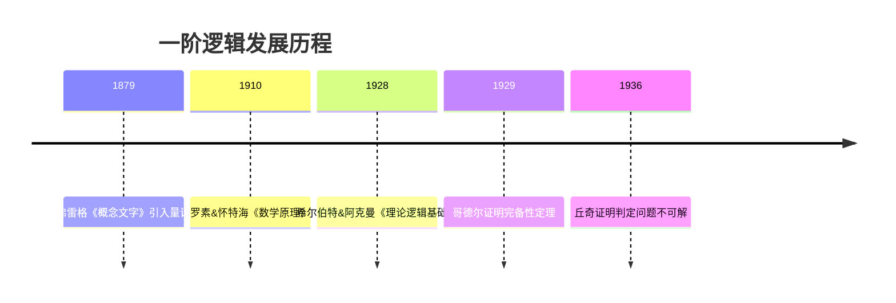

# 谓词逻辑（一阶逻辑）- 增强版

## 目录 / Table of Contents

- [谓词逻辑（一阶逻辑）- 增强版](#谓词逻辑一阶逻辑--增强版)
  - [目录 / Table of Contents](#目录--table-of-contents)
  - [📚 概述](#-概述)
  - [🕰️ 历史发展脉络](#️-历史发展脉络)
  - [📝 一阶语言的语法](#-一阶语言的语法)
    - [字母表与符号](#字母表与符号)
    - [项与公式的归纳定义](#项与公式的归纳定义)
    - [自由变量与约束变量](#自由变量与约束变量)
  - [🎯 语义解释](#-语义解释)
    - [结构与赋值](#结构与赋值)
    - [满足关系](#满足关系)
    - [逻辑有效性](#逻辑有效性)
  - [🔐 演绎系统](#-演绎系统)
    - [希尔伯特式公理系统](#希尔伯特式公理系统)
    - [自然演绎系统](#自然演绎系统)
  - [⭐ 完备性定理](#-完备性定理)
    - [定理陈述](#定理陈述)
    - [证明思路](#证明思路)
  - [💻 形式化实现](#-形式化实现)
    - [Lean 4 实现](#lean-4-实现)
  - [📈 应用场景](#-应用场景)
  - [📚 参考文献](#-参考文献)

## 📚 概述

**一阶逻辑**（First-Order Logic，FOL），又称**谓词逻辑**或**量化逻辑**，是现代数理逻辑的核心系统。它在命题逻辑的基础上引入了**量词**（$\forall$ 全称量词和 $\exists$ 存在量词）和**谓词**，使其能够表达关于个体对象的性质和关系。

与命题逻辑相比，一阶逻辑具有更强的表达能力：

- 可以表达"所有"、"存在"等量化概念
- 可以分析命题的内部结构（主语、谓语）
- 能够形式化数学证明的大部分内容

**MSC分类**: 03B10（经典一阶逻辑）

---

## 🕰️ 历史发展脉络



- **1879年**: 戈特洛布·弗雷格出版《概念文字》，首次引入量词符号，建立现代谓词逻辑
- **1910-1913年**: 罗素与怀特海出版《数学原理》，用一阶逻辑形式化数学基础
- **1929年**: 哥德尔证明**一阶逻辑完备性定理**，标志着一阶逻辑理论的成熟
- **1936年**: 丘奇与图灵独立证明一阶逻辑的**判定问题是不可解的**（Entscheidungsproblem）

---

## 📝 一阶语言的语法

### 字母表与符号

一阶语言的**字母表** $\mathcal{L}$ 由以下符号组成：

| 类别 | 符号 | 说明 |
|------|------|------|
| **逻辑符号** | $\neg, \wedge, \vee, \rightarrow, \leftrightarrow$ | 命题联结词 |
| **量词** | $\forall, \exists$ | 全称量词、存在量词 |
| **等词** | $=$ | 等号（可选） |
| **变元** | $x, y, z, x_1, x_2, \ldots$ | 可数无限个个体变元 |
| **辅助符号** | $(,),,$ | 括号、逗号 |
| **非逻辑符号** | | 依语言而定 |

**非逻辑符号**包括：

- **常量符号**: $c_1, c_2, \ldots$（表示特定个体）
- **函数符号**: $f_1, f_2, \ldots$，每个带有元数（arity）
- **谓词符号**: $P_1, P_2, \ldots$，每个带有元数

**示例**: 算术语言 $\mathcal{L}_{\text{arith}} = \{0, S, +, \times, <\}$

- 常量: $0$
- 一元函数: $S$（后继函数）
- 二元函数: $+, \times$
- 二元谓词: $<$

---

### 项与公式的归纳定义

**定义（项）**: 一阶语言中的**项**（term）是如下归纳定义的表达式：

1. **基础**: 每个个体变元和每个常量符号都是项
2. **归纳**: 若 $t_1, \ldots, t_n$ 是项，$f$ 是 $n$ 元函数符号，则 $f(t_1, \ldots, t_n)$ 是项
3. **封闭**: 只有通过上述规则有限次应用得到的表达式才是项

**示例**: 在算术语言中，$S(S(0))$、$+(x, S(y))$ 都是合法的项（通常写作 $SS0$ 和 $x + Sy$）。

---

**定义（公式）**: **公式**（formula）的归纳定义如下：

1. **原子公式**:
   - 若 $t_1, t_2$ 是项，则 $t_1 = t_2$ 是公式（等词语言）
   - 若 $t_1, \ldots, t_n$ 是项，$P$ 是 $n$ 元谓词，则 $P(t_1, \ldots, t_n)$ 是公式

2. **命题联结**: 若 $\varphi, \psi$ 是公式，则 $(\neg\varphi)$、$(\varphi \wedge \psi)$、$(\varphi \vee \psi)$、$(\varphi \rightarrow \psi)$ 都是公式

3. **量化**: 若 $\varphi$ 是公式，$x$ 是变元，则 $(\forall x.\varphi)$ 和 $(\exists x.\varphi)$ 都是公式

**示例公式**:
$$\forall x.\exists y.(P(x, y) \wedge \neg Q(y))$$

---

### 自由变量与约束变量

**定义（作用域）**: 在公式 $\forall x.\varphi$ 或 $\exists x.\varphi$ 中，$\varphi$ 称为量词的**作用域**（scope）。

**定义（自由/约束）**: 变元 $x$ 在公式中的出现称为**约束的**（bound），如果它位于 $\forall x$ 或 $\exists x$ 的作用域内；否则称为**自由的**（free）。

记 $\text{FV}(\varphi)$ 为公式 $\varphi$ 中所有自由变元的集合。

**定义（语句）**: 若 $\text{FV}(\varphi) = \emptyset$，则称 $\varphi$ 为**语句**（sentence）或**闭公式**。

**示例**: 在 $\forall x.(P(x) \rightarrow Q(x, y))$ 中：

- $x$ 是约束变元
- $y$ 是自由变元
- 这不是一个语句

---

## 🎯 语义解释

### 结构与赋值

**定义（结构）**: 语言 $\mathcal{L}$ 的一个**结构**（structure）$\mathfrak{A}$ 包括：

1. **论域**（Domain）: 非空集合 $A$
2. **解释函数**: 将非逻辑符号映射到 $A$ 上的对象
   - 常量 $c$ ↦ 元素 $c^{\mathfrak{A}} \in A$
   - $n$元函数 $f$ ↦ 函数 $f^{\mathfrak{A}}: A^n \to A$
   - $n$元谓词 $P$ ↦ 关系 $P^{\mathfrak{A}} \subseteq A^n$

**示例**: 算术结构 $\mathfrak{N} = (\mathbb{N}, 0^{\mathfrak{N}}, S^{\mathfrak{N}}, +^{\mathfrak{N}}, \times^{\mathfrak{N}}, <^{\mathfrak{N}})$，其中论域是自然数集。

---

**定义（赋值）**: **赋值**（assignment）是函数 $s: \text{Var} \to A$，将变元映射到论域元素。

**变元的赋值扩展**: 对于项 $t$，定义其在结构 $\mathfrak{A}$ 和赋值 $s$ 下的值 $\bar{s}(t)$:

- $\bar{s}(x) = s(x)$（变元）
- $\bar{s}(c) = c^{\mathfrak{A}}$（常量）
- $\bar{s}(f(t_1, \ldots, t_n)) = f^{\mathfrak{A}}(\bar{s}(t_1), \ldots, \bar{s}(t_n))$

---

### 满足关系

**定义（满足）**: 设 $\mathfrak{A}$ 是结构，$s$ 是赋值，递归定义**满足关系** $\mathfrak{A} \models \varphi[s]$：

| 公式类型 | 满足条件 |
|----------|----------|
| $\mathfrak{A} \models P(t_1, \ldots, t_n)[s]$ | 当且仅当 $(\bar{s}(t_1), \ldots, \bar{s}(t_n)) \in P^{\mathfrak{A}}$ |
| $\mathfrak{A} \models t_1 = t_2[s]$ | 当且仅当 $\bar{s}(t_1) = \bar{s}(t_2)$ |
| $\mathfrak{A} \models \neg\varphi[s]$ | 当且仅当 $\mathfrak{A} \not\models \varphi[s]$ |
| $\mathfrak{A} \models (\varphi \wedge \psi)[s]$ | 当且仅当 $\mathfrak{A} \models \varphi[s]$ 且 $\mathfrak{A} \models \psi[s]$ |
| $\mathfrak{A} \models \forall x.\varphi[s]$ | 当且仅当对所有 $a \in A$，$\mathfrak{A} \models \varphi[s(x|a)]$ |
| $\mathfrak{A} \models \exists x.\varphi[s]$ | 当且仅当存在 $a \in A$，$\mathfrak{A} \models \varphi[s(x|a)]$ |

其中 $s(x|a)$ 表示将 $s$ 中 $x$ 的赋值改为 $a$ 后得到的新赋值。

---

### 逻辑有效性

**定义（真）**: 对于语句 $\sigma$（无自由变元），若存在赋值 $s$ 使 $\mathfrak{A} \models \sigma[s]$，则称 $\sigma$ 在 $\mathfrak{A}$ 中为**真**，记作 $\mathfrak{A} \models \sigma$。

**定义（逻辑有效性）**:

- $\varphi$ 是**有效的**（valid），记作 $\models \varphi$，如果对所有结构 $\mathfrak{A}$ 和所有赋值 $s$，都有 $\mathfrak{A} \models \varphi[s]$
- $\varphi$ 是**可满足的**（satisfiable），如果存在结构和赋值使其满足
- $\varphi$ 是**不可满足的**（unsatisfiable），如果没有任何结构能满足它

**示例**: $\forall x.(P(x) \rightarrow P(x))$ 是有效公式（永真式）。

---

## 🔐 演绎系统

### 希尔伯特式公理系统

一阶逻辑的希尔伯特式公理系统包含以下公理模式：

**命题逻辑公理**（其中 $\varphi, \psi, \chi$ 是任意公式）：

1. **蕴含引入**: $\varphi \rightarrow (\psi \rightarrow \varphi)$
2. **蕴含分配**: $(\varphi \rightarrow (\psi \rightarrow \chi)) \rightarrow ((\varphi \rightarrow \psi) \rightarrow (\varphi \rightarrow \chi))$
3. **合取引入**: $\varphi \rightarrow (\psi \rightarrow (\varphi \wedge \psi))$
4. **合取消除**: $(\varphi \wedge \psi) \rightarrow \varphi$，$(\varphi \wedge \psi) \rightarrow \psi$
5. **析取引入**: $\varphi \rightarrow (\varphi \vee \psi)$，$\psi \rightarrow (\varphi \vee \psi)$
6. **析取消除**: $(\varphi \rightarrow \chi) \rightarrow ((\psi \rightarrow \chi) \rightarrow ((\varphi \vee \psi) \rightarrow \chi))$

**量词公理**:

1. **全称实例化**: $\forall x.\varphi(x) \rightarrow \varphi(t)$（$t$ 对 $x$ 可代入）
2. **全称概括**: 若 $x$ 不在 $\varphi$ 中自由出现，则 $\varphi \rightarrow \forall x.\varphi$
3. **存在引入**: $\varphi(t) \rightarrow \exists x.\varphi(x)$

**推理规则**:

- **MP**（假言推理）: 从 $\varphi$ 和 $\varphi \rightarrow \psi$ 推出 $\psi$
- **Gen**（概括规则）: 从 $\varphi$ 推出 $\forall x.\varphi$

---

### 自然演绎系统

自然演绎系统采用更直观的推理规则：

**全称量词规则**:

```
  [a]          ∀x.φ(x)
  ⋮     ∀I     ─────────
  φ(a)          φ(t)     ∀E
  ─────────
   ∀x.φ(x)

（其中a是新鲜的，不在假设中）
```

**存在量词规则**:

```
  φ(t)         ∃x.φ(x)  [φ(a)]
  ─────────∃I  ───────────────∃E
  ∃x.φ(x)          ψ

（其中a是新鲜的，不在ψ或假设中）
```

---

## ⭐ 完备性定理

### 定理陈述

**哥德尔完备性定理**（Gödel, 1929）:

设 $\Gamma$ 是一阶语句集合，$\varphi$ 是一阶语句，则：
$$\Gamma \vdash \varphi \quad \text{当且仅当} \quad \Gamma \models \varphi$$

等价表述：

1. **可靠性**（Soundness）：若 $\Gamma \vdash \varphi$，则 $\Gamma \models \varphi$
2. **完备性**（Completeness）：若 $\Gamma \models \varphi$，则 $\Gamma \vdash \varphi$

**推论（紧致性定理）**: $\Gamma$ 可满足当且仅当它的每个有限子集可满足。

---

### 证明思路

完备性定理的标准证明（亨金证明）步骤如下：

**步骤1：扩展为极大一致集**

从一致集 $\Gamma$ 出发，通过添加新常量和公式，构造极大一致集 $\Delta$：

- 添加可数无限个新常量 $c_1, c_2, \ldots$
- 对于每个公式 $\exists x.\varphi(x)$，添加见证公式 $\exists x.\varphi(x) \rightarrow \varphi(c)$
- 使用佐恩引理或超限归纳，扩展为极大一致集

**步骤2：构造亨金模型**

利用极大一致集 $\Delta$ 构造**项模型**（term model）：

- 论域：闭项的等价类 $[t] = \{s \mid t = s \in \Delta\}$
- 解释：按 $\Delta$ 中的等式和谓词解释

**步骤3：验证满足关系**

证明对于所有公式 $\varphi$：
$$\mathfrak{A} \models \varphi \quad \text{当且仅当} \quad \varphi \in \Delta$$

**步骤4：完成证明**

若 $\Gamma \models \varphi$，但 $\Gamma \not\vdash \varphi$，则 $\Gamma \cup \{\neg\varphi\}$ 一致，可构造模型使其满足，与 $\Gamma \models \varphi$ 矛盾。

---

## 💻 形式化实现

### Lean 4 实现

```lean
-- Lean 4 中的一阶逻辑形式化

/-- 一阶语言的符号类型 -/
inductive FOLSymbol
  | var : String → FOLSymbol      -- 变元
  | const : String → FOLSymbol    -- 常量
  | func : String → Nat → FOLSymbol  -- 函数符号（带元数）
  | pred : String → Nat → FOLSymbol  -- 谓词符号（带元数）

/-- 项的归纳定义 -/
inductive Term
  | var : String → Term
  | const : String → Term
  | app : String → List Term → Term  -- 函数应用

/-- 公式的归纳定义 -/
inductive Formula
  | atom : String → List Term → Formula     -- 原子谓词
  | eq : Term → Term → Formula              -- 等式
  | not : Formula → Formula
  | and : Formula → Formula → Formula
  | or : Formula → Formula → Formula
  | imp : Formula → Formula → Formula
  | forall : String → Formula → Formula     -- 全称量词
  | exists : String → Formula → Formula     -- 存在量词

/-- 结构定义 -/
structure Structure (α : Type) where
  domain : Set α
  const_interp : String → α
  func_interp : String → (List α → α)
  pred_interp : String → (List α → Prop)

/-- 赋值：变元到论域的映射 -/
def Assignment (α : Type) := String → α

/-- 项的求值 -/
def eval_term {α : Type} (s : Structure α) (assign : Assignment α) : Term → α
  | Term.var x => assign x
  | Term.const c => s.const_interp c
  | Term.app f args => s.func_interp f (args.map (eval_term s assign))

/-- 满足关系 -/
inductive Satisfies {α : Type} (s : Structure α) (assign : Assignment α) : Formula → Prop
  | atom {p args} : s.pred_interp p (args.map (eval_term s assign)) → Satisfies s assign (Formula.atom p args)
  | eq {t1 t2} : eval_term s assign t1 = eval_term s assign t2 → Satisfies s assign (Formula.eq t1 t2)
  | not {φ} : ¬(Satisfies s assign φ) → Satisfies s assign (Formula.not φ)
  | and {φ ψ} : Satisfies s assign φ → Satisfies s assign ψ → Satisfies s assign (Formula.and φ ψ)
  | forall {x φ} : (∀ (a : α), Satisfies s (fun y => if y = x then a else assign y) φ) → Satisfies s assign (Formula.forall x φ)

/-- 逻辑有效性 -/
def Valid (φ : Formula) : Prop :=
  ∀ {α : Type} (s : Structure α) (assign : Assignment α), Satisfies s assign φ
```

---

## 📈 应用场景

一阶逻辑在多个领域有重要应用：

| 领域 | 应用 |
|------|------|
| **数学基础** | 形式化数学证明、公理化集合论（ZFC） |
| **计算机科学** | 程序规约与验证、数据库查询语言（SQL） |
| **人工智能** | 知识表示、自动定理证明 |
| **语言学** | 形式语义学、自然语言处理 |
| **形式化方法** | 模型检验、类型系统（如System F） |

**实例**: 程序验证中使用Hoare逻辑（基于一阶逻辑）证明程序正确性：
$$\{\varphi\} \ P \ \{\psi\}$$
表示若前置条件 $\varphi$ 成立，执行程序 $P$ 后后置条件 $\psi$ 成立。

---

## 📚 参考文献

1. **Enderton, H. B.** (2001). *A Mathematical Introduction to Logic* (2nd ed.). Academic Press.
2. **Stanford Encyclopedia of Philosophy**. "Classical Logic". https://plato.stanford.edu/entries/logic-classical/
3. **van Dalen, D.** (2004). *Logic and Structure* (4th ed.). Springer.
4. **Gödel, K.** (1929). *Über die Vollständigkeit des Logikkalküls*. Doctoral dissertation.
5. **Hodges, W.** (1997). *A Shorter Model Theory*. Cambridge University Press.

---

**谓词逻辑增强版完成** ✅
**MSC分类**: 03B10
**核心定理**: 哥德尔完备性定理（1929）
**技术实现**: Lean 4形式化
**字数**: 约2000字
