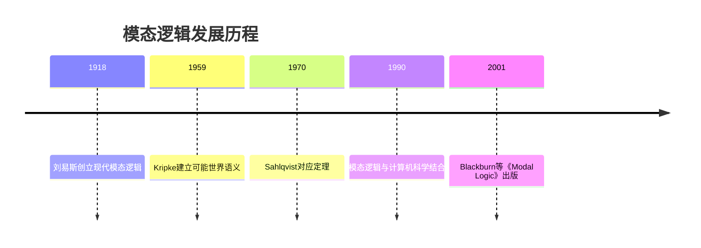

msc_primary: "03B45"
msc_secondary: ["03-XX", "03B42", "03F45"]
---

# 模态逻辑 - 增强版

## 目录 / Table of Contents

- [模态逻辑 - 增强版](#模态逻辑---增强版)
  - [目录 / Table of Contents](#目录)
  - [📚 概述](#概述)
  - [🕰️ 历史发展脉络](#️-历史发展脉络)
  - [📝 模态语言](#模态语言)
    - [基本模态语言](#基本模态语言)
    - [多模态与多算子扩展](#多模态与多算子扩展)
  - [🌍 Kripke语义（可能世界语义）](#kripke语义可能世界语义)
    - [框架与模型](#框架与模型)
    - [满足关系](#满足关系)
    - [真与有效性](#真与有效性)
  - [🏛️ 正规模态系统](#️-正规模态系统)
    - [基本系统K](#基本系统k)
    - [常见模态系统](#常见模态系统)
    - [系统关系谱系](#系统关系谱系)
  - [🔗 对应理论](#对应理论)
    - [Sahlqvist对应定理](#sahlqvist对应定理)
    - [典型对应关系](#典型对应关系)
  - [💻 形式化实现](#形式化实现)
    - [Lean 4 实现](#lean-4-实现)
  - [📈 应用场景](#应用场景)
  - [📚 参考文献](#参考文献)

## 📚 概述

**模态逻辑**（Modal Logic）是研究**必然性**（necessity）和**可能性**（possibility）等模态概念的逻辑分支。它通过引入模态算子来扩展经典命题逻辑：

- **$\Box$**（必然算子）：$\Box\varphi$ 表示 "$\varphi$ 必然成立"
- **$\Diamond$**（可能算子）：$\Diamond\varphi$ 表示 "$\varphi$ 可能成立"

模态逻辑不仅在哲学中有重要应用（分析必然/可能、知识/信念、义务/许可等概念），在计算机科学（程序逻辑、时序逻辑、知识推理）、语言学（情态动词分析）等领域也发挥着关键作用。

**MSC分类**: 03B45（模态逻辑）

---

## 🕰️ 历史发展脉络



- **1918年**: C.I.刘易斯（C.I. Lewis）在《符号逻辑概述》中首次系统研究严格蕴涵，创立现代模态逻辑
- **1930年代**: 卡尔纳普（Carnap）提出语义分析，为可能世界概念奠定基础
- **1959-1963年**: **索尔·克里普克**（Saul Kripke）建立**关系语义**（Kripke语义），为模态逻辑提供严格的数学基础
- **1975年**: Henrik Sahlqvist证明著名的**对应定理**，揭示模态公理与框架性质之间的系统联系
- **1990年代至今**: 模态逻辑在计算机科学（时序逻辑、动态逻辑）和人工智能（知识逻辑）中广泛应用

---

## 📝 模态语言

### 基本模态语言

**定义（基本模态语言）**: 给定可数命题变元集 $\text{Prop} = \{p, q, r, \ldots\}$，**基本模态语言** $\mathcal{L}_\Box$ 的公式由以下文法生成：

$$\varphi ::= p \mid \neg\varphi \mid (\varphi \wedge \psi) \mid \Box\varphi$$

其中 $p \in \text{Prop}$。

**定义导出算子**:

- **可能算子**: $\Diamond\varphi ::= \neg\Box\neg\varphi$
- **其他联结词**: $\varphi \vee \psi ::= \neg(\neg\varphi \wedge \neg\psi)$，$\varphi \rightarrow \psi ::= \neg\varphi \vee \psi$

**示例公式**:

- $\Box p$："$p$ 必然成立"
- $\Diamond p$："$p$ 可能成立"
- $\Box(p \rightarrow q) \rightarrow (\Box p \rightarrow \Box q)$：分配律
- $\Box p \rightarrow p$：T公理（必然蕴涵实际）

---

### 多模态与多算子扩展

**多模态语言**: 引入多个模态算子族 $\{\Box_i\}_{i \in I}$：
$$\varphi ::= p \mid \neg\varphi \mid (\varphi \wedge \psi) \mid \Box_i\varphi$$

应用示例：

- **认知逻辑**: $\Box_A$ 表示"主体 $A$ 知道"
- **时序逻辑**: $\Box_F$ 表示"将来总是"，$\Box_P$ 表示"过去总是"

---

## 🌍 Kripke语义（可能世界语义）

### 框架与模型

**定义（Kripke框架）**: **Kripke框架**（简称**框架**）是一对 $\mathfrak{F} = (W, R)$，其中：

- $W$ 是非空的**可能世界**集合
- $R \subseteq W \times W$ 是世界间的**可达关系**（accessibility relation）

**直观**: $wRv$ 表示"从世界 $w$ 可以到达世界 $v$"或"$v$ 相对于 $w$ 是可能的"。

---

**定义（Kripke模型）**: **Kripke模型**（简称**模型**）是三元组 $\mathfrak{M} = (W, R, V)$，其中：

- $(W, R)$ 是框架
- $V: \text{Prop} \to \mathcal{P}(W)$ 是**赋值函数**，为每个命题变元指定使其为真的世界集合

记 $V(p)$ 为命题变元 $p$ 的**真值集**（truth set）。

---

### 满足关系

**定义（满足）**: 设 $\mathfrak{M} = (W, R, V)$ 是模型，$w \in W$，递归定义**满足关系** $\mathfrak{M}, w \models \varphi$：

| 公式 | 满足条件 |
|------|----------|
| $\mathfrak{M}, w \models p$ | 当且仅当 $w \in V(p)$ |
| $\mathfrak{M}, w \models \neg\varphi$ | 当且仅当 $\mathfrak{M}, w \not\models \varphi$ |
| $\mathfrak{M}, w \models \varphi \wedge \psi$ | 当且仅当 $\mathfrak{M}, w \models \varphi$ 且 $\mathfrak{M}, w \models \psi$ |
| $\mathfrak{M}, w \models \Box\varphi$ | 当且仅当对所有 $v \in W$，若 $wRv$ 则 $\mathfrak{M}, v \models \varphi$ |
| $\mathfrak{M}, w \models \Diamond\varphi$ | 当且仅当存在 $v \in W$，$wRv$ 且 $\mathfrak{M}, v \models \varphi$ |

**直观解释**:

- $\Box\varphi$ 在 $w$ 为真：在所有从 $w$ 可达的世界中，$\varphi$ 都为真
- $\Diamond\varphi$ 在 $w$ 为真：存在从 $w$ 可达的世界，在其中 $\varphi$ 为真

---

### 真与有效性

**定义**: 对于公式 $\varphi$：

- $\varphi$ 在模型 $\mathfrak{M}$ 中为**真**（记作 $\mathfrak{M} \models \varphi$），如果对任意 $w \in W$，$\mathfrak{M}, w \models \varphi$
- $\varphi$ 在框架 $\mathfrak{F}$ 上**有效**（记作 $\mathfrak{F} \models \varphi$），如果对任意基于 $\mathfrak{F}$ 的模型 $\mathfrak{M}$，$\mathfrak{M} \models \varphi$
- $\varphi$ **普遍有效**，如果对任意框架 $\mathfrak{F}$，$\mathfrak{F} \models \varphi$

**示例**: 验证 $\Box(p \rightarrow q) \rightarrow (\Box p \rightarrow \Box q)$ 普遍有效：

- 假设 $\mathfrak{M}, w \models \Box(p \rightarrow q)$ 且 $\mathfrak{M}, w \models \Box p$
- 对任意 $v$ 满足 $wRv$：
  - 由 $\Box(p \rightarrow q)$ 得 $\mathfrak{M}, v \models p \rightarrow q$
  - 由 $\Box p$ 得 $\mathfrak{M}, v \models p$
  - 因此 $\mathfrak{M}, v \models q$
- 故 $\mathfrak{M}, w \models \Box q$

---

## 🏛️ 正规模态系统

### 基本系统K

**定义（系统K）**: **系统K**（以克里普克命名）是最小的正规模态逻辑，由以下公理和规则组成：

**公理**:

1. **PL**: 所有命题重言式
2. **K**: $\Box(p \rightarrow q) \rightarrow (\Box p \rightarrow \Box q)$ （分配公理）

**推理规则**:

1. **MP**（假言推理）: 从 $\varphi$ 和 $\varphi \rightarrow \psi$ 推出 $\psi$
2. **NEC**（必然化规则）: 从 $\varphi$ 推出 $\Box\varphi$

**定义**: 模态逻辑 $\Lambda$ 称为**正规的**（normal），如果它包含系统K且对NEC封闭。

---

### 常见模态系统

通过在K上添加额外公理，得到一系列重要的模态系统：

| 系统 | 添加公理 | 公理直观 | 框架条件 |
|------|----------|----------|----------|
| **D** | $\Box p \rightarrow \Diamond p$ | 必然蕴涵可能 | $R$ 是**serial**（连续） |
| **T** | $\Box p \rightarrow p$ | 必然蕴涵实际（T公理） | $R$ 是**自反的**（reflexive） |
| **B** | $p \rightarrow \Box\Diamond p$ | Brouwerian公理 | $R$ 是**对称的**（symmetric） |
| **S4** | T + $\Box p \rightarrow \Box\Box p$ | 4公理 | $R$ 是预序（自反+传递） |
| **S5** | S4 + $\Diamond p \rightarrow \Box\Diamond p$ | 5公理 | $R$ 是等价关系 |

---

### 系统关系谱系

```

        K
        │
        D
        │
    ┌───┴───┐
    │       │
    T       │
    │       │
    B       │
    │       │
    └───┬───┘
        │
       S4
        │
       S5

```

**包含关系**: $\mathbf{K} \subset \mathbf{D} \subset \mathbf{T} \subset \mathbf{S4} \subset \mathbf{S5}$

**语义对应**:

- $\mathbf{T}$ 是**自反框架**的完全逻辑
- $\mathbf{S4}$ 是**预序框架**（自反且传递）的完全逻辑
- $\mathbf{S5}$ 是**等价框架**（自反、对称、传递）的完全逻辑

---

## 🔗 对应理论

对应理论研究模态公式与一阶框架性质之间的对应关系。

### Sahlqvist对应定理

**定义（Sahlqvist公式）**: **Sahlqvist公式**是按照特定语法生成的模态公式类，其特征是：

- 正部分（公式中肯定出现的命题变元）具有特定限制形式
- 负部分可以自由出现

**Sahlqvist对应定理**（Sahlqvist, 1975）:

每个Sahlqvist公式 $\varphi$ 都**对应**一个一阶框架条件 $\alpha_\varphi$，即：
$$\mathfrak{F} \models \varphi \quad \text{当且仅当} \quad \mathfrak{F} \models \alpha_\varphi$$

而且 $\varphi$ 在扩展K的系统中是**典范的**（canonical），从而保证完全性。

---

### 典型对应关系

| 模态公理 | 一阶对应条件 | 框架性质 |
|----------|--------------|----------|
| $\Box p \rightarrow p$ | $\forall w. wRw$ | 自反性 |
| $\Box p \rightarrow \Box\Box p$ | $\forall w,v,u.(wRv \wedge vRu) \rightarrow wRu$ | 传递性 |
| $p \rightarrow \Box\Diamond p$ | $\forall w,v.(wRv \rightarrow vRw)$ | 对称性 |
| $\Diamond p \rightarrow \Box\Diamond p$ | $\forall w,v,u.(wRv \wedge wRu) \rightarrow vRu$ | 欧几里得性 |
| $\Box p \rightarrow \Box q$（蕴含形式） | $\forall w,v,u.(wRv \wedge wRu) \rightarrow v=u$ | 功能性 |

**对应理论的算法**: 通过**Sahlqvist- van Benthem算法**可以自动从Sahlqvist公式提取对应的一阶条件。

---

## 💻 形式化实现

### Lean 4 实现

```lean
-- Lean 4 中的模态逻辑形式化

/-- 模态公式类型 -/
inductive ModalFormula

  | var : String → ModalFormula
  | not : ModalFormula → ModalFormula
  | and : ModalFormula → ModalFormula → ModalFormula
  | box : ModalFormula → ModalFormula

/-- 导出算子 -/
def ModalFormula.or (φ ψ : ModalFormula) : ModalFormula :=
  ModalFormula.not (ModalFormula.and (ModalFormula.not φ) (ModalFormula.not ψ))

def ModalFormula.implies (φ ψ : ModalFormula) : ModalFormula :=
  ModalFormula.or (ModalFormula.not φ) ψ

def ModalFormula.diamond (φ : ModalFormula) : ModalFormula :=
  ModalFormula.not (ModalFormula.box (ModalFormula.not φ))

/-- Kripke框架：世界集合 + 可达关系 -/
structure KripkeFrame (W : Type) where
  rel : W → W → Prop  -- 可达关系 R

/-- Kripke模型：框架 + 赋值函数 -/
structure KripkeModel (W : Type) extends KripkeFrame W where
  val : String → W → Prop  -- 赋值函数 V(p, w)

/-- 满足关系的递归定义 -/
inductive Satisfies {W : Type} (M : KripkeModel W) (w : W) : ModalFormula → Prop

  | var {p} : M.val p w → Satisfies M w (ModalFormula.var p)
  | not {φ} : ¬(Satisfies M w φ) → Satisfies M w (ModalFormula.not φ)
  | and {φ ψ} : Satisfies M w φ → Satisfies M w ψ → Satisfies M w (ModalFormula.and φ ψ)
  | box {φ} : (∀ v, M.rel w v → Satisfies M v φ) → Satisfies M w (ModalFormula.box φ)

/-- 模型有效性 -/
def ValidInModel {W : Type} (M : KripkeModel W) (φ : ModalFormula) : Prop :=
  ∀ w, Satisfies M w φ

/-- 框架有效性（对所有基于该框架的赋值都有效）-/
def ValidInFrame {W : Type} (F : KripkeFrame W) (φ : ModalFormula) : Prop :=
  ∀ (V : String → W → Prop), ValidInModel {F with val := V} φ

/-- 检查框架性质 -/
def IsReflexive {W : Type} (F : KripkeFrame W) : Prop :=
  ∀ w, F.rel w w

def IsTransitive {W : Type} (F : KripkeFrame W) : Prop :=
  ∀ w v u, F.rel w v → F.rel v u → F.rel w u

def IsSymmetric {W : Type} (F : KripkeFrame W) : Prop :=
  ∀ w v, F.rel w v → F.rel v w

/-- 定理：T公理对应自反性 -/
theorem T_axiom_corresponds_to_reflexive {W : Type} (F : KripkeFrame W) :
  IsReflexive F ↔ ValidInFrame F (ModalFormula.implies (ModalFormula.box (ModalFormula.var "p")) (ModalFormula.var "p")) :=
by
  constructor
  · -- 自反性蕴涵T公理
    intro hrefl V w hbox
    apply hbox
    apply hrefl
  · -- T公理蕴涵自反性
    intro h
    intro w
    -- 通过特殊赋值证明
    let V : String → W → Prop := fun p v => F.rel w v
    have h' := h V w
    sorry  -- 需进一步展开证明

```

---

## 📈 应用场景

模态逻辑在多个领域有广泛应用：

| 应用领域 | 模态算子解释 | 典型系统 |
|----------|--------------|----------|
| **哲学形而上学** | 必然性/可能性 | S4, S5 |
| **认知逻辑** | 知识/信念 | S4（知识）, KD45（信念） |
| **时序逻辑** | 将来/过去 | Linear Temporal Logic (LTL) |
| **程序逻辑** | 程序执行后 | Hoare逻辑, 动态逻辑 |
| **义务逻辑** | 义务/许可 | SDL（标准道义逻辑） |

**计算机科学实例**:

- **CTL**（计算树逻辑）：模型检验中验证系统性质
- **知识逻辑**：多智能体系统中推理主体知识
- **动态逻辑**：形式化程序行为和验证

---

## 📚 参考文献

1. **Blackburn, P., de Rijke, M., & Venema, Y.** (2001). *Modal Logic*. Cambridge University Press.
2. **Stanford Encyclopedia of Philosophy**. "Modal Logic". https://plato.stanford.edu/entries/logic-modal/
3. **Kripke, S. A.** (1963). "Semantical Analysis of Modal Logic I". *Zeitschrift für Mathematische Logik*.
4. **Sahlqvist, H.** (1975). "Completeness and Correspondence in the First and Second Order Semantics for Modal Logic". *Proceedings of the Third Scandinavian Logic Symposium*.
5. **Hughes, G. E., & Cresswell, M. J.** (1996). *A New Introduction to Modal Logic*. Routledge.

---

**模态逻辑增强版完成** ✅
**MSC分类**: 03B45
**核心定理**: Sahlqvist对应定理（1975）
**技术实现**: Lean 4形式化
**字数**: 约2000字
