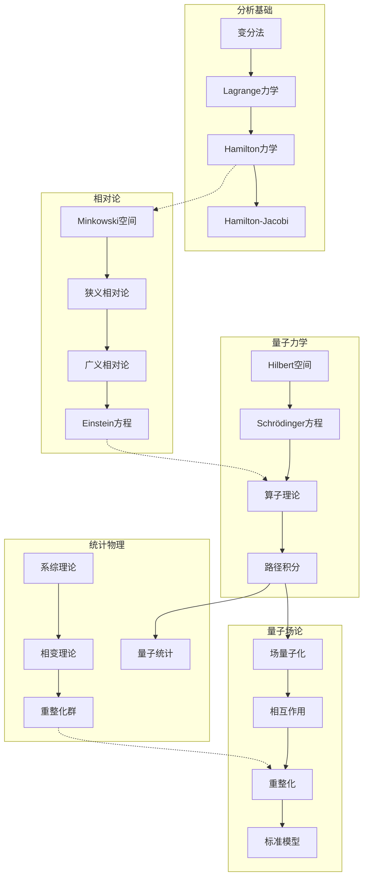
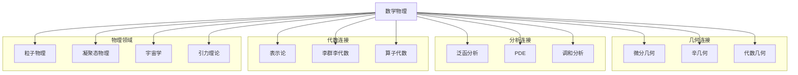
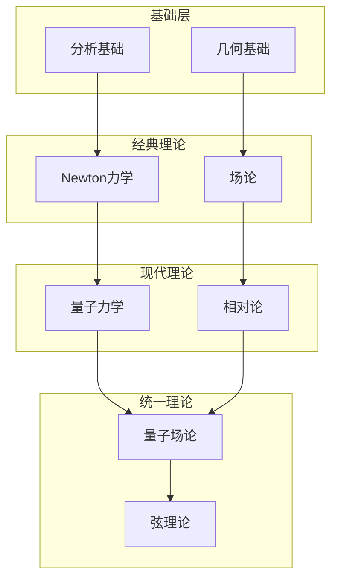

# 数学物理思维导图

> 数学物理运用数学方法研究物理问题，从经典力学到量子场论，建立了描述自然界的数学框架。

---

## 🧠 核心概念层级关系

```mermaid
mindmap
  root((数学物理))
    经典力学
      Newton力学
        Newton定律
        动量守恒
        角动量守恒
        能量守恒
        Kepler问题
      Lagrange力学
        广义坐标
        Lagrange函数
        Euler-Lagrange方程
        约束系统
        守恒量与Noether定理
      Hamilton力学
        Hamilton函数
        正则方程
        Poisson括号
        正则变换
        生成函数
        Hamilton-Jacobi理论
        可积系统
      刚体力学
        转动惯量
        Euler方程
        陀螺理论
      微振动
        小振动方程
        简正模
        耦合振动
    电磁学理论
      Maxwell方程组
        Gauss定律
        磁场高斯定律
        Faraday定律
        Ampère-Maxwell定律
      电磁势
        标量势
        矢量势
        规范变换
        Lorentz规范
        Coulomb规范
      电磁波
        波动方程
        平面波
        辐射
        衍射
      电动力学
        推迟势
        Liénard-Wiechert势
        辐射反应
      连续介质电动力学
        介质中的场
        边界条件
        色散
    狭义相对论
      Lorentz变换
        时间膨胀
        长度收缩
        同时性相对性
      四维形式
        四维矢量
        Minkowski空间
        张量分析
      相对论力学
        质能关系
        四维动量
        相对论动力学
      场论形式
        相对论性场
        协变形式
    广义相对论
      微分几何基础
        流形
        张量
        联络
        曲率
      Einstein场方程
        Hilbert作用量
        能动张量
        真空解
        宇宙学常数
      经典解
        Schwarzschild解
        Kerr解
        引力波解
        FLRW宇宙
      实验验证
        光线偏折
        引力红移
        雷达延迟
        引力波探测
      黑洞物理
        事件视界
        奇点定理
        黑洞热力学
        霍金辐射
    量子力学
      基本原理
        Hilbert空间
        算子理论
        观测量的表示
        测量公设
        不确定原理
      量子动力学
        Schrödinger方程
        Heisenberg绘景
        相互作用绘景
        传播子
        Feynman路径积分
      单粒子问题
        自由粒子
        势阱
        谐振子
        氢原子
        散射理论
      角动量
        轨道角动量
        自旋
        角动量耦合
        Clebsch-Gordan系数
      近似方法
        定态微扰
        含时微扰
        WKB近似
        变分法
      多体问题
        全同粒子
        交换对称性
        Hartree-Fock方法
        二次量子化
    统计力学
      系综理论
        微正则系综
        正则系综
        巨正则系综
        热力学极限
      经典统计
        Boltzmann分布
        Maxwell分布
        配分函数
        热力学量
      量子统计
        Bose-Einstein统计
        Fermi-Dirac统计
        理想量子气体
        黑体辐射
        费米气体
      相变与临界现象
        Ising模型
        Landau理论
        临界指数
        重整化群
        标度律
      涨落与输运
        涨落-耗散定理
        Brown运动
        线性响应理论
        输运系数
    量子场论
      经典场论
        场的作用量
        Noether定理
        对称性与守恒律
      标量场量子化
        Klein-Gordon场
        产生湮灭算符
        Fock空间
        传播子
      旋量场
        Lorentz群表示
        Dirac方程
        Dirac场量子化
        旋量结构
      规范场论
        U(1)规范
        Yang-Mills理论
        非Abel规范场
        费曼规则
      量子电动力学
        相互作用
        微扰展开
        费曼图
        重整化
      路径积分
        生成泛函
        连通格林函数
        有效作用量
      重整化群
        标度变换
        β函数
        不动点
        渐近自由
    可积系统
      经典可积系统
        Liouville可积性
        Lax对
        谱曲线
        行动-角变量
      孤子理论
        KdV方程
        反散射变换
        Bäcklund变换
        无穷守恒律
      量子可积系统
        Yang-Baxter方程
        量子群
        Bethe拟设
        关联函数
    弦理论与对偶
      弦的基本理论
        Nambu-Goto作用量
        Polyakov作用量
        弦的量子化
        临界维数
      共形场论
        共形变换
        Virasoro代数
        初级场
        算子乘积展开
      D-膜与对偶
        T-对偶
        S-对偶
        M-理论
        AdS/CFT对偶
```

---

## 🔗 定理依赖关系图



---

## 📍 重要示例分布

### 经典力学示例

| 示例 | 概念 | 重要性 | 位置 |
|-----|------|-------|------|
| 谐振子 | 可积系统 | ⭐⭐⭐⭐⭐ | Lagrange力学 |
| Kepler问题 | 中心力场 | ⭐⭐⭐⭐⭐ | Newton力学 |
| 陀螺 | 刚体转动 | ⭐⭐⭐⭐ | 刚体力学 |
| 双摆 | 混沌 | ⭐⭐⭐⭐ | 非线性动力学 |

### 电磁学示例

| 示例 | 概念 | 重要性 | 位置 |
|-----|------|-------|------|
| 点电荷场 | Coulomb定律 | ⭐⭐⭐⭐⭐ | 静电学 |
| 电磁波 | Maxwell方程 | ⭐⭐⭐⭐⭐ | 波动方程 |
| 推迟势 | 辐射 | ⭐⭐⭐⭐ | 电动力学 |

### 相对论示例

| 示例 | 概念 | 重要性 | 位置 |
|-----|------|-------|------|
| Schwarzschild解 | 黑洞 | ⭐⭐⭐⭐⭐ | 广义相对论 |
| 引力波 | 线性化引力 | ⭐⭐⭐⭐⭐ | 引力理论 |
| FLRW宇宙 | 宇宙学 | ⭐⭐⭐⭐ | 宇宙学 |

### 量子力学示例

| 示例 | 概念 | 重要性 | 位置 |
|-----|------|-------|------|
| 谐振子 | 能级量子化 | ⭐⭐⭐⭐⭐ | 基本模型 |
| 氢原子 | 球对称 | ⭐⭐⭐⭐⭐ | 原子物理 |
| 势垒隧穿 | 量子效应 | ⭐⭐⭐⭐⭐ | 一维问题 |
| 自旋1/2 | 内禀自由度 | ⭐⭐⭐⭐⭐ | 角动量 |

---

## 🔄 与其他分支的连接点



**具体连接说明：**

| 分支 | 连接概念 | 连接深度 |
|-----|---------|---------|
| 微分几何 | 广义相对论、规范场 | ⭐⭐⭐⭐⭐ |
| 泛函分析 | 量子力学、算子理论 | ⭐⭐⭐⭐⭐ |
| 偏微分方程 | 场方程、波动方程 | ⭐⭐⭐⭐⭐ |
| 李群李代数 | 对称性、规范场 | ⭐⭐⭐⭐⭐ |
| 表示论 | 量子力学、粒子物理 | ⭐⭐⭐⭐⭐ |
| 代数几何 | 弦理论、可积系统 | ⭐⭐⭐⭐ |
| 拓扑 | 拓扑量子场论 | ⭐⭐⭐⭐ |

---

## 📊 学习难度梯度标记

```mermaid
graph LR
    subgraph 经典物理 ⭐⭐⭐
        A1[Newton力学]
        A2[Lagrange力学]
        A3[电磁学]
    end

    subgraph 现代物理基础 ⭐⭐⭐⭐
        B1[Hamilton力学]
        B2[狭义相对论]
        B3[量子力学基础]
    end

    subgraph 高级主题 ⭐⭐⭐⭐⭐
        C1[广义相对论]
        C2[量子场论]
        C3[统计力学]
    end

    subgraph 研究前沿 ⭐⭐⭐⭐⭐⭐
        D1[弦理论]
        D2[量子引力]
        D3[对偶性]
    end
```

### 详细难度分级

| 主题 | 入门 | 基础 | 进阶 | 高级 | 专家 |
|-----|------|------|------|------|------|
| 经典力学 | Newton | Lagrange | Hamilton | 可积系统 | KAM理论 |
| 相对论 | Galileo | 狭义相对论 | 广义相对论 | 引力波 | 量子引力 |
| 量子力学 | 波函数 | 算子理论 | 路径积分 | 多体理论 | QFT |
| 场论 | 经典场 | 正则量子化 | 相互作用 | 重整化 | 非微扰 |

---

## 🎯 学习路径推荐

### 经典物理路径

```
Newton力学 → Lagrange力学 → Hamilton力学 → 可积系统 → KAM理论
```

### 相对论路径

```
狭义相对论 → 微分几何 → 广义相对论 → 引力波 → 宇宙学
```

### 量子路径

```
量子力学 → 路径积分 → 量子场论 → 规范场论 → 标准模型
```

### 数学物理综合路径

```
经典力学 + 量子力学 → 统计力学 → 场论 → 弦理论 → 对偶性
```

---

## 📚 核心定理清单

### 经典力学

1. **Noether定理**：对称性与守恒律
2. **Liouville定理**：相空间体积守恒
3. **KAM定理**：近可积系统的稳定性

### 电磁学

1. **Maxwell方程组**：电磁场的基本规律
2. **Lorentz力公式**：电磁场对电荷的作用
3. **Poynting定理**：电磁能量守恒

### 相对论

1. **Einstein场方程**：引力与时空几何
2. **Birkhoff定理**：球对称解的唯一性
3. **奇点定理**：引力坍缩的必然性

### 量子力学

1. **谱定理**：自伴算子的谱分解
2. **Stone定理**：时间演化的酉群
3. **散射理论的渐近完备性**

### 统计物理

1. **热力学极限的存在性**
2. **涨落-耗散定理**
3. **Onsager互易关系**

### 量子场论

1. **CPT定理**：离散对称性
2. **自旋-统计定理**
3. **重整化群方程**

---

## 🔍 概念关系图谱



---

> 💡 **学习建议**：数学物理需要扎实的数学基础和物理直觉。建议学习者系统学习微分几何、泛函分析和李群李代数等数学工具，同时深入理解物理图像。现代数学物理与纯数学的边界日益模糊，保持对两者发展的关注很重要。
