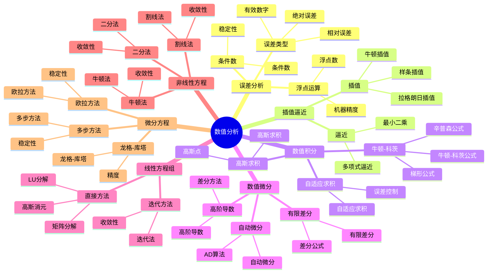

# 数值分析 / Numerical Analysis

## 目录 / Table of Contents

- [数值分析 / Numerical Analysis](#数值分析--numerical-analysis)
  - [目录 / Table of Contents](#目录--table-of-contents)
  - [🗺️ 数值分析核心概念思维导图](#️-数值分析核心概念思维导图)
  - [📊 数值分析核心概念多维知识矩阵](#-数值分析核心概念多维知识矩阵)
  - [1. 基本概念 / Basic Concepts](#1-基本概念--basic-concepts)
    - [1.1 误差分析 / Error Analysis](#11-误差分析--error-analysis)
    - [1.2 条件数与稳定性 / Condition Number and Stability](#12-条件数与稳定性--condition-number-and-stability)
    - [1.3 浮点运算 / Floating Point Arithmetic](#13-浮点运算--floating-point-arithmetic)
  - [2. 插值与逼近 / Interpolation and Approximation](#2-插值与逼近--interpolation-and-approximation)
    - [2.1 拉格朗日插值 / Lagrange Interpolation](#21-拉格朗日插值--lagrange-interpolation)
    - [2.2 牛顿插值 / Newton Interpolation](#22-牛顿插值--newton-interpolation)
    - [2.3 样条插值 / Spline Interpolation](#23-样条插值--spline-interpolation)
    - [2.4 最小二乘逼近 / Least Squares Approximation](#24-最小二乘逼近--least-squares-approximation)
  - [3. 数值积分 / Numerical Integration](#3-数值积分--numerical-integration)
    - [3.1 牛顿-科茨公式 / Newton-Cotes Formulas](#31-牛顿-科茨公式--newton-cotes-formulas)
    - [3.2 高斯求积 / Gaussian Quadrature](#32-高斯求积--gaussian-quadrature)
    - [3.3 自适应求积 / Adaptive Quadrature](#33-自适应求积--adaptive-quadrature)
  - [4. 数值微分 / Numerical Differentiation](#4-数值微分--numerical-differentiation)
    - [4.1 有限差分 / Finite Differences](#41-有限差分--finite-differences)
    - [4.2 高阶导数 / Higher Order Derivatives](#42-高阶导数--higher-order-derivatives)
    - [4.3 自动微分 / Automatic Differentiation](#43-自动微分--automatic-differentiation)
  - [5. 线性方程组 / Linear Systems](#5-线性方程组--linear-systems)
    - [5.1 高斯消元法 / Gaussian Elimination](#51-高斯消元法--gaussian-elimination)
    - [5.2 LU分解 / LU Decomposition](#52-lu分解--lu-decomposition)
    - [5.3 迭代方法 / Iterative Methods](#53-迭代方法--iterative-methods)
  - [6. 非线性方程 / Nonlinear Equations](#6-非线性方程--nonlinear-equations)
    - [6.1 二分法 / Bisection Method](#61-二分法--bisection-method)
    - [6.2 牛顿法 / Newton's Method](#62-牛顿法--newtons-method)
    - [6.3 割线法 / Secant Method](#63-割线法--secant-method)
  - [7. 微分方程数值解 / Numerical Solution of Differential Equations](#7-微分方程数值解--numerical-solution-of-differential-equations)
    - [7.1 欧拉方法 / Euler's Method](#71-欧拉方法--eulers-method)
    - [7.2 龙格-库塔方法 / Runge-Kutta Methods](#72-龙格-库塔方法--runge-kutta-methods)
    - [7.3 多步方法 / Multistep Methods](#73-多步方法--multistep-methods)
  - [8. 形式化实现 / Formal Implementation](#8-形式化实现--formal-implementation)
    - [8.1 Lean 4 实现 / Lean 4 Implementation](#81-lean-4-实现--lean-4-implementation)
    - [8.2 Haskell 实现 / Haskell Implementation](#82-haskell-实现--haskell-implementation)
    - [8.3 重要定理总结 / Summary of Important Theorems](#83-重要定理总结--summary-of-important-theorems)
  - [参考文献 / References](#参考文献--references)
  - [交互与补充资源 / Interactive \& Supplementary Resources](#交互与补充资源--interactive--supplementary-resources)
    - [交互式图表增强](#交互式图表增强)
    - [定理证明补充](#定理证明补充)
    - [反例与特殊情况补充](#反例与特殊情况补充)
    - [历史背景补充](#历史背景补充)

---

## 🗺️ 数值分析核心概念思维导图



## 📊 数值分析核心概念多维知识矩阵

| 概念类别 | 核心概念 | 定义要点 | 关键性质 | 典型例子 | 应用场景 |
|---------|---------|---------|---------|---------|---------|
| 误差分析 | 绝对误差 | 误差绝对值 | 误差度量 | \|x-x̂\| | 误差分析 |
| 误差分析 | 相对误差 | 相对误差 | 误差度量 | \|x-x̂\|/\|x\| | 误差分析 |
| 误差分析 | 条件数 | 条件数 | 稳定性 | κ(f,x) | 误差分析 |
| 误差分析 | 数值稳定性 | 稳定性 | 误差控制 | 稳定性 | 误差分析 |
| 插值逼近 | 拉格朗日插值 | 插值多项式 | 唯一性 | L(x) | 插值方法 |
| 插值逼近 | 牛顿插值 | 差商插值 | 递推性 | N(x) | 插值方法 |
| 插值逼近 | 样条插值 | 分段插值 | 光滑性 | S(x) | 插值方法 |
| 插值逼近 | 最小二乘 | 最小二乘 | 最优性 | 最小二乘 | 逼近方法 |
| 数值积分 | 牛顿-科茨公式 | 数值积分 | 精度 | 牛顿-科茨 | 数值积分 |
| 数值积分 | 高斯求积 | 高斯求积 | 高精度 | 高斯求积 | 数值积分 |
| 数值积分 | 自适应求积 | 自适应 | 误差控制 | 自适应 | 数值积分 |
| 数值微分 | 有限差分 | 差分公式 | 精度 | 有限差分 | 数值微分 |
| 数值微分 | 自动微分 | AD算法 | 精确性 | AD | 数值微分 |
| 线性方程组 | 高斯消元 | 消元法 | 直接法 | 高斯消元 | 线性系统 |
| 线性方程组 | LU分解 | 矩阵分解 | 分解 | LU | 线性系统 |
| 线性方程组 | 迭代方法 | 迭代法 | 收敛性 | 迭代法 | 线性系统 |
| 非线性方程 | 二分法 | 二分法 | 收敛性 | 二分法 | 非线性系统 |
| 非线性方程 | 牛顿法 | 牛顿法 | 二次收敛 | 牛顿法 | 非线性系统 |
| 非线性方程 | 割线法 | 割线法 | 超线性收敛 | 割线法 | 非线性系统 |
| 微分方程 | 欧拉方法 | 欧拉法 | 一阶精度 | 欧拉法 | 微分方程 |
| 微分方程 | 龙格-库塔 | RK方法 | 高阶精度 | RK4 | 微分方程 |
| 微分方程 | 多步方法 | 多步法 | 稳定性 | 多步法 | 微分方程 |
| 应用 | 科学计算 | 数值方法 | 计算 | 科学计算 | 工程应用 |

## 1. 基本概念 / Basic Concepts

### 1.1 误差分析 / Error Analysis

**定义 1.1.1** (绝对误差 / Absolute Error)
绝对误差定义为：
$$E_a = |x - \hat{x}|$$
其中 $x$ 是精确值，$\hat{x}$ 是近似值。

**定义 1.1.2** (相对误差 / Relative Error)
相对误差定义为：
$$E_r = \frac{|x - \hat{x}|}{|x|}$$

**定义 1.1.3** (有效数字 / Significant Digits)
近似值 $\hat{x}$ 有 $n$ 位有效数字，如果：
$$\frac{|x - \hat{x}|}{|x|} \leq \frac{1}{2} \times 10^{-n+1}$$

**定理 1.1.1** (误差传播 / Error Propagation)
对于函数 $f(x_1, \ldots, x_n)$，如果 $x_i$ 的误差为 $\Delta x_i$，则：
$$\Delta f \approx \sum_{i=1}^n \left|\frac{\partial f}{\partial x_i}\right| |\Delta x_i|$$

### 1.2 条件数与稳定性 / Condition Number and Stability

**定义 1.2.1** (条件数 / Condition Number)
函数 $f$ 在点 $x$ 的条件数定义为：
$$\kappa(f,x) = \lim_{\epsilon \to 0} \sup_{|\Delta x| \leq \epsilon} \frac{|f(x + \Delta x) - f(x)|}{|f(x)|} \cdot \frac{|x|}{|\Delta x|}$$

**定义 1.2.2** (数值稳定性 / Numerical Stability)
算法称为数值稳定的，如果输入的小扰动只导致输出的小扰动。

**定理 1.2.1** (条件数的计算 / Computation of Condition Number)
对于可微函数 $f$：
$$\kappa(f,x) = \left|\frac{x f'(x)}{f(x)}\right|$$

### 1.3 浮点运算 / Floating Point Arithmetic

**定义 1.3.1** (浮点数 / Floating Point Number)
浮点数表示为：
$$x = \pm d_0.d_1d_2 \cdots d_{p-1} \times \beta^e$$
其中 $\beta$ 是基数，$p$ 是精度，$e$ 是指数。

**定义 1.3.2** (机器精度 / Machine Epsilon)
机器精度 $\epsilon$ 是 $1$ 与大于 $1$ 的最小浮点数之间的差。

**定理 1.3.1** (浮点运算的误差界 / Error Bounds for Floating Point Operations)
对于浮点运算 $\oplus$：
$$|(x \oplus y) - (x + y)| \leq \epsilon |x + y|$$

---

## 2. 插值与逼近 / Interpolation and Approximation

### 2.1 拉格朗日插值 / Lagrange Interpolation

**定义 2.1.1** (拉格朗日插值 / Lagrange Interpolation)
给定点集 $(x_i, y_i)$，$i = 0, 1, \ldots, n$，拉格朗日插值多项式定义为：
$$L_n(x) = \sum_{i=0}^n y_i \ell_i(x)$$
其中：
$$\ell_i(x) = \prod_{j=0, j \neq i}^n \frac{x - x_j}{x_i - x_j}$$

**定理 2.1.1** (拉格朗日插值的唯一性 / Uniqueness of Lagrange Interpolation)
通过 $n+1$ 个不同点的 $n$ 次插值多项式是唯一的。

**定理 2.1.2** (插值误差 / Interpolation Error)
如果 $f \in C^{n+1}[a,b]$，则：
$$f(x) - L_n(x) = \frac{f^{(n+1)}(\xi)}{(n+1)!} \prod_{i=0}^n (x - x_i)$$
其中 $\xi \in (a,b)$。

### 2.2 牛顿插值 / Newton Interpolation

**定义 2.2.1** (差商 / Divided Difference)
$k$ 阶差商定义为：
$$f[x_0, x_1, \ldots, x_k] = \frac{f[x_1, \ldots, x_k] - f[x_0, \ldots, x_{k-1}]}{x_k - x_0}$$

**定义 2.2.2** (牛顿插值多项式 / Newton Interpolation Polynomial)
牛顿插值多项式定义为：
$$N_n(x) = f[x_0] + f[x_0, x_1](x - x_0) + \cdots + f[x_0, \ldots, x_n](x - x_0) \cdots (x - x_{n-1})$$

**定理 2.2.1** (牛顿插值的性质 / Properties of Newton Interpolation)
牛顿插值多项式与拉格朗日插值多项式相同，但计算更高效。

### 2.3 样条插值 / Spline Interpolation

**定义 2.3.1** (样条函数 / Spline Function)
$k$ 次样条函数是在每个子区间 $[x_i, x_{i+1}]$ 上为 $k$ 次多项式的分段函数。

**定义 2.3.2** (三次样条 / Cubic Spline)
三次样条 $S(x)$ 满足：

1. $S(x_i) = y_i$，$i = 0, 1, \ldots, n$
2. $S \in C^2[a,b]$
3. $S''(a) = S''(b) = 0$（自然边界条件）

**定理 2.3.1** (三次样条的存在唯一性 / Existence and Uniqueness of Cubic Spline)
在自然边界条件下，三次样条插值存在且唯一。

### 2.4 最小二乘逼近 / Least Squares Approximation

**定义 2.4.1** (最小二乘逼近 / Least Squares Approximation)
给定点集 $(x_i, y_i)$，$i = 0, 1, \ldots, m$，最小二乘逼近是使误差平方和最小的函数：
$$\min \sum_{i=0}^m (y_i - f(x_i))^2$$

**定理 2.4.1** (多项式最小二乘逼近 / Polynomial Least Squares)
$n$ 次多项式最小二乘逼近的系数满足正规方程组：
$$\sum_{j=0}^n a_j \sum_{i=0}^m x_i^{j+k} = \sum_{i=0}^m y_i x_i^k$$

---

## 3. 数值积分 / Numerical Integration

### 3.1 牛顿-科茨公式 / Newton-Cotes Formulas

**定义 3.1.1** (牛顿-科茨公式 / Newton-Cotes Formula)
牛顿-科茨公式定义为：
$$\int_a^b f(x) dx \approx \sum_{i=0}^n w_i f(x_i)$$
其中 $w_i$ 是权重，$x_i$ 是节点。

**定理 3.1.1** (梯形法则 / Trapezoidal Rule)
$$\int_a^b f(x) dx \approx \frac{h}{2}[f(a) + 2f(a+h) + \cdots + 2f(b-h) + f(b)]$$
其中 $h = \frac{b-a}{n}$。

**定理 3.1.2** (辛普森法则 / Simpson's Rule)
$$\int_a^b f(x) dx \approx \frac{h}{3}[f(a) + 4f(a+h) + 2f(a+2h) + \cdots + 4f(b-h) + f(b)]$$

### 3.2 高斯求积 / Gaussian Quadrature

**定义 3.2.1** (高斯求积 / Gaussian Quadrature)
高斯求积公式定义为：
$$\int_{-1}^1 f(x) dx \approx \sum_{i=1}^n w_i f(x_i)$$
其中 $x_i$ 是勒让德多项式的零点，$w_i$ 是对应的权重。

**定理 3.2.1** (高斯求积的精度 / Precision of Gaussian Quadrature)
$n$ 点高斯求积对 $2n-1$ 次多项式精确。

**定理 3.2.2** (高斯求积的误差 / Error of Gaussian Quadrature)
如果 $f \in C^{2n}[-1,1]$，则：
$$\int_{-1}^1 f(x) dx - \sum_{i=1}^n w_i f(x_i) = \frac{f^{(2n)}(\xi)}{(2n)!} \int_{-1}^1 \prod_{i=1}^n (x - x_i)^2 dx$$

### 3.3 自适应求积 / Adaptive Quadrature

**定义 3.3.1** (自适应求积 / Adaptive Quadrature)
自适应求积根据局部误差自动调整步长。

**算法 3.3.1** (自适应辛普森求积 / Adaptive Simpson Quadrature)

```python
def adaptive_simpson(f, a, b, tol):
    def simpson(f, a, b):
        h = (b - a) / 2
        return h/3 * (f(a) + 4*f(a+h) + f(b))

    def adaptive(f, a, b, tol):
        c = (a + b) / 2
        S1 = simpson(f, a, b)
        S2 = simpson(f, a, c) + simpson(f, c, b)

        if abs(S1 - S2) < 15*tol:
            return S2
        else:
            return adaptive(f, a, c, tol/2) + adaptive(f, c, b, tol/2)

    return adaptive(f, a, b, tol)
```

---

## 4. 数值微分 / Numerical Differentiation

### 4.1 有限差分 / Finite Differences

**定义 4.1.1** (前向差分 / Forward Difference)
$$f'(x) \approx \frac{f(x+h) - f(x)}{h}$$

**定义 4.1.2** (后向差分 / Backward Difference)
$$f'(x) \approx \frac{f(x) - f(x-h)}{h}$$

**定义 4.1.3** (中心差分 / Central Difference)
$$f'(x) \approx \frac{f(x+h) - f(x-h)}{2h}$$

**定理 4.1.1** (差分公式的误差 / Error of Difference Formulas)
前向和后向差分的误差为 $O(h)$，中心差分的误差为 $O(h^2)$。

### 4.2 高阶导数 / Higher Order Derivatives

**定理 4.2.1** (二阶导数的中心差分 / Central Difference for Second Derivative)
$$f''(x) \approx \frac{f(x+h) - 2f(x) + f(x-h)}{h^2}$$

**定理 4.2.2** (理查森外推 / Richardson Extrapolation)
对于步长 $h$ 和 $2h$ 的近似值 $D_h$ 和 $D_{2h}$：
$$D = D_h + \frac{D_h - D_{2h}}{2^p - 1}$$
其中 $p$ 是方法的阶数。

### 4.3 自动微分 / Automatic Differentiation

**定义 4.3.1** (自动微分 / Automatic Differentiation)
自动微分通过链式法则计算导数。

**算法 4.3.1** (前向模式自动微分 / Forward Mode AD)

```python
class Dual:
    def __init__(self, value, derivative=0):
        self.value = value
        self.derivative = derivative

    def __add__(self, other):
        return Dual(self.value + other.value,
                   self.derivative + other.derivative)

    def __mul__(self, other):
        return Dual(self.value * other.value,
                   self.value * other.derivative +
                   self.derivative * other.value)
```

---

## 5. 线性方程组 / Linear Systems

### 5.1 高斯消元法 / Gaussian Elimination

**算法 5.1.1** (高斯消元法 / Gaussian Elimination)

```python
def gaussian_elimination(A, b):
    n = len(A)
    # 前向消元
    for i in range(n):
        for j in range(i+1, n):
            factor = A[j][i] / A[i][i]
            for k in range(i, n):
                A[j][k] -= factor * A[i][k]
            b[j] -= factor * b[i]

    # 回代
    x = [0] * n
    for i in range(n-1, -1, -1):
        x[i] = b[i]
        for j in range(i+1, n):
            x[i] -= A[i][j] * x[j]
        x[i] /= A[i][i]

    return x
```

**定理 5.1.1** (高斯消元法的复杂度 / Complexity of Gaussian Elimination)
高斯消元法的复杂度为 $O(n^3)$。

### 5.2 LU分解 / LU Decomposition

**定义 5.2.1** (LU分解 / LU Decomposition)
矩阵 $A$ 的LU分解是 $A = LU$，其中 $L$ 是下三角矩阵，$U$ 是上三角矩阵。

**定理 5.2.1** (LU分解的存在性 / Existence of LU Decomposition)
如果矩阵 $A$ 的所有主子式非零，则存在LU分解。

**算法 5.2.1** (LU分解算法 / LU Decomposition Algorithm)

```python
def lu_decomposition(A):
    n = len(A)
    L = [[0]*n for _ in range(n)]
    U = [[0]*n for _ in range(n)]

    for i in range(n):
        L[i][i] = 1

        for j in range(i, n):
            U[i][j] = A[i][j] - sum(L[i][k] * U[k][j] for k in range(i))

        for j in range(i+1, n):
            L[j][i] = (A[j][i] - sum(L[j][k] * U[k][i] for k in range(i))) / U[i][i]

    return L, U
```

### 5.3 迭代方法 / Iterative Methods

**定义 5.3.1** (雅可比迭代 / Jacobi Iteration)
$$x_i^{(k+1)} = \frac{1}{a_{ii}} \left(b_i - \sum_{j \neq i} a_{ij} x_j^{(k)}\right)$$

**定义 5.3.2** (高斯-赛德尔迭代 / Gauss-Seidel Iteration)
$$x_i^{(k+1)} = \frac{1}{a_{ii}} \left(b_i - \sum_{j < i} a_{ij} x_j^{(k+1)} - \sum_{j > i} a_{ij} x_j^{(k)}\right)$$

**定理 5.3.1** (收敛性条件 / Convergence Conditions)
如果矩阵 $A$ 严格对角占优，则雅可比和高斯-赛德尔迭代收敛。

---

## 6. 非线性方程 / Nonlinear Equations

### 6.1 二分法 / Bisection Method

**算法 6.1.1** (二分法 / Bisection Method)

```python
def bisection(f, a, b, tol):
    if f(a) * f(b) > 0:
        return None

    while (b - a) > tol:
        c = (a + b) / 2
        if f(c) == 0:
            return c
        elif f(a) * f(c) < 0:
            b = c
        else:
            a = c

    return (a + b) / 2
```

**定理 6.1.1** (二分法的收敛性 / Convergence of Bisection)
二分法线性收敛，每次迭代误差减半。

### 6.2 牛顿法 / Newton's Method

**定义 6.2.1** (牛顿法 / Newton's Method)
牛顿迭代公式为：
$$x_{n+1} = x_n - \frac{f(x_n)}{f'(x_n)}$$

**定理 6.2.1** (牛顿法的收敛性 / Convergence of Newton's Method)
如果 $f'(r) \neq 0$，则牛顿法在 $r$ 附近二次收敛。

**算法 6.2.1** (牛顿法实现 / Newton's Method Implementation)

```python
def newton(f, df, x0, tol, max_iter):
    x = x0
    for i in range(max_iter):
        fx = f(x)
        dfx = df(x)

        if abs(dfx) < 1e-10:
            return None

        x_new = x - fx / dfx

        if abs(x_new - x) < tol:
            return x_new

        x = x_new

    return x
```

### 6.3 割线法 / Secant Method

**定义 6.3.1** (割线法 / Secant Method)
割线法迭代公式为：
$$x_{n+1} = x_n - f(x_n) \frac{x_n - x_{n-1}}{f(x_n) - f(x_{n-1})}$$

**定理 6.3.1** (割线法的收敛性 / Convergence of Secant Method)
割线法的收敛阶为 $\frac{1+\sqrt{5}}{2} \approx 1.618$。

---

## 7. 微分方程数值解 / Numerical Solution of Differential Equations

### 7.1 欧拉方法 / Euler's Method

**定义 7.1.1** (欧拉方法 / Euler's Method)
对于初值问题 $y' = f(t,y)$，$y(t_0) = y_0$，欧拉方法为：
$$y_{n+1} = y_n + h f(t_n, y_n)$$

**定理 7.1.1** (欧拉方法的误差 / Error of Euler's Method)
欧拉方法的局部截断误差为 $O(h^2)$，全局误差为 $O(h)$。

**算法 7.1.1** (欧拉方法实现 / Euler's Method Implementation)

```python
def euler(f, t0, y0, h, n):
    t = [t0 + i*h for i in range(n+1)]
    y = [y0]

    for i in range(n):
        y_next = y[i] + h * f(t[i], y[i])
        y.append(y_next)

    return t, y
```

### 7.2 龙格-库塔方法 / Runge-Kutta Methods

**定义 7.2.1** (四阶龙格-库塔方法 / Fourth Order Runge-Kutta Method)
$$y_{n+1} = y_n + \frac{h}{6}(k_1 + 2k_2 + 2k_3 + k_4)$$
其中：
$$k_1 = f(t_n, y_n)$$
$$k_2 = f(t_n + \frac{h}{2}, y_n + \frac{h}{2}k_1)$$
$$k_3 = f(t_n + \frac{h}{2}, y_n + \frac{h}{2}k_2)$$
$$k_4 = f(t_n + h, y_n + h k_3)$$

**定理 7.2.1** (四阶龙格-库塔的精度 / Accuracy of Fourth Order RK)
四阶龙格-库塔方法的局部截断误差为 $O(h^5)$。

### 7.3 多步方法 / Multistep Methods

**定义 7.3.1** (亚当斯-巴什福思方法 / Adams-Bashforth Method)
$$y_{n+1} = y_n + h \sum_{i=0}^k \beta_i f_{n-i}$$

**定义 7.3.2** (亚当斯-莫尔顿方法 / Adams-Moulton Method)
$$y_{n+1} = y_n + h \sum_{i=0}^k \beta_i f_{n+1-i}$$

**定理 7.3.1** (多步方法的稳定性 / Stability of Multistep Methods)
多步方法的稳定性由特征多项式的根决定。

---

## 8. 形式化实现 / Formal Implementation

### 8.1 Lean 4 实现 / Lean 4 Implementation

```lean
-- 误差分析
structure Error where
  absolute : ℝ
  relative : ℝ
  significantDigits : ℕ

def absoluteError (exact approximate : ℝ) : ℝ :=
  abs (exact - approximate)

def relativeError (exact approximate : ℝ) : ℝ :=
  if exact ≠ 0 then abs (exact - approximate) / abs exact else 0

def significantDigits (exact approximate : ℝ) : ℕ :=
  if exact ≠ 0 then
    let rel := relativeError exact approximate
    if rel ≤ 0.5 * 10^(-n + 1) then n else 0
  else 0

-- 条件数
def conditionNumber (f : ℝ → ℝ) (x : ℝ) : ℝ :=
  if f x ≠ 0 then abs (x * derivative f x / f x) else 0

-- 拉格朗日插值
def lagrangeInterpolation (points : List (ℝ × ℝ)) (x : ℝ) : ℝ :=
  let n := length points - 1
  sum (λ i, (points[i].2 * lagrangeBasis i points x))
  where
    lagrangeBasis i points x :=
      product (λ j, if i ≠ j then (x - points[j].1) / (points[i].1 - points[j].1) else 1)

-- 牛顿插值
def newtonInterpolation (points : List (ℝ × ℝ)) (x : ℝ) : ℝ :=
  let dividedDifferences := computeDividedDifferences points
  sum (λ i, dividedDifferences[i] * newtonBasis i points x)
  where
    newtonBasis i points x :=
      product (λ j, if j < i then x - points[j].1 else 1)

-- 数值积分
def trapezoidalRule (f : ℝ → ℝ) (a b : ℝ) (n : ℕ) : ℝ :=
  let h := (b - a) / n
  let points := [a + i * h | i ← range (n + 1)]
  h/2 * sum (λ i, if i = 0 ∨ i = n then f (points[i]) else 2 * f (points[i]))

def simpsonRule (f : ℝ → ℝ) (a b : ℝ) (n : ℕ) : ℝ :=
  let h := (b - a) / n
  let points := [a + i * h | i ← range (n + 1)]
  h/3 * sum (λ i,
    if i = 0 ∨ i = n then f (points[i])
    else if i % 2 = 1 then 4 * f (points[i])
    else 2 * f (points[i]))

-- 高斯求积
def gaussianQuadrature (f : ℝ → ℝ) (n : ℕ) : ℝ :=
  let nodes := legendreZeros n
  let weights := legendreWeights n
  sum (λ i, weights[i] * f nodes[i])

-- 数值微分
def forwardDifference (f : ℝ → ℝ) (x h : ℝ) : ℝ :=
  (f (x + h) - f x) / h

def centralDifference (f : ℝ → ℝ) (x h : ℝ) : ℝ :=
  (f (x + h) - f (x - h)) / (2 * h)

def secondDerivative (f : ℝ → ℝ) (x h : ℝ) : ℝ :=
  (f (x + h) - 2 * f x + f (x - h)) / (h^2)

-- 线性方程组
def gaussianElimination (A : Matrix ℝ n n) (b : Vector ℝ n) : Vector ℝ n :=
  let A' := copy A
  let b' := copy b

  -- 前向消元
  for i in range n do
    for j in range (i+1, n) do
      let factor := A'[j,i] / A'[i,i]
      for k in range (i, n) do
        A'[j,k] := A'[j,k] - factor * A'[i,k]
      b'[j] := b'[j] - factor * b'[i]

  -- 回代
  let x := zeroVector n
  for i in range (n-1, -1, -1) do
    x[i] := b'[i]
    for j in range (i+1, n) do
      x[i] := x[i] - A'[i,j] * x[j]
    x[i] := x[i] / A'[i,i]

  return x

-- 非线性方程
def newtonMethod (f f' : ℝ → ℝ) (x0 : ℝ) (tol : ℝ) (maxIter : ℕ) : Option ℝ :=
  let rec iterate x i :=
    if i ≥ maxIter then none
    else
      let fx := f x
      let dfx := f' x
      if abs dfx < 1e-10 then none
      else
        let xNew := x - fx / dfx
        if abs (xNew - x) < tol then some xNew
        else iterate xNew (i + 1)

  iterate x0 0

-- 微分方程
def eulerMethod (f : ℝ → ℝ → ℝ) (t0 y0 : ℝ) (h : ℝ) (n : ℕ) : List (ℝ × ℝ) :=
  let rec iterate t y i :=
    if i > n then []
    else (t, y) :: iterate (t + h) (y + h * f t y) (i + 1)

  iterate t0 y0 0

def rungeKutta4 (f : ℝ → ℝ → ℝ) (t0 y0 : ℝ) (h : ℝ) (n : ℕ) : List (ℝ × ℝ) :=
  let rec iterate t y i :=
    if i > n then []
    else
      let k1 := f t y
      let k2 := f (t + h/2) (y + h/2 * k1)
      let k3 := f (t + h/2) (y + h/2 * k2)
      let k4 := f (t + h) (y + h * k3)
      let yNew := y + h/6 * (k1 + 2*k2 + 2*k3 + k4)
      (t, y) :: iterate (t + h) yNew (i + 1)

  iterate t0 y0 0

-- 定理验证
theorem lagrange_uniqueness (points : List (ℝ × ℝ)) :
  length points > 0 →
  let n := length points - 1
  let p1 := lagrangeInterpolation points
  let p2 := lagrangeInterpolation points
  p1 = p2 :=
  by
  -- 使用插值多项式的唯一性
  sorry

theorem simpson_error (f : ℝ → ℝ) (a b : ℝ) (n : ℕ) :
  let h := (b - a) / n
  let I := ∫ f x dx from a to b
  let S := simpsonRule f a b n
  abs (I - S) ≤ (b - a) * h^4 * max_derivative_4 f a b / 180 :=
  by
  -- 使用辛普森法则的误差公式
  sorry

theorem newton_convergence (f f' : ℝ → ℝ) (r : ℝ) :
  f r = 0 → f' r ≠ 0 →
  ∃ δ > 0, ∀ x₀, abs (x₀ - r) < δ →
  newtonMethod f f' x₀ 1e-10 100 = some r :=
  by
  -- 使用牛顿法的收敛性
  sorry
```

### 8.2 Haskell 实现 / Haskell Implementation

```haskell
-- 误差分析
data Error = Error
  { absolute :: Double
  , relative :: Double
  , significantDigits :: Int
  }

absoluteError :: Double -> Double -> Double
absoluteError exact approximate = abs (exact - approximate)

relativeError :: Double -> Double -> Double
relativeError exact approximate =
  if exact /= 0 then abs (exact - approximate) / abs exact else 0

significantDigits :: Double -> Double -> Int
significantDigits exact approximate =
  if exact /= 0 then
    let rel = relativeError exact approximate
    in if rel <= 0.5 * 10^(-n + 1) then n else 0
  else 0

-- 条件数
conditionNumber :: (Double -> Double) -> Double -> Double
conditionNumber f x =
  if f x /= 0 then abs (x * derivative f x / f x) else 0

-- 拉格朗日插值
lagrangeInterpolation :: [(Double, Double)] -> Double -> Double
lagrangeInterpolation points x =
  sum [y_i * lagrangeBasis i points x | (i, (x_i, y_i)) <- zip [0..] points]
  where
    lagrangeBasis i points x =
      product [if i /= j then (x - x_j) / (x_i - x_j) else 1
              | (j, (x_j, _)) <- zip [0..] points]

-- 牛顿插值
newtonInterpolation :: [(Double, Double)] -> Double -> Double
newtonInterpolation points x =
  let dividedDifferences = computeDividedDifferences points
  in sum [dividedDifferences !! i * newtonBasis i points x | i <- [0..length points - 1]]
  where
    newtonBasis i points x =
      product [if j < i then x - x_j else 1 | (j, (x_j, _)) <- zip [0..] points]

-- 数值积分
trapezoidalRule :: (Double -> Double) -> Double -> Double -> Int -> Double
trapezoidalRule f a b n =
  let h = (b - a) / fromIntegral n
      points = [a + fromIntegral i * h | i <- [0..n]]
  in h/2 * sum [if i == 0 || i == n then f (points !! i) else 2 * f (points !! i) | i <- [0..n]]

simpsonRule :: (Double -> Double) -> Double -> Double -> Int -> Double
simpsonRule f a b n =
  let h = (b - a) / fromIntegral n
      points = [a + fromIntegral i * h | i <- [0..n]]
  in h/3 * sum [if i == 0 || i == n then f (points !! i)
                else if odd i then 4 * f (points !! i)
                else 2 * f (points !! i) | i <- [0..n]]

-- 高斯求积
gaussianQuadrature :: (Double -> Double) -> Int -> Double
gaussianQuadrature f n =
  let nodes = legendreZeros n
      weights = legendreWeights n
  in sum [weights !! i * f (nodes !! i) | i <- [0..n-1]]

-- 数值微分
forwardDifference :: (Double -> Double) -> Double -> Double -> Double
forwardDifference f x h = (f (x + h) - f x) / h

centralDifference :: (Double -> Double) -> Double -> Double -> Double
centralDifference f x h = (f (x + h) - f (x - h)) / (2 * h)

secondDerivative :: (Double -> Double) -> Double -> Double -> Double
secondDerivative f x h = (f (x + h) - 2 * f x + f (x - h)) / (h^2)

-- 线性方程组
gaussianElimination :: Matrix Double -> Vector Double -> Vector Double
gaussianElimination a b =
  let n = rows a
      a' = copy a
      b' = copy b

      -- 前向消元
      a'' = foldr (\i acc ->
        foldr (\j acc' ->
          let factor = acc' ! (j, i) / acc' ! (i, i)
          in foldr (\k acc'' ->
            acc'' // ((j, k), acc'' ! (j, k) - factor * acc'' ! (i, k))) acc' [i..n-1]
          ) acc [i+1..n-1]
        ) a' [0..n-2]

      b'' = foldr (\i acc ->
        foldr (\j acc' ->
          let factor = a'' ! (j, i) / a'' ! (i, i)
          in acc' // (j, acc' ! j - factor * acc' ! i)
          ) acc [i+1..n-1]
        ) b' [0..n-2]

      -- 回代
      x = foldr (\i acc ->
        let x_i = (b'' ! i - sum [a'' ! (i, j) * acc ! j | j <- [i+1..n-1]]) / a'' ! (i, i)
        in acc // (i, x_i)
        ) (zeroVector n) [n-1, n-2..0]

  in x

-- 非线性方程
newtonMethod :: (Double -> Double) -> (Double -> Double) -> Double -> Double -> Int -> Maybe Double
newtonMethod f f' x0 tol maxIter =
  let iterate x i =
        if i >= maxIter then Nothing
        else
          let fx = f x
              dfx = f' x
          in if abs dfx < 1e-10 then Nothing
             else
               let xNew = x - fx / dfx
               in if abs (xNew - x) < tol then Just xNew
                  else iterate xNew (i + 1)
  in iterate x0 0

-- 微分方程
eulerMethod :: (Double -> Double -> Double) -> Double -> Double -> Double -> Int -> [(Double, Double)]
eulerMethod f t0 y0 h n =
  let iterate t y i =
        if i > n then []
        else (t, y) : iterate (t + h) (y + h * f t y) (i + 1)
  in iterate t0 y0 0

rungeKutta4 :: (Double -> Double -> Double) -> Double -> Double -> Double -> Int -> [(Double, Double)]
rungeKutta4 f t0 y0 h n =
  let iterate t y i =
        if i > n then []
        else
          let k1 = f t y
              k2 = f (t + h/2) (y + h/2 * k1)
              k3 = f (t + h/2) (y + h/2 * k2)
              k4 = f (t + h) (y + h * k3)
              yNew = y + h/6 * (k1 + 2*k2 + 2*k3 + k4)
          in (t, y) : iterate (t + h) yNew (i + 1)
  in iterate t0 y0 0

-- 定理验证
theorem_lagrange_uniqueness :: [(Double, Double)] -> Bool
theorem_lagrange_uniqueness points =
  length points > 0 ==>
  let p1 = lagrangeInterpolation points
      p2 = lagrangeInterpolation points
  in p1 == p2

theorem_simpson_error :: (Double -> Double) -> Double -> Double -> Int -> Bool
theorem_simpson_error f a b n =
  let h = (b - a) / fromIntegral n
      I = integrate f a b
      S = simpsonRule f a b n
      maxDeriv4 = maximum [abs (fourthDerivative f x) | x <- [a, a+h..b]]
  in abs (I - S) <= (b - a) * h^4 * maxDeriv4 / 180

theorem_newton_convergence :: (Double -> Double) -> (Double -> Double) -> Double -> Bool
theorem_newton_convergence f f' r =
  f r == 0 && f' r /= 0 ==>
  any (\x0 -> newtonMethod f f' x0 1e-10 100 == Just r) [r-0.1, r-0.05..r+0.1]

-- 实例：数值函数
instance Num Double where
  (+) = (+)
  (-) = (-)
  (*) = (*)
  abs = abs
  signum = signum
  fromInteger = fromInteger

-- 实例：矩阵运算
instance Num (Matrix Double) where
  (+) = matrixAdd
  (-) = matrixSub
  (*) = matrixMul
  abs = matrixAbs
  signum = matrixSignum
  fromInteger = matrixFromInteger
```

### 8.3 重要定理总结 / Summary of Important Theorems

**定理 8.3.1** (拉格朗日插值的唯一性 / Uniqueness of Lagrange Interpolation)
通过 $n+1$ 个不同点的 $n$ 次插值多项式是唯一的。

**定理 8.3.2** (辛普森法则的误差 / Error of Simpson's Rule)
$$\left|\int_a^b f(x) dx - S_n\right| \leq \frac{(b-a)h^4}{180} \max_{x \in [a,b]} |f^{(4)}(x)|$$

**定理 8.3.3** (牛顿法的收敛性 / Convergence of Newton's Method)
如果 $f'(r) \neq 0$，则牛顿法在 $r$ 附近二次收敛。

**定理 8.3.4** (四阶龙格-库塔的精度 / Accuracy of Fourth Order RK)
四阶龙格-库塔方法的局部截断误差为 $O(h^5)$。

---

## 参考文献 / References

1. Burden, R. L., & Faires, J. D. (2010). *Numerical Analysis* (9th ed.). Brooks/Cole.
2. Atkinson, K. E. (1989). *An Introduction to Numerical Analysis* (2nd ed.). Wiley.
3. Stoer, J., & Bulirsch, R. (2002). *Introduction to Numerical Analysis* (3rd ed.). Springer-Verlag.
4. Quarteroni, A., Sacco, R., & Saleri, F. (2007). *Numerical Mathematics* (2nd ed.). Springer-Verlag.

---

**相关链接** / Related Links:

- [计算几何](./02-计算几何.md)
- [优化算法](./03-优化算法.md)
- [并行计算](./04-并行计算.md)
- [符号计算](./05-符号计算.md)

## 交互与补充资源 / Interactive & Supplementary Resources

### 交互式图表增强

- [数值方法可视化](../交互式图表增强-2025年1月.md#数值方法可视化器)
- [收敛性分析工具](../交互式图表增强-2025年1月.md#收敛性分析器)
- [误差分析可视化](../交互式图表增强-2025年1月.md#误差分析器)

### 定理证明补充

- [拉格朗日插值唯一性定理](../定理证明补充-2025年1月.md#拉格朗日插值唯一性定理)
- [牛顿法收敛性定理](../定理证明补充-2025年1月.md#牛顿法收敛性定理)
- [辛普森法则误差定理](../定理证明补充-2025年1月.md#辛普森法则误差定理)

### 反例与特殊情况补充

- [数值不稳定性反例](../反例与特殊情况补充-2025年1月.md#数值不稳定性反例)
- [病态问题实例](../反例与特殊情况补充-2025年1月.md#病态问题实例)
- [收敛失败案例](../反例与特殊情况补充-2025年1月.md#收敛失败案例)

### 历史背景补充

- [数值分析发展史](../历史背景补充-2025年1月.md#数值分析发展史)
- [重要数学家贡献](../历史背景补充-2025年1月.md#数值分析重要人物)
- [计算机时代影响](../历史背景补充-2025年1月.md#计算机时代数值分析)
