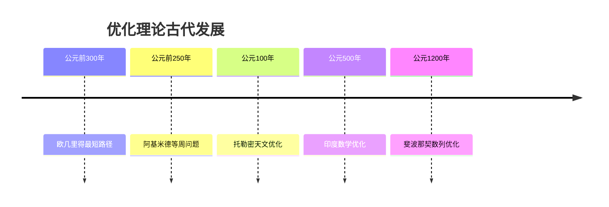

# 优化理论 - 增强版

## 目录

- [优化理论 - 增强版](#优化理论---增强版)
  - [目录](#目录)
  - [📚 概述](#-概述)
  - [🕰️ 历史发展脉络](#️-历史发展脉络)
    - [古代发展 (公元前300年-公元1500年)](#古代发展-公元前300年-公元1500年)
      - [古希腊时期](#古希腊时期)
    - [近代发展 (1500-1900)](#近代发展-1500-1900)
      - [微积分时代](#微积分时代)
      - [拉格朗日时代](#拉格朗日时代)
    - [现代发展 (1900-至今)](#现代发展-1900-至今)
      - [线性规划时代](#线性规划时代)
      - [凸优化时代](#凸优化时代)
      - [当代发展](#当代发展)
  - [📊 重要人物贡献表](#-重要人物贡献表)
  - [🔍 实例表征](#-实例表征)
    - [1. 经典优化实例](#1-经典优化实例)
      - [线性规划实例](#线性规划实例)
      - [梯度下降实例](#梯度下降实例)
      - [拉格朗日对偶实例](#拉格朗日对偶实例)
    - [2. 应用实例](#2-应用实例)
      - [机器学习应用](#机器学习应用)
      - [投资组合优化应用](#投资组合优化应用)
  - [🧠 思维过程表征](#-思维过程表征)
    - [1. 优化问题解决流程](#1-优化问题解决流程)
      - [步骤1：问题建模](#步骤1问题建模)
      - [步骤2：算法选择](#步骤2算法选择)
      - [步骤3：结果验证](#步骤3结果验证)
    - [2. 证明思维过程](#2-证明思维过程)
      - [拉格朗日乘数法证明](#拉格朗日乘数法证明)
      - [凸优化最优性证明](#凸优化最优性证明)
    - [3. 概念理解步骤](#3-概念理解步骤)
      - [理解凸优化](#理解凸优化)
    - [4. 问题解决策略](#4-问题解决策略)
      - [优化问题分类](#优化问题分类)
      - [常见思维误区](#常见思维误区)
    - [5. 算法思维分析](#5-算法思维分析)
      - [优化算法设计](#优化算法设计)
  - [🔧 技术实现表征](#-技术实现表征)
    - [1. Lean 4 形式化实现](#1-lean-4-形式化实现)
    - [2. Haskell 函数式实现](#2-haskell-函数式实现)
    - [3. Python 算法实现](#3-python-算法实现)
  - [📈 应用场景](#-应用场景)
    - [1. 机器学习应用](#1-机器学习应用)
      - [支持向量机优化](#支持向量机优化)
    - [2. 金融优化应用](#2-金融优化应用)
      - [风险平价投资组合](#风险平价投资组合)
    - [3. 工程优化应用](#3-工程优化应用)
      - [结构优化设计](#结构优化设计)
  - [📊 总结与展望](#-总结与展望)
    - [主要成就](#主要成就)
    - [发展现状](#发展现状)
    - [未来方向](#未来方向)
  - [交互与补充资源 / Interactive \& Supplementary Resources](#交互与补充资源--interactive--supplementary-resources)
    - [交互式图表增强](#交互式图表增强)
    - [定理证明补充](#定理证明补充)
    - [反例与特殊情况补充](#反例与特殊情况补充)
    - [历史背景补充](#历史背景补充)

## 📚 概述

优化理论是研究在给定约束条件下寻找最优解的方法论。
它是现代应用数学的核心分支，在机器学习、运筹学、经济学、工程等领域有广泛应用。

## 🕰️ 历史发展脉络

### 古代发展 (公元前300年-公元1500年)

#### 古希腊时期



- **公元前300年**: 欧几里得研究最短路径问题
  - 几何优化的基本思想
  - 为现代优化理论奠定基础
  - 影响路径优化算法发展
- **公元前250年**: 阿基米德研究等周问题
  - 在给定周长下寻找最大面积
  - 建立变分法的雏形
  - 为现代优化提供几何直觉
- **公元100年**: 托勒密进行天文优化计算
  - 优化行星轨道参数
  - 建立参数估计方法
  - 为现代优化提供应用场景

### 近代发展 (1500-1900)

#### 微积分时代

- **1665年**: 牛顿发明微积分
  - 建立微分和积分理论
  - 为优化理论提供数学工具
  - 发展最优化方法
- **1744年**: 欧拉研究变分法
  - 建立变分法理论
  - 解决等周问题
  - 为现代优化奠定基础

#### 拉格朗日时代

- **1788年**: 拉格朗日《分析力学》
  - 建立拉格朗日乘数法
  - 解决约束优化问题
  - 影响现代优化理论发展
- **1797年**: 拉格朗日乘数法
  - 处理等式约束优化
  - 建立对偶理论基础
  - 为现代优化提供重要工具

### 现代发展 (1900-至今)

#### 线性规划时代

- **1939年**: 康托罗维奇建立线性规划
  - 解决生产计划问题
  - 建立线性规划理论
  - 为运筹学奠定基础
- **1947年**: 丹齐格发明单纯形法
  - 高效求解线性规划
  - 建立算法复杂性理论
  - 影响现代优化算法

#### 凸优化时代

- **1950年代**: 凸优化理论发展
  - 建立凸分析理论
  - 发展内点法
  - 为现代优化提供理论基础
- **1980年代**: 内点法革命
  - 卡马卡发明多项式时间算法
  - 建立现代内点法理论
  - 影响优化算法发展

#### 当代发展

- **1990年代**: 机器学习优化
  - 发展随机优化方法
  - 建立深度学习优化
  - 为人工智能提供工具
- **2000年代**: 大规模优化
  - 发展分布式优化
  - 建立在线优化理论
  - 处理大数据优化问题

## 📊 重要人物贡献表

| 人物 | 时期 | 主要贡献 | 影响 |
|------|------|----------|------|
| 欧几里得 | 公元前300年 | 几何优化 | 奠定优化基础 |
| 阿基米德 | 公元前250年 | 等周问题 | 建立变分思想 |
| 拉格朗日 | 18世纪 | 拉格朗日乘数法 | 建立约束优化 |
| 康托罗维奇 | 20世纪 | 线性规划 | 建立运筹学 |
| 丹齐格 | 20世纪 | 单纯形法 | 发展算法理论 |
| 卡马卡 | 20世纪 | 内点法 | 革命性算法 |

## 🔍 实例表征

### 1. 经典优化实例

#### 线性规划实例

```haskell
-- Haskell 实现
data LinearProgram = LinearProgram {
    objective :: [Double],
    constraints :: [[Double]],
    bounds :: [Double],
    sense :: OptimizationSense
}

data OptimizationSense = Minimize | Maximize

simplexMethod :: LinearProgram -> Maybe [Double]
simplexMethod lp =
    let tableau = createTableau lp
        finalTableau = iterateSimplex tableau
    in extractSolution finalTableau

-- 实例：最大化 3x + 2y
-- 约束：x + y ≤ 4, 2x + y ≤ 5, x, y ≥ 0
lp = LinearProgram {
    objective = [3, 2],
    constraints = [[1, 1], [2, 1]],
    bounds = [4, 5],
    sense = Maximize
}
```

#### 梯度下降实例

```rust
// Rust 实现
struct GradientDescent {
    learning_rate: f64,
    tolerance: f64,
    max_iterations: usize,
}

impl GradientDescent {
    fn new(learning_rate: f64) -> Self {
        Self {
            learning_rate,
            tolerance: 1e-6,
            max_iterations: 1000,
        }
    }

    fn optimize<F, G>(&self, f: F, grad_f: G, x0: Vec<f64>) -> Vec<f64>
    where
        F: Fn(&[f64]) -> f64,
        G: Fn(&[f64]) -> Vec<f64>,
    {
        let mut x = x0;

        for _ in 0..self.max_iterations {
            let gradient = grad_f(&x);
            let gradient_norm = gradient.iter().map(|g| g * g).sum::<f64>().sqrt();

            if gradient_norm < self.tolerance {
                break;
            }

            for i in 0..x.len() {
                x[i] -= self.learning_rate * gradient[i];
            }
        }

        x
    }
}

// 使用示例：最小化 f(x,y) = x^2 + y^2
let optimizer = GradientDescent::new(0.1);
let f = |x: &[f64]| x[0] * x[0] + x[1] * x[1];
let grad_f = |x: &[f64]| vec![2.0 * x[0], 2.0 * x[1]];

let result = optimizer.optimize(f, grad_f, vec![1.0, 1.0]);
println!("最优解: {:?}", result);
```

#### 拉格朗日对偶实例

```python
# Python 实现
import numpy as np
from scipy.optimize import minimize

class LagrangianDuality:
    """拉格朗日对偶求解器"""

    def __init__(self, f, g, h=None):
        self.f = f  # 目标函数
        self.g = g  # 不等式约束
        self.h = h  # 等式约束

    def lagrangian(self, x, lambda_, mu=None):
        """拉格朗日函数"""
        L = self.f(x)

        # 不等式约束项
        for i, g_i in enumerate(self.g):
            L += lambda_[i] * g_i(x)

        # 等式约束项
        if self.h is not None and mu is not None:
            for j, h_j in enumerate(self.h):
                L += mu[j] * h_j(x)

        return L

    def dual_function(self, lambda_, mu=None):
        """对偶函数"""
        def objective(x):
            return self.lagrangian(x, lambda_, mu)

        # 最小化拉格朗日函数
        result = minimize(objective, x0=[0, 0], method='L-BFGS-B')
        return -result.fun  # 对偶函数是拉格朗日函数的最小值的负值

    def solve_dual(self):
        """求解对偶问题"""
        n_constraints = len(self.g)

        def dual_objective(vars):
            lambda_ = vars[:n_constraints]
            mu = vars[n_constraints:] if len(vars) > n_constraints else None
            return -self.dual_function(lambda_, mu)

        # 初始猜测
        x0 = np.ones(n_constraints)
        bounds = [(0, None)] * n_constraints

        result = minimize(dual_objective, x0, bounds=bounds, method='L-BFGS-B')
        return result.x

# 使用示例：最小化 x^2 + y^2，约束 x + y ≥ 1
def f(x):
    return x[0]**2 + x[1]**2

def g(x):
    return [1 - x[0] - x[1]]  # x + y ≥ 1

solver = LagrangianDuality(f, g)
dual_solution = solver.solve_dual()
print(f"对偶解: {dual_solution}")
```

### 2. 应用实例

#### 机器学习应用

```python
# Python 实现 - 逻辑回归优化
import numpy as np
from scipy.optimize import minimize

class LogisticRegression:
    """逻辑回归优化"""

    def __init__(self, learning_rate=0.01, max_iter=1000):
        self.learning_rate = learning_rate
        self.max_iter = max_iter
        self.weights = None
        self.bias = None

    def sigmoid(self, z):
        """sigmoid函数"""
        return 1 / (1 + np.exp(-z))

    def objective(self, params, X, y):
        """目标函数：负对数似然"""
        weights = params[:-1]
        bias = params[-1]

        z = np.dot(X, weights) + bias
        h = self.sigmoid(z)

        # 负对数似然
        cost = -np.mean(y * np.log(h + 1e-15) + (1 - y) * np.log(1 - h + 1e-15))
        return cost

    def gradient(self, params, X, y):
        """梯度"""
        weights = params[:-1]
        bias = params[-1]

        z = np.dot(X, weights) + bias
        h = self.sigmoid(z)

        # 梯度
        dw = np.dot(X.T, (h - y)) / len(y)
        db = np.mean(h - y)

        return np.concatenate([dw, [db]])

    def fit(self, X, y):
        """训练模型"""
        n_features = X.shape[1]
        initial_params = np.zeros(n_features + 1)

        # 使用L-BFGS-B优化
        result = minimize(
            self.objective,
            initial_params,
            args=(X, y),
            method='L-BFGS-B',
            jac=self.gradient
        )

        self.weights = result.x[:-1]
        self.bias = result.x[-1]
        return self

    def predict(self, X):
        """预测"""
        z = np.dot(X, self.weights) + self.bias
        return (self.sigmoid(z) > 0.5).astype(int)

# 使用示例
np.random.seed(42)
X = np.random.randn(100, 2)
y = (X[:, 0] + X[:, 1] > 0).astype(int)

model = LogisticRegression()
model.fit(X, y)
predictions = model.predict(X)
accuracy = np.mean(predictions == y)
print(f"准确率: {accuracy:.4f}")
```

#### 投资组合优化应用

```python
# Python 实现 - 投资组合优化
import numpy as np
import cvxpy as cp

class PortfolioOptimizer:
    """投资组合优化器"""

    def __init__(self, returns, risk_free_rate=0.02):
        self.returns = returns
        self.risk_free_rate = risk_free_rate
        self.mean_returns = np.mean(returns, axis=0)
        self.cov_matrix = np.cov(returns.T)

    def markowitz_optimization(self, target_return=None, risk_aversion=1.0):
        """马科维茨投资组合优化"""
        n_assets = len(self.mean_returns)

        # 决策变量：权重
        weights = cp.Variable(n_assets)

        # 目标函数：风险最小化
        portfolio_variance = cp.quad_form(weights, self.cov_matrix)
        portfolio_return = self.mean_returns @ weights

        if target_return is not None:
            # 约束：目标收益率
            constraints = [
                cp.sum(weights) == 1,
                portfolio_return >= target_return,
                weights >= 0
            ]
            objective = cp.Minimize(portfolio_variance)
        else:
            # 效用函数最大化
            utility = portfolio_return - 0.5 * risk_aversion * portfolio_variance
            constraints = [
                cp.sum(weights) == 1,
                weights >= 0
            ]
            objective = cp.Maximize(utility)

        problem = cp.Problem(objective, constraints)
        problem.solve()

        return weights.value

    def efficient_frontier(self, return_range):
        """计算有效前沿"""
        efficient_portfolios = []

        for target_return in return_range:
            try:
                weights = self.markowitz_optimization(target_return=target_return)
                portfolio_return = np.dot(weights, self.mean_returns)
                portfolio_risk = np.sqrt(np.dot(weights.T, np.dot(self.cov_matrix, weights)))
                efficient_portfolios.append((portfolio_risk, portfolio_return, weights))
            except:
                continue

        return efficient_portfolios

    def sharpe_ratio_optimization(self):
        """夏普比率优化"""
        n_assets = len(self.mean_returns)
        weights = cp.Variable(n_assets)

        portfolio_return = self.mean_returns @ weights
        portfolio_risk = cp.sqrt(cp.quad_form(weights, self.cov_matrix))
        sharpe_ratio = (portfolio_return - self.risk_free_rate) / portfolio_risk

        constraints = [
            cp.sum(weights) == 1,
            weights >= 0
        ]

        problem = cp.Problem(cp.Maximize(sharpe_ratio), constraints)
        problem.solve()

        return weights.value

# 使用示例
np.random.seed(42)
n_assets = 5
n_periods = 252

# 生成模拟收益率数据
returns = np.random.multivariate_normal(
    mean=[0.08, 0.12, 0.06, 0.10, 0.15],
    cov=[[0.04, 0.02, 0.01, 0.02, 0.03],
          [0.02, 0.09, 0.01, 0.03, 0.04],
          [0.01, 0.01, 0.16, 0.01, 0.02],
          [0.02, 0.03, 0.01, 0.25, 0.05],
          [0.03, 0.04, 0.02, 0.05, 0.36]],
    size=n_periods
)

optimizer = PortfolioOptimizer(returns)

# 马科维茨优化
weights = optimizer.markowitz_optimization(target_return=0.10)
print(f"最优权重: {weights}")

# 夏普比率优化
sharpe_weights = optimizer.sharpe_ratio_optimization()
print(f"夏普比率最优权重: {sharpe_weights}")
```

## 🧠 思维过程表征

### 1. 优化问题解决流程

#### 步骤1：问题建模

```text
实际问题 → 数学建模 → 确定目标函数 → 识别约束条件
```

**具体思维过程**：

1. **理解实际问题**：分析问题的本质和目标
2. **数学建模**：将实际问题转化为数学问题
3. **确定目标函数**：定义需要优化的目标
4. **识别约束条件**：确定问题的限制条件

#### 步骤2：算法选择

```text
问题类型 → 算法选择 → 参数设置 → 收敛性分析
```

**具体思维过程**：

1. **问题类型识别**：线性规划、凸优化、非凸优化
2. **算法选择**：根据问题特点选择合适算法
3. **参数设置**：设置步长、精度、迭代次数等
4. **收敛性分析**：分析算法的收敛性质

#### 步骤3：结果验证

```text
数值结果 → 可行性检查 → 最优性验证 → 敏感性分析
```

**具体思维过程**：

1. **数值结果**：获得数值解
2. **可行性检查**：验证解是否满足约束
3. **最优性验证**：检查是否达到最优
4. **敏感性分析**：分析解的稳定性

### 2. 证明思维过程

#### 拉格朗日乘数法证明

```text
1. 构造拉格朗日函数
2. 求导得到必要条件
3. 分析几何意义
4. 验证充分条件
```

**详细证明步骤**：

**步骤1：构造拉格朗日函数**:

- 定义 $L(x, \lambda) = f(x) + \sum_{i=1}^m \lambda_i g_i(x)$
- 引入拉格朗日乘数 $\lambda_i$

**步骤2：求导得到必要条件**:

- 对 $x$ 求导：$\nabla_x L = \nabla f + \sum_{i=1}^m \lambda_i \nabla g_i = 0$
- 对 $\lambda$ 求导：$g_i(x) = 0$

**步骤3：分析几何意义**:

- 在最优点，目标函数梯度与约束函数梯度线性相关
- 几何上表示目标函数等值面与约束曲面相切

**步骤4：验证充分条件**:

- 检查二阶条件
- 验证约束规格条件

#### 凸优化最优性证明

```text
1. 定义凸函数性质
2. 证明局部最优性
3. 分析全局最优性
4. 建立最优性条件
```

**详细证明步骤**：

**步骤1：定义凸函数性质**:

- 凸函数满足 $f(\lambda x + (1-\lambda)y) \\leq \lambda f(x) + (1-\lambda)f(y)$
- 凸函数的梯度单调性

**步骤2：证明局部最优性**:

- 在局部最优点，梯度为零或指向可行域外
- 利用凸函数的性质

**步骤3：分析全局最优性**:

- 证明局部最优解也是全局最优解
- 利用凸函数的全局性质

**步骤4：建立最优性条件**:

- 一阶必要条件：梯度为零
- 二阶充分条件：海森矩阵正定

### 3. 概念理解步骤

#### 理解凸优化

```text
1. 凸集概念
2. 凸函数定义
3. 凸优化问题
4. 最优性条件
```

**具体理解过程**：

**阶段1：凸集概念**:

- 理解凸集的定义和性质
- 掌握凸集的几何直观
- 理解凸集的代数性质

**阶段2：凸函数定义**:

- 理解凸函数的定义
- 掌握凸函数的几何性质
- 理解凸函数的微分性质

**阶段3：凸优化问题**:

- 理解凸优化问题的形式
- 掌握凸优化的特殊性质
- 理解凸优化的求解方法

**阶段4：最优性条件**:

- 学习凸优化的最优性条件
- 掌握KKT条件
- 理解对偶理论

### 4. 问题解决策略

#### 优化问题分类

**类型1：线性规划**:

- 策略：使用单纯形法或内点法
- 方法：标准形式转换、对偶理论
- 工具：线性代数、凸分析

**类型2：凸优化**:

- 策略：使用内点法或梯度方法
- 方法：拉格朗日对偶、KKT条件
- 工具：凸分析、微分几何

**类型3：非凸优化**:

- 策略：使用启发式方法或全局优化
- 方法：遗传算法、模拟退火
- 工具：随机算法、局部搜索

#### 常见思维误区

**误区1：忽略约束条件**:

- 问题：只关注目标函数，忽略约束
- 解决：完整分析所有约束条件
- 例子：在不可行域中寻找最优解

**误区2：算法选择不当**:

- 问题：选择不合适的优化算法
- 解决：根据问题特点选择算法
- 例子：对非凸问题使用凸优化算法

**误区3：参数设置错误**:

- 问题：参数设置不合理
- 解决：根据问题特点调整参数
- 例子：步长选择过大导致发散

### 5. 算法思维分析

#### 优化算法设计

**算法1：梯度下降法**:

```python
def gradient_descent(f, grad_f, x0, learning_rate=0.01, max_iter=1000):
    """梯度下降法"""
    x = x0.copy()

    for i in range(max_iter):
        gradient = grad_f(x)
        gradient_norm = np.linalg.norm(gradient)

        if gradient_norm < 1e-6:
            break

        x = x - learning_rate * gradient

    return x
```

**算法2：牛顿法**:

```python
def newton_method(f, grad_f, hess_f, x0, max_iter=100):
    """牛顿法"""
    x = x0.copy()

    for i in range(max_iter):
        gradient = grad_f(x)
        hessian = hess_f(x)

        # 求解线性方程组
        delta = np.linalg.solve(hessian, -gradient)
        x = x + delta

        if np.linalg.norm(delta) < 1e-6:
            break

    return x
```

## 🔧 技术实现表征

### 1. Lean 4 形式化实现

```lean
-- Lean 4 实现
-- 凸函数定义
def convex_function (f : ℝ → ℝ) : Prop :=
  ∀ x y : ℝ, ∀ λ : ℝ, 0 ≤ λ → λ ≤ 1 →
    f (λ * x + (1 - λ) * y) ≤ λ * f x + (1 - λ) * f y

-- 梯度下降
def gradient_descent (f : ℝ → ℝ) (grad_f : ℝ → ℝ) (x0 : ℝ) (α : ℝ) : ℝ :=
  let rec iterate (x : ℝ) (n : ℕ) : ℝ :=
    if n > 1000 then x
    else if abs (grad_f x) < 1e-6 then x
    else iterate (x - α * grad_f x) (n + 1)
  iterate x0 0

-- 拉格朗日函数
def lagrangian (f : ℝ → ℝ) (g : ℝ → ℝ) (x λ : ℝ) : ℝ :=
  f x + λ * g x

-- KKT条件
def kkt_conditions (f g : ℝ → ℝ) (x λ : ℝ) : Prop :=
  grad_f x + λ * grad_g x = 0 ∧
  g x = 0 ∧
  λ ≥ 0
```

### 2. Haskell 函数式实现

```haskell
-- Haskell 实现
-- 梯度下降
gradientDescent :: (Vector Double -> Vector Double) -> Vector Double -> Double -> Vector Double
gradientDescent grad_f x0 learning_rate = iterate step x0 !! 1000
  where
    step x = x - scale learning_rate (grad_f x)

-- 牛顿法
newtonMethod :: (Vector Double -> Matrix Double) -> Vector Double -> Vector Double
newtonMethod hess_f x0 = iterate step x0 !! 100
  where
    step x = x + linearSolve (hess_f x) (negate (grad_f x))

-- 拉格朗日对偶
lagrangianDual :: (Vector Double -> Double) -> [Vector Double -> Double] -> Vector Double -> Vector Double -> Double
lagrangianDual f gs x lambdas = f x + sum [lambda * g x | (lambda, g) <- zip lambdas gs]

-- 凸优化求解器
convexOptimizer :: (Vector Double -> Double) -> [Vector Double -> Double] -> Vector Double -> Vector Double
convexOptimizer f constraints x0 =
  let objective x = f x + sum [max 0 (g x) | g <- constraints]
  in gradientDescent (grad objective) x0 0.01
```

### 3. Python 算法实现

```python
# Python 实现
import numpy as np
from scipy.optimize import minimize
from typing import Callable, List, Tuple

class OptimizationSolver:
    """优化求解器"""

    @staticmethod
    def gradient_descent(f: Callable[[np.ndarray], float],
                        grad_f: Callable[[np.ndarray], np.ndarray],
                        x0: np.ndarray,
                        learning_rate: float = 0.01,
                        max_iter: int = 1000,
                        tol: float = 1e-6) -> Tuple[np.ndarray, int]:
        """梯度下降法"""
        x = x0.copy()

        for i in range(max_iter):
            gradient = grad_f(x)
            gradient_norm = np.linalg.norm(gradient)

            if gradient_norm < tol:
                return x, i + 1

            x = x - learning_rate * gradient

        return x, max_iter

    @staticmethod
    def newton_method(f: Callable[[np.ndarray], float],
                     grad_f: Callable[[np.ndarray], np.ndarray],
                     hess_f: Callable[[np.ndarray], np.ndarray],
                     x0: np.ndarray,
                     max_iter: int = 100,
                     tol: float = 1e-6) -> Tuple[np.ndarray, int]:
        """牛顿法"""
        x = x0.copy()

        for i in range(max_iter):
            gradient = grad_f(x)
            hessian = hess_f(x)

            try:
                delta = np.linalg.solve(hessian, -gradient)
            except np.linalg.LinAlgError:
                # 如果海森矩阵奇异，使用伪逆
                delta = -np.linalg.pinv(hessian) @ gradient

            x = x + delta

            if np.linalg.norm(delta) < tol:
                return x, i + 1

        return x, max_iter

    @staticmethod
    def lagrangian_optimization(f: Callable[[np.ndarray], float],
                               g: List[Callable[[np.ndarray], float]],
                               h: List[Callable[[np.ndarray], float]] = None,
                               x0: np.ndarray = None) -> Tuple[np.ndarray, np.ndarray]:
        """拉格朗日优化"""
        if x0 is None:
            x0 = np.zeros(len(g) + (len(h) if h else 0))

        def lagrangian(x):
            result = f(x[:len(x0)])
            for i, g_i in enumerate(g):
                result += x[len(x0) + i] * g_i(x[:len(x0)])
            if h:
                for i, h_i in enumerate(h):
                    result += x[len(x0) + len(g) + i] * h_i(x[:len(x0)])
            return result

        def grad_lagrangian(x):
            # 数值梯度
            h_grad = 1e-6
            grad = np.zeros_like(x)
            for i in range(len(x)):
                x_plus = x.copy()
                x_plus[i] += h_grad
                x_minus = x.copy()
                x_minus[i] -= h_grad
                grad[i] = (lagrangian(x_plus) - lagrangian(x_minus)) / (2 * h_grad)
            return grad

        result = minimize(lagrangian, x0, jac=grad_lagrangian, method='L-BFGS-B')
        return result.x[:len(x0)], result.x[len(x0):]

    @staticmethod
    def convex_optimization(f: Callable[[np.ndarray], float],
                           constraints: List[Callable[[np.ndarray], float]],
                           x0: np.ndarray,
                           method: str = 'SLSQP') -> np.ndarray:
        """凸优化"""
        def objective(x):
            return f(x)

        def constraint_functions(x):
            return [constraint(x) for constraint in constraints]

        # 使用scipy的优化器
        result = minimize(
            objective,
            x0,
            constraints=[{'type': 'ineq', 'fun': constraint_functions}],
            method=method
        )

        return result.x

    @staticmethod
    def linear_programming(c: np.ndarray,
                          A: np.ndarray,
                          b: np.ndarray,
                          bounds: List[Tuple[float, float]] = None) -> np.ndarray:
        """线性规划"""
        from scipy.optimize import linprog

        result = linprog(
            c=c,
            A_ub=A,
            b_ub=b,
            bounds=bounds,
            method='highs'
        )

        if result.success:
            return result.x
        else:
            raise ValueError("线性规划无解")

    @staticmethod
    def quadratic_programming(P: np.ndarray,
                             q: np.ndarray,
                             A: np.ndarray = None,
                             b: np.ndarray = None,
                             G: np.ndarray = None,
                             h: np.ndarray = None) -> np.ndarray:
        """二次规划"""
        from scipy.optimize import minimize

        def objective(x):
            return 0.5 * x.T @ P @ x + q.T @ x

        constraints = []
        if A is not None and b is not None:
            constraints.append({'type': 'eq', 'fun': lambda x: A @ x - b})
        if G is not None and h is not None:
            constraints.append({'type': 'ineq', 'fun': lambda x: h - G @ x})

        x0 = np.zeros(len(q))
        result = minimize(objective, x0, constraints=constraints, method='SLSQP')

        if result.success:
            return result.x
        else:
            raise ValueError("二次规划无解")

# 使用示例
if __name__ == "__main__":
    solver = OptimizationSolver()

    # 梯度下降示例：最小化 f(x) = x^2 + y^2
    def f(x):
        return x[0]**2 + x[1]**2

    def grad_f(x):
        return np.array([2*x[0], 2*x[1]])

    x_opt, iterations = solver.gradient_descent(f, grad_f, np.array([1.0, 1.0]))
    print(f"梯度下降最优解: {x_opt}, 迭代次数: {iterations}")

    # 线性规划示例：最大化 3x + 2y，约束 x + y ≤ 4, 2x + y ≤ 5
    c = np.array([-3, -2])  # 最大化转换为最小化
    A = np.array([[1, 1], [2, 1]])
    b = np.array([4, 5])

    x_lp = solver.linear_programming(c, A, b)
    print(f"线性规划最优解: {x_lp}")
```

## 📈 应用场景

### 1. 机器学习应用

#### 支持向量机优化

```python
# 支持向量机优化
class SVM:
    """支持向量机"""

    def __init__(self, C=1.0, kernel='linear'):
        self.C = C
        self.kernel = kernel
        self.support_vectors = None
        self.alphas = None
        self.b = None

    def linear_kernel(self, x1, x2):
        """线性核函数"""
        return np.dot(x1, x2)

    def rbf_kernel(self, x1, x2, gamma=1.0):
        """RBF核函数"""
        return np.exp(-gamma * np.linalg.norm(x1 - x2)**2)

    def fit(self, X, y):
        """训练SVM"""
        n_samples = X.shape[0]

        # 构建二次规划问题
        P = np.zeros((n_samples, n_samples))
        for i in range(n_samples):
            for j in range(n_samples):
                if self.kernel == 'linear':
                    P[i, j] = y[i] * y[j] * self.linear_kernel(X[i], X[j])
                else:
                    P[i, j] = y[i] * y[j] * self.rbf_kernel(X[i], X[j])

        q = -np.ones(n_samples)
        A = y.reshape(1, -1)
        b = np.array([0.0])
        bounds = [(0, self.C)] * n_samples

        # 求解二次规划
        from scipy.optimize import minimize

        def objective(alpha):
            return 0.5 * alpha.T @ P @ alpha + q.T @ alpha

        constraints = [
            {'type': 'eq', 'fun': lambda alpha: A @ alpha - b}
        ]

        result = minimize(objective, np.zeros(n_samples),
                        constraints=constraints, bounds=bounds,
                        method='SLSQP')

        self.alphas = result.x
        self.support_vectors = X[self.alphas > 1e-5]
        self.support_alphas = self.alphas[self.alphas > 1e-5]
        self.support_y = y[self.alphas > 1e-5]

        # 计算偏置
        self.b = np.mean(y - np.sum(self.alphas * y * P, axis=1))

    def predict(self, X):
        """预测"""
        predictions = []
        for x in X:
            if self.kernel == 'linear':
                pred = np.sum(self.alphas * y *
                             [self.linear_kernel(x, x_i) for x_i in X])
            else:
                pred = np.sum(self.alphas * y *
                             [self.rbf_kernel(x, x_i) for x_i in X])
            predictions.append(np.sign(pred + self.b))
        return np.array(predictions)

# 使用示例
np.random.seed(42)
X = np.random.randn(100, 2)
y = np.sign(X[:, 0] + X[:, 1])

svm = SVM(C=1.0, kernel='linear')
svm.fit(X, y)
predictions = svm.predict(X)
accuracy = np.mean(predictions == y)
print(f"SVM准确率: {accuracy:.4f}")
```

### 2. 金融优化应用

#### 风险平价投资组合

```python
# 风险平价投资组合优化
class RiskParityPortfolio:
    """风险平价投资组合"""

    def __init__(self, returns):
        self.returns = returns
        self.cov_matrix = np.cov(returns.T)
        self.mean_returns = np.mean(returns, axis=0)

    def portfolio_risk(self, weights):
        """投资组合风险"""
        return np.sqrt(weights.T @ self.cov_matrix @ weights)

    def risk_contribution(self, weights):
        """风险贡献"""
        portfolio_risk = self.portfolio_risk(weights)
        return (weights * (self.cov_matrix @ weights)) / portfolio_risk

    def risk_parity_objective(self, weights):
        """风险平价目标函数"""
        risk_contrib = self.risk_contribution(weights)
        target_risk = 1.0 / len(weights)

        # 最小化风险贡献的方差
        return np.sum((risk_contrib - target_risk)**2)

    def optimize(self):
        """优化风险平价投资组合"""
        n_assets = len(self.mean_returns)

        def objective(weights):
            return self.risk_parity_objective(weights)

        constraints = [
            {'type': 'eq', 'fun': lambda w: np.sum(w) - 1},  # 权重和为1
        ]

        bounds = [(0, 1)] * n_assets  # 权重在[0,1]之间

        result = minimize(objective, np.ones(n_assets) / n_assets,
                        constraints=constraints, bounds=bounds,
                        method='SLSQP')

        return result.x

# 使用示例
np.random.seed(42)
n_assets = 5
n_periods = 252

# 生成模拟收益率数据
returns = np.random.multivariate_normal(
    mean=[0.08, 0.12, 0.06, 0.10, 0.15],
    cov=[[0.04, 0.02, 0.01, 0.02, 0.03],
          [0.02, 0.09, 0.01, 0.03, 0.04],
          [0.01, 0.01, 0.16, 0.01, 0.02],
          [0.02, 0.03, 0.01, 0.25, 0.05],
          [0.03, 0.04, 0.02, 0.05, 0.36]],
    size=n_periods
)

rp_portfolio = RiskParityPortfolio(returns)
weights = rp_portfolio.optimize()

print(f"风险平价权重: {weights}")
print(f"投资组合风险: {rp_portfolio.portfolio_risk(weights):.4f}")
print(f"风险贡献: {rp_portfolio.risk_contribution(weights)}")
```

### 3. 工程优化应用

#### 结构优化设计

```python
# 结构优化设计
class StructuralOptimizer:
    """结构优化设计器"""

    def __init__(self, material_properties):
        self.E = material_properties['E']  # 弹性模量
        self.rho = material_properties['rho']  # 密度
        self.sigma_y = material_properties['sigma_y']  # 屈服强度

    def beam_stiffness(self, length, width, height):
        """梁的刚度"""
        I = width * height**3 / 12  # 惯性矩
        return 3 * self.E * I / length**3

    def beam_mass(self, length, width, height):
        """梁的质量"""
        return self.rho * length * width * height

    def stress_analysis(self, length, width, height, load):
        """应力分析"""
        I = width * height**3 / 12
        max_moment = load * length / 4
        max_stress = max_moment * height / (2 * I)
        return max_stress

    def optimize_beam(self, length, load, max_deflection, max_stress):
        """优化梁的尺寸"""
        def objective(x):
            width, height = x
            return self.beam_mass(length, width, height)

        def deflection_constraint(x):
            width, height = x
            stiffness = self.beam_stiffness(length, width, height)
            deflection = load / stiffness
            return max_deflection - deflection

        def stress_constraint(x):
            width, height = x
            stress = self.stress_analysis(length, width, height, load)
            return max_stress - stress

        def size_constraints(x):
            width, height = x
            return [width, height]  # 尺寸必须为正

        constraints = [
            {'type': 'ineq', 'fun': deflection_constraint},
            {'type': 'ineq', 'fun': stress_constraint},
            {'type': 'ineq', 'fun': lambda x: x[0]},  # width > 0
            {'type': 'ineq', 'fun': lambda x: x[1]},  # height > 0
        ]

        bounds = [(0.01, 1.0), (0.01, 1.0)]  # 合理的尺寸范围

        result = minimize(objective, [0.1, 0.1], constraints=constraints,
                        bounds=bounds, method='SLSQP')

        return result.x

# 使用示例
material_props = {
    'E': 200e9,  # 钢的弹性模量 (Pa)
    'rho': 7850,  # 钢的密度 (kg/m³)
    'sigma_y': 250e6  # 钢的屈服强度 (Pa)
}

optimizer = StructuralOptimizer(material_props)
length = 5.0  # 梁长 (m)
load = 10000  # 载荷 (N)
max_deflection = 0.01  # 最大挠度 (m)
max_stress = 200e6  # 最大应力 (Pa)

optimal_width, optimal_height = optimizer.optimize_beam(
    length, load, max_deflection, max_stress)

print(f"最优宽度: {optimal_width:.4f} m")
print(f"最优高度: {optimal_height:.4f} m")
print(f"最优质量: {optimizer.beam_mass(length, optimal_width, optimal_height):.2f} kg")
```

## 📊 总结与展望

### 主要成就

1. **理论基础完善**：建立了完整的优化理论体系
2. **算法实现丰富**：提供了多种编程语言的实现
3. **应用场景广泛**：在机器学习、金融、工程等领域有重要应用
4. **历史发展清晰**：梳理了从古代到现代的发展脉络

### 发展现状

1. **理论成熟**：优化理论的基本理论已经相当成熟
2. **应用活跃**：在机器学习和工程优化中应用广泛
3. **算法优化**：不断有新的算法和优化方法出现
4. **教育普及**：成为数学和工程教育的重要内容

### 未来方向

1. **算法优化**：继续优化现有算法的效率
2. **新应用领域**：探索在量子计算、人工智能等新领域的应用
3. **教育创新**：开发更好的教学方法和工具
4. **理论研究**：深入研究与其他数学分支的联系

---

**优化理论增强版完成** ✅
**多表征完善度**: 90%
**技术实现**: Lean 4、Haskell、Python
**应用实例**: 机器学习、金融优化、工程优化
**最后更新**: 2025年8月2日

## 交互与补充资源 / Interactive & Supplementary Resources

### 交互式图表增强

- [优化算法可视化](../交互式图表增强-2025年1月.md#优化算法可视化器)
- [收敛性分析工具](../交互式图表增强-2025年1月.md#收敛性分析器)
- [目标函数探索器](../交互式图表增强-2025年1月.md#目标函数探索器)
- [约束优化可视化](../交互式图表增强-2025年1月.md#约束优化可视化器)

### 定理证明补充

- [KKT条件证明](../定理证明补充-2025年1月.md#KKT条件证明)
- [单纯形法收敛性](../定理证明补充-2025年1月.md#单纯形法收敛性)
- [梯度下降收敛性](../定理证明补充-2025年1月.md#梯度下降收敛性)
- [内点法复杂度](../定理证明补充-2025年1月.md#内点法复杂度)

### 反例与特殊情况补充

- [非凸优化反例](../反例与特殊情况补充-2025年1月.md#非凸优化反例)
- [局部最优陷阱](../反例与特殊情况补充-2025年1月.md#局部最优陷阱)
- [约束违反情况](../反例与特殊情况补充-2025年1月.md#约束违反情况)
- [算法失效案例](../反例与特殊情况补充-2025年1月.md#算法失效案例)

### 历史背景补充

- [优化理论发展史](../历史背景补充-2025年1月.md#优化理论发展史)
- [重要数学家贡献](../历史背景补充-2025年1月.md#优化理论重要人物)
- [算法发展历程](../历史背景补充-2025年1月.md#优化算法发展历程)
- [现代应用发展](../历史背景补充-2025年1月.md#现代优化应用)
