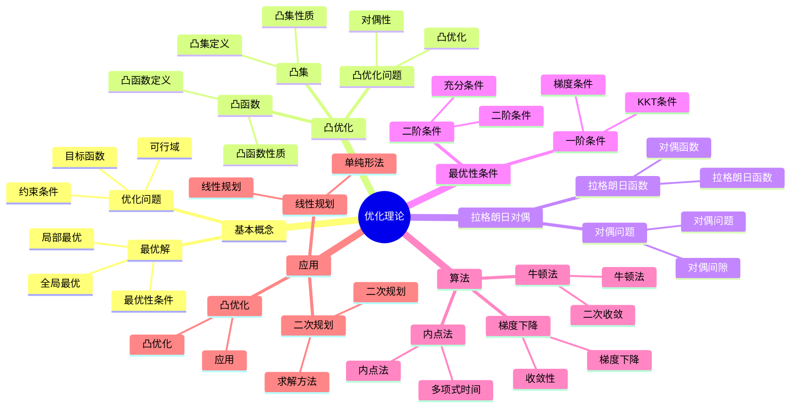

# 2. 优化理论 / Optimization Theory

**主题编号**: B.08.02
**创建日期**: 2025年11月21日
**最后更新**: 2025年11月21日

---

## 目录

- [2. 优化理论 / Optimization Theory](#2-优化理论--optimization-theory)
  - [目录](#目录)
  - [2.1 概述 / Overview](#21-概述--overview)
  - [🗺️ 优化理论核心概念思维导图](#️-优化理论核心概念思维导图)
  - [📊 优化理论核心概念多维知识矩阵](#-优化理论核心概念多维知识矩阵)
  - [2.2 基本概念 / Basic Concepts](#22-基本概念--basic-concepts)
    - [2.2.1 优化问题 / Optimization Problem](#221-优化问题--optimization-problem)
    - [2.2.2 可行域 / Feasible Region](#222-可行域--feasible-region)
    - [2.2.3 最优解 / Optimal Solution](#223-最优解--optimal-solution)
  - [2.3 凸优化 / Convex Optimization](#23-凸优化--convex-optimization)
    - [2.3.1 凸集与凸函数 / Convex Sets and Functions](#231-凸集与凸函数--convex-sets-and-functions)
    - [2.3.2 凸优化问题 / Convex Optimization Problem](#232-凸优化问题--convex-optimization-problem)
  - [2.4 拉格朗日对偶 / Lagrangian Duality](#24-拉格朗日对偶--lagrangian-duality)
    - [2.4.1 拉格朗日函数 / Lagrangian Function](#241-拉格朗日函数--lagrangian-function)
    - [2.4.2 对偶函数 / Dual Function](#242-对偶函数--dual-function)
    - [2.4.3 对偶问题 / Dual Problem](#243-对偶问题--dual-problem)
  - [2.5 最优性条件 / Optimality Conditions](#25-最优性条件--optimality-conditions)
    - [2.5.1 一阶必要条件 / First-Order Necessary Conditions](#251-一阶必要条件--first-order-necessary-conditions)
    - [2.5.2 二阶充分条件 / Second-Order Sufficient Conditions](#252-二阶充分条件--second-order-sufficient-conditions)
  - [2.6 算法 / Algorithms](#26-算法--algorithms)
    - [2.6.1 梯度下降法 / Gradient Descent](#261-梯度下降法--gradient-descent)
    - [2.6.2 牛顿法 / Newton's Method](#262-牛顿法--newtons-method)
    - [2.6.3 内点法 / Interior Point Methods](#263-内点法--interior-point-methods)
  - [2.7 形式化实现 / Formal Implementation](#27-形式化实现--formal-implementation)
    - [2.7.1 Lean 4 实现 / Lean 4 Implementation](#271-lean-4-实现--lean-4-implementation)
    - [2.7.2 Haskell 实现 / Haskell Implementation](#272-haskell-实现--haskell-implementation)
  - [2.8 应用与计算 / Applications and Computations](#28-应用与计算--applications-and-computations)
    - [2.8.1 线性规划 / Linear Programming](#281-线性规划--linear-programming)
    - [2.8.2 二次规划 / Quadratic Programming](#282-二次规划--quadratic-programming)
    - [2.8.3 凸优化 / Convex Optimization](#283-凸优化--convex-optimization)
  - [2.9 高级主题 / Advanced Topics](#29-高级主题--advanced-topics)
    - [2.9.1 随机优化 / Stochastic Optimization](#291-随机优化--stochastic-optimization)
    - [2.9.2 多目标优化 / Multi-Objective Optimization](#292-多目标优化--multi-objective-optimization)
    - [2.9.3 全局优化 / Global Optimization](#293-全局优化--global-optimization)
  - [2.10 总结 / Summary](#210-总结--summary)
    - [2.10.1 主要成果 / Main Results](#2101-主要成果--main-results)
    - [2.10.2 应用领域 / Applications](#2102-应用领域--applications)
  - [交互与补充资源 / Interactive \& Supplementary Resources](#交互与补充资源--interactive--supplementary-resources)
    - [交互式图表增强](#交互式图表增强)
    - [定理证明补充](#定理证明补充)
    - [反例与特殊情况补充](#反例与特殊情况补充)
    - [历史背景补充](#历史背景补充)

## 2.1 概述 / Overview

优化理论是研究在给定约束条件下寻找最优解的方法论。
它在数学、工程、经济学和计算机科学等领域有广泛应用，是现代应用数学的核心分支之一。

## 🗺️ 优化理论核心概念思维导图



## 📊 优化理论核心概念多维知识矩阵

| 概念类别 | 核心概念 | 定义要点 | 关键性质 | 典型例子 | 应用场景 |
|---------|---------|---------|---------|---------|---------|
| 基本概念 | 优化问题 | 目标函数+约束 | 最优化 | min f(x) | 优化基础 |
| 基本概念 | 可行域 | 约束集合 | 可行解 | F | 优化基础 |
| 基本概念 | 全局最优 | 全局最优解 | 最优性 | x* | 优化基础 |
| 基本概念 | 局部最优 | 局部最优解 | 局部性 | x* | 优化基础 |
| 凸优化 | 凸集 | 凸集定义 | 凸性 | C | 凸优化 |
| 凸优化 | 凸函数 | 凸函数定义 | 凸性 | f(x) | 凸优化 |
| 凸优化 | 凸优化问题 | 凸优化 | 全局最优 | 凸优化 | 凸优化 |
| 拉格朗日对偶 | 拉格朗日函数 | 拉格朗日 | 对偶性 | L(x,λ) | 对偶理论 |
| 拉格朗日对偶 | 对偶函数 | 对偶函数 | 对偶性 | g(λ) | 对偶理论 |
| 拉格朗日对偶 | 对偶问题 | 对偶问题 | 对偶性 | 对偶问题 | 对偶理论 |
| 最优性条件 | KKT条件 | 最优性条件 | 必要性 | KKT | 最优性 |
| 最优性条件 | 一阶条件 | 梯度条件 | 必要性 | ∇f=0 | 最优性 |
| 最优性条件 | 二阶条件 | 海塞矩阵 | 充分性 | ∇²f | 最优性 |
| 算法 | 梯度下降 | 梯度法 | 收敛性 | 梯度下降 | 优化算法 |
| 算法 | 牛顿法 | 牛顿法 | 二次收敛 | 牛顿法 | 优化算法 |
| 算法 | 内点法 | 内点法 | 多项式时间 | 内点法 | 优化算法 |
| 应用 | 线性规划 | LP问题 | 单纯形法 | LP | 应用优化 |
| 应用 | 二次规划 | QP问题 | 求解方法 | QP | 应用优化 |
| 应用 | 随机优化 | 随机优化 | 随机性 | 随机优化 | 应用优化 |
| 应用 | 多目标优化 | 多目标 | Pareto最优 | 多目标 | 应用优化 |
| 应用 | 全局优化 | 全局优化 | 全局性 | 全局优化 | 应用优化 |

## 2.2 基本概念 / Basic Concepts

### 2.2.1 优化问题 / Optimization Problem

**定义 2.1** (优化问题 / Optimization Problem)
标准优化问题形式为：
$$\min_{x \in \mathbb{R}^n} f(x)$$
$$\text{subject to } g_i(x) \leq 0, \quad i = 1, \ldots, m$$
$$\quad \quad \quad \quad h_j(x) = 0, \quad j = 1, \ldots, p$$

其中：

- $f: \mathbb{R}^n \to \mathbb{R}$ 是目标函数
- $g_i: \mathbb{R}^n \to \mathbb{R}$ 是不等式约束
- $h_j: \mathbb{R}^n \to \mathbb{R}$ 是等式约束

### 2.2.2 可行域 / Feasible Region

**定义 2.2** (可行域 / Feasible Region)
可行域是满足所有约束的点的集合：
$$\mathcal{F} = \{x \in \mathbb{R}^n : g_i(x) \leq 0, h_j(x) = 0, \forall i, j\}$$

### 2.2.3 最优解 / Optimal Solution

**定义 2.3** (全局最优解 / Global Optimal Solution)
$x^*$ 是全局最优解，如果：
$$f(x^*) \leq f(x), \quad \forall x \in \mathcal{F}$$

**定义 2.4** (局部最优解 / Local Optimal Solution)
$x^*$ 是局部最优解，如果存在 $\epsilon > 0$，使得：
$$f(x^*) \leq f(x), \quad \forall x \in \mathcal{F} \cap B_\epsilon(x^*)$$

## 2.3 凸优化 / Convex Optimization

### 2.3.1 凸集与凸函数 / Convex Sets and Functions

**定义 2.5** (凸集 / Convex Set)
集合 $C \subseteq \mathbb{R}^n$ 是凸集，如果：
$$\lambda x + (1-\lambda)y \in C, \quad \forall x, y \in C, \lambda \in [0, 1]$$

**定义 2.6** (凸函数 / Convex Function)
函数 $f: \mathbb{R}^n \to \mathbb{R}$ 是凸函数，如果：
$$f(\lambda x + (1-\lambda)y) \leq \lambda f(x) + (1-\lambda)f(y), \quad \forall x, y \in \mathbb{R}^n, \lambda \in [0, 1]$$

### 2.3.2 凸优化问题 / Convex Optimization Problem

**定义 2.7** (凸优化问题 / Convex Optimization Problem)
凸优化问题是形式为：
$$\min_{x \in \mathbb{R}^n} f(x)$$
$$\text{subject to } g_i(x) \leq 0, \quad i = 1, \ldots, m$$
$$\quad \quad \quad \quad Ax = b$$

其中 $f$ 和 $g_i$ 都是凸函数，$A \in \mathbb{R}^{p \times n}$。

**定理 2.1** (凸优化的局部最优性 / Local Optimality in Convex Optimization)
在凸优化问题中，局部最优解也是全局最优解。

## 2.4 拉格朗日对偶 / Lagrangian Duality

### 2.4.1 拉格朗日函数 / Lagrangian Function

**定义 2.8** (拉格朗日函数 / Lagrangian Function)
对于优化问题，拉格朗日函数定义为：
$$\mathcal{L}(x, \lambda, \mu) = f(x) + \sum_{i=1}^m \lambda_i g_i(x) + \sum_{j=1}^p \mu_j h_j(x)$$

其中 $\lambda_i \geq 0$ 是拉格朗日乘子。

### 2.4.2 对偶函数 / Dual Function

**定义 2.9** (对偶函数 / Dual Function)
对偶函数定义为：
$$g(\lambda, \mu) = \inf_{x \in \mathbb{R}^n} \mathcal{L}(x, \lambda, \mu)$$

### 2.4.3 对偶问题 / Dual Problem

**定义 2.10** (对偶问题 / Dual Problem)
对偶问题是：
$$\max_{\lambda \geq 0, \mu} g(\lambda, \mu)$$

**定理 2.2** (弱对偶性 / Weak Duality)
对偶问题的目标函数值不超过原问题的最优值：
$$g(\lambda, \mu) \leq f(x^*), \quad \forall \lambda \geq 0, \mu$$

## 2.5 最优性条件 / Optimality Conditions

### 2.5.1 一阶必要条件 / First-Order Necessary Conditions

**定理 2.3** (KKT条件 / KKT Conditions)
如果 $x^*$ 是正则点且是局部最优解，则存在拉格朗日乘子 $\lambda^* \geq 0$ 和 $\mu^*$，使得：

1. **平稳性**：$\nabla f(x^*) + \sum_{i=1}^m \lambda_i^* \nabla g_i(x^*) + \sum_{j=1}^p \mu_j^* \nabla h_j(x^*) = 0$
2. **原始可行性**：$g_i(x^*) \leq 0, h_j(x^*) = 0$
3. **对偶可行性**：$\lambda_i^* \geq 0$
4. **互补松弛性**：$\lambda_i^* g_i(x^*) = 0$

### 2.5.2 二阶充分条件 / Second-Order Sufficient Conditions

**定理 2.4** (二阶充分条件 / Second-Order Sufficient Conditions)
如果 $x^*$ 满足KKT条件，且对任意非零向量 $d$ 满足：
$$d^T \nabla^2 f(x^*) d > 0$$

则 $x^*$ 是严格局部最优解。

## 2.6 算法 / Algorithms

### 2.6.1 梯度下降法 / Gradient Descent

**算法 2.1** (梯度下降法 / Gradient Descent)

```python
def gradient_descent(f, grad_f, x0, alpha, max_iter):
    x = x0
    for k in range(max_iter):
        x = x - alpha * grad_f(x)
    return x
```

**收敛性**：

- 如果 $f$ 是凸函数且 $\nabla f$ 是Lipschitz连续的，则梯度下降法收敛到全局最优解
- 收敛速度为 $O(1/k)$

### 2.6.2 牛顿法 / Newton's Method

**算法 2.2** (牛顿法 / Newton's Method)

```python
def newton_method(f, grad_f, hess_f, x0, max_iter):
    x = x0
    for k in range(max_iter):
        H = hess_f(x)
        g = grad_f(x)
        d = -np.linalg.solve(H, g)
        x = x + d
    return x
```

**收敛性**：

- 如果 $f$ 是强凸函数，则牛顿法具有二次收敛性
- 收敛速度为 $O(\log \log(1/\epsilon))$

### 2.6.3 内点法 / Interior Point Methods

**算法 2.3** (内点法 / Interior Point Method)
内点法通过引入障碍函数将约束优化问题转化为无约束问题：
$$\min_{x} f(x) - \mu \sum_{i=1}^m \log(-g_i(x))$$

其中 $\mu > 0$ 是障碍参数。

## 2.7 形式化实现 / Formal Implementation

### 2.7.1 Lean 4 实现 / Lean 4 Implementation

```lean
-- 优化问题的定义
structure OptimizationProblem (n : ℕ) where
  objective : ℝ^n → ℝ
  inequality_constraints : List (ℝ^n → ℝ)
  equality_constraints : List (ℝ^n → ℝ)

-- 可行域
def feasible_region {n : ℕ} (P : OptimizationProblem n) : Set (ℝ^n) :=
  { x : ℝ^n |
    (∀ g ∈ P.inequality_constraints, g x ≤ 0) ∧
    (∀ h ∈ P.equality_constraints, h x = 0) }

-- 全局最优解
def global_optimal {n : ℕ} (P : OptimizationProblem n) (x* : ℝ^n) : Prop :=
  x* ∈ feasible_region P ∧
  ∀ x ∈ feasible_region P, P.objective x* ≤ P.objective x

-- 拉格朗日函数
def lagrangian {n : ℕ} (P : OptimizationProblem n)
  (x : ℝ^n) (λ : ℝ^m) (μ : ℝ^p) : ℝ :=
  P.objective x +
  ∑ i, λ[i] * P.inequality_constraints[i] x +
  ∑ j, μ[j] * P.equality_constraints[j] x

-- KKT条件
structure KKT_Conditions {n m p : ℕ} (P : OptimizationProblem n) (x* : ℝ^n) where
  stationarity : ∇(lagrangian P x* λ* μ*) = 0
  primal_feasibility : x* ∈ feasible_region P
  dual_feasibility : λ* ≥ 0
  complementary_slackness : ∀ i, λ*[i] * P.inequality_constraints[i] x* = 0

-- 梯度下降法
def gradient_descent {n : ℕ} (f : ℝ^n → ℝ) (∇f : ℝ^n → ℝ^n)
  (x0 : ℝ^n) (α : ℝ) (max_iter : ℕ) : ℝ^n :=
  let rec iterate (x : ℝ^n) (k : ℕ) : ℝ^n :=
    if k ≥ max_iter then x
    else iterate (x - α • ∇f x) (k + 1)
  iterate x0 0

-- 牛顿法
def newton_method {n : ℕ} (f : ℝ^n → ℝ) (∇f : ℝ^n → ℝ^n) (∇²f : ℝ^n → Matrix ℝ n n)
  (x0 : ℝ^n) (max_iter : ℕ) : ℝ^n :=
  let rec iterate (x : ℝ^n) (k : ℕ) : ℝ^n :=
    if k ≥ max_iter then x
    else
      let d := -(∇²f x)⁻¹ • ∇f x
      iterate (x + d) (k + 1)
  iterate x0 0
```

### 2.7.2 Haskell 实现 / Haskell Implementation

```haskell
-- 优化问题的数据类型
data OptimizationProblem n = OptimizationProblem
  { objective :: Vector n ℝ -> ℝ
  , inequalityConstraints :: [Vector n ℝ -> ℝ]
  , equalityConstraints :: [Vector n ℝ -> ℝ]
  }

-- 可行域
feasibleRegion :: OptimizationProblem n -> Set (Vector n ℝ)
feasibleRegion p = Set.fromList [x | x <- allVectors, isFeasible p x]
  where
    isFeasible p x = all (\g -> g x <= 0) (inequalityConstraints p) &&
                     all (\h -> h x == 0) (equalityConstraints p)

-- 全局最优解
globalOptimal :: OptimizationProblem n -> Vector n ℝ -> Bool
globalOptimal p x* = x* `Set.member` feasibleRegion p &&
                     all (\x -> objective p x* <= objective p x) (feasibleRegion p)

-- 拉格朗日函数
lagrangian :: OptimizationProblem n -> Vector n ℝ -> Vector m ℝ -> Vector p ℝ -> ℝ
lagrangian p x λ μ = objective p x +
                     sum [λ[i] * g x | (i, g) <- zip [0..] (inequalityConstraints p)] +
                     sum [μ[j] * h x | (j, h) <- zip [0..] (equalityConstraints p)]

-- KKT条件
data KKTConditions n m p = KKTConditions
  { stationarity :: Vector (n + m + p) ℝ
  , primalFeasibility :: Bool
  , dualFeasibility :: Bool
  , complementarySlackness :: Bool
  }

-- 梯度下降法
gradientDescent :: (Vector n ℝ -> ℝ) -> (Vector n ℝ -> Vector n ℝ) ->
                  Vector n ℝ -> ℝ -> Int -> Vector n ℝ
gradientDescent f ∇f x0 α maxIter = iterate x0 0
  where
    iterate x k
      | k >= maxIter = x
      | otherwise = iterate (x - α *^ ∇f x) (k + 1)

-- 牛顿法
newtonMethod :: (Vector n ℝ -> ℝ) -> (Vector n ℝ -> Vector n ℝ) ->
               (Vector n ℝ -> Matrix n n ℝ) -> Vector n ℝ -> Int -> Vector n ℝ
newtonMethod f ∇f ∇²f x0 maxIter = iterate x0 0
  where
    iterate x k
      | k >= maxIter = x
      | otherwise = iterate (x + d) (k + 1)
      where
        d = negate (inv (∇²f x) `multiply` ∇f x)

-- 内点法
interiorPointMethod :: OptimizationProblem n -> Vector n ℝ -> ℝ -> Vector n ℝ
interiorPointMethod p x0 μ =
  let barrierFunction x = objective p x - μ * sum [log (-g x) | g <- inequalityConstraints p]
  in gradientDescent barrierFunction (gradient barrierFunction) x0 0.01 1000
```

## 2.8 应用与计算 / Applications and Computations

### 2.8.1 线性规划 / Linear Programming

**定义 2.11** (线性规划 / Linear Programming)
线性规划是目标函数和约束都是线性的优化问题：
$$\min_{x} c^T x$$
$$\text{subject to } Ax \leq b, x \geq 0$$

**算法**：

- 单纯形法（Simplex Method）
- 内点法（Interior Point Method）

### 2.8.2 二次规划 / Quadratic Programming

**定义 2.12** (二次规划 / Quadratic Programming)
二次规划是目标函数为二次函数的优化问题：
$$\min_{x} \frac{1}{2} x^T Q x + c^T x$$
$$\text{subject to } Ax \leq b$$

### 2.8.3 凸优化 / Convex Optimization

**定义 2.13** (凸优化 / Convex Optimization)
凸优化是目标函数和约束都是凸函数的优化问题。

**算法**：

- 梯度下降法
- 牛顿法
- 内点法

## 2.9 高级主题 / Advanced Topics

### 2.9.1 随机优化 / Stochastic Optimization

**定义 2.14** (随机优化 / Stochastic Optimization)
随机优化处理目标函数或约束包含随机变量的优化问题：
$$\min_{x} \mathbb{E}[f(x, \xi)]$$

### 2.9.2 多目标优化 / Multi-Objective Optimization

**定义 2.15** (多目标优化 / Multi-Objective Optimization)
多目标优化同时优化多个目标函数：
$$\min_{x} (f_1(x), f_2(x), \ldots, f_k(x))$$

### 2.9.3 全局优化 / Global Optimization

**定义 2.16** (全局优化 / Global Optimization)
全局优化寻找非凸函数的全局最优解。

**算法**：

- 遗传算法
- 模拟退火
- 粒子群优化

## 2.10 总结 / Summary

优化理论为各种实际问题提供了强大的数学工具和算法。

### 2.10.1 主要成果 / Main Results

1. **最优性条件**：KKT条件为约束优化提供了必要条件
2. **对偶理论**：拉格朗日对偶为优化问题提供了新的视角
3. **算法设计**：梯度下降、牛顿法、内点法等高效算法
4. **收敛性分析**：各种算法的收敛性理论和复杂度分析

### 2.10.2 应用领域 / Applications

- **机器学习**：支持向量机、神经网络训练
- **金融工程**：投资组合优化、风险管理
- **工程设计**：结构优化、参数估计
- **经济学**：效用最大化、成本最小化

---

**参考文献 / References**:

1. Boyd, S., & Vandenberghe, L. (2004). *Convex Optimization*. Cambridge University Press.
2. Nocedal, J., & Wright, S. J. (2006). *Numerical Optimization*. Springer.
3. Bertsekas, D. P. (1999). *Nonlinear Programming*. Athena Scientific.
4. Rockafellar, R. T. (1970). *Convex Analysis*. Princeton University Press.

## 交互与补充资源 / Interactive & Supplementary Resources

### 交互式图表增强

- [优化算法可视化](../交互式图表增强-2025年1月.md#优化算法可视化器)
- [收敛性分析工具](../交互式图表增强-2025年1月.md#收敛性分析器)
- [目标函数探索器](../交互式图表增强-2025年1月.md#目标函数探索器)

### 定理证明补充

- [KKT条件证明](../定理证明补充-2025年1月.md#KKT条件证明)
- [单纯形法收敛性](../定理证明补充-2025年1月.md#单纯形法收敛性)
- [梯度下降收敛性](../定理证明补充-2025年1月.md#梯度下降收敛性)

### 反例与特殊情况补充

- [非凸优化反例](../反例与特殊情况补充-2025年1月.md#非凸优化反例)
- [局部最优陷阱](../反例与特殊情况补充-2025年1月.md#局部最优陷阱)
- [约束违反情况](../反例与特殊情况补充-2025年1月.md#约束违反情况)

### 历史背景补充

- [优化理论发展史](../历史背景补充-2025年1月.md#优化理论发展史)
- [重要数学家贡献](../历史背景补充-2025年1月.md#优化理论重要人物)
- [算法发展历程](../历史背景补充-2025年1月.md#优化算法发展历程)
