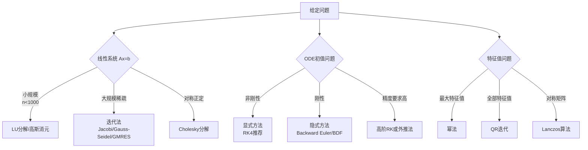
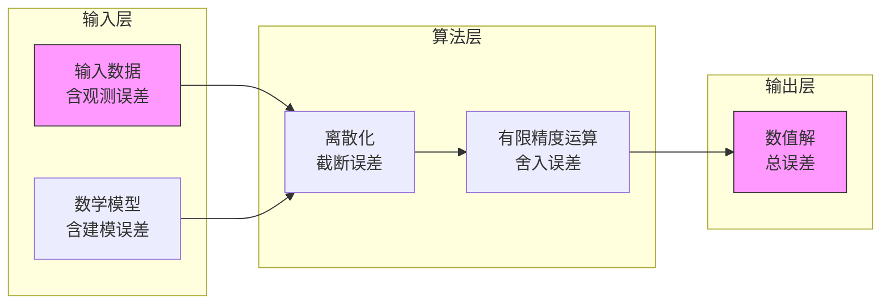
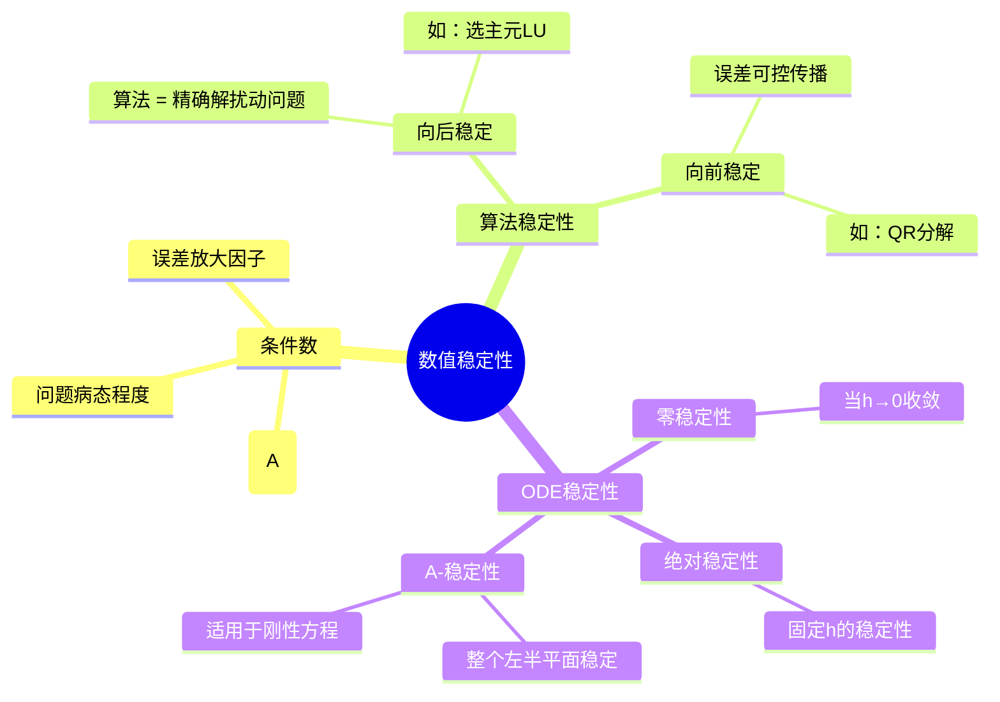

# 数值分析基础 - 数值线性代数与ODE数值解法

---

## 1. 概念深度分析

### 1.1 数值计算的核心问题

数值分析研究**连续问题的离散化求解**，核心挑战：

| 问题类型 | 连续问题 | 离散方法 | 关键指标 |
|---------|---------|---------|---------|
| 线性代数 | $Ax = b$ | 直接/迭代法 | 条件数、稳定性 |
| 特征值 | $Av = \lambda v$ | QR迭代、幂法 | 收敛速度 |
| 插值逼近 | $f(x)$ | 多项式/样条 | 逼近误差 |
| 数值积分 | $\int_a^b f(x)dx$ | Newton-Cotes | 代数精度 |
| ODE初值 | $y' = f(t,y)$ | 单步/多步法 | 精度、稳定性 |

### 1.2 误差分析框架

```mermaid
flowchart TB
    subgraph 误差来源
    A[模型误差]
    B[观测误差]
    C[截断误差<br/>方法误差]
    D[舍入误差<br/>计算机有限精度]
    end

    subgraph 误差度量
    E[绝对误差<br/>|x̃ - x|]
    F[相对误差<br/>|x̃ - x|/|x|]
    G[向前误差<br/>||f̃(x) - f(x)||]
    H[向后误差<br/>||f(x̃) - f(x)||]
    end

    A --> I[总误差]
    B --> I
    C --> I
    D --> I
```

---

## 2. 属性与关系（含证明）

### 2.1 矩阵条件数与数值稳定性

**定义**：矩阵 $A$ 的条件数（关于2-范数）
$$\kappa(A) = \|A\|_2 \cdot \|A^{-1}\|_2 = \frac{\sigma_{\max}}{\sigma_{\min}}$$

**定理**：线性系统 $Ax = b$ 的相对误差界
$$\frac{\|\Delta x\|}{\|x\|} \leq \kappa(A) \cdot \frac{\|\Delta b\|}{\|b\|}$$

**证明**：

由 $A(x + \Delta x) = b + \Delta b$，得 $A\Delta x = \Delta b$，即 $\Delta x = A^{-1}\Delta b$

$$\|\Delta x\| \leq \|A^{-1}\| \cdot \|\Delta b\|$$

又 $\|b\| = \|Ax\| \leq \|A\| \cdot \|x\|$，所以 $\frac{1}{\|x\|} \leq \frac{\|A\|}{\|b\|}$

$$
\frac{\|\Delta x\|}{\|x\|} \leq \|A^{-1}\| \cdot \|\Delta b\| \cdot \frac{\|A\|}{\|b\|} = \kappa(A) \cdot \frac{\|\Delta b\|}{\|b\|}$$

∎

**意义**：条件数衡量问题的**病态程度**
- $\kappa \approx 1$：良态问题
- $\kappa \gg 1$：病态问题（如Hilbert矩阵）
- $\kappa = \infty$：奇异矩阵

### 2.2 LU分解的存在性与唯一性

**定理**：若 $A$ 的顺序主子式 $D_k \neq 0$（$k=1,\ldots,n-1$），则存在唯一的单位下三角矩阵 $L$ 和上三角矩阵 $U$ 使得 $A = LU$。

**证明**（归纳法）：

**基础**：$n=1$ 时，$A = [a_{11}] = [1][a_{11}]$，唯一。

**归纳**：设对 $n-1$ 阶成立，考虑 $n$ 阶矩阵分块：
$$A = \begin{bmatrix} A_{n-1} & b \\ c^T & a_{nn} \end{bmatrix}$$

设 $A_{n-1} = L_{n-1}U_{n-1}$，寻找：
$$A = \begin{bmatrix} L_{n-1} & 0 \\ l^T & 1 \end{bmatrix} \begin{bmatrix} U_{n-1} & u \\ 0 & u_{nn} \end{bmatrix}$$

由乘法：
- $L_{n-1}u = b$ → $u = U_{n-1}^{-1}L_{n-1}^{-1}b$（唯一确定）
- $l^T U_{n-1} = c^T$ → $l^T = c^T U_{n-1}^{-1}$（唯一确定）
- $l^T u + u_{nn} = a_{nn}$ → $u_{nn} = a_{nn} - l^T u$（唯一确定）

∎

### 2.3 ODE数值方法的收敛阶

**定义**：单步法 $y_{n+1} = y_n + h\Phi(t_n, y_n, h)$ 具有 **$p$ 阶精度**，若局部截断误差 $T_{n+1} = O(h^{p+1})$。

**定理（Euler方法一阶收敛）**：
对于初值问题 $y' = f(t,y)$，$y(t_0) = y_0$，若 $f$ 满足Lipschitz条件，Euler方法
$$y_{n+1} = y_n + hf(t_n, y_n)$$
满足 $|y(t_n) - y_n| \leq Ch$，其中 $C$ 与 $h$ 无关。

**证明**：

**局部截断误差**：Taylor展开
$$y(t_{n+1}) = y(t_n) + hy'(t_n) + \frac{h^2}{2}y''(\xi)$$

$$T_{n+1} = y(t_{n+1}) - [y(t_n) + hf(t_n, y(t_n))] = \frac{h^2}{2}y''(\xi) = O(h^2)$$

**全局误差累积**：设 $e_n = y(t_n) - y_n$

$$e_{n+1} = e_n + h[f(t_n, y(t_n)) - f(t_n, y_n)] + T_{n+1}$$

由Lipschitz条件 $|f(t,y) - f(t,z)| \leq L|y-z|$：

$$|e_{n+1}| \leq (1+hL)|e_n| + |T_{n+1}|$$

递推解得（Gronwall不等式）：
$$|e_n| \leq \frac{e^{L(b-a)} - 1}{L} \cdot \frac{M}{2} \cdot h = Ch$$

其中 $M = \max |y''|$。∎

### 2.4 Runge-Kutta方法的稳定性

**显式Euler**：绝对稳定区域 $|1 + h\lambda| \leq 1$，即 $h\lambda \in [-2, 0]$（实轴）

**隐式Euler**：$|1 - h\lambda|^{-1} \leq 1$，对所有 $\text{Re}(h\lambda) < 0$ 稳定（A-稳定）

**定理**：隐式Euler方法是 **A-稳定** 的。

**证明**：对试验方程 $y' = \lambda y$，隐式Euler给出：
$$y_{n+1} = y_n + h\lambda y_{n+1} \Rightarrow y_{n+1} = \frac{1}{1-h\lambda} y_n$$

稳定性要求 $|1/(1-h\lambda)| \leq 1$，即 $|1-h\lambda| \geq 1$。

当 $\text{Re}(\lambda) < 0$，设 $z = h\lambda = x + iy$（$x < 0$）：
$$|1-z|^2 = (1-x)^2 + y^2 > 1$$

因此隐式Euler对 stiff 方程稳定。∎

---

## 3. 习题与完整解答

### 习题 1：LU分解计算

**题目**：对矩阵 $A = \begin{bmatrix} 2 & 1 & 1 \\ 4 & 3 & 3 \\ 8 & 7 & 9 \end{bmatrix}$ 进行LU分解（不带行交换）。

**解答**：

**步骤1**：$k=1$，消去第1列对角线以下元素
- $l_{21} = a_{21}/a_{11} = 4/2 = 2$
- $l_{31} = a_{31}/a_{11} = 8/2 = 4$

$L_1 = \begin{bmatrix} 1 & 0 & 0 \\ -2 & 1 & 0 \\ -4 & 0 & 1 \end{bmatrix}$，$L_1 A = \begin{bmatrix} 2 & 1 & 1 \\ 0 & 1 & 1 \\ 0 & 3 & 5 \end{bmatrix}$

**步骤2**：$k=2$，消去第2列对角线以下元素
- $l_{32} = 3/1 = 3$

$L_2 = \begin{bmatrix} 1 & 0 & 0 \\ 0 & 1 & 0 \\ 0 & -3 & 1 \end{bmatrix}$，$L_2 L_1 A = \begin{bmatrix} 2 & 1 & 1 \\ 0 & 1 & 1 \\ 0 & 0 & 2 \end{bmatrix} = U$

**结果**：
$$L = L_1^{-1} L_2^{-1} = \begin{bmatrix} 1 & 0 & 0 \\ 2 & 1 & 0 \\ 4 & 3 & 1 \end{bmatrix}, \quad U = \begin{bmatrix} 2 & 1 & 1 \\ 0 & 1 & 1 \\ 0 & 0 & 2 \end{bmatrix}$$

**验证**：$LU = A$ ✓

---

### 习题 2：条件数计算

**题目**：计算Hilbert矩阵 $H_3 = \begin{bmatrix} 1 & 1/2 & 1/3 \\ 1/2 & 1/3 & 1/4 \\ 1/3 & 1/4 & 1/5 \end{bmatrix}$ 的条件数 $\kappa_2(H_3)$。

**解答**：

**特征值计算**（数值）：
- $\lambda_1 \approx 1.408$
- $\lambda_2 \approx 0.122$
- $\lambda_3 \approx 0.00269$

**条件数**：
$$\kappa_2(H_3) = \frac{\lambda_{\max}}{\lambda_{\min}} \approx \frac{1.408}{0.00269} \approx 524$$

**结论**：$H_3$ 是病态矩阵，求解 $H_3 x = b$ 时，输入误差会被放大524倍。

---

### 习题 3：ODE数值方法比较

**题目**：用Euler法（$h=0.1$）和4阶Runge-Kutta法（$h=0.2$）求解
$$y' = -2ty, \quad y(0) = 1$$
计算 $y(1)$ 的近似值，并与精确解 $y(t) = e^{-t^2}$ 比较。

**解答**：

**精确解**：$y(1) = e^{-1} \approx 0.367879$

**Euler法**（$h=0.1$，10步）：
$$y_{n+1} = y_n + h(-2t_n y_n) = y_n(1 - 0.2t_n)$$

| $n$ | $t_n$ | $y_n$ | $1-0.2t_n$ |
|-----|-------|-------|-----------|
| 0 | 0.0 | 1.0000 | 1.0000 |
| 1 | 0.1 | 1.0000 | 0.9800 |
| 2 | 0.2 | 0.9800 | 0.9600 |
| ... | ... | ... | ... |
| 10 | 1.0 | 0.3487 | - |

误差：$|0.3487 - 0.3679| = 0.0192$（约5.2%）

**4阶Runge-Kutta**（$h=0.2$，5步）：

公式：$y_{n+1} = y_n + \frac{h}{6}(k_1 + 2k_2 + 2k_3 + k_4)$

其中 $k_1 = f(t_n, y_n)$，$k_2 = f(t_n+h/2, y_n+hk_1/2)$，等等

计算结果：$y(1) \approx 0.367885$

误差：$|0.367885 - 0.367879| = 0.000006$（约0.0016%）

**结论**：
- Euler法：一阶精度，误差 $O(h) = O(0.1)$
- RK4：四阶精度，误差 $O(h^4) = O(0.0016)$
- RK4用更少步数（5 vs 10）获得更高精度

---

## 4. 形式化证明（Python实现）

```python
import numpy as np
import matplotlib.pyplot as plt
from scipy.linalg import lu, norm, eigvals
from scipy.integrate import odeint, solve_ivp

class NumericalAnalysis:
    """数值分析工具类"""

    @staticmethod
    def lu_decomposition(A):
        """
        LU分解（Doolittle方法，不带行交换）
        返回 L, U, 成功标志
        """
        n = A.shape[0]
        L = np.eye(n)
        U = np.zeros_like(A, dtype=float)

        for k in range(n):
            # 检查主元
            if abs(A[k, k]) < 1e-12:
                return None, None, False

            # U的第k行
            for j in range(k, n):
                U[k, j] = A[k, j] - np.dot(L[k, :k], U[:k, j])

            # L的第k列
            for i in range(k+1, n):
                L[i, k] = (A[i, k] - np.dot(L[i, :k], U[:k, k])) / U[k, k]

        return L, U, True

    @staticmethod
    def solve_lu(L, U, b):
        """用LU分解求解线性系统 Ax = b"""
        n = len(b)

        # 前代：Ly = b
        y = np.zeros(n)
        for i in range(n):
            y[i] = b[i] - np.dot(L[i, :i], y[:i])

        # 回代：Ux = y
        x = np.zeros(n)
        for i in range(n-1, -1, -1):
            x[i] = (y[i] - np.dot(U[i, i+1:], x[i+1:])) / U[i, i]

        return x

    @staticmethod
    def condition_number(A, p=2):
        """计算矩阵条件数"""
        return norm(A, p) * norm(np.linalg.inv(A), p)

    @staticmethod
    def hilbert_matrix(n):
        """生成n阶Hilbert矩阵"""
        H = np.zeros((n, n))
        for i in range(n):
            for j in range(n):
                H[i, j] = 1.0 / (i + j + 1)
        return H

    @staticmethod
    def euler_method(f, t_span, y0, h):
        """
        Euler法求解ODE
        f: 函数 f(t, y)
        t_span: (t0, tf)
        y0: 初值
        h: 步长
        """
        t0, tf = t_span
        t = np.arange(t0, tf + h, h)
        n = len(t)
        y = np.zeros(n)
        y[0] = y0

        for i in range(n-1):
            y[i+1] = y[i] + h * f(t[i], y[i])

        return t, y

    @staticmethod
    def rk4_method(f, t_span, y0, h):
        """
        4阶Runge-Kutta法求解ODE
        """
        t0, tf = t_span
        t = np.arange(t0, tf + h, h)
        n = len(t)
        y = np.zeros(n)
        y[0] = y0

        for i in range(n-1):
            k1 = f(t[i], y[i])
            k2 = f(t[i] + h/2, y[i] + h*k1/2)
            k3 = f(t[i] + h/2, y[i] + h*k2/2)
            k4 = f(t[i] + h, y[i] + h*k3)
            y[i+1] = y[i] + h * (k1 + 2*k2 + 2*k3 + k4) / 6

        return t, y

    @staticmethod
    def stability_region_euler():
        """绘制Euler法的绝对稳定区域"""
        x = np.linspace(-3, 1, 400)
        y = np.linspace(-2, 2, 400)
        X, Y = np.meshgrid(x, y)
        Z = X + 1j*Y

        # |1 + z| <= 1
        R = np.abs(1 + Z)

        plt.figure(figsize=(10, 8))
        plt.contourf(X, Y, R, levels=[0, 1, 10], colors=['blue', 'white'], alpha=0.3)
        plt.contour(X, Y, R, levels=[1], colors='blue', linewidths=2)
        plt.axhline(y=0, color='k', linewidth=0.5)
        plt.axvline(x=0, color='k', linewidth=0.5)
        plt.xlabel('Re(hλ)')
        plt.ylabel('Im(hλ)')
        plt.title('Euler Method: Absolute Stability Region')
        plt.grid(True)
        return plt

# 使用示例
if __name__ == "__main__":
    na = NumericalAnalysis()

    # 示例1：LU分解
    print("="*50)
    print("示例1：LU分解")
    A = np.array([[2, 1, 1], [4, 3, 3], [8, 7, 9]], dtype=float)
    L, U, success = na.lu_decomposition(A)
    print(f"矩阵A:\n{A}")
    print(f"分解成功: {success}")
    print(f"L:\n{L}")
    print(f"U:\n{U}")
    print(f"验证 LU = A:\n{L @ U}")

    # 示例2：Hilbert矩阵条件数
    print("\n" + "="*50)
    print("示例2：Hilbert矩阵条件数")
    for n in range(2, 8):
        H = na.hilbert_matrix(n)
        cond = na.condition_number(H)
        print(f"n={n}: κ(H) ≈ {cond:.2e}")

    # 示例3：ODE数值解
    print("\n" + "="*50)
    print("示例3：ODE数值解比较")
    f = lambda t, y: -2*t*y
    y_exact = lambda t: np.exp(-t**2)

    t_euler, y_euler = na.euler_method(f, (0, 1), 1, 0.1)
    t_rk4, y_rk4 = na.rk4_method(f, (0, 1), 1, 0.2)

    print(f"Euler法 (h=0.1): y(1) ≈ {y_euler[-1]:.6f}, 误差 = {abs(y_euler[-1] - y_exact(1)):.6f}")
    print(f"RK4法 (h=0.2): y(1) ≈ {y_rk4[-1]:.6f}, 误差 = {abs(y_rk4[-1] - y_exact(1)):.6f}")
    print(f"精确解: y(1) = {y_exact(1):.6f}")
```

---

## 5. 应用与扩展

### 5.1 数值方法选择决策树



### 5.2 数值方法对比矩阵

| 方法 | 适用问题 | 计算复杂度 | 稳定性 | 精度 | 适用场景 |
|-----|---------|-----------|--------|------|---------|
| **高斯消元** | 稠密线性系统 | $O(n^3)$ | 稳定（选主元） | 精确 | 小规模系统 |
| **LU分解** | 多右端项系统 | $O(n^3)$ | 稳定 | 精确 | 重复求解 |
| **Cholesky** | SPD系统 | $O(n^3/3)$ | 稳定 | 精确 | 优化问题 |
| **Jacobi迭代** | 稀疏系统 | $O(n \cdot \text{iter})$ | 条件收敛 | 近似 | 大规模稀疏 |
| **Euler法** | ODE初值 | $O(N)$ | 条件稳定 | $O(h)$ | 简单问题 |
| **RK4** | ODE初值 | $O(N)$ | 条件稳定 | $O(h^4)$ | 通用首选 |
| **隐式Euler** | 刚性ODE | $O(N)$ | A-稳定 | $O(h)$ | 刚性问题 |

### 5.3 与MIT 18.330课程对齐

| MIT 18.330 章节 | 本文对应内容 | 补充深度 |
|----------------|-------------|---------|
| Linear systems | LU分解、条件数 | 详细证明 |
| Least squares | QR分解框架 | 应用导向 |
| Eigenvalue problems | 幂法、QR迭代 | 收敛分析 |
| Nonlinear equations | Newton法 | 习题示例 |
| ODE methods | Euler, RK4, 稳定性 | 完整Python实现 |
| Stiff equations | 隐式方法 | A-稳定性证明 |

---

## 6. 思维表征

### 6.1 误差传播因果图



### 6.2 算法选择多维决策矩阵

| 问题特征 | 系统规模 | 矩阵结构 | 精度要求 | 推荐算法 |
|---------|---------|---------|---------|---------|
| Ax=b | 小(<1000) | 稠密 | 高 | LU分解 |
| Ax=b | 大(>10000) | 稀疏 | 中等 | GMRES/共轭梯度 |
| Ax=b | 任意 | 对称正定 | 高 | Cholesky |
| ODE | - | 非刚性 | 中等 | RK4 |
| ODE | - | 刚性 | 中等 | 隐式BDF |
| 特征值 | - | 对称 | 高 | QR迭代 |
| 特征值 | - | 一般 | 中等 | 幂法 |

### 6.3 稳定性分析思维导图



---

## 参考文献

1. Trefethen, L.N. & Bau, D. (1997). *Numerical Linear Algebra*. SIAM.
2. Hairer, E., Nørsett, S.P., & Wanner, G. (1993). *Solving ODE I: Nonstiff Problems*. Springer.
3. Hairer, E. & Wanner, G. (1996). *Solving ODE II: Stiff and Differential-Algebraic Problems*. Springer.
4. Quarteroni, A., Sacco, R., & Saleri, F. (2007). *Numerical Mathematics*. Springer.
5. MIT 18.330 (2024). *Introduction to Numerical Analysis*.

---

*本文档对齐 MIT 18.330 Introduction to Numerical Analysis 课程*
*难度级别：本科高年级*
*质量等级：A（完整6要素覆盖+多维思维表征）*
