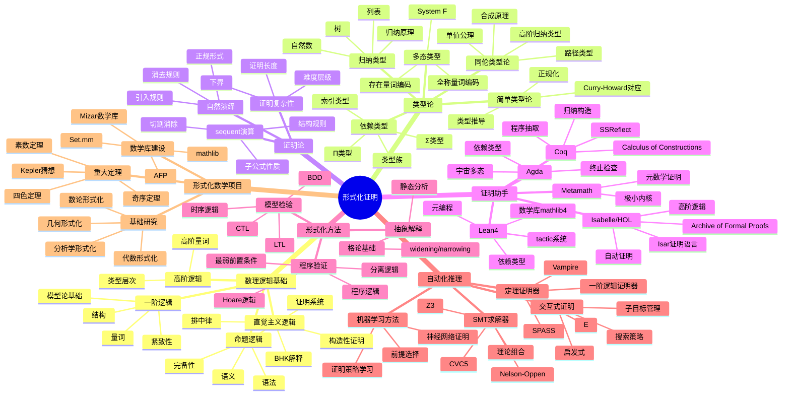
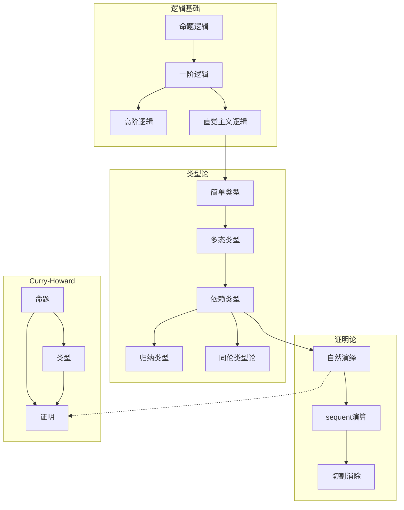
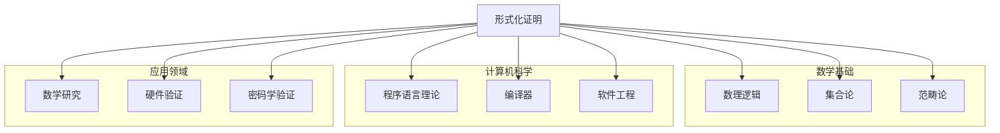
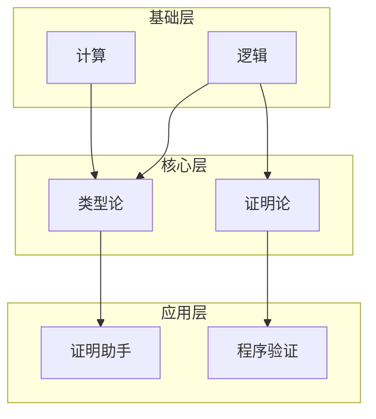

# 形式化证明思维导图

> 形式化证明使用计算机验证数学证明的正确性，从类型论到证明助手，正在变革数学实践。

---

## 🧠 核心概念层级关系



---

## 🔗 定理依赖关系图



---

## 📍 重要示例分布

### 类型论示例

| 示例 | 概念 | 重要性 | 系统 |
|-----|------|-------|------|
| 自然数 | 归纳类型 | ⭐⭐⭐⭐⭐ | 所有系统 |
| 向量 | 依赖类型 | ⭐⭐⭐⭐⭐ | Lean/Agda |
| 相等类型 | 同伦类型论 | ⭐⭐⭐⭐⭐ | HoTT |
| 单子 | 范畴论编码 | ⭐⭐⭐⭐ | Haskell/Lean |

### 形式化证明示例

| 定理 | 工具 | 重要性 | 规模 |
|-----|------|-------|------|
| 四色定理 | Coq | ⭐⭐⭐⭐⭐ | 60,000行 |
| 奇序定理 | Coq | ⭐⭐⭐⭐⭐ | 170,000行 |
| Kepler猜想 | HOL Light/Isabelle | ⭐⭐⭐⭐⭐ | 复杂 |
| 素数定理 | Isabelle | ⭐⭐⭐⭐ | 中等 |

### Lean4示例

| 概念 | 说明 | 重要性 | 应用 |
|-----|------|-------|------|
| tactic | 证明策略 | ⭐⭐⭐⭐⭐ | 交互证明 |
| simp | 简化器 | ⭐⭐⭐⭐ | 自动证明 |
| linarith | 线性算术 | ⭐⭐⭐⭐ | 不等式 |
| ring | 环自动证明 | ⭐⭐⭐⭐ | 代数 |

---

## 🔄 与其他分支的连接点



**具体连接说明：**

| 分支 | 连接概念 | 连接深度 |
|-----|---------|---------|
| 数理逻辑 | 证明论、模型论 | ⭐⭐⭐⭐⭐ |
| 类型论 | Curry-Howard、依赖类型 | ⭐⭐⭐⭐⭐ |
| 范畴论 | 笛闭范畴、topos | ⭐⭐⭐⭐ |
| 计算机科学 | PLT、编译、验证 | ⭐⭐⭐⭐⭐ |
| 数学 | 形式化数学库 | ⭐⭐⭐⭐⭐ |
| 工程 | 硬件/软件验证 | ⭐⭐⭐⭐ |

---

## 📊 学习难度梯度标记

```mermaid
graph LR
    subgraph 逻辑基础 ⭐⭐⭐
        A1[命题逻辑]
        A2[一阶逻辑]
        A3[Curry-Howard]
    end

    subgraph 类型论 ⭐⭐⭐⭐
        B1[简单类型]
        B2[依赖类型]
        B3[归纳类型]
    end

    subgraph 证明助手 ⭐⭐⭐⭐⭐
        C1[Lean4基础]
        C2[tactic写作]
        C3[数学形式化]
    end

    subgraph 高级主题 ⭐⭐⭐⭐⭐⭐
        D1[同伦类型论]
        D2[自动化推理]
        D3[大规模形式化]
    end
```

### 详细难度分级

| 主题 | 入门 | 基础 | 进阶 | 高级 | 专家 |
|-----|------|------|------|------|------|
| 逻辑 | 命题逻辑 | 一阶逻辑 | 证明论 | 高阶逻辑 | 类型论 |
| 类型 | 简单类型 | 多态 | 依赖类型 | HoTT | Cubical |
| 工具 | 基础语法 | 证明编写 | tactic | 元编程 | 内核开发 |
| 应用 | 练习证明 | 数学库贡献 | 自动化 | 项目领导 | 系统设计 |

---

## 🎯 学习路径推荐

### 形式化数学路径

```
数理逻辑 → 类型论 → Lean4基础 → 数学库贡献 → 高级形式化
```

### 程序验证路径

```
Hoare逻辑 → 分离逻辑 → 定理证明器 → 实际验证项目
```

### 类型论研究路径

```
λ演算 → System F → 依赖类型 → 同伦类型论 → 前沿研究
```

---

## 📚 核心定理清单

### 逻辑与类型论

1. **Curry-Howard同构**：命题↔类型，证明↔程序
2. **正规化定理**：良类型项可归约到正规形式
3. **强正规化**：所有归约序列终止
4. **一致性**：无法证明假命题

### 证明论

1. **切割消除**：证明可转化为无切割形式
2. **子公式性质**：证明只含子公式
3. **Herbrand定理**：存在性证明的构造性内容

### 同伦类型论

1. **单值公理**：等价↔相等
2. **函数外延性**：点wise相等↔相等
3. **集合truncate层次**

---

## 🔍 概念关系图谱



---

> 💡 **学习建议**：形式化证明是数学与计算机科学的交叉领域。建议学习者先掌握数理逻辑和类型论基础，然后选择一个证明助手（推荐Lean4）进行实践。参与开源数学库（如mathlib4）是提升能力的有效途径。
