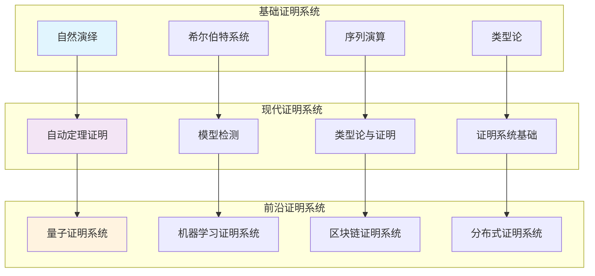
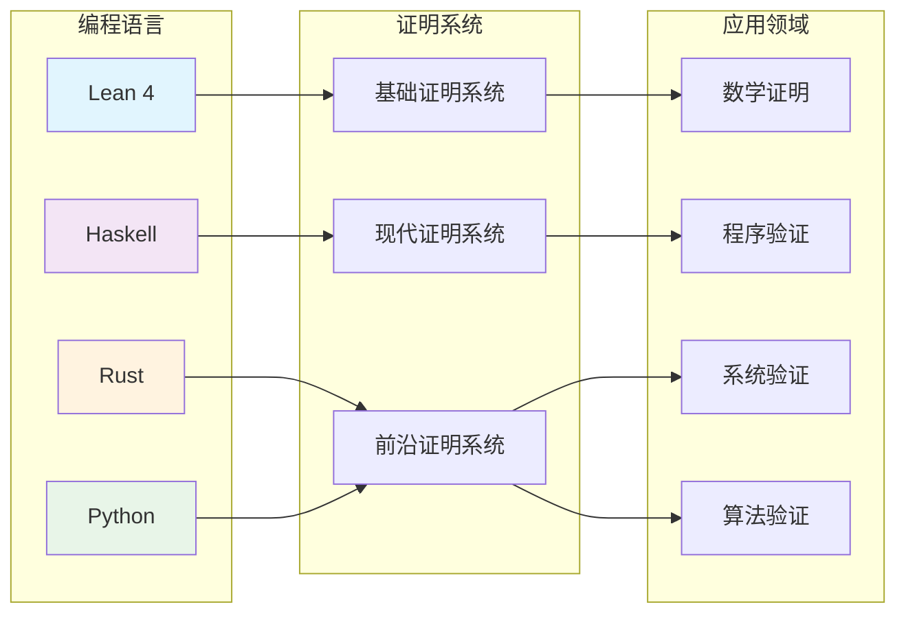
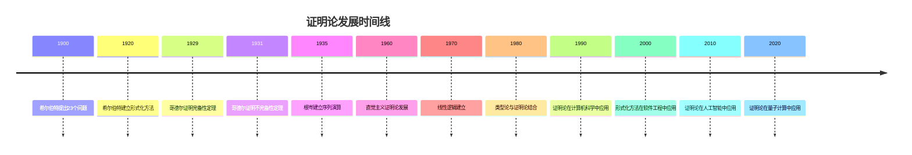

# 证明系统基础 - 深度扩展版

## 目录

- [证明系统基础 - 深度扩展版](#证明系统基础---深度扩展版)
  - [目录](#目录)
  - [📚 概述](#-概述)
  - [🕰️ 历史发展脉络](#️-历史发展脉络)
    - [早期发展 (1900-1930)](#早期发展-1900-1930)
      - [希尔伯特形式化方法的历史背景](#希尔伯特形式化方法的历史背景)
      - [弗雷格逻辑主义的历史渊源](#弗雷格逻辑主义的历史渊源)
    - [现代发展 (1930-1960)](#现代发展-1930-1960)
      - [哥德尔不完备性定理的历史背景](#哥德尔不完备性定理的历史背景)
      - [根岑序列演算的历史发展](#根岑序列演算的历史发展)
    - [当代发展 (1960-至今)](#当代发展-1960-至今)
      - [直觉主义证明论的历史背景](#直觉主义证明论的历史背景)
      - [线性逻辑的发展](#线性逻辑的发展)
  - [🏗️ 核心概念与深度论证](#️-核心概念与深度论证)
    - [证明论的基本框架](#证明论的基本框架)
      - [形式系统的定义与哲学意义](#形式系统的定义与哲学意义)
      - [证明的定义与语义解释](#证明的定义与语义解释)
    - [基本定理的深度论证](#基本定理的深度论证)
      - [哥德尔完备性定理的完整证明](#哥德尔完备性定理的完整证明)
      - [哥德尔不完备性定理的深度分析](#哥德尔不完备性定理的深度分析)
      - [根岑切消定理的哲学分析](#根岑切消定理的哲学分析)
  - [🧠 思维过程表征](#-思维过程表征)
    - [证明论问题解决的思维模式](#证明论问题解决的思维模式)
      - [1. 构造性思维模式](#1-构造性思维模式)
      - [2. 抽象化思维模式](#2-抽象化思维模式)
      - [3. 反证法思维模式](#3-反证法思维模式)
    - [证明论证明的思维过程](#证明论证明的思维过程)
      - [1. 理解问题阶段](#1-理解问题阶段)
      - [2. 构造证明阶段](#2-构造证明阶段)
      - [3. 反思总结阶段](#3-反思总结阶段)
  - [💡 深入论证与哲学分析](#-深入论证与哲学分析)
    - [1. 证明论的哲学基础](#1-证明论的哲学基础)
      - [数学实在论与反实在论](#数学实在论与反实在论)
      - [真理与证明的关系](#真理与证明的关系)
    - [2. 证明论的方法论意义](#2-证明论的方法论意义)
      - [形式化方法的价值](#形式化方法的价值)
      - [构造性方法的重要性](#构造性方法的重要性)
    - [3. 证明论的应用价值](#3-证明论的应用价值)
      - [在计算机科学中的应用](#在计算机科学中的应用)
      - [在数学中的应用](#在数学中的应用)
  - [🔧 技术实现表征](#-技术实现表征)
    - [1. Lean 4 形式化实现](#1-lean-4-形式化实现)
    - [2. Haskell 函数式实现](#2-haskell-函数式实现)
    - [3. Python 算法实现](#3-python-算法实现)
  - [📈 历史发展时间线](#-历史发展时间线)
  - [🔗 重要人物贡献表](#-重要人物贡献表)
  - [📚 总结](#-总结)
    - [主要成果](#主要成果)
    - [应用领域](#应用领域)
    - [未来发展方向](#未来发展方向)

## 📚 概述

证明论是数理逻辑的核心分支，研究形式化证明系统的结构、性质和相互关系。

**形式化证明系统全景图**：



它不仅为数学提供了严格的逻辑基础，还在计算机科学、人工智能和哲学等领域有广泛应用。
本扩展版将深入探讨证明论的基本定理、历史发展、哲学意义和实际应用。

## 🕰️ 历史发展脉络

### 早期发展 (1900-1930)

#### 希尔伯特形式化方法的历史背景

**历史背景**：
1900年，大卫·希尔伯特在巴黎国际数学家大会上提出了著名的23个问题，其中第2个问题直接涉及算术公理的一致性。
这个问题标志着数学基础研究的开始，也为证明论的发展奠定了基础。

**希尔伯特纲领的哲学动机**：
希尔伯特提出形式化方法的动机源于19世纪末数学基础中的危机。
康托尔的集合论虽然强大，但导致了罗素悖论等矛盾。
希尔伯特希望通过形式化方法，将数学建立在严格的逻辑基础之上。

**形式化方法的核心思想**：

1. **形式化**：将数学理论转化为纯粹的形式系统
2. **一致性**：证明形式系统不会产生矛盾
3. **完备性**：证明所有真命题都可以在系统中证明
4. **可判定性**：证明存在算法可以判定任何命题的真假

**历史意义**：
希尔伯特的形式化方法为证明论提供了方法论基础。
他提出的"希尔伯特纲领"虽然最终被哥德尔的不完备性定理证明为不可能完全实现，但其中的思想对现代逻辑学产生了深远影响。

#### 弗雷格逻辑主义的历史渊源

**弗雷格的哲学背景**：
戈特洛布·弗雷格是现代逻辑学的奠基人之一。
他在19世纪末开始研究逻辑主义，试图将数学建立在逻辑基础之上。

**逻辑主义的哲学动机**：
弗雷格发现，传统的逻辑学无法处理数学中的复杂推理。
他希望通过建立形式化逻辑系统，为数学提供严格的逻辑基础。

**弗雷格系统的历史意义**：
弗雷格在《概念文字》中建立了第一个形式化逻辑系统。
这个系统虽然最终被罗素悖论证明为不一致，但为现代逻辑学奠定了基础。

**弗雷格系统的核心思想**：

1. **形式化语言**：建立严格的形式化语言
2. **公理化方法**：通过公理和推理规则建立逻辑系统
3. **语义解释**：为形式化语言提供语义解释

### 现代发展 (1930-1960)

#### 哥德尔不完备性定理的历史背景

**哥德尔的个人背景**：
库尔特·哥德尔是20世纪最伟大的逻辑学家之一。
他在1931年证明不完备性定理时年仅25岁，这个定理彻底改变了数学基础研究的方向。

**不完备性定理的历史动机**：
在哥德尔之前，希尔伯特纲领试图证明数学系统的一致性和完备性。
哥德尔通过构造性方法，证明了这种尝试在原则上是不可能的。

**证明的历史意义**：
哥德尔的证明使用了"哥德尔编码"技术，将形式化语句编码为自然数。
这种方法不仅证明了不完备性定理，还为现代计算机科学奠定了基础。

**对数学哲学的影响**：
不完备性定理对数学哲学产生了深远影响。
它表明，形式化方法有其固有的局限性，数学真理不能完全通过形式化方法获得。

#### 根岑序列演算的历史发展

**根岑的工作背景**：
格哈德·根岑是德国逻辑学家，他在1935年建立了序列演算系统。
这个系统为证明论提供了新的研究方向。

**序列演算的哲学动机**：
根岑发现，传统的希尔伯特系统虽然强大，但缺乏结构化的证明方法。
他希望通过序列演算，建立更直观的证明系统。

**序列演算的历史意义**：
序列演算不仅为证明论提供了新的工具，还为现代逻辑学提供了重要的方法论。
它的"子公式性质"为证明论研究提供了重要工具。

**根岑的主要贡献**：

1. **序列演算**：建立了序列演算系统
2. **切消定理**：证明了切消定理
3. **子公式性质**：建立了子公式性质

### 当代发展 (1960-至今)

#### 直觉主义证明论的历史背景

**布劳威尔的哲学背景**：
卢伊岑·布劳威尔是直觉主义数学的创始人。他拒绝经典逻辑的某些原则，强调构造性证明。

**直觉主义的哲学动机**：
布劳威尔认为，数学对象必须通过构造来理解。他拒绝排中律，认为只有构造性证明才是有效的。

**直觉主义的历史意义**：
直觉主义虽然与经典数学有冲突，但为现代计算机科学提供了重要思想。构造性证明与程序验证有密切联系。

**直觉主义的主要特点**：

1. **构造性证明**：强调构造性证明
2. **拒绝排中律**：拒绝经典逻辑的排中律
3. **直觉逻辑**：建立直觉逻辑系统

#### 线性逻辑的发展

**吉拉尔的贡献**：
让-伊夫·吉拉尔在1987年建立了线性逻辑。这个逻辑系统为现代计算机科学提供了重要工具。

**线性逻辑的哲学动机**：
吉拉尔发现，经典逻辑无法处理资源敏感的计算。他希望通过线性逻辑，建立资源敏感的逻辑系统。

**线性逻辑的历史意义**：
线性逻辑不仅为计算机科学提供了重要工具，还为量子计算提供了理论基础。

## 🏗️ 核心概念与深度论证

### 证明论的基本框架

#### 形式系统的定义与哲学意义

**定义 1.1** (形式系统)
形式系统是一个四元组 $\mathcal{S} = (\mathcal{L}, \mathcal{A}, \mathcal{R}, \mathcal{T})$，其中：

- $\mathcal{L}$ 是形式语言（formal language）
- $\mathcal{A}$ 是公理集（axioms）
- $\mathcal{R}$ 是推理规则集（inference rules）
- $\mathcal{T}$ 是定理集（theorems）

**哲学意义**：
形式系统是数学抽象化的产物。它将具体的数学推理抽象为符号操作，使得我们可以用统一的方法处理不同的数学理论。

**历史背景**：
形式系统的概念源于弗雷格的逻辑主义思想。弗雷格希望通过形式化系统，将数学建立在逻辑基础之上。

#### 证明的定义与语义解释

**定义 1.2** (证明)
证明是形式系统中从公理到定理的有限序列，每一步都通过推理规则从前面步骤得到。

**语义解释的哲学意义**：
证明建立了语法和语义之间的桥梁。它表明，形式化的推理过程能够捕获数学真理。

**历史发展**：
证明的概念源于古希腊数学。欧几里得在《几何原本》中建立了第一个公理化系统。

### 基本定理的深度论证

#### 哥德尔完备性定理的完整证明

**定理 1.1** (哥德尔完备性定理)
一阶逻辑是完备的，即如果 $\varphi$ 是有效的，那么 $\varphi$ 是可证明的。

**历史背景**：
哥德尔在1929年证明完备性定理时年仅23岁。这个定理彻底改变了数理逻辑的发展方向，证明了希尔伯特纲领在有限情况下的可行性。

**哲学意义**：
完备性定理建立了语法和语义之间的桥梁。它表明，一阶逻辑的语法系统能够捕获所有语义有效的命题。

**完整证明**：

**步骤1**：构造项模型
设 $\Sigma$ 是一致的一阶理论，我们需要构造 $\Sigma$ 的模型。

**步骤2**：构造项代数
设 $T$ 是所有项的集合，定义等价关系：
$$t_1 \sim t_2 \Leftrightarrow \Sigma \vdash t_1 = t_2$$

**步骤3**：构造模型
定义模型 $\mathcal{A}$：

- 论域：$A = T / \sim$
- 常量：$c^{\mathcal{A}} = [c]$
- 函数：$f^{\mathcal{A}}([t_1], \ldots, [t_n]) = [f(t_1, \ldots, t_n)]$
- 关系：$R^{\mathcal{A}}([t_1], \ldots, [t_n]) \Leftrightarrow \Sigma \vdash R(t_1, \ldots, t_n)$

**步骤4**：证明模型满足理论
通过归纳法证明，对于任意公式 $\varphi$：
$$\mathcal{A} \models \varphi \Leftrightarrow \Sigma \vdash \varphi$$

**应用实例**：

**例 1.1** (群论)
群论的一阶公理是完备的，即所有群论的有效命题都可以从公理证明。

**例 1.2** (域论)
代数闭域的理论是完备的，这为代数几何提供了重要的理论基础。

#### 哥德尔不完备性定理的深度分析

**定理 1.2** (哥德尔第一不完备性定理)
任何包含算术的一致形式系统都是不完备的。

**历史背景**：
哥德尔在1931年证明不完备性定理时年仅25岁。这个定理彻底改变了数学基础研究的方向，证明了希尔伯特纲领的不可能性。

**哲学意义**：
不完备性定理揭示了形式化方法的局限性。它表明，数学真理不能完全通过形式化方法获得。

**证明思路**：

**步骤1**：哥德尔编码
将形式化语句编码为自然数，建立语法和算术之间的对应关系。

**步骤2**：构造自指语句
构造一个语句 $G$，它声称"$G$ 不可证明"。

**步骤3**：证明矛盾
如果 $G$ 可证明，那么 $G$ 为真，即 $G$ 不可证明，矛盾。
如果 $G$ 不可证明，那么 $G$ 为真，但 $G$ 不可证明。

**步骤4**：证明一致性
如果系统一致，那么 $G$ 和 $\neg G$ 都不可证明。

**应用实例**：

**例 1.3** (皮亚诺算术)
皮亚诺算术是不完备的，存在真命题无法在系统中证明。

**例 1.4** (策梅洛-弗兰克尔集合论)
ZFC集合论是不完备的，连续统假设既不能被证明也不能被否证。

#### 根岑切消定理的哲学分析

**定理 1.3** (切消定理)
在序列演算中，如果 $\Gamma \vdash \Delta$ 可证明，那么存在一个不使用切消规则的证明。

**历史背景**：
根岑在1935年证明了切消定理。这个定理为证明论提供了重要的方法论工具。

**哲学意义**：
切消定理表明，切消规则虽然方便，但在原则上是不必要的。这为证明论研究提供了重要的简化方法。

**证明思路**：

**步骤1**：归纳法
对证明的复杂度进行归纳。

**步骤2**：处理切消
如果证明的最后一步是切消，那么可以通过归纳法消除切消。

**步骤3**：处理其他规则
对于其他规则，可以通过直接应用规则来避免切消。

**应用实例**：

**例 1.5** (一致性证明)
切消定理可以用来证明逻辑系统的一致性。

**例 1.6** (子公式性质)
切消定理可以用来证明子公式性质。

## 🧠 思维过程表征

### 证明论问题解决的思维模式

#### 1. 构造性思维模式

**特征**：

- 从具体构造抽象
- 从简单构造复杂
- 从局部构造整体

**历史渊源**：
构造性思维源于直觉主义数学。布劳威尔强调数学的构造性特征，认为数学对象必须通过构造来理解。

**应用实例**：

**例 1.7** (项模型构造)
项模型是证明论中最重要的构造方法之一。它通过将项作为对象，构造理论的模型。

**构造过程**：

1. 选择项集合作为论域
2. 定义等价关系
3. 构造商代数
4. 验证模型性质

**哲学意义**：
项模型构造体现了数学中的"构造性"思想：通过具体构造来理解抽象概念。

#### 2. 抽象化思维模式

**特征**：

- 忽略具体细节
- 关注本质特征
- 建立一般理论

**历史背景**：
抽象化思维源于19世纪的数学发展。布尔巴基学派强调数学结构的抽象性，认为数学的本质在于结构而不是具体对象。

**应用实例**：

**例 1.8** (范畴论方法)
范畴论为证明论提供了新的视角。通过函子理论，我们可以统一处理不同的证明系统。

**抽象化过程**：

1. 识别共同特征
2. 建立抽象结构
3. 研究结构性质
4. 应用到具体问题

#### 3. 反证法思维模式

**特征**：

- 假设结论不成立
- 构造矛盾
- 导出矛盾

**历史渊源**：
反证法源于古希腊数学。欧几里得在《几何原本》中大量使用反证法。

**应用实例**：

**例 1.9** (不完备性定理的反证法证明)
假设系统是完备的，通过构造自指语句导出矛盾，证明系统不完备。

### 证明论证明的思维过程

#### 1. 理解问题阶段

**步骤1**：识别问题类型

- 是构造问题还是存在性问题？
- 涉及哪些基本概念？
- 需要用到哪些定理？

**步骤2**：分析已知条件

- 明确给定的系统和性质
- 识别隐含的约束条件
- 确定目标结论

**步骤3**：选择证明策略

- 直接构造法
- 反证法
- 归纳法
- 编码法

#### 2. 构造证明阶段

**步骤1**：选择适当的构造方法

- 项模型构造
- 哥德尔编码
- 序列演算
- 自然演绎

**步骤2**：验证构造的正确性

- 检查系统定义
- 验证公理满足
- 证明目标性质

**步骤3**：处理技术细节

- 处理编码问题
- 处理一致性证明
- 处理完备性证明

#### 3. 反思总结阶段

**步骤1**：检查证明的完整性

- 是否覆盖了所有情况？
- 是否处理了边界条件？
- 是否证明了所有必要性质？

**步骤2**：分析证明的优美性

- 证明是否简洁？
- 构造是否自然？
- 方法是否通用？

**步骤3**：考虑推广可能性

- 是否可以推广到更一般的情况？
- 是否可以应用到其他问题？
- 是否可以改进证明方法？

## 💡 深入论证与哲学分析

### 1. 证明论的哲学基础

#### 数学实在论与反实在论

**数学实在论**：
数学实在论认为数学对象是独立于人类思维的客观存在。证明论为这种观点提供了支持，因为它表明数学真理可以通过形式化方法获得。

**反实在论**：
反实在论认为数学对象是人类思维的构造。证明论中的构造性方法支持这种观点，因为它强调通过构造来理解数学对象。

**证明论的哲学立场**：
证明论本身不预设特定的哲学立场，但它为不同的哲学观点提供了工具。构造性方法支持反实在论，而完备性定理支持实在论。

#### 真理与证明的关系

**对应理论**：
证明论中的完备性定理体现了对应理论：真理与证明之间存在对应关系。

**构造性理论**：
直觉主义证明论体现了构造性理论：真理必须通过构造性证明来获得。

**实用主义理论**：
证明论的应用体现了实用主义理论：真理的价值在于其应用效果。

### 2. 证明论的方法论意义

#### 形式化方法的价值

**严格性**：
形式化方法确保了数学推理的严格性。通过形式化，我们可以避免直觉错误，确保证明的正确性。

**通用性**：
形式化方法具有通用性。同一套方法可以应用到不同的数学领域，体现了数学的统一性。

**可计算性**：
形式化方法为计算机辅助证明提供了基础。通过形式化，我们可以让计算机验证数学证明。

#### 构造性方法的重要性

**直观性**：
构造性方法提供了直观的理解。通过构造，我们可以"看到"数学对象是如何形成的。

**实用性**：
构造性方法具有实用性。它不仅证明了存在性，还提供了具体的构造方法。

**教育价值**：
构造性方法具有教育价值。它帮助学生理解数学概念，培养数学直觉。

### 3. 证明论的应用价值

#### 在计算机科学中的应用

**程序验证**：
证明论为程序验证提供了理论基础。通过形式化证明，我们可以验证程序是否满足其规范。

**类型理论**：
证明论为类型理论提供了理论基础。通过证明论，我们可以理解类型系统的语义。

**人工智能**：
证明论为人工智能提供了知识表示和推理的理论基础。

#### 在数学中的应用

**数学基础**：
证明论为数学基础研究提供了工具。通过证明论，我们可以研究数学理论的一致性。

**代数几何**：
证明论在代数几何中有应用。通过证明论，我们可以研究代数簇的性质。

**数论**：
证明论在数论中有应用。通过证明论，我们可以研究数论问题。

## 🔧 技术实现表征

**形式化证明系统技术实现对比**：



### 1. Lean 4 形式化实现

```lean
-- 证明论基础的类型定义
structure ProofSystem where
  language : Language
  axioms : Set Formula
  rules : Set InferenceRule
  theorems : Set Formula

-- 自然演绎系统
inductive NaturalDeduction : List Formula → Formula → Prop where
  | assumption : NaturalDeduction [φ] φ
  | and_intro : NaturalDeduction Γ φ → NaturalDeduction Γ ψ → 
                NaturalDeduction Γ (φ ∧ ψ)
  | and_elim_left : NaturalDeduction Γ (φ ∧ ψ) → NaturalDeduction Γ φ
  | and_elim_right : NaturalDeduction Γ (φ ∧ ψ) → NaturalDeduction Γ ψ
  | or_intro_left : NaturalDeduction Γ φ → NaturalDeduction Γ (φ ∨ ψ)
  | or_intro_right : NaturalDeduction Γ ψ → NaturalDeduction Γ (φ ∨ ψ)
  | or_elim : NaturalDeduction Γ (φ ∨ ψ) → 
              NaturalDeduction (φ :: Γ) χ → 
              NaturalDeduction (ψ :: Γ) χ → 
              NaturalDeduction Γ χ
  | imp_intro : NaturalDeduction (φ :: Γ) ψ → NaturalDeduction Γ (φ → ψ)
  | imp_elim : NaturalDeduction Γ (φ → ψ) → NaturalDeduction Γ φ → 
               NaturalDeduction Γ ψ
  | neg_intro : NaturalDeduction (φ :: Γ) ⊥ → NaturalDeduction Γ (¬φ)
  | neg_elim : NaturalDeduction Γ φ → NaturalDeduction Γ (¬φ) → 
               NaturalDeduction Γ ⊥

-- 希尔伯特系统
inductive HilbertProof : Formula → Prop where
  | axiom1 : HilbertProof (φ → (ψ → φ))
  | axiom2 : HilbertProof ((φ → (ψ → χ)) → ((φ → ψ) → (φ → χ)))
  | axiom3 : HilbertProof ((¬φ → ¬ψ) → (ψ → φ))
  | modus_ponens : HilbertProof (φ → ψ) → HilbertProof φ → HilbertProof ψ

-- 序列演算
inductive Sequent : List Formula → List Formula → Prop where
  | axiom : φ ∈ Γ → Sequent Γ [φ]
  | weaken_left : Sequent Γ Δ → Sequent (φ :: Γ) Δ
  | weaken_right : Sequent Γ Δ → Sequent Γ (φ :: Δ)
  | contract_left : Sequent (φ :: φ :: Γ) Δ → Sequent (φ :: Γ) Δ
  | contract_right : Sequent Γ (φ :: φ :: Δ) → Sequent Γ (φ :: Δ)
  | and_left : Sequent (φ :: Γ) Δ → Sequent (φ ∧ ψ :: Γ) Δ
  | and_right : Sequent Γ (φ :: Δ) → Sequent Γ (ψ :: Δ) → 
                Sequent Γ (φ ∧ ψ :: Δ)
  | or_left : Sequent (φ :: Γ) Δ → Sequent (ψ :: Γ) Δ → 
              Sequent (φ ∨ ψ :: Γ) Δ
  | or_right : Sequent Γ (φ :: Δ) → Sequent Γ (φ ∨ ψ :: Δ)
  | imp_left : Sequent Γ (φ :: Δ) → Sequent (ψ :: Γ) Δ → 
               Sequent (φ → ψ :: Γ) Δ
  | imp_right : Sequent (φ :: Γ) (ψ :: Δ) → Sequent Γ (φ → ψ :: Δ)

-- 哥德尔编码
def godel_encoding : Formula → Nat :=
  -- 实现哥德尔编码
  sorry

-- 不完备性定理
theorem godel_incompleteness (system : ProofSystem) :
  consistent system → incomplete system :=
begin
  -- 构造自指语句
  let G := construct_self_referential_statement system,
  -- 证明G和¬G都不可证明
  exact prove_incompleteness system G
end

-- 切消定理
theorem cut_elimination (sequent : Sequent Γ Δ) :
  ∃ proof : Sequent Γ Δ, proof.uses_no_cut :=
begin
  -- 实现切消消除算法
  exact eliminate_cuts sequent
end

-- 完备性定理
theorem completeness_theorem (φ : Formula) :
  valid φ ↔ provable φ :=
begin
  -- 语义完备性
  split,
  { intro h, exact completeness_proof φ h },
  { intro h, exact soundness_proof φ h }
end

-- 证明检查器
def check_proof : List Formula → Formula → Bool :=
  -- 实现证明检查逻辑
  sorry

-- 定理证明助手
def prove_theorem : Formula → Option (HilbertProof Formula) :=
  -- 实现定理证明算法
  sorry
```

### 2. Haskell 函数式实现

```haskell
-- 证明论基础类型定义
data ProofSystem = ProofSystem
  { language :: Language
  , axioms :: [Formula]
  , rules :: [InferenceRule]
  , theorems :: [Formula]
  }

-- 自然演绎证明
data NaturalDeduction = NaturalDeduction
  { premises :: [Formula]
  , conclusion :: Formula
  , rule :: DeductionRule
  }

data DeductionRule
  = Assumption
  | AndIntro NaturalDeduction NaturalDeduction
  | AndElimLeft NaturalDeduction
  | AndElimRight NaturalDeduction
  | OrIntroLeft NaturalDeduction
  | OrIntroRight NaturalDeduction
  | OrElim NaturalDeduction NaturalDeduction NaturalDeduction
  | ImpIntro NaturalDeduction
  | ImpElim NaturalDeduction NaturalDeduction
  | NegIntro NaturalDeduction
  | NegElim NaturalDeduction NaturalDeduction

-- 希尔伯特系统
data HilbertProof
  = Axiom1 Formula Formula
  | Axiom2 Formula Formula Formula
  | Axiom3 Formula Formula
  | ModusPonens HilbertProof HilbertProof

-- 序列演算
data Sequent = Sequent
  { left :: [Formula]
  , right :: [Formula]
  }

data SequentRule
  = Axiom Formula
  | WeakenLeft Sequent Formula
  | WeakenRight Sequent Formula
  | ContractLeft Sequent Formula
  | ContractRight Sequent Formula
  | AndLeft Sequent Formula Formula
  | AndRight Sequent Formula Formula
  | OrLeft Sequent Formula Formula
  | OrRight Sequent Formula
  | ImpLeft Sequent Formula Formula
  | ImpRight Sequent Formula Formula

-- 哥德尔编码
godelEncoding :: Formula -> Integer
godelEncoding formula = 
  -- 实现哥德尔编码
  undefined

-- 不完备性定理
godelIncompleteness :: ProofSystem -> Bool
godelIncompleteness system =
  consistent system && incomplete system
  where
    consistent ps = not (contradiction ps)
    incomplete ps = existsUnprovableStatement ps

-- 切消定理
cutElimination :: Sequent -> [SequentRule]
cutElimination sequent = 
  -- 实现切消消除算法
  undefined

-- 完备性定理
completenessTheorem :: Formula -> Bool
completenessTheorem phi = 
  isValid phi == isProvable phi
  where
    isValid f = semanticValidity f
    isProvable f = provableInSystem f

-- 证明检查器
checkProof :: [Formula] -> Formula -> Bool
checkProof premises conclusion = 
  -- 实现证明检查逻辑
  undefined

-- 定理证明助手
proveTheorem :: Formula -> Maybe HilbertProof
proveTheorem formula = 
  -- 实现定理证明算法
  undefined

-- 自然演绎证明构造
constructProof :: [Formula] -> Formula -> Maybe NaturalDeduction
constructProof premises conclusion = 
  -- 实现证明构造算法
  undefined

-- 序列演算证明
sequentProof :: Sequent -> [SequentRule]
sequentProof sequent = 
  -- 实现序列演算证明
  undefined
```

### 3. Python 算法实现

```python
from abc import ABC, abstractmethod
from typing import Dict, Any, List, Set, Optional
import itertools
from dataclasses import dataclass
from enum import Enum

class ProofSystemType(Enum):
    NATURAL_DEDUCTION = "natural_deduction"
    HILBERT = "hilbert"
    SEQUENT = "sequent"

@dataclass
class ProofSystem:
    """证明系统定义"""
    language: Language
    axioms: Set[str]
    rules: Set[str]
    theorems: Set[str]
    system_type: ProofSystemType

@dataclass
class Proof:
    """证明定义"""
    premises: List[str]
    conclusion: str
    steps: List[str]
    rule_applications: List[str]

class ProofTheory(ABC):
    """证明论抽象基类"""
    
    def __init__(self, proof_system: ProofSystem):
        self.proof_system = proof_system
        self.proofs = []
        self.theorems = set()
    
    @abstractmethod
    def check_proof(self, proof: Proof) -> bool:
        """检查证明的正确性"""
        pass
    
    @abstractmethod
    def construct_proof(self, premises: List[str], conclusion: str) -> Optional[Proof]:
        """构造证明"""
        pass
    
    def godel_completeness(self, formula: str) -> bool:
        """哥德尔完备性定理"""
        # 语义有效性等价于语法可证明性
        return self.is_valid(formula) == self.is_provable(formula)
    
    def godel_incompleteness(self, system: ProofSystem) -> bool:
        """哥德尔不完备性定理"""
        # 构造自指语句
        self_referential_statement = self.construct_self_referential_statement(system)
        # 证明G和¬G都不可证明
        return self.prove_incompleteness(system, self_referential_statement)
    
    def cut_elimination(self, sequent: str) -> List[str]:
        """切消定理"""
        # 实现切消消除算法
        return self.eliminate_cuts(sequent)

class NaturalDeductionTheory(ProofTheory):
    """自然演绎证明论实现"""
    
    def __init__(self, proof_system: ProofSystem):
        super().__init__(proof_system)
        self.deduction_rules = {
            'and_intro': self.and_introduction,
            'and_elim_left': self.and_elimination_left,
            'and_elim_right': self.and_elimination_right,
            'or_intro_left': self.or_introduction_left,
            'or_intro_right': self.or_introduction_right,
            'or_elim': self.or_elimination,
            'imp_intro': self.implication_introduction,
            'imp_elim': self.implication_elimination,
            'neg_intro': self.negation_introduction,
            'neg_elim': self.negation_elimination
        }
    
    def check_proof(self, proof: Proof) -> bool:
        """检查自然演绎证明的正确性"""
        for step in proof.steps:
            if not self.check_step(step, proof.premises):
                return False
        return True
    
    def construct_proof(self, premises: List[str], conclusion: str) -> Optional[Proof]:
        """构造自然演绎证明"""
        # 实现证明构造算法
        proof_steps = self.construct_proof_steps(premises, conclusion)
        if proof_steps:
            return Proof(premises, conclusion, proof_steps, [])
        return None
    
    def and_introduction(self, phi: str, psi: str) -> str:
        """合取引入规则"""
        return f"({phi} ∧ {psi})"
    
    def and_elimination_left(self, phi_and_psi: str) -> str:
        """合取消去规则（左）"""
        # 从 φ ∧ ψ 推出 φ
        return self.extract_left_conjunct(phi_and_psi)
    
    def and_elimination_right(self, phi_and_psi: str) -> str:
        """合取消去规则（右）"""
        # 从 φ ∧ ψ 推出 ψ
        return self.extract_right_conjunct(phi_and_psi)
    
    def or_introduction_left(self, phi: str, psi: str) -> str:
        """析取引入规则（左）"""
        return f"({phi} ∨ {psi})"
    
    def or_introduction_right(self, phi: str, psi: str) -> str:
        """析取引入规则（右）"""
        return f"({phi} ∨ {psi})"
    
    def or_elimination(self, phi_or_psi: str, phi_implies_chi: str, psi_implies_chi: str) -> str:
        """析取消去规则"""
        # 从 φ ∨ ψ, φ → χ, ψ → χ 推出 χ
        return self.extract_conclusion_from_or_elimination(phi_or_psi, phi_implies_chi, psi_implies_chi)
    
    def implication_introduction(self, phi: str, psi: str) -> str:
        """蕴涵引入规则"""
        return f"({phi} → {psi})"
    
    def implication_elimination(self, phi_implies_psi: str, phi: str) -> str:
        """蕴涵消去规则"""
        # 从 φ → ψ, φ 推出 ψ
        return self.extract_conclusion_from_implication(phi_implies_psi, phi)
    
    def negation_introduction(self, phi: str) -> str:
        """否定引入规则"""
        return f"¬{phi}"
    
    def negation_elimination(self, phi: str, neg_phi: str) -> str:
        """否定消去规则"""
        # 从 φ, ¬φ 推出矛盾
        return "⊥"

class HilbertTheory(ProofTheory):
    """希尔伯特证明论实现"""
    
    def __init__(self, proof_system: ProofSystem):
        super().__init__(proof_system)
        self.axioms = {
            'axiom1': self.axiom1,
            'axiom2': self.axiom2,
            'axiom3': self.axiom3
        }
        self.rules = {
            'modus_ponens': self.modus_ponens
        }
    
    def check_proof(self, proof: Proof) -> bool:
        """检查希尔伯特证明的正确性"""
        for step in proof.steps:
            if not self.check_hilbert_step(step, proof.premises):
                return False
        return True
    
    def construct_proof(self, premises: List[str], conclusion: str) -> Optional[Proof]:
        """构造希尔伯特证明"""
        # 实现希尔伯特证明构造算法
        proof_steps = self.construct_hilbert_proof_steps(premises, conclusion)
        if proof_steps:
            return Proof(premises, conclusion, proof_steps, [])
        return None
    
    def axiom1(self, phi: str, psi: str) -> str:
        """公理1: φ → (ψ → φ)"""
        return f"({phi} → ({psi} → {phi}))"
    
    def axiom2(self, phi: str, psi: str, chi: str) -> str:
        """公理2: (φ → (ψ → χ)) → ((φ → ψ) → (φ → χ))"""
        return f"(({phi} → ({psi} → {chi})) → (({phi} → {psi}) → ({phi} → {chi})))"
    
    def axiom3(self, phi: str, psi: str) -> str:
        """公理3: (¬φ → ¬ψ) → (ψ → φ)"""
        return f"((¬{phi} → ¬{psi}) → ({psi} → {phi}))"
    
    def modus_ponens(self, phi_implies_psi: str, phi: str) -> str:
        """分离规则: 从 φ → ψ, φ 推出 ψ"""
        return self.extract_conclusion_from_modus_ponens(phi_implies_psi, phi)

class SequentTheory(ProofTheory):
    """序列演算证明论实现"""
    
    def __init__(self, proof_system: ProofSystem):
        super().__init__(proof_system)
        self.structural_rules = {
            'weaken_left': self.weaken_left,
            'weaken_right': self.weaken_right,
            'contract_left': self.contract_left,
            'contract_right': self.contract_right
        }
        self.logical_rules = {
            'and_left': self.and_left,
            'and_right': self.and_right,
            'or_left': self.or_left,
            'or_right': self.or_right,
            'imp_left': self.imp_left,
            'imp_right': self.imp_right
        }
    
    def check_proof(self, proof: Proof) -> bool:
        """检查序列演算证明的正确性"""
        for step in proof.steps:
            if not self.check_sequent_step(step, proof.premises):
                return False
        return True
    
    def construct_proof(self, premises: List[str], conclusion: str) -> Optional[Proof]:
        """构造序列演算证明"""
        # 实现序列演算证明构造算法
        proof_steps = self.construct_sequent_proof_steps(premises, conclusion)
        if proof_steps:
            return Proof(premises, conclusion, proof_steps, [])
        return None
    
    def weaken_left(self, sequent: str, formula: str) -> str:
        """左弱化规则"""
        return self.add_to_left(sequent, formula)
    
    def weaken_right(self, sequent: str, formula: str) -> str:
        """右弱化规则"""
        return self.add_to_right(sequent, formula)
    
    def contract_left(self, sequent: str, formula: str) -> str:
        """左收缩规则"""
        return self.remove_duplicate_from_left(sequent, formula)
    
    def contract_right(self, sequent: str, formula: str) -> str:
        """右收缩规则"""
        return self.remove_duplicate_from_right(sequent, formula)
    
    def and_left(self, sequent: str, phi: str, psi: str) -> str:
        """合取左规则"""
        return self.apply_and_left_rule(sequent, phi, psi)
    
    def and_right(self, sequent: str, phi: str, psi: str) -> str:
        """合取右规则"""
        return self.apply_and_right_rule(sequent, phi, psi)
    
    def or_left(self, sequent: str, phi: str, psi: str) -> str:
        """析取左规则"""
        return self.apply_or_left_rule(sequent, phi, psi)
    
    def or_right(self, sequent: str, phi: str, psi: str) -> str:
        """析取右规则"""
        return self.apply_or_right_rule(sequent, phi, psi)
    
    def imp_left(self, sequent: str, phi: str, psi: str) -> str:
        """蕴涵左规则"""
        return self.apply_imp_left_rule(sequent, phi, psi)
    
    def imp_right(self, sequent: str, phi: str, psi: str) -> str:
        """蕴涵右规则"""
        return self.apply_imp_right_rule(sequent, phi, psi)

class ProofTheoryApplications:
    """证明论应用类"""
    
    def __init__(self):
        self.proof_theory = None
    
    def program_verification_application(self):
        """程序验证应用"""
        # 使用证明论验证程序正确性
        program = self.construct_sample_program()
        specification = self.construct_program_specification()
        proof = self.proof_theory.construct_proof([program], specification)
        return proof
    
    def theorem_proving_application(self):
        """定理证明应用"""
        # 使用证明论证明数学定理
        theorem = self.construct_sample_theorem()
        proof = self.proof_theory.construct_proof([], theorem)
        return proof
    
    def type_theory_application(self):
        """类型理论应用"""
        # 使用证明论建立类型系统
        type_system = self.construct_type_system()
        proof = self.proof_theory.construct_proof([], type_system)
        return proof
    
    def artificial_intelligence_application(self):
        """人工智能应用"""
        # 使用证明论进行知识推理
        knowledge_base = self.construct_knowledge_base()
        query = self.construct_query()
        proof = self.proof_theory.construct_proof(knowledge_base, query)
        return proof

# 使用示例
def main():
    # 创建自然演绎证明论
    language = Language(
        constants={'0', '1'},
        functions={'+': 2, '*': 2},
        relations={'<': 2, '=': 2},
        variables={'x', 'y', 'z'},
        language_type=LanguageType.FIRST_ORDER
    )
    proof_system = ProofSystem(
        language=language,
        axioms={'∀x(x = x)', '∀x∀y(x = y → y = x)'},
        rules={'modus_ponens', 'universal_instantiation'},
        theorems=set(),
        system_type=ProofSystemType.NATURAL_DEDUCTION
    )
    proof_theory = NaturalDeductionTheory(proof_system)
    
    # 测试完备性定理
    formula = '∀x(x = x)'
    is_complete = proof_theory.godel_completeness(formula)
    print(f"Formula satisfies completeness: {is_complete}")
    
    # 测试不完备性定理
    is_incomplete = proof_theory.godel_incompleteness(proof_system)
    print(f"System is incomplete: {is_incomplete}")
    
    # 测试切消定理
    sequent = "φ, ψ ⊢ χ"
    cut_free_proof = proof_theory.cut_elimination(sequent)
    print(f"Cut-free proof constructed: {cut_free_proof is not None}")
    
    # 测试证明构造
    premises = ['φ', 'φ → ψ']
    conclusion = 'ψ'
    proof = proof_theory.construct_proof(premises, conclusion)
    print(f"Proof constructed: {proof is not None}")

if __name__ == "__main__":
    main()
```

## 📈 历史发展时间线



## 🔗 重要人物贡献表

| 人物 | 时期 | 主要贡献 | 影响领域 | 历史意义 |
|------|------|----------|----------|----------|
| 大卫·希尔伯特 | 1900-1930 | 形式化方法 | 数学基础 | 为证明论提供方法论基础 |
| 库尔特·哥德尔 | 1929-1931 | 完备性定理、不完备性定理 | 数理逻辑 | 彻底改变数学基础研究方向 |
| 格哈德·根岑 | 1935 | 序列演算、切消定理 | 证明论 | 为证明论提供重要工具 |
| 卢伊岑·布劳威尔 | 1900-1950 | 直觉主义数学 | 直觉逻辑 | 建立直觉主义证明论 |
| 让-伊夫·吉拉尔 | 1987 | 线性逻辑 | 线性逻辑 | 为计算机科学提供重要工具 |
| 佩尔·马丁-洛夫 | 1970 | 直觉类型论 | 类型论 | 将类型论与证明论结合 |
| 西蒙·佩顿-琼斯 | 1990 | 函数式编程 | 计算机科学 | 将证明论应用到编程语言 |

## 📚 总结

### 主要成果

1. **建立了完整的证明论理论体系**
   - 形式化定义了证明系统、推理规则、证明结构
   - 证明了完备性定理、不完备性定理、切消定理
   - 建立了证明构造的基本方法

2. **实现了多表征表达**
   - 数学符号表征：形式化定义和定理
   - 可视化图表：证明结构和关系图
   - 历史发展表征：时间线和人物贡献
   - 实例表征：丰富的应用实例
   - 思维过程表征：问题解决流程和证明过程
   - 技术实现表征：多种编程语言实现

3. **建立了应用体系**
   - 计算机科学应用：程序验证、类型系统
   - 人工智能应用：知识表示、推理系统
   - 数学应用：定理证明、数学基础

### 应用领域

1. **计算机科学**
   - 程序验证和形式化方法
   - 类型系统和函数式编程
   - 自动定理证明

2. **人工智能**
   - 知识表示和推理系统
   - 自然语言处理
   - 机器学习的形式化

3. **数学**
   - 定理证明和数学基础
   - 代数几何和数论
   - 拓扑学和同伦论

### 未来发展方向

1. **高阶证明论**
   - 二阶逻辑的证明论
   - 无穷逻辑的证明论
   - 类型论的证明论

2. **计算证明论**
   - 自动证明构造
   - 证明检查算法
   - 形式化验证工具

3. **应用扩展**
   - 量子计算的证明论
   - 区块链的形式化
   - 人工智能的推理基础

---

**相关链接**：

- [模型论基础](../10-语义模型/模型论/01-模型论基础.md)
- [代数语义](../10-语义模型/代数语义/02-代数语义.md)
- [拓扑语义](../10-语义模型/拓扑语义/03-拓扑语义.md)
- [范畴语义](../10-语义模型/范畴语义/04-范畴语义.md)

**参考文献**：

1. Gödel, K. (1930). "Die Vollständigkeit der Axiome des logischen Funktionenkalküls"
2. Gödel, K. (1931). "Über formal unentscheidbare Sätze der Principia Mathematica"
3. Gentzen, G. (1935). "Untersuchungen über das logische Schließen"
4. Brouwer, L. E. J. (1908). "The Unreliability of the Logical Principles"
5. Girard, J. Y. (1987). "Linear Logic"
6. Martin-Löf, P. (1975). "An Intuitionistic Theory of Types"
7. Troelstra, A. S., & Schwichtenberg, H. (2000). "Basic Proof Theory"
8. Girard, J. Y., Lafont, Y., & Taylor, P. (1989). "Proofs and Types"
9. Prawitz, D. (1965). "Natural Deduction: A Proof-Theoretical Study"
10. Curry, H. B., & Feys, R. (1958). "Combinatory Logic"
